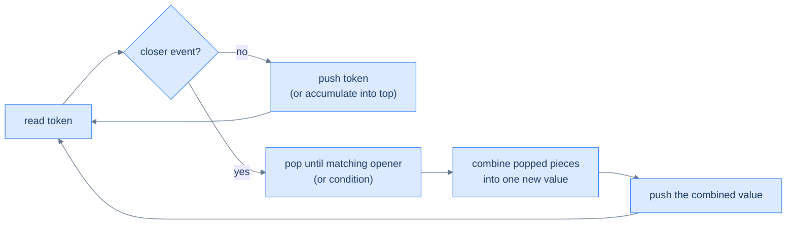

# Understanding the evaluation pattern

Three primitive operations:

- **Push** a token (operand, marker, or partial result) onto the stack.
- **Trigger** evaluation when a "closer" event fires (e.g., `]`, `)`, `..`, end-of-token).
- **Combine** the popped chunk into a single new value and push it back onto the stack.

> 🖼 Diagram — Linear evaluation — every input token either pushes a new partial result or triggers a "fold" of recently pushed parts into one combined result. The stack always holds a list of partial answers; the closer event collapses some of them.

<strong>Linear evaluation — every input token either pushes a new partial result or triggers a "fold" of recently pushed parts into one combined result. The stack always holds a list of partial answers; the closer event collapses some of them.</strong>

## Algorithm

> **Algorithm**
>
> -   **Step 1:** Initialise an empty stack.
> -   **Step 2:** For each token in the input:
>     -   Decide its kind (operand, opener, closer, multiplier, …).
>     -   Push directly, or pop-and-combine, depending on the kind.
> -   **Step 3:** After the scan, the stack holds the answer (often joined or summed across remaining elements).

# Identifying the linear evaluation pattern

Look for problems with all three of these:

1. **Single linear scan over a string or sequence.**
2. **Nesting** — sub-expressions can contain sub-sub-expressions, recursively.
3. **A "closer" token** that triggers reducing a chunk of the stack into one result.

If the input is a flat list with no nesting, you don't need this pattern. But anywhere brackets, paths, encoded substrings, or grouping operators appear, the linear-evaluation stack lights up.

<!-- ============================================== -->
<!-- SWEEP 2 — missing sections (placeholders only) -->
<!-- ============================================== -->

<!-- TODO: Why Naive Isn't Enough — missing, needs to be written -->
<!--       Guidance: motivation for why the obvious approach fails -->

<!-- TODO: The Core Idea — missing, needs to be written -->
<!--       Guidance: one paragraph: the central trick -->

<!-- TODO: How the Pointers/Window Move — missing, needs to be written -->
<!--       Guidance: mechanics of the moving parts -->

<!-- TODO: The Generic Algorithm — missing, needs to be written -->
<!--       Guidance: numbered steps, no code -->

<!-- TODO: Generic Implementation — missing, needs to be written -->
<!--       Guidance: Python block + Java block of the skeleton -->

<!-- TODO: Complexity Analysis — missing, needs to be written -->
<!--       Guidance: table -->

<!-- TODO: Variants / Taxonomy — missing, needs to be written -->
<!--       Guidance: enumerate sub-shapes of this pattern -->

<!-- TODO: Recognition Checklist — missing, needs to be written -->
<!--       Guidance: 4-question diagnostic — the source of the Problem-section Diagnostic Questions -->

<!-- TODO: Canonical Example — missing, needs to be written -->
<!--       Guidance: fully worked example: brute force → optimised → template fit -->

<!-- TODO: Problems in This Category — missing, needs to be written -->
<!--       Guidance: table with links to the 02-problems/ files -->
