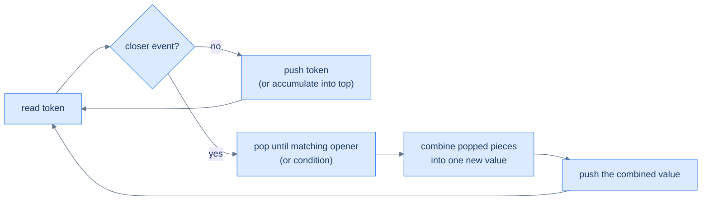

# Understanding the evaluation pattern

A single left-to-right scan transforms or evaluates the input, and the stack holds the work that is still pending. Each token is one of two kinds: a piece of data to remember, or a **trigger** that says "fold the recent data into one result now."

Three primitive operations:

- **Push** a token (operand, marker, or partial result) onto the stack.
- **Trigger** evaluation when a "closer" event fires (e.g., `]`, `)`, `..`, end-of-token).
- **Combine** the popped chunk into a single new value and push it back onto the stack.

> 🖼 Diagram — Linear evaluation — every input token either pushes a new partial result or triggers a "fold" of recently pushed parts into one combined result. The stack always holds a list of partial answers; the closer event collapses some of them.


<p align="center"><strong>Linear evaluation — every input token either pushes a new partial result or triggers a "fold" of recently pushed parts into one combined result. The stack always holds a list of partial answers; the closer event collapses some of them.</strong></p>

## Why Naive Isn't Enough

The tempting first attempt is recursion, parsing each nested group with a function that calls itself on the inner span. It works, but it re-walks shared text and pays a function-call frame per nesting level. On `3[a2[c]]`, the outer call scans `a2[c]`, the inner call scans `c`, and a deep input like `2[2[2[2[x]]]]` recurses as far as the nesting goes. The cost is the same `O(N)` reading plus the overhead and stack depth that an explicit data structure makes unnecessary.

A second attempt scans left to right but keeps only one running accumulator — the result built so far. This loses the moment a nested group opens. To make this concrete: on `3[ab]`, when `[` arrives you must set the current accumulator `ab` aside, build the inner string, then repeat it `3` times and *re-attach* it to whatever came before. A single accumulator has nowhere to stash that suspended outer context, so an inner group overwrites the work that should resume after it closes.

The missing ingredient is **suspended context, newest-first**. When a group opens, the work in progress must be parked and resumed only after the inner group folds — and groups close in the reverse order they opened. So the core insight is: evaluation needs a structure that parks each unfinished context and hands them back innermost-first, which is exactly a stack.

## The Core Idea

The stack is a **register of pending work**: every token either extends the current partial result or parks it, and the most recently parked context sits on top. Walk the input once. Data tokens — operands, characters, counts, markers — get pushed and remembered. A trigger token fires a fold: pop the recent chunk, combine it into one value, and push that single value back so the scan continues over a smaller stack.

The core insight is: a trigger always operates on the *freshest* pending context, never on something buried in the middle. When `]` arrives, the substring to fold is whatever sits between the top and its matching opener — anything pushed after that opener belongs to this group and must close first. That single rule handles arbitrary nesting with no recursion, because each fold replaces a chunk of the stack with one combined token and exposes the parked context beneath it.

The invariant the loop preserves is precise: **at every step, the stack holds the partial results and pending context produced by the tokens seen so far, in newest-on-top order.** A trigger collapses some of that into one value; at end-of-input, the remaining stack — joined, summed, or concatenated — is the answer.

## How the Stack Moves

Each token triggers one of two moves, and the stack grows by a push or shrinks by a fold-and-push per step. A fold can pop several items at once, but it always pushes exactly one combined value back, so the net stack depth tracks the nesting depth.

- **Data token → push.** Operands, characters, multipliers, and opener markers all go on top as pending context for a future trigger.
- **Trigger → fold.** Pop the chunk back to the matching opener (or while a condition holds), combine it into one value, discard the opener marker, and push the combined value back.
- **Multi-character token → slurp first.** A multi-digit count or a multi-letter name is one logical token; read all its consecutive characters before pushing, so `12[a]` pushes the count `12`, not `1` then `2`.

To make this concrete: on `2[a2[c]]`, the stack climbs to `2 [ a 2 [ c` as data arrives, then the first `]` folds `c` with count `2` into `cc` and pushes it, leaving `2 [ a cc`. The outer `]` folds `a cc` into `acc`, repeats it twice into `accacc`, and pushes that — the single remaining token and the answer.

## Algorithm

> **Algorithm**
>
> -   **Step 1:** Initialise an empty stack.
> -   **Step 2:** For each token in the input:
>     -   Decide its kind (operand, opener, closer, multiplier, …).
>     -   Push directly, or pop-and-combine, depending on the kind.
> -   **Step 3:** After the scan, the stack holds the answer (often joined or summed across remaining elements).

These three steps carry no code — they are the whole pattern in prose. Push data, fold on a trigger, and read the answer off the stack at the end. Each problem in this section specialises the steps: what counts as a data token, which token is the trigger, and how a fold combines the popped chunk.

## Complexity Analysis

> **Worst case** — Time: **O(N)** | Space: **O(N)** — only data, no triggers; every token is pushed and the stack grows to `N`.
> **Best case** — Time: **O(N)** | Space: **O(1)** — triggers fold immediately, so the stack stays near empty across the scan.

The runtime is `O(N)` time in every case, where `N` is the input length: one left-to-right pass touches each token once, and each token is pushed at most once and popped at most once during a fold, so total push/pop work is linear. The space is `O(N)` in the worst case — an input of pure data with no triggers (a path of plain directory names, a bracket-free string) pushes every token and never folds, so the stack reaches `N`. The best case is `O(1)` space when triggers fire often enough to keep the stack shallow, though the time stays `O(N)` because the whole input is still read.

## Variants / Taxonomy

Every problem here runs the same scan-and-fold loop. They differ only in what the stack *stores*, what token is the *trigger*, and how a fold *combines*:

- **Token rewriting** — store directory-name strings; the `..` trigger pops one item (move up a level), `.` and empty tokens are ignored. The return joins the stack with `/`. Path canonicalisation.
- **Span reversal** — store characters and `[` markers; the `]` trigger pops back to `[` *while appending*, which builds the reversed substring for free, then pushes it back. The return concatenates the stack.
- **Span repetition** — store counts, characters, and `[` markers; the `]` trigger pops the inner substring, pops the count just below the `[`, and pushes the substring repeated that many times. The return concatenates the stack.
- **Record aggregation** — store `(name, count)` records and `(` markers; the `)` trigger reads a multiplier, pops the group back to `(`, and multiplies every popped count before pushing the records back. The return formats the surviving records.

The shared invariant across all four is unchanged: the stack always holds the partial results and pending context in newest-on-top order. What varies is the payload — string, character, count, or record — and what a fold does with it.

# Identifying the linear evaluation pattern

Look for problems with all three of these:

1. **Single linear scan over a string or sequence.**
2. **Nesting** — sub-expressions can contain sub-sub-expressions, recursively.
3. **A "closer" token** that triggers reducing a chunk of the stack into one result.

If the input is a flat list with no nesting, you don't need this pattern. But anywhere brackets, paths, encoded substrings, or grouping operators appear, the linear-evaluation stack lights up.

**Template:**
> Scan the input once; push data tokens; on a trigger, fold the recent chunk back to its matching opener into one combined value and push it; read the answer off the stack at the end.

## Recognition Checklist

The pattern fits when **all four** answers are "yes". The first two confirm the input is a sequence with deferred evaluation; the last two confirm a stack is the right tool rather than a single accumulator or recursion.

1. **Is the input a single linear sequence you scan once, left to right?** A string or token list read in one pass, not a grid or graph you revisit.
2. **Does some token defer work — open a group whose evaluation waits for a later closer?** Brackets, parentheses, or count-prefixes that suspend the current context until the group ends.
3. **Does a trigger fold only the *most recent* pending chunk, back to its matching opener?** The chunk to combine is always on top, never buried — this is what rules out a single running accumulator.
4. **Is the answer read off the stack at end-of-input — joined, summed, or concatenated across what remains?** The result is the final stack contents, not a value computed separately.

These four questions reappear as the **Diagnostic Questions** table in every problem write-up that follows.

## Canonical Example

Walk path canonicalisation end-to-end to watch the pattern click into place.

### Problem Statement

> **Problem:** Given an absolute UNIX-style path string, return its canonical form — `.` means the current directory (ignored), `..` means the parent (drop the last directory), and runs of `//` collapse to one `/`.

Take `path = "/a/b/../c"`. The expected answer is `/a/c`.

### Brute Force

Repeatedly rewrite the string: find the leftmost `/../` or `/./` or `//`, apply its rule by splicing the string, and rescan from the start. The string shrinks until no rule applies. It works, but each splice can trigger a full rescan, so the cost is `O(N²)` time and `O(N)` space for the mutated string. The repeated scanning is pure waste — it keeps re-reading segments it has already resolved.

### Key Insight

A single stack pass replaces the repeated rewrites. The core insight is: split on `/` and treat each segment as a token — a name is data to push, `..` is a trigger that pops one item, and `.` or an empty segment is ignored. The stack always holds the directory chain so far, so `..` folds it by one level in `O(1)`. The repeated `O(N²)` rescans collapse into one `O(N)` walk because every token is touched exactly once.

### Optimized Solution

One pass with the pending-work register:

1. Initialise an empty stack of directory names.
2. Split the path on `/` and scan the segments left to right.
3. Ignore an empty segment or `.`; push any other name; on `..`, pop one item if the stack is non-empty.
4. After the pass, return `/` joined with the stack, or `/` alone if the stack is empty.

This is `O(N)` time — one pass, `O(1)` per token — and `O(N)` space for the stack when the path is all names. The Python and Java implementations live in the **Canonicalise Path** problem file.

### Trace

```
path = "/a/b/../c"   →  split on '/'  →  ['', 'a', 'b', '..', 'c']

''   empty   → ignore        → stack (bottom→top): (empty)
'a'  name    → push          → stack: a
'b'  name    → push          → stack: a b
'..' trigger → pop           → stack: a
'c'  name    → push          → stack: a c

end of input → join with '/' → "/a/c" ✓
```

### Fitting the Template

| Check | Answer for Canonicalise Path |
|---|---|
| **Q1.** Is the input a single linear sequence scanned once? | **Yes** — split on `/` and walk the segments left to right in one pass. |
| **Q2.** Does some token defer work — open a group awaiting a closer? | **Partly** — there is no nesting, but `..` defers to whatever directory is currently on top, the degenerate one-level case of the fold. |
| **Q3.** Does a trigger fold only the most recent pending chunk? | **Yes** — `..` pops exactly the top directory, never one buried deeper. |
| **Q4.** Is the answer read off the stack at end-of-input? | **Yes** — the surviving directory names, joined with `/`, are the canonical path. |

All four answers are "yes", so the linear-evaluation pattern applies. Push names, fold on `..`, and read the path off the stack at the end.

## Problems in This Category

The four problems below each specialise the pending-work register — the scan-and-fold loop is identical, but the stack payload and the trigger's combine step change:

| # | Problem | Variant | Twist on the skeleton |
|---|---|---|---|
| 1 | [Canonicalise Path](02-problems/01-canonicalise-path.md) | Token rewriting | Push directory names; `..` pops one item; join the stack with `/` |
| 2 | [Bracketed Reversal](02-problems/02-bracketed-reversal.md) | Span reversal | Push chars and `[`; on `]`, pop-while-appending to build the reversed substring |
| 3 | [String Expansion](02-problems/03-string-expansion.md) | Span repetition | Push counts, chars, `[`; on `]`, repeat the inner substring by the count below `[` |
| 4 | [Formula Parsing](02-problems/04-formula-parsing.md) | Record aggregation | Push `(name, count)` records; on `)`, multiply the popped group by the trailing count |

Difficulty rises with what the stack stores and how the fold combines. The first pushes plain strings and pops one at a time; the last stores `(atom, count)` records and multiplies a whole popped group, which is the most bookkeeping in the section.
