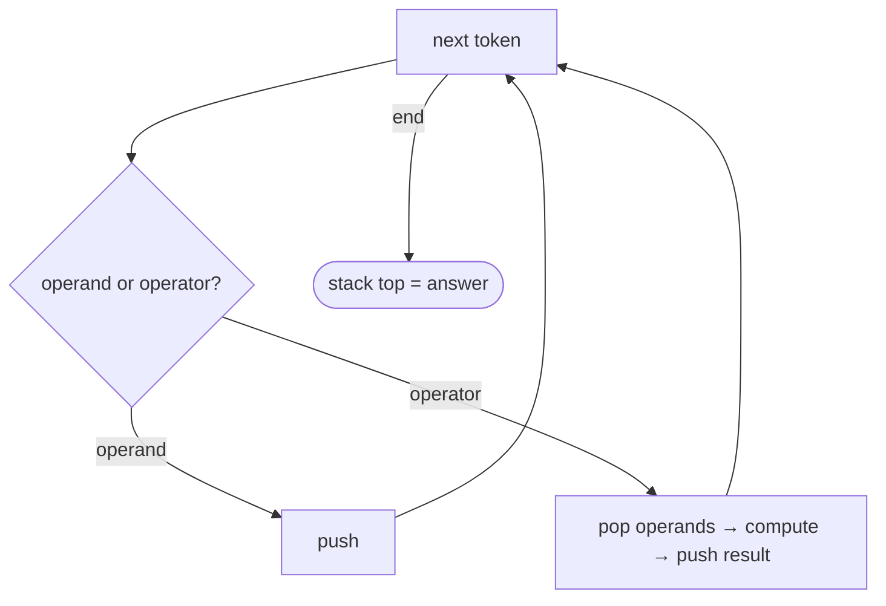

# Pattern: Linear Evaluation

## Why It Exists

You want to *evaluate* a sequence, not just validate it: compute `(2 + 1) * 3`, expand `3[ab]` to `ababab`, canonicalise the path `/a/./b/../c` to `/a/c`. The hard part of an infix expression like `3 + 4 * 2` is operator **precedence** — you can't just go left to right.

But in **postfix** form (Reverse Polish Notation), `3 4 2 * +`, precedence is already baked into the order. Now a single left-to-right scan suffices: operands wait on a stack until an operator arrives and consumes the right number of them. Push operands; when an operator fires, pop its operands, compute, and push the result back as a new operand. After the scan, the one value left on the stack is the answer. The stack is doing the bookkeeping that precedence rules would otherwise force you to manage by hand.

## See It Work

Evaluate the postfix expression `2 1 + 3 *` — that's `(2 + 1) * 3 = 9`. Run it, then **Visualise** operands pile up and collapse as each operator fires.

> ▶ Run it, then click **Visualise** — numbers push; an operator pops two operands, computes, and pushes the result back.

```python run viz=array viz-root=stack viz-kind=stack
def eval_rpn(tokens):
    ops = {'+': lambda a, b: a + b, '-': lambda a, b: a - b,
           '*': lambda a, b: a * b, '/': lambda a, b: int(a / b)}
    stack = []
    for t in tokens:
        if t in ops:
            b = stack.pop()              # right operand (popped first)
            a = stack.pop()              # left operand
            stack.append(ops[t](a, b))   # push the result back
        else:
            stack.append(int(t))         # operand → wait on the stack
    return stack[-1]

print(eval_rpn(["2", "1", "+", "3", "*"]))   # 9
```

## How It Works

Scan the tokens once, keeping a stack of operands and intermediate results:

1. **Operand** → push it. It's pending work, waiting for an operator.
2. **Operator** → it needs operands. Pop the two most recent, apply the operation, and push the result — which is itself now an operand for whatever comes next.
3. **End** → exactly one value remains; that's the result.



<p align="center"><strong>operands push and wait; each operator pops the operands it needs, computes, and pushes the result back as a new operand.</strong></p>

The order of the two pops matters for **non-commutative** operators: the *first* value popped is the **right** operand, the second is the **left**. Get it backwards and `-` and `/` silently compute `b − a` instead of `a − b`. Each token is handled once with `O(1)` stack work → **`O(n)` time, `O(n)` space.**

### Key Takeaway

Evaluate postfix in one pass: push operands, and on each operator pop its operands, compute, and push the result back. The stack replaces precedence bookkeeping — just mind the pop order (first popped = right operand) for `-` and `/`.

## Trace It

Evaluating `2 1 + 3 *`:

| token | action | stack (bottom → top) |
|---|---|---|
| `2` | push | `2` |
| `1` | push | `2 1` |
| `+` | pop `1`, `2` → `3` → push | `3` |
| `3` | push | `3 3` |
| `*` | pop `3`, `3` → `9` → push | `9` |
| end | answer = `9` | — |

Before you read on: at `+` we popped `1` then `2`. For `+` the order doesn't matter, but suppose the operator were `-`. Which of `1` and `2` is the *left* operand, and what would the result be if you mixed them up?

The *second* value popped (`2`) is the left operand and the *first* popped (`1`) is the right, so `-` gives `2 − 1 = 1`. Swap them and you'd compute `1 − 2 = −1` — wrong. The stack returns operands in reverse of how they were pushed, so the later-pushed value (the right operand in the original expression) comes off first. Commutative operators (`+`, `*`) hide this bug; `-` and `/` expose it immediately, which is why getting the pop order right is the one thing to be careful about in this pattern.

## Your Turn

The reusable postfix evaluator:

```python run
def eval_rpn(tokens):
    ops = {'+': lambda a, b: a + b, '-': lambda a, b: a - b,
           '*': lambda a, b: a * b, '/': lambda a, b: int(a / b)}
    stack = []
    for t in tokens:
        if t in ops:
            b = stack.pop(); a = stack.pop()
            stack.append(ops[t](a, b))
        else:
            stack.append(int(t))
    return stack[-1]

print(eval_rpn(["4", "13", "5", "/", "+"]))                  # 4 + (13/5=2) = 6
print(eval_rpn(["5", "1", "2", "+", "4", "*", "+", "3", "-"]))   # 14
```

```java run
import java.util.*;

public class Main {
  static int evalRpn(String[] tokens) {
    Deque<Integer> stack = new ArrayDeque<>();
    for (String t : tokens) {
      switch (t) {
        case "+": case "-": case "*": case "/": {
          int b = stack.pop(), a = stack.pop();   // first popped = right operand
          stack.push(t.equals("+") ? a + b : t.equals("-") ? a - b : t.equals("*") ? a * b : a / b);
          break;
        }
        default: stack.push(Integer.parseInt(t));
      }
    }
    return stack.peek();
  }

  public static void main(String[] args) {
    System.out.println(evalRpn(new String[]{"4", "13", "5", "/", "+"}));   // 6
    System.out.println(evalRpn(new String[]{"5", "1", "2", "+", "4", "*", "+", "3", "-"}));   // 14
  }
}
```

Drill the family in **Practice** — [Canonicalise Path](/cortex/data-structures-and-algorithms/linear-structures-stack-pattern-linear-evaluation-problems-canonicalise-path), [Bracketed Reversal](/cortex/data-structures-and-algorithms/linear-structures-stack-pattern-linear-evaluation-problems-bracketed-reversal), [String Expansion](/cortex/data-structures-and-algorithms/linear-structures-stack-pattern-linear-evaluation-problems-string-expansion), and [Formula Parsing](/cortex/data-structures-and-algorithms/linear-structures-stack-pattern-linear-evaluation-problems-formula-parsing).

## Reflect & Connect

"Push pending work, resolve it when a trigger fires" is the shape of every linear evaluator:

- **The family** — postfix arithmetic (above), **path canonicalisation** (push directory names; `..` pops one; `.` is a no-op), **string expansion** (`3[ab]` — push counts and segments, resolve on `]`), and **formula parsing**. The "trigger" is an operator, a delimiter, or a closing bracket.
- **The stack holds deferred work** — operands and partial results wait until there's enough context to combine them. That's the same instinct as the validation pattern, but now you *compute* on pop instead of merely matching.
- **It's the back half of a calculator** — convert infix to postfix (the shunting-yard algorithm, which uses an *operator* stack to resolve precedence), then evaluate the postfix with this pattern. Together they're how calculators and compilers turn `3 + 4 * 2` into `11`.

**Prerequisites:** [What Is a Stack?](/cortex/data-structures-and-algorithms/linear-structures-stack-what-is-a-stack).

## Recall

> **Mnemonic:** *Operand → push. Operator → pop operands, compute, push result. First popped = right operand. End: one value = the answer.*

| | |
|---|---|
| Operand | push (pending work) |
| Operator | pop the operands → compute → push the result |
| Pop order | first popped = **right** operand, second = **left** (matters for `−`, `/`) |
| End | a single value on the stack = the result |
| Cost | `O(n)` time, `O(n)` space |

- **Q:** Why is postfix easier to evaluate than infix? **A:** Postfix encodes precedence in the token order, so a single left-to-right pass with a stack needs no precedence rules.
- **Q:** What does the stack hold during evaluation? **A:** Operands and intermediate results — pending work waiting for an operator to combine them.
- **Q:** Which popped value is the left operand, and why care? **A:** The *second* popped is the left operand; mixing up the order breaks non-commutative `−` and `/`.
- **Q:** How does a full calculator use this? **A:** Convert infix → postfix (shunting-yard, an operator stack), then evaluate the postfix with this pattern.

## Sources & Verify

- **CLRS**, *Introduction to Algorithms*, 4th ed., §10.1 — stacks.
- **Sedgewick & Wayne**, *Algorithms*, 4th ed., §1.3 — stacks; Dijkstra's two-stack expression evaluation and the shunting-yard algorithm.
- Postfix (RPN) evaluation via a stack is the canonical example; both runnable blocks are verified by running (`2 1 + 3 * = 9`, `4 13 5 / + = 6`, and `5 1 2 + 4 * + 3 - = 14`).
