# Canonicalise path

## Problem Statement

Given an absolute UNIX-style path string, return its canonical form.

> -   `.` (dot) → current directory, ignored.
> -   `..` (double-dot) → parent directory, removes the last directory.
> -   `//` (multiple slashes) → treated as a single slash.
> -   Anything else is a directory name.

The output must:
- Begin with exactly one `/`.
- Have single-slash separators.
- Have no trailing slash (except for the root `/`).
- Have no `.` or `..`.

### Example 1
> -   **Input:** `/a/b/../c` → **Output:** `/a/c`

### Example 2
> -   **Input:** `/a/./../c` → **Output:** `/c`

### Example 3
> -   **Input:** `/a//b/c/../` → **Output:** `/a/b`

<details>
<summary><h2>Approach</h2></summary>


Split on `/`. Each non-empty token is one of three things:

- `.` → ignore.
- `..` → pop the stack (move up one directory). If empty, do nothing (already at root).
- anything else → push as a directory name.

Final path = `/` + `'/'.join(stack)` (or just `/` if empty).

> 🖼 Diagram — Canonicalise path — each token decides its action: push, pop, or skip. The final stack is the path's directory list, joined with slashes.

```mermaid
---
config:
  theme: base
  themeVariables:
    primaryColor: "#dbeafe"
    primaryBorderColor: "#3b82f6"
    primaryTextColor: "#1e3a5f"
    lineColor: "#64748b"
    secondaryColor: "#ede9fe"
    tertiaryColor: "#fef9c3"
---
flowchart LR
    A["/a/b/../c"] -->|"split"| B["[a, b, .., c]"]
    B --> C["scan tokens"]
    C --> S1["push 'a' → [a]"]
    S1 --> S2["push 'b' → [a, b]"]
    S2 --> S3["'..' → pop → [a]"]
    S3 --> S4["push 'c' → [a, c]"]
    S4 --> R["join → '/a/c'"]
    style R fill:#dcfce7,stroke:#22c55e
```


<p align="center"><strong>Canonicalise path — each token decides its action: push, pop, or skip. The final stack <em>is</em> the path's directory list, joined with slashes.</strong></p>

</details>
<details>
<summary><h2>Solution</h2></summary>


```python run
from typing import List

class Solution:
    def canonicalise_path(self, path: str) -> str:

        # Stack to store valid directory names
        stack: List[str] = []

        # Split the path by '/' and iterate over components
        for token in path.split("/"):

            # Skip empty or current directory ('.') components
            if token == "" or token == ".":
                continue

            # Push the valid directory name onto the stack
            elif token != "..":
                stack.append(token)

            # Go up one directory if the current directory is '..' and
            # the stack is not empty
            elif stack:
                stack.pop()

        # If the stack is empty, return "/"
        if not stack:
            return "/"

        # Construct the simplified path by joining stack elements
        return "/" + "/".join(stack)


# Examples from the problem statement
print(Solution().canonicalise_path("/a/b/../c"))    # /a/c
print(Solution().canonicalise_path("/a/./../c"))    # /c
print(Solution().canonicalise_path("/a//b/c/../"))  # /a/b

# Edge cases
print(Solution().canonicalise_path("/"))            # /
print(Solution().canonicalise_path("/.."))          # / — can't go above root
print(Solution().canonicalise_path("/."))           # /
print(Solution().canonicalise_path("/a/b/c"))       # /a/b/c
print(Solution().canonicalise_path("/a/../../b"))   # /b
print(Solution().canonicalise_path("//home//foo/")) # /home/foo
```

```java run
import java.util.*;

public class Main {
    static class Solution {
        public String canonicalisePath(String path) {

            // Stack to store valid directory names
            Stack<String> stack = new Stack<>();

            // Split the path by '/' and iterate over components
            for (String token : path.split("/")) {

                // Skip empty or current directory ('.') components
                if (token.equals("") || token.equals(".")) {
                    continue;
                }

                // Push the valid directory name onto the stack
                else if (!token.equals("..")) {
                    stack.push(token);
                }

                // Go up one directory if the current directory is '..' and
                // the stack is not empty
                else if (!stack.isEmpty()) {
                    stack.pop();
                }
            }

            // If the stack is empty, return "/"
            if (stack.isEmpty()) {
                return "/";
            }

            // Construct the simplified path by popping the stack
            StringBuilder result = new StringBuilder();
            for (String dir : stack) {
                result.append("/").append(dir);
            }

            return result.toString();
        }
    }

    public static void main(String[] args) {
        // Examples from the problem statement
        System.out.println(new Solution().canonicalisePath("/a/b/../c"));    // /a/c
        System.out.println(new Solution().canonicalisePath("/a/./../c"));    // /c
        System.out.println(new Solution().canonicalisePath("/a//b/c/../"));  // /a/b

        // Edge cases
        System.out.println(new Solution().canonicalisePath("/"));            // /
        System.out.println(new Solution().canonicalisePath("/.."));          // /
        System.out.println(new Solution().canonicalisePath("/."));           // /
        System.out.println(new Solution().canonicalisePath("/a/b/c"));       // /a/b/c
        System.out.println(new Solution().canonicalisePath("/a/../../b"));   // /b
        System.out.println(new Solution().canonicalisePath("//home//foo/")); // /home/foo
    }
}
```

</details>

<!-- ============================================== -->
<!-- SWEEP 2 — missing sections (placeholders only) -->
<!-- ============================================== -->

<!-- TODO: Examples — missing, needs to be written -->
<!--       Guidance: min 3 examples: basic / variant / edge -->

<!-- TODO: Intuition — missing, needs to be written -->
<!--       Guidance: 3 paragraphs: brute force / observation / pattern fit -->

<!-- TODO: Applying the Diagnostic Questions — missing, needs to be written -->
<!--       Guidance: REQUIRED, never optional -->
<!--       Guidance: 4-row table. Columns: 'Check' | 'Answer for [Problem Name]' -->
<!--       Guidance: Rows: two positions simultaneously / one near start one near end / both move inward / simple O(1) work at each step -->

<!-- TODO: Approach — missing, needs to be written -->
<!--       Guidance: numbered steps, no code -->

<!-- TODO: Solution — missing, needs to be written -->
<!--       Guidance: Python block then Java block -->

<!-- TODO: Dry Run — missing, needs to be written -->
<!--       Guidance: walk through a small example step by step -->

<!-- TODO: Complexity Analysis — missing, needs to be written -->
<!--       Guidance: table: time / space / why -->

<!-- TODO: Edge Cases — missing, needs to be written -->
<!--       Guidance: table, min 5 rows -->

<!-- TODO: Key Takeaway — missing, needs to be written -->
<!--       Guidance: 1–2 sentences -->
