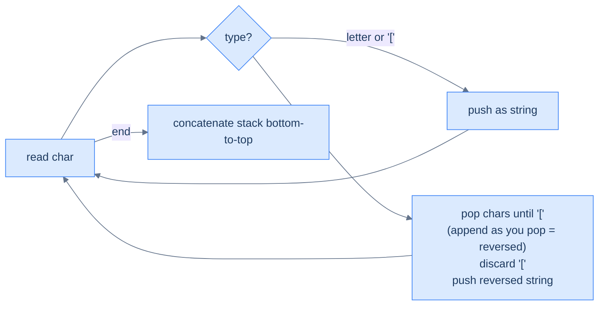

# Bracketed Reversal

## Problem Statement

Given a string of letters and `[`/`]` brackets, **reverse the substring inside each pair of brackets** and return the result. Brackets nest.

### Example 1
> -   **Input:** `s = "a[bcd]e"` → **Output:** `"adcbe"`

### Example 2
> -   **Input:** `s = "abcd[ef[gh]i]j"` → **Output:** `"abcdihgfej"`

### Example 3
> -   **Input:** `s = "abcdefghij"` → **Output:** `"abcdefghij"`

<details>
<summary><h2>Approach</h2></summary>


Push characters and `[` onto a stack. On `]`, pop characters until you hit `[` — but **append them as you pop**, which builds the reversed substring naturally. Pop the `[`, push the reversed substring back as a single string token. Final answer = concatenate the stack bottom-to-top.

> 🖼 Diagram — Bracketed reversal — popping while appending naturally builds the reversed substring (the topmost char comes out first and goes to the front of the result).


<p align="center"><strong>Bracketed reversal — popping while appending naturally builds the reversed substring (the topmost char comes out first and goes to the front of the result).</strong></p>

</details>
<details>
<summary><h2>Solution</h2></summary>


```python run
from typing import List

class Solution:
    def bracketed_reversal(self, s: str) -> str:

        # Stack to store characters and decoded parts
        stack: List[str] = []

        i: int = 0
        while i < len(s):

            # If the character is '[' or a letter, push it as a string
            if s[i] == "[" or s[i].isalpha():
                stack.append(s[i])

            # If the character is ']', it indicates the end of a
            # bracketed section
            else:

                # Variable to store the substring inside the brackets
                reversed_str = ""

                # Pop elements from the stack until we reach '['
                while stack and stack[-1] != "[":

                    # Build substring in reversed order
                    reversed_str += stack.pop()

                # Remove the '[' from the stack
                if stack:
                    stack.pop()

                # Push the reversed substring back onto the stack
                stack.append(reversed_str)

            i += 1

        # Return the final decoded string
        return "".join(stack)


# Examples from the problem statement
print(Solution().bracketed_reversal("a[bcd]e"))       # adcbe
print(Solution().bracketed_reversal("abcd[ef[gh]i]j")) # abcdihgfej
print(Solution().bracketed_reversal("abcdefghij"))     # abcdefghij

# Edge cases
print(Solution().bracketed_reversal(""))               # ''
print(Solution().bracketed_reversal("[a]"))            # a
print(Solution().bracketed_reversal("[ab]"))           # ba
print(Solution().bracketed_reversal("[[ab]]"))         # ab — double nesting reverses back
print(Solution().bracketed_reversal("x[y[z]]"))        # xzy
```

```java run
import java.util.*;

public class Main {
    static class Solution {
        public String bracketedReversal(String s) {

            // Stack to store characters and decoded parts
            Stack<String> stack = new Stack<>();

            for (int i = 0; i < s.length(); i++) {

                // If the character is '[' or a letter, push it as a string
                if (s.charAt(i) == '[' || Character.isLetter(s.charAt(i))) {
                    stack.push(String.valueOf(s.charAt(i)));
                }

                // If the character is ']', it indicates the end of a
                // bracketed section
                else {

                    // Variable to store the substring inside the brackets
                    StringBuilder reversedStr = new StringBuilder();

                    // Pop elements from the stack until we reach '['
                    while (!stack.isEmpty() && !stack.peek().equals("[")) {

                        // Build substring in reversed order
                        reversedStr.append(stack.pop());
                    }

                    // Remove the '[' from the stack
                    if (!stack.isEmpty()) {
                        stack.pop();
                    }

                    // Push the reversed substring back onto the stack
                    stack.push(reversedStr.toString());
                }
            }

            // Collect the final result by popping from the stack
            StringBuilder result = new StringBuilder();
            while (!stack.isEmpty()) {

                // Prepend the elements to the result string
                result.insert(0, stack.pop());
            }

            // Return the final decoded string
            return result.toString();
        }
    }

    public static void main(String[] args) {
        // Examples from the problem statement
        System.out.println(new Solution().bracketedReversal("a[bcd]e"));        // adcbe
        System.out.println(new Solution().bracketedReversal("abcd[ef[gh]i]j")); // abcdihgfej
        System.out.println(new Solution().bracketedReversal("abcdefghij"));      // abcdefghij

        // Edge cases
        System.out.println(new Solution().bracketedReversal(""));                // ''
        System.out.println(new Solution().bracketedReversal("[a]"));             // a
        System.out.println(new Solution().bracketedReversal("[ab]"));            // ba
        System.out.println(new Solution().bracketedReversal("[[ab]]"));          // ab
        System.out.println(new Solution().bracketedReversal("x[y[z]]"));         // xzy
    }
}
```

</details>

<!-- ============================================== -->
<!-- SWEEP 2 — missing sections (placeholders only) -->
<!-- ============================================== -->

<!-- TODO: Examples — missing, needs to be written -->
<!--       Guidance: min 3 examples: basic / variant / edge -->

<!-- TODO: Intuition — missing, needs to be written -->
<!--       Guidance: 3 paragraphs: brute force / observation / pattern fit -->

<!-- TODO: Applying the Diagnostic Questions — missing, needs to be written -->
<!--       Guidance: REQUIRED, never optional -->
<!--       Guidance: 4-row table. Columns: 'Check' | 'Answer for [Problem Name]' -->
<!--       Guidance: Rows: two positions simultaneously / one near start one near end / both move inward / simple O(1) work at each step -->

<!-- TODO: Approach — missing, needs to be written -->
<!--       Guidance: numbered steps, no code -->

<!-- TODO: Solution — missing, needs to be written -->
<!--       Guidance: Python block then Java block -->

<!-- TODO: Dry Run — missing, needs to be written -->
<!--       Guidance: walk through a small example step by step -->

<!-- TODO: Complexity Analysis — missing, needs to be written -->
<!--       Guidance: table: time / space / why -->

<!-- TODO: Edge Cases — missing, needs to be written -->
<!--       Guidance: table, min 5 rows -->

<!-- TODO: Key Takeaway — missing, needs to be written -->
<!--       Guidance: 1–2 sentences -->
