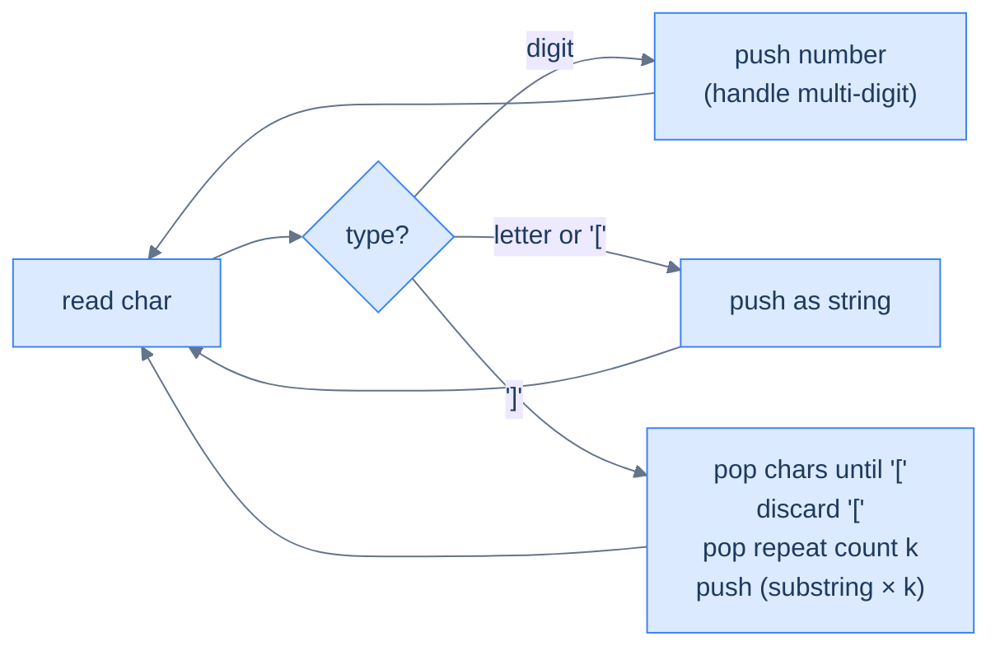

# String expansion

## Problem Statement

Given a string encoded with `k[substring]` notation (k a positive integer, substring possibly nested), return the decoded string. The encoding repeats the substring `k` times.

### Example 1
> -   **Input:** `"2[ab3[c]]"` → **Output:** `"abcccabccc"`

### Example 2
> -   **Input:** `"3[a]2[bc]"` → **Output:** `"aaabcbc"`

### Example 3
> -   **Input:** `"2[abc]3[cd]ef"` → **Output:** `"abcabccdcdcdef"`

<details>
<summary><h2>Approach</h2></summary>


Same shape as bracketed reversal but the closer triggers a *repeat*, not a reverse. Push numbers (as strings), letters, and `[`. On `]`, pop the inner substring, pop the `[`, pop the repeat count (which is just before `[`), expand, push back.

> 🖼 Diagram — String expansion — closer fires the substring×k folding. Multi-digit numbers (e.g. 12[ab]) are handled by reading consecutive digits before pushing the count as one string.


<p align="center"><strong>String expansion — closer fires the substring×k folding. Multi-digit numbers (e.g. 12[ab]) are handled by reading consecutive digits before pushing the count as one string.</strong></p>

</details>
<details>
<summary><h2>Solution</h2></summary>


```python run
from typing import List

class Solution:
    def string_expansion(self, s: str) -> str:

        # Stack to store characters, numbers, and decoded parts
        stack: List[str] = []

        i: int = 0
        while i < len(s):

            # If the current character is a digit, extract the full
            # number
            if s[i].isdigit():
                start: int = i

                # Extract the full number (handles multi-digit numbers)
                while i < len(s) and s[i].isdigit():
                    i += 1

                # Push the number as a string to the stack
                stack.append(s[start:i])

                # Adjust index because loop will increment i
                i -= 1

            # If the character is '[' or a letter, push it to the stack
            elif s[i] == "[" or s[i].isalpha():
                stack.append(s[i])

            # If the character is ']', it indicates the end of an
            # encoded section
            elif s[i] == "]":

                # Variable to store the decoded part inside the brackets
                decoded_str: str = ""

                # Pop characters from the stack until we reach '['
                while stack and stack[-1] != "[":
                    decoded_str = stack.pop() + decoded_str

                # Remove the '[' from the stack
                stack.pop()

                # Get the repeat count (the number just before '[')
                repeat_count: int = int(stack.pop())

                # Expand the string by repeating it 'repeat_count' times
                stack.append(decoded_str * repeat_count)

            i += 1

        # Return the final decoded string
        return "".join(stack)


# Examples from the problem statement
print(Solution().string_expansion("2[ab3[c]]"))    # abcccabccc
print(Solution().string_expansion("3[a]2[bc]"))    # aaabcbc
print(Solution().string_expansion("2[abc]3[cd]ef")) # abcabccdcdcdef

# Edge cases
print(Solution().string_expansion(""))             # ''
print(Solution().string_expansion("abc"))          # abc — no encoding
print(Solution().string_expansion("1[a]"))         # a
print(Solution().string_expansion("10[a]"))        # aaaaaaaaaa — multi-digit count
print(Solution().string_expansion("2[3[x]]"))      # xxxxxx
```

```java run
import java.util.*;

public class Main {
    static class Solution {
        public String stringExpansion(String s) {

            // Stack to store characters, numbers, and decoded parts
            Stack<String> stack = new Stack<>();

            for (int i = 0; i < s.length(); i++) {

                // If the current character is a digit, extract the full
                // number
                if (Character.isDigit(s.charAt(i))) {
                    int start = i;

                    // Extract the full number (handles multi-digit numbers)
                    while (
                        i < s.length() && Character.isDigit(s.charAt(i))
                    ) {
                        i++;
                    }

                    // Push the number as a string to the stack
                    stack.push(s.substring(start, i));

                    // Adjust index because loop will increment i
                    i--;
                }

                // If the character is '[' or a letter, push it to the stack
                else if (
                    s.charAt(i) == '[' || Character.isLetter(s.charAt(i))
                ) {

                    // Push characters and '[' directly to the stack
                    stack.push(String.valueOf(s.charAt(i)));
                }

                // If the character is ']', it indicates the end of an
                // encoded section
                else if (s.charAt(i) == ']') {

                    // Variable to store the decoded part inside the brackets
                    StringBuilder decodedStr = new StringBuilder();

                    // Pop characters from the stack until we reach '['
                    while (!stack.isEmpty() && !stack.peek().equals("[")) {

                        // Prepend the characters to decodedStr
                        decodedStr.insert(0, stack.pop());
                    }

                    // Remove the '[' from the stack
                    stack.pop();

                    // Get the repeat count (the number just before '[')
                    int repeatCount = Integer.parseInt(stack.pop());

                    // Expand the string by repeating it 'repeatCount' times
                    StringBuilder expandedStr = new StringBuilder();
                    while (repeatCount-- > 0) {

                        // Append the decoded string repeatedly
                        expandedStr.append(decodedStr);
                    }

                    // Push the expanded string back to the stack
                    stack.push(expandedStr.toString());
                }
            }

            // Collect the final result by popping from the stack
            StringBuilder result = new StringBuilder();
            while (!stack.isEmpty()) {

                // Prepend the elements to the result string
                result.insert(0, stack.pop());
            }

            // Return the final decoded string
            return result.toString();
        }
    }

    public static void main(String[] args) {
        // Examples from the problem statement
        System.out.println(new Solution().stringExpansion("2[ab3[c]]"));     // abcccabccc
        System.out.println(new Solution().stringExpansion("3[a]2[bc]"));     // aaabcbc
        System.out.println(new Solution().stringExpansion("2[abc]3[cd]ef")); // abcabccdcdcdef

        // Edge cases
        System.out.println(new Solution().stringExpansion(""));              // ''
        System.out.println(new Solution().stringExpansion("abc"));           // abc
        System.out.println(new Solution().stringExpansion("1[a]"));          // a
        System.out.println(new Solution().stringExpansion("10[a]"));         // aaaaaaaaaa
        System.out.println(new Solution().stringExpansion("2[3[x]]"));       // xxxxxx
    }
}
```

</details>

<!-- ============================================== -->
<!-- SWEEP 2 — missing sections (placeholders only) -->
<!-- ============================================== -->

<!-- TODO: Examples — missing, needs to be written -->
<!--       Guidance: min 3 examples: basic / variant / edge -->

<!-- TODO: Intuition — missing, needs to be written -->
<!--       Guidance: 3 paragraphs: brute force / observation / pattern fit -->

<!-- TODO: Applying the Diagnostic Questions — missing, needs to be written -->
<!--       Guidance: REQUIRED, never optional -->
<!--       Guidance: 4-row table. Columns: 'Check' | 'Answer for [Problem Name]' -->
<!--       Guidance: Rows: two positions simultaneously / one near start one near end / both move inward / simple O(1) work at each step -->

<!-- TODO: Approach — missing, needs to be written -->
<!--       Guidance: numbered steps, no code -->

<!-- TODO: Solution — missing, needs to be written -->
<!--       Guidance: Python block then Java block -->

<!-- TODO: Dry Run — missing, needs to be written -->
<!--       Guidance: walk through a small example step by step -->

<!-- TODO: Complexity Analysis — missing, needs to be written -->
<!--       Guidance: table: time / space / why -->

<!-- TODO: Edge Cases — missing, needs to be written -->
<!--       Guidance: table, min 5 rows -->

<!-- TODO: Key Takeaway — missing, needs to be written -->
<!--       Guidance: 1–2 sentences -->
