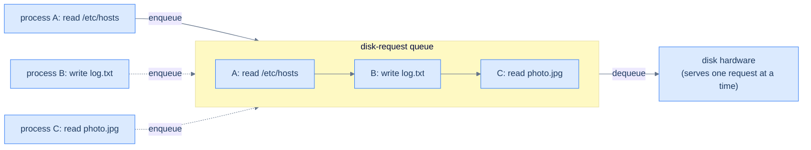
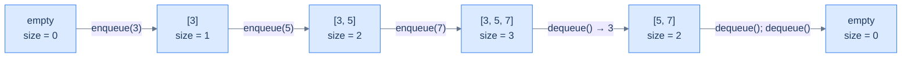
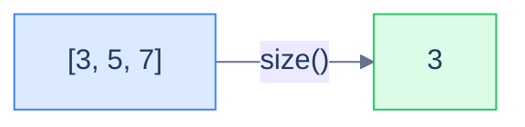
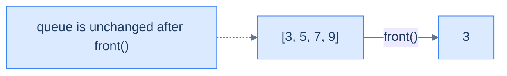
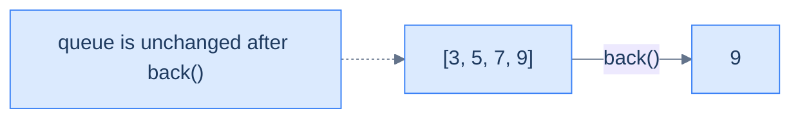

# 1. Introduction to Queues

## The Hook

Imagine the line at a coffee shop. The customer who walked in first is the one being served right now — *not* the one who sauntered in two minutes ago and tried to skip ahead. Newcomers join the back of the line and patiently wait their turn. The first person *in* is the first person *out*. Anything else would feel like cheating, and anyone who tried it would (rightly) get yelled at.

That fairness rule — **First In, First Out** — is everywhere in computing once you start looking. The print spooler queues your documents in the order you submitted them. The OS scheduler queues runnable threads. Every web server on Earth queues incoming requests. Network packets line up in router buffers. Keyboard events line up to be delivered to your application. **Breadth-first search**, the workhorse of pathfinding, level-order tree traversals, network analysis, and much of game AI, is — at its core — *just a queue*. Take that away and the algorithm doesn't work.

The data structure that makes all of these tick is called a **queue**. It's the natural counterpart to the stack: where a stack is *LIFO* (most recent first, the last plate you put on the pile is the first one you grab), a queue is *FIFO* — oldest first, fairness by construction. Two open ends, one for adding and one for removing, and a strict rule that *new arrivals go to the back, departures leave from the front*. That single rule is enough to underpin most of the asynchronous, ordered, and breadth-first computation we do.

This lesson lays the foundation: the FIFO contract, the four properties every queue tracks (capacity, size, front, back), and the five-method API (enqueue, dequeue, size, front, back). The next two lessons make it real — first with a clever circular array, then with a linked list. The lesson after that closes with two famous interview questions: *can you build a queue out of stacks, and can you build a stack out of queues?*

---

## Table of contents

1. [Understanding the problem](#understanding-the-problem)
2. [Exploring a possible solution](#exploring-a-possible-solution)
3. [Key properties of a queue](#key-properties-of-a-queue)
4. [Overview of supported operations](#overview-of-supported-operations)
5. [Internal mechanics](#internal-mechanics)
6. [Working example](#working-example)
7. [Edge cases and pitfalls](#edge-cases-and-pitfalls)
8. [Production reality](#production-reality)
9. [Quiz](#quiz)
10. [Practice ladder](#practice-ladder)
11. [Further reading](#further-reading)
12. [Cross-links](#cross-links)
13. [Final takeaway](#final-takeaway)

***

# Understanding the problem

Some problems demand the *opposite* of a stack's discipline: data must be processed in the **same order it arrived**. The first item in must be the first one out — sometimes called **First In, First Out (FIFO)**, or equivalently **First In, Last Out... no wait**, that's wrong. The right alias is **Last In, Last Out (LILO)** — emphasising the same fact from the *other* end. Whichever name you use, the contract is identical: the order of removal mirrors the order of insertion.

```d2
direction: right

inq: "enqueue order (in)" {
  grid-columns: 4
  grid-gap: 0
  e0: "1"
  e1: "2"
  e2: "3"
  e3: "4"
}

outq: "dequeue order (out)" {
  grid-columns: 4
  grid-gap: 0
  e0: "1"
  e1: "2"
  e2: "3"
  e3: "4"
}

inq -> outq: FIFO
```

<p align="center"><strong>FIFO in one picture — items 1, 2, 3, 4 went in <em>in that order</em>; they come out in the <em>same</em> order. The earliest insertion is always the next one out. Compare this to a stack, where the order would be reversed.</strong></p>

> **First In, First Out (FIFO)** — sometimes called **Last In, Last Out (LILO)** — is the discipline of processing items in the order they arrived. The first item enqueued is the first one dequeued; the last item enqueued waits behind everything else. Fairness is built in.

Why does anyone need this? Three real-world examples that almost certainly run on your computer right now.

## Music players

Your music app's "play queue" is exactly that — a queue. You add songs to the *back* of the list. The player consumes them from the *front*. The song you queued first plays first, the one you queued last plays last. If the player swapped the order — playing the latest song first and burying the one you actually wanted — you'd uninstall the app. The FIFO contract isn't a polite preference here; it's *what makes the feature work*.

```d2
q: "play queue (front on the left, back on the right)" {
  grid-columns: 4
  grid-gap: 0
  s1: |md
    **Song A**

    (playing)
  | {style.fill: "#dcfce7"; style.stroke: "#22c55e"}
  s2: "Song B"
  s3: "Song C"
  s4: |md
    **Song D**

    just added
  | {style.fill: "#fef9c3"; style.stroke: "#f59e0b"}
}

front_label: front { shape: oval }
back_label: back { shape: oval }
front_label -> q.s1
back_label -> q.s4
```

<p align="center"><strong>Music player queue — you add to the back; the player pulls from the front. The earliest-queued song plays now; the most-recently-queued song waits behind everything else. Pure FIFO.</strong></p>

## Call centres

Pick up the phone, dial a customer service line, and you join an *invisible* queue. The system pushes your call onto the back of the waiting list. As agents free up, the system pulls calls from the front. The hold-music politeness — *"You are the seventh caller in queue"* — is literally announcing your index in a FIFO data structure. Reverse the order, and the unlucky person who called *first* would never get served as fresh callers keep cutting in front. FIFO is *fairness as code*.

```d2
direction: right

newcall: new caller { shape: oval }
agent: next available agent { shape: oval }

q: "call queue" {
  grid-columns: 4
  grid-gap: 0
  c1: |md
    **caller #4**

    longest wait
  | {style.fill: "#dcfce7"; style.stroke: "#22c55e"}
  c2: "caller #5"
  c3: "caller #6"
  c4: "caller #7"
}

newcall -> q.c4: enqueue
q.c1 -> agent: dequeue
```

<p align="center"><strong>Call-centre queueing — calls flow in from the right (newest), agents pick up from the left (oldest). The front of the queue is whoever has been waiting the longest, and that's exactly who deserves to be served next.</strong></p>

## Disk and OS scheduling

A spinning hard disk can do *one* read or write at a time. When five processes simultaneously ask the disk to fetch a file, the OS doesn't run them in parallel — it queues the requests and serves them in order. The same pattern shows up in print spoolers, network-packet buffers, the OS task scheduler, the ready-queue in any modern operating system. Anywhere a single resource is being shared by many requesters, *something* has to decide who goes next, and FIFO is the most defensible default — no one's request gets perpetually starved.



<p align="center"><strong>Disk-request scheduling — multiple processes submit requests; the OS queues them and feeds them to the hardware one at a time. Without a queue, the disk would be the contention point and requests would clobber each other or starve.</strong></p>

These three are the tip of the iceberg. **Breadth-first search** uses a queue to explore graphs level-by-level. **Producer–consumer pipelines** use queues to decouple producers from consumers. **Message brokers** (Kafka, RabbitMQ, SQS) are essentially networked queues. **Async/await runtimes** schedule tasks via queues. Once you spot the pattern, you'll see it everywhere — and the data structure that makes it all tractable is the **queue**.

***

# Exploring a possible solution

A queue is a **linear container** with a very specific restriction: data may be **added at one end** (the *back*, also called the *rear* or *tail*) and **removed from the other end** (the *front*, also called the *head*). Two open ends, each dedicated to a single direction of traffic. The opposite ends are what create the FIFO property; if both ends were interchangeable, you'd have a deque (double-ended queue), not a queue.

## Queue of people

The image is right there in the supermarket. A queue of people at a checkout till:

- A new customer joins **at the back**. (enqueue)
- The cashier serves whoever is **at the front**. (dequeue)
- The first customer to arrive is the first to leave; the last to arrive waits behind everyone else.
- Cutting in line — inserting in the middle — is forbidden by social contract (and by the data structure).

```d2
direction: right

newcomer: new customer { shape: oval }
exit_lbl: exit { shape: oval }

line: "queue at the till" {
  grid-columns: 4
  grid-gap: 0
  f: |md
    **front**

    being served
  | {style.fill: "#dcfce7"; style.stroke: "#22c55e"}
  c2: "customer 2"
  c3: "customer 3"
  b: |md
    **back**

    latest arrival
  | {style.fill: "#fef9c3"; style.stroke: "#f59e0b"}
}

newcomer -> line.b: join here
line.f -> exit_lbl: served and leaves
```

<p align="center"><strong>A queue of people at a till — a brand-new arrival joins at the back; the cashier always serves the front. Two ends, two roles. The data-structure version of a queue enforces the same etiquette by design — there is no API for "insert in the middle".</strong></p>

The supermarket analogy predicts every property of the data structure. The customer at the front is the next one to leave. To get to the customer who arrived second, you have to wait for the first to be served. Adding a customer makes the line longer; serving one makes it shorter. We're going to translate every one of those facts into code.

## Queue data structure

A **queue** is a linear data structure that stores items in an ordered sequence and permits two operations on them: **enqueue** (add to the back) and **dequeue** (remove from the front). Auxiliary read-only operations (peek at the front, peek at the back, ask for the size) round out a small, sharp interface. The whole API fits on a sticky note.

```d2
direction: right

ops: "queue API" {
  shape: text
  label: |md
    **enqueue(9)** — add to back

    **dequeue() → 3** — remove front

    **front() → 3** — peek oldest

    **back() → 7** — peek newest

    **size() → 3** — count
  |
}

q: "queue [3, 5, 7] (front on left, back on right)" {
  grid-columns: 3
  grid-gap: 0
  qf: |md
    **3**

    front
  | {style.fill: "#dcfce7"; style.stroke: "#22c55e"}
  qm: "5"
  qb: |md
    **7**

    back
  | {style.fill: "#fef9c3"; style.stroke: "#f59e0b"}
}

ops -> q
```

<p align="center"><strong>Queue interface in one diagram — <code>enqueue</code> adds to the back; <code>dequeue</code> removes (and returns) the front; <code>front</code>, <code>back</code>, and <code>size</code> just inspect. Five operations, total. No middle access. No traversal.</strong></p>

In memory, queues are conventionally drawn left-to-right with the front on the left and the back on the right (matching how we read), but you'll see them stored as arrays where the front index is some position `i` and the back index is some position `j ≥ i`. Both indices march forward as data flows through — and that subtle detail is exactly what makes the array implementation interesting in the next lesson.

```d2
arr: "queue stored as an array" {
  grid-columns: 5
  grid-gap: 0
  e0: |md
    `0`

    "—"
  |
  e1: |md
    `1`

    **3**
  | {style.fill: "#dcfce7"; style.stroke: "#22c55e"}
  e2: |md
    `2`

    5
  |
  e3: |md
    `3`

    **7**
  | {style.fill: "#fef9c3"; style.stroke: "#f59e0b"}
  e4: |md
    `4`

    "—"
  |
}

front_label: front = 1 { shape: oval }
back_label: back = 3 { shape: oval }
front_label -> arr.e1
back_label -> arr.e3
```

<p align="center"><strong>Same queue laid out as an array — front at index 1, back at index 3. <code>enqueue(9)</code> would write at index 4 and bump back; <code>dequeue()</code> would return the value at index 1 and bump front to 2. <em>Both ends move</em> — and that is why naive array queues run out of room while still half empty (the next lesson fixes this with a circular trick).</strong></p>

> *Predict before reading on — if both <code>front</code> and <code>back</code> march forward through the array as items flow in and out, what happens when <code>back</code> hits the end of the array but the front is still somewhere in the middle?*
>
> The naive answer is "we're out of room", but that's wrong — there's clearly empty space at the start (where dequeued items used to be). The clever fix is to wrap the back around to index 0 and keep going, treating the array as a *circle*. This is called a **circular array**, and it's the entire engineering trick behind the array implementation. Lesson 2 builds it.

## Stack vs queue — same shape, opposite rule

Queues and stacks are siblings. Both store an ordered sequence; both restrict access to the ends. The *only* difference is *which* end items leave from.

| | Stack (LIFO) | Queue (FIFO) |
|---|---|---|
| Add at | top | back |
| Remove from | **top** (same end) | **front** (opposite end) |
| Open ends | 1 | 2 |
| Mental model | pile of plates | line of people |
| Recency rule | most recent first | oldest first |
| BFS or DFS? | DFS (depth-first) | BFS (breadth-first) |

That last row is worth lingering on. Swap the queue in a BFS for a stack and the algorithm becomes DFS. Swap the stack in a DFS for a queue and it becomes BFS. The traversal *order* — and therefore the *answer* — depends entirely on which container you use, even when every other line of code is identical. That's the kind of leverage these tiny data structures give you.

***

# Key properties of a queue

A queue tracks four quantities. None of them surprise you after the supermarket analogy.

## Capacity

The **capacity** is the maximum number of items the queue can hold. Two flavours, just like stacks:

- **Bounded** queue — capacity fixed at construction. Enqueueing onto a full bounded queue is rejected (returns `false` or throws). Common when memory is constrained or when back-pressure is desired (e.g. a network buffer that *should* drop or block when full).
- **Unbounded** queue — capacity grows on demand, limited only by available memory. Most language standard-library queues are unbounded by default.

```d2
bnd: "bounded queue (capacity 4)" {
  grid-columns: 4
  grid-gap: 0
  b1: "3"
  b2: "5"
  b3: "7"
  b4: "9"
}

bnote: "enqueue next: REJECTED (full)" { shape: text }

und: "unbounded queue (capacity = memory)" {
  grid-columns: 4
  grid-gap: 0
  u1: "3"
  u2: "5"
  u3: "7"
  u4: "..."
}

unote: "enqueue next: grow and continue" { shape: text }

bnd -> bnote
und -> unote
```

<p align="center"><strong>Bounded vs unbounded — bounded queues reject overflow (back-pressure); unbounded queues lazily expand (convenience, at the cost of latency on resize). Real-world systems often <em>want</em> bounded queues precisely so producers feel push-back when consumers fall behind.</strong></p>

## Size

The **size** is the number of items currently in the queue. Always satisfies `0 ≤ size ≤ capacity`. Enqueue increments it by 1; dequeue decrements it by 1; size is independent of *what* is stored.

A size of zero means the queue is **empty**. Calling `dequeue`, `front`, or `back` on an empty queue is undefined behaviour — implementations either return a sentinel like `-1`, return `null`, or throw. *Always check before you peek.*



<p align="center"><strong>Size tracks the number of items — it goes up on enqueue, down on dequeue. <code>size == 0</code> is the empty check; calls to <code>front</code>, <code>back</code>, or <code>dequeue</code> on an empty queue must be guarded.</strong></p>

## Front

The **front** is the *oldest* item still in the queue — the one that has been waiting the longest. It is the *only* item that `dequeue` is allowed to remove, and it is what `front()` returns when you peek. If the queue is empty, the front is undefined.

The front is what makes a queue a queue's "exit". Every dequeue removes the current front, and the second-oldest item becomes the new front. This is the *fairness* end — whatever's there has been waiting longer than anything else, so it goes first.

## Back

The **back** (also called the **rear** or **tail**) is the *most recently added* item. It is the *only* position where `enqueue` is allowed to insert. It is what `back()` returns when you peek. If the queue is empty, the back is undefined.

The back is the queue's "entrance". Every enqueue creates a new back; the previous back becomes the second-newest item. Newcomers always land here.

```d2
direction: right

q: "queue (3, 5, 7, 9)" {
  grid-columns: 4
  grid-gap: 0
  f: |md
    **3**

    front (oldest)
  | {style.fill: "#dcfce7"; style.stroke: "#22c55e"}
  m1: "5"
  m2: "7"
  b: |md
    **9**

    back (newest)
  | {style.fill: "#fef9c3"; style.stroke: "#f59e0b"}
}

deq: "dequeue removes from here" { shape: oval }
enq: "enqueue adds after this" { shape: oval }
deq -> q.f
enq -> q.b
```

<p align="center"><strong>Two ends, two roles — the front is read-and-remove only; the back is write-only. Items flow strictly from back to front over their lifetime in the queue, and that one-way flow is what realises FIFO.</strong></p>

***

# Overview of supported operations

A queue exposes a small, sharp interface. Two **mutators** (enqueue, dequeue) and three **inspectors** (size, front, back). That's the whole API — and it's enough to build BFS, schedulers, message brokers, and most async runtimes on top of.

## Enqueue

`enqueue(x)` adds `x` to the back of the queue. The size increases by 1. `x` becomes the new back; the previous back becomes the second-newest item. The front is unaffected (unless the queue was empty, in which case `x` is simultaneously the front and the back).

```d2
direction: right

before: "before enqueue(9)" {
  grid-columns: 3
  grid-gap: 0
  b1: |md
    **3**

    front
  |
  b2: "5"
  b3: |md
    **7**

    back
  |
}

after: "after enqueue(9)" {
  grid-columns: 4
  grid-gap: 0
  a1: |md
    **3**

    front
  |
  a2: "5"
  a3: "7"
  a4: |md
    **9**

    back
  | {style.fill: "#dcfce7"; style.stroke: "#22c55e"}
}

before -> after: "enqueue(9)"
```

<p align="center"><strong>Enqueue — the new item lands at the back; the queue grows by one. Everything that was already in the queue stays put; only the back marker moves.</strong></p>

> **Why doesn't a queue support insertion in the middle, like a linked list?**
>
> Because the *whole point* of a queue is the FIFO contract. The moment you allow "insert at position k", every guarantee about ordering is gone — the next item dequeued might be one you snuck in last week. A queue *deliberately* refuses middle insertion for the same reason a stack refuses middle removal: the restriction *is* the feature. Algorithms built on a queue (BFS, schedulers) rely on the contract — break it, and they break.

## Dequeue

`dequeue()` removes and returns the item at the front. The size decreases by 1. The previous second-oldest item becomes the new front. The back is unaffected (unless the queue is now empty, in which case both front and back are undefined).

```d2
direction: right

before: "before dequeue()" {
  grid-columns: 4
  grid-gap: 0
  b1: |md
    **3**

    front (removed)
  | {style.fill: "#fee2e2"; style.stroke: "#ef4444"}
  b2: "5"
  b3: "7"
  b4: |md
    **9**

    back
  |
}

after: "after dequeue() returns 3" {
  grid-columns: 3
  grid-gap: 0
  a1: |md
    **5**

    front
  |
  a2: "7"
  a3: |md
    **9**

    back
  |
}

before -> after: "dequeue()"
```

<p align="center"><strong>Dequeue — removes and returns the front item. Calling <code>dequeue()</code> on an empty queue is an error; always check <code>size &gt; 0</code> first.</strong></p>

> **Why doesn't a queue support removing from anywhere, like a linked list?**
>
> Same reason as enqueue — the FIFO contract demands that the *only* removable item is the oldest one. Allow arbitrary removal and you've built a deque or list, not a queue. Production queues deliberately refuse the operation to *prevent* well-meaning callers from breaking the algorithms that depend on the FIFO order.

## Size

`size()` returns the number of items currently in the queue. Always O(1) — implementations maintain a counter that is updated by enqueue and dequeue.



<p align="center"><strong>Size — a constant-time read. Mostly used as the predicate for <code>isEmpty()</code> (size == 0), for guarding dequeue/front/back, and for back-pressure checks (size == capacity).</strong></p>

## Front

`front()` returns the value at the front of the queue *without removing it*. Useful when you want to inspect the next item to be served before deciding whether to consume it (priority checks, conditional dispatch, etc.).



<p align="center"><strong>Front — returns the oldest item without removing it. <code>dequeue</code> = front + remove; sometimes you only need the front, e.g. <em>"is the next caller VIP? if so, route differently"</em>.</strong></p>

## Back

`back()` (sometimes called `rear()` or `tail()`) returns the value at the back of the queue without removing it. Less commonly used than `front()`, but invaluable for sliding-window algorithms and monotonic-deque tricks (more on those much later in the course).



<p align="center"><strong>Back — returns the newest item without removing it. The queue is still <code>[3, 5, 7, 9]</code> after the call.</strong></p>

> **Why doesn't a queue support traversal, like a linked list?**
>
> A linked list and a queue serve different purposes. A linked list is a *sequence* — its job is to expose every element in order. A queue is a *workspace* — its job is to remember which item to serve next. Iterating over a queue would violate the abstraction it sells: that the only meaningful elements are the *front* (next out) and the *back* (most recent in). In practice, debuggers and language standard libraries often *do* let you walk a queue's contents — but the algorithms you write *on top* of a queue should never rely on it.

***

# Internal Mechanics

A queue is not a primitive type — it is an *interface* layered over a storage structure, and the storage is almost always one of two things: an array used as a ring, or a singly linked list with a tail pointer. The FIFO contract is identical in both; only the bookkeeping differs. The hard part is unique to the queue: *both* ends move, so the implementation has to track two markers instead of a stack's one.

- **Array-backed queue** — one buffer plus two integers, `frontIndex` and `size` (or, equivalently, `frontIndex` and `backIndex`). `enqueue` writes at the slot one past the back and grows `size`; `dequeue` reads the slot at `frontIndex`, then advances `frontIndex` forward. Because both indices march toward the high end, a naive array runs out of room while the low slots sit empty — so production array queues wrap the indices modulo the capacity, reusing the freed slots. That wrap is the **circular array** (the next lesson builds it). Each operation touches one slot and one or two integers — `O(1)` time, `O(1)` extra space.
- **Linked-list-backed queue** — a chain of heap nodes plus *two* references: `head` (the front, where dequeue happens) and `tail` (the back, where enqueue happens). `enqueue` allocates a node and links it after `tail`, then reassigns `tail`; `dequeue` reads `head.val`, then advances `head` to `head.next`. The `tail` pointer is what keeps enqueue `O(1)` — without it, reaching the back would cost an `O(n)` walk. No element ever moves, so even the worst case is `O(1)` time, at the cost of one pointer of overhead and one allocation per node.

The array version is the more revealing one, because the two-end problem is laid bare. A stack reuses index `0` automatically — it only ever grows and shrinks at the top. A queue cannot, because its two ends drift apart: the front leaves a trail of dead slots behind it as it advances. To make this concrete: with capacity `5`, after three enqueues and two dequeues, `frontIndex = 2` and the back sits at index `2` as well, with indices `0` and `1` now stale. The next enqueue must wrap back to index `0` rather than report "full" — that is precisely the circular trick, and it is the entire engineering content of the array implementation.

So the key idea is: a queue is a discipline imposed on ordinary storage, not a new kind of storage. Two markers — `frontIndex` plus `size` for an array, or `head` plus `tail` for a linked list — are the entire state that turns a buffer or a chain into a FIFO container, and tracking *both* ends is what keeps every operation `O(1)`.

---

## Key Takeaway

A queue is an interface over a ring-buffer array or a head-and-tail linked list. Because items leave from one end and arrive at the other, the implementation tracks two markers — `frontIndex` + `size` for an array, `head` + `tail` for a linked list. Those two markers, plus modular wrap-around on the array, are why enqueue, dequeue, front, back, and size are all `O(1)` time and `O(1)` space.

***

# Working Example

Trace an array-backed queue through one full life cycle — empty, three enqueues, a peek at each end, two dequeues — and watch `frontIndex` and `size` carry the entire story.

**Step 1 — start empty.** The backing array has capacity `5`; every slot is unused, `frontIndex = 0`, and `size = 0`. Because `size == 0`, `isEmpty()` returns `true`. Any `dequeue()`, `front()`, or `back()` here is a programming error and must be guarded against.

**Step 2 — `enqueue(3)`.** The back is at `frontIndex + size = 0`, so write `3` into `arr[0]` and increment `size` to `1`. The queue is now `[3]`; the front is `3`, the back is `3`, and the size is `1`. Cost: one array write and one integer increment — `O(1)` time, `O(1)` space.

**Step 3 — `enqueue(5)` then `enqueue(7)`.** Each enqueue repeats the same two motions, writing one slot past the current back. After `enqueue(5)`: `arr[1] = 5`, `size = 2`, queue `[3, 5]`. After `enqueue(7)`: `arr[2] = 7`, `size = 3`, queue `[3, 5, 7]`. The front value `3` has not moved since step 2 — `frontIndex` is still `0` — while the back has advanced to index `2`.

**Step 4 — `front()` and `back()`.** Read `arr[frontIndex]`, which is `arr[0] = 3`, and return it without changing anything. Read the back at `arr[frontIndex + size - 1]`, which is `arr[2] = 7`. The queue is unchanged: still `[3, 5, 7]`, size still `3`. These two peeks are the only inspectors that read a *value*; neither moves a marker.

**Step 5 — `dequeue()` twice.** The first `dequeue()` reads `arr[0]` (returns `3`), advances `frontIndex` to `1`, and decrements `size` to `2`; the queue is `[5, 7]`. The second `dequeue()` reads `arr[1]` (returns `5`), advances `frontIndex` to `2`, and decrements `size` to `1`; the queue is `[7]`. Each dequeue returns the *oldest* survivor — `3` before `5` — which is the FIFO contract made literal. Note that indices `0` and `1` now hold stale values no operation can reach; the circular trick in the next lesson is what reclaims them.

> 🖼 Diagram — TODO: 6-frame trace of an array-backed queue (capacity 5) — empty (frontIndex = 0, size = 0), after enqueue(3)/enqueue(5)/enqueue(7), after front/back peek (unchanged), after two dequeues — with frontIndex and the back slot highlighted in every frame.

The core insight is: `frontIndex` and `size` are the whole machine. Every enqueue writes at `frontIndex + size` and grows `size`; every dequeue reads at `frontIndex`, then advances it and shrinks `size`; `front` and `back` read without moving anything. Trace those rules on any input and you can predict the queue's state at every step.

---

## Key Takeaway

The full life cycle is enqueue (write at the back, grow `size`), peek (`front` reads the low end, `back` reads the high end), and dequeue (read at `frontIndex`, then advance it and shrink `size`). Master that index arithmetic on a five-element array and the same logic — plus modular wrap-around — scales to any queue you will ever implement.

***

# Edge Cases and Pitfalls

Almost every queue bug is one of three mistakes: operating on an empty queue, overflowing a bounded one, or mishandling the two ends as they drift apart. All three come from forgetting that a queue has *two* moving markers and that the front may point at nothing. Train your eye to check the boundary before every read.

- **Dequeue, front, or back on an empty queue.** When `size == 0` (array) or `head == null` (linked list), there is no front to return. Reading `arr[frontIndex]` returns a stale value; dereferencing a null `head` faults. Guard every `dequeue`/`front`/`back` with an `isEmpty()` check — some implementations return a sentinel like `-1`, others throw, but none may read a non-existent front. This costs `O(1)` and prevents the most common queue crash.
- **The "false full" trap in a naive array queue.** Both ends march toward the high index, so the back can hit `capacity - 1` while the front sits in the middle, leaving live-looking empty slots at the start. A naive implementation reports "full" and rejects the enqueue even though `size < capacity`. The fix is the circular array: wrap the back to index `0` with modular arithmetic. Skipping the wrap wastes `O(n)` space and breaks a still-valid enqueue.
- **Forgetting to update `tail` in a linked-list queue.** Enqueue must both link the new node after the old `tail` *and* reassign `tail` to it. Updating only `head.next` logic (the stack habit) leaves `tail` pointing at a stale node, so the next enqueue links in the wrong place and silently drops data. Always reassign `tail` on every enqueue, and remember the single-element case where enqueue must set *both* `head` and `tail`.
- **The resize hides an `O(n)` enqueue.** An unbounded array-backed queue is amortised `O(1)` per enqueue, but the occasional growth step copies all `n` elements into a larger buffer — that single enqueue is `O(n)` time and allocates `O(n)` new space. Fine on average; a problem under a hard real-time deadline, where a linked-list queue's worst-case `O(1)` enqueue is the safer choice.
- **Assuming dequeued data is erased.** An array-backed `dequeue` typically only advances `frontIndex`; the value still sits in the slot until a later enqueue wraps around and overwrites it. If the queue holds references to large objects or secrets, the stale slot pins that memory (a leak) or leaves sensitive data readable. Null the slot explicitly when that matters.
- **Reaching for the middle, or confusing FIFO with LIFO.** The interface exposes only the front and the back — by design. Code that wants "the third item from the front" is using the wrong structure; that desire is the signal to reach for an array or a deque instead. And remember the order: a queue returns items in *arrival* order, the opposite of a stack. Expecting most-recent-first from a queue is the classic mix-up.

So the key idea is: before any `dequeue`, `front`, or `back`, ask "is there a front?"; before any `enqueue`, ask "is there room — and have both markers been updated?". Empty, full, and the two-end drift are the three states where a queue's invariants are easiest to break, and every classic queue bug lives in skipping one of those checks.

***

# Production Reality

Queues are everywhere a system needs to process work in arrival order — decoupling, fairness, and breadth-first exploration all reduce to a queue. The places below are worth knowing by name.

**[OS process scheduler]** — uses **a ready-queue of runnable threads** — because the kernel must hand the CPU to waiting threads in a fair order, and a queue guarantees no runnable thread is starved while newer ones cut ahead.

**[Printer and I/O spoolers]** — uses **a job queue feeding a single device** — because one printer or disk serves one request at a time, and FIFO order means documents print in the order submitted rather than at random.

**[Message brokers (Kafka, RabbitMQ, SQS)]** — uses **a durable networked queue between producers and consumers** — because decoupling senders from receivers lets each side scale independently, and the queue absorbs bursts so a slow consumer never blocks a fast producer.

**[Breadth-first search]** — uses **a queue of frontier nodes to visit** — because BFS must explore all nodes at the current distance before going deeper, and a queue dequeues nodes in exactly that level-by-level order.

**[Web-server request handling]** — uses **a bounded accept-queue of pending connections** — because requests arrive faster than threads free up, and a bounded queue applies back-pressure (rejecting or blocking) instead of exhausting memory under load.

**[Async/await and event-loop runtimes]** — uses **a task queue of ready callbacks** — because the runtime runs one task at a time and must schedule pending continuations fairly, draining the queue in submission order each tick.

***

# Quiz

Test your grip before moving on. Commit to an answer before revealing it.

**[Recall] Q: What two operations define a queue, and at which end does each act?**
`enqueue` adds an item to the back and `dequeue` removes the item from the front — they act at *opposite* ends, which is what creates the FIFO order.

**[Recall] Q: In an array-backed queue, which two pieces of state track the contents, and how is the back slot located?**
A `frontIndex` and a `size` field track the contents, and the back slot is at `frontIndex + size - 1` (modulo capacity once the queue wraps).

**[Reasoning] Q: Why does a linked-list-backed queue need a `tail` pointer when a stack does not?**
A queue enqueues at one end and dequeues at the other, so it must reach the back in `O(1)` — the `tail` pointer provides that, whereas a stack touches only one end and needs `head` alone.

**[Reasoning] Q: Why does a naive array queue report "full" while empty slots remain, and what fixes it?**
Both indices march toward the high end, so the back reaches the array's edge while dequeued slots sit unused at the front; treating the array as a ring with modular wrap-around reclaims those slots.

**[Tradeoff] Q: When would you back a queue with a linked list instead of a circular array?**
Choose the linked list when you need worst-case `O(1)` enqueue with no amortised resize copy (it matters under hard real-time deadlines); choose the circular array for cache locality and lower per-item memory, accepting the occasional `O(n)` resize.

***

# Practice Ladder

Five problems to turn enqueue and dequeue into reflexes. The queue chapter has no pattern-problem files of its own, so these reach into the breadth-first patterns that *run* on a queue — level-order traversal (trees) and shortest-path BFS (graphs). Try each unaided; reach for the hint after ten minutes; do not peek at solutions until you have written something runnable.

| # | Problem | Pattern | Difficulty | Hint |
|---|---------|---------|------------|------|
| 1 | [Level Sum](/cortex/data-structures-and-algorithms/trees-binary-tree-pattern-level-order-traversal-problems-level-sum) | [Level-Order Traversal](/cortex/data-structures-and-algorithms/trees-binary-tree-pattern-level-order-traversal-pattern) | Easy | Enqueue the root, then repeatedly dequeue a whole level by reading the current `size` before the inner loop; sum each level's values. `O(n)` time, `O(n)` space. |
| 2 | [Deepest Leaves Sum](/cortex/data-structures-and-algorithms/trees-binary-tree-pattern-level-order-traversal-problems-deepest-leaves-sum) | [Level-Order Traversal](/cortex/data-structures-and-algorithms/trees-binary-tree-pattern-level-order-traversal-pattern) | Easy | Same level-by-level dequeue loop; overwrite a running sum at each new level so the last level processed holds the answer. |
| 3 | [Zigzag Traversal](/cortex/data-structures-and-algorithms/trees-binary-tree-pattern-level-order-traversal-problems-zigzag-traversal) | [Level-Order Traversal](/cortex/data-structures-and-algorithms/trees-binary-tree-pattern-level-order-traversal-pattern) | Medium | Keep the FIFO queue for level boundaries, but reverse the *output* order on alternate levels — the queue stays unchanged; only the collection step flips. |
| 4 | [Minimum Steps in a Grid](/cortex/data-structures-and-algorithms/graphs-pattern-shortest-path-breadth-first-search-problems-minimum-steps-in-a-grid) | [Shortest Path (BFS)](/cortex/data-structures-and-algorithms/graphs-pattern-shortest-path-breadth-first-search-pattern) | Medium | Enqueue the start cell, dequeue and enqueue unvisited neighbours; the FIFO order guarantees the first time you reach the target is the shortest path. |
| 5 | [Nearest Distance](/cortex/data-structures-and-algorithms/graphs-pattern-shortest-path-breadth-first-search-problems-nearest-distance) | [Shortest Path (BFS)](/cortex/data-structures-and-algorithms/graphs-pattern-shortest-path-breadth-first-search-pattern) | Medium | Seed the queue with *all* sources at once (multi-source BFS); one shared FIFO wavefront expands outward and labels every cell with its nearest distance. |

Once these feel automatic, enqueue and dequeue have stopped being syntax and become structural reflexes — and the breadth-first chapters can land their punches.

***

# Further Reading

Curated paths in, not a syllabus. Read in order of the annotation; come back for the rest when you need depth.

- **[CLRS — Section 10.1: Stacks and Queues](https://mitpress.mit.edu/9780262046305/introduction-to-algorithms/)**
  ★ Essential — the canonical reference, with the array-backed `ENQUEUE`/`DEQUEUE` pseudocode and the wrap-around overflow/underflow conditions stated as invariants.
- **[Array Implementation of Queues](/cortex/data-structures-and-algorithms/linear-structures-queue-array-implementation-of-queues)**
  ★ Essential — the next lesson; builds the `frontIndex` + `size` machine from this chapter into a real circular-array queue.
- **[Linked List Implementation of Queues](/cortex/data-structures-and-algorithms/linear-structures-queue-linked-list-implementation-of-queues)**
  ◆ Advanced — the head-and-tail variant, and the case for worst-case `O(1)` enqueue over the array's amortised `O(1)`.
- **[Python `collections.deque` — official docs](https://docs.python.org/3/library/collections.html#collections.deque)**
  → Reference — why `deque` (not `list`) is the idiomatic Python queue: `append` / `popleft` are both `O(1)`, whereas `list.pop(0)` is `O(n)`.
- **[Java `Queue` / `ArrayDeque` API](https://docs.oracle.com/en/java/javase/21/docs/api/java.base/java/util/Queue.html)**
  → Reference — the modern Java queue interface; `ArrayDeque` is the recommended general-purpose implementation, and `LinkedList` also implements `Queue`.

***

# Cross-Links

**Prerequisites**

- [Introduction to Arrays](/cortex/data-structures-and-algorithms/linear-structures-arrays-introduction) — the contiguous buffer that backs the circular-array queue, and the source of the amortised-`O(1)` append behind enqueue.
- [Introduction to Singly Linked Lists](/cortex/data-structures-and-algorithms/linear-structures-singly-linked-list-introduction-to-singly-linked-lists) — the head-and-tail node chain that backs the linked-list queue; the `tail` pointer is what keeps enqueue `O(1)`.
- [Introduction to Stacks](/cortex/data-structures-and-algorithms/linear-structures-stack-introduction-to-stacks) — the LIFO sibling; understanding why a stack needs one marker makes it obvious why a queue needs two.
- [Asymptotic Analysis](/cortex/data-structures-and-algorithms/foundations-asymptotic-analysis) — what `O(1)` enqueue/dequeue and an amortised `O(n)` resize actually mean, and how to read them off a loop.

**What comes next**

- [Array Implementation of Queues](/cortex/data-structures-and-algorithms/linear-structures-queue-array-implementation-of-queues) — turns the `frontIndex` + `size` model into runnable code with the circular-array wrap; the natural choice when capacity is bounded or cache locality matters.
- [Linked List Implementation of Queues](/cortex/data-structures-and-algorithms/linear-structures-queue-linked-list-implementation-of-queues) — the head-and-tail build; the natural choice when enqueue and dequeue must be worst-case `O(1)` without amortisation.
- [Design a Queue](/cortex/data-structures-and-algorithms/linear-structures-queue-design-a-queue-design-a-queue) — the capstone design challenge that assembles the full queue interface from the two implementations above.

***

## Final Takeaway

1. **Core mechanic:** a queue is a linear container with two ends, exposing `enqueue` (add to the back) and `dequeue` (remove from the front) — both `O(1)` time and `O(1)` space — so the next item out is always the oldest item still in.
2. **Dominant tradeoff:** you gain a clean FIFO guarantee and constant-time access to both ends; you give up all access to the middle, and you must track *two* moving markers — a bounded queue can overflow while a naive array wastes freed slots until you make it circular.
3. **One thing to remember:** the queue is the engine of breadth-first thinking — anytime you need to "process the oldest pending item next" (scheduling, message dispatch, level-order traversal, BFS), you are describing a queue, and recognising that shape is half the battle.
