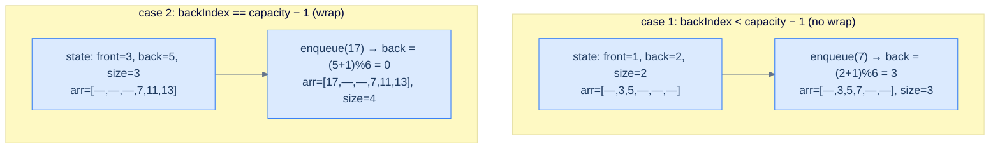
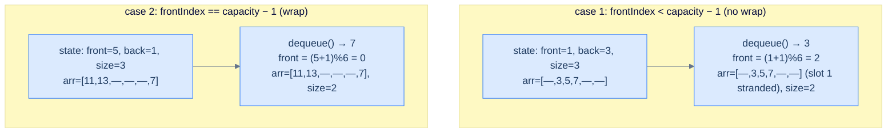

# 2. Array Implementation of Queues

## The Hook

A queue needs to enqueue, dequeue, and peek in **O(1)** — and once again the array is the obvious tool. Treat one index as the *front*, another as the *back*, and the whole interface collapses to integer arithmetic and a single array store. Enqueue? Bump back, write `arr[back]`. Dequeue? Read `arr[front]`, bump front. Size, front, back? One field each.

There's a wrinkle this time. A stack only needs one moving index — the top. A queue needs *two*, and **both march forward** as data flows through. Enqueue advances the back; dequeue advances the front. Run a queue long enough and the back hits the end of the array while the *front* is still in the middle, leaving a graveyard of vacated slots at index 0..front−1 that the naïve algorithm cannot reuse. You'd run out of room while the queue is half empty.

The fix is one of the prettiest tricks in introductory data structures: **treat the array as a circle**. When the back hits the last index, the next enqueue wraps around to index 0 and keeps going. The same trick on dequeue. One modulo (`(idx + 1) % capacity`) per operation, and the array's vacated slots are reusable forever. The result is called a **circular** (or *ring*) **buffer**, and it powers everything from kernel I/O ring buffers to Linux `kfifo`, audio pipelines, networking stacks, and Disruptor-style high-frequency-trading queues. Ten lines of code, multibillion-dollar applications.

This lesson builds that circular queue end-to-end in 10 languages, deriving the modulo trick from first principles and showing exactly why every operation is still O(1).

---

## Table of contents

1. [Structure of an array-based queue](#structure-of-an-array-based-queue)
2. [The cyclic nature of array-based queues](#the-cyclic-nature-of-array-based-queues)
3. [Implementing the queue class](#implementing-the-queue-class)
4. [Determining the size of the queue](#determining-the-size-of-the-queue)
5. [Checking if the queue is empty](#checking-if-the-queue-is-empty)
6. [Accessing the front of the queue](#accessing-the-front-of-the-queue)
7. [Accessing the back of the queue](#accessing-the-back-of-the-queue)
8. [Enqueuing an item into the queue](#enqueuing-an-item-into-the-queue)
9. [Dequeuing an item from the queue](#dequeuing-an-item-from-the-queue)
10. [Design a queue using a circular array](#design-a-queue-using-a-circular-array)

***

# Structure of an array-based queue

Four fields and a buffer. That's it.

```d2
cls: "Queue (circular-array-backed)" {
  arr: "arr: fixed-size array of capacity slots"
  fidx: "frontIndex: index of the front item (0 when empty, by convention)"
  bidx: "backIndex: index of the back item (-1 when empty, by convention)"
  size: "currentSize: number of items currently in the queue"
  cap: "capacity: max items the queue can hold"
}
```

<p align="center"><strong>An array-backed queue is just five things — the buffer, two index pointers, the size counter, and the capacity. Everything else (empty, full, enqueue, dequeue, front, back) is computed from these.</strong></p>

## State information

### Front index

`frontIndex` points at the array slot that currently holds the front of the queue (the oldest item). Convention used throughout this lesson:

- **Empty** queue ⇒ `frontIndex = 0` (will become valid as soon as the first item is enqueued).
- **Non-empty** queue ⇒ `frontIndex` ∈ `[0, capacity − 1]`, points at the oldest item.

`frontIndex` only ever advances — every dequeue moves it forward (cyclically). Enqueue never touches it.

### Back index

`backIndex` points at the array slot that currently holds the back of the queue (the newest item). Convention:

- **Empty** queue ⇒ `backIndex = -1` (no item to point at).
- **Non-empty** queue ⇒ `backIndex` ∈ `[0, capacity − 1]`, points at the newest item.

`backIndex` only ever advances — every enqueue moves it forward (cyclically). Dequeue never touches it.

### Size

The number of items currently in the queue. Why store it as a separate counter and not derive it from the indices? Because — and this is the subtle bit — once the queue wraps around, `backIndex < frontIndex` is *normal*, not a bug, and you cannot tell from the indices alone whether the queue holds 0 items or `capacity` items if `frontIndex == backIndex + 1 (mod capacity)`. A separate counter makes empty/full unambiguous in O(1).

### Capacity

The length of the underlying buffer. Fixed at construction. Used to detect overflow (refuse enqueue when `currentSize == capacity`) and to compute the modulo wrap-around.

```d2
arr: "capacity-6 array, three items at indices 1, 2, 3" {
  grid-columns: 6
  grid-gap: 0
  e0: |md
    `0`

    "—"
  |
  e1: |md
    `1`

    **3**
  | {style.fill: "#dcfce7"; style.stroke: "#22c55e"}
  e2: |md
    `2`

    5
  |
  e3: |md
    `3`

    **7**
  | {style.fill: "#fef9c3"; style.stroke: "#f59e0b"}
  e4: |md
    `4`

    "—"
  |
  e5: |md
    `5`

    "—"
  |
}

state: "frontIndex = 1, backIndex = 3, currentSize = 3, capacity = 6" {
  shape: text
}
state -> arr
```

<p align="center"><strong>Capacity-6 array, three items stored at indices 1, 2, 3 — front at 1, back at 3. Indices 0 and 4–5 are unused but allocated. The next enqueue writes at index 4 and bumps back to 4; the next dequeue returns the value at index 1 and bumps front to 2.</strong></p>

> *Predict before reading on — given the state above, what happens after two more enqueues and two more dequeues?*
>
> Enqueue: write at 4 (back→4), then write at 5 (back→5). Now `[—, 3, 5, 7, e1, e2]`, front=1, back=5, size=5.
> Dequeue twice: return arr[1]=3 (front→2), return arr[2]=5 (front→3). Now `[—, —, —, 7, e1, e2]`, front=3, back=5, size=3.
> Notice that indices 0–2 are now "stranded" — the back will hit index 5 and want to wrap. The next section is exactly about that.

***

# The cyclic nature of array-based queues

Here's the problem and the trick that fixes it.

## The problem — both ends march forward

In an array-backed *stack*, only one index moves (the top), and it bounces up and down between 0 and `capacity − 1`. The array slots are reusable forever; there's never any wasted space.

In an array-backed *queue*, **both indices march forward**. Enqueue moves back forward; dequeue moves front forward. Eventually one of them hits the end of the array. Without a fix, you've now run out of room on the back end *even if the front end has plenty of slack*.

```d2
arr: "naive view: back has hit the last slot" {
  grid-columns: 6
  grid-gap: 0
  e0: |md
    `0`

    "—"
  |
  e1: |md
    `1`

    "—"
  |
  e2: |md
    `2`

    "—"
  |
  e3: |md
    `3`

    **7**
  | {style.fill: "#dcfce7"; style.stroke: "#22c55e"}
  e4: |md
    `4`

    11
  |
  e5: |md
    `5`

    **13**
  | {style.fill: "#fef9c3"; style.stroke: "#f59e0b"}
}

state: "front=3, back=5, size=3, capacity=6 — indices 0-2 stranded" {
  shape: text
}
state -> arr
```

<p align="center"><strong>The naïve view — back has hit the last slot, but the front has marched up to 3, leaving indices 0–2 vacated and unused. The queue holds only 3 of 6 capacity, yet a "linear" enqueue would now incorrectly report "full".</strong></p>

## The fix — wrap around

When the back hits the last index, the *next* enqueue should write at index 0 and treat it as the new back. The array becomes a **circle**:

```d2
direction: right

s0: "[0]"
s1: "[1]"
s2: "[2]"
s3: "[3]"
s4: "[4]"
s5: "[5]"

s0 -> s1
s1 -> s2
s2 -> s3
s3 -> s4
s4 -> s5
s5 -> s0: wrap
```

<p align="center"><strong>Treat the array as a ring — index <code>capacity − 1</code>'s "next" is index <code>0</code>, not "out of bounds". A single modulo expression encodes this: <code>nextIndex = (currentIndex + 1) % capacity</code>.</strong></p>

Now the same enqueue that previously failed succeeds — write at index 0, and back becomes 0:

```d2
arr: "after enqueue(17): back wrapped from 5 to 0" {
  grid-columns: 6
  grid-gap: 0
  e0: |md
    `0`

    **17**
  | {style.fill: "#fef9c3"; style.stroke: "#f59e0b"}
  e1: |md
    `1`

    "—"
  |
  e2: |md
    `2`

    "—"
  |
  e3: |md
    `3`

    **7**
  | {style.fill: "#dcfce7"; style.stroke: "#22c55e"}
  e4: |md
    `4`

    11
  |
  e5: |md
    `5`

    13
  |
}

state: "front=3, back=0, size=4 — back has wrapped" {
  shape: text
}
state -> arr
```

<p align="center"><strong>After enqueueing 17 — back wrapped from 5 to 0 via <code>(5 + 1) % 6 = 0</code>. The queue's <em>logical</em> contents are now <code>[7, 11, 13, 17]</code> in order, even though <em>physically</em> they're stored as <code>[17, —, —, 7, 11, 13]</code>. The wrap is invisible to the caller.</strong></p>

The same wrap applies to dequeue. The expression `(index + 1) % capacity` advances `index` by one, *cycling back to 0* when it would otherwise step past the end. Two ring-buffer pointers, one cheap modulo, and the queue is now a fully circular structure that uses every slot.

> *Predict before reading on — once the queue wraps, what does "queue is full" actually look like? <code>backIndex == capacity − 1</code> can't be the right check anymore.*
>
> Right — `backIndex` could be anywhere on the ring. The clean test is `currentSize == capacity` (which is exactly why we maintain `currentSize` separately from the indices). Without that counter, distinguishing *empty* (back just behind front, nothing in between) from *full* (back just behind front, the gap is full) on a circular buffer requires either reserving one slot as a sentinel or storing a flag. The counter sidesteps that whole genus of bugs.

## Memory layout

Conceptually circular, physically still a flat contiguous array. The `% capacity` operator is the only thing that distinguishes a ring buffer from a normal array — there's no special hardware, no clever pointer arithmetic. Just one modulo per operation.

```d2
mem: "Memory layout — capacity 6, items stored at indices 3, 4, 5, 0" {
  grid-columns: 6
  grid-gap: 0
  m0: |md
    `@1000`

    **17**
  | {style.fill: "#fef9c3"; style.stroke: "#f59e0b"}
  m1: |md
    `@1004`

    "—"
  |
  m2: |md
    `@1008`

    "—"
  |
  m3: |md
    `@1012`

    **7**
  | {style.fill: "#dcfce7"; style.stroke: "#22c55e"}
  m4: |md
    `@1016`

    11
  |
  m5: |md
    `@1020`

    13
  |
}

note: |md
  Logical order: 7, 11, 13, 17

  Physical order: 17, —, —, 7, 11, 13

  Same contiguous bytes; modulo arithmetic does the rest.
| { shape: text }
note -> mem.m3
```

<p align="center"><strong>A circular queue in actual memory — six 4-byte int slots laid out linearly. The "wrap" is a property of the access pattern, not the storage. The CPU still gets cache locality on each operation; the modulo costs a few nanoseconds.</strong></p>

***

# Implementing the queue class

We'll build the class incrementally — first the skeleton (constructor + stub methods), then fill in `size`, `empty`, `front`, `back`, `enqueue`, `dequeue` in order.

```d2
direction: right

cls: "Queue class" {
  priv: "private internals" {
    arr: arr
    fidx: frontIndex
    bidx: backIndex
    size: currentSize
    cap: capacity
  }
  pub: "public API" {
    sz: "size()"
    em: "empty()"
    fr: "front()"
    bk: "back()"
    enq: "enqueue(val) -> bool"
    deq: "dequeue() -> val"
  }
  pub -> priv
}
```

<p align="center"><strong>The class as we'll build it — five private fields, six public methods. The two index fields plus the modulo arithmetic are the only "interesting" code in the entire implementation.</strong></p>

## Queue class — skeleton


```pseudocode
function Queue(capacity):
    arr         ← array of size capacity
    frontIndex  ← 0       # 0 by convention when empty
    backIndex   ← −1      # −1 by convention when empty
    currentSize ← 0
    cap         ← capacity

function size(queue):    stub
function empty(queue):   stub
function front(queue):   stub
function back(queue):    stub
function enqueue(queue, val): stub
function dequeue(queue): stub
```

```python run
class Queue:
    def __init__(self, capacity: int):
        self.capacity     = capacity
        self.arr          = [0] * capacity
        self.front_index  = 0          # 0 when empty, by convention
        self.back_index   = -1         # -1 when empty
        self.current_size = 0

    def size(self):       pass
    def empty(self):      pass
    def front(self):      pass
    def back(self):       pass
    def enqueue(self, v): pass
    def dequeue(self):    pass

q = Queue(4)
print("created queue with capacity 4")
```

```java run
public class Main {
    static class Queue {
        private final int[] arr;
        private final int   capacity;
        private int         frontIndex   = 0;
        private int         backIndex    = -1;
        private int         currentSize  = 0;
        Queue(int capacity) {
            this.capacity = capacity;
            this.arr      = new int[capacity];
        }
        int     size()             { return 0; }
        boolean empty()            { return true; }
        int     front()            { return -1; }
        int     back()             { return -1; }
        boolean enqueue(int val)   { return false; }
        int     dequeue()          { return -1; }
    }
    public static void main(String[] args) {
        Queue q = new Queue(4);
        System.out.println("created queue with capacity 4");
    }
}
```

```c run
#include <stdio.h>
#include <stdlib.h>
#include <stdbool.h>

typedef struct {
    int *arr;
    int  capacity, frontIndex, backIndex, currentSize;
} Queue;

Queue* queue_create(int capacity) {
    Queue *q = malloc(sizeof(Queue));
    q->arr         = malloc(sizeof(int) * capacity);
    q->capacity    = capacity;
    q->frontIndex  = 0;
    q->backIndex   = -1;
    q->currentSize = 0;
    return q;
}

int  queue_size   (Queue *q)              { return 0; }
bool queue_empty  (Queue *q)              { return true; }
int  queue_front  (Queue *q)              { return -1; }
int  queue_back   (Queue *q)              { return -1; }
bool queue_enqueue(Queue *q, int val)     { return false; }
int  queue_dequeue(Queue *q)              { return -1; }

int main() {
    Queue *q = queue_create(4);
    printf("created queue with capacity %d\n", q->capacity);
    free(q->arr); free(q);
}
```

```scala run
object Main extends App {
  class Queue(val capacity: Int) {
    protected val arr        = new Array[Int](capacity)
    protected var frontIdx   = 0
    protected var backIdx    = -1
    protected var currSize   = 0

    def size:    Int     = 0
    def empty:   Boolean = true
    def front:   Int     = -1
    def back:    Int     = -1
    def enqueue(v: Int): Boolean = false
    def dequeue: Int     = -1
  }

  val q = new Queue(4)
  println("created queue with capacity 4")
}
```


The skeleton is just bookkeeping — five fields, six stubs. The next six sections fill in one stub at a time.

***

# Determining the size of the queue

The size operation reports the current number of items in the queue. We've already done all the hard work in the constructor and (preview) in `enqueue`/`dequeue`: those operations maintain `currentSize` as an invariant. The size method is then a one-line read.

> **Algorithm**
>
> -   **Step 1:** Return the value of `currentSize`.

## Implementation


```pseudocode
function size(queue):
    return queue.currentSize
```

```python run
def size(self):
    return self.current_size
```

```java run
int size() { return currentSize; }
```

```c run
int queue_size(Queue *q) { return q->currentSize; }
```

```scala run
def size: Int = currSize
```


## Complexity Analysis

A single field read.

> **Best Case**
>
> - Time:  **O(1)**
> - Space: **O(1)**
>
> **Worst Case**
>
> - Time:  **O(1)**
> - Space: **O(1)**

***

# Checking if the queue is empty

`empty()` returns `true` when there are no items in the queue. The cleanest definition is *"size is zero"* — and since `size` is already O(1), so is `empty`.

> **Algorithm**
>
> -   **Step 1:** Return `true` if `currentSize == 0`, else `false`.

## Implementation


```pseudocode
function empty(queue):
    return size(queue) = 0
```

```python run
def empty(self):
    return self.size() == 0
```

```java run
boolean empty() { return size() == 0; }
```

```c run
bool queue_empty(Queue *q) { return queue_size(q) == 0; }
```

```scala run
def empty: Boolean = size == 0
```


## Complexity Analysis

Calls `size`, returns a comparison.

> **Best Case**
>
> - Time:  **O(1)**
> - Space: **O(1)**
>
> **Worst Case**
>
> - Time:  **O(1)**
> - Space: **O(1)**

***

# Accessing the front of the queue

`front()` returns the value of the oldest item in the queue without removing it. Two cases:

1. **Queue is empty** → return `-1` as a sentinel (production code would throw; we return `-1` for simplicity, matching the lesson's convention).
2. **Queue is non-empty** → return `arr[frontIndex]`.

```d2
arr: "front access" {
  grid-columns: 6
  grid-gap: 0
  e0: |md
    `0`

    "—"
  |
  e1: |md
    `1`

    **3**
  | {style.fill: "#dcfce7"; style.stroke: "#22c55e"}
  e2: |md
    `2`

    5
  |
  e3: |md
    `3`

    7
  |
  e4: |md
    `4`

    "—"
  |
  e5: |md
    `5`

    "—"
  |
}

note: "front() returns arr[frontIndex] = arr[1] = 3" {
  shape: text
}
note -> arr.e1
```

<p align="center"><strong>front() — read the slot at <code>frontIndex</code>. The queue is unchanged after the call.</strong></p>

> **Algorithm**
>
> -   **Step 1:** If the queue is empty, return `-1`.
> -   **Step 2:** Otherwise return `arr[frontIndex]`.

## Implementation


```pseudocode
function front(queue):
    if empty(queue): return −1
    return queue.arr[queue.frontIndex]
```

```python run
def front(self):
    if self.empty(): return -1
    return self.arr[self.front_index]
```

```java run
int front() { return empty() ? -1 : arr[frontIndex]; }
```

```c run
int queue_front(Queue *q) {
    return queue_empty(q) ? -1 : q->arr[q->frontIndex];
}
```

```scala run
def front: Int = if (empty) -1 else arr(frontIdx)
```


## Complexity Analysis

A predicate plus an array indexing — both O(1).

> **Best Case**
>
> - Time:  **O(1)**
> - Space: **O(1)**
>
> **Worst Case**
>
> - Time:  **O(1)**
> - Space: **O(1)**

***

# Accessing the back of the queue

`back()` returns the value of the newest item in the queue without removing it. Same two cases — empty (`-1`) or read `arr[backIndex]`.

```d2
arr: "back access" {
  grid-columns: 6
  grid-gap: 0
  e0: |md
    `0`

    "—"
  |
  e1: |md
    `1`

    3
  |
  e2: |md
    `2`

    5
  |
  e3: |md
    `3`

    **7**
  | {style.fill: "#fef9c3"; style.stroke: "#f59e0b"}
  e4: |md
    `4`

    "—"
  |
  e5: |md
    `5`

    "—"
  |
}

note: "back() returns arr[backIndex] = arr[3] = 7" {
  shape: text
}
note -> arr.e3
```

<p align="center"><strong>back() — read the slot at <code>backIndex</code>. The queue is unchanged after the call.</strong></p>

> **Algorithm**
>
> -   **Step 1:** If the queue is empty, return `-1`.
> -   **Step 2:** Otherwise return `arr[backIndex]`.

## Implementation


```pseudocode
function back(queue):
    if empty(queue): return −1
    return queue.arr[queue.backIndex]
```

```python run
def back(self):
    if self.empty(): return -1
    return self.arr[self.back_index]
```

```java run
int back() { return empty() ? -1 : arr[backIndex]; }
```

```c run
int queue_back(Queue *q) {
    return queue_empty(q) ? -1 : q->arr[q->backIndex];
}
```

```scala run
def back: Int = if (empty) -1 else arr(backIdx)
```


## Complexity Analysis

> **Best Case**
>
> - Time:  **O(1)**
> - Space: **O(1)**
>
> **Worst Case**
>
> - Time:  **O(1)**
> - Space: **O(1)**

***

# Enqueuing an item into the queue

Enqueue is the more interesting operation — the cyclic trick lives here. Two top-level cases:

1. **Queue is full** (`currentSize == capacity`) → reject; return `false`.
2. **Queue is not full** → advance `backIndex` (cyclically), write the value, increment size.

The cyclic advance is the one-liner that does all the work:

```text
backIndex = (backIndex + 1) % capacity
```

When `backIndex` is the last valid index, `(last + 1) % capacity == 0`, wrapping us back to slot 0. When `backIndex` is anywhere else, this is just `backIndex + 1`. One expression handles both the normal case *and* the wrap-around case — no `if`, no special branches.



<p align="center"><strong>Enqueue branches handled by one modulo — when back+1 is in-bounds, the modulo is a no-op; when back+1 is out-of-bounds, the modulo wraps it to 0. Same line of code, both cases.</strong></p>

> **Algorithm**
>
> -   **Step 1:** If `currentSize == capacity`, return `false` (queue full).
> -   **Step 2:** Update `backIndex = (backIndex + 1) % capacity`.
> -   **Step 3:** Store `arr[backIndex] = val`.
> -   **Step 4:** Increment `currentSize`.
> -   **Step 5:** Return `true`.

## Implementation


```pseudocode
function enqueue(queue, val):
    if queue.currentSize = queue.capacity: return false
    queue.backIndex           ← (queue.backIndex + 1) % queue.capacity
    queue.arr[queue.backIndex] ← val
    queue.currentSize ← queue.currentSize + 1
    return true
```

```python run
def enqueue(self, val):
    if self.current_size == self.capacity: return False
    self.back_index           = (self.back_index + 1) % self.capacity
    self.arr[self.back_index] = val
    self.current_size        += 1
    return True
```

```java run
boolean enqueue(int val) {
    if (currentSize == capacity) return false;
    backIndex            = (backIndex + 1) % capacity;
    arr[backIndex]       = val;
    currentSize++;
    return true;
}
```

```c run
bool queue_enqueue(Queue *q, int val) {
    if (q->currentSize == q->capacity) return false;
    q->backIndex          = (q->backIndex + 1) % q->capacity;
    q->arr[q->backIndex]  = val;
    q->currentSize++;
    return true;
}
```

```scala run
def enqueue(v: Int): Boolean = {
  if (currSize == capacity) return false
  backIdx       = (backIdx + 1) % capacity
  arr(backIdx)  = v
  currSize     += 1
  true
}
```


> **Note on the Rust signature** — we keep `back_index` as `i32` (signed) so the empty sentinel `-1` fits, then `rem_euclid` gives us the correct non-negative remainder for the wrap.

## Complexity Analysis

A bounds check, a modulo, an array write, an increment. No allocation. No loop.

> **Best Case**
>
> - Time:  **O(1)**
> - Space: **O(1)**
>
> **Worst Case**
>
> - Time:  **O(1)**
> - Space: **O(1)**

***

# Dequeuing an item from the queue

Dequeue is the symmetric operation. Two cases:

1. **Queue is empty** → return `-1`.
2. **Queue is non-empty** → save `arr[frontIndex]`, advance `frontIndex` cyclically, decrement size, return the saved value.



<p align="center"><strong>Dequeue mirrors enqueue — one modulo handles both the normal advance and the wrap from index <code>capacity − 1</code> back to <code>0</code>. The vacated slot is left untouched (its value is ignored, never read again until overwritten by a future enqueue).</strong></p>

> **Why don't we zero out the dequeued slot?**
>
> We don't need to. The queue's logical contents are *only* the slots between `frontIndex` and `backIndex` (cyclically). The dequeued slot is now outside that range, so it'll never be read by `front`/`back`/iteration. The next enqueue that comes around will *overwrite* it. Zeroing would just be wasted work — and for non-trivial element types (objects, smart pointers) the production trade-off is between memory pressure (clearing frees referenced memory sooner) and CPU cost (clearing isn't free). The simplest correct queue does no clearing; library queues for reference types may clear to release references.

> **Algorithm**
>
> -   **Step 1:** If `currentSize == 0`, return `-1`.
> -   **Step 2:** Save `dequeued = arr[frontIndex]`.
> -   **Step 3:** Update `frontIndex = (frontIndex + 1) % capacity`.
> -   **Step 4:** Decrement `currentSize`.
> -   **Step 5:** Return `dequeued`.

## Implementation


```pseudocode
function dequeue(queue):
    if empty(queue): return −1
    val              ← queue.arr[queue.frontIndex]
    queue.frontIndex ← (queue.frontIndex + 1) % queue.capacity
    queue.currentSize ← queue.currentSize − 1
    return val
```

```python run
def dequeue(self):
    if self.empty(): return -1
    val               = self.arr[self.front_index]
    self.front_index  = (self.front_index + 1) % self.capacity
    self.current_size -= 1
    return val
```

```java run
int dequeue() {
    if (empty()) return -1;
    int val      = arr[frontIndex];
    frontIndex   = (frontIndex + 1) % capacity;
    currentSize--;
    return val;
}
```

```c run
int queue_dequeue(Queue *q) {
    if (queue_empty(q)) return -1;
    int val          = q->arr[q->frontIndex];
    q->frontIndex    = (q->frontIndex + 1) % q->capacity;
    q->currentSize--;
    return val;
}
```

```scala run
def dequeue: Int = {
  if (empty) return -1
  val v       = arr(frontIdx)
  frontIdx    = (frontIdx + 1) % capacity
  currSize   -= 1
  v
}
```


## Complexity Analysis

Same shape as enqueue — predicate, modulo, array read, decrement.

> **Best Case**
>
> - Time:  **O(1)**
> - Space: **O(1)**
>
> **Worst Case**
>
> - Time:  **O(1)**
> - Space: **O(1)**

***

# Design a queue using a circular array

## Problem Statement

Given the skeleton of a **Queue class**, complete it by implementing all the queue operations below.

> -   **`Queue(int capacity)`** — initialise the queue with the given capacity.
> -   **`size()`** — return the current size of the queue.
> -   **`empty()`** — return `true` if the queue is empty, else `false`.
> -   **`front()`** — return the front element; if empty, return `-1`.
> -   **`back()`** — return the back element; if empty, return `-1`.
> -   **`enqueue(int val)`** — add `val` at the back; return `true` if successful, `false` if full.
> -   **`dequeue()`** — remove and return the front element; if empty, return `-1`.

## Constraints

1. Use **a single fixed-size array** as the internal data structure. No additional containers, no nodes.
2. The implementation **must be circular** — every vacated slot must be reusable before the queue declares itself full.

```d2
direction: right

ring: "circular layout — front=3, back=0 (wrapped), logical order 7 → 11 → 13 → 17" {
  grid-columns: 6
  grid-gap: 0
  s0: |md
    `[0]`

    **17**
  | {style.fill: "#fef9c3"; style.stroke: "#f59e0b"}
  s1: |md
    `[1]`

    "—"
  |
  s2: |md
    `[2]`

    "—"
  |
  s3: |md
    `[3]`

    **7**
  | {style.fill: "#dcfce7"; style.stroke: "#22c55e"}
  s4: |md
    `[4]`

    11
  |
  s5: |md
    `[5]`

    13
  |
}
ring.s5 -> ring.s0: wrap
```

<p align="center"><strong>Circular queue layout — front=3, back=0 (wrapped), logical order 7→11→13→17. Every slot is reachable; the array is reused indefinitely as long as the size never exceeds capacity.</strong></p>

## Worked Example

> **Input** (operations array, operands array):
>
> `[Queue, enqueue, back, enqueue, front, empty, dequeue, front, enqueue, enqueue, empty]`
>
> `[[2], [2], [], [3], [], [], [], [], [8], [9], []]`
>
> **Expected Output:**
>
> `[null, true, 2, true, 2, false, 2, 3, true, false, false]`
>
> **Trace:**
>
> | Op | Result | Queue state |
> |---|---|---|
> | `Queue(2)` | — | `[]`  (capacity 2) |
> | `enqueue(2)` | `true` | `[2]` |
> | `back()` | `2` | `[2]` |
> | `enqueue(3)` | `true` | `[2, 3]` (full) |
> | `front()` | `2` | `[2, 3]` |
> | `empty()` | `false` | `[2, 3]` |
> | `dequeue()` | `2` | `[3]` |
> | `front()` | `3` | `[3]` |
> | `enqueue(8)` | `true` | `[3, 8]` (full again) |
> | `enqueue(9)` | `false` | `[3, 8]` (rejected — full) |
> | `empty()` | `false` | `[3, 8]` |

## Solution


```pseudocode
function Queue(capacity):
    arr ← array of size capacity; frontIndex ← 0; backIndex ← −1; currentSize ← 0; cap ← capacity

function size(queue):    return queue.currentSize
function empty(queue):   return queue.currentSize = 0
function front(queue):   if empty(queue): return −1  else return queue.arr[queue.frontIndex]
function back(queue):    if empty(queue): return −1  else return queue.arr[queue.backIndex]

function enqueue(queue, val):
    if queue.currentSize = queue.capacity: return false
    queue.backIndex            ← (queue.backIndex + 1) % queue.capacity
    queue.arr[queue.backIndex] ← val
    queue.currentSize ← queue.currentSize + 1
    return true

function dequeue(queue):
    if empty(queue): return −1
    val              ← queue.arr[queue.frontIndex]
    queue.frontIndex ← (queue.frontIndex + 1) % queue.capacity
    queue.currentSize ← queue.currentSize − 1
    return val
```

```python run
class Queue:
    def __init__(self, capacity: int):
        self.capacity     = capacity
        self.arr          = [0] * capacity
        self.front_index  = 0
        self.back_index   = -1
        self.current_size = 0

    def size(self):  return self.current_size
    def empty(self): return self.current_size == 0
    def front(self): return -1 if self.empty() else self.arr[self.front_index]
    def back(self):  return -1 if self.empty() else self.arr[self.back_index]
    def enqueue(self, v):
        if self.current_size == self.capacity: return False
        self.back_index           = (self.back_index + 1) % self.capacity
        self.arr[self.back_index] = v
        self.current_size        += 1
        return True
    def dequeue(self):
        if self.empty(): return -1
        v = self.arr[self.front_index]
        self.front_index  = (self.front_index + 1) % self.capacity
        self.current_size -= 1
        return v

# Boss-fight demo
q = Queue(2)
print(q.enqueue(2), q.back())       # True 2
print(q.enqueue(3), q.front())      # True 2
print(q.empty())                    # False
print(q.dequeue(), q.front())       # 2 3
print(q.enqueue(8), q.enqueue(9))   # True False (full)
print(q.empty())                    # False
```

```java run
public class Main {
    static class Queue {
        private final int[] arr;
        private final int   capacity;
        private int frontIndex = 0, backIndex = -1, currentSize = 0;
        Queue(int capacity) {
            this.capacity = capacity;
            this.arr      = new int[capacity];
        }
        int     size()        { return currentSize; }
        boolean empty()       { return currentSize == 0; }
        int     front()       { return empty() ? -1 : arr[frontIndex]; }
        int     back()        { return empty() ? -1 : arr[backIndex]; }
        boolean enqueue(int v) {
            if (currentSize == capacity) return false;
            backIndex      = (backIndex + 1) % capacity;
            arr[backIndex] = v;
            currentSize++;
            return true;
        }
        int dequeue() {
            if (empty()) return -1;
            int v       = arr[frontIndex];
            frontIndex  = (frontIndex + 1) % capacity;
            currentSize--;
            return v;
        }
    }
    public static void main(String[] args) {
        Queue q = new Queue(2);
        System.out.println(q.enqueue(2) + " " + q.back());
        System.out.println(q.enqueue(3) + " " + q.front());
        System.out.println(q.empty());
        System.out.println(q.dequeue() + " " + q.front());
        System.out.println(q.enqueue(8) + " " + q.enqueue(9));
        System.out.println(q.empty());
    }
}
```

```c run
#include <stdio.h>
#include <stdlib.h>
#include <stdbool.h>

typedef struct {
    int *arr;
    int  capacity, frontIndex, backIndex, currentSize;
} Queue;

Queue* queue_create(int c) {
    Queue *q = malloc(sizeof(*q));
    q->arr = malloc(sizeof(int) * c);
    q->capacity = c; q->frontIndex = 0; q->backIndex = -1; q->currentSize = 0;
    return q;
}
int  queue_size (Queue *q){ return q->currentSize; }
bool queue_empty(Queue *q){ return q->currentSize == 0; }
int  queue_front(Queue *q){ return queue_empty(q) ? -1 : q->arr[q->frontIndex]; }
int  queue_back (Queue *q){ return queue_empty(q) ? -1 : q->arr[q->backIndex]; }
bool queue_enqueue(Queue *q, int v) {
    if (q->currentSize == q->capacity) return false;
    q->backIndex          = (q->backIndex + 1) % q->capacity;
    q->arr[q->backIndex]  = v;
    q->currentSize++;
    return true;
}
int  queue_dequeue(Queue *q) {
    if (queue_empty(q)) return -1;
    int v          = q->arr[q->frontIndex];
    q->frontIndex  = (q->frontIndex + 1) % q->capacity;
    q->currentSize--;
    return v;
}

int main() {
    Queue *q = queue_create(2);
    printf("%d %d\n", queue_enqueue(q,2), queue_back(q));
    printf("%d %d\n", queue_enqueue(q,3), queue_front(q));
    printf("%d\n",    queue_empty(q));
    printf("%d %d\n", queue_dequeue(q), queue_front(q));
    printf("%d %d\n", queue_enqueue(q,8), queue_enqueue(q,9));
    printf("%d\n",    queue_empty(q));
    free(q->arr); free(q);
}
```

```scala run
object Main extends App {
  class Queue(val capacity: Int) {
    private val arr   = new Array[Int](capacity)
    private var f     = 0
    private var b     = -1
    private var n     = 0

    def size:  Int     = n
    def empty: Boolean = n == 0
    def front: Int     = if (empty) -1 else arr(f)
    def back:  Int     = if (empty) -1 else arr(b)
    def enqueue(v: Int): Boolean = {
      if (n == capacity) return false
      b      = (b + 1) % capacity
      arr(b) = v
      n     += 1
      true
    }
    def dequeue: Int = {
      if (empty) return -1
      val v = arr(f)
      f     = (f + 1) % capacity
      n    -= 1
      v
    }
  }

  val q = new Queue(2)
  println(s"${q.enqueue(2)} ${q.back}")
  println(s"${q.enqueue(3)} ${q.front}")
  println(q.empty)
  println(s"${q.dequeue} ${q.front}")
  println(s"${q.enqueue(8)} ${q.enqueue(9)}")
  println(q.empty)
}
```


***

## Final Takeaway

A circular array queue is *the* canonical bounded-FIFO data structure — every operation is O(1), no allocation per call, perfect cache locality, and it composes beautifully with hardware features (DMA ring buffers, lock-free ring buffers, the entire networking stack).

1. **Two indices, one modulo.** Front and back both march forward; `(idx + 1) % capacity` is the only thing that distinguishes a queue's array from a stack's array. Once you internalise that line, the whole implementation is bookkeeping.
2. **Maintain `currentSize` separately.** It's the only unambiguous way to distinguish *empty* from *full* on a circular buffer. Trying to derive size from the index gap leads to off-by-one bugs and subtle ring-buffer puzzles (the "leave one slot empty" trick is one workaround; just storing the size is simpler).
3. **The trade-off is bounded capacity.** A circular array queue cannot grow without copying. If you need an unbounded queue, you either (a) use a linked list — next lesson — or (b) implement a *growable* ring buffer that reallocates and re-rolls when full. The bounded version is what you want for back-pressure-aware producers, fixed-memory environments (kernels, embedded), and lock-free designs.

> *Coming up — the linked-list implementation. Same interface, different trade-offs: O(1) enqueue and dequeue without amortisation, unbounded by default, but each node costs a heap allocation and pointer chasing destroys cache locality. The lesson after that pits stacks and queues against each other in two design problems that test whether you really understand the FIFO contract.*
