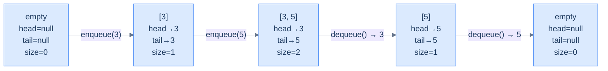
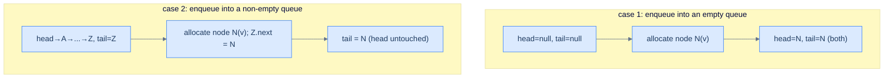
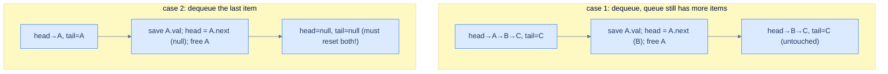

# 3. Linked-List Implementation of Queues

## The Hook

The array queue from the last lesson is fast and cache-friendly, but it has one stubborn limitation: **fixed capacity**. You decide the buffer size at construction, and you live with that decision forever. Run out of room and you either reject the enqueue (back-pressure) or pay an O(N) cost to copy everything to a bigger buffer (resize). Both are fine in their place — but neither is *unbounded*.

A **linked list** lifts the capacity ceiling. Each enqueue allocates one new node and stitches it onto the back of the chain. Each dequeue unlinks the front node and (depending on language) frees it. There's no buffer to fill, no copy to perform, no resize spike. The queue grows one node at a time, limited only by the operating system's willingness to keep handing out memory.

But there's a twist. A *stack* puts everything at the head — push and pop both touch `head`, both are O(1) on a singly-linked list, easy. A *queue* needs O(1) at **both** ends — enqueue at the back, dequeue at the front. Naively, the back of a singly-linked list is O(N) to find (you'd have to walk the whole chain). The fix is to maintain *two pointers* — `head` for the front, `tail` for the back — and update both as items flow through. With both pointers, enqueue is "allocate, link to tail, swing tail" (three pointer moves, O(1)) and dequeue is "save head value, swing head, free old head" (also O(1)). Same asymptotic cost as the array queue, but unbounded by default and with no resize discontinuity.

The trade-off is the usual one for linked structures: every node is a separate heap allocation, scattered across RAM, and the CPU's prefetcher loses. Wall-clock latency of a linked queue is typically 2–5× higher than an array queue *for the same operation count*, despite identical asymptotics. Production systems pick the array queue when capacity is bounded and predictable, and the linked queue when bursts are unpredictable or memory is a hard ceiling on growth.

This lesson builds the linked-list queue end-to-end in 10 languages — same five-method interface as before, but a completely different memory model.

---

## Table of contents

1. [Structure of a linked-list-based queue](#structure-of-a-linked-list-based-queue)
2. [Implementing the queue class using a linked list](#implementing-the-queue-class-using-a-linked-list)
3. [Determining the size of the queue](#determining-the-size-of-the-queue)
4. [Checking if the queue is empty](#checking-if-the-queue-is-empty)
5. [Accessing the front of the queue](#accessing-the-front-of-the-queue)
6. [Accessing the back of the queue](#accessing-the-back-of-the-queue)
7. [Enqueuing an item into the queue](#enqueuing-an-item-into-the-queue)
8. [Dequeuing an item from the queue](#dequeuing-an-item-from-the-queue)
9. [Design a queue using a linked list](#design-a-queue-using-a-linked-list)

***

# Structure of a linked-list-based queue

A linked-list queue stores its front at the **head** of a singly linked list and its back at the **tail**. Four fields wrap that list:

```d2
direction: right

cls: "Queue (linked-list-backed)" {
  h: "head: pointer to front node (null if empty)"
  t: "tail: pointer to back node (null if empty)"
  s: "currentSize: number of nodes"
  c: "capacity: max nodes (bounded variant)"
}

n1: |md
  **val: 3**

  next ●
| {style.fill: "#dcfce7"; style.stroke: "#22c55e"}
n2: |md
  val: 5

  next ●
|
n3: |md
  **val: 7**

  next: null
| {style.fill: "#fef9c3"; style.stroke: "#f59e0b"}

cls.h -> n1
n1 -> n2
n2 -> n3
cls.t -> n3
```

<p align="center"><strong>Linked-list queue — <code>head</code> always points at the front (oldest) node; <code>tail</code> always points at the back (newest) node. The chain itself flows from front to back, mirroring the FIFO order. Enqueue extends past the tail; dequeue advances the head.</strong></p>

## State information

### Front (head pointer)

In the array version, the front was an *index*. Here, it's a **pointer**. `head` references the node holding the oldest still-present item, or is `null` if the queue is empty. `dequeue` reads through `head`, then re-points `head` to `head.next`.

### Back (tail pointer)

The back is also a pointer — `tail` references the node holding the newest item. `enqueue` allocates a new node, links the current `tail.next` to it, then re-points `tail` to the new node. **Without a tail pointer, enqueue would be O(N)** — you'd have to walk the entire list to find where to attach. The tail pointer is the single most important optimisation in a linked-list queue.

> *Why don't we put the back at the head and the front at the tail instead?*
>
> The chain is *one-directional* — each node has a `next` pointer but no `prev`. Removing the tail node would require finding the second-to-last node so you can null its `next` — and that find is O(N) on a singly-linked list. Removing the head, on the other hand, is "swing the head pointer forward", O(1). So the front (where we remove) goes at the head; the back (where we only insert) goes at the tail. A doubly-linked list would let us swap, but the singly-linked list pins the choice.

### Current size

A linked list doesn't know its own length unless someone counts. Walking it to count is O(N); maintaining an integer that's incremented on enqueue and decremented on dequeue makes `size` O(1). Same trick as the array queue — the size invariant lives in a counter, not in the structure.

### Capacity

`capacity` is the maximum allowed size. A *bounded* linked-list queue rejects enqueues when `currentSize == capacity`; an *unbounded* one ignores capacity entirely. We'll build the bounded version to mirror the array queue's interface — same contract, different storage.



<p align="center"><strong>Lifecycle — empty queue has both pointers null. The first enqueue makes both point at the same node. Subsequent enqueues extend the tail; dequeues advance the head. The last dequeue resets both back to null.</strong></p>

> **Edge case to memorise** — a queue with exactly *one* item has `head == tail` (both pointers reference the same node). This matters in two places: (a) the *first* enqueue must set both pointers, not just the tail, and (b) the *last* dequeue must reset both pointers, not just the head. Forget either and you get a dangling stale `tail` or `head` pointing at a freed node — classic use-after-free territory.

***

# Implementing the queue class using a linked list

Two pieces: a tiny `ListNode` type for the chain, and the `Queue` class that wraps it.

## Linked list node

A node holds a value and a pointer to the next node. That's the entire definition. The first lesson of the linked-list section already covered this, so we'll keep it minimal.

```d2
direction: right

n: ListNode {
  val: |md
    **val**

    (int)
  |
  next: |md
    **next**

    (pointer)
  |
}
```

<p align="center"><strong>The chain node — one value plus one pointer. Enqueue allocates one of these; dequeue frees one (or relies on garbage collection).</strong></p>

## Queue class — skeleton

The class encapsulates `head`, `tail`, `currentSize`, and `capacity`, exposing the same six operations as the array version.


```pseudocode
function Queue(capacity):
    head        ← null    # front pointer
    tail        ← null    # back pointer
    currentSize ← 0
    cap         ← capacity

function size(queue):    stub
function empty(queue):   stub
function front(queue):   stub
function back(queue):    stub
function enqueue(queue, val): stub
function dequeue(queue): stub
```

```python run
class _ListNode:
    __slots__ = ('val', 'next')
    def __init__(self, val):
        self.val, self.next = val, None

class Queue:
    def __init__(self, capacity: int):
        self.capacity     = capacity
        self.head         = None       # front pointer
        self.tail         = None       # back pointer
        self.current_size = 0

    def size(self):       pass
    def empty(self):      pass
    def front(self):      pass
    def back(self):       pass
    def enqueue(self, v): pass
    def dequeue(self):    pass

q = Queue(4); print("created queue with capacity 4")
```

```java run
public class Main {
    static class ListNode {
        int      val;
        ListNode next;
        ListNode(int v) { val = v; }
    }
    static class Queue {
        private ListNode head;          // front of queue
        private ListNode tail;          // back of queue
        private int      currentSize;
        private int      capacity;
        Queue(int capacity) { this.capacity = capacity; }

        int     size()             { return 0;     }
        boolean empty()            { return true;  }
        int     front()            { return -1;    }
        int     back()             { return -1;    }
        boolean enqueue(int val)   { return false; }
        int     dequeue()          { return -1;    }
    }
    public static void main(String[] args) {
        Queue q = new Queue(4);
        System.out.println("created queue with capacity 4");
    }
}
```

```c run
#include <stdio.h>
#include <stdlib.h>
#include <stdbool.h>

typedef struct ListNode {
    int               val;
    struct ListNode  *next;
} ListNode;

typedef struct {
    ListNode *head;
    ListNode *tail;
    int       capacity, currentSize;
} Queue;

Queue* queue_create(int capacity) {
    Queue *q = malloc(sizeof(Queue));
    q->head = q->tail = NULL;
    q->capacity = capacity;
    q->currentSize = 0;
    return q;
}

int  queue_size   (Queue *q)              { return 0; }
bool queue_empty  (Queue *q)              { return true; }
int  queue_front  (Queue *q)              { return -1; }
int  queue_back   (Queue *q)              { return -1; }
bool queue_enqueue(Queue *q, int val)     { return false; }
int  queue_dequeue(Queue *q)              { return -1; }

int main() {
    Queue *q = queue_create(4);
    printf("created queue with capacity %d\n", q->capacity);
    free(q);
}
```

```scala run
class Queue(val capacity: Int) {
  private class Node(val value: Int, var next: Node = null)

  private var head: Node = null
  private var tail: Node = null
  private var currSize    = 0

  def size:    Int     = 0
  def empty:   Boolean = true
  def front:   Int     = -1
  def back:    Int     = -1
  def enqueue(v: Int): Boolean = false
  def dequeue: Int     = -1
}

object Main extends App {
  val q = new Queue(4)
  println("created queue with capacity 4")
}
```


The Rust skeleton is unusual — see the comment in the code. The mainstream Rust answer is "use `std::collections::VecDeque`", which is itself a circular array under the hood. We're showing the linked version for parity with the other languages.

***

# Determining the size of the queue

We've established the invariant — `currentSize` is updated on every enqueue and dequeue. The size method is then a one-line read. (Walking the list to count would be O(N), and there's no reason to pay that cost when we already know the answer.)

> **Algorithm**
>
> -   **Step 1:** Return the value of `currentSize`.

## Implementation


```pseudocode
function size(queue):
    return queue.currentSize
```

```python run
def size(self):
    return self.current_size
```

```java run
int size() { return currentSize; }
```

```c run
int queue_size(Queue *q) { return q->currentSize; }
```

```scala run
def size: Int = currSize
```


## Complexity Analysis

> **Best Case**
>
> - Time:  **O(1)**
> - Space: **O(1)**
>
> **Worst Case**
>
> - Time:  **O(1)**
> - Space: **O(1)**

***

# Checking if the queue is empty

`empty()` returns `true` when there are no items. The simplest definition is "size is zero" — and since `size` is O(1), so is `empty`.

> **Algorithm**
>
> -   **Step 1:** Return `true` if `currentSize == 0`, else `false`.

> *Predict before reading on — could we instead check <code>head == null</code>?*
>
> Yes — `head` being null is logically equivalent to `currentSize == 0`. Both invariants hold simultaneously after every operation. We use `currentSize == 0` for symmetry with the array implementation and because it composes cleanly with `currentSize == capacity` (the full check). In a tight inner loop you might prefer the pointer compare to save a memory load — both are correct.

## Implementation


```pseudocode
function empty(queue):
    return size(queue) = 0
```

```python run
def empty(self):
    return self.size() == 0
```

```java run
boolean empty() { return size() == 0; }
```

```c run
bool queue_empty(Queue *q) { return queue_size(q) == 0; }
```

```scala run
def empty: Boolean = size == 0
```


## Complexity Analysis

> **Best Case**
>
> - Time:  **O(1)**
> - Space: **O(1)**
>
> **Worst Case**
>
> - Time:  **O(1)**
> - Space: **O(1)**

***

# Accessing the front of the queue

`front()` returns the value of the head node. Two cases — empty (`-1`) or read `head.val`.

```d2
direction: right

h: head { shape: oval }
t: tail { shape: oval }

n1: "val: 3" {style.fill: "#dcfce7"; style.stroke: "#22c55e"}
n2: "val: 5"
n3: "val: 7"
nl: "null" { shape: text }

h -> n1
n1 -> n2
n2 -> n3
n3 -> nl
t -> n3

note: "front() returns head.val = 3" { shape: text }
note -> n1
```

<p align="center"><strong>front() — read through the head pointer. The chain is unchanged after the call.</strong></p>

> **Algorithm**
>
> -   **Step 1:** If the queue is empty, return `-1`.
> -   **Step 2:** Otherwise return `head.val`.

## Implementation


```pseudocode
function front(queue):
    if empty(queue): return −1
    return queue.head.val
```

```python run
def front(self):
    if self.empty(): return -1
    return self.head.val
```

```java run
int front() { return empty() ? -1 : head.val; }
```

```c run
int queue_front(Queue *q) {
    return queue_empty(q) ? -1 : q->head->val;
}
```

```scala run
def front: Int = if (empty) -1 else head.value
```


## Complexity Analysis

> **Best Case**
>
> - Time:  **O(1)**
> - Space: **O(1)**
>
> **Worst Case**
>
> - Time:  **O(1)**
> - Space: **O(1)**

***

# Accessing the back of the queue

`back()` returns the value of the tail node. The whole reason we maintain a tail pointer is so this is O(1) — without it, you'd have to walk from `head` to the end of the chain.

```d2
direction: right

h: head { shape: oval }
t: tail { shape: oval }

n1: "val: 3"
n2: "val: 5"
n3: "val: 7" {style.fill: "#fef9c3"; style.stroke: "#f59e0b"}
nl: "null" { shape: text }

h -> n1
n1 -> n2
n2 -> n3
n3 -> nl
t -> n3

note: "back() returns tail.val = 7" { shape: text }
note -> n3
```

<p align="center"><strong>back() — read through the tail pointer. Same constant-time cost as front, thanks to the tail bookkeeping.</strong></p>

> **Algorithm**
>
> -   **Step 1:** If the queue is empty, return `-1`.
> -   **Step 2:** Otherwise return `tail.val`.

## Implementation


```pseudocode
function back(queue):
    if empty(queue): return −1
    return queue.tail.val
```

```python run
def back(self):
    if self.empty(): return -1
    return self.tail.val
```

```java run
int back() { return empty() ? -1 : tail.val; }
```

```c run
int queue_back(Queue *q) {
    return queue_empty(q) ? -1 : q->tail->val;
}
```

```scala run
def back: Int = if (empty) -1 else tail.value
```


## Complexity Analysis

> **Best Case**
>
> - Time:  **O(1)**
> - Space: **O(1)**
>
> **Worst Case**
>
> - Time:  **O(1)**
> - Space: **O(1)**

***

# Enqueuing an item into the queue

Enqueue allocates a new node and links it to the back of the chain. Two cases:

1. **Queue is full** (`currentSize == capacity`) → reject; return `false`.
2. **Queue is not full** → split into two sub-cases:
   - **Was empty** (`head == null`) → set both `head` and `tail` to the new node.
   - **Was non-empty** → link `tail.next` to the new node, then advance `tail`.

The "was empty" sub-case is the trap. Forgetting to set `head` when enqueueing into an empty queue leaves `head == null` even though the chain has a node — and the next dequeue blows up. *Always* update both pointers on the empty → non-empty transition.



<p align="center"><strong>Enqueue's two flavours — first-into-empty must set both pointers; into-non-empty only advances the tail. Confusing the two is the most common bug in linked queues.</strong></p>

> **Algorithm**
>
> -   **Step 1:** If `currentSize == capacity`, return `false`.
> -   **Step 2:** Allocate a new node holding `val`.
> -   **Step 3:** If the queue is empty, set both `head` and `tail` to the new node.
> -   **Step 4:** Otherwise, set `tail.next = newNode`, then `tail = newNode`.
> -   **Step 5:** Increment `currentSize` and return `true`.

## Implementation


```pseudocode
function enqueue(queue, val):
    if queue.currentSize = queue.capacity: return false
    node ← new ListNode(val)
    if queue.head = null:
        queue.head ← node; queue.tail ← node   # first item: set both pointers
    else:
        queue.tail.next ← node; queue.tail ← node
    queue.currentSize ← queue.currentSize + 1
    return true
```

```python run
def enqueue(self, val):
    if self.current_size == self.capacity: return False
    node = _ListNode(val)
    if self.head is None:
        self.head = node
        self.tail = node
    else:
        self.tail.next = node
        self.tail      = node
    self.current_size += 1
    return True
```

```java run
boolean enqueue(int val) {
    if (currentSize == capacity) return false;
    ListNode node = new ListNode(val);
    if (head == null) {
        head = node;
        tail = node;
    } else {
        tail.next = node;
        tail      = node;
    }
    currentSize++;
    return true;
}
```

```c run
bool queue_enqueue(Queue *q, int val) {
    if (q->currentSize == q->capacity) return false;
    ListNode *n = malloc(sizeof(ListNode));
    n->val = val; n->next = NULL;
    if (q->head == NULL) {
        q->head = n;
        q->tail = n;
    } else {
        q->tail->next = n;
        q->tail       = n;
    }
    q->currentSize++;
    return true;
}
```

```scala run
def enqueue(v: Int): Boolean = {
  if (currSize == capacity) return false
  val n = new Node(v)
  if (head == null) {
    head = n
    tail = n
  } else {
    tail.next = n
    tail      = n
  }
  currSize += 1
  true
}
```


## Complexity Analysis

A bounds check, an allocation, two or three pointer assignments, an increment. No traversal, no scaling with the queue size.

> **Best Case**
>
> - Time:  **O(1)**
> - Space: **O(1)** (one new node)
>
> **Worst Case**
>
> - Time:  **O(1)**
> - Space: **O(1)**

***

# Dequeuing an item from the queue

Dequeue advances the head past the front node, frees it (or relies on GC), and returns its value. Two cases:

1. **Queue is empty** → return `-1`.
2. **Queue is non-empty** → save `head.val`, advance `head` to `head.next`, decrement size. **Sub-case:** if the queue is now empty (the dequeued node was also the tail), reset `tail` to null.

That sub-case is the symmetric trap to enqueue's "was empty" sub-case. After dequeueing the *last* item, `head` becomes null automatically (because `head.next` was null) — but `tail` is still pointing at the freed/orphaned node! You must explicitly null `tail` too.



<p align="center"><strong>Dequeue's two flavours — into-non-empty just advances head; into-empty must also null the tail. Forgetting to null the tail leaves it dangling at a freed node, which corrupts the next enqueue.</strong></p>

> **Algorithm**
>
> -   **Step 1:** If the queue is empty, return `-1`.
> -   **Step 2:** Save `val = head.val`.
> -   **Step 3:** Advance `head = head.next`.
> -   **Step 4:** If `head == null` now, also set `tail = null` (queue is empty).
> -   **Step 5:** Free the old head node (where applicable).
> -   **Step 6:** Decrement `currentSize`. Return `val`.

## Implementation


```pseudocode
function dequeue(queue):
    if empty(queue): return −1
    val        ← queue.head.val
    queue.head ← queue.head.next
    if queue.head = null: queue.tail ← null   # last item removed; reset tail too
    queue.currentSize ← queue.currentSize − 1
    return val
```

```python run
def dequeue(self):
    if self.empty(): return -1
    val       = self.head.val
    self.head = self.head.next
    if self.head is None:
        self.tail = None
    self.current_size -= 1
    return val
```

```java run
int dequeue() {
    if (empty()) return -1;
    int val   = head.val;
    head      = head.next;
    if (head == null) tail = null;
    currentSize--;
    return val;
}
```

```c run
int queue_dequeue(Queue *q) {
    if (queue_empty(q)) return -1;
    ListNode *old = q->head;
    int       val = old->val;
    q->head       = old->next;
    if (q->head == NULL) q->tail = NULL;
    free(old);
    q->currentSize--;
    return val;
}
```

```scala run
def dequeue: Int = {
  if (empty) return -1
  val v = head.value
  head  = head.next
  if (head == null) tail = null
  currSize -= 1
  v
}
```


## Complexity Analysis

A predicate, a value read, two pointer assignments, a free, a decrement. Independent of queue size.

> **Best Case**
>
> - Time:  **O(1)**
> - Space: **O(1)**
>
> **Worst Case**
>
> - Time:  **O(1)**
> - Space: **O(1)**

***

# Design a queue using a linked list

## Problem Statement

Given the skeleton of a **Queue class**, complete it by implementing all the queue operations using a singly linked list internally.

> -   **`Queue(int capacity)`** — initialise the queue with the given capacity.
> -   **`size()`** — return the current size.
> -   **`empty()`** — return `true` if empty, else `false`.
> -   **`front()`** — return the front element; if empty, return `-1`.
> -   **`back()`** — return the back element; if empty, return `-1`.
> -   **`enqueue(int val)`** — add `val` at the back; return `true` on success, `false` if full.
> -   **`dequeue()`** — remove and return the front element; if empty, return `-1`.

## Constraints

1. Use a **singly linked list** as the internal storage. Maintain both `head` (front) and `tail` (back) pointers so all operations are O(1).
2. The implementation should be **bounded** by `capacity` (mirroring the array-queue interface).

```d2
direction: right

h: head { shape: oval }
t: tail { shape: oval }

n1: "3" {style.fill: "#dcfce7"; style.stroke: "#22c55e"}
n2: "5"
n3: "7" {style.fill: "#fef9c3"; style.stroke: "#f59e0b"}
nl: "null" { shape: text }

h -> n1
n1 -> n2
n2 -> n3
n3 -> nl
t -> n3
```

<p align="center"><strong>Linked-list queue — head at the front, tail at the back, chain flows front→back. Every operation is O(1) because both ends are directly addressable.</strong></p>

## Worked Example

> **Input:**
>
> `[Queue, enqueue, back, enqueue, front, empty, dequeue, front, enqueue, enqueue, empty]`
>
> `[[2], [2], [], [3], [], [], [], [], [8], [9], []]`
>
> **Expected Output:**
>
> `[null, true, 2, true, 2, false, 2, 3, true, false, false]`
>
> **Trace:**
>
> | Op | Result | Queue state |
> |---|---|---|
> | `Queue(2)` | — | `[]` (capacity 2) |
> | `enqueue(2)` | `true` | `head→2, tail→2` |
> | `back()` | `2` | `head→2, tail→2` |
> | `enqueue(3)` | `true` | `head→2→3, tail→3` (full) |
> | `front()` | `2` | `head→2→3, tail→3` |
> | `empty()` | `false` | `head→2→3, tail→3` |
> | `dequeue()` | `2` | `head→3, tail→3` |
> | `front()` | `3` | `head→3, tail→3` |
> | `enqueue(8)` | `true` | `head→3→8, tail→8` (full) |
> | `enqueue(9)` | `false` | `head→3→8, tail→8` (rejected) |
> | `empty()` | `false` | `head→3→8, tail→8` |

## Solution


```pseudocode
function Queue(capacity):
    head ← null; tail ← null; currentSize ← 0; cap ← capacity

function size(queue):    return queue.currentSize
function empty(queue):   return queue.currentSize = 0
function front(queue):   if empty(queue): return −1  else return queue.head.val
function back(queue):    if empty(queue): return −1  else return queue.tail.val

function enqueue(queue, val):
    if queue.currentSize = queue.capacity: return false
    node ← new ListNode(val)
    if queue.head = null: queue.head ← node
    else:                 queue.tail.next ← node
    queue.tail ← node
    queue.currentSize ← queue.currentSize + 1
    return true

function dequeue(queue):
    if empty(queue): return −1
    val        ← queue.head.val
    queue.head ← queue.head.next
    if queue.head = null: queue.tail ← null
    queue.currentSize ← queue.currentSize − 1
    return val
```

```python run
class _ListNode:
    __slots__ = ('val', 'next')
    def __init__(self, val):
        self.val, self.next = val, None

class Queue:
    def __init__(self, capacity: int):
        self.capacity     = capacity
        self.head         = None
        self.tail         = None
        self.current_size = 0

    def size(self):  return self.current_size
    def empty(self): return self.current_size == 0
    def front(self): return -1 if self.empty() else self.head.val
    def back(self):  return -1 if self.empty() else self.tail.val
    def enqueue(self, v):
        if self.current_size == self.capacity: return False
        node = _ListNode(v)
        if self.head is None: self.head = node
        else:                 self.tail.next = node
        self.tail          = node
        self.current_size += 1
        return True
    def dequeue(self):
        if self.empty(): return -1
        v          = self.head.val
        self.head  = self.head.next
        if self.head is None: self.tail = None
        self.current_size -= 1
        return v

# Boss-fight demo
q = Queue(2)
print(q.enqueue(2), q.back())        # True 2
print(q.enqueue(3), q.front())       # True 2
print(q.empty())                     # False
print(q.dequeue(), q.front())        # 2 3
print(q.enqueue(8), q.enqueue(9))    # True False
print(q.empty())                     # False
```

```java run
public class Main {
    static class ListNode {
        int      val;
        ListNode next;
        ListNode(int v) { val = v; }
    }
    static class Queue {
        private ListNode head, tail;
        private int      currentSize, capacity;
        Queue(int capacity) { this.capacity = capacity; }

        int     size()  { return currentSize; }
        boolean empty() { return currentSize == 0; }
        int     front() { return empty() ? -1 : head.val; }
        int     back()  { return empty() ? -1 : tail.val; }
        boolean enqueue(int v) {
            if (currentSize == capacity) return false;
            ListNode n = new ListNode(v);
            if (head == null) head = n;
            else              tail.next = n;
            tail = n;
            currentSize++;
            return true;
        }
        int dequeue() {
            if (empty()) return -1;
            int v = head.val;
            head  = head.next;
            if (head == null) tail = null;
            currentSize--;
            return v;
        }
    }
    public static void main(String[] args) {
        Queue q = new Queue(2);
        System.out.println(q.enqueue(2) + " " + q.back());
        System.out.println(q.enqueue(3) + " " + q.front());
        System.out.println(q.empty());
        System.out.println(q.dequeue() + " " + q.front());
        System.out.println(q.enqueue(8) + " " + q.enqueue(9));
        System.out.println(q.empty());
    }
}
```

```c run
#include <stdio.h>
#include <stdlib.h>
#include <stdbool.h>

typedef struct ListNode { int val; struct ListNode *next; } ListNode;

typedef struct {
    ListNode *head, *tail;
    int       capacity, currentSize;
} Queue;

Queue* queue_create(int c) {
    Queue *q = malloc(sizeof(*q));
    q->head = q->tail = NULL;
    q->capacity = c; q->currentSize = 0;
    return q;
}
int  queue_size (Queue *q){ return q->currentSize; }
bool queue_empty(Queue *q){ return q->currentSize == 0; }
int  queue_front(Queue *q){ return queue_empty(q) ? -1 : q->head->val; }
int  queue_back (Queue *q){ return queue_empty(q) ? -1 : q->tail->val; }
bool queue_enqueue(Queue *q, int v) {
    if (q->currentSize == q->capacity) return false;
    ListNode *n = malloc(sizeof(*n));
    n->val = v; n->next = NULL;
    if (q->head == NULL) q->head = n;
    else                 q->tail->next = n;
    q->tail = n;
    q->currentSize++;
    return true;
}
int queue_dequeue(Queue *q) {
    if (queue_empty(q)) return -1;
    ListNode *old = q->head;
    int       v   = old->val;
    q->head       = old->next;
    if (q->head == NULL) q->tail = NULL;
    free(old);
    q->currentSize--;
    return v;
}
void queue_destroy(Queue *q) {
    while (q->head) { ListNode *n = q->head->next; free(q->head); q->head = n; }
    free(q);
}

int main() {
    Queue *q = queue_create(2);
    printf("%d %d\n", queue_enqueue(q,2), queue_back(q));
    printf("%d %d\n", queue_enqueue(q,3), queue_front(q));
    printf("%d\n",    queue_empty(q));
    printf("%d %d\n", queue_dequeue(q), queue_front(q));
    printf("%d %d\n", queue_enqueue(q,8), queue_enqueue(q,9));
    printf("%d\n",    queue_empty(q));
    queue_destroy(q);
}
```

```scala run
class Queue(val capacity: Int) {
  private class Node(val value: Int, var next: Node = null)

  private var head: Node = null
  private var tail: Node = null
  private var n          = 0

  def size:  Int     = n
  def empty: Boolean = n == 0
  def front: Int     = if (empty) -1 else head.value
  def back:  Int     = if (empty) -1 else tail.value
  def enqueue(v: Int): Boolean = {
    if (n == capacity) return false
    val node = new Node(v)
    if (head == null) head = node
    else              tail.next = node
    tail = node
    n   += 1
    true
  }
  def dequeue: Int = {
    if (empty) return -1
    val v = head.value
    head  = head.next
    if (head == null) tail = null
    n -= 1
    v
  }
}

object Main extends App {
  val q = new Queue(2)
  println(s"${q.enqueue(2)} ${q.back}")
  println(s"${q.enqueue(3)} ${q.front}")
  println(q.empty)
  println(s"${q.dequeue} ${q.front}")
  println(s"${q.enqueue(8)} ${q.enqueue(9)}")
  println(q.empty)
}
```


***

## Final Takeaway

The linked-list queue is the natural counterpart to the array queue: same FIFO contract, same O(1) per operation, but unbounded growth and no resize discontinuity. The implementation is uglier — pointer juggling, edge cases on the empty/non-empty transition — but the trade-off is exactly what production systems often want.

1. **Two pointers, not one.** The tail pointer is the entire reason enqueue is O(1). Without it, you'd walk the chain every time, turning the queue into an O(N) liability for large workloads. *Always* keep `head` and `tail` in sync.
2. **Mind the empty ⇄ non-empty transition.** Enqueueing into an empty queue must set both pointers; dequeueing the last item must reset both. Forgetting either side leaves a dangling pointer and corrupts the next operation. The two cases account for ~80% of bugs in beginner linked-queue code — write the unit tests first.
3. **Pick the implementation, don't default.** Array queue: contiguous, cache-friendly, fixed capacity, predictable cost — perfect for fixed-size buffers, kernel ring buffers, lock-free designs. Linked queue: unbounded, no resize spike, allocation-per-op, scattered memory — perfect when bursts are unpredictable and memory is the only ceiling. Both are "just" queues; the right answer depends on the workload.

> *Coming up — the duo of cross-data-structure design problems. **Queue using two stacks** uses the LIFO–FIFO inversion to bend a stack into a queue. **Stack using two queues** does the inverse. Both appear in real interview cycles, and both are excellent stress tests for whether you really understand the FIFO/LIFO contracts these structures live by.*
