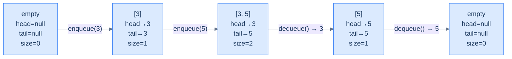
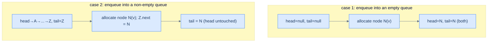
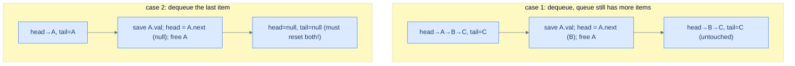

# 3. Linked-List Implementation of Queues

## The Hook

The array queue from the last lesson is fast and cache-friendly, but it has one stubborn limitation: **fixed capacity**. You decide the buffer size at construction, and you live with that decision forever. Run out of room and you either reject the enqueue (back-pressure) or pay an O(N) cost to copy everything to a bigger buffer (resize). Both are fine in their place — but neither is *unbounded*.

A **linked list** lifts the capacity ceiling. Each enqueue allocates one new node and stitches it onto the back of the chain. Each dequeue unlinks the front node and (depending on language) frees it. There's no buffer to fill, no copy to perform, no resize spike. The queue grows one node at a time, limited only by the operating system's willingness to keep handing out memory.

But there's a twist. A *stack* puts everything at the head — push and pop both touch `head`, both are O(1) on a singly-linked list, easy. A *queue* needs O(1) at **both** ends — enqueue at the back, dequeue at the front. Naively, the back of a singly-linked list is O(N) to find (you'd have to walk the whole chain). The fix is to maintain *two pointers* — `head` for the front, `tail` for the back — and update both as items flow through. With both pointers, enqueue is "allocate, link to tail, swing tail" (three pointer moves, O(1)) and dequeue is "save head value, swing head, free old head" (also O(1)). Same asymptotic cost as the array queue, but unbounded by default and with no resize discontinuity.

The trade-off is the usual one for linked structures: every node is a separate heap allocation, scattered across RAM, and the CPU's prefetcher loses. Wall-clock latency of a linked queue is typically 2–5× higher than an array queue *for the same operation count*, despite identical asymptotics. Production systems pick the array queue when capacity is bounded and predictable, and the linked queue when bursts are unpredictable or memory is a hard ceiling on growth.

This lesson builds the linked-list queue end-to-end in Python and Java — same five-method interface as before, but a completely different memory model.

---

## Table of contents

1. [Understanding the problem](#understanding-the-problem)
2. [Structure of a linked-list-based queue](#structure-of-a-linked-list-based-queue)
3. [Supported operations](#supported-operations)
4. [Internal mechanics](#internal-mechanics)
5. [Implementing the queue class using a linked list](#implementing-the-queue-class-using-a-linked-list)
6. [Determining the size of the queue](#determining-the-size-of-the-queue)
7. [Checking if the queue is empty](#checking-if-the-queue-is-empty)
8. [Accessing the front of the queue](#accessing-the-front-of-the-queue)
9. [Accessing the back of the queue](#accessing-the-back-of-the-queue)
10. [Enqueuing an item into the queue](#enqueuing-an-item-into-the-queue)
11. [Dequeuing an item from the queue](#dequeuing-an-item-from-the-queue)
12. [Working example](#working-example)
13. [Design a queue using a linked list](#design-a-queue-using-a-linked-list)
14. [Boss-fight demo](#boss-fight-demo)
15. [Edge cases and pitfalls](#edge-cases-and-pitfalls)
16. [Production reality](#production-reality)
17. [Quiz](#quiz)
18. [Practice ladder](#practice-ladder)
19. [Further reading](#further-reading)
20. [Cross-links](#cross-links)
21. [Final takeaway](#final-takeaway)

***

# Understanding the Problem

An array backs a queue well, but it pins one decision at construction: how big can the queue ever get? A bounded array reserves every slot up front and refuses the enqueue that would overflow. A growable array resizes by copying into a larger buffer, paying an occasional `O(n)` cost. A linked list sidesteps both — it grows one node at a time, with no buffer to size and no copy to amortise.

The difference comes from what "the front" and "the back" refer to in each implementation:

- **Array queue** — the front and back are `index` values into one contiguous buffer; capacity is the buffer's length, and the indices wrap around it.
- **Linked-list queue** — the front is a `head` **pointer** and the back is a `tail` **pointer**; capacity is whatever the machine's memory allows.

A queue is harder to back with a linked list than a stack is. A stack touches only one end, so a single `head` pointer suffices. A queue touches **both** ends — it removes from the front and inserts at the back — and the back of a singly linked list is `O(n)` to reach without help, since each node knows only its `next`. To make this concrete: with only a `head`, an enqueue would walk every node to find where to attach, turning a constant-time operation into a linear one. The fix is a second pointer, `tail`, kept aimed at the last node so the back is reachable in one hop. So the key idea is: a linked list backs a queue when you want unbounded growth with no resize spike — and a `tail` pointer is the one addition that keeps insertion at the back `O(1)`.

***

# Structure of a linked-list-based queue

A linked-list queue stores its front at the **head** of a singly linked list and its back at the **tail**. Four fields wrap that list:

```d2
direction: right

cls: "Queue (linked-list-backed)" {
  h: "head: pointer to front node (null if empty)"
  t: "tail: pointer to back node (null if empty)"
  s: "currentSize: number of nodes"
  c: "capacity: max nodes (bounded variant)"
}

n1: |md
  **val: 3**

  next ●
| {style.fill: "#dcfce7"; style.stroke: "#22c55e"}
n2: |md
  val: 5

  next ●
|
n3: |md
  **val: 7**

  next: null
| {style.fill: "#fef9c3"; style.stroke: "#f59e0b"}

cls.h -> n1
n1 -> n2
n2 -> n3
cls.t -> n3
```

<p align="center"><strong>Linked-list queue — <code>head</code> always points at the front (oldest) node; <code>tail</code> always points at the back (newest) node. The chain itself flows from front to back, mirroring the FIFO order. Enqueue extends past the tail; dequeue advances the head.</strong></p>

## State information

### Front (head pointer)

In the array version, the front was an *index*. Here, it's a **pointer**. `head` references the node holding the oldest still-present item, or is `null` if the queue is empty. `dequeue` reads through `head`, then re-points `head` to `head.next`.

### Back (tail pointer)

The back is also a pointer — `tail` references the node holding the newest item. `enqueue` allocates a new node, links the current `tail.next` to it, then re-points `tail` to the new node. **Without a tail pointer, enqueue would be O(N)** — you'd have to walk the entire list to find where to attach. The tail pointer is the single most important optimisation in a linked-list queue.

> *Why don't we put the back at the head and the front at the tail instead?*
>
> The chain is *one-directional* — each node has a `next` pointer but no `prev`. Removing the tail node would require finding the second-to-last node so you can null its `next` — and that find is O(N) on a singly-linked list. Removing the head, on the other hand, is "swing the head pointer forward", O(1). So the front (where we remove) goes at the head; the back (where we only insert) goes at the tail. A doubly-linked list would let us swap, but the singly-linked list pins the choice.

### Current size

A linked list doesn't know its own length unless someone counts. Walking it to count is O(N); maintaining an integer that's incremented on enqueue and decremented on dequeue makes `size` O(1). Same trick as the array queue — the size invariant lives in a counter, not in the structure.

### Capacity

`capacity` is the maximum allowed size. A *bounded* linked-list queue rejects enqueues when `currentSize == capacity`; an *unbounded* one ignores capacity entirely. We'll build the bounded version to mirror the array queue's interface — same contract, different storage.



<p align="center"><strong>Lifecycle — empty queue has both pointers null. The first enqueue makes both point at the same node. Subsequent enqueues extend the tail; dequeues advance the head. The last dequeue resets both back to null.</strong></p>

> **Edge case to memorise** — a queue with exactly *one* item has `head == tail` (both pointers reference the same node). This matters in two places: (a) the *first* enqueue must set both pointers, not just the tail, and (b) the *last* dequeue must reset both pointers, not just the head. Forget either and you get a dangling stale `tail` or `head` pointing at a freed node — classic use-after-free territory.

***

# Supported Operations

Six operations make up the whole interface, and every one is `O(1)` time and `O(1)` extra space. The set matches the array implementation exactly — same contract, different storage — because a queue is defined by its FIFO behaviour, not by how the nodes are laid out. What changes underneath is the mechanism: an `index` slide over a wrap-around buffer becomes a pointer swing over a chain of nodes.

| Operation | Time | Space | What it does |
|---|---|---|---|
| `size()` | `O(1)` | `O(1)` | Returns `currentSize` — the counter bumped on enqueue, dropped on dequeue |
| `empty()` | `O(1)` | `O(1)` | Returns whether `currentSize == 0` (equivalently `head == null`) |
| `front()` | `O(1)` | `O(1)` | Reads `head.val` without unlinking it (peek at the oldest item) |
| `back()` | `O(1)` | `O(1)` | Reads `tail.val` without unlinking it (peek at the newest item) |
| `enqueue(val)` | `O(1)` | `O(1)` | Links a new node past the `tail`; returns `false` if full |
| `dequeue()` | `O(1)` | `O(1)` | Unlinks and returns the `head` node; returns `-1` if empty |

The two writes operate at opposite ends. `enqueue` only ever touches `tail`, and `dequeue` only ever touches `head` — they never walk the chain between them. Using a queue holding `head → 3 → 5 → 7 ← tail`, `enqueue(9)` links a node after `7` and advances `tail`, while `dequeue()` returns `3` and advances `head` to the node holding `5`. So the core insight is: every operation reads or writes only `head` or `tail`, which is exactly why none of the six depends on how many nodes the chain holds.

***

# Internal Mechanics

Every operation is a rule expressed in terms of the `head` and `tail` pointers, and the list nodes are the passive storage those rules read and re-link. Unlike the array version, where two `index` values slide over a fixed buffer and wrap at its edge, the linked-list version allocates or frees a node on each write and rewires one or two pointers:

- **Enqueue** allocates a node, attaches it after the current `tail`, then moves `tail` to the new node.
- **Dequeue** reads `head.val`, advances `head` to `head.next`, then frees the old head.
- **Front** reads `head.val`; **back** reads `tail.val`; neither moves a pointer.

The delicate part is the empty boundary, where `head` and `tail` move together. An empty queue has both pointers `null`. The *first* enqueue must set **both** — the lone node is simultaneously the front and the back. The *last* dequeue must reset **both** — once `head` advances to `null`, a `tail` still aimed at the freed node is a stale reference. To make this concrete: enqueue into `head → 5 ← tail` attaches a node after `5` and swings only `tail`. But enqueue into an empty queue must point `head` at the new node too, or the next dequeue reads through a `null` front. So the core insight is: the nodes are passive storage and the two pointers are the only live state. Correctness reduces to keeping `head` and `tail` consistent across the empty ⇄ non-empty boundary, where one forgotten assignment strands a node or dangles a pointer.

***

# Implementing the queue class using a linked list

Two pieces: a tiny `ListNode` type for the chain, and the `Queue` class that wraps it.

## Linked list node

A node holds a value and a pointer to the next node. That's the entire definition. The first lesson of the linked-list section already covered this, so we'll keep it minimal.

```d2
direction: right

n: ListNode {
  val: |md
    **val**

    (int)
  |
  next: |md
    **next**

    (pointer)
  |
}
```

<p align="center"><strong>The chain node — one value plus one pointer. Enqueue allocates one of these; dequeue frees one (or relies on garbage collection).</strong></p>

## Queue class — skeleton

The class encapsulates `head`, `tail`, `currentSize`, and `capacity`, exposing the same six operations as the array version.


```python run
class _ListNode:
    __slots__ = ('val', 'next')
    def __init__(self, val):
        self.val, self.next = val, None

class Queue:
    def __init__(self, capacity: int):
        self.capacity     = capacity
        self.head         = None       # front pointer
        self.tail         = None       # back pointer
        self.current_size = 0

    def size(self):       pass
    def empty(self):      pass
    def front(self):      pass
    def back(self):       pass
    def enqueue(self, v): pass
    def dequeue(self):    pass

q = Queue(4); print("created queue with capacity 4")
```

```java run
public class Main {
    static class ListNode {
        int      val;
        ListNode next;
        ListNode(int v) { val = v; }
    }
    static class Queue {
        private ListNode head;          // front of queue
        private ListNode tail;          // back of queue
        private int      currentSize;
        private int      capacity;
        Queue(int capacity) { this.capacity = capacity; }

        int     size()             { return 0;     }
        boolean empty()            { return true;  }
        int     front()            { return -1;    }
        int     back()             { return -1;    }
        boolean enqueue(int val)   { return false; }
        int     dequeue()          { return -1;    }
    }
    public static void main(String[] args) {
        Queue q = new Queue(4);
        System.out.println("created queue with capacity 4");
    }
}
```


Each method is a stub for now — `size()` returns `0`, `enqueue` returns `false`, and so on. The lessons that follow fill them in one at a time, and the final design problem assembles the complete class. The skeleton's job is to fix the four fields every method reads: `head`, `tail`, `currentSize`, and `capacity`.

***

# Determining the size of the queue

We've established the invariant — `currentSize` is updated on every enqueue and dequeue. The size method is then a one-line read. (Walking the list to count would be O(N), and there's no reason to pay that cost when we already know the answer.)

> **Algorithm**
>
> -   **Step 1:** Return the value of `currentSize`.

<details>
<summary><h2>Solution &amp; Analysis</h2></summary>

### Implementation

```python run
from typing import Optional

"""
Definition for singly-linked list.
class ListNode:
    def __init__(self, val):
        self.val = val
        self.next = None
"""

class Queue:
    def __init__(self, capacity: int):

        # Capacity of the queue (maximum number of elements it can hold)
        self.capacity: int = capacity

        # Current number of elements in the queue
        self.current_size: int = 0

        # Reference to the front of the queue
        self.head: Optional[ListNode] = None

        # Reference to the rear of the queue
        self.tail: Optional[ListNode] = None

    def size(self) -> int:

        # Returns the current number of elements in the queue
        return self.current_size
```

```java run
/**
 * Definition for singly-linked list.
 * class ListNode {
 *     int val;
 *     ListNode next;
 *     ListNode() {}
 *     ListNode(int val) { this.val = val; }
 * };
 */

class Queue {

    // Capacity of the queue (maximum number of elements it can hold)
    public int capacity;

    // Current number of elements in the queue
    public int currentSize;

    // Reference to the front of the queue
    public ListNode head;

    // Reference to the rear of the queue
    public ListNode tail;

    public Queue(int capacity) {
        this.capacity = capacity;
        currentSize = 0;
        head = null;
        tail = null;
    }

    public int size() {

        // Returns the current number of elements in the queue
        return currentSize;
    }
}
```

### Complexity Analysis

> **Best Case**
>
> - Time:  **O(1)**
> - Space: **O(1)**
>
> **Worst Case**
>
> - Time:  **O(1)**
> - Space: **O(1)**

</details>

***

# Checking if the queue is empty

`empty()` returns `true` when there are no items. The simplest definition is "size is zero" — and since `size` is O(1), so is `empty`.

> **Algorithm**
>
> -   **Step 1:** Return `true` if `currentSize == 0`, else `false`.

> *Predict before reading on — could we instead check <code>head == null</code>?*
>
> Yes — `head` being null is logically equivalent to `currentSize == 0`. Both invariants hold simultaneously after every operation. We use `currentSize == 0` for symmetry with the array implementation and because it composes cleanly with `currentSize == capacity` (the full check). In a tight inner loop you might prefer the pointer compare to save a memory load — both are correct.

<details>
<summary><h2>Solution &amp; Analysis</h2></summary>

### Implementation

```python run
from typing import Optional

"""
Definition for singly-linked list.
class ListNode:
    def __init__(self, val):
        self.val = val
        self.next = None
"""

class Queue:
    def __init__(self, capacity: int):

        # Capacity of the queue (maximum number of elements it can hold)
        self.capacity: int = capacity

        # Current number of elements in the queue
        self.current_size: int = 0

        # Reference to the front of the queue
        self.head: Optional[ListNode] = None

        # Reference to the rear of the queue
        self.tail: Optional[ListNode] = None

    def size(self) -> int:

        # Returns the current number of elements in the queue
        return self.current_size

    def empty(self) -> bool:

        # Returns True if the queue is empty, False otherwise
        return self.current_size == 0
```

```java run
/**
 * Definition for singly-linked list.
 * class ListNode {
 *     int val;
 *     ListNode next;
 *     ListNode() {}
 *     ListNode(int val) { this.val = val; }
 * };
 */

class Queue {

    // Capacity of the queue (maximum number of elements it can hold)
    public int capacity;

    // Current number of elements in the queue
    public int currentSize;

    // Reference to the front of the queue
    public ListNode head;

    // Reference to the rear of the queue
    public ListNode tail;

    public Queue(int capacity) {
        this.capacity = capacity;
        currentSize = 0;
        head = null;
        tail = null;
    }

    public int size() {

        // Returns the current number of elements in the queue
        return currentSize;
    }

    public boolean empty() {

        // Returns true if the queue is empty, false otherwise
        return currentSize == 0;
    }
}
```

### Complexity Analysis

> **Best Case**
>
> - Time:  **O(1)**
> - Space: **O(1)**
>
> **Worst Case**
>
> - Time:  **O(1)**
> - Space: **O(1)**

</details>

***

# Accessing the front of the queue

`front()` returns the value of the head node. Two cases — empty (`-1`) or read `head.val`.

```d2
direction: right

h: head { shape: oval }
t: tail { shape: oval }

n1: "val: 3" {style.fill: "#dcfce7"; style.stroke: "#22c55e"}
n2: "val: 5"
n3: "val: 7"
nl: "null" { shape: text }

h -> n1
n1 -> n2
n2 -> n3
n3 -> nl
t -> n3

note: "front() returns head.val = 3" { shape: text }
note -> n1
```

<p align="center"><strong>front() — read through the head pointer. The chain is unchanged after the call.</strong></p>

> **Algorithm**
>
> -   **Step 1:** If the queue is empty, return `-1`.
> -   **Step 2:** Otherwise return `head.val`.

<details>
<summary><h2>Solution &amp; Analysis</h2></summary>

### Implementation

```python run
from typing import Optional

"""
Definition for singly-linked list.
class ListNode:
    def __init__(self, val):
        self.val = val
        self.next = None
"""

class Queue:
    def __init__(self, capacity: int):

        # Capacity of the queue (maximum number of elements it can hold)
        self.capacity: int = capacity

        # Current number of elements in the queue
        self.current_size: int = 0

        # Reference to the front of the queue
        self.head: Optional[ListNode] = None

        # Reference to the rear of the queue
        self.tail: Optional[ListNode] = None

    def size(self) -> int:

        # Returns the current number of elements in the queue
        return self.current_size

    def empty(self) -> bool:

        # Returns True if the queue is empty, False otherwise
        return self.current_size == 0

    def front(self) -> int:

        # Returns -1 if the queue is empty
        if self.empty():
            return -1

        # Returns the value of the element at the front of the queue
        if self.head:
            return self.head.val

        return -1
```

```java run
/**
 * Definition for singly-linked list.
 * class ListNode {
 *     int val;
 *     ListNode next;
 *     ListNode() {}
 *     ListNode(int val) { this.val = val; }
 * };
 */

class Queue {

    // Capacity of the queue (maximum number of elements it can hold)
    public int capacity;

    // Current number of elements in the queue
    public int currentSize;

    // Reference to the front of the queue
    public ListNode head;

    // Reference to the rear of the queue
    public ListNode tail;

    public Queue(int capacity) {
        this.capacity = capacity;
        currentSize = 0;
        head = null;
        tail = null;
    }

    public int size() {

        // Returns the current number of elements in the queue
        return currentSize;
    }

    public boolean empty() {

        // Returns true if the queue is empty, false otherwise
        return currentSize == 0;
    }

    public int front() {

        // Returns -1 if the queue is empty
        if (empty()) {
            return -1;
        }

        // Returns the value of the element at the front of the queue
        return head.val;
    }
}
```

### Complexity Analysis

> **Best Case**
>
> - Time:  **O(1)**
> - Space: **O(1)**
>
> **Worst Case**
>
> - Time:  **O(1)**
> - Space: **O(1)**

</details>

***

# Accessing the back of the queue

`back()` returns the value of the tail node. The whole reason we maintain a tail pointer is so this is O(1) — without it, you'd have to walk from `head` to the end of the chain.

```d2
direction: right

h: head { shape: oval }
t: tail { shape: oval }

n1: "val: 3"
n2: "val: 5"
n3: "val: 7" {style.fill: "#fef9c3"; style.stroke: "#f59e0b"}
nl: "null" { shape: text }

h -> n1
n1 -> n2
n2 -> n3
n3 -> nl
t -> n3

note: "back() returns tail.val = 7" { shape: text }
note -> n3
```

<p align="center"><strong>back() — read through the tail pointer. Same constant-time cost as front, thanks to the tail bookkeeping.</strong></p>

> **Algorithm**
>
> -   **Step 1:** If the queue is empty, return `-1`.
> -   **Step 2:** Otherwise return `tail.val`.

<details>
<summary><h2>Solution &amp; Analysis</h2></summary>

### Implementation

```python run
from typing import Optional

"""
Definition for singly-linked list.
class ListNode:
    def __init__(self, val):
        self.val = val
        self.next = None
"""

class Queue:
    def __init__(self, capacity: int):

        # Capacity of the queue (maximum number of elements it can hold)
        self.capacity: int = capacity

        # Current number of elements in the queue
        self.current_size: int = 0

        # Reference to the front of the queue
        self.head: Optional[ListNode] = None

        # Reference to the rear of the queue
        self.tail: Optional[ListNode] = None

    def size(self) -> int:

        # Returns the current number of elements in the queue
        return self.current_size

    def empty(self) -> bool:

        # Returns True if the queue is empty, False otherwise
        return self.current_size == 0

    def front(self) -> int:

        # Returns -1 if the queue is empty
        if self.empty():
            return -1

        # Returns the value of the element at the front of the queue
        if self.head:
            return self.head.val

        return -1

    def back(self) -> int:

        # Returns -1 if the queue is empty
        if self.empty():
            return -1

        # Returns the value of the element at the back of the queue
        if self.tail:
            return self.tail.val

        return -1
```

```java run
/**
 * Definition for singly-linked list.
 * class ListNode {
 *     int val;
 *     ListNode next;
 *     ListNode() {}
 *     ListNode(int val) { this.val = val; }
 * };
 */

class Queue {

    // Capacity of the queue (maximum number of elements it can hold)
    public int capacity;

    // Current number of elements in the queue
    public int currentSize;

    // Reference to the front of the queue
    public ListNode head;

    // Reference to the rear of the queue
    public ListNode tail;

    public Queue(int capacity) {
        this.capacity = capacity;
        currentSize = 0;
        head = null;
        tail = null;
    }

    public int size() {

        // Returns the current number of elements in the queue
        return currentSize;
    }

    public boolean empty() {

        // Returns true if the queue is empty, false otherwise
        return currentSize == 0;
    }

    public int front() {

        // Returns -1 if the queue is empty
        if (empty()) {
            return -1;
        }

        // Returns the value of the element at the front of the queue
        return head.val;
    }

    public int back() {

        // Returns -1 if the queue is empty
        if (empty()) {
            return -1;
        }

        // Returns the value of the element at the back of the queue
        return tail.val;
    }
}
```

### Complexity Analysis

> **Best Case**
>
> - Time:  **O(1)**
> - Space: **O(1)**
>
> **Worst Case**
>
> - Time:  **O(1)**
> - Space: **O(1)**

</details>

***

# Enqueuing an item into the queue

Enqueue allocates a new node and links it to the back of the chain. Two cases:

1. **Queue is full** (`currentSize == capacity`) → reject; return `false`.
2. **Queue is not full** → split into two sub-cases:
   - **Was empty** (`head == null`) → set both `head` and `tail` to the new node.
   - **Was non-empty** → link `tail.next` to the new node, then advance `tail`.

The "was empty" sub-case is the trap. Forgetting to set `head` when enqueueing into an empty queue leaves `head == null` even though the chain has a node — and the next dequeue blows up. *Always* update both pointers on the empty → non-empty transition.



<p align="center"><strong>Enqueue's two flavours — first-into-empty must set both pointers; into-non-empty only advances the tail. Confusing the two is the most common bug in linked queues.</strong></p>

> **Algorithm**
>
> -   **Step 1:** If `currentSize == capacity`, return `false`.
> -   **Step 2:** Allocate a new node holding `val`.
> -   **Step 3:** If the queue is empty, set both `head` and `tail` to the new node.
> -   **Step 4:** Otherwise, set `tail.next = newNode`, then `tail = newNode`.
> -   **Step 5:** Increment `currentSize` and return `true`.

<details>
<summary><h2>Solution &amp; Analysis</h2></summary>

### Implementation

```python run
def enqueue(self, val):
    if self.current_size == self.capacity: return False
    node = _ListNode(val)
    if self.head is None:
        self.head = node
        self.tail = node
    else:
        self.tail.next = node
        self.tail      = node
    self.current_size += 1
    return True
```

```java run
boolean enqueue(int val) {
    if (currentSize == capacity) return false;
    ListNode node = new ListNode(val);
    if (head == null) {
        head = node;
        tail = node;
    } else {
        tail.next = node;
        tail      = node;
    }
    currentSize++;
    return true;
}
```

### Complexity Analysis

A bounds check, an allocation, two or three pointer assignments, an increment. No traversal, no scaling with the queue size.

> **Best Case**
>
> - Time:  **O(1)**
> - Space: **O(1)** (one new node)
>
> **Worst Case**
>
> - Time:  **O(1)**
> - Space: **O(1)**

</details>

***

# Dequeuing an item from the queue

Dequeue advances the head past the front node, frees it (or relies on GC), and returns its value. Two cases:

1. **Queue is empty** → return `-1`.
2. **Queue is non-empty** → save `head.val`, advance `head` to `head.next`, decrement size. **Sub-case:** if the queue is now empty (the dequeued node was also the tail), reset `tail` to null.

That sub-case is the symmetric trap to enqueue's "was empty" sub-case. After dequeueing the *last* item, `head` becomes null automatically (because `head.next` was null) — but `tail` is still pointing at the freed/orphaned node! You must explicitly null `tail` too.



<p align="center"><strong>Dequeue's two flavours — into-non-empty just advances head; into-empty must also null the tail. Forgetting to null the tail leaves it dangling at a freed node, which corrupts the next enqueue.</strong></p>

> **Algorithm**
>
> -   **Step 1:** If the queue is empty, return `-1`.
> -   **Step 2:** Save `val = head.val`.
> -   **Step 3:** Advance `head = head.next`.
> -   **Step 4:** If `head == null` now, also set `tail = null` (queue is empty).
> -   **Step 5:** Free the old head node (where applicable).
> -   **Step 6:** Decrement `currentSize`. Return `val`.

<details>
<summary><h2>Solution &amp; Analysis</h2></summary>

### Implementation

```python run
from typing import Optional

"""
Definition for singly-linked list.
class ListNode:
    def __init__(self, val):
        self.val = val
        self.next = None
"""

class Queue:
    def __init__(self, capacity: int):

        # Capacity of the queue (maximum number of elements it can hold)
        self.capacity: int = capacity

        # Current number of elements in the queue
        self.current_size: int = 0

        # Reference to the front of the queue
        self.head: Optional[ListNode] = None

        # Reference to the rear of the queue
        self.tail: Optional[ListNode] = None

    def size(self) -> int:

        # Returns the current number of elements in the queue
        return self.current_size

    def empty(self) -> bool:

        # Returns True if the queue is empty, False otherwise
        return self.current_size == 0

    def front(self) -> int:

        # Returns -1 if the queue is empty
        if self.empty():
            return -1

        # Returns the value of the element at the front of the queue
        if self.head:
            return self.head.val

        return -1

    def back(self) -> int:

        # Returns -1 if the queue is empty
        if self.empty():
            return -1

        # Returns the value of the element at the back of the queue
        if self.tail:
            return self.tail.val

        return -1

    def enqueue(self, val: int) -> bool:

        # Returns False if the queue is full and cannot enqueue more
        # elements
        if self.current_size == self.capacity:
            return False

        # Create a new node with the given val
        new_node: ListNode = ListNode(val)

        # If the queue is empty, the new node becomes both the front
        # and rear node
        if self.empty():
            self.head = new_node
            self.tail = new_node

        # Otherwise, add the new node to the end of the queue and update
        # the rear reference
        else:

            # Add the new node to the end of the queue
            if self.tail:
                self.tail.next = new_node

            # Update the rear reference to the new node
            self.tail = new_node

        # Increase the current size of the queue
        self.current_size += 1

        # Return True to indicate successful enqueue operation
        return True

    def dequeue(self) -> int:

        # Returns -1 if the queue is empty and cannot dequeue any
        # elements
        if self.empty():
            return -1

        # Create a temporary reference to the front node
        front_node: Optional[ListNode] = self.head

        # Get the value of the front node
        dequeued_val: int = -1
        if front_node:
            dequeued_val = front_node.val

        # Update the front reference to the next node in the queue
        if self.head:
            self.head = self.head.next

        # Release the reference to the previous front node so it can be
        # garbage collected
        del front_node

        # If the front reference is None after dequeue, the queue
        # becomes empty, so update the rear reference as well
        if self.head is None:
            self.tail = None

        # Decrease the current size of the queue
        self.current_size -= 1

        # Return the dequeued value
        return dequeued_val
```

```java run
/**
 * Definition for singly-linked list.
 * class ListNode {
 *     int val;
 *     ListNode next;
 *     ListNode() {}
 *     ListNode(int val) { this.val = val; }
 * };
 */

class Queue {

    // Capacity of the queue (maximum number of elements it can hold)
    public int capacity;

    // Current number of elements in the queue
    public int currentSize;

    // Reference to the front of the queue
    public ListNode head;

    // Reference to the rear of the queue
    public ListNode tail;

    public Queue(int capacity) {
        this.capacity = capacity;
        currentSize = 0;
        head = null;
        tail = null;
    }

    public int size() {

        // Returns the current number of elements in the queue
        return currentSize;
    }

    public boolean empty() {

        // Returns true if the queue is empty, false otherwise
        return currentSize == 0;
    }

    public int front() {

        // Returns -1 if the queue is empty
        if (empty()) {
            return -1;
        }

        // Returns the value of the element at the front of the queue
        return head.val;
    }

    public int back() {

        // Returns -1 if the queue is empty
        if (empty()) {
            return -1;
        }

        // Returns the value of the element at the back of the queue
        return tail.val;
    }

    public boolean enqueue(int val) {

        // Returns false if the queue is full and cannot enqueue more
        // elements
        if (currentSize == capacity) {
            return false;
        }

        // Create a new node with the given val
        ListNode newNode = new ListNode(val);

        // If the queue is empty, the new node becomes both the front
        // and rear node
        if (empty()) {
            head = newNode;
            tail = newNode;
        }

        // Otherwise, add the new node to the end of the queue and update
        // the tail reference
        else {

            // Add the new node to the end of the queue
            tail.next = newNode;

            // Update the tail reference to the new node
            tail = newNode;
        }

        // Increase the current size of the queue
        currentSize++;

        // Return true to indicate successful enqueue operation
        return true;
    }

    public int dequeue() {

        // Returns -1 if the queue is empty and cannot dequeue any
        // elements
        if (empty()) {
            return -1;
        }

        // Create a temporary reference to the front node
        ListNode frontNode = head;

        // Get the value of the front node
        int dequeuedData = frontNode.val;

        // Update the front reference to the next node in the queue
        head = head.next;

        // Release the reference to the previous front node so it can be
        // garbage collected
        frontNode = null;

        // If the front reference is null after dequeue, the queue
        // becomes empty, so update the tail reference as well
        if (head == null) {
            tail = null;
        }

        // Decrease the current size of the queue
        currentSize--;

        // Return the dequeued value
        return dequeuedData;
    }
}
```

### Complexity Analysis

A predicate, a value read, two pointer assignments, a free, a decrement. Independent of queue size.

> **Best Case**
>
> - Time:  **O(1)**
> - Space: **O(1)**
>
> **Worst Case**
>
> - Time:  **O(1)**
> - Space: **O(1)**

</details>

***

# Working Example

Watching `head` and `tail` move through a full enqueue-then-dequeue cycle is the fastest way to make the six operations click — and it shows both pointer-syncing traps in one trace. Start with `Queue(3)` — capacity `3`, `head = null`, `tail = null`, `currentSize = 0` marking it empty. Each step allocates or frees exactly one node and rewires one or both pointers:

1. **`enqueue(1)`** — not full, and the queue is empty, so allocate node `1` and set **both** `head` and `tail` to it. Chain `head → 1 ← tail`, `currentSize == 1`. This is the empty → non-empty transition: both pointers move.
2. **`enqueue(2)`** — not empty, so allocate node `2`, set `tail.next` to it, advance `tail`. `head` is untouched. Chain `head → 1 → 2 ← tail`, `currentSize == 2`.
3. **`enqueue(3)`** — allocate node `3`, link it after `2`, advance `tail`. Chain `head → 1 → 2 → 3 ← tail`, `currentSize == 3` — the queue is now full (`currentSize == capacity`).
4. **`enqueue(4)`** — `currentSize == capacity`, so reject and return `false` without touching any node. The chain is unchanged.
5. **`dequeue()`** — not empty, so read `head.val == 1`, advance `head` to the `2` node, free the old head. The queue still has nodes, so `tail` stays put. Return `1`. Chain `head → 2 → 3 ← tail`, `currentSize == 2`.
6. **`dequeue()`** — read `head.val == 2`, advance `head` to the `3` node, free the old head. Return `2`. Chain `head → 3 ← tail`.
7. **`dequeue()`** — read `head.val == 3`, advance `head` to `null`. Now `head == null`, so **also reset `tail` to `null`** — this is the non-empty → empty transition. Return `3`. The queue is empty again.

The dequeue sequence is `1 2 3` — the three values in insertion order. That ordering is FIFO made literal. The first value enqueued (`1`) is the first dequeued; the last value enqueued (`3`) waits at the back until everything ahead of it has left. So the core insight is: an enqueue-dequeue cycle grows the chain at the `tail` and drains it at the `head`, and the values return in arrival order. The two pointers move together only at the empty boundaries — the first enqueue and the last dequeue.

***

# Design a queue using a linked list

## Problem Statement

Given the skeleton of a **Queue class**, complete it by implementing all the queue operations using a singly linked list internally.

> -   **`Queue(int capacity)`** — initialise the queue with the given capacity.
> -   **`size()`** — return the current size.
> -   **`empty()`** — return `true` if empty, else `false`.
> -   **`front()`** — return the front element; if empty, return `-1`.
> -   **`back()`** — return the back element; if empty, return `-1`.
> -   **`enqueue(int val)`** — add `val` at the back; return `true` on success, `false` if full.
> -   **`dequeue()`** — remove and return the front element; if empty, return `-1`.

<details>
<summary><h2>Constraints</h2></summary>


1. Use a **singly linked list** as the internal storage. Maintain both `head` (front) and `tail` (back) pointers so all operations are O(1).
2. The implementation should be **bounded** by `capacity` (mirroring the array-queue interface).

```d2
direction: right

h: head { shape: oval }
t: tail { shape: oval }

n1: "3" {style.fill: "#dcfce7"; style.stroke: "#22c55e"}
n2: "5"
n3: "7" {style.fill: "#fef9c3"; style.stroke: "#f59e0b"}
nl: "null" { shape: text }

h -> n1
n1 -> n2
n2 -> n3
n3 -> nl
t -> n3
```

<p align="center"><strong>Linked-list queue — head at the front, tail at the back, chain flows front→back. Every operation is O(1) because both ends are directly addressable.</strong></p>

</details>
<details>
<summary><h2>Worked Example</h2></summary>


> **Input:**
>
> `[Queue, enqueue, back, enqueue, front, empty, dequeue, front, enqueue, enqueue, empty]`
>
> `[[2], [2], [], [3], [], [], [], [], [8], [9], []]`
>
> **Expected Output:**
>
> `[null, true, 2, true, 2, false, 2, 3, true, false, false]`
>
> **Trace:**
>
> | Op | Result | Queue state |
> |---|---|---|
> | `Queue(2)` | — | `[]` (capacity 2) |
> | `enqueue(2)` | `true` | `head→2, tail→2` |
> | `back()` | `2` | `head→2, tail→2` |
> | `enqueue(3)` | `true` | `head→2→3, tail→3` (full) |
> | `front()` | `2` | `head→2→3, tail→3` |
> | `empty()` | `false` | `head→2→3, tail→3` |
> | `dequeue()` | `2` | `head→3, tail→3` |
> | `front()` | `3` | `head→3, tail→3` |
> | `enqueue(8)` | `true` | `head→3→8, tail→8` (full) |
> | `enqueue(9)` | `false` | `head→3→8, tail→8` (rejected) |
> | `empty()` | `false` | `head→3→8, tail→8` |

</details>
<details>
<summary><h2>Solution</h2></summary>


```python run viz=linked-list viz-root=head
class _ListNode:
    __slots__ = ('val', 'next')
    def __init__(self, val):
        self.val, self.next = val, None

class Queue:
    def __init__(self, capacity: int):
        self.capacity     = capacity
        self.head         = None
        self.tail         = None
        self.current_size = 0

    def size(self):  return self.current_size
    def empty(self): return self.current_size == 0
    def front(self): return -1 if self.empty() else self.head.val
    def back(self):  return -1 if self.empty() else self.tail.val
    def enqueue(self, v):
        if self.current_size == self.capacity: return False
        node = _ListNode(v)
        if self.head is None: self.head = node
        else:                 self.tail.next = node
        self.tail          = node
        self.current_size += 1
        return True
    def dequeue(self):
        if self.empty(): return -1
        v          = self.head.val
        self.head  = self.head.next
        if self.head is None: self.tail = None
        self.current_size -= 1
        return v

# Boss-fight demo
q = Queue(2)
print(q.enqueue(2), q.back())        # True 2
print(q.enqueue(3), q.front())       # True 2
print(q.empty())                     # False
print(q.dequeue(), q.front())        # 2 3
print(q.enqueue(8), q.enqueue(9))    # True False
print(q.empty())                     # False
```

```java run viz=linked-list viz-root=head
public class Main {
    static class ListNode {
        int      val;
        ListNode next;
        ListNode(int v) { val = v; }
    }
    static class Queue {
        private ListNode head, tail;
        private int      currentSize, capacity;
        Queue(int capacity) { this.capacity = capacity; }

        int     size()  { return currentSize; }
        boolean empty() { return currentSize == 0; }
        int     front() { return empty() ? -1 : head.val; }
        int     back()  { return empty() ? -1 : tail.val; }
        boolean enqueue(int v) {
            if (currentSize == capacity) return false;
            ListNode n = new ListNode(v);
            if (head == null) head = n;
            else              tail.next = n;
            tail = n;
            currentSize++;
            return true;
        }
        int dequeue() {
            if (empty()) return -1;
            int v = head.val;
            head  = head.next;
            if (head == null) tail = null;
            currentSize--;
            return v;
        }
    }
    public static void main(String[] args) {
        Queue q = new Queue(2);
        System.out.println(q.enqueue(2) + " " + q.back());
        System.out.println(q.enqueue(3) + " " + q.front());
        System.out.println(q.empty());
        System.out.println(q.dequeue() + " " + q.front());
        System.out.println(q.enqueue(8) + " " + q.enqueue(9));
        System.out.println(q.empty());
    }
}
```

</details>
<details>
<summary><h2>Final Takeaway</h2></summary>


The linked-list queue is the natural counterpart to the array queue: same FIFO contract, same O(1) per operation, but unbounded growth and no resize discontinuity. The implementation is uglier — pointer juggling, edge cases on the empty/non-empty transition — but the trade-off is exactly what production systems often want.

1. **Two pointers, not one.** The tail pointer is the entire reason enqueue is O(1). Without it, you'd walk the chain every time, turning the queue into an O(N) liability for large workloads. *Always* keep `head` and `tail` in sync.
2. **Mind the empty ⇄ non-empty transition.** Enqueueing into an empty queue must set both pointers; dequeueing the last item must reset both. Forgetting either side leaves a dangling pointer and corrupts the next operation. The two cases account for ~80% of bugs in beginner linked-queue code — write the unit tests first.
3. **Pick the implementation, don't default.** Array queue: contiguous, cache-friendly, fixed capacity, predictable cost — perfect for fixed-size buffers, kernel ring buffers, lock-free designs. Linked queue: unbounded, no resize spike, allocation-per-op, scattered memory — perfect when bursts are unpredictable and memory is the only ceiling. Both are "just" queues; the right answer depends on the workload.

> *Coming up — the duo of cross-data-structure design problems. **Queue using two stacks** uses the LIFO–FIFO inversion to bend a stack into a queue. **Stack using two queues** does the inverse. Both appear in real interview cycles, and both are excellent stress tests for whether you really understand the FIFO/LIFO contracts these structures live by.*

</details>

***

# Edge Cases and Pitfalls

The linked-list queue has no buffer to overrun, so its bugs move from index arithmetic to **pointer order** and **bookkeeping**. Almost every one clusters around the two pointers and the empty boundary where they move together. Keep this list open the next time a linked-list queue misbehaves:

- **Forgetting to set `head` on the first enqueue.** Enqueueing into an empty queue must set **both** `head` and `tail` to the new node. Set only `tail` and `head` stays `null`, so the queue looks empty even though it holds a node — and the next `dequeue()` reads through a `null` front and crashes. The empty → non-empty transition is the one case where enqueue touches `head` at all.
- **Forgetting to null `tail` on the last dequeue.** After dequeueing the final item, `head` becomes `null` automatically because `head.next` was `null` — but `tail` still points at the freed node. The next enqueue then writes `tail.next` through a dangling pointer and either resurrects a ghost node or corrupts the chain. Always check `if head == null` after advancing and reset `tail` to match.
- **Letting `enqueue` walk to find the back.** Without a `tail` pointer, attaching at the back means traversing from `head` to the last node, which is `O(n)` time. Maintain `tail` so `enqueue` is `O(1)`. A `tail` that drifts out of sync with the true last node is the same bug in slow motion — every enqueue after the drift links to the wrong place.
- **Letting `size()` walk the list.** Computing size by traversing every node is `O(n)` time. Maintain `currentSize` as an integer bumped on enqueue and dropped on dequeue so `size()` and `empty()` stay `O(1)`. Miss one increment or decrement and the counter desyncs from the chain, so the capacity check on the next enqueue reads a stale count.
- **The `-1` sentinel collides with real data.** Returning `-1` from `front()`, `back()`, or `dequeue()` to mean "empty" is only unambiguous when `-1` cannot be a stored value. A queue of arbitrary integers makes `-1` indistinguishable from a dequeued `-1`. Guard with `empty()` before every read, or raise an exception instead of returning a sentinel.
- **Assuming "linked list" means "unbounded".** The version built here is bounded — it rejects the enqueue when `currentSize == capacity` and returns `false`. Code that assumes a linked-list queue always accepts an enqueue silently drops data when the return value is ignored. Either honour the boolean return or drop the capacity check to build the genuinely unbounded variant.

***

# Production Reality

The linked-list queue is the default wherever arrival rate is unbounded or bursty and a resize spike is unacceptable. The systems below are worth knowing by name.

**[A language runtime's task / message queue]** — uses **a singly linked queue of work items with `head` and `tail` pointers** — because the backlog has no fixed bound and producers append at the tail while one consumer drains the head, so both ends stay `O(1)` with no buffer to pre-size.

**[An OS scheduler's run queue]** — uses **linked lists of runnable task structs per priority level** — because the number of ready tasks is unknown at boot, and each task already embeds list pointers, so enqueueing a task costs one pointer write with zero extra allocation.

**[A network stack's packet buffer (`sk_buff` / `mbuf` chain)]** — uses **a linked FIFO of packet descriptors** — because packets arrive in unpredictable bursts and must be processed in order, and a linked chain grows one descriptor per packet without ever pausing to copy a full ring.

**[A producer–consumer pipeline with backpressure]** — uses **a bounded linked queue that rejects on `currentSize == capacity`** — because the bound is the backpressure signal, and a linked chain gives predictable per-enqueue latency right up to the cap with no amortised resize cost.

**[A breadth-first traversal frontier]** — uses **a linked queue of nodes to visit next** — because the frontier's size swings wildly with the graph's branching factor, and a linked queue absorbs the swing one node at a time instead of doubling a buffer mid-search.

***

# Quiz

Test your grip before moving on. One answer per question; reveal only after you have committed to one.

**[Recall] Q: In the linked-list queue, which pointer marks the front and which marks the back, and what value marks an empty queue?**
`head` points at the front (oldest) node and `tail` points at the back (newest) node; `head == null` and `tail == null` mark an empty queue (equivalently `currentSize == 0`).

**[Reasoning] Q: Why does a linked-list queue need a `tail` pointer when a linked-list stack needs only `head`?**
A stack touches one end, so `head` covers both push and pop, but a queue inserts at the back and removes at the front; without `tail`, reaching the back means walking the whole chain at `O(n)` time, so `tail` is what keeps `enqueue` at `O(1)`.

**[Reasoning] Q: Why must the last `dequeue` reset `tail` to `null` and not just advance `head`?**
When the final node leaves, `head` becomes `null` on its own, but `tail` still points at the freed node — leaving it dangling means the next `enqueue` writes `tail.next` through a stale pointer and corrupts the chain.

**[Tradeoff] Q: Both the array and linked-list queues are `O(1)` per operation — so when do you reach for the linked-list version, and what do you give up?**
Reach for it when growth is unbounded or bursty and you need worst-case `O(1)` enqueue with no resize spike; you give up cache locality, since every node is a separate heap allocation the CPU cannot prefetch on the way to the next dequeue.

**[Recall] Q: What two pieces of state does the queue keep besides the chain of nodes, and why?**
It keeps `currentSize` so `size()` and `empty()` are `O(1)` instead of an `O(n)` walk, and `capacity` so a bounded queue can reject an enqueue once `currentSize == capacity`.

***

# Practice Ladder

The queue chapter ships no pattern-problem directory, so this ladder points into the chapter's design challenges and the introductory lessons that exercise the FIFO contract directly. Try each unaided; hit the hint after ten minutes; do not peek at solutions until you have written something runnable.

<!-- VERIFY: confirm Practice Ladder targets resolve — queue chapter has no 02-problems/ dir; links point at design-challenge anchors in 05-design-a-queue/01-design-a-queue.md and at the array-impl design section -->

| # | Problem | Pattern | Difficulty | Hint |
|---|---------|---------|------------|------|
| 1 | [Design a Queue (linked list)](#design-a-queue-using-a-linked-list) | Linked-list backing | Easy | Maintain `head`, `tail`, and `currentSize`; set both pointers on the first enqueue, reset both on the last dequeue. `O(1)` per op. |
| 2 | [Design a Queue (circular array)](./02-array-implementation-of-queues.md#design-a-queue-using-a-circular-array) | Circular buffer | Easy | Track `frontIndex`, `currentSize`, and wrap with modulo; compare the contiguous-buffer tradeoff against this lesson's chain. |
| 3 | [Design a Queue using Stacks](./05-design-a-queue/01-design-a-queue.md#design-a-queue-using-stacks) | LIFO→FIFO inversion | Medium | Two stacks: push onto an inbox; when the outbox empties, pour the inbox into it so the order flips back to FIFO. Amortised `O(1)`. |
| 4 | [Design a Stack using Queues](./05-design-a-queue/01-design-a-queue.md#design-a-stack-using-queues) | FIFO→LIFO inversion | Medium | Rotate the queue after each push so the newest item sits at the front, making `pop` read it first. `O(n)` push, `O(1)` pop. |
| 5 | [Design a Stack using a Single Queue](./05-design-a-queue/01-design-a-queue.md#design-a-stack-using-a-single-queue) | FIFO→LIFO inversion | Hard | One queue: after enqueueing, rotate the `size - 1` older items to the back so the newest reaches the front in one pass. |

Once these feel automatic, enqueue and dequeue have stopped being syntax and become a structural reflex. The backing store — array or linked list — then stops mattering to the algorithm on top.

***

# Further Reading

Curated paths in, not a syllabus. Read in order of the annotation; come back for the rest when you need depth.

- **[CLRS — Chapter 10.1 (Queues) and 10.2 (Linked Lists)](https://mitpress.mit.edu/9780262046305/introduction-to-algorithms/)**
  ★ Essential — the canonical queue interface alongside the singly linked list with its `head` pointer and `O(1)` head deletion, the two primitives this lesson combines with a `tail` pointer.
- **[Introduction to Singly Linked Lists](/cortex/data-structures-and-algorithms/linear-structures-singly-linked-list-introduction-to-singly-linked-lists)**
  ★ Essential — the node-with-`next` layout and the head/tail mechanics this whole lesson rests on; read it first if pointer rewiring feels shaky.
- **[The Linux Kernel — linked list and queue primitives (`list_head`)](https://www.kernel.org/doc/html/latest/core-api/kernel-api.html#list-management-functions)**
  ◆ Advanced — how the kernel threads tasks and buffers onto intrusive linked lists, the production form of the `head`/`tail` design carrying live system state.
- **[Michael & Scott — "Simple, Fast, and Practical Non-Blocking and Blocking Concurrent Queue Algorithms"](https://www.cs.rochester.edu/~scott/papers/1996_PODC_queues.pdf)**
  → Reference — the lock-free linked queue that swings `head` and `tail` with atomic compare-and-swap; shows why two pointers are exactly the right shared state for a concurrent FIFO.

***

# Cross-Links

**Prerequisites**

- [Introduction to Queues](/cortex/data-structures-and-algorithms/linear-structures-queue-introduction-to-queues) — the FIFO contract and the enqueue / dequeue / front / back / empty / size interface this lesson implements over a singly linked list.
- [Introduction to Singly Linked Lists](/cortex/data-structures-and-algorithms/linear-structures-singly-linked-list-introduction-to-singly-linked-lists) — the `head` pointer, the node-with-`next` layout, and the `O(1)` head deletion that makes `dequeue` constant time.
- [Array Implementation of Queues](/cortex/data-structures-and-algorithms/linear-structures-queue-array-implementation-of-queues) — the same six operations over a wrap-around buffer; read it first to feel the tradeoff this lesson flips.

**What comes next**

- [Design a Queue](/cortex/data-structures-and-algorithms/linear-structures-queue-design-a-queue-design-a-queue) — the cross-structure challenges: build a queue from two stacks and a stack from queues, stress-testing whether the FIFO and LIFO contracts have become reflex.

***

## Final Takeaway

1. **Core mechanic:** keep the front at the `head` of a singly linked list and the back at a `tail` pointer, enqueue by linking a node past the `tail` and advancing it, dequeue by reading `head.val` and advancing `head` — every operation is `O(1)` time and `O(1)` extra space, with a `currentSize` counter so `size()` stays `O(1)` too.
2. **Dominant tradeoff:** you gain unbounded growth and worst-case `O(1)` enqueue with no resize spike; you give up cache locality, since each node is a separate heap allocation the CPU cannot prefetch on the way to the next dequeue.
3. **One thing to remember:** `head` and `tail` move together only at the empty boundaries — set both on the first enqueue, reset both on the last dequeue — so the entire queue is correct exactly when neither pointer is ever left stranded or dangling.
