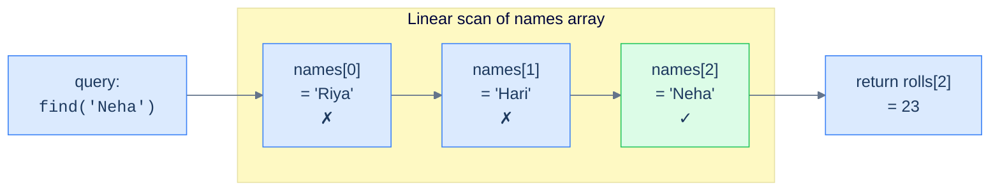
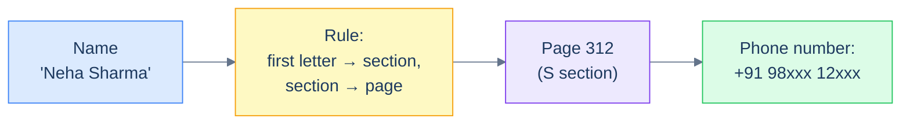
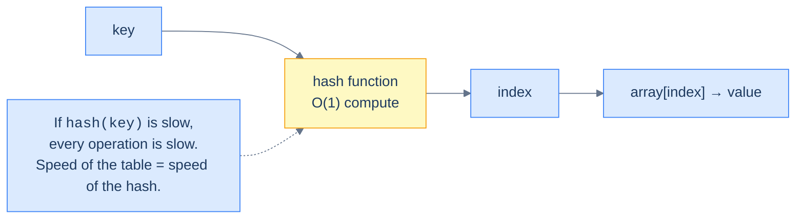
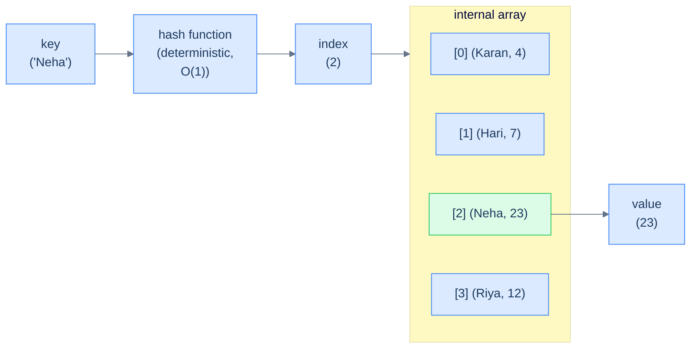
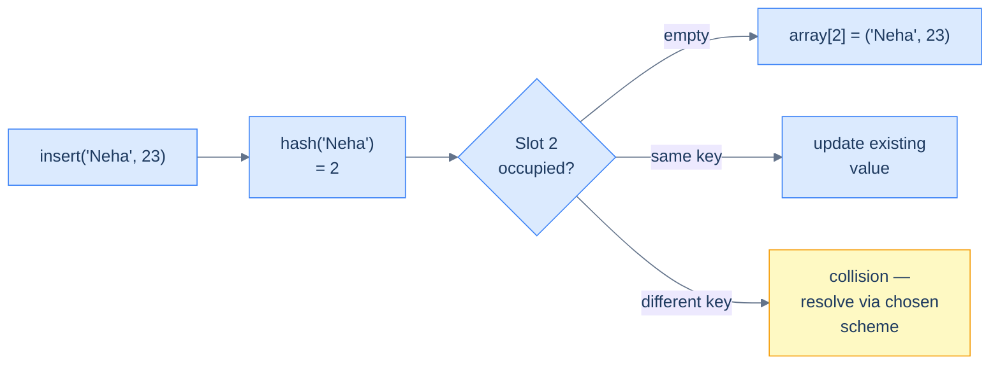
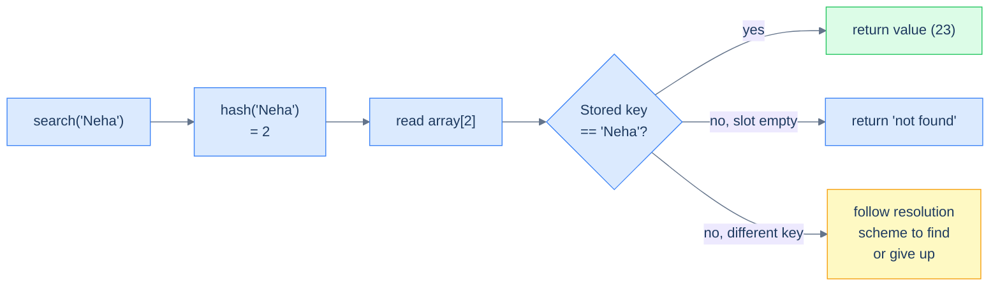
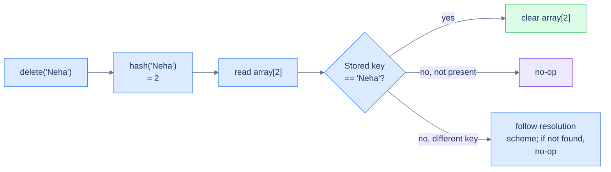

# 1. Introduction to Hash Tables

## The Hook

Type a friend's name into your phone. Before your finger leaves the screen, the contact is on screen. Five billion humans on this planet, and your phone found *one* of them in roughly the time it takes light to cross a room. Now imagine the lazy way: scroll through every contact one by one until you find the right name. On a list of 5,000 contacts that's maybe a second. On a list of 5 billion, that's *years* of scrolling.

The trick that bridges those two worlds — that turns "search a billion items" into "look in exactly one place" — is a single, brutal idea: **stop searching, start computing**. Don't *find* where the data is; *calculate* where it is.

That's a **hash table**. It's the data structure behind every database index, every Python `dict` and Java `HashMap`, every cache in front of every web service you've ever loaded, every set of users that needs to be checked for duplicates, every compiler's symbol table, and a sizeable chunk of every interview you'll ever sit. Master this lesson, and the rest of the course will feel like watching the same magic trick from increasingly clever angles.

---

## Table of contents

1. [Understanding the problem](#understanding-the-problem)
2. [Exploring a possible solution](#exploring-a-possible-solution)
3. [Defining a hash function](#defining-a-hash-function)
4. [Properties of a good hash function](#properties-of-a-good-hash-function)
5. [Examples of hash functions](#examples-of-hash-functions)
6. [Internal mechanics of a hash table](#internal-mechanics-of-a-hash-table)
7. [Overview of supported operations](#overview-of-supported-operations)
8. [Working example](#working-example)
9. [Edge cases and pitfalls](#edge-cases-and-pitfalls)
10. [Production reality](#production-reality)
11. [Quiz](#quiz)
12. [Practice ladder](#practice-ladder)
13. [Further reading](#further-reading)
14. [Cross-links](#cross-links)
15. [Final takeaway](#final-takeaway)

***

# Understanding the problem

Before we can appreciate a hash table, we have to feel the pain it removes. So let's reach for a problem you'd run into within five minutes of writing real software: **storing a mapping between two pieces of data**.

Picture a classroom. Every student has a **name** (a string) and a **roll number** (a positive integer). The school's software has to answer one question, fast and often: *"Given a name, what's the roll number?"* That's a mapping problem — *names* on one side, *roll numbers* on the other, and a relationship that connects each name to exactly one number.

```d2
direction: right

keys: Names (strings) {
  k1: "'Riya'"
  k2: "'Hari'"
  k3: "'Neha'"
  k4: "'Karan'"
}

vals: Roll numbers (integers) {
  v1: "12"
  v2: "7"
  v3: "23"
  v4: "4"
}

keys.k1 -> vals.v1
keys.k2 -> vals.v2
keys.k3 -> vals.v3
keys.k4 -> vals.v4
```

<p align="center"><strong>The mapping problem in its simplest form — every name on the left must point to exactly one roll number on the right. The question is not <em>can</em> we store this, it's <em>can we look it up fast?</em></strong></p>

The first idea anyone has is also the most natural one: keep two parallel arrays — one of names, one of roll numbers — and trust that the same index in both arrays describes the same student. Index 0 of `names` and index 0 of `rolls` belong to the same person, index 1 to the next, and so on.

```d2
names: names {
  grid-columns: 4
  grid-gap: 0
  n0: "'Riya'"
  n1: "'Hari'"
  n2: "'Neha'"
  n3: "'Karan'"
}

rolls: rolls {
  grid-columns: 4
  grid-gap: 0
  r0: "12"
  r1: "7"
  r2: "23"
  r3: "4"
}

idx: indices {
  grid-columns: 4
  grid-gap: 0
  i0: index 0 {style.fill: "#fef9c3"; style.stroke: "#d97706"}
  i1: index 1 {style.fill: "#fef9c3"; style.stroke: "#d97706"}
  i2: index 2 {style.fill: "#fef9c3"; style.stroke: "#d97706"}
  i3: index 3 {style.fill: "#fef9c3"; style.stroke: "#d97706"}
}
```

<p align="center"><strong>Two parallel arrays representing the same mapping — the top row is <code>names</code>, the middle row is <code>rolls</code>, and the implicit contract is that <code>names[i]</code> and <code>rolls[i]</code> belong to the same student.</strong></p>

This *works*. It really does — for tiny classes. But step back and ask the obvious question: *given the name "Neha", how do you actually retrieve her roll number?* Because the link between the arrays is the index, and the index of "Neha" is not written down anywhere, you have to **find it** — by scanning `names` from position 0, comparing each entry to "Neha", until you hit her.



<p align="center"><strong>Searching for "Neha" by name — every miss is a wasted comparison, and the worst case requires reading every element of the array. For 50 students that's 50 comparisons; for 50 million users it's 50 million.</strong></p>

This solves the problem at hand — barely. The cost is a **linear scan** that, in the worst case, touches every element. That might be tolerable for one classroom. But what if your "classroom" is *every student in every school in a city*? What about every customer of an online store? Every URL in a web crawler's database? You can't afford to walk a billion items every time someone presses a key.

## Limitations of storing mappings in two arrays

The two-array idea has a kind of folksy charm, but it carries two structural defects that no amount of cleverness can fix:

> -   **Bad performance:** Searching for data stored in an array has linear **O(N)** worst-case time complexity. The cost of a lookup grows in lockstep with the size of the data.
> -   **Fixed size:** A classical array's size is fixed at the moment of creation — it cannot expand or shrink later, so you must guess the maximum number of students up front.

Could we patch the second flaw with a **dynamic array** that grows on demand? Sure. That fixes the size problem, but the lookup is *still* O(N). The fundamental issue isn't the array — it's the fact that **the index of a student's name is not derivable from the name itself**. Every lookup is a search.

> *Hold that thought before reading on — what if, instead of <em>searching</em> for the index of a name, we could <strong>compute</strong> it directly from the name? What kind of magic would that take?*

***

# Exploring a possible solution

The fix isn't to scan faster. It's to *not scan at all*. We need a data structure designed from the ground up around one rule: **the location of a value should be a function of its key**. Hand it a name, and without a single comparison, it knows where the roll number lives.

That data structure is a **hash table**, and the most familiar example of it in the physical world is something you've probably held in your hand: a phone book.

## Real life example

A phone book is a thick directory of names and phone numbers, listed in alphabetical order. You don't read it cover to cover. You don't even start at page 1 and flip forward. You **jump** — directly to the page where names starting with that letter live, then to the page where that prefix narrows further, and within seconds you're looking at the number you came for.

That speed isn't a property of the *information* in the phone book. It's a property of the **layout**: the alphabetical ordering acts as a function that turns a name into a page number. Once you have a page number, the phone number is one short scan away. The "search" has been replaced with a *calculation* (using the name's first letter to index into the alphabet).



<p align="center"><strong>Looking up a phone number in a phone book — the name is fed to a simple rule (alphabetical layout), the rule yields a page number, and the page yields the phone number. The intermediate "page number" is the entire trick.</strong></p>

That intermediate value — the **page number** — is the soul of the idea. We never search for it; we *derive* it from the name. And once we have it, the data is one direct read away.

## Hash table

A **hash table** is a data structure that stores mappings between **keys** and **values** and provides constant-time **O(1)** search, insert, and delete operations in the average case. Like the phone book, a hash table uses a function — called a **hash function** — to translate a key into an intermediate integer (the **hash value**). That integer is used as an index into an internal array where the data actually lives.

Three concrete pieces, working together:

> -   **Key** — the input you have (e.g. the student's name `"Neha"`).
> -   **Hash function** — the rule that turns a key into an integer index.
> -   **Internal array** — where the key-value pair is physically stored, indexed by the hash value.

```d2
direction: right

key: |md
  key

  'Neha'
| {shape: oval}

hf: hash function {shape: oval}

arr: internal array {
  grid-rows: 4
  grid-gap: 0
  a0: |md
    **[0]**

    "(Karan, 4)"
  |
  a1: |md
    **[1]**

    "(Hari, 7)"
  |
  a2: |md
    **[2]**

    "(Neha, 23)"
  | {style.fill: "#dcfce7"; style.stroke: "#16a34a"}
  a3: |md
    **[3]**

    "(Riya, 12)"
  |
}

key -> hf -> arr.a2: index 2
arr.a2 -> v: value 23
v: "23" {shape: oval}
```

<p align="center"><strong>How a hash table answers a lookup — the key is hashed into an array index, and the value at that index is returned in one read. No scan, no comparisons walking the array.</strong></p>

## Logical representation

When we draw a hash table on paper or talk about it in interviews, we don't usually draw the underlying array. We draw a **table** with two columns — one for keys, one for values — where each row stores a single mapping. The internal array exists, but it's an implementation detail; the table view is the abstraction the user reasons about. We'll use this exact representation throughout the course.

```d2
table: {
  grid-rows: 5
  grid-gap: 0
  hk: "**Key**" {style.fill: "#fef9c3"; style.stroke: "#d97706"}
  hv: "**Value**" {style.fill: "#fef9c3"; style.stroke: "#d97706"}
  k1: "'Riya'"
  v1: "12"
  k2: "'Hari'"
  v2: "7"
  k3: "'Neha'"
  v3: "23"
  k4: "'Karan'"
  v4: "4"
}
```

<p align="center"><strong>Logical view of a hash table — a two-column table where each row is one key-value mapping. This is the mental model you carry around; the actual array-and-hash-function machinery is hidden underneath.</strong></p>

> *Pause and predict — we said the hash function turns a key into an array index. The internal array has a fixed size (say, 8 slots). What happens if our school has 80 students? Or 8 million? Eight slots, eight million keys — something has to give. Hold that question; we'll arrive at the answer in pieces.*

***

# Defining a hash function

A hash function isn't optional decoration — it's the engine. Everything else (the array, the operations, the performance guarantees) is built on top of it. So before we can dissect a hash table, we have to make the hash function feel concrete, and that starts with a slightly older idea: a **mathematical function**.

## Mathematical function

In pure mathematics, a function from a set **K** to a set **V** is the rule that assigns *exactly one* value in **V** to *every* element in **K**. The set **K** is called the **domain** (the inputs), and **V** is called the **codomain** (the possible outputs). The data in those sets can be of any type — integers, strings, objects, points in space, anything — but the *contract* is the same: every input maps to one output.

```d2
direction: right

dom: Domain K (inputs) {
  k1: k1
  k2: k2
  k3: k3
  k4: k4
}

cod: Codomain V (outputs) {
  v1: v1
  v2: v2
  v3: v3
}

dom.k1 -> cod.v1: f
dom.k2 -> cod.v2: f
dom.k3 -> cod.v3: f
dom.k4 -> cod.v2: f
```

<p align="center"><strong>A mathematical function maps every element of its domain <code>K</code> to exactly one element in its codomain <code>V</code>. Two different inputs are allowed to land on the same output (notice <code>k₂</code> and <code>k₄</code> both map to <code>v₂</code>) — this freedom is what makes hashing possible later.</strong></p>

Most of us first met functions through numbers — `f(x) = x + 1`, `f(x) = x²`, `f(x) = x mod 10`. These are tiny, total recipes that take an input and return an output, every time, deterministically.

```d2
f1: "f(x) = x + 1" {
  direction: right
  i1: "x = 5"
  o1: "6"
  i2: "x = 12"
  o2: "13"
  i1 -> o1
  i2 -> o2
}

f2: "f(x) = x squared" {
  direction: right
  i1: "x = 4"
  o1: "16"
  i2: "x = 9"
  o2: "81"
  i1 -> o1
  i2 -> o2
}

f3: "f(x) = x mod 10" {
  direction: right
  i1: "x = 47"
  o1: "7"
  i2: "x = 1234"
  o2: "4"
  i1 -> o1
  i2 -> o2
}
```

<p align="center"><strong>Three example mathematical functions — each takes an input and produces a single, deterministic output. The first two have an unbounded codomain (any integer); the last one always returns a value in <code>{0, 1, ..., 9}</code>. That last property is the seed of the hash function idea.</strong></p>

Mathematical functions place **no restriction** on the size of their domain or codomain. Both can be infinite, both can be tiny, or one can be huge and the other can be small. That last case — *huge domain mapped into a small codomain* — is exactly where hash functions live.

## Hash function

A **hash function** is a mathematical function whose **codomain is finite** (and usually small). The domain — the set of all keys the function might be asked about — is allowed to be enormous, even infinite. The function's job is to *squeeze* that vast input space down into a bounded output space.

> Any mathematical function with a fixed-size codomain qualifies as a hash function. Most mathematical functions are *not* hash functions — `f(x) = x + 1` produces a different output for every integer input, so its codomain is the entire set of integers, which is infinite.

```d2
all: All mathematical functions {
  hash: Hash functions (finite codomain) {
    h1: "x mod 10"
    h2: "middle digit of x squared"
    h3: "first letter index of name"
  }
  out1: "x + 1 (infinite codomain)"
  out2: "x squared (infinite codomain)"
}
```

<p align="center"><strong>The set of all mathematical functions is huge — hash functions are the strict subset whose codomain has a fixed, finite size. Every hash function is a mathematical function, but most mathematical functions are not hash functions.</strong></p>

The output of a hash function — the elements of its codomain — has many names you'll see in the wild: **hash values**, **hash codes**, **digests**, or just **hashes**. They all mean the same thing.

```d2
yes: Hash function (finite codomain) {
  direction: right
  y1: |md
    f(x) = x mod 10

    codomain = {0..9}
  |
  y2: |md
    f(x) = middle 2 digits of x squared

    codomain = {0..99}
  |
}

no: Not a hash function (infinite codomain) {
  direction: right
  n1: |md
    f(x) = x + 1

    codomain = Z
  |
  n2: |md
    f(x) = x squared

    codomain = Z+
  |
}
```

<p align="center"><strong>Revisiting our example functions — the first two restrict their output to a finite set, so they are hash functions. The last two can produce arbitrarily large outputs, so they are mathematical functions but not hash functions.</strong></p>

## Collision

Here's the unavoidable consequence of the rule we just stated: a hash function takes a (potentially infinite) set of inputs and forces them into a finite set of outputs. By **the pigeonhole principle**, if you have more pigeons than holes, some hole must contain at least two pigeons. The same is true here — give a hash function enough keys, and *some* of them must land on the same hash value.

> **Collision**
>
> When two *different* keys in the domain map to the *same* hash value in the codomain, it is called a **collision**.

```d2
direction: right

k1: "'Hari'"
k2: "'Riya'"
h: index 3 {style.fill: "#fee2e2"; style.stroke: "#ef4444"}
note: |md
  Both keys want
  the same slot —
  this is a collision
| {style.fill: "#fef9c3"; style.stroke: "#d97706"}

k1 -> h: hash
k2 -> h: hash
h -> note
```

<p align="center"><strong>A collision — two distinct keys (<code>'Hari'</code> and <code>'Riya'</code>) hash to the same index. The hash function is doing its job correctly; the collision is a <em>structural</em> consequence of squeezing a large domain into a small codomain.</strong></p>

The whole *point* of a hash function is to compress a large input space into a small output space, so collisions aren't a bug — they're a feature of the territory. What we *can* do is choose a hash function carefully so that collisions are **rare** and the function is **fast** to compute. Those two properties — low collision probability and quick evaluation — are the headline criteria for "is this a good hash function?"

> *Predict before reading on — if collisions are inevitable, what should the hash table actually <strong>do</strong> when two keys collide? Pick the one you'd implement first, mentally. We'll come back to this in the section on internal mechanics.*

***

# Properties of a good hash function

We've established what a hash function *is*. But you can write a thousand different hash functions, and most of them will be terrible. The difference between a great hash function and a useless one shows up the moment you put real data through it. Three properties separate the good from the bad.

## Uniformity

A good hash function spreads keys **evenly** across its codomain. If the codomain has 100 slots and we feed in 1000 keys, an ideal hash function gives each slot roughly 10 keys — not 990 in one slot and zero in another. A perfectly uniform hash function maps the same number of domain elements to every codomain element.

The classic example is the **modulo function**, `f(x) = x mod m`. If your keys are uniformly distributed integers, then `x mod m` distributes them across `{0, 1, ..., m-1}` evenly. That's why it's the default starting point for integer hashing.

```d2
direction: right

keys: Domain (12 keys) {
  grid-rows: 3
  grid-gap: 8
  k1: k1
  k2: k2
  k3: k3
  k4: k4
  k5: k5
  k6: k6
  k7: k7
  k8: k8
  k9: k9
  k10: k10
  k11: k11
  k12: k12
}

slots: Codomain (4 slots — uniform) {
  s0: "[0] — 3 keys"
  s1: "[1] — 3 keys"
  s2: "[2] — 3 keys"
  s3: "[3] — 3 keys"
}

keys.k1 -> slots.s0
keys.k2 -> slots.s1
keys.k3 -> slots.s2
keys.k4 -> slots.s3
keys.k5 -> slots.s0
keys.k6 -> slots.s1
keys.k7 -> slots.s2
keys.k8 -> slots.s3
keys.k9 -> slots.s0
keys.k10 -> slots.s1
keys.k11 -> slots.s2
keys.k12 -> slots.s3
```

<p align="center"><strong>Uniform distribution — twelve keys spread evenly across four slots, three per slot. A poorly distributed hash function would dump (say) ten keys into slot [0] and one each into slots [1], [2], and [3], wrecking the average-case lookup time.</strong></p>

Why does uniformity matter so much? Because the moment two keys collide, the cost of operating on them rises. If a hash function piles every key onto the same index, you've quietly turned an O(1) data structure back into an O(N) one — congratulations, you've reinvented the linked list.

## Deterministic

A hash function must be **deterministic**: the same input must *always* produce the same output. There can be no randomness, no time-of-day dependency, no memory-address quirks. Hash `"Neha"` today and you get index 2; hash `"Neha"` six months from now in a different machine, in a different process, on the moon — you must still get index 2.

| When | Input | `hash(key)` | Output |
|---|---|---|---|
| Call 1 — Monday | `'Neha'` | hash | **index 2** |
| Call 2 — Friday | `'Neha'` | hash | **index 2** |
| Call 3 — six months later | `'Neha'` | hash | **index 2** |

<p align="center"><strong>Determinism in action — the same key produces the same hash every single time, no exceptions. Without this guarantee, the slot you stored a value in this morning would be empty when you came back to find it.</strong></p>

The reason for this rule is brutally practical. We *store* a value at the index returned by `hash(key)`. We later *retrieve* the value by recomputing `hash(key)` and looking at that index. If the function returned a different index on retrieval than it did on insertion, the value would be at one slot and our search would look at another. The whole structure breaks the moment the function isn't deterministic.

## Efficient

The hash function is invoked on **every single operation** — every insert, every search, every delete. If hashing a key takes 1 millisecond, then 1,000 lookups already cost 1 second of pure hashing, before we've touched the array. The hash function therefore has to be **fast** — ideally, almost free. Constant-time arithmetic on the bits of the key is the gold standard; anything that requires nontrivial work per byte starts to erode the O(1) promise the table is selling.



<p align="center"><strong>The hash function sits on the critical path of every hash-table operation — its runtime is multiplied by every insert, search, and delete. Slow hash function ⇒ slow hash table, no matter how good the rest of the implementation is.</strong></p>

Three properties — **uniform**, **deterministic**, **efficient** — and a hash function that nails all three is what turns a hash table from a clever toy into the workhorse you'll meet inside every standard library on Earth.

> *Quick test before moving on — would <code>f(key) = 0</code> qualify as a hash function under the formal definition? Is it deterministic? Is it efficient? Is it uniform? What would a hash table built on it actually behave like?*
>
> Yes, it is technically a hash function — finite codomain (`{0}`), deterministic (always returns 0), and efficient (instant). It fails *spectacularly* on uniformity: every key maps to slot 0, and the table degenerates into one giant linked list of collisions. The lookup is O(N). This is the lesson — being a hash function is not enough; being a *good* one is what creates the magic.

***

# Examples of hash functions

Now that we know that a hash function is just a subset of all mathematical functions, it should be easy to see that there are infinitely many of them, and writing one is not hard. Let's walk through four canonical examples — they cover most of the patterns you'll encounter, and each one teaches a different intuition.

## Identity hash function

The simplest hash function is the one that does almost nothing: it returns the key as-is. The domain and codomain are the same set, and `hash(key) = key`. This works only when the domain is itself **finite and small** — typically when the keys are already integers in a known, bounded range.

For example, if you're hashing the digits 0–9, `hash(d) = d` is a perfectly good hash function. Slot `d` of the array stores the data for digit `d`.

```d2
dom: "Domain = Codomain = {0..9}" {
  direction: right
  k0: "0"
  h0: "0"
  k1: "1"
  h1: "1"
  k2: "2"
  h2: "2"
  k3: "3"
  h3: "3"
  k4: "4"
  h4: "4"
  k0 -> h0
  k1 -> h1
  k2 -> h2
  k3 -> h3
  k4 -> h4
}
```

<p align="center"><strong>Identity hash function — the key <em>is</em> the hash. Trivially deterministic, instant to compute, and perfectly uniform over its bounded domain. Useless when keys are large or unbounded, because the array would have to be just as large.</strong></p>

## Trivial hash functions

When the domain is small but doesn't match the array's index range, a *trivial* transformation often suffices. Suppose your keys are integers in `[1000, 2000]` and you want hash values in `[0, 99]`. You could simply **extract the middle two digits** of the key and use them as the hash. The key `1473` becomes hash `47`; the key `1819` becomes hash `81`.

```d2
direction: right

k1: "1473"
h1: "47"
k2: "1819"
h2: "81"
k3: "1234"
h3: "23"
k4: "1058"
h4: "05"

k1 -> h1: "extract middle two digits"
k2 -> h2: "extract middle two digits"
k3 -> h3: "extract middle two digits"
k4 -> h4: "extract middle two digits"
```

<p align="center"><strong>A trivial digit-extraction hash function — works because both the domain and codomain are tightly bounded. Just enough math to fit keys into the array; just little enough to stay O(1).</strong></p>

## Division hash function

When both keys and hashes are integers, the **division method** (also called modulo hashing) is the simplest serious choice. Pick a codomain size **Y** (your array length), and define:

```
hash(key) = key mod Y
```

The remainder is always in `[0, Y-1]` — exactly the range of valid array indices.

```d2
ex: "hash(key) = key mod 7" {
  direction: right
  k1: "key = 23"
  h1: "23 mod 7 = 2" {style.fill: "#fef9c3"; style.stroke: "#d97706"}
  k2: "key = 47"
  h2: "47 mod 7 = 5"
  k3: "key = 100"
  h3: "100 mod 7 = 2" {style.fill: "#fef9c3"; style.stroke: "#d97706"}
  k4: "key = 77"
  h4: "77 mod 7 = 0"
  k1 -> h1
  k2 -> h2
  k3 -> h3
  k4 -> h4
}

note: |md
  Notice 23 and 100 both map to index 2 —
  collisions are real, even with a good function.
|

note -> ex.h1 {style.stroke-dash: 3}
```

<p align="center"><strong>Division hashing with <code>Y = 7</code> — every integer key is reduced to a remainder in <code>{0..6}</code>. Choosing <code>Y</code> to be a prime tends to spread keys most uniformly, especially when the keys themselves have hidden patterns.</strong></p>

A subtle but important detail: the choice of `Y` matters enormously. If your keys are all multiples of 4 and you pick `Y = 8`, every key collapses into just 2 slots (0 and 4). Picking `Y` to be a **prime number** is a folklore rule of thumb because primes have no small factors that align with the bit patterns of typical keys, so the remainders stay well-spread.

## Mid-square hash function

The **mid-square method** is a smarter cousin of digit extraction. The recipe:

1. **Square** the key.
2. From the square, **take the middle `r` digits** as the hash value.

Why squaring? Because when you square an integer, *every* digit of the key contributes to *every* digit of the result — the high digits and the low digits get tangled together in the multiplication. So when you snip out the middle, you're getting a value that's been influenced by the whole key, not just a fragment of it. The output range is `[0, base^r)`, where `base` is the numeric base (10 for decimal).

```d2
direction: right

k1: "key = 123"
sq1: "123^2 = 15129"
m1: "middle 2 digits = 51"

k2: "key = 478"
sq2: "478^2 = 228484"
m2: "middle 2 digits = 84"

k3: "key = 902"
sq3: "902^2 = 813604"
m3: "middle 2 digits = 36"

k1 -> sq1 -> m1
k2 -> sq2 -> m2
k3 -> sq3 -> m3
```

<p align="center"><strong>Mid-square hashing with <code>r = 2</code> — the key is squared, and the middle two decimal digits are extracted. Each output digit is influenced by every input digit, so the spread tends to be more uniform than naïve digit extraction.</strong></p>

Compare this with the division method: division throws away the high digits entirely (the remainder only sees the low end), while mid-square scrambles every digit before keeping a few. For keys with skewed distributions (say, all ending in 0), mid-square often distributes more evenly than `key mod Y`.

## Takeaway

What these examples should make obvious is that there is no single "the hash function" — there is a *family* of techniques, each with strengths in particular regimes:

- **Identity** — when the keys *are* the indices.
- **Trivial extraction** — when the keys are small integers and you need to fit them into a smaller range.
- **Division** — when keys are large integers and you have a prime-sized array.
- **Mid-square** — when keys have skewed digit patterns that division would amplify.

For real-world data (strings, objects, structured records), production hash functions are dramatically more sophisticated — they treat the key as a sequence of bytes, fold those bytes through bit rotations and multiplications, and sometimes mix in a random seed to defeat adversaries. But the *intuition* is the same: take a key, run it through a fast, deterministic, scrambling function, return an integer that fits in your array.

> *Coming up — we'll see how to actually <em>wire</em> a hash function into an array to make storage and retrieval real, and what the structure has to do when (not if) two keys collide.*

***

# Internal mechanics of a hash table

We have all the pieces — keys, hash functions, the idea of squeezing them into a bounded codomain. Now let's wire them together into the actual data structure.

The principle is short enough to fit in one sentence: **a hash table is an array, plus a hash function that turns keys into indices for that array**.

That's it. The whole magic of O(1) lookup falls out of one observation: an array can be indexed in constant time. If we *know* the index, we don't search — we read. The hash function's only job is to turn a key (which has no obvious index) into an index (which does).



<p align="center"><strong>End-to-end flow of a hash table — key in, hash computed, index produced, array indexed, value out. Three constant-time steps stitched into one constant-time operation.</strong></p>

A hash table is conceptually that simple. In practice, every implementation has three components, and every implementation makes different tradeoffs between them.

## Internal array

The internal array is where the actual data lives. Each cell of the array stores a **key-value pair**, not just the value. The size of this array — call it `m` — fixes the codomain of the hash function: the function must produce hashes in `[0, m-1]`. Some hash tables keep this size fixed forever; more sophisticated implementations grow the array dynamically when it gets too crowded.

A natural question deserves a direct answer:

> **Why store the key inside the cell, when the cell's index already encodes the key (via hashing)?**
>
> Because **collisions are inevitable**. Two different keys can — and eventually will — hash to the same index. When you later look up one of those keys, the cell at that index might hold *the other one*. Without storing the original key in the cell, you couldn't tell which key's value you found. Storing the key lets you confirm with one comparison: "is this the cell I came for, or a colliding stranger?"

```d2
arr: {
  grid-columns: 4
  grid-gap: 0
  c0: |md
    **[0]**

    "(Karan, 4)"
  | {style.fill: "#fef9c3"; style.stroke: "#d97706"}
  c1: |md
    **[1]**

    "(Hari, 7)"
  | {style.fill: "#fef9c3"; style.stroke: "#d97706"}
  c2: |md
    **[2]**

    "(Neha, 23)"
  | {style.fill: "#fef9c3"; style.stroke: "#d97706"}
  c3: |md
    **[3]**

    "(Riya, 12)"
  | {style.fill: "#fef9c3"; style.stroke: "#d97706"}
}
```

<p align="center"><strong>The internal array stores a (key, value) pair in every cell — not just the value. The redundancy looks wasteful but is exactly what lets the table identify the right entry in the presence of collisions.</strong></p>

## Hash function

The hash function is the **heart** of the table. It converts a key into a valid index for the internal array. It must be **deterministic**, **efficient**, and ideally **uniform** for the kind of keys this table will see in practice. (Notice the qualifier: a function that is mathematically uniform may still cluster badly if the *actual* keys have hidden patterns. Production code often picks the function based on the use case, not just the math.)

```d2
direction: right

k1: "'Riya'"
k2: "'Hari'"
k3: "'Neha'"
k4: "'Karan'"

co: Codomain — array indices {
  h1: "3"
  h2: "1"
  h3: "2"
  h4: "0"
}

k1 -> co.h1: hash
k2 -> co.h2: hash
k3 -> co.h3: hash
k4 -> co.h4: hash
```

<p align="center"><strong>The hash function fans every key out to an integer index in the bounded range <code>[0, m-1]</code>. The same input always lands on the same output (determinism), and a well-chosen function spreads outputs evenly across the range (uniformity).</strong></p>

## Collision resolution

Choosing a hash function is only half the design. No matter how good the function is, *some* keys will collide — and the table needs a plan for what to do when they do. This plan is called the **collision resolution scheme**, and it's the single biggest fork in hash-table implementations.

```d2
direction: right

k1: "'Hari'"
k2: "'Riya'"
k3: "'Neha'"

idx: index 2 {style.fill: "#fee2e2"; style.stroke: "#ef4444"}

q: |md
  Three keys want
  slot 2 — now what?
| {style.fill: "#fef9c3"; style.stroke: "#d97706"}

k1 -> idx: hash
k2 -> idx: hash
k3 -> idx: hash
idx -> q
```

<p align="center"><strong>A worst-case collision scenario — three different keys all hash to the same slot. The collision resolution scheme decides whether they share the slot (chaining), get rerouted to other slots (open addressing), or are handled by yet another mechanism. The choice has profound consequences for performance and memory.</strong></p>

The two dominant strategies in this course are:

- **Separate chaining** — every slot in the array holds a *linked list* of all keys that hashed to it. Collisions are absorbed by lengthening the list.
- **Open addressing** — when a slot is taken, the table probes a sequence of *other* slots (linear probing, quadratic probing, double hashing) and stores the key in the first free one it finds.

Both have non-obvious tradeoffs in cache behavior, deletion complexity, load-factor sensitivity, and memory overhead — and we'll spend the next several lessons taking each apart in detail. For now, the only fact you need is that **collision resolution is a *required* component**, not an optional one. Every hash table has it; every hash table makes a different choice; and that choice is what gives each hash table its personality.

> *Mental dry-run before moving on — picture an internal array of size 8 with three entries already stored: <code>('Hari', 7)</code> at index 2, <code>('Karan', 4)</code> at index 0, <code>('Neha', 23)</code> at index 5. We now insert <code>('Riya', 12)</code>, and <code>hash('Riya') = 5</code>. What does the array look like under separate chaining? Under open addressing? Sketch both before reading the next lesson — you'll find that the same insert produces two completely different shapes.*

***

# Overview of supported operations

We've assembled the machine. Time to drive it. A hash table exposes a small, sharp set of operations — three primary ones, all of which exploit the same hash-then-index trick. Below is the high-level flow for each; the full implementation details vary with the collision-resolution scheme and will be covered in dedicated lessons.

## Insert operation

**Insert** stores a new key-value mapping. The recipe is:

1. Hash the key to get an index.
2. Place the `(key, value)` pair at that index of the internal array.
3. If the key already exists, **update** the value instead of duplicating the entry.



<p align="center"><strong>Insert flow — hash, then store. The third branch (collision with a different key) is where the collision-resolution scheme takes over and decides whether to chain or probe.</strong></p>

## Search operation

**Search** retrieves the value mapped to a given key. The recipe:

1. Hash the key to get an index.
2. Look at the internal array at that index.
3. If the cell holds an entry whose key matches, return the value.
4. If the slot is empty (or the cell holds a *different* key, depending on the resolution scheme), return a "not found" signal — `null`, an exception, an empty `Optional`, depending on the language.



<p align="center"><strong>Search flow — hash, then read, then verify the stored key. The verification step is what justifies storing the key in the cell: it disambiguates the target from any colliding stranger that happens to share the slot.</strong></p>

## Delete operation

**Delete** removes the mapping for a given key. The recipe:

1. Hash the key to get an index.
2. Look at the internal array at that index.
3. If the cell holds the matching key, clear the entry.
4. If the key is not present, the operation is a **no-op** — nothing is done, and most APIs do not consider this an error.



<p align="center"><strong>Delete flow — hash, find, clear. Deletion under open addressing has a hidden subtlety: simply clearing a slot can break the probing sequence used to find later entries, so a "tombstone" marker is often used instead. We'll meet tombstones in a later lesson.</strong></p>

## Handling collisions

Notice that all three operations above were described as if collisions don't exist — every example landed in an empty slot, or a slot already holding the right key. That's a deliberate simplification, because **the implementation of insert, search, and delete depends entirely on how the table resolves collisions**. There isn't *one* hash table; there are families of them, and each family redraws these flows.

The two great families:

> -   **Open addressing** — collisions are absorbed by probing other slots in the array.
> -   **Separate chaining** — collisions are absorbed by storing all colliding keys in a linked list at the same slot.

We'll spend the rest of the section dissecting both. For each, we'll see how it changes insertion, what it means for search probes, what tricky issue deletion creates, and what kind of input data each one shines or stumbles on.

> *What's next* — In the next lesson we'll dive into **separate chaining**: the simpler of the two families, and a deeply intuitive one. We'll meet the linked-list-per-slot trick, build it from scratch, watch it gracefully absorb collision after collision, and then push it until it breaks. Once you've seen separate chaining clearly, open addressing will read like a clever optimization on the same theme.

# Working Example

Trace a hash table through one full life cycle — empty, three inserts, a search, a collision, a delete — and watch the hash function carry every operation to exactly one slot. Use an internal array of capacity `8` and the division hash function `hash(key) = (sum of character codes) mod 8`. The concrete index a real string hashes to depends on the character codes; here we fix the results so the mechanics stay in focus.

**Step 1 — start empty.** All `8` slots are unused. The table holds zero entries, so any `search` returns "not found" and any `delete` is a no-op. The load factor — entries divided by capacity — is `0`.

**Step 2 — insert three pairs.** Insert `('Karan', 4)`, and suppose `hash('Karan') = 0`; write the pair into slot `0`. Insert `('Hari', 7)` with `hash('Hari') = 1`; write it into slot `1`. Insert `('Neha', 23)` with `hash('Neha') = 2`; write it into slot `2`. Each insert is one hash computation plus one array write — `O(1)` time and `O(1)` space. The table now holds three entries in three distinct slots.

**Step 3 — `search('Neha')`.** Compute `hash('Neha') = 2`, read slot `2`, and find the pair `('Neha', 23)`. Compare the stored key to the query key: `'Neha' == 'Neha'`, so return the value `23`. The search touched exactly one slot — no scan of the other seven. That single-slot lookup is the entire `O(1)` promise made literal.

**Step 4 — insert `('Riya', 12)` with a collision.** Suppose `hash('Riya') = 2` as well. Slot `2` already holds `('Neha', 23)`, a *different* key — this is a collision. The hash function did its job correctly; the clash is the structural cost of squeezing many keys into eight slots. The collision-resolution scheme now decides where `('Riya', 12)` actually lands: separate chaining appends it to a list hanging off slot `2`, while open addressing probes slot `3`, `4`, and so on for the first free slot. Either way, the *insert* is still anchored at the hashed index `2`.

**Step 5 — `delete('Hari')`.** Compute `hash('Hari') = 1`, read slot `1`, confirm the stored key matches `'Hari'`, and clear the entry. The table now holds three live entries. Deleting a key that was never inserted — say `delete('Zoya')` — hashes to some slot, finds no matching key, and returns as a no-op rather than an error.

> 🖼 Diagram — TODO: 5-frame trace of a capacity-8 hash table — empty, after three inserts into slots 0/1/2, after search('Neha') hits slot 2, after insert('Riya') collides at slot 2, after delete('Hari') clears slot 1 — with the hashed slot highlighted in every frame.

The core insight is: the hash function routes every operation to one slot, and the only extra work happens when two keys land on the same one. Insert, search, and delete all share the same first two moves — hash the key, go to that slot — and differ only in what they do once they arrive.

---

## Key Takeaway

Every operation is hash-then-act: compute the index in `O(1)`, then read, write, or clear that single slot. Collisions are the one wrinkle — when two keys share a slot, the resolution scheme decides the rest — but the average case touches exactly one slot, which is why insert, search, and delete are all `O(1)` time and `O(1)` space per call.

***

# Edge Cases and Pitfalls

Almost every hash-table bug traces to one root cause: forgetting that collisions are inevitable and that performance depends on keeping them rare. A hash table is `O(1)` *on average*, not in the worst case — and the gap between those two is where the bugs live. Train your eye to ask, on every design, "what is my load factor, and what happens when keys cluster?".

- **Assuming `O(1)` is guaranteed.** The average case is `O(1)` time, but the worst case is `O(N)` time — when every key hashes to the same slot, the structure degenerates into one long chain (separate chaining) or one long probe sequence (open addressing). A search then walks all `N` entries. A hash table is a *probabilistic* `O(1)`, and an adversary feeding crafted keys can force the `O(N)` worst case on purpose.
- **A bad hash function that clusters keys.** A function that is mathematically uniform can still cluster on *real* keys with hidden patterns. The textbook trap is `key mod m` with a non-prime `m`: if every key is a multiple of `4` and `m = 8`, all keys collapse into slots `0` and `4`, wasting `O(N)` space and dragging lookups toward `O(N)` time. Pick `m` prime, or use a function that scrambles every bit of the key.
- **Ignoring the load factor.** The load factor is entries divided by capacity. As it climbs toward `1`, collisions get more frequent and operations slow down. Production tables resize — allocate a larger array and **rehash** every existing key into it — once the load factor crosses a threshold (Java's `HashMap` uses `0.75`). A single resize is `O(N)` time and `O(N)` space; skipping it lets the table silently rot to `O(N)` per operation.
- **Mutating a key after insertion.** A key's slot is fixed by `hash(key)` at insertion time. If you mutate the key afterwards — change a field that the hash reads — the table will recompute a *different* index on the next lookup and miss the entry entirely. The value is stranded in its old slot, unreachable. Use immutable keys, or never mutate a key while it lives in a table.
- **Deleting under open addressing by clearing the slot outright.** Open addressing finds entries by probing a chain of slots. Clearing a slot in the middle of a probe sequence breaks the chain — later entries become unreachable because the search stops at the now-empty hole. The fix is a **tombstone**: a special marker that says "deleted, but keep probing past me". Naive deletion is a silent data-loss bug; the later collision-resolution lessons cover tombstones in full.
- **Relying on iteration order.** A hash table stores entries by hash value, not by insertion order or sort order. Iterating yields keys in an order that is effectively arbitrary and can change across resizes or language versions. Code that assumes a stable or sorted order from a plain hash table is depending on an accident — reach for a tree-based map or an insertion-ordered map when order matters.

So the key idea is: a hash table buys `O(1)` average time by accepting collisions, so every pitfall is really a question about collisions — how many, how clustered, and what the table does when they happen. Keep the load factor low, choose the hash function for the real keys, and respect the resolution scheme's deletion rules, and the `O(1)` promise holds.

***

# Production Reality

Hash tables are everywhere a system needs near-instant lookup by key — dictionaries, caches, indexes, and dedup all reduce to hashing. The places below are worth knowing by name.

**[Python `dict` and Java `HashMap`]** — uses **a hash table with resizing** — because the language's core associative type must offer average `O(1)` insert and lookup, and dynamic rehashing keeps the load factor low as the map grows.

**[Database hash indexes]** — uses **a hash table over a column's values** — because equality lookups (`WHERE id = ?`) must resolve in average `O(1)` time, far faster than the `O(log N)` of a B-tree when no range scan is needed.

**[In-memory caches (Redis, Memcached)]** — uses **a hash table keyed by the cache key** — because a cache's whole value proposition is sub-millisecond `GET`/`SET`, and only `O(1)` average-time keyed access delivers that under heavy traffic.

**[Compiler and interpreter symbol tables]** — uses **a hash table mapping identifiers to declarations** — because every variable reference triggers a name lookup, and an `O(1)` average-time table keeps compilation linear in the size of the source rather than quadratic.

**[Deduplication and set membership]** — uses **a hash set (a hash table storing only keys)** — because "have I seen this item before?" must answer in average `O(1)` time across millions of items, which a sorted list or array cannot match.

**[Network routers and switches]** — uses **a hash table mapping addresses to ports or routes** — because a packet must be forwarded in the time between its arrival and the next one, and an `O(1)` average-time lookup on the destination address keeps line-rate forwarding feasible.

***

# Quiz

Test your grip before moving on. Commit to an answer before revealing it.

**[Recall] Q: What three pieces make up a hash table, and what does each contribute?**
A **hash function** turns a key into an index, an **internal array** stores the `(key, value)` pairs at those indices, and a **collision-resolution scheme** decides what happens when two keys hash to the same slot.

**[Recall] Q: Why does each array cell store the key alongside the value, when the index already came from the key?**
Because collisions mean a slot may hold a *different* key than the one you hashed, so the stored key lets you confirm with one comparison that you found the right entry rather than a colliding stranger.

**[Reasoning] Q: Why is a hash table `O(1)` on average but `O(N)` in the worst case?**
On average a good hash function spreads keys evenly so each operation touches roughly one slot (`O(1)`); in the worst case every key hashes to the same slot and the structure degenerates into one chain of length `N`, so a lookup walks all `N` entries (`O(N)`).

**[Reasoning] Q: Why must a hash function be deterministic and fast?**
It must be deterministic because a value is stored at `hash(key)` and retrieved by recomputing `hash(key)` — a different result on retrieval would look in the wrong slot — and fast because it runs on *every* operation, so a slow hash makes the whole table slow.

**[Tradeoff] Q: When would you choose a hash table over a balanced binary search tree?**
Choose the hash table when you only need equality lookups and want average `O(1)` access; choose the tree when you need sorted order or range queries, which a hash table cannot provide despite its `O(log N)` being slower per point lookup.

***

# Practice Ladder

Five problems to turn "hash the key, go to the slot" into a reflex. All five live in this chapter's pattern directories, where a hash table is the workhorse behind counting, key generation, and sliding-window membership. Try each unaided; reach for the hint after ten minutes; do not peek at solutions until you have written something runnable.

| # | Problem | Pattern | Difficulty | Hint |
|---|---------|---------|------------|------|
| 1 | [First Non-Repeating Character](/cortex/data-structures-and-algorithms/linear-structures-hash-table-pattern-counting-problems-first-non-repeating-character) | [Counting](/cortex/data-structures-and-algorithms/linear-structures-hash-table-pattern-counting-pattern) | Easy | One pass to count each character into a hash table, a second pass to return the first whose count is `1`. `O(n)` time, `O(k)` space for `k` distinct characters. |
| 2 | [Anagram Checker](/cortex/data-structures-and-algorithms/linear-structures-hash-table-pattern-counting-problems-anagram-checker) | [Counting](/cortex/data-structures-and-algorithms/linear-structures-hash-table-pattern-counting-pattern) | Easy | Count letters of the first string, then decrement for the second; an anagram leaves every count at zero. The hash table *is* the multiset comparison. |
| 3 | [Cluster Anagrams](/cortex/data-structures-and-algorithms/linear-structures-hash-table-pattern-counting-problems-cluster-anagrams) | [Counting](/cortex/data-structures-and-algorithms/linear-structures-hash-table-pattern-counting-pattern) | Medium | Build a canonical key per word (sorted letters or a count signature) and group words under that key in a hash table — colliding keys are exactly the anagram groups. |
| 4 | [Homomorphic Strings](/cortex/data-structures-and-algorithms/linear-structures-hash-table-pattern-pattern-generation-problems-homomorphic-strings) | [Key Generation](/cortex/data-structures-and-algorithms/linear-structures-hash-table-pattern-pattern-generation-pattern) | Medium | Map each character of one string to its counterpart in the other via a hash table; a consistent one-to-one mapping means the strings share a structure. |
| 5 | [Duplicate Detection](/cortex/data-structures-and-algorithms/linear-structures-hash-table-pattern-fixed-sized-sliding-window-problems-duplicate-detection) | [Fixed-Sized Sliding Window](/cortex/data-structures-and-algorithms/linear-structures-hash-table-pattern-fixed-sized-sliding-window-pattern) | Medium | Slide a window of size `k` and keep its elements in a hash set; an insert that collides with an existing member means a duplicate sits within `k` positions. |

Once these feel automatic, "store it in a hash table" has stopped being a trick and become a reflex — and the pattern chapters can land their punches.

***

# Further Reading

Curated paths in, not a syllabus. Read in order of the annotation; come back for the rest when you need depth.

- **[CLRS — Chapter 11: Hash Tables](https://mitpress.mit.edu/9780262046305/introduction-to-algorithms/)**
  ★ Essential — the canonical treatment, with the formal analysis of chaining, open addressing, and why a good hash function gives expected `O(1)` operations.
- **[Separate Chaining](/cortex/data-structures-and-algorithms/linear-structures-hash-table-separate-chaining)**
  ★ Essential — the next lesson; turns the "list per slot" idea from this chapter into a real, runnable collision-resolution scheme.
- **[Linear Probing](/cortex/data-structures-and-algorithms/linear-structures-hash-table-linear-probing)**
  ◆ Advanced — the first open-addressing scheme; absorbs collisions by probing nearby slots, and introduces the deletion subtlety that motivates tombstones.
- **[Double Hashing](/cortex/data-structures-and-algorithms/linear-structures-hash-table-double-hashing)**
  ◆ Advanced — the most collision-resistant open-addressing scheme, using a second hash function to spread probes and defeat clustering.
- **[Python `dict` implementation notes](https://docs.python.org/3/library/stdtypes.html#dict)**
  → Reference — the behaviour and guarantees of Python's built-in hash table, including average-case complexities and insertion-order preservation.

***

# Cross-Links

**Prerequisites**

- [Introduction to Arrays](/cortex/data-structures-and-algorithms/linear-structures-arrays-introduction) — the contiguous buffer that backs every hash table, and the source of the `O(1)` indexed access the hash function exploits.
- [Introduction to Singly Linked Lists](/cortex/data-structures-and-algorithms/linear-structures-singly-linked-list-introduction-to-singly-linked-lists) — the chain used per slot in separate chaining; the resolution scheme builds directly on it.
- [Asymptotic Analysis](/cortex/data-structures-and-algorithms/foundations-asymptotic-analysis) — what average `O(1)` versus worst-case `O(N)` actually mean, and why a hash table's guarantee is probabilistic.

**What comes next**

- [Separate Chaining](/cortex/data-structures-and-algorithms/linear-structures-hash-table-separate-chaining) — the simpler collision-resolution family; stores all colliding keys in a linked list per slot.
- [Linear Probing](/cortex/data-structures-and-algorithms/linear-structures-hash-table-linear-probing) — the open-addressing alternative; reroutes collisions to other slots in the same array, trading list overhead for cache locality.
- [Design a Hash Map](/cortex/data-structures-and-algorithms/linear-structures-hash-table-design-a-hash-map-design-a-hash-map) — the capstone design challenge that assembles a full hash map from the hash function and a resolution scheme built in the lessons above.

***

## Final Takeaway

1. **Core mechanic:** a hash table runs a key through a hash function to compute an array index, then stores or retrieves the `(key, value)` pair at that single slot — turning search into a calculation, with average `O(1)` time and `O(N)` space for `N` entries.
2. **Dominant tradeoff:** you gain average `O(1)` insert, search, and delete; you give up sorted order and any worst-case guarantee — collisions are inevitable, so a bad hash function or a high load factor can drag operations to `O(N)` time.
3. **One thing to remember:** stop searching, start computing — the hash function *derives* where data lives instead of finding it, and every other property of the structure (its speed, its collisions, its resizing) follows from that one move.
