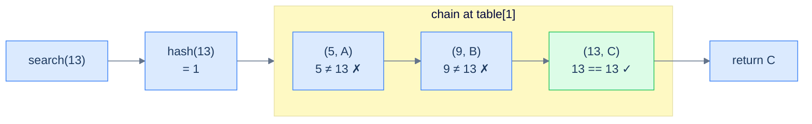
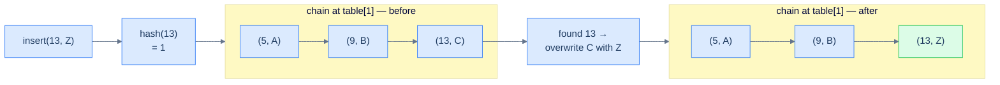
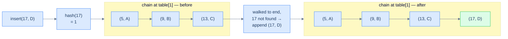
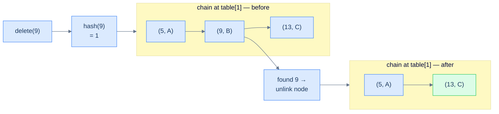
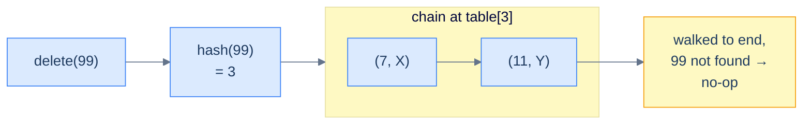

# 2. Separate Chaining

## The Hook

Two of your friends — Hari and Riya — book the *same hotel room* on the same date by accident. The hotel has only one room with that number. What do you do? You don't tear up one of the bookings; you don't pretend the second person doesn't exist. You **add another bed** to the room and let them share it. The room number stays the same; the *capacity* grows on demand.

That, in one sentence, is the soul of **separate chaining**: when two keys collide on the same array slot, don't fight over the slot — extend it. Each "slot" stops being a single seat and becomes a **chain** that can grow as long as it needs to. The hash function still routes you to the right slot in O(1); a tiny linked list inside the slot then mops up whatever fraction of the collision storm landed there.

This is the *most intuitive* way to resolve collisions, the one used inside Java's `HashMap`, Python's `dict` (until very recently — modern CPython uses open addressing, but the conceptual model is still chain-style for teaching), and most language standard libraries. Master it well and you'll have a tool that works under almost any load and never *runs out of slots* — but with a few sharp tradeoffs that we will surface, exploit, and stress-test before the lesson ends.

---

## Table of contents

1. [Understanding the problem](#understanding-the-problem)
2. [Introduction to separate chaining](#introduction-to-separate-chaining)
3. [Key components of separate chaining](#key-components-of-separate-chaining)
4. [Supported operations](#supported-operations)
5. [Internal mechanics](#internal-mechanics)
6. [Implementing the hash table class](#implementing-the-hash-table-class)
7. [Search operation in separate chaining](#search-operation-in-separate-chaining)
8. [Insert operation in separate chaining](#insert-operation-in-separate-chaining)
9. [Delete operation in separate chaining](#delete-operation-in-separate-chaining)
10. [Working example](#working-example)
11. [Design a hash table with separate chaining](#design-a-hash-table-with-separate-chaining)
12. [Edge cases and pitfalls](#edge-cases-and-pitfalls)
13. [Production reality](#production-reality)
14. [Quiz](#quiz)
15. [Practice ladder](#practice-ladder)
16. [Further reading](#further-reading)
17. [Cross-links](#cross-links)
18. [Final takeaway](#final-takeaway)

***

# Understanding the Problem

A hash function maps an unbounded universe of keys onto a finite array, so two different keys will eventually land on the same index — that clash is a **collision**, and every hash table must answer one question: when slot `i` is already taken, where does the new key go? A perfect hash function with no collisions is impossible in general, because there are more possible keys than slots. The table cannot avoid collisions; it can only decide how to *absorb* them.

Two families of answers exist, and they split on a single decision — does a colliding key stay at its hashed slot or move elsewhere?

- **Separate chaining** — the key stays at its slot, which is widened into a growable container holding every key that hashed there.
- **Open addressing** — the key moves to a different slot in the same array, found by a probe sequence (the next lesson's subject).

To make this concrete: insert keys `5`, `9`, and `13` into a table of capacity `4` with `hash(key) = key mod 4`. All three compute index `1`, so all three collide. Separate chaining stores all three at index `1` inside one chain; open addressing would scatter them to indices `1`, `2`, `3`. So the key idea is: a collision is unavoidable whenever keys outnumber slots, and separate chaining resolves it by letting the slot grow rather than relocating the key.

***

# Introduction to separate chaining

Now that we know what a hash table is and the operations it supports, we can dive deeper into how hash tables actually deal with collisions. **Separate chaining** is one of the two great families of collision resolution. The name says it all: when keys collide, we don't try to relocate them — we let them sit at the *same* slot, "separated" only by the order in which they were inserted, all chained together inside that slot.

Concretely: the internal array is no longer an array of `(key, value)` cells. It's an array of **chains** — small, growable containers that can hold many records at the same index. All keys whose hashes collide on index `i` get appended to the chain at `table[i]`. Looking up a key is now a two-stage process: hash to the index, then walk the chain at that index until you find the key (or run out of chain).

```d2
direction: right

tbl: Internal array — each slot is a chain {
  i0: "[0]"
  c00: "('Karan', 4)"
  i1: "[1]" {style.fill: "#fef9c3"; style.stroke: "#d97706"}
  c10: "('Hari', 7)" {style.fill: "#dbeafe"; style.stroke: "#3b82f6"}
  c11: "('Riya', 12)" {style.fill: "#dbeafe"; style.stroke: "#3b82f6"}
  c12: "('Anmol', 19)" {style.fill: "#dbeafe"; style.stroke: "#3b82f6"}
  i2: "[2]"
  e2: "(empty)"
  i3: "[3]"
  c30: "('Neha', 23)"
  c31: "('Karan', 4)"

  i0 -> c00
  i1 -> c10 -> c11 -> c12
  i2 -> e2
  i3 -> c30 -> c31
}
```

<p align="center"><strong>Logical view of separate chaining — every slot is a chain (a small linked list). Index 1 has absorbed three colliding keys; index 2 sits empty; index 3 holds two. The array length never changes, but each slot is free to grow.</strong></p>

The chain itself can be anything that supports "add" and "walk through": a **doubly linked list**, a **dynamic array**, or even a **self-balancing BST** for adversarial workloads (Java 8+ does this once a chain exceeds eight nodes). In this course we'll use a doubly linked list — it's the most pedagogically clean choice and connects directly to what you just learned in the doubly-linked-list section.

> **Aliases worth knowing:** Separate chaining is sometimes called **closed addressing** or **open hashing**. The terminology is unfortunate — the "closed" and "open" descriptors point in *opposite* directions across hashing literature. Just remember the structural property: **the address (slot) is closed (fixed by the hash); the bucket (chain at that address) is open (grows on demand).** The opposite scheme — open addressing — is what we'll meet in the next lesson.

## Advantages

The separate chaining implementation is the most intuitive collision resolution scheme, and it has three properties that make it the safe default:

> -   **Easy to implement:** The mental model is exactly "array of mini-lists." Insertion, deletion, and search are direct adaptations of linked-list operations you already know.
> -   **No size ceiling:** The array's *length* is fixed, but the chains inside the slots can grow without bound. The hash table never runs out of room as long as memory holds.
> -   **Localised collisions:** A pile-up at slot `i` does not affect slots `j` or `k`. Pathological keys all colliding into one bucket leave the rest of the table fast and unaffected.

## Limitations

Three properties cut the other way:

> -   **Unbounded growth = OOM risk:** The same flexibility that lets the table absorb infinite collisions also lets a runaway insert loop balloon memory until the process dies.
> -   **Memory overhead per node:** Every chain entry is a linked-list node, so each record carries the cost of `prev` and `next` pointers (16 extra bytes per node on 64-bit systems) on top of the actual `(key, value)` payload.
> -   **Cache misses everywhere:** Linked-list nodes live at unrelated memory addresses. Walking a chain bounces all over RAM, so the CPU's locality-of-reference advantage — the trick that makes arrays brutally fast in practice — is lost. Open addressing will exploit exactly this gap.

> *Predict before reading on — if I told you the average chain length in a well-tuned hash table is roughly **1.0** (one record per chain), what does that imply about insert and search time complexity? And what happens if I stuff 1,000 keys into a table of size 4?*

***

# Key components of separate chaining

The separate-chaining hash table has three components welded together: a record type for the payload, an internal array of chains, and a hash function that routes keys to chain indices. Let's build each piece in isolation before assembling the full class.

<details>
<summary><h2>Record</h2></summary>


A **record** is the unit stored inside a chain — the actual `(key, value)` pair the user cares about. Wrapping it in its own type keeps the chain code clean (the chain stores `Record` objects rather than juggling parallel arrays) and lets us extend the record later (e.g. add timestamps, hit counters) without touching the rest of the table.

```d2
direction: right

rec: Record {
  k: |md
    key

    (int)
  |
  v: |md
    value

    (int)
  |
}

node: Doubly-linked-list node holding a record {
  p: prev
  val: "val: Record"
  n: next
}

rec -> node.val: stored inside
```

<p align="center"><strong>The record is the payload, the chain node is the container — every node in the chain holds one record alongside its <code>prev</code> and <code>next</code> pointers.</strong></p>


```python run
# Represents an entry in the hash table
class Record:
    def __init__(self, key: int, value: int):
        self.key = key
        self.value = value

# Definition for doubly-linked list.
class ListNode:
    def __init__(self, val):
        self.val = val
        self.prev = None
        self.next = None
```

```java run
// Represents an entry in the hash table
class Record {
    int key;
    int value;

    Record(int key, int value) {
        this.key = key;
        this.value = value;
    }
}

// Definition for doubly-linked list.
class ListNode {
    Record val;
    ListNode prev;
    ListNode next;
    ListNode() {}
    ListNode(Record val) { this.val = val; }
};
```

</details>
<details>
<summary><h2>Internal array</h2></summary>


The internal array of a separate-chaining hash table is **an array of chains**. Each cell of the array holds an entire (initially empty) chain. The hash value of a key picks a cell; the chain at that cell stores all records whose keys hash to it.

```d2
direction: right

empty: Empty hash table — capacity 4 {
  e0: "[0]"
  h0: "(empty chain)"
  e1: "[1]"
  h1: "(empty chain)"
  e2: "[2]"
  h2: "(empty chain)"
  e3: "[3]"
  h3: "(empty chain)"

  e0 -> h0
  e1 -> h1
  e2 -> h2
  e3 -> h3
}
```

<p align="center"><strong>An empty separate-chaining hash table — every slot starts as an empty chain. The array's length never changes after construction.</strong></p>

When we insert into the table, the chain at the hashed index grows. The next diagram shows the same table after a series of inserts that produce two collisions (slot 1 collects three records, slot 3 collects two).

```d2
direction: right

populated: "After inserts — chains have grown at colliding slots" {
  e0: "[0]"
  h0: "(empty)"
  e1: "[1]"
  r1: "(5, A)" {style.fill: "#dbeafe"; style.stroke: "#3b82f6"}
  r2: "(9, B)" {style.fill: "#dbeafe"; style.stroke: "#3b82f6"}
  r3: "(13, C)" {style.fill: "#dbeafe"; style.stroke: "#3b82f6"}
  e2: "[2]"
  h2: "(empty)"
  e3: "[3]"
  r4: "(7, D)" {style.fill: "#dbeafe"; style.stroke: "#3b82f6"}
  r5: "(11, E)" {style.fill: "#dbeafe"; style.stroke: "#3b82f6"}

  e0 -> h0
  e1 -> r1 -> r2 -> r3
  e2 -> h2
  e3 -> r4 -> r5
}
```

<p align="center"><strong>The same table after five inserts (capacity = 4, hash = key mod 4) — keys 5, 9, 13 all hash to 1; keys 7, 11 both hash to 3. Notice that the array's length is unchanged; the table simply absorbs collisions by extending the affected chains.</strong></p>

In this course, the chain inside each slot is a **doubly linked list**. To keep the lessons focused on hashing rather than on re-implementing a linked list, we use the standard library's linked-list type wherever the language provides one. (You already built one in the previous section — feel free to swap in your own version once the table works.)

```python run viz=array viz-root=table
# Using lists as linked list in python
table: List[List[Record]] = [[] for _ in range(capacity)]
```

```java run viz=array viz-root=table
// Import the LinkedList class
import java.util.LinkedList;

// An array of linked list where the
// node stores data of type Record
List<LinkedList<Record>> table;

// Initialize the table with the given capacity
table = new ArrayList<>(capacity);
for (int i = 0; i < capacity; i++) {
    table.add(new LinkedList<>());
}
```

</details>
<details>
<summary><h2>Hash function</h2></summary>


The hash function maps a key to a valid array index. Throughout this section we'll use the simplest possible function — `key mod capacity` — so we can focus all our attention on collision *handling*. A real-world hash table would replace this with a stronger function (the principles of which we covered in [Lesson 1](01-introduction-to-hash-tables.md#examples-of-hash-functions)).

```d2
direction: right

k: "key = 13"
hf: "hash (key mod 4)" {shape: oval}
h: "index = 1"
slot: |md
  table[1] —

  chain to walk
|

k -> hf -> h -> slot
```

<p align="center"><strong>The hash function reduces a key to a valid array index in O(1). For <code>capacity = 4</code> and <code>key = 13</code>, <code>13 mod 4 = 1</code>, so the search continues inside the chain at slot 1.</strong></p>

We'll fold the hash function directly into the hash-table class as a private method, since no caller of the table needs to know how the function is computed.

```python run
# Implementation of a hash function for this hash table
def hash_function(self, key: int) -> int:
    return key % self.capacity
```

```java run
// Implementation of a hash function for this hash table
int hashFunction(int key) {
    return key % capacity;
}
```

</details>

***

# Supported Operations

Three operations make up the public interface, and the table exposes nothing else — no indexed access, no ordered iteration, no range query. A hash table is a *dictionary*: it maps keys to values and answers "what is stored under this key?" in near-constant time. Everything else would force a scan of the whole structure, defeating the point. The three operations divide into one read and two mutations:

| Operation | Average time | Worst time | Space | What it does |
|---|---|---|---|---|
| `search(key)` | `O(1)` | `O(N)` | `O(1)` | Hash to a chain, walk it, return the value or `-1` |
| `insert(key, value)` | `O(1)` | `O(N)` | `O(1)` | Hash to a chain, update if the key exists, else append |
| `remove(key)` | `O(1)` | `O(N)` | `O(1)` | Hash to a chain, unlink the matching node; no-op if absent |

The `O(N)` worst case is shared by all three because each one walks a single chain, and that chain can hold every key in the table when the hash function collapses every key onto one slot. The `O(1)` average holds when the hash function spreads keys evenly, keeping the average chain length near `1`. To make this concrete: insert `1000` keys into a capacity-`1000` table with a good hash, and each chain holds roughly one record, so a search touches one node. So the core insight is: every operation is "hash to a chain, then walk it," which is why all three share the same complexity envelope and why chain length — not table size — decides their real cost.

***

# Internal Mechanics

The table is an array of chains, and the hash function is the only thing that decides which chain a key belongs to — once you know the chain, every operation is a linked-list walk. The internal array has a fixed length, set at construction and never changed; what grows is the chain *inside* a slot. This separation is the whole mechanism: the hash function does `O(1)` index arithmetic, and the chain does the collision bookkeeping. The two pieces work in sequence on every call:

- **Stage 1 — hash** maps the key to an index with `key mod capacity`, a single arithmetic operation that is always `O(1)`.
- **Stage 2 — walk** scans the chain at that index, comparing each stored key to the target until it matches or the chain ends.

The chain's length is governed by the **load factor** — the ratio of stored records to array slots, written `α = N / capacity`. With a good hash function, the average chain length equals `α`, so search and insert cost `O(1 + α)` time. Keep `α` near `1` and operations are effectively constant; let `α` climb to `100` and every chain holds about a hundred nodes, so every operation walks a hundred steps. To make this concrete: a capacity-`4` table holding `400` keys has `α = 100`, and a "constant-time" lookup now costs `100` comparisons. So the core insight is: the hash routes in `O(1)` and the chain walk costs `O(α)`, so a separate-chaining table stays fast exactly as long as its load factor stays small — which is why production tables resize to keep `α` bounded.

***

# Implementing the hash table class

Now we wrap everything — the record type, the array of chains, the hash function, and the public operations — into a single class. Encapsulation is what turns a pile of components into something a caller can use without thinking.

```d2
cls: MyHashTable class {
  priv: private (hidden internals) {
    cap: "capacity: int"
    tbl: "table: array of chains"
    hf: "hashFunction(key)"
  }
  pub: public (callable interface) {
    s: "search(key) -> value"
    i: "insert(key, value)"
    r: "remove(key)"
  }
  pub -> priv {style.stroke-dash: 3}
}
```

<p align="center"><strong>The hash-table class — public methods (the only things callers see) sit on top of the private internals (capacity, the array of chains, and the hash function). Encapsulation lets the implementation change later without breaking callers.</strong></p>

<details>
<summary><h2>Implementation</h2></summary>


Below is how a caller uses the class — instantiate `MyHashTable` with a capacity, then call the three operations (`search`, `insert`, `remove`). The constructor wires up an empty array of chains; we'll build out each operation over the next three sections.


```python run
# Instantiate a hash table object from the MyHashTable class
table = MyHashTable(4)

table.insert(1, 1234)

table.insert(2, 4567)

table.search(2)

table.insert(4, 8910)

table.remove(1)
```

```java run
// Instantiate a hash table object from the MyHashTable class
MyHashTable table = new MyHashTable(4);

table.insert(1, 1234);

table.insert(2, 4567);

table.search(2);

table.insert(4, 8910);

table.remove(1);
```

</details>
<details>
<summary><h2>Using the hash table class</h2></summary>


Once the class is defined, callers don't see records, chains, or hash functions. They see three methods: `insert`, `search`, `remove`. The internals can change tomorrow — different chain type, different hash function, different growth policy — and no caller code needs to be touched. This is the discipline that separates a one-off script from a reusable data structure.

```d2
direction: right

user: caller code

api: MyHashTable public API {
  i: insert
  s: search
  r: remove
}

internals: |md
  private internals:

  hash function +

  array of chains
|

user -> api.i: "insert(1, 100)"
user -> api.s: "search(1)"
user -> api.r: "remove(1)"
api -> internals: delegates to {style.stroke-dash: 3}
```

<p align="center"><strong>Encapsulation in action — the caller talks to the public API; the API talks to the private internals. The wall between them is what lets the implementation evolve independently.</strong></p>

With the skeleton in place, we'll now fill in the three operations one at a time — search first (because it's the simplest), then insert (which builds on search), then delete (which builds on both).

</details>

***

# Search operation in separate chaining

The search operation is the heartbeat of a hash table. Every other operation either *is* a search (lookup) or *contains* a search (insert and delete both walk the chain to find the key first). Get search right, and the rest falls into place.

<details>
<summary><h2>Algorithm</h2></summary>


The recipe is two clean steps, plus a careful walk:

1. **Hash the key** to compute its chain's index in the internal array.
2. **Walk the chain** at that index. Compare each record's key to the search key.
3. **Return the value** if a match is found, or a sentinel (`-1`) if the chain is exhausted without a match.



<p align="center"><strong>Search flow — the hash function picks the chain, then the walk inside the chain finds the matching record. If the chain runs out before a match, the operation returns the "not found" sentinel.</strong></p>

> **Algorithm**
>
> -   **Step 1:** Calculate the index (hash code) for the given key.
> -   **Step 2:** Search for the key by walking the chain at the calculated index.
> -   **Step 3:** If the key is found, return its value. Otherwise, return `-1`.

</details>
<details>
<summary><h2>Solution &amp; Analysis</h2></summary>

### Implementation

```python run
from typing import List
from llist import dllist

# Represents an entry in the hash table
class Record:
    def __init__(self, key: int, value: int):
        self.key = key
        self.value = value

class MyHashTable:
    def __init__(self, capacity: int):
        self.capacity = capacity

        # Initialize the table with the given capacity
        self.table = [dllist() for _ in range(capacity)]

    def hash_function(self, key: int) -> int:
        return key % self.capacity

    def search(self, key: int) -> int:

        # Get the bucket index
        index = self.hash_function(key)

        # Search for the key in the bucket
        head = self.table[index].first
        while head:
            if head.value.key == key:

                # Return the value if key is found
                return head.value.value
            head = head.next

        # Return -1 if the key is not found
        return -1
```

```java run
import java.util.*;

// Represents an entry in the hash table
class Record {
    int key;
    int value;

    Record(int key, int value) {
        this.key = key;
        this.value = value;
    }
}

class MyHashTable {

    // The hashtable
    private List<LinkedList<Record>> table;
    private int capacity;

    public MyHashTable(int capacity) {
        this.capacity = capacity;

        // Initialize the table with the given capacity
        table = new ArrayList<>(capacity);
        for (int i = 0; i < capacity; i++) {
            table.add(new LinkedList<>());
        }
    }

    private int hashFunction(int key) {
        return key % capacity;
    }

    public int search(int key) {

        // Get the bucket index
        int index = hashFunction(key);

        // Search for the key in the bucket
        for (Record entry : table.get(index)) {
            if (entry.key == key) {

                // Return the value if key is found
                return entry.value;
            }
        }

        // Return -1 if the key is not found
        return -1;
    }
}
```

### Complexity analysis

The hash function is O(1). The total cost of search is therefore the cost of the chain walk at the resulting index. That walk is what determines best, average, and worst case.

```d2
direction: right

best: Best case — chain length 1 {
  direction: right
  b0: "[0]"
  b1: "(k, v)"
  b0 -> b1
}

avg: Average case — well-distributed, chain length ~ 1 {
  direction: right
  a0: "[0]"
  a1: "(k, v)"
  a2: "[1]"
  a3: "(k, v)"
  a4: "[2]"
  a5: "(k, v)"
  a0 -> a1
  a2 -> a3
  a4 -> a5
}

worst: Worst case — every key collides into one chain {
  direction: right
  w0: "[0]"
  w1: "(k1)"
  w2: "(k2)"
  w3: "(k3)"
  w4: "...kN"
  w5: "[1]"
  we1: "(empty)"
  w6: "[2]"
  we2: "(empty)"
  w0 -> w1 -> w2 -> w3 -> w4
  w5 -> we1
  w6 -> we2
}
```

<p align="center"><strong>Search performance is governed by chain length — O(1) when chains are short, O(N) when every key collides into one chain. A good hash function keeps the average chain length close to 1.</strong></p>

The space cost is constant — a few local variables, no new data structures.

> **Best case** — no collision, chain has 0 or 1 nodes
>
> -   Time: **O(1)**
> -   Space: **O(1)**
>
> **Average case** — well-distributed hash values
>
> -   Time: **O(1)**
> -   Space: **O(1)**
>
> **Worst case** — every key collides at the same index
>
> -   Time: **O(N)**
> -   Space: **O(1)**

> *Predict before reading on — when we move to insert, we'll need to detect "key already exists" before adding a new record. Which existing operation does that detection look exactly like? (Yes, search. Insert is going to be search-with-an-extra-step.)*

</details>

***

# Insert operation in separate chaining

Insert stores a new `(key, value)` mapping. There's a subtle but important rule baked into the operation: if the key is *already* in the table, insert doesn't add a duplicate — it **updates** the existing value. This makes the hash table behave like a true dictionary, not a multiset.

<details>
<summary><h2>Algorithm</h2></summary>


Insert is search with a twist: walk the chain looking for the key, then *act* depending on whether the search hit or missed.

### Case 1 — Key is present

If we find a record with the matching key, we don't add a new one — we just overwrite the existing record's `value` with the new value and return.



<p align="center"><strong>Insert when the key already exists — the chain length does not change; only the matching record's <code>value</code> is updated. This guarantees the table never holds two records with the same key.</strong></p>

> **Algorithm — case 1**
>
> -   **Step 1:** Calculate the index for the given key.
> -   **Step 2:** Walk the chain at the calculated index searching for the key.
> -   **Step 3:** If the key is found, update the value of the stored record.

### Case 2 — Key is not present

If we walk the entire chain without finding the key, we know definitively that this is a new mapping. Append a new record to the **end** of the chain.

**Why insert at the end and not the head?**

Two reasons. First, the search loop has already walked the chain to its end, so the tail pointer is essentially "in our hand" — appending is O(1) given a doubly linked list with a tail reference (or the implicit end of an array-backed bucket). Second, appending preserves insertion order, which is occasionally useful for debugging and for data structures that piggyback on the table (LRU caches, ordered dicts, etc.). Some implementations *do* prepend at the head, which is also O(1) — both are correct; the trade-off is between insertion order and the head-update cost.



<p align="center"><strong>Insert when the key is new — the search exhausted the chain, so a fresh record is appended to the tail. The chain grows by one node; the array length is unchanged.</strong></p>

> **Algorithm — case 2**
>
> -   **Step 1:** Calculate the index for the given key.
> -   **Step 2:** Walk the chain at the calculated index searching for the key.
> -   **Step 3:** If the key is not found, append a new record at the end of the chain.

</details>
<details>
<summary><h2>Solution &amp; Analysis</h2></summary>

### Implementation

```python run
from typing import List
from llist import dllist

# Represents an entry in the hash table
class Record:
    def __init__(self, key: int, value: int):
        self.key = key
        self.value = value

class MyHashTable:
    def __init__(self, capacity: int):
        self.capacity = capacity

        # Initialize the table with the given capacity
        self.table = [dllist() for _ in range(capacity)]

    def hash_function(self, key: int) -> int:
        return key % self.capacity

    def search(self, key: int) -> int:

        # Get the bucket index
        index = self.hash_function(key)

        # Search for the key in the bucket
        head = self.table[index].first
        while head:
            if head.value.key == key:

                # Return the value if key is found
                return head.value.value
            head = head.next

        # Return -1 if the key is not found
        return -1

    def insert(self, key: int, value: int) -> None:

        # Get the bucket index
        index = self.hash_function(key)

        # Check if the key already exists and update its value
        head = self.table[index].first
        while head:
            if head.value.key == key:

                # Update value if key exists
                head.value.value = value
                return
            head = head.next

        # Add a new record if the key does not exist
        self.table[index].append(Record(key, value))
```

```java run
import java.util.*;

// Represents an entry in the hash table
class Record {
    int key;
    int value;

    Record(int key, int value) {
        this.key = key;
        this.value = value;
    }
}

class MyHashTable {

    // The hashtable
    private List<LinkedList<Record>> table;
    private int capacity;

    public MyHashTable(int capacity) {
        this.capacity = capacity;

        // Initialize the table with the given capacity
        table = new ArrayList<>(capacity);
        for (int i = 0; i < capacity; i++) {
            table.add(new LinkedList<>());
        }
    }

    private int hashFunction(int key) {
        return key % capacity;
    }

    public int search(int key) {

        // Get the bucket index
        int index = hashFunction(key);

        // Search for the key in the bucket
        for (Record entry : table.get(index)) {
            if (entry.key == key) {

                // Return the value if key is found
                return entry.value;
            }
        }

        // Return -1 if the key is not found
        return -1;
    }

    public void insert(int key, int value) {

        // Get the bucket index
        int index = hashFunction(key);

        // Check if the key already exists and update its value
        for (Record entry : table.get(index)) {
            if (entry.key == key) {

                // Update value if key exists
                entry.value = value;
                return;
            }
        }

        // Add a new record if the key does not exist
        table.get(index).add(new Record(key, value));
    }
}
```

### Complexity analysis

Insert pays the same chain-walk cost as search (we have to confirm whether the key is already present), plus an O(1) update or append. The complexity envelope is therefore the same as search.

```d2
direction: right

best: "Best — chain empty, append immediately" {
  direction: right
  b0: "[0]"
  b1: "+ (k, v)"
  b0 -> b1
}

worst: "Worst — chain has all N keys, scan to end, then append" {
  direction: right
  w0: "[0]"
  w1: "k1"
  w2: "k2"
  w3: "..."
  w4: "kN"
  w5: "+ (k, v)"
  w0 -> w1 -> w2 -> w3 -> w4 -> w5
}
```

<p align="center"><strong>Insert performance — best case is appending to an empty chain (O(1)); worst case is scanning a chain holding every key in the table (O(N)) before appending.</strong></p>

> **Best case** — chain at the index is empty
>
> -   Time: **O(1)**
> -   Space: **O(1)**
>
> **Average case** — well-distributed hash values
>
> -   Time: **O(1)**
> -   Space: **O(1)**
>
> **Worst case** — every key collides at one index
>
> -   Time: **O(N)**
> -   Space: **O(1)**

</details>

***

# Delete operation in separate chaining

Delete is the cleanest of the three operations. It's just search-then-remove: find the record, unlink it from the chain, and you're done.

<details>
<summary><h2>Algorithm</h2></summary>


### Case 1 — Key is present

Walk the chain. When you find the record with the matching key, unlink it from the chain (the standard linked-list deletion: rewire the predecessor's `next` and the successor's `prev`).



<p align="center"><strong>Delete when the key exists — the matching node is unlinked from the chain. The array length stays the same; the chain shrinks by one.</strong></p>

> **Algorithm — case 1**
>
> -   **Step 1:** Calculate the index for the given key.
> -   **Step 2:** Walk the chain at the calculated index, searching for the key.
> -   **Step 3:** If found, unlink the node from the chain.

### Case 2 — Key is not present

If the chain is exhausted without a match, the operation is a **no-op** — nothing happens, no error, no exception. The mapping wasn't there; the table is unchanged.



<p align="center"><strong>Delete when the key is absent — the operation completes silently with no change. Most public APIs treat this as success rather than an error.</strong></p>

</details>
<details>
<summary><h2>Solution &amp; Analysis</h2></summary>

### Implementation

```python run
from typing import List
from llist import dllist

# Represents an entry in the hash table
class Record:
    def __init__(self, key: int, value: int):
        self.key = key
        self.value = value

class MyHashTable:
    def __init__(self, capacity: int):
        self.capacity = capacity

        # Initialize the table with the given capacity
        self.table = [dllist() for _ in range(capacity)]

    def hash_function(self, key: int) -> int:
        return key % self.capacity

    def search(self, key: int) -> int:

        # Get the bucket index
        index = self.hash_function(key)

        # Search for the key in the bucket
        head = self.table[index].first
        while head:
            if head.value.key == key:

                # Return the value if key is found
                return head.value.value
            head = head.next

        # Return -1 if the key is not found
        return -1

    def insert(self, key: int, value: int) -> None:

        # Get the bucket index
        index = self.hash_function(key)

        # Check if the key already exists and update its value
        head = self.table[index].first
        while head:
            if head.value.key == key:

                # Update value if key exists
                head.value.value = value
                return
            head = head.next

        # Add a new record if the key does not exist
        self.table[index].append(Record(key, value))

    def remove(self, key: int) -> None:

        # Get the bucket index
        index = self.hash_function(key)

        # Remove the record with the matching key
        head = self.table[index].first
        while head:
            if head.value.key == key:

                # Remove the record
                self.table[index].remove(head)
                return
            head = head.next
```

```java run
import java.util.*;

// Represents an entry in the hash table
class Record {
    int key;
    int value;

    Record(int key, int value) {
        this.key = key;
        this.value = value;
    }
}

class MyHashTable {

    // The hashtable
    private List<LinkedList<Record>> table;
    private int capacity;

    public MyHashTable(int capacity) {
        this.capacity = capacity;

        // Initialize the table with the given capacity
        table = new ArrayList<>(capacity);
        for (int i = 0; i < capacity; i++) {
            table.add(new LinkedList<>());
        }
    }

    private int hashFunction(int key) {
        return key % capacity;
    }

    public int search(int key) {

        // Get the bucket index
        int index = hashFunction(key);

        // Search for the key in the bucket
        for (Record entry : table.get(index)) {
            if (entry.key == key) {

                // Return the value if key is found
                return entry.value;
            }
        }

        // Return -1 if the key is not found
        return -1;
    }

    public void insert(int key, int value) {

        // Get the bucket index
        int index = hashFunction(key);

        // Check if the key already exists and update its value
        for (Record entry : table.get(index)) {
            if (entry.key == key) {

                // Update value if key exists
                entry.value = value;
                return;
            }
        }

        // Add a new record if the key does not exist
        table.get(index).add(new Record(key, value));
    }

    public void remove(int key) {

        // Get the bucket index
        int index = hashFunction(key);

        // Remove the record with the matching key
        table.get(index).removeIf(entry -> entry.key == key);
    }
}
```

### Complexity analysis

Like search and insert, delete walks a single chain. The only extra work — unlinking a node from a doubly linked list, or splicing it out of an array bucket — is O(1) once the node is found.

```d2
direction: right

best: "Best — chain empty or first node matches" {
  direction: right
  b0: "[0]"
  b1: "(k, v) X"
  b0 -> b1
}

worst: "Worst — every key in one chain, target at the very end (or absent)" {
  direction: right
  w0: "[0]"
  w1: "k1"
  w2: "..."
  w3: "target X"
  w0 -> w1 -> w2 -> w3
}
```

<p align="center"><strong>Delete performance — same envelope as search and insert. The cost is the chain walk; the unlink itself is O(1).</strong></p>

> **Best case** — chain empty or first node matches
>
> -   Time: **O(1)**
> -   Space: **O(1)**
>
> **Average case** — well-distributed hash values
>
> -   Time: **O(1)**
> -   Space: **O(1)**
>
> **Worst case** — every key collides at one index
>
> -   Time: **O(N)**
> -   Space: **O(1)**

</details>

***

# Working Example

Watching one chain grow, mutate, and shrink is the fastest way to make the three operations click. Start with `MyHashTable(4)` — an empty array of four chains, hash function `key mod 4`. This run inserts a collision storm into slot `1`, updates a key in place, searches a hit and a miss, then deletes from the middle of the chain. Each step touches exactly one chain:

```text
Start:  capacity = 4, hash(key) = key mod 4
        table = [ [], [], [], [] ]

1. insert(5, A)   hash(5) = 1   slot 1 empty, append      table[1] = [(5,A)]
2. insert(9, B)   hash(9) = 1   collision, 9 absent, append  table[1] = [(5,A), (9,B)]
3. insert(13, C)  hash(13) = 1  collision, 13 absent, append table[1] = [(5,A), (9,B), (13,C)]
4. insert(9, Z)   hash(9) = 1   walk chain, 9 FOUND, update  table[1] = [(5,A), (9,Z), (13,C)]
5. search(13)     hash(13) = 1  walk past (5,A),(9,Z), match → return C
6. search(7)      hash(7) = 3   slot 3 empty, chain ends   → return -1
7. remove(9)      hash(9) = 1   walk to (9,Z), unlink node   table[1] = [(5,A), (13,C)]
8. search(9)      hash(9) = 1   walk (5,A),(13,C), no match → return -1
```

Three facts fall out of the trace. Step 3 shows three keys living at one index with the array length still `4` — the collision storm widened slot `1` instead of spilling into slots `2` or `3`. Step 4 proves insert is search-with-a-twist: it found `9` already present and overwrote `B` with `Z` rather than appending a duplicate, so the chain length did not change. Step 7 shrinks the chain by unlinking the middle node, and step 8 confirms the key is gone. So the core insight is: every operation hashes to one chain and then reads, rewrites, or unlinks a node inside it — the array length never moves, only the chain at the touched slot does.

***

# Design a hash table with separate chaining

Time for the boss fight. You'll now implement a complete hash table with separate chaining from scratch — every operation we've built, plus one new one to flex your understanding.

## Problem Statement

Given the skeleton of a `MyHashTable` class, complete this class by implementing all of the following operations:

> -   **MyHashTable(int capacity)** — Initialises the hash table with the given internal-array capacity.
> -   **search(int key)** — Returns the value mapped to the given key, or `-1` if the key is absent.
> -   **insert(int key, int value)** — Inserts a `(key, value)` pair. If the key already exists, updates its value. Returns `true` on success.
> -   **remove(int key)** — Removes the mapping for the given key; no-op if absent.
> -   **getKeysAtIndex(int index)** — Returns the list of keys currently mapped to the given internal-array index. Useful for testing the chain layout directly.

```d2
cons: Constraints {
  c1: No built-in hash table libraries
  c2: Use separate chaining for collisions
  c3: "Hash function: index = key % capacity"
}
```

<p align="center"><strong>Constraints — implement everything from scratch with separate chaining and the simple division-method hash. The point is to internalise the mechanics, not to use a library.</strong></p>

> The input should adhere to the following rules:
>
> 1.  The input should contain two arrays of the same size.
> 2.  The first array should contain the list of operations, while the second should contain the corresponding operands for those operations.
> 3.  The first index in the first array should contain `MyHashTable`, and the first index in the second array should contain a single positive integer representing the capacity of the hash table. This value is used to initialise the hash table.
> 4.  For each index in the first array that contains the `insert` operation, the corresponding index in the second array should contain a `(key, value)` pair to be inserted.
> 5.  For each index in the first array that contains `search` or `remove` operations, the corresponding index in the second array should contain the key for which that operation will be performed.
> 6.  For each index in the first array that contains the `getKeysAtIndex` operation, the corresponding index in the second array should contain the index for which the operation will be performed.
>
> **Example:**
>
> -   **Input:** `[MyHashTable, insert, insert, search, insert, search, insert, search, search, getKeysAtIndex]`, `[[1], [1, 2], [2, 4], [1], [1, 3], [1], [2, 5], [2], [3], [0]]`
>
> -   **Output:** `[null, true, true, 2, true, 3, true, 5, -1, [1, 2]]`
>
> **Explanation:**
>
> | Operation | Effect | Result |
> |---|---|---|
> | `MyHashTable(1)` | empty table, capacity 1 | `null` |
> | `insert(1, 2)` | `table = [[(1, 2)]]` | `true` |
> | `insert(2, 4)` | `table = [[(1, 2), (2, 4)]]` (collision — both at index 0) | `true` |
> | `search(1)` | found in chain | `2` |
> | `insert(1, 3)` | key exists → update value | `true` |
> | `search(1)` | updated value returned | `3` |
> | `insert(2, 5)` | key exists → update value | `true` |
> | `search(2)` | | `5` |
> | `search(3)` | not in chain | `-1` |
> | `getKeysAtIndex(0)` | inspect chain at index 0 | `[1, 2]` |

<details>
<summary><h2>Solution</h2></summary>


The full implementation in Python and Java. Notice how `getKeysAtIndex` is just a shallow walk of the chain at the requested index — useful for testing and for any feature that needs to introspect the table's layout (e.g. iteration, cache eviction policies).


```python run
from typing import List

# Represents an entry in the hash table
class Record:
    def __init__(self, key: int, value: int):
        self.key = key
        self.value = value

class MyHashTable:
    def __init__(self, capacity: int):
        self.capacity = capacity

        # Initialize the table with the given capacity
        self.table: List[List[Record]] = [[] for _ in range(capacity)]

    def hash_function(self, key: int) -> int:
        return key % self.capacity

    def search(self, key: int) -> int:

        # Get the bucket index
        index = self.hash_function(key)

        # Search for the key in the bucket
        for record in self.table[index]:
            if record.key == key:

                # Return the value if key is found
                return record.value

        # Return -1 if the key is not found
        return -1

    def insert(self, key: int, value: int) -> bool:

        # Get the bucket index
        index = self.hash_function(key)

        # Check if the key already exists and update its value
        for record in self.table[index]:
            if record.key == key:

                # Update value if key exists
                record.value = value
                return True

        # Add a new record if the key does not exist
        self.table[index].append(Record(key, value))
        return True

    def remove(self, key: int) -> None:

        # Get the bucket index
        index = self.hash_function(key)

        # Remove the record with the matching key
        self.table[index] = [r for r in self.table[index] if r.key != key]

    def get_keys_at_index(self, index: int) -> List[int]:

        # Return an empty list if the index is invalid
        if index < 0 or index >= self.capacity:
            return []

        # Collect all keys in the bucket
        return [r.key for r in self.table[index]]


# Example from the problem statement — capacity 1 (all keys collide at index 0)
t1 = MyHashTable(1)
print(t1.insert(1, 2))              # True
print(t1.insert(2, 4))              # True
print(t1.search(1))                 # 2
print(t1.insert(1, 3))              # True
print(t1.search(1))                 # 3
print(t1.insert(2, 5))              # True
print(t1.search(2))                 # 5
print(t1.search(3))                 # -1
print(t1.get_keys_at_index(0))      # [1, 2]

# Edge cases
t2 = MyHashTable(3)
print(t2.search(99))                # -1 — search on empty table
print(t2.insert(0, 10))             # True — key 0 maps to index 0
print(t2.search(0))                 # 10
t2.remove(0)
print(t2.search(0))                 # -1 — removed
print(t2.get_keys_at_index(5))      # [] — invalid index
```

```java run
import java.util.*;

public class Main {

    // Represents an entry in the hash table
    static class Record {

        int key;
        int value;

        Record(int key, int value) {
            this.key = key;
            this.value = value;
        }
    }

    static class MyHashTable {

        // The hashtable
        private List<LinkedList<Record>> table;
        private int capacity;

        public MyHashTable(int capacity) {
            this.capacity = capacity;

            // Initialize the table with the given capacity
            table = new ArrayList<>(capacity);
            for (int i = 0; i < capacity; i++) {
                table.add(new LinkedList<>());
            }
        }

        private int hashFunction(int key) {
            return key % capacity;
        }

        public int search(int key) {

            // Get the bucket index
            int index = hashFunction(key);

            // Search for the key in the bucket
            for (Record entry : table.get(index)) {
                if (entry.key == key) {

                    // Return the value if key is found
                    return entry.value;
                }
            }

            // Return -1 if the key is not found
            return -1;
        }

        public boolean insert(int key, int value) {

            // Get the bucket index
            int index = hashFunction(key);

            // Check if the key already exists and update its value
            for (Record entry : table.get(index)) {
                if (entry.key == key) {

                    // Update value if key exists
                    entry.value = value;
                    return true;
                }
            }

            // Add a new record if the key does not exist
            table.get(index).add(new Record(key, value));
            return true;
        }

        public void remove(int key) {

            // Get the bucket index
            int index = hashFunction(key);

            // Remove the record with the matching key
            table.get(index).removeIf(entry -> entry.key == key);
        }

        public List<Integer> getKeysAtIndex(int index) {

            // Return an empty list if the index is invalid
            if (index < 0 || index >= capacity) {
                return new ArrayList<>();
            }

            // Collect all keys in the bucket
            List<Integer> keys = new ArrayList<>();
            for (Record entry : table.get(index)) {
                keys.add(entry.key);
            }

            return keys;
        }
    }

    public static void main(String[] args) {
        // Example from the problem statement — capacity 1 (all keys collide at index 0)
        MyHashTable t1 = new MyHashTable(1);
        System.out.println(t1.insert(1, 2));             // true
        System.out.println(t1.insert(2, 4));             // true
        System.out.println(t1.search(1));                // 2
        System.out.println(t1.insert(1, 3));             // true
        System.out.println(t1.search(1));                // 3
        System.out.println(t1.insert(2, 5));             // true
        System.out.println(t1.search(2));                // 5
        System.out.println(t1.search(3));                // -1
        System.out.println(t1.getKeysAtIndex(0));        // [1, 2]

        // Edge cases
        MyHashTable t2 = new MyHashTable(3);
        System.out.println(t2.search(99));               // -1 — search on empty table
        System.out.println(t2.insert(0, 10));            // true — key 0 maps to index 0
        System.out.println(t2.search(0));                // 10
        t2.remove(0);
        System.out.println(t2.search(0));                // -1 — removed
        System.out.println(t2.getKeysAtIndex(5));        // [] — invalid index
    }
}
```

</details>
<details>
<summary><h2>Final Takeaway</h2></summary>


You just built a complete, working hash table. The whole structure is **a hash function pointing into an array of chains**, and three operations that all do the same thing — hash to a chain, walk that chain, then either read, write, or remove. Once you see that pattern, every separate-chaining hash table looks the same on the inside.

The two big lessons to carry forward:

1. **Collisions don't have to be a war.** Separate chaining absorbs them by *expanding the slot*, not by *moving the key elsewhere*. Memory grows; behaviour stays predictable; load factor can exceed 1 with no special handling. That's the great strength.
2. **Cache misses are the price of pointer chasing.** Each chain node is a separate heap allocation, scattered across RAM. Walking a long chain is slow not because of `O(N)` operations but because each step is a *cache miss*. If your data is small and your chains are long, a contiguous-memory alternative will outperform separate chaining even at the same complexity class.

> *Coming up — open addressing solves the cache problem by giving up the chain entirely and resolving collisions <strong>inside the same array</strong>. The next three lessons (linear probing, quadratic probing, double hashing) are three different ways of asking the same question: "if my slot is taken, where do I go next?" The first one — linear probing — is the simplest, and also the one with the most surprising failure mode. We'll see why.*

</details>

<!-- ============================================== -->

# Edge Cases and Pitfalls

The structure fits in a screenful, yet most of its bugs cluster around the chain walk and the load factor that decides how long that walk runs. This list is lesson-level — distinct from the boss-fight's per-input edge cases above — and worth keeping open the next time a chaining table misbehaves:

- **Treating insert as a blind append.** Appending without first walking the chain lets two records with the same key coexist, so a later `search` returns whichever copy it hits first. The fix is the rule baked into the operation: walk the chain, update in place if the key is found, and append only after confirming the key is absent.
- **Letting the load factor climb unchecked.** Average operation cost is `O(1 + α)` where `α = N / capacity`, so a table that never resizes degrades to a linked-list scan as `N` grows. A capacity-`4` table holding `400` keys has `α = 100` and every "constant-time" lookup walks `100` nodes. Production tables resize and rehash to hold `α` near a small constant.
- **Assuming O(1) is guaranteed, not average.** The bounds are `O(1)` average and `O(N)` worst. An adversary who knows the hash function can craft keys that all collide into one chain, collapsing every operation to `O(N)` — the basis of algorithmic-complexity denial-of-service attacks. The fix is a randomised or cryptographic hash, not the toy `key mod capacity` used for teaching here.
- **Forgetting that a missing key is not an error.** `search` on an absent key returns the `-1` sentinel and `remove` on an absent key is a silent no-op. Code that expects an exception will mishandle both. When `-1` is a legal stored value, the sentinel is ambiguous — prefer an explicit "found" flag or an `Optional` return.
- **Ignoring per-node memory overhead.** Every chain node carries `prev` and `next` references on top of the `(key, value)` payload — about `16` extra bytes per node on a 64-bit system. A table of millions of tiny records spends a large fraction of its memory on pointers, which a contiguous open-addressing table avoids entirely.
- **Paying for cache misses on long chains.** Chain nodes are separate heap allocations scattered across RAM, so walking a long chain is slow not from the `O(N)` step count alone but because each hop is a cache miss. Short chains hide this; long chains expose it, and it is the gap open addressing was built to close.

***

# Production Reality

Separate chaining is the textbook default and the implementation behind several standard-library maps, chosen wherever predictable collision behaviour matters more than raw cache throughput. The systems below are worth knowing by name.

**[Java's `HashMap`]** — uses **separate chaining that upgrades a bucket from a linked list to a balanced tree once the bucket exceeds eight nodes** — because the tree caps a pathological bucket at `O(log N)` instead of `O(N)`, blunting hash-collision denial-of-service attacks while keeping short buckets cheap.

**[Java's `HashSet`]** — uses **a `HashMap` of element-to-sentinel under the hood, so set membership is separate-chaining lookup** — because reusing the map's chaining machinery gives `O(1)` average `contains` with no new collision logic to maintain.

**[The C++ `std::unordered_map`]** — uses **separate chaining, mandated by the standard's bucket interface** — because the spec exposes `bucket_count`, `bucket_size`, and local bucket iterators, which only a chained layout can implement, guaranteeing references to elements stay valid across rehashes.

**[A symbol table in a compiler or interpreter]** — uses **a chained hash table keyed by identifier name** — because scopes nest and shadow, and a chain per slot makes inserting and removing names as scopes open and close a localised `O(1)` operation.

**[Memcached's item hash table]** — uses **separate chaining over a bucket array that doubles and rehashes as the item count grows** — because a distributed cache must keep average chain length near one under churn, and chaining absorbs bursts of inserts without relocating existing items.

***

# Quiz

Test your grip before moving on. One answer per question; reveal only after you have committed to one.

**[Recall] Q: In separate chaining, what does each slot of the internal array hold?**
A chain — a growable container (a doubly linked list in this lesson) holding every record whose key hashes to that slot.

**[Recall] Q: What does `search` return when the key is not present, and what does `remove` do in the same case?**
`search` returns the `-1` sentinel, and `remove` is a silent no-op that leaves the table unchanged.

**[Reasoning] Q: Why do search, insert, and delete all share the same `O(1)` average and `O(N)` worst-case time?**
Each one hashes to a single chain in `O(1)` and then walks that chain, so its cost is the chain length — about `1` when the hash spreads keys evenly, but `N` when every key collides into one chain.

**[Reasoning] Q: Why must insert walk the chain before appending a new record?**
To enforce dictionary semantics — if the key already exists, insert overwrites its value in place rather than appending a duplicate, so the table never holds two records with the same key.

**[Tradeoff] Q: When would you reach for open addressing instead of separate chaining, and what do you give up?**
Choose open addressing when cache locality and low memory overhead dominate, since its records live contiguously with no per-node pointers; you give up the unbounded slot capacity and the simple deletion that chaining offers, because probing tables need tombstones and degrade sharply as the load factor approaches `1`.

***

# Practice Ladder

Five problems that exercise hashing as a counting and lookup tool, easiest first. Try each unaided; hit the hint after ten minutes; do not peek at solutions until you have written something runnable.

| # | Problem | Pattern | Difficulty | Hint |
|---|---------|---------|------------|------|
| 1 | [First Non-Repeating Character](/cortex/data-structures-and-algorithms/linear-structures-hash-table-pattern-counting-problems-first-non-repeating-character) | [Counting](/cortex/data-structures-and-algorithms/linear-structures-hash-table-pattern-counting-pattern) | Easy | Count every character with a hash map in one pass, then scan again for the first count equal to `1`. `O(n)` time, `O(k)` space in the alphabet size. |
| 2 | [Anagram Checker](/cortex/data-structures-and-algorithms/linear-structures-hash-table-pattern-counting-problems-anagram-checker) | [Counting](/cortex/data-structures-and-algorithms/linear-structures-hash-table-pattern-counting-pattern) | Easy | Two strings are anagrams when their character-frequency maps match; tally one string up and the other down, then check every count is zero. `O(n)` time. |
| 3 | [Duplicate Detection](/cortex/data-structures-and-algorithms/linear-structures-hash-table-pattern-fixed-sized-sliding-window-problems-duplicate-detection) | [Fixed-Sized Sliding Window](/cortex/data-structures-and-algorithms/linear-structures-hash-table-pattern-fixed-sized-sliding-window-pattern) | Medium | Slide a fixed window and keep a hash set of its members; a key already in the set is the duplicate within range. `O(n)` time, `O(k)` space in the window width. |
| 4 | [Subarray Sum Equals K](/cortex/data-structures-and-algorithms/linear-structures-hash-table-pattern-variable-sized-sliding-window-problems-subarray-sum-equals-k) | [Variable-Sized Sliding Window](/cortex/data-structures-and-algorithms/linear-structures-hash-table-pattern-variable-sized-sliding-window-pattern) | Medium | Store running prefix sums in a hash map; a subarray sums to `k` whenever `prefix - k` has been seen before. `O(n)` time, `O(n)` space. |
| 5 | [Zero Sum Subarrays](/cortex/data-structures-and-algorithms/linear-structures-hash-table-pattern-prefix-sum-problems-zero-sum-subarrays) | [Prefix Sum](/cortex/data-structures-and-algorithms/linear-structures-hash-table-pattern-prefix-sum-pattern) | Medium | A repeated prefix sum means the slice between the two occurrences sums to zero; count occurrences of each prefix sum in a hash map. `O(n)` time, `O(n)` space. |

Once these feel automatic, the hash map has stopped being a lookup table and become a counting-and-memo reflex — exactly what the counting, sliding-window, and prefix-sum patterns build on.

***

# Further Reading

Curated paths in, not a syllabus. Read in order of the annotation; come back for the rest when you need depth.

- **[CLRS — Chapter 11.2: Hash Tables (Collision resolution by chaining)](https://mitpress.mit.edu/9780262046305/introduction-to-algorithms/)**
  ★ Essential — the formal treatment of chaining, the load-factor analysis that proves `O(1 + α)` expected time, and the simple-uniform-hashing assumption the average case rests on.
- **[Java `HashMap` source](https://github.com/openjdk/jdk/blob/master/src/java.base/share/classes/java/util/HashMap.java)**
  ◆ Advanced — a production chaining table that treeifies a bucket past eight nodes; shows how the textbook structure is hardened against collision attacks and tuned for real workloads.
- **[CppReference — `std::unordered_map`](https://en.cppreference.com/w/cpp/container/unordered_map)**
  → Reference — the standard library's bucket interface (`bucket_count`, `load_factor`, `max_load_factor`, local iterators) that only a chained layout can satisfy; keep it for looking up the exact guarantees.

***

# Cross-Links

**Prerequisites**

- [Introduction To Hash Tables](/cortex/data-structures-and-algorithms/linear-structures-hash-table-introduction-to-hash-tables) — what a hash function is, the dictionary interface, and why collision resolution is a required component of every hash table.
- [Introduction To Doubly Linked Lists](/cortex/data-structures-and-algorithms/linear-structures-doubly-linked-list-introduction-to-doubly-linked-lists) — the chain inside each slot is a doubly linked list, and inserting and unlinking nodes is exactly the machinery reused here.
- [Asymptotic Analysis](/cortex/data-structures-and-algorithms/foundations-asymptotic-analysis) — what `O(1)` average versus `O(N)` worst case means, and how the load factor `α` enters the per-operation cost.

**What comes next**

- [Linear Probing](/cortex/data-structures-and-algorithms/linear-structures-hash-table-linear-probing) — the open-addressing alternative that resolves collisions inside the same array, trading the chain for cache-friendly contiguous storage and a sharper failure mode.
- [Memorize: Hash Table](/cortex/data-structures-and-algorithms/linear-structures-hash-table-memorize) — the single crib sheet distilling operations, complexities, and the chaining-versus-probing tradeoff across the whole chapter.

***

## Final Takeaway

1. **Core mechanic:** every slot of the internal array is a growable chain, so each operation hashes to one chain in `O(1)` and then walks that chain to read, overwrite, or unlink a record.
2. **Dominant tradeoff:** you gain unbounded slot capacity and the simplest possible deletion, with no load-factor ceiling; you give up cache locality and pay `prev`/`next` pointer overhead on every record, which a contiguous open-addressing table avoids.
3. **One thing to remember:** chain length, not table size, decides the real cost — keep the load factor `α = N / capacity` near a small constant and every operation stays effectively `O(1)`.
