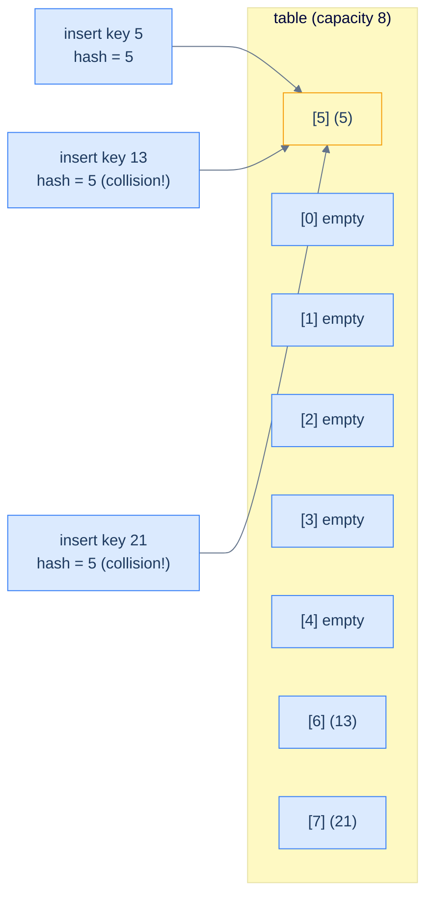
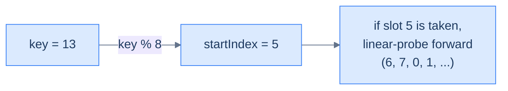
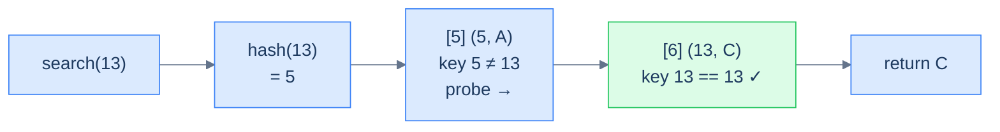
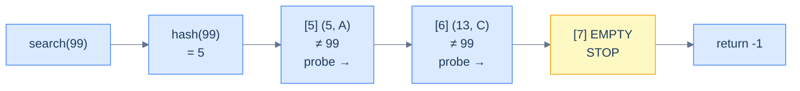
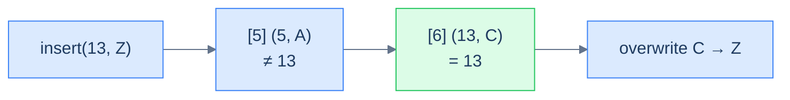
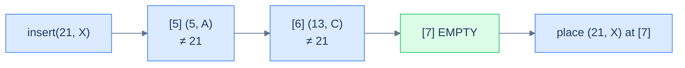
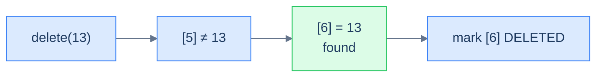

# 3. Linear Probing

## The Hook

Picture a movie theatre at midnight, every seat numbered, almost full. You walk in with ticket **A7**. You shuffle along to **A7** — and there's already someone sitting there. You don't dump them on the floor. You don't go find a manager. You glance at **A8**: empty. You sit down.

Now imagine the next person walks in with ticket **A8**. They go to **A8** — taken (by you). They check **A9**: also empty. They sit. The next person, **A7** again, goes to **A7** (still taken), then **A8** (taken — by you), then **A9** (taken), and finally lands on **A10**.

That escalating shuffle is **linear probing**. When a slot is taken, you don't grow a side-list (separate chaining); you keep walking the same row, one seat at a time, until you find an empty seat. The whole hash table lives in a single contiguous array — no chains, no extra pointers, just a beautifully cache-friendly slab of records that the CPU can fly through.

That's the upside. The *downside* is something we'll discover with horror in this lesson — collisions don't stay localised. They form **clusters** that grow into longer and longer runs, and as the table fills, performance falls off a cliff in a way separate chaining never does. Linear probing is the simplest open-addressing scheme to implement, and the most instructive to get burned by. We'll build it, measure it, break it — and then in the next lesson we'll see what cleverer probe sequences buy us.

---

## Table of contents

1. [Introduction to linear probing](#introduction-to-linear-probing)
2. [Key components of linear probing](#key-components-of-linear-probing)
3. [Implementing the hash table class](#implementing-the-hash-table-class)
4. [Search operation in linear probing](#search-operation-in-linear-probing)
5. [Insert operation in linear probing](#insert-operation-in-linear-probing)
6. [Delete operation in linear probing](#delete-operation-in-linear-probing)
7. [Design a hash table with linear probing](#design-a-hash-table-with-linear-probing)

***

# Introduction to linear probing

Now that we know how a hash table is implemented using separate chaining and have lived through its trade-offs, let's look at another popular collision-resolution scheme: **linear probing**. Separate chaining had two structural costs we couldn't paper over — *unbounded chain growth* and *cache-hostile pointer chasing*. Linear probing solves both by going the opposite direction: keep everything in a **single contiguous array**, and never add a side-data-structure. When two keys collide, the second one slides forward to the next empty slot in the array.

In linear probing, every slot in the internal array stores **one** key-value pair (or nothing). The size of the internal array therefore caps the size of the hash table — you cannot fit 10 keys into an array of length 8. The huge upside is **cache locality**: the entire table is one slab of memory the CPU can stream through with prefetching, and walking N slots is *brutally* faster than chasing N linked-list nodes scattered around the heap.

```d2
grid-columns: 8
grid-gap: 0
h0: "[0]" {style.fill: "#fef9c3"; style.stroke: "#d97706"}
h1: "[1]" {style.fill: "#fef9c3"; style.stroke: "#d97706"}
h2: "[2]" {style.fill: "#fef9c3"; style.stroke: "#d97706"}
h3: "[3]" {style.fill: "#fef9c3"; style.stroke: "#d97706"}
h4: "[4]" {style.fill: "#fef9c3"; style.stroke: "#d97706"}
h5: "[5]" {style.fill: "#fef9c3"; style.stroke: "#d97706"}
h6: "[6]" {style.fill: "#fef9c3"; style.stroke: "#d97706"}
h7: "[7]" {style.fill: "#fef9c3"; style.stroke: "#d97706"}
c0: "EMPTY"
c1: "(9, B)" {style.fill: "#dbeafe"; style.stroke: "#3b82f6"}
c2: "(13, C)" {style.fill: "#dbeafe"; style.stroke: "#3b82f6"}
c3: "(17, D)" {style.fill: "#dbeafe"; style.stroke: "#3b82f6"}
c4: "EMPTY"
c5: "(5, A)" {style.fill: "#dbeafe"; style.stroke: "#3b82f6"}
c6: "EMPTY"
c7: "EMPTY"
```

<p align="center"><strong>Logical view of a linear-probing hash table — the internal array stores key-value pairs directly. Some slots are occupied, others are empty. Everything lives in one contiguous block of memory; there are no chains.</strong></p>

In real-world implementations, the array is often **dynamic**: when occupancy crosses some threshold (typically 70%), the table is rehashed into a larger array. To keep this lesson focused on the probing scheme itself, we'll work with a **fixed-size** array — and when it fills up, inserts simply fail.

## Handling collisions

When two keys hash to the same index, the first one wins that slot. The second one starts a **linear probe**: check `index + 1`, then `index + 2`, then `index + 3`, and so on, wrapping around to the start of the array if needed. The first empty slot it finds is where it goes.



<p align="center"><strong>Three keys that all hash to index 5 — the first lands at slot 5, the second probes one step forward to slot 6, the third probes two steps forward to slot 7. The colliding keys end up <em>consecutively</em> in the array.</strong></p>

The probe is bounded — we never iterate more than `capacity` steps, because after `capacity` probes we have visited every slot in the array. The wrap-around is implemented with a mod operator: `probeIndex = (startIndex + i) % capacity`.

> **Insert (sketch)**
>
> -   **Step 1:** Compute the hash of the key.
> -   **Step 2:** Linear-probe from that index until an unoccupied slot is found.
> -   **Step 3:** Place the key-value pair at that slot.
>
> **Search (sketch)**
>
> -   **Step 1:** Compute the hash of the key.
> -   **Step 2:** Linear-probe from that index until either the key is found or an empty slot is hit.
> -   **Step 3:** Return the value if the key is found; otherwise return `-1`.

```d2
oa: Open addressing {
  desc: "Collisions resolved by probing other slots in the SAME array"
  fam: family of probe sequences {
    direction: right
    L: Linear probing
    Q: Quadratic probing
    D: Double hashing
  }
  desc -> fam
}
```

<p align="center"><strong>Linear probing belongs to the broader family called <strong>open addressing</strong> — the address (slot index) is "open" because a key can end up at <em>any</em> slot, not just the one its hash points to. The next two lessons will explore the other two probe sequences in this family.</strong></p>

> **Open addressing** is the umbrella term for any collision-resolution scheme that handles collisions by probing for *alternate locations within the same array*. Linear probing is the simplest member of the family; quadratic probing and double hashing are coming next.

***

# Key components of linear probing

A linear-probing hash table has three parts: a record type that tracks slot state, an internal array of those records, and a hash function. The interesting wrinkle this time is the slot state — separate chaining only ever needed "occupied or not"; linear probing needs **three** states, and one of them is going to seem mysterious until we get to deletion.

<details>
<summary><h2>Record</h2></summary>


In linear probing, each slot stores exactly one record (or nothing). But "nothing" turns out to come in two flavours that the table must distinguish, so each record carries an explicit **state** field with three possible values:

> -   **EMPTY** — this slot has never held a record. A search hitting an `EMPTY` slot can stop immediately: the key cannot be further along the probe chain.
> -   **OCCUPIED** — this slot currently holds a key-value pair.
> -   **DELETED** — this slot used to hold a record, but it was deleted. A search hitting a `DELETED` slot must keep probing, because the key it's looking for might have been placed *past* this slot during a long probe chain.

We'll see exactly why `DELETED` is necessary (and not just "set the slot to `EMPTY`") when we get to the delete operation. For now, take the three states as a given.

```d2
direction: right

rec: A single Record {
  s: |md
    **state**

    EMPTY / OCCUPIED / DELETED
  | {style.fill: "#fef9c3"; style.stroke: "#d97706"}
  k: key
  v: value
}

note: |md
  The state field is what
  makes the array searchable
  after deletes
| {style.fill: "#fef9c3"; style.stroke: "#d97706"}

note -> rec.s {style.stroke-dash: 3}
```

<p align="center"><strong>A linear-probing record carries three fields — the state tag plus the (key, value) payload. The state field is the secret ingredient that lets the table survive deletions without losing data; we'll see why in the delete section.</strong></p>


```python run
# Implementation of a hash function for this hash table
def hash_function(self, key: int) -> int:
    return key % self.capacity
```

```java run
// Implementation of a hash function for this hash table
int hashFunction(int key) {
    return key % capacity;
}
```

</details>
<details>
<summary><h2>Internal array</h2></summary>


The internal array is just `capacity` records sitting back-to-back. Every slot starts in the `EMPTY` state. Inserts flip slots to `OCCUPIED`; deletes flip occupied slots to `DELETED`; the array's *length* never changes.

```d2
grid-columns: 6
grid-gap: 0
h0: "[0]" {style.fill: "#fef9c3"; style.stroke: "#d97706"}
h1: "[1]" {style.fill: "#fef9c3"; style.stroke: "#d97706"}
h2: "[2]" {style.fill: "#fef9c3"; style.stroke: "#d97706"}
h3: "[3]" {style.fill: "#fef9c3"; style.stroke: "#d97706"}
h4: "[4]" {style.fill: "#fef9c3"; style.stroke: "#d97706"}
h5: "[5]" {style.fill: "#fef9c3"; style.stroke: "#d97706"}
e0: EMPTY
e1: EMPTY
e2: EMPTY
e3: EMPTY
e4: EMPTY
e5: EMPTY
```

<p align="center"><strong>An empty linear-probing hash table — one contiguous array, every slot in <code>EMPTY</code> state. Compare with separate chaining, where the array contained chain references; here the array contains the records themselves.</strong></p>

</details>
<details>
<summary><h2>Hash function</h2></summary>


The hash function does the same job as before — turn a key into an integer index. Collisions are no longer absorbed by the slot itself; they trigger a probe. We'll keep using the simple division-method `key % capacity` so we can focus on probing.



<p align="center"><strong>The hash function picks the <em>starting</em> probe index. The probe sequence does the rest of the work, walking forward until an empty (for insert) or matching (for search) slot is found.</strong></p>

</details>

***

# Implementing the hash table class

We now wrap everything into a `MyHashTable` class. The constructor builds an array of `capacity` records, all `EMPTY`; the public methods are stubs we'll fill in next.

```d2
cls: MyHashTable class {
  priv: private internals {
    cap: "capacity"
    tbl: "table: Record[]"
    hf: "hashFunction(key)"
    po: "probeForOccupied(key)"
    pe: "probeForEmpty(start)"
  }
  pub: public API {
    s: "search(key)"
    i: "insert(key, value)"
    r: "remove(key)"
  }
  pub -> priv {style.stroke-dash: 3}
}
```

<p align="center"><strong>The class wraps two helpers around the hash function — <code>probeForOccupied</code> finds an existing key, <code>probeForEmpty</code> finds the next free slot. Every public operation will call one or both.</strong></p>

<details>
<summary><h2>Implementation</h2></summary>


```python run
# Instantiate a hash table object from the MyHashTable class
table = MyHashTable(4)

table.insert(1, 1234)

table.insert(2, 4567)

table.search(2)

table.insert(4, 8910)

table.remove(1)
```

```java run
// Instantiate a hash table object from the MyHashTable class
MyHashTable table = new MyHashTable(4);

table.insert(1, 1234);

table.insert(2, 4567);

table.search(2);

table.insert(4, 8910);

table.remove(1);
```


> *Predict before reading on — when search hits a slot, it must answer one of three questions: "is this my key?", "is this empty?", or "should I keep going?". Which slot states map to which decisions? Try to write the rule in your head before reading the next section.*

</details>

***

# Search operation in linear probing

Search is the operation that exposes why we need three slot states. We probe forward from the hashed index, checking each slot. Three things can happen:

<details>
<summary><h2>Algorithm</h2></summary>


### 1. The key is present

If we land on an `OCCUPIED` slot whose key matches, we've found it. Return the value.



<p align="center"><strong>Successful search — probe walks forward through occupied slots, comparing keys, until it finds the match.</strong></p>

> **Algorithm — case 1**
>
> -   **Step 1:** Compute the hashed index for the key.
> -   **Step 2:** Linear-probe forward from that index.
> -   **Step 3:** If an `OCCUPIED` slot with a matching key is found, return its value.

### 2. An EMPTY slot is found

If we hit an `EMPTY` slot before finding the key, the key is not in the table — and we can stop *immediately*. Why? Because if the key had been inserted, the insert procedure would have placed it at *this exact slot* (or earlier in the probe). The fact that this slot is empty proves the key was never inserted into this probe chain.



<p align="center"><strong>Search hits an EMPTY slot — terminate immediately. Had the key been inserted, it would have landed here or earlier; an empty slot proves it never made it past this point.</strong></p>

> **Algorithm — case 2**
>
> -   **Step 1:** Compute the hashed index for the key.
> -   **Step 2:** Linear-probe forward from that index.
> -   **Step 3:** If an `EMPTY` slot is encountered, return `-1`.

### 3. The table is full

If we walk the entire array (`capacity` probes) without finding either the key or an `EMPTY` slot, the table is completely full and the key is not present. Return `-1`.

```d2
grid-columns: 5
grid-gap: 0
h0: "[0]" {style.fill: "#fef9c3"; style.stroke: "#d97706"}
h1: "[1]" {style.fill: "#fef9c3"; style.stroke: "#d97706"}
h2: "[2]" {style.fill: "#fef9c3"; style.stroke: "#d97706"}
h3: "[3]" {style.fill: "#fef9c3"; style.stroke: "#d97706"}
h4: "[4]" {style.fill: "#fef9c3"; style.stroke: "#d97706"}
c0: "(20)" {style.fill: "#dbeafe"; style.stroke: "#3b82f6"}
c1: "(31)" {style.fill: "#dbeafe"; style.stroke: "#3b82f6"}
c2: "(13)" {style.fill: "#dbeafe"; style.stroke: "#3b82f6"}
c3: "(7)" {style.fill: "#dbeafe"; style.stroke: "#3b82f6"}
c4: "(99)" {style.fill: "#dbeafe"; style.stroke: "#3b82f6"}
```

<p align="center"><strong>A full table — every slot OCCUPIED. A search for a key not in the table walks the entire array and returns -1 only after <code>capacity</code> probes.</strong></p>

> **Algorithm — case 3**
>
> -   **Step 1:** Compute the hashed index for the key.
> -   **Step 2:** Linear-probe forward.
> -   **Step 3:** If the entire array has been traversed without finding the key, return `-1`.

</details>
<details>
<summary><h2>Solution &amp; Analysis</h2></summary>

### Implementation

We extract the probe loop into a private helper `probeForOccupiedIndex` so insert and delete can reuse it. The helper returns the index of the matching record or `-1` if no match exists.


```python run
from enum import Enum
from typing import List, Optional

# Represents the state of a record in the hash table
class RecordType(Enum):
    EMPTY = 0
    DELETED = 1
    OCCUPIED = 2

# Represents an entry in the hash table
class Record:
    def __init__(
        self, key: Optional[int] = None, value: Optional[int] = None
    ):

        # Initialize state as EMPTY by default
        self.state: RecordType = RecordType.EMPTY
        self.key: int = 0
        self.value: int = 0

        # Set state to OCCUPIED when key and value are provided
        if key is not None and value is not None:
            self.state = RecordType.OCCUPIED
            self.key = key
            self.value = value

class MyHashTable:
    def __init__(self, capacity: int):
        self.capacity = capacity

        # The hash table implemented as a list of Records
        self.table: List[Record] = [Record() for _ in range(capacity)]

    # Primary hash function: Computes the index as key % capacity
    def hash_function(self, key: int) -> int:
        return key % self.capacity

    def probe_for_occupied_index(
        self, key: int, start_index: int
    ) -> int:
        for i in range(self.capacity):

            # Linear probing
            probe_index = (start_index + i) % self.capacity

            # Check if the slot is occupied and matches the key
            if (
                self.table[probe_index].state == RecordType.OCCUPIED
                and self.table[probe_index].key == key
            ):
                return probe_index

        # Return -1 if no matching record is found
        return -1

    def search(self, key: int) -> int:

        # Compute the initial index using the primary hash function
        start_index = self.hash_function(key)

        # Find the occupied index for the key
        occupied_index = self.probe_for_occupied_index(key, start_index)

        # Return the value if found, otherwise -1
        return (
            -1
            if occupied_index == -1
            else self.table[occupied_index].value
        )
```

```java run
import java.util.*;

// Represents the state of a record in the hash table
enum RecordType {
    EMPTY,
    DELETED,
    OCCUPIED
}

// Represents an entry in the hash table
class Record {

    // Use the separately defined RecordType enum
    RecordType state = RecordType.EMPTY;
    int key = 0;
    int value = 0;

    Record() {}

    Record(int key, int value) {
        this.state = RecordType.OCCUPIED;
        this.key = key;
        this.value = value;
    }
}

class MyHashTable {

    // The total number of slots in the hash table
    private int capacity;

    // The hash table implemented as a list of Records
    private List<Record> table;

    // Primary hash function: Computes the index as key % capacity
    private int hashFunction(int key) {
        return key % capacity;
    }

    private int probeForOccupiedIndex(int key, int startIndex) {
        for (int i = 0; i < capacity; ++i) {

            // Linear probing
            int probeIndex = (startIndex + i) % capacity;

            // Check if the slot is occupied and matches the key
            if (
                table.get(probeIndex).state == RecordType.OCCUPIED &&
                table.get(probeIndex).key == key
            ) {
                return probeIndex;
            }
        }

        // Return -1 if no matching record is found
        return -1;
    }

    public MyHashTable(int capacity) {
        this.capacity = capacity;

        // Initialize the table with empty records
        table = new ArrayList<>();
        for (int i = 0; i < capacity; i++) {
            table.add(new Record());
        }
    }

    public int search(int key) {

        // Compute the initial index using the primary hash function
        int startIndex = hashFunction(key);

        // Find the occupied index for the key
        int occupiedIndex = probeForOccupiedIndex(key, startIndex);

        // Return the value if found, otherwise -1
        return occupiedIndex == -1 ? -1 : table.get(occupiedIndex).value;
    }
}
```

### Complexity analysis

```d2
best: "Best — slot at hash matches" {
  b: "[5] (k, v)" {style.fill: "#dcfce7"; style.stroke: "#16a34a"}
}

worst: "Worst — every slot occupied, target absent or at end" {
  direction: right
  w0: "[5] !="
  w1: "[6] !="
  w2: "[7] !="
  w3: "..."
  w4: "[4] != -> -1"
  w0 -> w1 -> w2 -> w3 -> w4
}
```

<p align="center"><strong>Search performance — best case is one comparison; worst case (table full of collisions) requires walking every slot. The cache-friendliness of the contiguous array means linear probing typically beats separate chaining in wall-clock time even when the asymptotic complexity is identical.</strong></p>

> **Best case** — first probe matches
>
> -   Time: **O(1)** | Space: **O(1)**
>
> **Average case** — well-distributed hash values, low load factor
>
> -   Time: **O(1)** | Space: **O(1)**
>
> **Worst case** — table full or 100% collision
>
> -   Time: **O(N)** | Space: **O(1)**

</details>

***

# Insert operation in linear probing

Insert is search plus "find the first slot we can write to". A *writable* slot is anything that isn't `OCCUPIED` — so either `EMPTY` or `DELETED`. Reusing `DELETED` slots is what makes the table memory-efficient over long sequences of inserts and deletes.

<details>
<summary><h2>Algorithm</h2></summary>


### 1. Key already exists

If the probe finds an `OCCUPIED` slot whose key matches, we update the value in place and return `true`.



<p align="center"><strong>Insert with an existing key — the probe finds the matching record and overwrites its value. Table size unchanged.</strong></p>

### 2. Free slot found

If the probe doesn't find the key but does find a non-`OCCUPIED` slot (`EMPTY` or `DELETED`), the key isn't in the table. Place the new record at the **first** non-occupied slot encountered (this is the slot the algorithm prefers — preferring `DELETED` first lets the table reclaim tombstones aggressively).

A subtle but important rule: we run the probe **twice** — first to confirm the key isn't already present anywhere in the probe chain (we have to check past `DELETED` slots, so we *cannot* stop at the first free one), then to find the first free slot. This double pass is what guarantees we never insert a duplicate key.



<p align="center"><strong>Insert with a new key — the probe walks past occupied slots until it finds the first non-occupied slot, then writes the new record there.</strong></p>

### 3. Table is full

If the entire array is OCCUPIED and the key is not present, insert fails — return `false`.

```d2
grid-columns: 5
grid-gap: 0
h0: "[0]" {style.fill: "#fef9c3"; style.stroke: "#d97706"}
h1: "[1]" {style.fill: "#fef9c3"; style.stroke: "#d97706"}
h2: "[2]" {style.fill: "#fef9c3"; style.stroke: "#d97706"}
h3: "[3]" {style.fill: "#fef9c3"; style.stroke: "#d97706"}
h4: "[4]" {style.fill: "#fef9c3"; style.stroke: "#d97706"}
c0: "(20)" {style.fill: "#dbeafe"; style.stroke: "#3b82f6"}
c1: "(31)" {style.fill: "#dbeafe"; style.stroke: "#3b82f6"}
c2: "(13)" {style.fill: "#dbeafe"; style.stroke: "#3b82f6"}
c3: "(7)" {style.fill: "#dbeafe"; style.stroke: "#3b82f6"}
c4: "(99)" {style.fill: "#dbeafe"; style.stroke: "#3b82f6"}
```

<p align="center"><strong>Insert into a full table fails. In production, this is the trigger for resizing — copy every record into a larger array. Our fixed-capacity teaching version simply returns <code>false</code>.</strong></p>

</details>
<details>
<summary><h2>Solution &amp; Analysis</h2></summary>

### Implementation

```python run
from enum import Enum
from typing import List, Optional

# Represents the state of a record in the hash table
class RecordType(Enum):
    EMPTY = 0
    DELETED = 1
    OCCUPIED = 2

# Represents an entry in the hash table
class Record:
    def __init__(
        self, key: Optional[int] = None, value: Optional[int] = None
    ):

        # Initialize state as EMPTY by default
        self.state: RecordType = RecordType.EMPTY
        self.key: int = 0
        self.value: int = 0

        # Set state to OCCUPIED when key and value are provided
        if key is not None and value is not None:
            self.state = RecordType.OCCUPIED
            self.key = key
            self.value = value

class MyHashTable:
    def __init__(self, capacity: int):
        self.capacity = capacity

        # The hash table implemented as a list of Records
        self.table: List[Record] = [Record() for _ in range(capacity)]

    # Primary hash function: Computes the index as key % capacity
    def hash_function(self, key: int) -> int:
        return key % self.capacity

    def probe_for_occupied_index(
        self, key: int, start_index: int
    ) -> int:
        for i in range(self.capacity):

            # Linear probing
            probe_index = (start_index + i) % self.capacity

            # Check if the slot is occupied and matches the key
            if (
                self.table[probe_index].state == RecordType.OCCUPIED
                and self.table[probe_index].key == key
            ):
                return probe_index

        # Return -1 if no matching record is found
        return -1

    def probe_for_empty_index(self, start_index: int) -> int:
        for i in range(self.capacity):

            # Linear probing
            probe_index = (start_index + i) % self.capacity

            # Check if the slot is available (either EMPTY or DELETED)
            if self.table[probe_index].state != RecordType.OCCUPIED:
                return probe_index

        # Return -1 if no available slot is found
        return -1

    def search(self, key: int) -> int:

        # Compute the initial index using the primary hash function
        start_index = self.hash_function(key)

        # Find the occupied index for the key
        occupied_index = self.probe_for_occupied_index(key, start_index)

        # Return the value if found, otherwise -1
        return (
            -1
            if occupied_index == -1
            else self.table[occupied_index].value
        )

    def insert(self, key: int, value: int) -> bool:

        # Compute the initial index using the primary hash function
        start_index = self.hash_function(key)

        # Find the occupied index for the key
        occupied_index = self.probe_for_occupied_index(key, start_index)

        # Update the value if the key exists
        if occupied_index != -1:
            self.table[occupied_index].value = value
            return True

        # Find an empty slot to insert the new key-value pair
        empty_index = self.probe_for_empty_index(start_index)
        if empty_index != -1:
            self.table[empty_index] = Record(key, value)
            return True

        # Return false if the table is full and insertion fails
        return False
```

```java run
import java.util.*;

// Represents the state of a record in the hash table
enum RecordType {
    EMPTY,
    DELETED,
    OCCUPIED
}

// Represents an entry in the hash table
class Record {

    // Use the separately defined RecordType enum
    RecordType state = RecordType.EMPTY;
    int key = 0;
    int value = 0;

    Record() {}

    Record(int key, int value) {
        this.state = RecordType.OCCUPIED;
        this.key = key;
        this.value = value;
    }
}

class MyHashTable {

    // The total number of slots in the hash table
    private int capacity;

    // The hash table implemented as a list of Records
    private List<Record> table;

    // Primary hash function: Computes the index as key % capacity
    private int hashFunction(int key) {
        return key % capacity;
    }

    private int probeForOccupiedIndex(int key, int startIndex) {
        for (int i = 0; i < capacity; ++i) {

            // Linear probing
            int probeIndex = (startIndex + i) % capacity;

            // Check if the slot is occupied and matches the key
            if (
                table.get(probeIndex).state == RecordType.OCCUPIED &&
                table.get(probeIndex).key == key
            ) {
                return probeIndex;
            }
        }

        // Return -1 if no matching record is found
        return -1;
    }

    private int probeForEmptyIndex(int startIndex) {
        for (int i = 0; i < capacity; ++i) {

            // Linear probing
            int probeIndex = (startIndex + i) % capacity;

            // Check if the slot is available (either EMPTY or DELETED)
            if (table.get(probeIndex).state != RecordType.OCCUPIED) {
                return probeIndex;
            }
        }

        // Return -1 if no available slot is found
        return -1;
    }

    public MyHashTable(int capacity) {
        this.capacity = capacity;

        // Initialize the table with empty records
        table = new ArrayList<>();
        for (int i = 0; i < capacity; i++) {
            table.add(new Record());
        }
    }

    public int search(int key) {

        // Compute the initial index using the primary hash function
        int startIndex = hashFunction(key);

        // Find the occupied index for the key
        int occupiedIndex = probeForOccupiedIndex(key, startIndex);

        // Return the value if found, otherwise -1
        return occupiedIndex == -1 ? -1 : table.get(occupiedIndex).value;
    }

    public boolean insert(int key, int value) {

        // Compute the initial index using the primary hash function
        int startIndex = hashFunction(key);

        // Find the occupied index for the key
        int occupiedIndex = probeForOccupiedIndex(key, startIndex);

        // Update the value if the key exists
        if (occupiedIndex != -1) {
            table.get(occupiedIndex).value = value;
            return true;
        }

        // Find an empty slot to insert the new key-value pair
        int emptyIndex = probeForEmptyIndex(startIndex);
        if (emptyIndex != -1) {
            table.set(emptyIndex, new Record(key, value));
            return true;
        }

        // Return false if the table is full and insertion fails
        return false;
    }
}
```

### Complexity analysis

> **Best case** — first probe is a writable slot (empty or matching key)
>
> -   Time: **O(1)** | Space: **O(1)**
>
> **Average case** — well-distributed hashes, low load factor
>
> -   Time: **O(1)** | Space: **O(1)**
>
> **Worst case** — table almost full, long probe chain
>
> -   Time: **O(N)** | Space: **O(1)**

</details>

***

# Delete operation in linear probing

Now we meet the most subtle operation — and the reason `DELETED` exists as a separate state from `EMPTY`. Naïve deletion (just set the slot to `EMPTY`) **silently corrupts the table** by breaking probe chains. We have to use a tombstone.

> **The Twist — why we can't just set the slot to EMPTY:**
>
> Imagine a probe chain `[5] → [6] → [7]` for a key inserted at `[7]`. Now we delete the record at `[6]` and naively mark it `EMPTY`. The next time someone searches for the key at `[7]`, the search probes `[5]` (occupied, no match), reaches `[6]` (EMPTY) — and returns "not found", because the search-on-EMPTY rule says stop. But the record at `[7]` is still there! We've made it unreachable. *Phantom data.*
>
> The fix is the `DELETED` tombstone: marking `[6]` as `DELETED` keeps the probe chain alive ("keep searching past me"), so the search continues to `[7]` and finds the record. Subsequent inserts can still reuse the slot (it's not OCCUPIED), so the table doesn't bloat with tombstones.

```d2
bad: "Naive delete — set [6] to EMPTY" {
  direction: right
  b5: "[5] (5, A)"
  b6: "[6] EMPTY" {style.fill: "#fee2e2"; style.stroke: "#ef4444"}
  b7: "[7] (13, C)"
  b5 -> b6 -> b7
  note: |md
    search(13) hits EMPTY at [6]
    -> returns -1; record at [7]
    is UNREACHABLE
  | {style.fill: "#fee2e2"; style.stroke: "#ef4444"}
}

good: "Tombstone delete — set [6] to DELETED" {
  direction: right
  g5: "[5] (5, A)"
  g6: "[6] DELETED" {style.fill: "#fef9c3"; style.stroke: "#d97706"}
  g7: "[7] (13, C)"
  g5 -> g6 -> g7
  note: |md
    search(13) skips DELETED at [6],
    finds record at [7]
  | {style.fill: "#dcfce7"; style.stroke: "#16a34a"}
}
```

<p align="center"><strong>Why the DELETED tombstone exists — naïvely setting a deleted slot to EMPTY breaks the probe chain and orphans every record beyond it. The DELETED tombstone keeps the chain walkable for searches while still letting inserts reuse the slot.</strong></p>

<details>
<summary><h2>Algorithm</h2></summary>


### 1. Key is present

Probe forward; when an `OCCUPIED` slot with the matching key is found, mark it `DELETED`.

### 2. Key is not present (EMPTY hit)

If the probe hits an `EMPTY` slot before finding the key, the key was never in the table. No-op.

### 3. Table fully scanned

If the entire array has been traversed without finding the key, no-op.



<p align="center"><strong>Delete with the key present — the matching slot is flipped to DELETED. Record stays in memory but is invisible to search; future inserts may reuse the slot.</strong></p>

</details>
<details>
<summary><h2>Solution &amp; Analysis</h2></summary>

### Implementation

```python run
from enum import Enum
from typing import List, Optional

# Represents the state of a record in the hash table
class RecordType(Enum):
    EMPTY = 0
    DELETED = 1
    OCCUPIED = 2

# Represents an entry in the hash table
class Record:
    def __init__(
        self, key: Optional[int] = None, value: Optional[int] = None
    ):

        # Initialize state as EMPTY by default
        self.state: RecordType = RecordType.EMPTY
        self.key: int = 0
        self.value: int = 0

        # Set state to OCCUPIED when key and value are provided
        if key is not None and value is not None:
            self.state = RecordType.OCCUPIED
            self.key = key
            self.value = value

class MyHashTable:
    def __init__(self, capacity: int):
        self.capacity = capacity

        # The hash table implemented as a list of Records
        self.table: List[Record] = [Record() for _ in range(capacity)]

    # Primary hash function: Computes the index as key % capacity
    def hash_function(self, key: int) -> int:
        return key % self.capacity

    def probe_for_occupied_index(
        self, key: int, start_index: int
    ) -> int:
        for i in range(self.capacity):

            # Linear probing
            probe_index = (start_index + i) % self.capacity

            # Check if the slot is occupied and matches the key
            if (
                self.table[probe_index].state == RecordType.OCCUPIED
                and self.table[probe_index].key == key
            ):
                return probe_index

        # Return -1 if no matching record is found
        return -1

    def probe_for_empty_index(self, start_index: int) -> int:
        for i in range(self.capacity):

            # Linear probing
            probe_index = (start_index + i) % self.capacity

            # Check if the slot is available (either EMPTY or DELETED)
            if self.table[probe_index].state != RecordType.OCCUPIED:
                return probe_index

        # Return -1 if no available slot is found
        return -1

    def search(self, key: int) -> int:

        # Compute the initial index using the primary hash function
        start_index = self.hash_function(key)

        # Find the occupied index for the key
        occupied_index = self.probe_for_occupied_index(key, start_index)

        # Return the value if found, otherwise -1
        return (
            -1
            if occupied_index == -1
            else self.table[occupied_index].value
        )

    def insert(self, key: int, value: int) -> bool:

        # Compute the initial index using the primary hash function
        start_index = self.hash_function(key)

        # Find the occupied index for the key
        occupied_index = self.probe_for_occupied_index(key, start_index)

        # Update the value if the key exists
        if occupied_index != -1:
            self.table[occupied_index].value = value
            return True

        # Find an empty slot to insert the new key-value pair
        empty_index = self.probe_for_empty_index(start_index)
        if empty_index != -1:
            self.table[empty_index] = Record(key, value)
            return True

        # Return false if the table is full and insertion fails
        return False

    def remove(self, key: int) -> None:

        # Compute the initial index using the primary hash function
        start_index = self.hash_function(key)

        # Find the occupied index for the key
        occupied_index = self.probe_for_occupied_index(key, start_index)

        # Mark the slot as DELETED
        if occupied_index != -1:
            self.table[occupied_index].state = RecordType.DELETED
```

```java run
import java.util.*;

// Represents the state of a record in the hash table
enum RecordType {
    EMPTY,
    DELETED,
    OCCUPIED
}

// Represents an entry in the hash table
class Record {

    // Use the separately defined RecordType enum
    RecordType state = RecordType.EMPTY;
    int key = 0;
    int value = 0;

    Record() {}

    Record(int key, int value) {
        this.state = RecordType.OCCUPIED;
        this.key = key;
        this.value = value;
    }
}

class MyHashTable {

    // The total number of slots in the hash table
    private int capacity;

    // The hash table implemented as a list of Records
    private List<Record> table;

    // Primary hash function: Computes the index as key % capacity
    private int hashFunction(int key) {
        return key % capacity;
    }

    private int probeForOccupiedIndex(int key, int startIndex) {
        for (int i = 0; i < capacity; ++i) {

            // Linear probing
            int probeIndex = (startIndex + i) % capacity;

            // Check if the slot is occupied and matches the key
            if (
                table.get(probeIndex).state == RecordType.OCCUPIED &&
                table.get(probeIndex).key == key
            ) {
                return probeIndex;
            }
        }

        // Return -1 if no matching record is found
        return -1;
    }

    private int probeForEmptyIndex(int startIndex) {
        for (int i = 0; i < capacity; ++i) {

            // Linear probing
            int probeIndex = (startIndex + i) % capacity;

            // Check if the slot is available (either EMPTY or DELETED)
            if (table.get(probeIndex).state != RecordType.OCCUPIED) {
                return probeIndex;
            }
        }

        // Return -1 if no available slot is found
        return -1;
    }

    public MyHashTable(int capacity) {
        this.capacity = capacity;

        // Initialize the table with empty records
        table = new ArrayList<>();
        for (int i = 0; i < capacity; i++) {
            table.add(new Record());
        }
    }

    public int search(int key) {

        // Compute the initial index using the primary hash function
        int startIndex = hashFunction(key);

        // Find the occupied index for the key
        int occupiedIndex = probeForOccupiedIndex(key, startIndex);

        // Return the value if found, otherwise -1
        return occupiedIndex == -1 ? -1 : table.get(occupiedIndex).value;
    }

    public boolean insert(int key, int value) {

        // Compute the initial index using the primary hash function
        int startIndex = hashFunction(key);

        // Find the occupied index for the key
        int occupiedIndex = probeForOccupiedIndex(key, startIndex);

        // Update the value if the key exists
        if (occupiedIndex != -1) {
            table.get(occupiedIndex).value = value;
            return true;
        }

        // Find an empty slot to insert the new key-value pair
        int emptyIndex = probeForEmptyIndex(startIndex);
        if (emptyIndex != -1) {
            table.set(emptyIndex, new Record(key, value));
            return true;
        }

        // Return false if the table is full and insertion fails
        return false;
    }

    public void remove(int key) {

        // Compute the initial index using the primary hash function
        int startIndex = hashFunction(key);

        // Find the occupied index for the key
        int occupiedIndex = probeForOccupiedIndex(key, startIndex);

        // Mark the slot as DELETED
        if (occupiedIndex != -1) {
            table.get(occupiedIndex).state = RecordType.DELETED;
        }
    }
}
```

### Complexity analysis

> **Best case** — first probe is the target
>
> -   Time: **O(1)** | Space: **O(1)**
>
> **Average case** — well-distributed hashes
>
> -   Time: **O(1)** | Space: **O(1)**
>
> **Worst case** — long collision cluster
>
> -   Time: **O(N)** | Space: **O(1)**

</details>

***

# Design a hash table with linear probing

## Problem Statement

Given the skeleton of a `MyHashTable` class, complete it by implementing:

> -   **MyHashTable(int capacity)** — Initialise with the given capacity.
> -   **search(int key)** — Return the value, or `-1`.
> -   **insert(int key, int value)** — Insert or update; return `true` on success, `false` if the table is full.
> -   **remove(int key)** — Remove the mapping (no-op if absent).
> -   **getKeyAtIndex(int index)** — Return the key currently stored at `table[index]`, or `-1` if the slot isn't `OCCUPIED`.

```d2
cons: Constraints {
  c1: "No built-in hash table libraries"
  c2: "Linear probing for collisions"
  c3: "Hash function: index = key % capacity"
}
```

<p align="center"><strong>Constraints — implement everything from scratch with linear probing and the simple division-method hash.</strong></p>

> **Example:**
>
> -   **Input:** `[MyHashTable, insert, insert, search, insert, search, insert, search, search, getKeyAtIndex]`, `[[3], [1, 2], [2, 4], [1], [1, 3], [1], [2, 5], [2], [3], [0]]`
>
> -   **Output:** `[null, true, true, 2, true, 3, true, 5, -1, -1]`
>
> **Explanation:**
>
> | Operation | Effect | Result |
> |---|---|---|
> | `MyHashTable(3)` | empty table, capacity 3 | `null` |
> | `insert(1, 2)` | `[EMPTY, (1, 2), EMPTY]` (1 % 3 = 1) | `true` |
> | `insert(2, 4)` | `[EMPTY, (1, 2), (2, 4)]` (2 % 3 = 2) | `true` |
> | `search(1)` | found at index 1 | `2` |
> | `insert(1, 3)` | update existing | `true` |
> | `search(1)` | | `3` |
> | `insert(2, 5)` | update existing | `true` |
> | `search(2)` | | `5` |
> | `search(3)` | 3 % 3 = 0; index 0 is EMPTY → not found | `-1` |
> | `getKeyAtIndex(0)` | slot 0 is EMPTY | `-1` |

<details>
<summary><h2>Solution</h2></summary>


The full implementation. `getKeyAtIndex` is a one-liner: return the stored key if the slot is `OCCUPIED`, otherwise `-1` (covers both `EMPTY` and `DELETED` slots).


```python run viz=graph viz-root=table
from enum import Enum
from typing import List, Optional

# Represents the state of a record in the hash table
class RecordType(Enum):
    EMPTY = 0
    DELETED = 1
    OCCUPIED = 2

# Represents an entry in the hash table
class Record:
    def __init__(
        self, key: Optional[int] = None, value: Optional[int] = None
    ):

        # Initialize state as EMPTY by default
        self.state: RecordType = RecordType.EMPTY
        self.key: int = 0
        self.value: int = 0

        # Set state to OCCUPIED when key and value are provided
        if key is not None and value is not None:
            self.state = RecordType.OCCUPIED
            self.key = key
            self.value = value

class MyHashTable:
    def __init__(self, capacity: int):
        self.capacity = capacity

        # The hash table implemented as a list of Records
        self.table: List[Record] = [Record() for _ in range(capacity)]

    # Primary hash function: Computes the index as key % capacity
    def hash_function(self, key: int) -> int:
        return key % self.capacity

    def probe_for_occupied_index(
        self, key: int, start_index: int
    ) -> int:
        for i in range(self.capacity):

            # Linear probing
            probe_index = (start_index + i) % self.capacity

            # Check if the slot is occupied and matches the key
            if (
                self.table[probe_index].state == RecordType.OCCUPIED
                and self.table[probe_index].key == key
            ):
                return probe_index

        # Return -1 if no matching record is found
        return -1

    def probe_for_empty_index(self, start_index: int) -> int:
        for i in range(self.capacity):

            # Linear probing
            probe_index = (start_index + i) % self.capacity

            # Check if the slot is available (either EMPTY or DELETED)
            if self.table[probe_index].state != RecordType.OCCUPIED:
                return probe_index

        # Return -1 if no available slot is found
        return -1

    def search(self, key: int) -> int:

        # Compute the initial index using the primary hash function
        start_index = self.hash_function(key)

        # Find the occupied index for the key
        occupied_index = self.probe_for_occupied_index(key, start_index)

        # Return the value if found, otherwise -1
        return (
            -1
            if occupied_index == -1
            else self.table[occupied_index].value
        )

    def insert(self, key: int, value: int) -> bool:

        # Compute the initial index using the primary hash function
        start_index = self.hash_function(key)

        # Find the occupied index for the key
        occupied_index = self.probe_for_occupied_index(key, start_index)

        # Update the value if the key exists
        if occupied_index != -1:
            self.table[occupied_index].value = value
            return True

        # Find an empty slot to insert the new key-value pair
        empty_index = self.probe_for_empty_index(start_index)
        if empty_index != -1:
            self.table[empty_index] = Record(key, value)
            return True

        # Return false if the table is full and insertion fails
        return False

    def remove(self, key: int) -> None:

        # Compute the initial index using the primary hash function
        start_index = self.hash_function(key)

        # Find the occupied index for the key
        occupied_index = self.probe_for_occupied_index(key, start_index)

        # Mark the slot as DELETED
        if occupied_index != -1:
            self.table[occupied_index].state = RecordType.DELETED

    def get_key_at_index(self, index: int) -> int:
        return (
            self.table[index].key
            if self.table[index].state == RecordType.OCCUPIED
            else -1
        )


# Example from the problem statement
t1 = MyHashTable(3)
print(t1.insert(1, 2))              # True
print(t1.insert(2, 4))              # True
print(t1.search(1))                 # 2
print(t1.insert(1, 3))              # True
print(t1.search(1))                 # 3
print(t1.insert(2, 5))              # True
print(t1.search(2))                 # 5
print(t1.search(3))                 # -1
print(t1.get_key_at_index(0))       # -1 — index 0 is EMPTY

# Edge cases
t2 = MyHashTable(5)
print(t2.search(0))                 # -1 — empty table
print(t2.insert(0, 99))             # True — key 0 at index 0
print(t2.get_key_at_index(0))       # 0
t2.remove(0)
print(t2.search(0))                 # -1 — removed (DELETED slot)
print(t2.insert(5, 7))              # True — key 5 also hashes to index 0, probes to next DELETED
print(t2.search(5))                 # 7
```

```java run
import java.util.*;

public class Main {

    // Represents the state of a record in the hash table
    enum RecordType {
        EMPTY,
        DELETED,
        OCCUPIED
    }

    // Represents an entry in the hash table
    static class Record {

        // Use the separately defined RecordType enum
        RecordType state = RecordType.EMPTY;
        int key = 0;
        int value = 0;

        Record() {}

        Record(int key, int value) {
            this.state = RecordType.OCCUPIED;
            this.key = key;
            this.value = value;
        }
    }

    static class MyHashTable {

        // The total number of slots in the hash table
        private int capacity;

        // The hash table implemented as a list of Records
        private List<Record> table;

        // Primary hash function: Computes the index as key % capacity
        private int hashFunction(int key) {
            return key % capacity;
        }

        private int probeForOccupiedIndex(int key, int startIndex) {
            for (int i = 0; i < capacity; ++i) {

                // Linear probing
                int probeIndex = (startIndex + i) % capacity;

                // Check if the slot is occupied and matches the key
                if (
                    table.get(probeIndex).state == RecordType.OCCUPIED &&
                    table.get(probeIndex).key == key
                ) {
                    return probeIndex;
                }
            }

            // Return -1 if no matching record is found
            return -1;
        }

        private int probeForEmptyIndex(int startIndex) {
            for (int i = 0; i < capacity; ++i) {

                // Linear probing
                int probeIndex = (startIndex + i) % capacity;

                // Check if the slot is available (either EMPTY or DELETED)
                if (table.get(probeIndex).state != RecordType.OCCUPIED) {
                    return probeIndex;
                }
            }

            // Return -1 if no available slot is found
            return -1;
        }

        public MyHashTable(int capacity) {
            this.capacity = capacity;

            // Initialize the table with empty records
            table = new ArrayList<>();
            for (int i = 0; i < capacity; i++) {
                table.add(new Record());
            }
        }

        public int search(int key) {

            // Compute the initial index using the primary hash function
            int startIndex = hashFunction(key);

            // Find the occupied index for the key
            int occupiedIndex = probeForOccupiedIndex(key, startIndex);

            // Return the value if found, otherwise -1
            return occupiedIndex == -1 ? -1 : table.get(occupiedIndex).value;
        }

        public boolean insert(int key, int value) {

            // Compute the initial index using the primary hash function
            int startIndex = hashFunction(key);

            // Find the occupied index for the key
            int occupiedIndex = probeForOccupiedIndex(key, startIndex);

            // Update the value if the key exists
            if (occupiedIndex != -1) {
                table.get(occupiedIndex).value = value;
                return true;
            }

            // Find an empty slot to insert the new key-value pair
            int emptyIndex = probeForEmptyIndex(startIndex);
            if (emptyIndex != -1) {
                table.set(emptyIndex, new Record(key, value));
                return true;
            }

            // Return false if the table is full and insertion fails
            return false;
        }

        public void remove(int key) {

            // Compute the initial index using the primary hash function
            int startIndex = hashFunction(key);

            // Find the occupied index for the key
            int occupiedIndex = probeForOccupiedIndex(key, startIndex);

            // Mark the slot as DELETED
            if (occupiedIndex != -1) {
                table.get(occupiedIndex).state = RecordType.DELETED;
            }
        }

        public int getKeyAtIndex(int index) {
            return table.get(index).state == RecordType.OCCUPIED
                ? table.get(index).key
                : -1;
        }
    }

    public static void main(String[] args) {
        // Example from the problem statement
        MyHashTable t1 = new MyHashTable(3);
        System.out.println(t1.insert(1, 2));             // true
        System.out.println(t1.insert(2, 4));             // true
        System.out.println(t1.search(1));                // 2
        System.out.println(t1.insert(1, 3));             // true
        System.out.println(t1.search(1));                // 3
        System.out.println(t1.insert(2, 5));             // true
        System.out.println(t1.search(2));                // 5
        System.out.println(t1.search(3));                // -1
        System.out.println(t1.getKeyAtIndex(0));         // -1 — index 0 is EMPTY

        // Edge cases
        MyHashTable t2 = new MyHashTable(5);
        System.out.println(t2.search(0));                // -1 — empty table
        System.out.println(t2.insert(0, 99));            // true — key 0 at index 0
        System.out.println(t2.getKeyAtIndex(0));         // 0
        t2.remove(0);
        System.out.println(t2.search(0));                // -1 — removed (DELETED slot)
        System.out.println(t2.insert(5, 7));             // true — key 5 also hashes to index 0
        System.out.println(t2.search(5));                // 7
    }
}
```

</details>
<details>
<summary><h2>Final Takeaway</h2></summary>


Linear probing trades the chains of separate chaining for a single, dense, contiguous array. The wins are real: cache locality is unbeatable, no extra pointer overhead per record, and the implementation is short. The cost is hidden in three places — slot states with the `DELETED` tombstone, the inability to grow past `capacity`, and (most insidiously) **primary clustering**.

> **Primary clustering — the dragon at the door:**
>
> When a single insert causes a probe of length `k`, the *next* insert that lands anywhere in that cluster gets a probe of at least `k`. Clusters grow approximately **as the square** of their length — a cluster of size 4 doesn't grow at the rate of one new key per slot; it absorbs new keys at a rate proportional to 4. Once a few clusters form, they stretch toward each other and merge. Average probe lengths balloon. By the time the load factor crosses ~0.7, performance is visibly degrading; cross 0.85 and it falls off a cliff.

Two takeaways to carry forward:

1. **Cache locality matters more than asymptotic constants.** A dense array with `O(N)` worst case routinely outperforms a chained structure with `O(1)` average — for small to medium tables — because the constant factor on a cache miss is enormous.
2. **Tombstones are how you stay correct under deletion.** The `DELETED` state is not optional: it is the contract that keeps the probe chain walkable.

> *Coming up — primary clustering is the bug, and the next two lessons are the cures. <strong>Quadratic probing</strong> jumps further with each probe (1, 4, 9, 16, ...) instead of one slot at a time, which spreads collisions across the array. <strong>Double hashing</strong> goes further still, using a <em>second</em> hash function to give each key its own probe rhythm. Both are subtle; both have edge cases that linear probing doesn't. Let's see them.*

</details>

<!-- ============================================== -->
<!-- SWEEP 2 — missing sections (placeholders only) -->
<!-- ============================================== -->

<!-- TODO: Understanding the Problem — missing, needs to be written -->
<!--       Guidance: frame the gap the structure/algorithm fills -->

<!-- TODO: Supported Operations — missing, needs to be written -->
<!--       Guidance: table: operation / time / notes -->

<!-- TODO: Internal Mechanics — missing, needs to be written -->
<!--       Guidance: how it actually works under the hood -->

<!-- TODO: Working Example — missing, needs to be written -->
<!--       Guidance: one fully worked end-to-end example -->

<!-- TODO: Edge Cases & Pitfalls — missing, needs to be written -->
<!--       Guidance: bulleted list of gotchas -->

<!-- TODO: Production Reality — missing, needs to be written -->
<!--       Guidance: 4–6 entries: System — uses X — because Y -->

<!-- TODO: Quiz — missing, needs to be written -->
<!--       Guidance: 3–5 questions, each labeled [Recall]/[Reasoning]/[Tradeoff] -->

<!-- TODO: Practice Ladder — missing, needs to be written -->
<!--       Guidance: table: 5 links into pattern problems + hints -->

<!-- TODO: Further Reading — missing, needs to be written -->
<!--       Guidance: annotated: ★ Essential / ◆ Advanced / → Reference -->

<!-- TODO: Cross-Links — missing, needs to be written -->
<!--       Guidance: Prerequisites | What comes next -->

<!-- TODO: Final Takeaway — missing, needs to be written -->
<!--       Guidance: exactly 3 typed bullets: Core mechanic / Dominant tradeoff / One thing to remember -->
