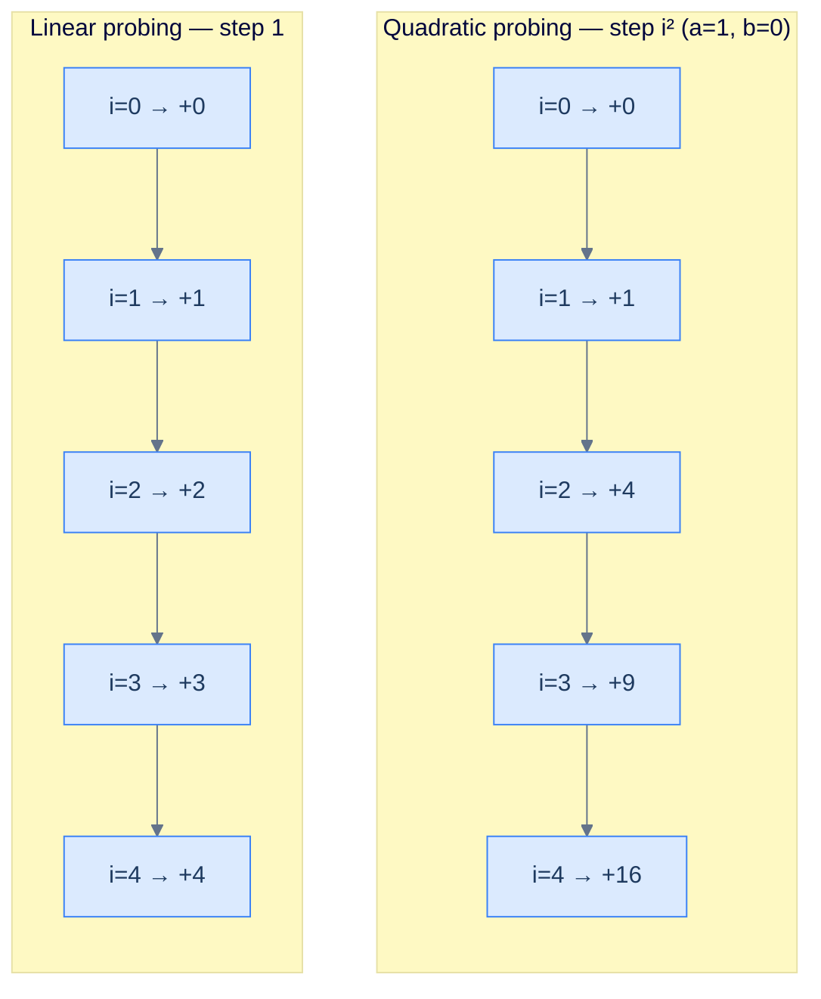
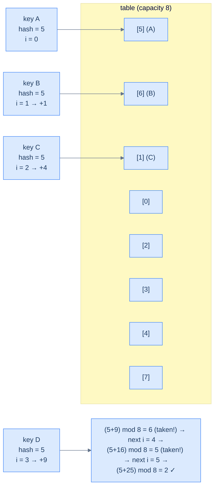
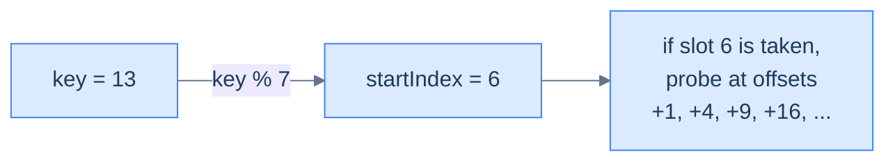
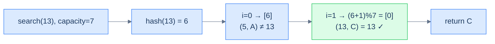
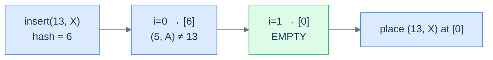
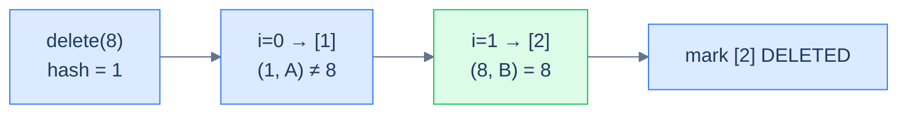

# 4. Quadratic Probing

## The Hook

You've just lived through the linear-probing apocalypse. Drop a few keys that all hash to the same slot, and they pile up *next to each other*. Drop more keys anywhere near that pile, and the pile *absorbs* them — every collision lengthens the cluster, and every nearby insert lengthens it further. By the time the table is 80% full, what should be O(1) lookups have become punishing scans through 20-, 30-, 40-slot clusters.

What if every collision *kicked the next key further away from the cluster*? Not one slot ahead, but **i² slots ahead** — so the second collision lands 1 slot away, the third lands 4 slots away, the fourth lands 9 slots away, the fifth lands 16 slots away. The keys spray themselves across the array instead of huddling together. Clusters can't form at the same hash index because the *second* colliding key has already teleported past where the third would land — collisions disperse instead of compounding.

That's **quadratic probing**. Same array, same three-state record, same O(1) average — but a probe sequence designed to *shatter* primary clusters. We get most of linear probing's cache-friendly speed back, with a far gentler degradation curve as the table fills.

There's still a price (every cure has its bug), and we'll meet it: **secondary clustering**. Two keys that hash to the *same* index will follow the *same* probe path forever, because the probe formula only uses `i`, not the key itself. We'll surface that limitation and tease its fix in the next lesson — double hashing.

---

## Table of contents

1. [Understanding the problem](#understanding-the-problem)
2. [Introduction to quadratic probing](#introduction-to-quadratic-probing)
3. [Key components of quadratic probing](#key-components-of-quadratic-probing)
4. [Supported operations](#supported-operations)
5. [Internal mechanics](#internal-mechanics)
6. [Implementing the hash table class](#implementing-the-hash-table-class)
7. [Search operation in quadratic probing](#search-operation-in-quadratic-probing)
8. [Insert operation in quadratic probing](#insert-operation-in-quadratic-probing)
9. [Delete operation in quadratic probing](#delete-operation-in-quadratic-probing)
10. [Working example](#working-example)
11. [Design a hash table with quadratic probing](#design-a-hash-table-with-quadratic-probing)
12. [Edge cases and pitfalls](#edge-cases-and-pitfalls)
13. [Production reality](#production-reality)
14. [Quiz](#quiz)
15. [Practice ladder](#practice-ladder)
16. [Further reading](#further-reading)
17. [Cross-links](#cross-links)
18. [Final takeaway](#final-takeaway)

***

# Understanding the Problem

Linear probing wins on cache locality but loses to **primary clustering** — and quadratic probing exists to keep the win while cutting the loss. The cause of clustering is the probe step itself. Linear probing always walks `+1` from a collision, so colliding keys land in consecutive slots, and any new key that hashes *anywhere into that run* extends it. A run of length `k` then absorbs new keys at a rate proportional to `k`, so clusters grow roughly as the square of their size and average probe length balloons past load factor `~0.7`.

Quadratic probing attacks the step, not the storage. It keeps the single contiguous array and the three-state record, and changes only where the i-th probe lands:

- **Same storage as linear probing.** One slab of records, every slot `EMPTY` / `OCCUPIED` / `DELETED`, so the cache-friendly streaming and zero pointer overhead survive intact.
- **A widening step instead of a fixed one.** The i-th probe sits at `(start + a·i² + b·i) % capacity`, so successive collisions land `1`, `4`, `9`, `16`, … slots out (with `a=1, b=0`) rather than `1, 2, 3, 4`.

To make this concrete: in linear probing, four keys colliding at index `5` pile into slots `5, 6, 7, 8` — a solid wall. In quadratic probing they scatter to `5`, `6`, `9`, `14` (offsets `0, 1, 4, 9`), so the next key that hashes to `6` no longer slams into a wall that reaches it. So the key idea is: quadratic probing trades linear probing's fixed step for a quadratically widening one — you keep the contiguous-array speed and gain a far gentler degradation curve, and you give up the guarantee that the probe visits every slot, which forces care in choosing `a`, `b`, and `capacity`.

***

# Introduction to quadratic probing

Now that we've seen linear probing and felt its limitation — primary clustering — let's introduce a small but powerful change to the probe sequence. **Quadratic probing** is an open-addressing scheme that keeps everything else about linear probing the same (single contiguous array, three-state records, cache-friendly storage) but replaces the linear walk with a *quadratic* one: the i-th probe is at `(startIndex + a·i² + b·i) % capacity` for some constants `a` and `b`.

```d2
grid-columns: 8
grid-gap: 0
h0: "[0]" {style.fill: "#fef9c3"; style.stroke: "#d97706"}
h1: "[1]" {style.fill: "#fef9c3"; style.stroke: "#d97706"}
h2: "[2]" {style.fill: "#fef9c3"; style.stroke: "#d97706"}
h3: "[3]" {style.fill: "#fef9c3"; style.stroke: "#d97706"}
h4: "[4]" {style.fill: "#fef9c3"; style.stroke: "#d97706"}
h5: "[5]" {style.fill: "#fef9c3"; style.stroke: "#d97706"}
h6: "[6]" {style.fill: "#fef9c3"; style.stroke: "#d97706"}
h7: "[7]" {style.fill: "#fef9c3"; style.stroke: "#d97706"}
c0: "EMPTY"
c1: "(9, B)" {style.fill: "#dbeafe"; style.stroke: "#3b82f6"}
c2: "EMPTY"
c3: "EMPTY"
c4: "(13, C)" {style.fill: "#dbeafe"; style.stroke: "#3b82f6"}
c5: "(5, A)" {style.fill: "#dbeafe"; style.stroke: "#3b82f6"}
c6: "EMPTY"
c7: "EMPTY"
```

<p align="center"><strong>Logical view of a quadratic-probing hash table — like linear probing, every slot stores one (key, value) pair directly. Unlike linear probing, colliding keys land at <em>scattered</em> positions instead of consecutive ones.</strong></p>

The internal array can be dynamic (resized on demand) in production implementations, but we'll keep it fixed in this lesson to focus on the probing scheme itself.

## Handling collisions

The probe sequence in linear probing is `+1, +2, +3, +4, ...` — the same direction, the same step, every time. The probe sequence in quadratic probing accelerates: `+1, +4, +9, +16, +25, ...` (with the simplest choice `a = 1, b = 0`, where the i-th probe is `+i²`). Each successive collision lands the new key *much further* from the cluster than the last, which is what stops clusters from forming around the original hash index.



<p align="center"><strong>Probe-step comparison — linear probing increases by 1 each step; quadratic probing increases by <em>i²</em>. After 5 collisions, linear is at offset 4 from the start; quadratic is at offset 16 — far enough away to escape any growing cluster around the start.</strong></p>

The first colliding key still lands at the hashed index. Subsequent colliding keys, however, are pushed to indices **far** from each other. Continuing the example with `a = 1, b = 0`, hash index 5, capacity 8:



<p align="center"><strong>Four colliding keys at hash 5, capacity 8 — the probe offsets <code>(5+0, 5+1, 5+4, 5+9, 5+16, 5+25) mod 8</code> visit slots <code>5, 6, 1, 6, 5, 2</code>. The fourth key has to skip past two re-visits before landing — and that <em>revisiting</em> is the secondary clustering we'll need to confront later.</strong></p>

Like linear probing, the quadratic probe runs up to N iterations (N = `capacity`), wrapping with `mod`. The two-step recipe is the same; only the formula for the offset has changed.

> **Insert (sketch)**
>
> -   **Step 1:** Compute the hash for the key.
> -   **Step 2:** Iterate up to N times using the quadratic offset formula until an unoccupied slot is found.
> -   **Step 3:** Place the (key, value) pair at that slot.
>
> **Search (sketch)**
>
> -   **Step 1:** Compute the hash for the key.
> -   **Step 2:** Iterate up to N times using the quadratic offset formula until the key is found or an empty slot is hit.
> -   **Step 3:** Return the value if the key is found.

The quadratic-probing implementation is *almost* identical to linear probing — same data structures, same operations, same EMPTY/DELETED/OCCUPIED state machine. Only the offset calculation changes.

***

# Key components of quadratic probing

A quadratic-probing hash table has the same three components as linear probing — a three-state record, an internal array of records, and a hash function — plus two new constants `a` and `b` that parameterise the probe sequence.

<details>
<summary><h2>Record</h2></summary>


Identical to linear probing: each slot stores a key, a value, and a state (`EMPTY` / `DELETED` / `OCCUPIED`). The state field plays exactly the same role — `EMPTY` short-circuits searches, `DELETED` keeps probe chains alive after deletions.

```d2
rec: A single Record {
  s: |md
    **state**

    EMPTY / OCCUPIED / DELETED
  | {style.fill: "#fef9c3"; style.stroke: "#d97706"}
  k: key
  v: value
}
```

<p align="center"><strong>Quadratic-probing record — exactly the same shape as linear probing's record. The only difference between the two schemes is in <em>how</em> the probe sequence walks the array.</strong></p>


```python run
# Implementation of a hash function for this hash table
def hash_function(self, key: int) -> int:
    return key % self.capacity
```

```java run
// Implementation of a hash function for this hash table
int hashFunction(int key) {
    return key % capacity;
}
```

</details>
<details>
<summary><h2>Internal array</h2></summary>


Identical to linear probing — `capacity` records sitting back-to-back, all `EMPTY` at construction time. The contiguous layout is what gives both schemes their cache-friendly performance.

```d2
grid-columns: 7
grid-gap: 0
h0: "[0]" {style.fill: "#fef9c3"; style.stroke: "#d97706"}
h1: "[1]" {style.fill: "#fef9c3"; style.stroke: "#d97706"}
h2: "[2]" {style.fill: "#fef9c3"; style.stroke: "#d97706"}
h3: "[3]" {style.fill: "#fef9c3"; style.stroke: "#d97706"}
h4: "[4]" {style.fill: "#fef9c3"; style.stroke: "#d97706"}
h5: "[5]" {style.fill: "#fef9c3"; style.stroke: "#d97706"}
h6: "[6]" {style.fill: "#fef9c3"; style.stroke: "#d97706"}
e0: EMPTY
e1: EMPTY
e2: EMPTY
e3: EMPTY
e4: EMPTY
e5: EMPTY
e6: EMPTY
```

<p align="center"><strong>An empty quadratic-probing hash table — same structural layout as linear probing. The behavioural difference shows up only when collisions start happening.</strong></p>

</details>
<details>
<summary><h2>Hash function</h2></summary>


Same `key % capacity` we've used throughout the section. The hash function picks the *starting* probe index; the quadratic step formula does the rest.



<p align="center"><strong>The hash function picks the starting index; the quadratic offset (a·i² + b·i) determines where each subsequent probe lands. The two stages are independent, which is why both schemes can share the same hash function.</strong></p>

</details>

***

# Supported Operations

The interface is identical to linear probing — one read and two mutations, each the same shape of "hash the key, then probe." Only the probe step changes, so the operation set and its complexity profile carry over unchanged. A quadratic-probing table still offers no ordered iteration and no range query; the probe order has nothing to do with key order, so those operations would be meaningless here:

| Operation | Average | Worst | Space | What it does |
|---|---|---|---|---|
| `search(key)` | `O(1)` | `O(N)` | `O(1)` | Probes the quadratic sequence from `hash(key)`; returns the value, or `-1` if an `EMPTY` slot or full scan is hit first |
| `insert(key, value)` | `O(1)` | `O(N)` | `O(1)` | Updates in place if the key exists, else writes at the first non-`OCCUPIED` slot in the sequence; returns `false` if no slot is reachable |
| `remove(key)` | `O(1)` | `O(N)` | `O(1)` | Probes to the matching slot and flips it to `DELETED`; a no-op if the key is absent |

The worst case is `O(N)` in `capacity`, and it has one cause: a probe that has to walk all `capacity` iterations. Quadratic probing reaches that case less often than linear probing because the widening step keeps clusters from compounding — but it does not erase it, because keys that share a start index still share a probe path. To make this concrete: in a capacity-`8` table where keys `5`, `13`, and `21` all hash to index `5`, a search for `21` walks the quadratic offsets `+0, +1, +4` (slots `5, 6, 1`) before matching. So the core insight is: the operations and bounds match linear probing exactly — the only lever quadratic probing pulls is *how fast probe chains grow*, not what the operations cost in the worst case.

***

# Internal Mechanics

A quadratic-probing table is one array plus one rule: when slot `start` is taken, try `(start + a·1² + b·1) % capacity`, then `(start + a·2² + b·2) % capacity`, and keep widening. The hash function picks only the *starting* index; the quadratic offset does the rest. Every operation is a variation on the same walk, and three slot states decide when it stops:

- **`OCCUPIED`** — holds a live key-value pair. A probe compares the stored key and either matches or steps to the next offset.
- **`EMPTY`** — never held a record. A *search* stops here immediately, because an absent key would have been placed at this slot or earlier in its probe sequence.
- **`DELETED`** — a tombstone left by a prior removal. A *search* walks *past* it, but an *insert* may reuse it.

The widening step is the whole difference from linear probing, and it cuts two ways. Because offset `i` grows as `i²`, the gap between successive probes grows without bound, which is what disperses collisions and starves primary clustering. The same growth, though, means the sequence can *revisit* slots and *skip* others before `capacity` iterations elapse. To make this concrete: at hash `5`, capacity `8`, `a=1, b=0`, the offsets `0, 1, 4, 9, 16, 25` land on slots `5, 6, 1, 6, 5, 2` — slot `6` and slot `5` recur, and slots `0, 3, 4, 7` never appear. So the core insight is: the array is passive storage and the quadratic offset plus the three-state tag are the only live machinery — correctness reduces to walking `(start + a·i² + b·i) % capacity` and reading each slot's state, but unlike linear probing the walk is not guaranteed to be a full permutation of the slots.

***

# Implementing the hash table class

Now we wrap everything into `MyHashTable`. The class signature gains two extra parameters — the quadratic constants `a` and `b` — so the same code can support different probe sequences (`a=1, b=0` for the textbook `i²`, or any other choice the user wants to experiment with).

```d2
cls: MyHashTable class {
  priv: private internals {
    cap: "capacity"
    ab: |md
      **a, b**

      (quadratic constants)
    |
    tbl: "table: Record[]"
    hf: "hashFunction(key)"
    po: "probeForOccupied(key)"
    pe: "probeForFree(start)"
  }
  pub: public API {
    s: "search(key)"
    i: "insert(key, value)"
    r: "remove(key)"
  }
  pub -> priv {style.stroke-dash: 3}
}
```

<p align="center"><strong>The quadratic-probing class adds two private fields (a and b) on top of the linear-probing class. Everything else — the array, the hash function, the public API — is unchanged.</strong></p>

<details>
<summary><h2>Implementation</h2></summary>


```python run
# Instantiate a hash table object from the MyHashTable class
table = MyHashTable(4)

table.insert(1, 1234)

table.insert(2, 4567)

table.search(2)

table.insert(4, 8910)

table.remove(1)
```

```java run
// Instantiate a hash table object from the MyHashTable class
MyHashTable table = new MyHashTable(4);

table.insert(1, 1234);

table.insert(2, 4567);

table.search(2);

table.insert(4, 8910);

table.remove(1);
```


> *Predict before reading on — with the formula <code>(start + a·i² + b·i) % capacity</code> and constants <code>a=1, b=0</code>, what's the maximum possible probe-step distance after just 5 iterations? And how many slots can quadratic probing reach in a table of capacity 8 — all of them, or only some?*
>
> After 5 iterations the offset is 16; in a capacity-8 table that wraps to 0, so the path crosses itself. **Quadratic probing on capacity 8 cannot reach every slot** — half the array is unreachable depending on the start. This is one of the limitations we'll surface formally; the standard fix is to choose `capacity` to be a prime number, which we'll discuss in the design problem.

</details>

***

# Search operation in quadratic probing

Search in quadratic probing is identical to linear probing in *structure* — three cases (key found, EMPTY hit, full traversal) — but the offset between probes is `a·i² + b·i` instead of `i`. We refactor the probe loop into a private helper so insert and delete can reuse it.

<details>
<summary><h2>Algorithm</h2></summary>


### 1. The key is present

If we land on an `OCCUPIED` slot whose key matches, return the value.



<p align="center"><strong>Successful search — the probe walks through the quadratic sequence, comparing keys, until it lands on a match.</strong></p>

### 2. An EMPTY slot is found

Like linear probing, hitting `EMPTY` proves the key was never inserted (or it would have been placed at this slot or earlier in the probe). Stop, return `-1`.

### 3. The table is fully traversed

After `capacity` iterations, give up.

</details>
<details>
<summary><h2>Solution &amp; Analysis</h2></summary>

### Implementation

```python run
from enum import Enum
from typing import List, Optional

# Represents the state of a record in the hash table
class RecordType(Enum):
    EMPTY = 0
    DELETED = 1
    OCCUPIED = 2

# Represents an entry in the hash table
class Record:
    def __init__(
        self, key: Optional[int] = None, value: Optional[int] = None
    ):

        # Initialize state as EMPTY by default
        self.state: RecordType = RecordType.EMPTY
        self.key: int = 0
        self.value: int = 0

        # Set state to OCCUPIED when key and value are provided
        if key is not None and value is not None:
            self.state = RecordType.OCCUPIED
            self.key = key
            self.value = value

class MyHashTable:
    def __init__(self, capacity: int, a: int, b: int):
        self.capacity = capacity
        self.a = a
        self.b = b

        # The hash table implemented as a list of Records
        self.table: List[Record] = [Record() for _ in range(capacity)]

    # Primary hash function: Computes the index as key % capacity
    def hash_function(self, key: int) -> int:
        return key % self.capacity

    def probe_for_occupied_index(
        self, key: int, start_index: int
    ) -> int:
        for i in range(self.capacity):

            # Quadratic probing
            probe_index = (
                start_index + self.a * i * i + self.b * i
            ) % self.capacity

            # Check if the slot is occupied and matches the key
            if (
                self.table[probe_index].state == RecordType.OCCUPIED
                and self.table[probe_index].key == key
            ):
                return probe_index

        # Return -1 if no matching record is found
        return -1

    def search(self, key: int) -> int:

        # Compute the initial index using the primary hash function
        start_index = self.hash_function(key)

        # Find the occupied index for the key
        occupied_index = self.probe_for_occupied_index(key, start_index)

        # Return the value if found, otherwise -1
        return (
            -1
            if occupied_index == -1
            else self.table[occupied_index].value
        )
```

```java run
import java.util.*;

// Represents the state of a record in the hash table
enum RecordType {
    EMPTY,
    DELETED,
    OCCUPIED
}

// Represents an entry in the hash table
class Record {

    // Use the separately defined RecordType enum
    RecordType state = RecordType.EMPTY;
    int key = 0;
    int value = 0;

    Record() {}

    Record(int key, int value) {
        this.state = RecordType.OCCUPIED;
        this.key = key;
        this.value = value;
    }
}

class MyHashTable {

    // The total number of slots in the hash table
    private int capacity;

    // Quadratic probing constants
    private int a, b;

    // The hash table implemented as a list of Records
    private List<Record> table;

    // Primary hash function: Computes the index as key % capacity
    private int hashFunction(int key) {
        return key % capacity;
    }

    private int probeForOccupiedIndex(int key, int startIndex) {
        for (int i = 0; i < capacity; ++i) {

            // Quadratic probing
            int probeIndex = (startIndex + a * i * i + b * i) % capacity;

            // Check if the slot is occupied and matches the key
            if (
                table.get(probeIndex).state == RecordType.OCCUPIED &&
                table.get(probeIndex).key == key
            ) {
                return probeIndex;
            }
        }

        // Return -1 if no matching record is found
        return -1;
    }

    public MyHashTable(int capacity, int a, int b) {
        this.capacity = capacity;
        this.a = a;
        this.b = b;

        // Initialize the table with empty records
        table = new ArrayList<>();
        for (int i = 0; i < capacity; i++) {
            table.add(new Record());
        }
    }

    public int search(int key) {

        // Compute the initial index using the primary hash function
        int startIndex = hashFunction(key);

        // Find the occupied index for the key
        int occupiedIndex = probeForOccupiedIndex(key, startIndex);

        // Return the value if found, otherwise -1
        return occupiedIndex == -1 ? -1 : table.get(occupiedIndex).value;
    }
}
```

### Complexity analysis

> **Best case** — first probe matches
>
> -   Time: **O(1)** | Space: **O(1)**
>
> **Average case** — well-distributed hashes
>
> -   Time: **O(1)** | Space: **O(1)**
>
> **Worst case** — heavy collision, full traversal
>
> -   Time: **O(N)** | Space: **O(1)**

</details>

***

# Insert operation in quadratic probing

Insert mirrors linear probing's structure: first run the probe to confirm the key isn't already there, then run it again to find the first non-OCCUPIED slot for the new record.

<details>
<summary><h2>Algorithm</h2></summary>


### 1. Key already exists

Probe finds an `OCCUPIED` slot with the matching key — overwrite the value.

### 2. Free slot found

Probe finds a non-OCCUPIED slot — drop the new record there.

### 3. Table is full

Probe completes a full traversal without finding either — return `false`.



<p align="center"><strong>Insert with a new key — the quadratic probe walks past the colliding occupied slot and lands on the first free slot, where the record is placed.</strong></p>

</details>
<details>
<summary><h2>Solution &amp; Analysis</h2></summary>

### Implementation

```python run
from enum import Enum
from typing import List, Optional

# Represents the state of a record in the hash table
class RecordType(Enum):
    EMPTY = 0
    DELETED = 1
    OCCUPIED = 2

# Represents an entry in the hash table
class Record:
    def __init__(
        self, key: Optional[int] = None, value: Optional[int] = None
    ):

        # Initialize state as EMPTY by default
        self.state: RecordType = RecordType.EMPTY
        self.key: int = 0
        self.value: int = 0

        # Set state to OCCUPIED when key and value are provided
        if key is not None and value is not None:
            self.state = RecordType.OCCUPIED
            self.key = key
            self.value = value

class MyHashTable:
    def __init__(self, capacity: int, a: int, b: int):
        self.capacity = capacity
        self.a = a
        self.b = b

        # The hash table implemented as a list of Records
        self.table: List[Record] = [Record() for _ in range(capacity)]

    # Primary hash function: Computes the index as key % capacity
    def hash_function(self, key: int) -> int:
        return key % self.capacity

    def probe_for_occupied_index(
        self, key: int, start_index: int
    ) -> int:
        for i in range(self.capacity):

            # Quadratic probing
            probe_index = (
                start_index + self.a * i * i + self.b * i
            ) % self.capacity

            # Check if the slot is occupied and matches the key
            if (
                self.table[probe_index].state == RecordType.OCCUPIED
                and self.table[probe_index].key == key
            ):
                return probe_index

        # Return -1 if no matching record is found
        return -1

    def probe_for_empty_index(self, start_index: int) -> int:
        for i in range(self.capacity):

            # Quadratic probing
            probe_index = (
                start_index + self.a * i * i + self.b * i
            ) % self.capacity

            # Check if the slot is available (either EMPTY or DELETED)
            if self.table[probe_index].state != RecordType.OCCUPIED:
                return probe_index

        # Return -1 if no available slot is found
        return -1

    def search(self, key: int) -> int:

        # Compute the initial index using the primary hash function
        start_index = self.hash_function(key)

        # Find the occupied index for the key
        occupied_index = self.probe_for_occupied_index(key, start_index)

        # Return the value if found, otherwise -1
        return (
            -1
            if occupied_index == -1
            else self.table[occupied_index].value
        )

    def insert(self, key: int, value: int) -> bool:

        # Compute the initial index using the primary hash function
        start_index = self.hash_function(key)

        # Find the occupied index for the key
        occupied_index = self.probe_for_occupied_index(key, start_index)

        # Update the value if the key exists
        if occupied_index != -1:
            self.table[occupied_index].value = value
            return True

        # Find an empty slot to insert the new key-value pair
        empty_index = self.probe_for_empty_index(start_index)
        if empty_index != -1:
            self.table[empty_index] = Record(key, value)
            return True

        # Return false if the table is full and insertion fails
        return False
```

```java run
import java.util.*;

// Represents the state of a record in the hash table
enum RecordType {
    EMPTY,
    DELETED,
    OCCUPIED
}

// Represents an entry in the hash table
class Record {

    // Use the separately defined RecordType enum
    RecordType state = RecordType.EMPTY;
    int key = 0;
    int value = 0;

    Record() {}

    Record(int key, int value) {
        this.state = RecordType.OCCUPIED;
        this.key = key;
        this.value = value;
    }
}

class MyHashTable {

    // The total number of slots in the hash table
    private int capacity;

    // Quadratic probing constants
    private int a, b;

    // The hash table implemented as a list of Records
    private List<Record> table;

    // Primary hash function: Computes the index as key % capacity
    private int hashFunction(int key) {
        return key % capacity;
    }

    private int probeForOccupiedIndex(int key, int startIndex) {
        for (int i = 0; i < capacity; ++i) {

            // Quadratic probing
            int probeIndex = (startIndex + a * i * i + b * i) % capacity;

            // Check if the slot is occupied and matches the key
            if (
                table.get(probeIndex).state == RecordType.OCCUPIED &&
                table.get(probeIndex).key == key
            ) {
                return probeIndex;
            }
        }

        // Return -1 if no matching record is found
        return -1;
    }

    private int probeForEmptyIndex(int startIndex) {
        for (int i = 0; i < capacity; ++i) {

            // Quadratic probing
            int probeIndex = (startIndex + a * i * i + b * i) % capacity;

            // Check if the slot is available (either EMPTY or DELETED)
            if (table.get(probeIndex).state != RecordType.OCCUPIED) {
                return probeIndex;
            }
        }

        // Return -1 if no available slot is found
        return -1;
    }

    public MyHashTable(int capacity, int a, int b) {
        this.capacity = capacity;
        this.a = a;
        this.b = b;

        // Initialize the table with empty records
        table = new ArrayList<>();
        for (int i = 0; i < capacity; i++) {
            table.add(new Record());
        }
    }

    public int search(int key) {

        // Compute the initial index using the primary hash function
        int startIndex = hashFunction(key);

        // Find the occupied index for the key
        int occupiedIndex = probeForOccupiedIndex(key, startIndex);

        // Return the value if found, otherwise -1
        return occupiedIndex == -1 ? -1 : table.get(occupiedIndex).value;
    }

    public boolean insert(int key, int value) {

        // Compute the initial index using the primary hash function
        int startIndex = hashFunction(key);

        // Find the occupied index for the key
        int occupiedIndex = probeForOccupiedIndex(key, startIndex);

        // Update the value if the key exists
        if (occupiedIndex != -1) {
            table.get(occupiedIndex).value = value;
            return true;
        }

        // Find an empty slot to insert the new key-value pair
        int emptyIndex = probeForEmptyIndex(startIndex);
        if (emptyIndex != -1) {
            table.set(emptyIndex, new Record(key, value));
            return true;
        }

        // Return false if the table is full and insertion fails
        return false;
    }
}
```

### Complexity analysis

> **Best case** — first probe is the right slot
>
> -   Time: **O(1)** | Space: **O(1)**
>
> **Average case** — well-distributed hashes, low load factor
>
> -   Time: **O(1)** | Space: **O(1)**
>
> **Worst case** — collision-heavy, full traversal
>
> -   Time: **O(N)** | Space: **O(1)**

</details>

***

# Delete operation in quadratic probing

Delete works exactly as in linear probing — find the matching `OCCUPIED` slot via the probe, then mark it `DELETED`. The tombstone is just as essential here: removing it would orphan any record whose probe path crossed this slot. The only thing that changes is the path the probe takes.

<details>
<summary><h2>Algorithm</h2></summary>


### 1. Key is present

Probe finds the matching `OCCUPIED` slot — flip it to `DELETED`.

### 2. Key is not present (EMPTY hit)

Probe hits `EMPTY` first — no-op.

### 3. Table fully scanned

Probe returns without finding the key — no-op.



<p align="center"><strong>Quadratic-probing delete — same end result as linear probing, just with a quadratic step. The DELETED tombstone keeps the probe chain walkable for any record placed past this slot during inserts.</strong></p>

</details>
<details>
<summary><h2>Solution &amp; Analysis</h2></summary>

### Implementation

```python run
from enum import Enum
from typing import List, Optional

# Represents the state of a record in the hash table
class RecordType(Enum):
    EMPTY = 0
    DELETED = 1
    OCCUPIED = 2

# Represents an entry in the hash table
class Record:
    def __init__(
        self, key: Optional[int] = None, value: Optional[int] = None
    ):

        # Initialize state as EMPTY by default
        self.state: RecordType = RecordType.EMPTY
        self.key: int = 0
        self.value: int = 0

        # Set state to OCCUPIED when key and value are provided
        if key is not None and value is not None:
            self.state = RecordType.OCCUPIED
            self.key = key
            self.value = value

class MyHashTable:
    def __init__(self, capacity: int, a: int, b: int):
        self.capacity = capacity
        self.a = a
        self.b = b

        # The hash table implemented as a list of Records
        self.table: List[Record] = [Record() for _ in range(capacity)]

    # Primary hash function: Computes the index as key % capacity
    def hash_function(self, key: int) -> int:
        return key % self.capacity

    def probe_for_occupied_index(
        self, key: int, start_index: int
    ) -> int:
        for i in range(self.capacity):

            # Quadratic probing
            probe_index = (
                start_index + self.a * i * i + self.b * i
            ) % self.capacity

            # Check if the slot is occupied and matches the key
            if (
                self.table[probe_index].state == RecordType.OCCUPIED
                and self.table[probe_index].key == key
            ):
                return probe_index

        # Return -1 if no matching record is found
        return -1

    def probe_for_empty_index(self, start_index: int) -> int:
        for i in range(self.capacity):

            # Quadratic probing
            probe_index = (
                start_index + self.a * i * i + self.b * i
            ) % self.capacity

            # Check if the slot is available (either EMPTY or DELETED)
            if self.table[probe_index].state != RecordType.OCCUPIED:
                return probe_index

        # Return -1 if no available slot is found
        return -1

    def search(self, key: int) -> int:

        # Compute the initial index using the primary hash function
        start_index = self.hash_function(key)

        # Find the occupied index for the key
        occupied_index = self.probe_for_occupied_index(key, start_index)

        # Return the value if found, otherwise -1
        return (
            -1
            if occupied_index == -1
            else self.table[occupied_index].value
        )

    def insert(self, key: int, value: int) -> bool:

        # Compute the initial index using the primary hash function
        start_index = self.hash_function(key)

        # Find the occupied index for the key
        occupied_index = self.probe_for_occupied_index(key, start_index)

        # Update the value if the key exists
        if occupied_index != -1:
            self.table[occupied_index].value = value
            return True

        # Find an empty slot to insert the new key-value pair
        empty_index = self.probe_for_empty_index(start_index)
        if empty_index != -1:
            self.table[empty_index] = Record(key, value)
            return True

        # Return false if the table is full and insertion fails
        return False

    def remove(self, key: int) -> None:

        # Compute the initial index using the primary hash function
        start_index = self.hash_function(key)

        # Find the occupied index for the key
        occupied_index = self.probe_for_occupied_index(key, start_index)

        # Mark the slot as DELETED
        if occupied_index != -1:
            self.table[occupied_index].state = RecordType.DELETED
```

```java run
import java.util.*;

// Represents the state of a record in the hash table
enum RecordType {
    EMPTY,
    DELETED,
    OCCUPIED
}

// Represents an entry in the hash table
class Record {

    // Use the separately defined RecordType enum
    RecordType state = RecordType.EMPTY;
    int key = 0;
    int value = 0;

    Record() {}

    Record(int key, int value) {
        this.state = RecordType.OCCUPIED;
        this.key = key;
        this.value = value;
    }
}

class MyHashTable {

    // The total number of slots in the hash table
    private int capacity;

    // Quadratic probing constants
    private int a, b;

    // The hash table implemented as a list of Records
    private List<Record> table;

    // Primary hash function: Computes the index as key % capacity
    private int hashFunction(int key) {
        return key % capacity;
    }

    private int probeForOccupiedIndex(int key, int startIndex) {
        for (int i = 0; i < capacity; ++i) {

            // Quadratic probing
            int probeIndex = (startIndex + a * i * i + b * i) % capacity;

            // Check if the slot is occupied and matches the key
            if (
                table.get(probeIndex).state == RecordType.OCCUPIED &&
                table.get(probeIndex).key == key
            ) {
                return probeIndex;
            }
        }

        // Return -1 if no matching record is found
        return -1;
    }

    private int probeForEmptyIndex(int startIndex) {
        for (int i = 0; i < capacity; ++i) {

            // Quadratic probing
            int probeIndex = (startIndex + a * i * i + b * i) % capacity;

            // Check if the slot is available (either EMPTY or DELETED)
            if (table.get(probeIndex).state != RecordType.OCCUPIED) {
                return probeIndex;
            }
        }

        // Return -1 if no available slot is found
        return -1;
    }

    public MyHashTable(int capacity, int a, int b) {
        this.capacity = capacity;
        this.a = a;
        this.b = b;

        // Initialize the table with empty records
        table = new ArrayList<>();
        for (int i = 0; i < capacity; i++) {
            table.add(new Record());
        }
    }

    public int search(int key) {

        // Compute the initial index using the primary hash function
        int startIndex = hashFunction(key);

        // Find the occupied index for the key
        int occupiedIndex = probeForOccupiedIndex(key, startIndex);

        // Return the value if found, otherwise -1
        return occupiedIndex == -1 ? -1 : table.get(occupiedIndex).value;
    }

    public boolean insert(int key, int value) {

        // Compute the initial index using the primary hash function
        int startIndex = hashFunction(key);

        // Find the occupied index for the key
        int occupiedIndex = probeForOccupiedIndex(key, startIndex);

        // Update the value if the key exists
        if (occupiedIndex != -1) {
            table.get(occupiedIndex).value = value;
            return true;
        }

        // Find an empty slot to insert the new key-value pair
        int emptyIndex = probeForEmptyIndex(startIndex);
        if (emptyIndex != -1) {
            table.set(emptyIndex, new Record(key, value));
            return true;
        }

        // Return false if the table is full and insertion fails
        return false;
    }

    public void remove(int key) {

        // Compute the initial index using the primary hash function
        int startIndex = hashFunction(key);

        // Find the occupied index for the key
        int occupiedIndex = probeForOccupiedIndex(key, startIndex);

        // Mark the slot as DELETED
        if (occupiedIndex != -1) {
            table.get(occupiedIndex).state = RecordType.DELETED;
        }
    }
}
```

### Complexity analysis

> **Best case** — first probe is the target
>
> -   Time: **O(1)** | Space: **O(1)**
>
> **Average case** — well-distributed hashes
>
> -   Time: **O(1)** | Space: **O(1)**
>
> **Worst case** — collision-heavy
>
> -   Time: **O(N)** | Space: **O(1)**

</details>

***

# Working Example

Watching one slot pass through all three states shows why the `DELETED` tombstone earns its keep here too. Start with `MyHashTable(5, 1, 1)` — capacity `5`, constants `a=1, b=1`, every slot `EMPTY`, hash function `key % 5`. With these constants the i-th probe offset is `i² + i`, so the sequence from any start is `+0, +2, +6, +12, +20` — which modulo `5` visits the relative slots `0, 2, 1, 2, 0`. This run inserts a key, deletes it, then inserts a *different* key that hashes to the same start index, forcing the new key to reuse the tombstone:

1. **`insert(0, 99)`** — `hash(0) = 0`. The occupied-pass finds no live key `0`, so the empty-pass runs: probe `i=0` lands on slot `0`, which is `EMPTY`, so write `(0, 99)` and mark it `OCCUPIED`. Returns `true`. Table: `[(0,99), —, —, —, —]`.
2. **`remove(0)`** — `hash(0) = 0`. Probe `i=0` finds slot `0` `OCCUPIED` with key `0`, so flip it to `DELETED`. The pair stays physically in the slot; only the tag changes. Table: `[DELETED, —, —, —, —]`.
3. **`search(0)`** — `hash(0) = 0`. The occupied-pass checks slot `0` (`DELETED`, not a match), then offset `+2` → slot `2`, offset `+6 mod 5` → slot `1`, and so on, finding no `OCCUPIED` key `0` anywhere. Returns `-1`. The delete is visible to search.
4. **`insert(5, 7)`** — `hash(5) = 5 % 5 = 0`, the same start index as key `0`. The occupied-pass finds no live key `5`, so the empty-pass runs. Probe `i=0` lands on slot `0`, and because `DELETED` counts as writable it stops there, overwriting the tombstone with `(5, 7)`. Returns `true`. Table: `[(5,7), —, —, —, —]`.
5. **`search(5)`** — `hash(5) = 0`. Probe `i=0` finds slot `0` `OCCUPIED` with key `5`, an immediate match. Returns `7`.

The sequence returns `true`, then `-1` (key `0` is gone), then `true`, then `7`. Step `3` is the crux: had `remove` set slot `0` to `EMPTY`, a longer probe chain would orphan every record beyond the erased slot — the bug the next section catalogues. Step `4` shows the tombstone's payoff: the freed slot is reclaimed on the first colliding insert, so deletions do not leak capacity. So the core insight is: the three-state machine behaves exactly as it did under linear probing — `OCCUPIED` matches, `EMPTY` halts a search, `DELETED` keeps a chain searchable while letting inserts recycle the slot — and only the *path* the probe takes between slots has changed.

***

# Design a hash table with quadratic probing

## Problem Statement

Given the skeleton of a `MyHashTable` class, complete it by implementing:

> -   **MyHashTable(int capacity, int a, int b)** — Initialise with the given capacity and quadratic constants `a` and `b`.
> -   **search(int key)** — Return the value, or `-1`.
> -   **insert(int key, int value)** — Insert or update; return `true` on success, `false` if the table is full.
> -   **remove(int key)** — Remove the mapping (no-op if absent).
> -   **getKeyAtIndex(int index)** — Return the key at `table[index]`, or `-1` if not `OCCUPIED`.

```d2
cons: Constraints {
  c1: "No built-in hash table libraries"
  c2: |md
    Quadratic probing for collisions

    (formula: a*i^2 + b*i, supplied as input)
  |
  c3: "Hash function: index = key % capacity"
}
```

<p align="center"><strong>Constraints — quadratic probing with supplied <code>a</code> and <code>b</code> coefficients. Choosing them well is critical: with the wrong combination, the probe can fail to visit every slot of the array, even when slots are free.</strong></p>

> **Choosing a, b, and capacity (a critical aside):**
>
> Quadratic probing's biggest gotcha is that the probe sequence may not visit every slot. The classic fix: use a **prime capacity** with `a = 1, b = 0` and a load factor under 0.5 — under those conditions, the first `capacity / 2` probes are guaranteed to visit distinct slots. Choose other (`a`, `b`, `capacity`) combinations carefully or you risk a "table-not-full but insert returns false" situation. We accept the parameters as input here so the user can experiment with the consequences directly.

> **Example:**
>
> -   **Input:** `[MyHashTable, insert, insert, search, insert, search, insert, search, search, getKeyAtIndex]`, `[[3, 2, 3], [1, 2], [2, 4], [1], [1, 3], [1], [2, 5], [2], [3], [0]]`
>
> -   **Output:** `[null, true, true, 2, true, 3, true, 5, -1, -1]`
>
> **Explanation:**
>
> | Operation | Effect | Result |
> |---|---|---|
> | `MyHashTable(3, 2, 3)` | empty, capacity 3, a=2, b=3 | `null` |
> | `insert(1, 2)` | 1 % 3 = 1 → `[EMPTY, (1,2), EMPTY]` | `true` |
> | `insert(2, 4)` | 2 % 3 = 2 → `[EMPTY, (1,2), (2,4)]` | `true` |
> | `search(1)` | found at index 1 | `2` |
> | `insert(1, 3)` | update existing | `true` |
> | `search(1)` | | `3` |
> | `insert(2, 5)` | update existing | `true` |
> | `search(2)` | | `5` |
> | `search(3)` | 3 % 3 = 0; index 0 is EMPTY → not found | `-1` |
> | `getKeyAtIndex(0)` | slot 0 is EMPTY | `-1` |

<details>
<summary><h2>Solution</h2></summary>


The full implementation. Note that the `Math.floorMod`-style guard `((x % n) + n) % n` is used in the Java version to ensure non-negative indices even if `start + offset` overflows or produces a negative value during arithmetic.


```python run viz=graph viz-root=table
from enum import Enum
from typing import List, Optional

# Represents the state of a record in the hash table
class RecordType(Enum):
    EMPTY = 0
    DELETED = 1
    OCCUPIED = 2

# Represents an entry in the hash table
class Record:
    def __init__(
        self, key: Optional[int] = None, value: Optional[int] = None
    ):

        # Initialize state as EMPTY by default
        self.state: RecordType = RecordType.EMPTY
        self.key: int = 0
        self.value: int = 0

        # Set state to OCCUPIED when key and value are provided
        if key is not None and value is not None:
            self.state = RecordType.OCCUPIED
            self.key = key
            self.value = value

class MyHashTable:
    def __init__(self, capacity: int, a: int, b: int):
        self.capacity = capacity
        self.a = a
        self.b = b

        # The hash table implemented as a list of Records
        self.table: List[Record] = [Record() for _ in range(capacity)]

    # Primary hash function: Computes the index as key % capacity
    def hash_function(self, key: int) -> int:
        return key % self.capacity

    def probe_for_occupied_index(
        self, key: int, start_index: int
    ) -> int:
        for i in range(self.capacity):

            # Quadratic probing
            probe_index = (
                start_index + self.a * i * i + self.b * i
            ) % self.capacity

            # Check if the slot is occupied and matches the key
            if (
                self.table[probe_index].state == RecordType.OCCUPIED
                and self.table[probe_index].key == key
            ):
                return probe_index

        # Return -1 if no matching record is found
        return -1

    def probe_for_empty_index(self, start_index: int) -> int:
        for i in range(self.capacity):

            # Quadratic probing
            probe_index = (
                start_index + self.a * i * i + self.b * i
            ) % self.capacity

            # Check if the slot is available (either EMPTY or DELETED)
            if self.table[probe_index].state != RecordType.OCCUPIED:
                return probe_index

        # Return -1 if no available slot is found
        return -1

    def search(self, key: int) -> int:

        # Compute the initial index using the primary hash function
        start_index = self.hash_function(key)

        # Find the occupied index for the key
        occupied_index = self.probe_for_occupied_index(key, start_index)

        # Return the value if found, otherwise -1
        return (
            -1
            if occupied_index == -1
            else self.table[occupied_index].value
        )

    def insert(self, key: int, value: int) -> bool:

        # Compute the initial index using the primary hash function
        start_index = self.hash_function(key)

        # Find the occupied index for the key
        occupied_index = self.probe_for_occupied_index(key, start_index)

        # Update the value if the key exists
        if occupied_index != -1:
            self.table[occupied_index].value = value
            return True

        # Find an empty slot to insert the new key-value pair
        empty_index = self.probe_for_empty_index(start_index)
        if empty_index != -1:
            self.table[empty_index] = Record(key, value)
            return True

        # Return false if the table is full and insertion fails
        return False

    def remove(self, key: int) -> None:

        # Compute the initial index using the primary hash function
        start_index = self.hash_function(key)

        # Find the occupied index for the key
        occupied_index = self.probe_for_occupied_index(key, start_index)

        # Mark the slot as DELETED
        if occupied_index != -1:
            self.table[occupied_index].state = RecordType.DELETED

    def get_key_at_index(self, index: int) -> int:
        return (
            self.table[index].key
            if self.table[index].state == RecordType.OCCUPIED
            else -1
        )


# Example from the problem statement (capacity=3, a=2, b=3)
t1 = MyHashTable(3, 2, 3)
print(t1.insert(1, 2))              # True
print(t1.insert(2, 4))              # True
print(t1.search(1))                 # 2
print(t1.insert(1, 3))              # True
print(t1.search(1))                 # 3
print(t1.insert(2, 5))              # True
print(t1.search(2))                 # 5
print(t1.search(3))                 # -1
print(t1.get_key_at_index(0))       # -1 — index 0 is EMPTY

# Edge cases
t2 = MyHashTable(5, 1, 1)
print(t2.search(10))                # -1 — empty table
print(t2.insert(0, 42))             # True — key 0 at index 0
print(t2.search(0))                 # 42
t2.remove(0)
print(t2.search(0))                 # -1 — removed
print(t2.insert(0, 7))              # True — re-insert into DELETED slot
print(t2.search(0))                 # 7
```

```java run viz=graph viz-root=table
import java.util.*;

public class Main {

    // Represents the state of a record in the hash table
    enum RecordType {
        EMPTY,
        DELETED,
        OCCUPIED
    }

    // Represents an entry in the hash table
    static class Record {

        // Use the separately defined RecordType enum
        RecordType state = RecordType.EMPTY;
        int key = 0;
        int value = 0;

        Record() {}

        Record(int key, int value) {
            this.state = RecordType.OCCUPIED;
            this.key = key;
            this.value = value;
        }
    }

    static class MyHashTable {

        // The total number of slots in the hash table
        private int capacity;

        // Quadratic probing constants
        private int a, b;

        // The hash table implemented as a list of Records
        private List<Record> table;

        // Primary hash function: Computes the index as key % capacity
        private int hashFunction(int key) {
            return key % capacity;
        }

        private int probeForOccupiedIndex(int key, int startIndex) {
            for (int i = 0; i < capacity; ++i) {

                // Quadratic probing
                int probeIndex = (startIndex + a * i * i + b * i) % capacity;

                // Check if the slot is occupied and matches the key
                if (
                    table.get(probeIndex).state == RecordType.OCCUPIED &&
                    table.get(probeIndex).key == key
                ) {
                    return probeIndex;
                }
            }

            // Return -1 if no matching record is found
            return -1;
        }

        private int probeForEmptyIndex(int startIndex) {
            for (int i = 0; i < capacity; ++i) {

                // Quadratic probing
                int probeIndex = (startIndex + a * i * i + b * i) % capacity;

                // Check if the slot is available (either EMPTY or DELETED)
                if (table.get(probeIndex).state != RecordType.OCCUPIED) {
                    return probeIndex;
                }
            }

            // Return -1 if no available slot is found
            return -1;
        }

        public MyHashTable(int capacity, int a, int b) {
            this.capacity = capacity;
            this.a = a;
            this.b = b;

            // Initialize the table with empty records
            table = new ArrayList<>();
            for (int i = 0; i < capacity; i++) {
                table.add(new Record());
            }
        }

        public int search(int key) {

            // Compute the initial index using the primary hash function
            int startIndex = hashFunction(key);

            // Find the occupied index for the key
            int occupiedIndex = probeForOccupiedIndex(key, startIndex);

            // Return the value if found, otherwise -1
            return occupiedIndex == -1 ? -1 : table.get(occupiedIndex).value;
        }

        public boolean insert(int key, int value) {

            // Compute the initial index using the primary hash function
            int startIndex = hashFunction(key);

            // Find the occupied index for the key
            int occupiedIndex = probeForOccupiedIndex(key, startIndex);

            // Update the value if the key exists
            if (occupiedIndex != -1) {
                table.get(occupiedIndex).value = value;
                return true;
            }

            // Find an empty slot to insert the new key-value pair
            int emptyIndex = probeForEmptyIndex(startIndex);
            if (emptyIndex != -1) {
                table.set(emptyIndex, new Record(key, value));
                return true;
            }

            // Return false if the table is full and insertion fails
            return false;
        }

        public void remove(int key) {

            // Compute the initial index using the primary hash function
            int startIndex = hashFunction(key);

            // Find the occupied index for the key
            int occupiedIndex = probeForOccupiedIndex(key, startIndex);

            // Mark the slot as DELETED
            if (occupiedIndex != -1) {
                table.get(occupiedIndex).state = RecordType.DELETED;
            }
        }

        public int getKeyAtIndex(int index) {
            return table.get(index).state == RecordType.OCCUPIED
                ? table.get(index).key
                : -1;
        }
    }

    public static void main(String[] args) {
        // Example from the problem statement (capacity=3, a=2, b=3)
        MyHashTable t1 = new MyHashTable(3, 2, 3);
        System.out.println(t1.insert(1, 2));             // true
        System.out.println(t1.insert(2, 4));             // true
        System.out.println(t1.search(1));                // 2
        System.out.println(t1.insert(1, 3));             // true
        System.out.println(t1.search(1));                // 3
        System.out.println(t1.insert(2, 5));             // true
        System.out.println(t1.search(2));                // 5
        System.out.println(t1.search(3));                // -1
        System.out.println(t1.getKeyAtIndex(0));         // -1 — index 0 is EMPTY

        // Edge cases
        MyHashTable t2 = new MyHashTable(5, 1, 1);
        System.out.println(t2.search(10));               // -1 — empty table
        System.out.println(t2.insert(0, 42));            // true — key 0 at index 0
        System.out.println(t2.search(0));                // 42
        t2.remove(0);
        System.out.println(t2.search(0));                // -1 — removed
        System.out.println(t2.insert(0, 7));             // true — re-insert into DELETED slot
        System.out.println(t2.search(0));                // 7
    }
}
```

</details>
<details>
<summary><h2>Final Takeaway</h2></summary>


Quadratic probing is the smallest possible change to linear probing — replace the constant-step probe with a quadratic-step probe — and it buys you a substantially gentler degradation curve as load increases. Primary clusters can no longer form around a single hash index because the second collision is already 4 slots away, the third 9 slots away, the fourth 16. Whatever cluster *does* form gets stretched out across the array instead of piled up.

Two big lessons:

1. **The probe sequence shape matters more than its starting point.** Same hash function, same array, same record type — just a different formula for where to look next, and the performance behaviour transforms.
2. **Curing one disease can introduce another — secondary clustering.** Quadratic probing solves primary clustering but introduces a subtler bug. Two keys that hash to the *same* starting slot will follow the *same* probe sequence forever, because the formula `a·i² + b·i` doesn't depend on the key. They never escape each other. A stream of keys that all map to the same starting index forms a collision chain just as long as it would in linear probing — the chain just spreads across non-adjacent slots.

> *Coming up — secondary clustering is fixed by giving each key its own probe sequence. <strong>Double hashing</strong> uses a second hash function to compute a per-key step size, so two keys that share the same starting slot still walk the array in different rhythms. It's the most theoretically elegant of the open-addressing schemes — and the one with the most subtle implementation requirements (in particular, the second hash must never return zero). Let's see it.*

</details>

***

# Edge Cases and Pitfalls

Quadratic probing inherits every linear-probing trap and adds one of its own: the probe sequence is no longer guaranteed to visit every slot. Keep this list open the next time a quadratic table refuses to insert into a table that still has room:

- **Picking `a`, `b`, and `capacity` that can't reach a free slot.** The probe sequence `(start + a·i² + b·i) % capacity` may cycle through a subset of slots and never touch the rest. The classic safe choice is a **prime `capacity` with `a=1, b=0` and load factor under `0.5`** — under those conditions the first `capacity / 2` probes hit distinct slots. Get the combination wrong and an insert can return `false` while empty slots sit unreachable.
- **Mistaking secondary clustering for a bug.** Two keys with the *same* `hash(key)` follow the *identical* probe path, because `a·i² + b·i` depends only on `i`, never the key. Their collision chain is just as long as linear probing's — it merely spreads across non-adjacent slots. The fix is not a code change here; it is double hashing, which gives each key its own stride.
- **Setting a deleted slot to `EMPTY` instead of `DELETED`.** Same corruption as linear probing: erasing a slot mid-chain makes a search stop early and orphans every record placed past it. Flip the slot to `DELETED` so searches walk past it and inserts can reuse it.
- **Stopping a search on the first non-`OCCUPIED` slot.** A search must halt on `EMPTY` but keep walking on `DELETED`, because the key may have been inserted before the slot was tombstoned. Treating `DELETED` like `EMPTY` reintroduces the orphaning bug from the read side.
- **Inserting without the two-pass check.** Insert probes twice on purpose: `probe_for_occupied_index` first, to confirm the key is absent anywhere in the sequence, then `probe_for_empty_index` to find a writable slot. Skipping the first pass can write a duplicate whose original copy sits further along the sequence.
- **Forgetting the modulo wrap or letting the offset overflow.** Every probe step is `(start + a·i² + b·i) % capacity`. Because `a·i²` grows fast, large `i` can overflow a fixed-width integer and produce a negative index — guard with `((x % n) + n) % n` (as the frozen Java solution does) so the index stays in `[0, capacity)`.
- **Letting the load factor climb past `0.5`.** Quadratic probing's reachability guarantee evaporates above half-full even with a prime capacity, and probe lengths climb toward `O(N)`. A production table rehashes into a larger (still prime) array before the load factor gets dangerous.

***

# Production Reality

Pure textbook quadratic probing — `+i²` over a single array — is rarer in production than the *idea* behind it: vary the probe step so collisions disperse without leaving the contiguous array. The systems below either use quadratic-family probing directly or apply the same dispersal trick.

**[Microsoft .NET `Dictionary<TKey,TValue>`]** — uses **quadratic-style probing over a bucketed array with prime-sized capacity** — because prime sizing keeps the widening probe sequence reaching distinct slots, dispersing collisions better than a fixed `+1` step.

**[CPython's `dict` and `set`]** — uses **open addressing with a perturbation recurrence that mixes the full hash into each probe** — because a key-dependent perturbation breaks the secondary clustering that a key-independent `a·i² + b·i` sequence would leave behind.

<!-- VERIFY: older Java HotSpot symbol/string tables historically used quadratic probing; confirm against a current OpenJDK build, as internal table implementations have shifted over releases. -->
**[Java HotSpot's internal symbol and string tables]** — uses **quadratic probing over a fixed open-addressed array** — because the dispersal cuts primary clustering on a hot lookup path while keeping the table on one cache-friendly slab.

**[Boost / general-purpose `quadratic_probing` hash containers]** — uses **textbook quadratic probing with a power-of-two or prime capacity** — because the quadratic step is cheap to compute and degrades far more gracefully than linear probing as the table fills.

**[A fixed-capacity in-memory cache sized as a prime]** — uses **`a=1, b=0` quadratic probing under a `0.5` load-factor ceiling** — because the prime-capacity reachability guarantee lets the cache serve hits from one or two cache lines while sidestepping linear probing's clusters.

***

# Quiz

Test your grip before moving on. One answer per question; reveal only after you have committed to one.

**[Recall] Q: What expression gives the i-th probe index in quadratic probing, and what is the textbook choice of constants?**
`(start_index + a·i² + b·i) % capacity` — the textbook choice is `a=1, b=0`, which makes the offsets `0, 1, 4, 9, 16, …`.

**[Recall] Q: Which clustering problem does quadratic probing solve, and which one does it introduce?**
It breaks up **primary clustering** (consecutive runs around one hash index) but introduces **secondary clustering**, where keys sharing a start index follow the same probe path.

**[Reasoning] Q: Why does the same offset formula cause secondary clustering?**
The offset `a·i² + b·i` depends only on the iteration count `i`, never on the key, so two keys with the same `hash(key)` walk the identical sequence and never escape each other.

**[Reasoning] Q: Why can an insert return `false` even when the table has empty slots?**
The quadratic sequence may visit only a subset of slots before completing `capacity` iterations, so it can miss the empty ones entirely — which is why a prime capacity with `a=1, b=0` and load factor under `0.5` is the safe configuration.

**[Tradeoff] Q: When would you choose quadratic probing over linear probing, and what do you accept in return?**
Choose it when you want linear probing's cache locality but a gentler degradation curve as the table fills, accepting secondary clustering and the obligation to pick `a`, `b`, and a (usually prime) `capacity` that guarantee the probe can reach a free slot.

***

# Practice Ladder

Five problems that lean on the hash-table contract this chapter builds, easiest first. Try each unaided; hit the hint after ten minutes; do not peek at solutions until you have written something runnable.

| # | Problem | Pattern | Difficulty | Hint |
|---|---------|---------|------------|------|
| 1 | [First Non-Repeating Character](/cortex/data-structures-and-algorithms/linear-structures-hash-table-pattern-counting-problems-first-non-repeating-character) | [Counting](/cortex/data-structures-and-algorithms/linear-structures-hash-table-pattern-counting-pattern) | Easy | One pass to count every character into a map, a second pass to return the first with count `1`. The map's `O(1)` average lookup is the whole trick. `O(n)` time, `O(k)` space for `k` distinct keys. |
| 2 | [Duplicate Detection](/cortex/data-structures-and-algorithms/linear-structures-hash-table-pattern-fixed-sized-sliding-window-problems-duplicate-detection) | [Fixed Sliding Window](/cortex/data-structures-and-algorithms/linear-structures-hash-table-pattern-fixed-sized-sliding-window-pattern) | Easy | Slide a window of width `k` and keep its members in a set; a failed insert means a duplicate inside the window. `O(n)` time, `O(k)` space. |
| 3 | [Cluster Anagrams](/cortex/data-structures-and-algorithms/linear-structures-hash-table-pattern-counting-problems-cluster-anagrams) | [Counting](/cortex/data-structures-and-algorithms/linear-structures-hash-table-pattern-counting-pattern) | Medium | Build a canonical key per word (sorted letters or a 26-count signature) and bucket words under it in a map. Anagrams collapse to the same key. `O(n·L)` time. |
| 4 | [Subarray Sum Equals K](/cortex/data-structures-and-algorithms/linear-structures-hash-table-pattern-variable-sized-sliding-window-problems-subarray-sum-equals-k) | [Variable Sliding Window](/cortex/data-structures-and-algorithms/linear-structures-hash-table-pattern-variable-sized-sliding-window-pattern) | Medium | Store running prefix sums in a map; for each index, look up `prefix − k` to count qualifying subarrays in `O(1)`. `O(n)` time, `O(n)` space. |
| 5 | [Zero Sum Subarrays](/cortex/data-structures-and-algorithms/linear-structures-hash-table-pattern-prefix-sum-problems-zero-sum-subarrays) | [Prefix Sum](/cortex/data-structures-and-algorithms/linear-structures-hash-table-pattern-prefix-sum-pattern) | Medium | A repeated prefix sum means the span between the two indices sums to zero; a map from prefix value to count finds every such pair in one pass. `O(n)` time, `O(n)` space. |

Once these feel automatic, the map has stopped being syntax and become a structural reflex — exactly what counting, windowing, and prefix-sum problems build on.

***

# Further Reading

Curated paths in, not a syllabus. Read in order of the annotation; come back for the rest when you need depth.

- **[CLRS — Chapter 11.4: Open Addressing](https://mitpress.mit.edu/9780262046305/introduction-to-algorithms/)**
  ★ Essential — the formal treatment of linear, quadratic, and double-hashing probe sequences, including why a quadratic sequence only guarantees reachability under specific capacity and load-factor conditions.
- **[Knuth — *The Art of Computer Programming*, Vol. 3, §6.4](https://www-cs-faculty.stanford.edu/~knuth/taocp.html)**
  ◆ Advanced — the original clustering analysis, where the expected probe counts for linear and quadratic schemes are derived in closed form against the load factor.
- **[CPython `dict` implementation notes (`Objects/dictobject.c`)](https://github.com/python/cpython/blob/main/Objects/dictobject.c)**
  ◆ Advanced — the perturbation recurrence CPython uses to mix the full hash into each probe, the production answer to the secondary clustering a pure quadratic sequence leaves behind.
- **[Wikipedia — Quadratic probing](https://en.wikipedia.org/wiki/Quadratic_probing)**
  → Reference — a compact statement of the probe formula, the prime-capacity reachability theorem, and the standard `a`, `b` choices to keep on hand.

***

# Cross-Links

**Prerequisites**

- [Introduction to Hash Tables](/cortex/data-structures-and-algorithms/linear-structures-hash-table-introduction-to-hash-tables) — the hash function, the load factor, and the collision problem every resolution scheme in this chapter is solving.
- [Linear Probing](/cortex/data-structures-and-algorithms/linear-structures-hash-table-linear-probing) — the fixed-step scheme whose primary clustering quadratic probing is built to break up; the record, the three states, and the two-pass insert all carry over unchanged.
- [Separate Chaining](/cortex/data-structures-and-algorithms/linear-structures-hash-table-separate-chaining) — the chained alternative whose unbounded growth and pointer chasing motivated open addressing in the first place.

**What comes next**

- [Double Hashing](/cortex/data-structures-and-algorithms/linear-structures-hash-table-double-hashing) — a second hash function gives each key its own probe stride, scattering collisions even further and curing the secondary clustering quadratic probing leaves behind.
- [Design a HashMap](/cortex/data-structures-and-algorithms/linear-structures-hash-table-design-a-hash-map) — the capstone that puts a full open-addressed map together, resizing and all.

***

## Final Takeaway

1. **Core mechanic:** resolve a collision by probing the quadratically widening sequence `(start + a·i² + b·i) % capacity` over one contiguous array, with the same three-state tag (`EMPTY` / `OCCUPIED` / `DELETED`) deciding whether a probe stops, matches, or continues.
2. **Dominant tradeoff:** you gain linear probing's cache locality plus a far gentler degradation curve, because the widening step starves primary clustering; you give up the guarantee that the probe visits every slot, so `a`, `b`, and `capacity` (usually a prime, load factor under `0.5`) must be chosen to keep a free slot reachable.
3. **One thing to remember:** the offset depends only on `i`, never the key — so keys that share a start index share a probe path forever, which is **secondary clustering**, and double hashing is the cure.
