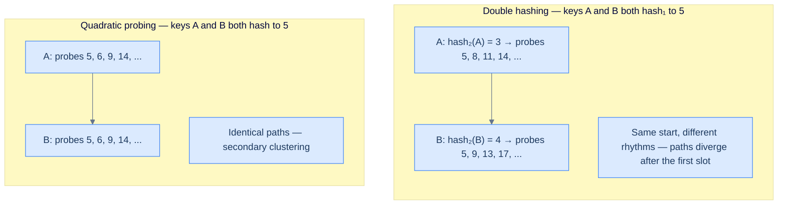
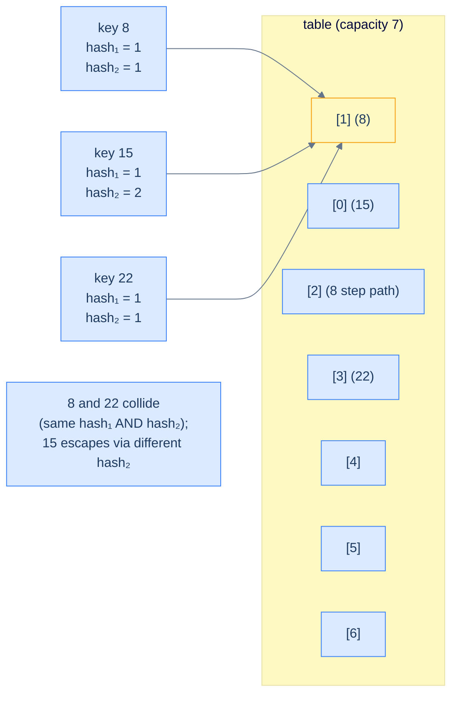
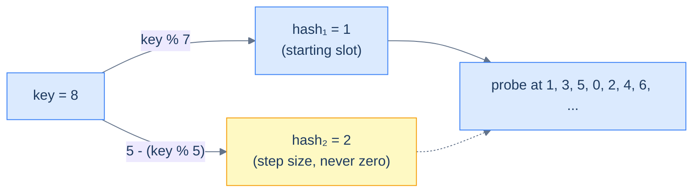
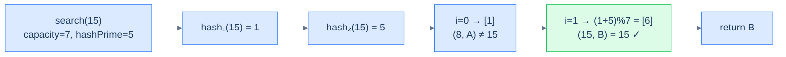
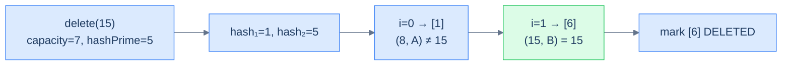

# 5. Double Hashing

## The Hook

Quadratic probing fixed primary clustering, but it left a hole the size of a bus: every key that hashes to the same starting slot follows the **exact same probe sequence**, forever. If `hash(A) = hash(B) = 5`, then A and B will collide at slot 5, then both probe slot 6, then both probe slot 9, then both probe slot 14 — they walk in lock-step until the heat-death of the universe. Two thousand keys mapping to the same starting slot? Two thousand keys all dancing the same choreographed dance through the array. That's **secondary clustering**, and it's quadratic probing's last frontier.

What if every key danced to *its own beat*? What if the step between probes wasn't `1`, `4`, `9`, `16` for everyone, but a *per-key* rhythm derived from the key itself? Two keys that happen to hash to the same starting slot would still scatter — because their step sizes would be different, even though their starting points coincide. That's **double hashing**: a *second* hash function computes the probe step.

The trick is breathtakingly simple: take the primary hash to find the starting slot, then take a **second** hash function applied to the same key to compute the step. Probe at `start, start+step, start+2·step, start+3·step, ...`. Two different keys hashing to the same start get two different steps, so they don't follow each other through the array. Secondary clustering — annihilated.

There's a sharp constraint that makes double hashing tricky: the second hash function must **never return zero** (a step of zero would re-probe the same slot forever) and ideally must produce step sizes that are coprime with the array's capacity (so the probe sequence visits every slot). Get that right, and you have what theory calls the closest practical approximation to *uniform hashing* — every key gets an effectively independent probe sequence. Get it wrong, and you get infinite loops. We'll see exactly how to choose the second hash function safely, and how the whole thing falls into place.

---

## Table of contents

1. [Introduction to double hashing](#introduction-to-double-hashing)
2. [Key components of double hashing](#key-components-of-double-hashing)
3. [Implementing the hash table class](#implementing-the-hash-table-class)
4. [Search operation in double hashing](#search-operation-in-double-hashing)
5. [Insert operation in double hashing](#insert-operation-in-double-hashing)
6. [Delete operation in double hashing](#delete-operation-in-double-hashing)
7. [Design a hash table with double hashing](#design-a-hash-table-with-double-hashing)

***

# Introduction to double hashing

We've now seen quadratic probing's secondary-clustering bug — keys that hash to the same starting slot follow identical probe paths because the step formula `a·i² + b·i` doesn't depend on the key. **Double hashing** is the cure: the step size itself is computed by a second hash function applied to the key.

Like quadratic probing, double hashing is an **open-addressing** scheme. The internal array stores key-value pairs directly. The size of the internal array bounds the table; the contiguous layout buys cache locality. None of that has changed.

```d2
grid-columns: 7
grid-gap: 0
h0: "[0]" {style.fill: "#fef9c3"; style.stroke: "#d97706"}
h1: "[1]" {style.fill: "#fef9c3"; style.stroke: "#d97706"}
h2: "[2]" {style.fill: "#fef9c3"; style.stroke: "#d97706"}
h3: "[3]" {style.fill: "#fef9c3"; style.stroke: "#d97706"}
h4: "[4]" {style.fill: "#fef9c3"; style.stroke: "#d97706"}
h5: "[5]" {style.fill: "#fef9c3"; style.stroke: "#d97706"}
h6: "[6]" {style.fill: "#fef9c3"; style.stroke: "#d97706"}
c0: "EMPTY"
c1: "(1, A)" {style.fill: "#dbeafe"; style.stroke: "#3b82f6"}
c2: "EMPTY"
c3: "(8, B)" {style.fill: "#dbeafe"; style.stroke: "#3b82f6"}
c4: "EMPTY"
c5: "(15, C)" {style.fill: "#dbeafe"; style.stroke: "#3b82f6"}
c6: "EMPTY"
```

<p align="center"><strong>Logical view of a double-hashing hash table — like the other open-addressing schemes, every slot directly stores a key-value pair. The difference shows up when you trace where colliding keys actually land.</strong></p>

We'll keep the array fixed-capacity for this lesson; production tables would resize when load gets high.

## Handling collisions

In quadratic probing, the i-th probe is at `start + a·i² + b·i`. The formula depends on `i` and the constants `a, b`, but **not on the key**. So two keys with the same starting slot follow identical paths.

In double hashing, the i-th probe is at `start + i · hash2(key)`. The formula now multiplies `i` by `hash2(key)` — and because `hash2` depends on the key, two different keys with the same starting slot get *different* step sizes. They start together; they immediately diverge.



<p align="center"><strong>How double hashing escapes secondary clustering — the second hash function gives every key a personal step size, so two keys sharing a starting slot still walk the array on different rhythms.</strong></p>

The first colliding key still lands at the hashed index. The second one steps by `hash2(key)`. The third by `2·hash2(key)`. And so on. Because `hash2` is a function of the key, each key gets its own probe sequence — different from every other key (with high probability, given a well-chosen `hash2`). This is the *uniform hashing* ideal in practical form.



<p align="center"><strong>Three keys colliding at hash₁ = 1 — keys 8 and 22 unlucky enough to <em>also</em> collide on hash₂ still follow the same path; key 15 with a different hash₂ takes its own. Double hashing scatters most colliding keys; only the unluckiest pairs (collisions on <em>both</em> hash functions) follow identical paths.</strong></p>

The probe sequence in double hashing wraps with `mod` like the others, and runs for at most `capacity` iterations.

> **Insert (sketch)**
>
> -   **Step 1:** Compute the primary hash for the key.
> -   **Step 2:** Compute the step size with the secondary hash function.
> -   **Step 3:** Probe at offsets `0, step, 2·step, 3·step, ...` until an unoccupied slot is found.
> -   **Step 4:** Place the (key, value) pair at that slot.
>
> **Search (sketch)**
>
> -   **Step 1:** Compute the primary hash.
> -   **Step 2:** Compute the step size with the secondary hash function.
> -   **Step 3:** Probe in step-sized increments until the key is found or an EMPTY slot is hit.
> -   **Step 4:** Return the value if the key is found.

The implementation is structurally identical to quadratic probing — same three-state record, same array, same operation flow. Only the offset formula changes from `a·i² + b·i` to `i · hash2(key)`.

***

# Key components of double hashing

A double-hashing hash table has the same three components as quadratic probing — three-state record, internal array, primary hash function — plus a **secondary hash function** for the step size. The secondary hash function is the only structural addition; everything else is unchanged.

## Record

Same three-state record as the other open-addressing schemes — `state ∈ {EMPTY, DELETED, OCCUPIED}` plus the `(key, value)` pair. The state machine is identical; the only thing that's different is which slots get visited during a probe.

```d2
rec: A single Record {
  s: |md
    **state**

    EMPTY / OCCUPIED / DELETED
  | {style.fill: "#fef9c3"; style.stroke: "#d97706"}
  k: key
  v: value
}
```

<p align="center"><strong>Double-hashing record — same shape and same state machine as the linear and quadratic probing records. Open-addressing schemes share their record type; only the probe walks differ.</strong></p>


```pseudocode
enum RecordType: EMPTY = 0, DELETED = 1, OCCUPIED = 2

class Record:
    state: RecordType
    key: integer
    value: integer
    # default: state = EMPTY
```

```python run
from enum import Enum

class RecordType(Enum):
    EMPTY = 0; DELETED = 1; OCCUPIED = 2

class Record:
    def __init__(self, key=None, value=None):
        if key is not None and value is not None:
            self.state, self.key, self.value = RecordType.OCCUPIED, key, value
        else:
            self.state, self.key, self.value = RecordType.EMPTY, 0, 0

# Demo
r = Record(7, 100)
print(r.state, r.key, r.value)
```

```java run
public class Main {
    enum RecordType { EMPTY, DELETED, OCCUPIED }
    static class Record {
        RecordType state = RecordType.EMPTY; int key, value;
        Record() {}
        Record(int k, int v) { state = RecordType.OCCUPIED; key = k; value = v; }
    }
    public static void main(String[] args) {
        Record r = new Record(7, 100);
        System.out.println(r.state + " " + r.key + " " + r.value);
    }
}
```

```c run
#include <stdio.h>

typedef enum { EMPTY = 0, DELETED = 1, OCCUPIED = 2 } RecordType;
typedef struct { RecordType state; int key, value; } Record;

int main() {
    Record r = { OCCUPIED, 7, 100 };
    printf("%d %d %d\n", r.state, r.key, r.value);
    return 0;
}
```

```scala run
object Main extends App {
  object RecordType extends Enumeration { val EMPTY, DELETED, OCCUPIED = Value }

  class Record(
    var state: RecordType.Value = RecordType.EMPTY,
    var key:   Int              = 0,
    var value: Int              = 0,
  ) { def this(k: Int, v: Int) = this(RecordType.OCCUPIED, k, v) }

  val r = new Record(7, 100); println(s"${r.state} ${r.key} ${r.value}")
}
```


## Internal array

Identical to the linear- and quadratic-probing internal arrays. Same contiguous layout, same all-EMPTY initial state.

## Hash functions — primary and secondary

Now the meaningful difference. A double-hashing table has **two** hash functions:

- **Primary**: `hash1(key) = key % capacity` — picks the starting probe slot.
- **Secondary**: `hash2(key) = hashPrime − (key % hashPrime)` — picks the **step size** for probing.

The secondary hash uses a small prime (`hashPrime`) less than `capacity` to control the range of step sizes. The form `hashPrime − (key % hashPrime)` has two essential properties:

1. **It never returns zero.** Because `key % hashPrime ∈ [0, hashPrime − 1]`, subtracting from `hashPrime` gives a result in `[1, hashPrime]`. Zero would mean "step of zero", which would loop on the same slot forever; the formula is engineered to forbid it.
2. **It varies with the key.** Different keys generally produce different residues mod `hashPrime`, so they get different steps. Two keys that collide on `hash1` will probably *not* collide on `hash2` — and that's what destroys secondary clustering.



<p align="center"><strong>How the two hash functions cooperate — hash₁ picks the starting slot; hash₂ picks the step. Together they define the probe sequence. With <code>capacity = 7</code> and <code>hashPrime = 5</code>, key 8 starts at slot 1 and steps by 2: visits <code>1, 3, 5, 0, 2, 4, 6</code> — every slot in the array.</strong></p>

> **Why must `capacity` be coprime with the step size?**
>
> If the step size shares a common factor with `capacity`, the probe sequence won't visit every slot — it'll cycle through a *fraction* of them. With `capacity = 8` and step `2`, the probe walks `0, 2, 4, 6, 0, 2, 4, 6, ...` and never reaches the odd slots. The fix is to choose `capacity` to be a **prime number** — then *every* possible step size in `[1, capacity − 1]` is automatically coprime with it, and the probe is guaranteed to visit every slot of the array. This is why double-hashing implementations are typically deployed with prime-sized tables.

***

# Implementing the hash table class

We now wrap everything into `MyHashTable`. The constructor takes `capacity` and `hashPrime`. The class adds `hashPrime` as a private field and a private `hashFunction2` method on top of the linear/quadratic-probing class.

```d2
cls: MyHashTable class {
  priv: private internals {
    cap: "capacity"
    hp: "hashPrime"
    tbl: "table: Record[]"
    hf1: |md
      **hash1(key)**

      (starting slot)
    |
    hf2: |md
      **hash2(key)**

      (step size)
    |
    po: "probeForOccupied(key)"
    pe: "probeForFree(key)"
  }
  pub: public API {
    s: "search(key)"
    i: "insert(key, value)"
    r: "remove(key)"
  }
  pub -> priv {style.stroke-dash: 3}
}
```

<p align="center"><strong>Class layout — adds <code>hashPrime</code> and <code>hash2</code> on top of the open-addressing template. Notice that <code>probeForOccupied</code> and <code>probeForFree</code> now both depend on the key (because the step is per-key), unlike linear/quadratic where they depended only on the start.</strong></p>

## Implementation


```pseudocode
class MyHashTable:
    capacity: integer
    hash_prime: integer
    table: array of Record(state=EMPTY)

    function _hash1(key): return key mod capacity
    function _hash2(key): return hash_prime − (key mod hash_prime)   # always ≥ 1
    function search(key): ...
    function insert(key, value): ...
    function remove(key): ...
```

```python run
from enum import Enum

class RecordType(Enum):
    EMPTY = 0; DELETED = 1; OCCUPIED = 2

class Record:
    def __init__(self, key=None, value=None):
        if key is not None and value is not None:
            self.state, self.key, self.value = RecordType.OCCUPIED, key, value
        else:
            self.state, self.key, self.value = RecordType.EMPTY, 0, 0

class MyHashTable:
    def __init__(self, capacity, hash_prime):
        self.capacity, self.hash_prime = capacity, hash_prime
        self.table = [Record() for _ in range(capacity)]

    def _hash1(self, key): return key % self.capacity
    def _hash2(self, key):
        # hashPrime - (key % hashPrime) is in [1, hashPrime] — guaranteed non-zero
        return self.hash_prime - (key % self.hash_prime)

    def search(self, key):  pass
    def insert(self, key, value): pass
    def remove(self, key):  pass

print("table created with capacity 7, hashPrime 5")
h = MyHashTable(7, 5)
```

```java run
import java.util.*;

public class Main {
    enum RecordType { EMPTY, DELETED, OCCUPIED }
    static class Record {
        RecordType state = RecordType.EMPTY; int key, value;
        Record() {}
        Record(int k, int v) { state = RecordType.OCCUPIED; key = k; value = v; }
    }
    static class MyHashTable {
        protected final int          capacity, hashPrime;
        protected final List<Record> table;
        MyHashTable(int capacity, int hashPrime) {
            this.capacity = capacity; this.hashPrime = hashPrime;
            this.table = new ArrayList<>(capacity);
            for (int i = 0; i < capacity; i++) table.add(new Record());
        }
        protected int hash1(int key) { return Math.floorMod(key, capacity); }
        // hashPrime - (key % hashPrime) ∈ [1, hashPrime] — never zero
        protected int hash2(int key) { return hashPrime - Math.floorMod(key, hashPrime); }

        int     search(int key)            { return -1;    }
        boolean insert(int key, int value) { return false; }
        void    remove(int key)            {                }
    }

    public static void main(String[] args) {
        MyHashTable h = new MyHashTable(7, 5);
        System.out.println("table created with capacity 7, hashPrime 5");
    }
}
```

```c run
#include <stdio.h>
#include <stdlib.h>

typedef enum { EMPTY = 0, DELETED = 1, OCCUPIED = 2 } RecordType;
typedef struct { RecordType state; int key, value; } Record;
typedef struct { int capacity, hash_prime; Record *table; } MyHashTable;

MyHashTable* createTable(int capacity, int hash_prime) {
    MyHashTable *h = malloc(sizeof(MyHashTable));
    h->capacity   = capacity;
    h->hash_prime = hash_prime;
    h->table      = calloc(capacity, sizeof(Record));
    return h;
}
int hash1(MyHashTable *h, int key) { return key % h->capacity; }
// hash_prime - (key % hash_prime) ∈ [1, hash_prime] — never zero
int hash2(MyHashTable *h, int key) { return h->hash_prime - (key % h->hash_prime); }

int  search_op(MyHashTable *h, int key)              { return -1; }
int  insert_op(MyHashTable *h, int key, int value)   { return 0;  }
void remove_op(MyHashTable *h, int key)              {            }

int main() {
    MyHashTable *h = createTable(7, 5);
    printf("table created with capacity %d, hashPrime %d\n",
           h->capacity, h->hash_prime);
    free(h->table); free(h); return 0;
}
```

```scala run
object Main extends App {
  object RecordType extends Enumeration { val EMPTY, DELETED, OCCUPIED = Value }

  class Record(
    var state: RecordType.Value = RecordType.EMPTY,
    var key:   Int              = 0,
    var value: Int              = 0,
  ) { def this(k: Int, v: Int) = this(RecordType.OCCUPIED, k, v) }

  class MyHashTable(val capacity: Int, val hashPrime: Int) {
    protected val table: Array[Record] = Array.fill(capacity)(new Record())
    protected def hash1(key: Int): Int = Math.floorMod(key, capacity)
    // hashPrime - (key % hashPrime) ∈ [1, hashPrime] — never zero
    protected def hash2(key: Int): Int = hashPrime - Math.floorMod(key, hashPrime)

    def search(key: Int):              Int     = -1
    def insert(key: Int, value: Int):  Boolean = false
    def remove(key: Int):              Unit    = ()
  }

  val h = new MyHashTable(7, 5)
  println("table created with capacity 7, hashPrime 5")
}
```


> *Predict before reading on — for capacity 8 and hashPrime 5, what step sizes can <code>hash2(key) = 5 - (key % 5)</code> ever return? And does every key in the domain always reach every slot of an 8-slot array? Try it.*
>
> hash₂ returns values in `{1, 2, 3, 4, 5}`. With capacity 8 and step 2 or 4, the probe walks only even slots — half the array becomes unreachable for keys with those steps. With step 1, 3, or 5, every slot is reachable. The lesson: capacity-and-hashPrime must be coprime with all *possible* step sizes — and the simplest way to guarantee that is to make capacity prime.

***

# Search operation in double hashing

Search probes in step-sized increments until it finds the key (return value), hits an EMPTY slot (return `-1`), or completes a full traversal (return `-1`). The shape is identical to linear and quadratic probing; only the offset formula differs.

## Algorithm

### 1. Key is present

Probe finds an `OCCUPIED` slot whose key matches. Return the value.



<p align="center"><strong>Successful search — the per-key step size makes the probe sequence diverge from any other key's path. Two keys colliding at slot 1 take entirely different rhythms after the first comparison.</strong></p>

### 2. EMPTY hit

Hitting `EMPTY` proves the key wasn't inserted along this probe chain. Stop, return `-1`.

### 3. Full traversal

After `capacity` probes, give up. Return `-1`.

## Implementation


```pseudocode
function _probe_for_occupied(key, start):
    step ← _hash2(key)
    for i from 0 to capacity − 1:
        idx ← (start + i · step) mod capacity
        if table[idx].state = EMPTY: return -1
        if table[idx].state = OCCUPIED AND table[idx].key = key: return idx
    return -1

function search(key):
    idx ← _probe_for_occupied(key, _hash1(key))
    if idx = -1: return -1 else: return table[idx].value
```

```python run
from enum import Enum

class RecordType(Enum):
    EMPTY = 0; DELETED = 1; OCCUPIED = 2

class Record:
    def __init__(self, key=None, value=None):
        if key is not None and value is not None:
            self.state, self.key, self.value = RecordType.OCCUPIED, key, value
        else:
            self.state, self.key, self.value = RecordType.EMPTY, 0, 0

class MyHashTable:
    def __init__(self, capacity, hash_prime):
        self.capacity, self.hash_prime = capacity, hash_prime
        self.table = [Record() for _ in range(capacity)]
    def _hash1(self, key): return key % self.capacity
    def _hash2(self, key): return self.hash_prime - (key % self.hash_prime)

    def _probe_for_occupied(self, key, start):
        step = self._hash2(key)
        for i in range(self.capacity):
            idx = (start + i * step) % self.capacity
            slot = self.table[idx]
            if slot.state == RecordType.EMPTY:                                return -1
            if slot.state == RecordType.OCCUPIED and slot.key == key:         return idx
        return -1

    def search(self, key):
        idx = self._probe_for_occupied(key, self._hash1(key))
        return -1 if idx == -1 else self.table[idx].value

# Demo
h = MyHashTable(7, 5)
print(h.search(15))   # -1
```

```java run
import java.util.*;

public class Main {
    enum RecordType { EMPTY, DELETED, OCCUPIED }
    static class Record {
        RecordType state = RecordType.EMPTY; int key, value;
        Record() {}
        Record(int k, int v) { state = RecordType.OCCUPIED; key = k; value = v; }
    }
    static class MyHashTable {
        protected final int          capacity, hashPrime;
        protected final List<Record> table;
        MyHashTable(int capacity, int hashPrime) {
            this.capacity = capacity; this.hashPrime = hashPrime;
            this.table = new ArrayList<>(capacity);
            for (int i = 0; i < capacity; i++) table.add(new Record());
        }
        protected int hash1(int key) { return Math.floorMod(key, capacity); }
        protected int hash2(int key) { return hashPrime - Math.floorMod(key, hashPrime); }

        protected int probeForOccupied(int key, int start) {
            int step = hash2(key);
            for (int i = 0; i < capacity; i++) {
                int idx = Math.floorMod(start + i * step, capacity);
                Record s = table.get(idx);
                if (s.state == RecordType.EMPTY) return -1;
                if (s.state == RecordType.OCCUPIED && s.key == key) return idx;
            }
            return -1;
        }

        int search(int key) {
            int idx = probeForOccupied(key, hash1(key));
            return idx == -1 ? -1 : table.get(idx).value;
        }
    }

    public static void main(String[] args) {
        MyHashTable h = new MyHashTable(7, 5);
        System.out.println(h.search(15));   // -1
    }
}
```

```c run
#include <stdio.h>
#include <stdlib.h>

typedef enum { EMPTY = 0, DELETED = 1, OCCUPIED = 2 } RecordType;
typedef struct { RecordType state; int key, value; } Record;
typedef struct { int capacity, hash_prime; Record *table; } MyHashTable;

int hash1(MyHashTable *h, int key) { return key % h->capacity; }
int hash2(MyHashTable *h, int key) { return h->hash_prime - (key % h->hash_prime); }

int probe_for_occupied(MyHashTable *h, int key, int start) {
    int step = hash2(h, key);
    for (int i = 0; i < h->capacity; i++) {
        int idx = (start + i * step) % h->capacity;
        if (h->table[idx].state == EMPTY) return -1;
        if (h->table[idx].state == OCCUPIED && h->table[idx].key == key) return idx;
    }
    return -1;
}
int search_op(MyHashTable *h, int key) {
    int idx = probe_for_occupied(h, key, hash1(h, key));
    return idx == -1 ? -1 : h->table[idx].value;
}

int main() {
    MyHashTable h = { .capacity = 7, .hash_prime = 5,
                      .table = calloc(7, sizeof(Record)) };
    printf("%d\n", search_op(&h, 15));   // -1
    free(h.table); return 0;
}
```

```scala run
object Main extends App {
  object RecordType extends Enumeration { val EMPTY, DELETED, OCCUPIED = Value }

  class Record(
    var state: RecordType.Value = RecordType.EMPTY,
    var key:   Int              = 0,
    var value: Int              = 0,
  ) { def this(k: Int, v: Int) = this(RecordType.OCCUPIED, k, v) }

  class MyHashTable(val capacity: Int, val hashPrime: Int) {
    protected val table: Array[Record] = Array.fill(capacity)(new Record())
    protected def hash1(key: Int): Int = Math.floorMod(key, capacity)
    protected def hash2(key: Int): Int = hashPrime - Math.floorMod(key, hashPrime)

    protected def probeForOccupied(key: Int, start: Int): Int = {
      val step = hash2(key)
      var i = 0
      while (i < capacity) {
        val idx = Math.floorMod(start + i * step, capacity)
        val s   = table(idx)
        if (s.state == RecordType.EMPTY) return -1
        if (s.state == RecordType.OCCUPIED && s.key == key) return idx
        i += 1
      }; -1
    }

    def search(key: Int): Int = {
      val idx = probeForOccupied(key, hash1(key))
      if (idx == -1) -1 else table(idx).value
    }
  }

  val h = new MyHashTable(7, 5)
  println(h.search(15))   // -1
}
```


## Complexity analysis

> **Best case** — first probe matches
>
> -   Time: **O(1)** | Space: **O(1)**
>
> **Average case** — well-distributed hashes (with a good hash₂ in particular)
>
> -   Time: **O(1)** | Space: **O(1)**
>
> **Worst case** — heavy collision with table near capacity
>
> -   Time: **O(N)** | Space: **O(1)**

***

# Insert operation in double hashing

Insert mirrors the structure of insert in linear and quadratic probing — first probe to confirm the key isn't already there, then probe again to find the first non-OCCUPIED slot. The only thing that changes is that the offset is now `i · hash2(key)`.

## Algorithm

### 1. Key already exists

Probe finds the matching `OCCUPIED` slot — overwrite the value.

### 2. Free slot found

Probe finds a non-OCCUPIED slot — drop the new record there.

### 3. Probe sequence exhausted

After `capacity` probes without finding a free slot, return `false`. (With a good hash₂ and a prime capacity, this only happens when the table is genuinely full.)


<p align="center"><strong>Insert with a new key — the second hash gives 15 a step of 5, so it lands at slot 6 instead of slot 2 (which is what linear or quadratic probing would have used). Two keys colliding at slot 1 with different hash₂ values now spread to opposite ends of the array.</strong></p>

## Implementation


```pseudocode
function _probe_for_free(key, start):
    step ← _hash2(key)
    for i from 0 to capacity − 1:
        idx ← (start + i · step) mod capacity
        if table[idx].state ≠ OCCUPIED: return idx
    return -1

function insert(key, value):
    start ← _hash1(key)
    occ ← _probe_for_occupied(key, start)
    if occ ≠ -1: table[occ].value ← value; return true
    free ← _probe_for_free(key, start)
    if free = -1: return false
    table[free] ← Record(key, value, OCCUPIED); return true
```

```python run
from enum import Enum

class RecordType(Enum):
    EMPTY = 0; DELETED = 1; OCCUPIED = 2

class Record:
    def __init__(self, key=None, value=None):
        if key is not None and value is not None:
            self.state, self.key, self.value = RecordType.OCCUPIED, key, value
        else:
            self.state, self.key, self.value = RecordType.EMPTY, 0, 0

class MyHashTable:
    def __init__(self, capacity, hash_prime):
        self.capacity, self.hash_prime = capacity, hash_prime
        self.table = [Record() for _ in range(capacity)]
    def _hash1(self, key): return key % self.capacity
    def _hash2(self, key): return self.hash_prime - (key % self.hash_prime)

    def _probe_for_occupied(self, key, start):
        step = self._hash2(key)
        for i in range(self.capacity):
            idx = (start + i * step) % self.capacity
            if self.table[idx].state == RecordType.EMPTY: return -1
            if self.table[idx].state == RecordType.OCCUPIED and self.table[idx].key == key: return idx
        return -1
    def _probe_for_free(self, key, start):
        step = self._hash2(key)
        for i in range(self.capacity):
            idx = (start + i * step) % self.capacity
            if self.table[idx].state != RecordType.OCCUPIED: return idx
        return -1

    def search(self, key):
        idx = self._probe_for_occupied(key, self._hash1(key))
        return -1 if idx == -1 else self.table[idx].value

    def insert(self, key, value):
        start = self._hash1(key)
        occ = self._probe_for_occupied(key, start)
        if occ != -1: self.table[occ].value = value; return True
        free = self._probe_for_free(key, start)
        if free == -1: return False
        self.table[free] = Record(key, value); return True

# Demo
h = MyHashTable(7, 5)
h.insert(8, 80); h.insert(15, 150); h.insert(22, 220)
print(h.search(8), h.search(15), h.search(22))
```

```java run
import java.util.*;

public class Main {
    enum RecordType { EMPTY, DELETED, OCCUPIED }
    static class Record {
        RecordType state = RecordType.EMPTY; int key, value;
        Record() {}
        Record(int k, int v) { state = RecordType.OCCUPIED; key = k; value = v; }
    }
    static class MyHashTable {
        protected final int          capacity, hashPrime;
        protected final List<Record> table;
        MyHashTable(int capacity, int hashPrime) {
            this.capacity = capacity; this.hashPrime = hashPrime;
            this.table = new ArrayList<>(capacity);
            for (int i = 0; i < capacity; i++) table.add(new Record());
        }
        protected int hash1(int key) { return Math.floorMod(key, capacity); }
        protected int hash2(int key) { return hashPrime - Math.floorMod(key, hashPrime); }

        protected int probeForOccupied(int key, int start) {
            int step = hash2(key);
            for (int i = 0; i < capacity; i++) {
                int idx = Math.floorMod(start + i * step, capacity);
                Record s = table.get(idx);
                if (s.state == RecordType.EMPTY) return -1;
                if (s.state == RecordType.OCCUPIED && s.key == key) return idx;
            }
            return -1;
        }
        protected int probeForFree(int key, int start) {
            int step = hash2(key);
            for (int i = 0; i < capacity; i++) {
                int idx = Math.floorMod(start + i * step, capacity);
                if (table.get(idx).state != RecordType.OCCUPIED) return idx;
            }
            return -1;
        }

        int search(int key) {
            int idx = probeForOccupied(key, hash1(key));
            return idx == -1 ? -1 : table.get(idx).value;
        }
        boolean insert(int key, int value) {
            int start = hash1(key); int occ = probeForOccupied(key, start);
            if (occ != -1) { table.get(occ).value = value; return true; }
            int free = probeForFree(key, start); if (free == -1) return false;
            table.set(free, new Record(key, value)); return true;
        }
    }

    public static void main(String[] args) {
        MyHashTable h = new MyHashTable(7, 5);
        h.insert(8, 80); h.insert(15, 150); h.insert(22, 220);
        System.out.println(h.search(8) + " " + h.search(15) + " " + h.search(22));
    }
}
```

```c run
#include <stdio.h>
#include <stdlib.h>

typedef enum { EMPTY = 0, DELETED = 1, OCCUPIED = 2 } RecordType;
typedef struct { RecordType state; int key, value; } Record;
typedef struct { int capacity, hash_prime; Record *table; } MyHashTable;

int hash1(MyHashTable *h, int key) { return key % h->capacity; }
int hash2(MyHashTable *h, int key) { return h->hash_prime - (key % h->hash_prime); }

int probe_for_occupied(MyHashTable *h, int key, int start) {
    int step = hash2(h, key);
    for (int i = 0; i < h->capacity; i++) {
        int idx = (start + i * step) % h->capacity;
        if (h->table[idx].state == EMPTY) return -1;
        if (h->table[idx].state == OCCUPIED && h->table[idx].key == key) return idx;
    }
    return -1;
}
int probe_for_free(MyHashTable *h, int key, int start) {
    int step = hash2(h, key);
    for (int i = 0; i < h->capacity; i++) {
        int idx = (start + i * step) % h->capacity;
        if (h->table[idx].state != OCCUPIED) return idx;
    }
    return -1;
}

int search_op(MyHashTable *h, int key) {
    int idx = probe_for_occupied(h, key, hash1(h, key));
    return idx == -1 ? -1 : h->table[idx].value;
}
int insert_op(MyHashTable *h, int key, int value) {
    int start = hash1(h, key); int occ = probe_for_occupied(h, key, start);
    if (occ != -1) { h->table[occ].value = value; return 1; }
    int free = probe_for_free(h, key, start); if (free == -1) return 0;
    h->table[free] = (Record){OCCUPIED, key, value}; return 1;
}

int main() {
    MyHashTable h = { .capacity = 7, .hash_prime = 5,
                      .table = calloc(7, sizeof(Record)) };
    insert_op(&h, 8, 80); insert_op(&h, 15, 150); insert_op(&h, 22, 220);
    printf("%d %d %d\n", search_op(&h, 8), search_op(&h, 15), search_op(&h, 22));
    free(h.table); return 0;
}
```

```scala run
object Main extends App {
  object RecordType extends Enumeration { val EMPTY, DELETED, OCCUPIED = Value }

  class Record(
    var state: RecordType.Value = RecordType.EMPTY,
    var key:   Int              = 0,
    var value: Int              = 0,
  ) { def this(k: Int, v: Int) = this(RecordType.OCCUPIED, k, v) }

  class MyHashTable(val capacity: Int, val hashPrime: Int) {
    protected val table: Array[Record] = Array.fill(capacity)(new Record())
    protected def hash1(key: Int): Int = Math.floorMod(key, capacity)
    protected def hash2(key: Int): Int = hashPrime - Math.floorMod(key, hashPrime)

    protected def probeForOccupied(key: Int, start: Int): Int = {
      val step = hash2(key); var i = 0
      while (i < capacity) {
        val idx = Math.floorMod(start + i * step, capacity)
        val s   = table(idx)
        if (s.state == RecordType.EMPTY) return -1
        if (s.state == RecordType.OCCUPIED && s.key == key) return idx
        i += 1
      }; -1
    }
    protected def probeForFree(key: Int, start: Int): Int = {
      val step = hash2(key); var i = 0
      while (i < capacity) {
        val idx = Math.floorMod(start + i * step, capacity)
        if (table(idx).state != RecordType.OCCUPIED) return idx
        i += 1
      }; -1
    }

    def search(key: Int): Int = {
      val idx = probeForOccupied(key, hash1(key))
      if (idx == -1) -1 else table(idx).value
    }
    def insert(key: Int, value: Int): Boolean = {
      val start = hash1(key); val occ = probeForOccupied(key, start)
      if (occ != -1) { table(occ).value = value; return true }
      val free = probeForFree(key, start); if (free == -1) return false
      table(free) = new Record(key, value); true
    }
  }

  val h = new MyHashTable(7, 5)
  h.insert(8, 80); h.insert(15, 150); h.insert(22, 220)
  println(s"${h.search(8)} ${h.search(15)} ${h.search(22)}")
}
```


## Complexity analysis

> **Best case** — first probe lands on a writable slot
>
> -   Time: **O(1)** | Space: **O(1)**
>
> **Average case** — well-chosen hash₂, low load factor
>
> -   Time: **O(1)** | Space: **O(1)**
>
> **Worst case** — table near full, long probe sequence
>
> -   Time: **O(N)** | Space: **O(1)**

***

# Delete operation in double hashing

Delete works exactly as in linear and quadratic probing — find the matching slot via the probe, then mark it `DELETED`. The tombstone is just as essential here. Removing it would orphan any record placed past this slot during inserts that crossed this point.

## Algorithm

### 1. Key is present

Probe finds the matching `OCCUPIED` slot — flip it to `DELETED`.

### 2. Key is not present (EMPTY hit)

No-op.

### 3. Probe sequence exhausted

No-op.



<p align="center"><strong>Double-hashing delete — same as the other open-addressing schemes, but with a per-key step. The DELETED tombstone keeps probe paths walkable for any record placed past this slot.</strong></p>

## Implementation


```pseudocode
function remove(key):
    idx ← _probe_for_occupied(key, _hash1(key))
    if idx ≠ -1: table[idx].state ← DELETED
```

```python run
from enum import Enum

class RecordType(Enum):
    EMPTY = 0; DELETED = 1; OCCUPIED = 2

class Record:
    def __init__(self, key=None, value=None):
        if key is not None and value is not None:
            self.state, self.key, self.value = RecordType.OCCUPIED, key, value
        else:
            self.state, self.key, self.value = RecordType.EMPTY, 0, 0

class MyHashTable:
    def __init__(self, capacity, hash_prime):
        self.capacity, self.hash_prime = capacity, hash_prime
        self.table = [Record() for _ in range(capacity)]
    def _hash1(self, key): return key % self.capacity
    def _hash2(self, key): return self.hash_prime - (key % self.hash_prime)

    def _probe_for_occupied(self, key, start):
        step = self._hash2(key)
        for i in range(self.capacity):
            idx = (start + i * step) % self.capacity
            if self.table[idx].state == RecordType.EMPTY: return -1
            if self.table[idx].state == RecordType.OCCUPIED and self.table[idx].key == key: return idx
        return -1
    def _probe_for_free(self, key, start):
        step = self._hash2(key)
        for i in range(self.capacity):
            idx = (start + i * step) % self.capacity
            if self.table[idx].state != RecordType.OCCUPIED: return idx
        return -1

    def search(self, key):
        idx = self._probe_for_occupied(key, self._hash1(key))
        return -1 if idx == -1 else self.table[idx].value
    def insert(self, key, value):
        start = self._hash1(key); occ = self._probe_for_occupied(key, start)
        if occ != -1: self.table[occ].value = value; return True
        free = self._probe_for_free(key, start); 
        if free == -1: return False
        self.table[free] = Record(key, value); return True
    def remove(self, key):
        idx = self._probe_for_occupied(key, self._hash1(key))
        if idx != -1: self.table[idx].state = RecordType.DELETED

# Demo
h = MyHashTable(7, 5)
h.insert(8, 80); h.insert(15, 150); h.insert(22, 220)
h.remove(15)
print(h.search(15), h.search(8), h.search(22))    # -1 80 220
```

```java run
import java.util.*;

public class Main {
    enum RecordType { EMPTY, DELETED, OCCUPIED }
    static class Record {
        RecordType state = RecordType.EMPTY; int key, value;
        Record() {}
        Record(int k, int v) { state = RecordType.OCCUPIED; key = k; value = v; }
    }
    static class MyHashTable {
        protected final int          capacity, hashPrime;
        protected final List<Record> table;
        MyHashTable(int capacity, int hashPrime) {
            this.capacity = capacity; this.hashPrime = hashPrime;
            this.table = new ArrayList<>(capacity);
            for (int i = 0; i < capacity; i++) table.add(new Record());
        }
        protected int hash1(int key) { return Math.floorMod(key, capacity); }
        protected int hash2(int key) { return hashPrime - Math.floorMod(key, hashPrime); }

        protected int probeForOccupied(int key, int start) {
            int step = hash2(key);
            for (int i = 0; i < capacity; i++) {
                int idx = Math.floorMod(start + i * step, capacity);
                Record s = table.get(idx);
                if (s.state == RecordType.EMPTY) return -1;
                if (s.state == RecordType.OCCUPIED && s.key == key) return idx;
            }
            return -1;
        }
        protected int probeForFree(int key, int start) {
            int step = hash2(key);
            for (int i = 0; i < capacity; i++) {
                int idx = Math.floorMod(start + i * step, capacity);
                if (table.get(idx).state != RecordType.OCCUPIED) return idx;
            }
            return -1;
        }

        int search(int key) {
            int idx = probeForOccupied(key, hash1(key));
            return idx == -1 ? -1 : table.get(idx).value;
        }
        boolean insert(int key, int value) {
            int start = hash1(key); int occ = probeForOccupied(key, start);
            if (occ != -1) { table.get(occ).value = value; return true; }
            int free = probeForFree(key, start); if (free == -1) return false;
            table.set(free, new Record(key, value)); return true;
        }
        void remove(int key) {
            int idx = probeForOccupied(key, hash1(key));
            if (idx != -1) table.get(idx).state = RecordType.DELETED;
        }
    }

    public static void main(String[] args) {
        MyHashTable h = new MyHashTable(7, 5);
        h.insert(8, 80); h.insert(15, 150); h.insert(22, 220);
        h.remove(15);
        System.out.println(h.search(15) + " " + h.search(8) + " " + h.search(22));
    }
}
```

```c run
#include <stdio.h>
#include <stdlib.h>

typedef enum { EMPTY = 0, DELETED = 1, OCCUPIED = 2 } RecordType;
typedef struct { RecordType state; int key, value; } Record;
typedef struct { int capacity, hash_prime; Record *table; } MyHashTable;

int hash1(MyHashTable *h, int key) { return key % h->capacity; }
int hash2(MyHashTable *h, int key) { return h->hash_prime - (key % h->hash_prime); }

int probe_for_occupied(MyHashTable *h, int key, int start) {
    int step = hash2(h, key);
    for (int i = 0; i < h->capacity; i++) {
        int idx = (start + i * step) % h->capacity;
        if (h->table[idx].state == EMPTY) return -1;
        if (h->table[idx].state == OCCUPIED && h->table[idx].key == key) return idx;
    }
    return -1;
}
int probe_for_free(MyHashTable *h, int key, int start) {
    int step = hash2(h, key);
    for (int i = 0; i < h->capacity; i++) {
        int idx = (start + i * step) % h->capacity;
        if (h->table[idx].state != OCCUPIED) return idx;
    }
    return -1;
}
int  search_op(MyHashTable *h, int key) {
    int idx = probe_for_occupied(h, key, hash1(h, key));
    return idx == -1 ? -1 : h->table[idx].value;
}
int  insert_op(MyHashTable *h, int key, int value) {
    int start = hash1(h, key); int occ = probe_for_occupied(h, key, start);
    if (occ != -1) { h->table[occ].value = value; return 1; }
    int free = probe_for_free(h, key, start); if (free == -1) return 0;
    h->table[free] = (Record){OCCUPIED, key, value}; return 1;
}
void remove_op(MyHashTable *h, int key) {
    int idx = probe_for_occupied(h, key, hash1(h, key));
    if (idx != -1) h->table[idx].state = DELETED;
}

int main() {
    MyHashTable h = { .capacity = 7, .hash_prime = 5,
                      .table = calloc(7, sizeof(Record)) };
    insert_op(&h, 8, 80); insert_op(&h, 15, 150); insert_op(&h, 22, 220);
    remove_op(&h, 15);
    printf("%d %d %d\n", search_op(&h, 15), search_op(&h, 8), search_op(&h, 22));
    free(h.table); return 0;
}
```

```scala run
object Main extends App {
  object RecordType extends Enumeration { val EMPTY, DELETED, OCCUPIED = Value }

  class Record(
    var state: RecordType.Value = RecordType.EMPTY,
    var key:   Int              = 0,
    var value: Int              = 0,
  ) { def this(k: Int, v: Int) = this(RecordType.OCCUPIED, k, v) }

  class MyHashTable(val capacity: Int, val hashPrime: Int) {
    protected val table: Array[Record] = Array.fill(capacity)(new Record())
    protected def hash1(key: Int): Int = Math.floorMod(key, capacity)
    protected def hash2(key: Int): Int = hashPrime - Math.floorMod(key, hashPrime)

    protected def probeForOccupied(key: Int, start: Int): Int = {
      val step = hash2(key); var i = 0
      while (i < capacity) {
        val idx = Math.floorMod(start + i * step, capacity)
        val s = table(idx)
        if (s.state == RecordType.EMPTY) return -1
        if (s.state == RecordType.OCCUPIED && s.key == key) return idx
        i += 1
      }; -1
    }
    protected def probeForFree(key: Int, start: Int): Int = {
      val step = hash2(key); var i = 0
      while (i < capacity) {
        val idx = Math.floorMod(start + i * step, capacity)
        if (table(idx).state != RecordType.OCCUPIED) return idx
        i += 1
      }; -1
    }

    def search(key: Int): Int = {
      val idx = probeForOccupied(key, hash1(key))
      if (idx == -1) -1 else table(idx).value
    }
    def insert(key: Int, value: Int): Boolean = {
      val start = hash1(key); val occ = probeForOccupied(key, start)
      if (occ != -1) { table(occ).value = value; return true }
      val free = probeForFree(key, start); if (free == -1) return false
      table(free) = new Record(key, value); true
    }
    def remove(key: Int): Unit = {
      val idx = probeForOccupied(key, hash1(key))
      if (idx != -1) table(idx).state = RecordType.DELETED
    }
  }

  val h = new MyHashTable(7, 5)
  h.insert(8, 80); h.insert(15, 150); h.insert(22, 220)
  h.remove(15)
  println(s"${h.search(15)} ${h.search(8)} ${h.search(22)}")
}
```


## Complexity analysis

> **Best case** — first probe matches
>
> -   Time: **O(1)** | Space: **O(1)**
>
> **Average case** — well-distributed hashes
>
> -   Time: **O(1)** | Space: **O(1)**
>
> **Worst case** — collision-heavy
>
> -   Time: **O(N)** | Space: **O(1)**

***

# Design a hash table with double hashing

## Problem Statement

Given the skeleton of a `MyHashTable` class, complete it by implementing:

> -   **MyHashTable(int capacity, int hashPrime)** — Initialise with the given capacity, and store the prime used in the second hash function.
> -   **search(int key)** — Return the value, or `-1`.
> -   **insert(int key, int value)** — Insert or update; return `true` on success, `false` if the table is full.
> -   **remove(int key)** — Remove the mapping (no-op if absent).
> -   **getKeyAtIndex(int index)** — Return the key at `table[index]`, or `-1` if not `OCCUPIED`.

```d2
cons: Constraints {
  c1: "No built-in hash table libraries"
  c2: "Double hashing for collisions"
  c3: "hash1(key) = key % capacity"
  c4: "hash2(key) = hashPrime - (key % hashPrime)"
}
```

<p align="center"><strong>Constraints — primary hash is the standard division method; secondary hash is the classic non-zero double-hashing form. <code>hashPrime</code> is supplied as input so the same code can be tested with different secondary-hash configurations.</strong></p>

> **Example:**
>
> -   **Input:** `[MyHashTable, insert, insert, search, insert, search, insert, search, search, getKeyAtIndex]`, `[[3, 2], [1, 2], [2, 4], [1], [1, 3], [1], [2, 5], [2], [3], [0]]`
>
> -   **Output:** `[null, true, true, 2, true, 3, true, 5, -1, -1]`
>
> **Explanation:**
>
> | Operation | Effect | Result |
> |---|---|---|
> | `MyHashTable(3, 2)` | empty table, capacity 3, hashPrime 2 | `null` |
> | `insert(1, 2)` | 1 % 3 = 1 → `[EMPTY, (1, 2), EMPTY]` | `true` |
> | `insert(2, 4)` | 2 % 3 = 2 → `[EMPTY, (1, 2), (2, 4)]` | `true` |
> | `search(1)` | found at index 1 | `2` |
> | `insert(1, 3)` | update existing | `true` |
> | `search(1)` | | `3` |
> | `insert(2, 5)` | update existing | `true` |
> | `search(2)` | | `5` |
> | `search(3)` | 3 % 3 = 0; index 0 is EMPTY → not found | `-1` |
> | `getKeyAtIndex(0)` | slot 0 is EMPTY | `-1` |

## Solution

The full 10-language implementation. `getKeyAtIndex` is the same one-liner we used in the linear- and quadratic-probing solutions.


```pseudocode
class MyHashTable:
    function _hash1(key): return key mod capacity
    function _hash2(key): return hash_prime − (key mod hash_prime)

    function search(key):
        idx ← _probe_for_occupied(key, _hash1(key))
        if idx = -1: return -1 else: return table[idx].value

    function insert(key, value):
        occ ← _probe_for_occupied(key, _hash1(key))
        if occ ≠ -1: table[occ].value ← value; return true
        free ← _probe_for_free(key, _hash1(key))
        if free = -1: return false
        table[free] ← Record(key, value, OCCUPIED); return true

    function remove(key):
        idx ← _probe_for_occupied(key, _hash1(key))
        if idx ≠ -1: table[idx].state ← DELETED

    function getKeyAtIndex(index):
        if table[index].state = OCCUPIED: return table[index].key
        return -1
```

```python run
from enum import Enum

class RecordType(Enum):
    EMPTY = 0; DELETED = 1; OCCUPIED = 2

class Record:
    def __init__(self, key=None, value=None):
        if key is not None and value is not None:
            self.state, self.key, self.value = RecordType.OCCUPIED, key, value
        else:
            self.state, self.key, self.value = RecordType.EMPTY, 0, 0

class MyHashTable:
    def __init__(self, capacity, hash_prime):
        self.capacity, self.hash_prime = capacity, hash_prime
        self.table = [Record() for _ in range(capacity)]
    def _hash1(self, key): return key % self.capacity
    def _hash2(self, key): return self.hash_prime - (key % self.hash_prime)

    def _probe_for_occupied(self, key, start):
        step = self._hash2(key)
        for i in range(self.capacity):
            idx = (start + i * step) % self.capacity
            if self.table[idx].state == RecordType.EMPTY: return -1
            if self.table[idx].state == RecordType.OCCUPIED and self.table[idx].key == key: return idx
        return -1
    def _probe_for_free(self, key, start):
        step = self._hash2(key)
        for i in range(self.capacity):
            idx = (start + i * step) % self.capacity
            if self.table[idx].state != RecordType.OCCUPIED: return idx
        return -1

    def search(self, key):
        idx = self._probe_for_occupied(key, self._hash1(key))
        return -1 if idx == -1 else self.table[idx].value
    def insert(self, key, value):
        start = self._hash1(key); occ = self._probe_for_occupied(key, start)
        if occ != -1: self.table[occ].value = value; return True
        free = self._probe_for_free(key, start); 
        if free == -1: return False
        self.table[free] = Record(key, value); return True
    def remove(self, key):
        idx = self._probe_for_occupied(key, self._hash1(key))
        if idx != -1: self.table[idx].state = RecordType.DELETED
    def getKeyAtIndex(self, index):
        if 0 <= index < self.capacity and self.table[index].state == RecordType.OCCUPIED:
            return self.table[index].key
        return -1

# Boss-fight demo
h = MyHashTable(3, 2)
h.insert(1, 2); h.insert(2, 4)
print(h.search(1))                    # 2
h.insert(1, 3); print(h.search(1))    # 3
h.insert(2, 5)
print(h.search(2), h.search(3))       # 5 -1
print(h.getKeyAtIndex(0))             # -1
```

```java run
import java.util.*;

public class Main {
    enum RecordType { EMPTY, DELETED, OCCUPIED }
    static class Record {
        RecordType state = RecordType.EMPTY; int key, value;
        Record() {}
        Record(int k, int v) { state = RecordType.OCCUPIED; key = k; value = v; }
    }
    static class MyHashTable {
        protected final int          capacity, hashPrime;
        protected final List<Record> table;
        MyHashTable(int capacity, int hashPrime) {
            this.capacity = capacity; this.hashPrime = hashPrime;
            this.table = new ArrayList<>(capacity);
            for (int i = 0; i < capacity; i++) table.add(new Record());
        }
        protected int hash1(int key) { return Math.floorMod(key, capacity); }
        protected int hash2(int key) { return hashPrime - Math.floorMod(key, hashPrime); }

        protected int probeForOccupied(int key, int start) {
            int step = hash2(key);
            for (int i = 0; i < capacity; i++) {
                int idx = Math.floorMod(start + i * step, capacity);
                Record s = table.get(idx);
                if (s.state == RecordType.EMPTY) return -1;
                if (s.state == RecordType.OCCUPIED && s.key == key) return idx;
            }
            return -1;
        }
        protected int probeForFree(int key, int start) {
            int step = hash2(key);
            for (int i = 0; i < capacity; i++) {
                int idx = Math.floorMod(start + i * step, capacity);
                if (table.get(idx).state != RecordType.OCCUPIED) return idx;
            }
            return -1;
        }

        int search(int key) {
            int idx = probeForOccupied(key, hash1(key));
            return idx == -1 ? -1 : table.get(idx).value;
        }
        boolean insert(int key, int value) {
            int start = hash1(key); int occ = probeForOccupied(key, start);
            if (occ != -1) { table.get(occ).value = value; return true; }
            int free = probeForFree(key, start); if (free == -1) return false;
            table.set(free, new Record(key, value)); return true;
        }
        void remove(int key) {
            int idx = probeForOccupied(key, hash1(key));
            if (idx != -1) table.get(idx).state = RecordType.DELETED;
        }
        int getKeyAtIndex(int index) {
            if (index < 0 || index >= capacity) return -1;
            Record s = table.get(index);
            return s.state == RecordType.OCCUPIED ? s.key : -1;
        }
    }

    public static void main(String[] args) {
        MyHashTable h = new MyHashTable(3, 2);
        h.insert(1, 2); h.insert(2, 4); System.out.println(h.search(1));
        h.insert(1, 3); System.out.println(h.search(1));
        h.insert(2, 5);
        System.out.println(h.search(2) + " " + h.search(3));
        System.out.println(h.getKeyAtIndex(0));
    }
}
```

```c run
#include <stdio.h>
#include <stdlib.h>

typedef enum { EMPTY = 0, DELETED = 1, OCCUPIED = 2 } RecordType;
typedef struct { RecordType state; int key, value; } Record;
typedef struct { int capacity, hash_prime; Record *table; } MyHashTable;

int hash1(MyHashTable *h, int key) { return key % h->capacity; }
int hash2(MyHashTable *h, int key) { return h->hash_prime - (key % h->hash_prime); }

int probe_for_occupied(MyHashTable *h, int key, int start) {
    int step = hash2(h, key);
    for (int i = 0; i < h->capacity; i++) {
        int idx = (start + i * step) % h->capacity;
        if (h->table[idx].state == EMPTY) return -1;
        if (h->table[idx].state == OCCUPIED && h->table[idx].key == key) return idx;
    }
    return -1;
}
int probe_for_free(MyHashTable *h, int key, int start) {
    int step = hash2(h, key);
    for (int i = 0; i < h->capacity; i++) {
        int idx = (start + i * step) % h->capacity;
        if (h->table[idx].state != OCCUPIED) return idx;
    }
    return -1;
}
int  search_op(MyHashTable *h, int key) {
    int idx = probe_for_occupied(h, key, hash1(h, key));
    return idx == -1 ? -1 : h->table[idx].value;
}
int  insert_op(MyHashTable *h, int key, int value) {
    int start = hash1(h, key); int occ = probe_for_occupied(h, key, start);
    if (occ != -1) { h->table[occ].value = value; return 1; }
    int free = probe_for_free(h, key, start); if (free == -1) return 0;
    h->table[free] = (Record){OCCUPIED, key, value}; return 1;
}
void remove_op(MyHashTable *h, int key) {
    int idx = probe_for_occupied(h, key, hash1(h, key));
    if (idx != -1) h->table[idx].state = DELETED;
}
int  get_key_at_index(MyHashTable *h, int index) {
    if (index < 0 || index >= h->capacity) return -1;
    return h->table[index].state == OCCUPIED ? h->table[index].key : -1;
}

int main() {
    MyHashTable h = { .capacity = 3, .hash_prime = 2,
                      .table = calloc(3, sizeof(Record)) };
    insert_op(&h, 1, 2); insert_op(&h, 2, 4); printf("%d\n", search_op(&h, 1));
    insert_op(&h, 1, 3); printf("%d\n", search_op(&h, 1));
    insert_op(&h, 2, 5);
    printf("%d %d\n", search_op(&h, 2), search_op(&h, 3));
    printf("%d\n", get_key_at_index(&h, 0));
    free(h.table); return 0;
}
```

```scala run
object Main extends App {
  object RecordType extends Enumeration { val EMPTY, DELETED, OCCUPIED = Value }

  class Record(
    var state: RecordType.Value = RecordType.EMPTY,
    var key:   Int              = 0,
    var value: Int              = 0,
  ) { def this(k: Int, v: Int) = this(RecordType.OCCUPIED, k, v) }

  class MyHashTable(val capacity: Int, val hashPrime: Int) {
    protected val table: Array[Record] = Array.fill(capacity)(new Record())
    protected def hash1(key: Int): Int = Math.floorMod(key, capacity)
    protected def hash2(key: Int): Int = hashPrime - Math.floorMod(key, hashPrime)

    protected def probeForOccupied(key: Int, start: Int): Int = {
      val step = hash2(key); var i = 0
      while (i < capacity) {
        val idx = Math.floorMod(start + i * step, capacity)
        val s   = table(idx)
        if (s.state == RecordType.EMPTY) return -1
        if (s.state == RecordType.OCCUPIED && s.key == key) return idx
        i += 1
      }; -1
    }
    protected def probeForFree(key: Int, start: Int): Int = {
      val step = hash2(key); var i = 0
      while (i < capacity) {
        val idx = Math.floorMod(start + i * step, capacity)
        if (table(idx).state != RecordType.OCCUPIED) return idx
        i += 1
      }; -1
    }

    def search(key: Int): Int = {
      val idx = probeForOccupied(key, hash1(key))
      if (idx == -1) -1 else table(idx).value
    }
    def insert(key: Int, value: Int): Boolean = {
      val start = hash1(key); val occ = probeForOccupied(key, start)
      if (occ != -1) { table(occ).value = value; return true }
      val free = probeForFree(key, start); if (free == -1) return false
      table(free) = new Record(key, value); true
    }
    def remove(key: Int): Unit = {
      val idx = probeForOccupied(key, hash1(key))
      if (idx != -1) table(idx).state = RecordType.DELETED
    }
    def getKeyAtIndex(index: Int): Int =
      if (index < 0 || index >= capacity) -1
      else if (table(index).state == RecordType.OCCUPIED) table(index).key
      else -1
  }

  val h = new MyHashTable(3, 2)
  h.insert(1, 2); h.insert(2, 4); println(h.search(1))
  h.insert(1, 3); println(h.search(1))
  h.insert(2, 5)
  println(s"${h.search(2)} ${h.search(3)}")
  println(h.getKeyAtIndex(0))
}
```


## Final Takeaway

You've now seen the full open-addressing arc — linear, quadratic, double — and each one is a refinement of the same single idea: *resolve collisions by walking the array on a different rhythm*. Linear walks one slot at a time, and pays for it with primary clusters. Quadratic accelerates the steps with `i²`, breaking those clusters but leaving secondary clusters where same-hash keys still walk lock-step. Double hashing finally gives every key its own rhythm — a step size derived from a second hash function — so two keys sharing a starting slot still scatter across the array.

Three takeaways to carry forward:

1. **Double hashing is the closest practical approximation to uniform hashing.** The probe sequences for different keys are effectively independent random walks, which is the gold standard hash analysis assumes.
2. **The second hash function must never return zero.** A step of 0 means "probe the same slot forever" — an instant infinite loop. The classic form `hashPrime − (key % hashPrime)` has this property baked into its definition.
3. **Capacity should be coprime with every possible step.** The simplest and most robust choice is **a prime capacity** — every step in `[1, capacity − 1]` is then automatically coprime with capacity, so the probe sequence visits every slot in the array. Skip this rule and you'll get tables that report "full" while still containing empty slots.

> **A panoramic view of the four schemes:**
>
> | Scheme | Probe formula | Cures | Vulnerable to |
> |---|---|---|---|
> | Separate chaining | `slot[h].chain.append` | unbounded growth, collision isolation | cache misses, pointer overhead |
> | Linear probing | `+1, +1, +1, ...` | cache locality, simplicity | primary clustering |
> | Quadratic probing | `+1, +4, +9, +16, ...` | primary clustering | secondary clustering, cycle issues |
> | Double hashing | `+s, +s, +s, ...` (s per key) | secondary clustering | hash₂ correctness, prime capacity required |
>
> Each row trades one weakness for another. There is no single "best" scheme — the right choice depends on key distribution, expected load, deletion rate, and the cost of cache misses on the target hardware.

> *Coming up — we've finished the collision-resolution arc. The next several lessons step *up* a level: how to *use* hash tables to solve problems you'd otherwise need quadratic-time scans for. Pattern counting (find frequencies in O(n) instead of O(n²)), pattern generation (use a hash set as a "have we seen this?" oracle), sliding windows that lean on a rolling-frequency dictionary — every one of them is a small story about how a well-chosen hash table turns a hard problem into an easy one. Onward.*
