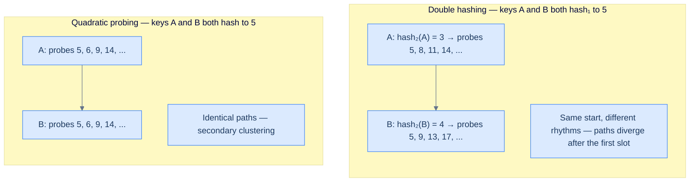
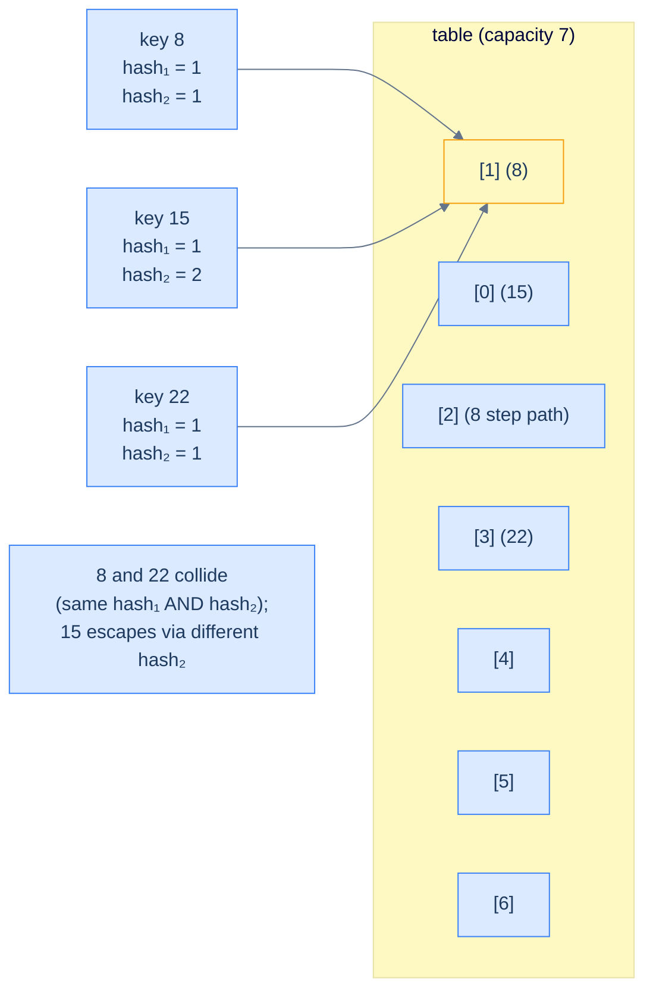
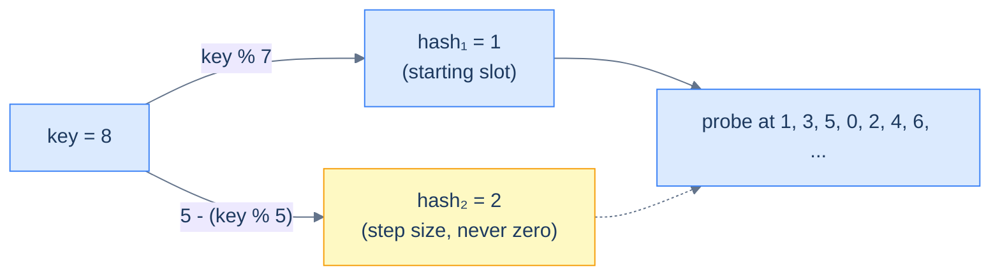
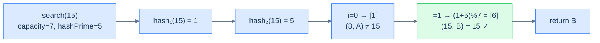
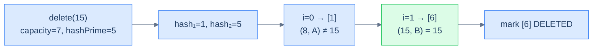

# 5. Double Hashing

## The Hook

Quadratic probing fixed primary clustering, but it left a hole the size of a bus: every key that hashes to the same starting slot follows the **exact same probe sequence**, forever. If `hash(A) = hash(B) = 5`, then A and B will collide at slot 5, then both probe slot 6, then both probe slot 9, then both probe slot 14 — they walk in lock-step until the heat-death of the universe. Two thousand keys mapping to the same starting slot? Two thousand keys all dancing the same choreographed dance through the array. That's **secondary clustering**, and it's quadratic probing's last frontier.

What if every key danced to *its own beat*? What if the step between probes wasn't `1`, `4`, `9`, `16` for everyone, but a *per-key* rhythm derived from the key itself? Two keys that happen to hash to the same starting slot would still scatter — because their step sizes would be different, even though their starting points coincide. That's **double hashing**: a *second* hash function computes the probe step.

The trick is breathtakingly simple: take the primary hash to find the starting slot, then take a **second** hash function applied to the same key to compute the step. Probe at `start, start+step, start+2·step, start+3·step, ...`. Two different keys hashing to the same start get two different steps, so they don't follow each other through the array. Secondary clustering — annihilated.

There's a sharp constraint that makes double hashing tricky: the second hash function must **never return zero** (a step of zero would re-probe the same slot forever) and ideally must produce step sizes that are coprime with the array's capacity (so the probe sequence visits every slot). Get that right, and you have what theory calls the closest practical approximation to *uniform hashing* — every key gets an effectively independent probe sequence. Get it wrong, and you get infinite loops. We'll see exactly how to choose the second hash function safely, and how the whole thing falls into place.

---

## Table of contents

1. [Understanding the problem](#understanding-the-problem)
2. [Introduction to double hashing](#introduction-to-double-hashing)
3. [Key components of double hashing](#key-components-of-double-hashing)
4. [Supported operations](#supported-operations)
5. [Internal mechanics](#internal-mechanics)
6. [Implementing the hash table class](#implementing-the-hash-table-class)
7. [Search operation in double hashing](#search-operation-in-double-hashing)
8. [Insert operation in double hashing](#insert-operation-in-double-hashing)
9. [Delete operation in double hashing](#delete-operation-in-double-hashing)
10. [Working example](#working-example)
11. [Design a hash table with double hashing](#design-a-hash-table-with-double-hashing)
12. [Edge cases and pitfalls](#edge-cases-and-pitfalls)
13. [Production reality](#production-reality)
14. [Quiz](#quiz)
15. [Practice ladder](#practice-ladder)
16. [Further reading](#further-reading)
17. [Cross-links](#cross-links)
18. [Final takeaway](#final-takeaway)

***

# Understanding the Problem

Quadratic probing tamed primary clustering but left **secondary clustering** standing, and double hashing exists to remove that last source of collision pile-up. The cause is that quadratic probing's offset `a·i² + b·i` depends only on the probe number `i`, never on the key. Two keys that hash to the same starting slot therefore generate byte-for-byte identical probe sequences. They collide at the start, then chase each other through `+1, +4, +9, +16, …` forever — same slots, same order, every time.

Double hashing attacks the offset, not the storage. It keeps the single contiguous array and the three-state record, and changes only how far each probe steps:

- **Same storage as the other open-addressing schemes.** One slab of records, every slot `EMPTY` / `OCCUPIED` / `DELETED`, so cache-friendly streaming and zero per-record pointer overhead survive intact.
- **A per-key step instead of a per-`i` formula.** The i-th probe sits at `(start + i · hash2(key)) % capacity`, so the *distance* between probes is computed from the key itself by a second hash function.

To make this concrete: in quadratic probing, keys `8` and `15` both hashing to slot `1` walk the identical path `1, 2, 5, 10, …`. In double hashing they get different strides — `hash2(8) = 2` and `hash2(15) = 5` — so one walks `1, 3, 5, 0, …` and the other `1, 6, 4, 2, …`, diverging after the very first slot. So the key idea is: double hashing trades a per-`i` offset for a per-key one — you keep the contiguous-array speed and gain probe sequences that are effectively independent across keys, and you give up simplicity, because the second hash function must never return zero and the capacity must be coprime with every step it can produce.

# Introduction to double hashing

We've now seen quadratic probing's secondary-clustering bug — keys that hash to the same starting slot follow identical probe paths because the step formula `a·i² + b·i` doesn't depend on the key. **Double hashing** is the cure: the step size itself is computed by a second hash function applied to the key.

Like quadratic probing, double hashing is an **open-addressing** scheme. The internal array stores key-value pairs directly. The size of the internal array bounds the table; the contiguous layout buys cache locality. None of that has changed.

```d2
grid-columns: 7
grid-gap: 0
h0: "[0]" {style.fill: "#fef9c3"; style.stroke: "#d97706"}
h1: "[1]" {style.fill: "#fef9c3"; style.stroke: "#d97706"}
h2: "[2]" {style.fill: "#fef9c3"; style.stroke: "#d97706"}
h3: "[3]" {style.fill: "#fef9c3"; style.stroke: "#d97706"}
h4: "[4]" {style.fill: "#fef9c3"; style.stroke: "#d97706"}
h5: "[5]" {style.fill: "#fef9c3"; style.stroke: "#d97706"}
h6: "[6]" {style.fill: "#fef9c3"; style.stroke: "#d97706"}
c0: "EMPTY"
c1: "(1, A)" {style.fill: "#dbeafe"; style.stroke: "#3b82f6"}
c2: "EMPTY"
c3: "(8, B)" {style.fill: "#dbeafe"; style.stroke: "#3b82f6"}
c4: "EMPTY"
c5: "(15, C)" {style.fill: "#dbeafe"; style.stroke: "#3b82f6"}
c6: "EMPTY"
```

<p align="center"><strong>Logical view of a double-hashing hash table — like the other open-addressing schemes, every slot directly stores a key-value pair. The difference shows up when you trace where colliding keys actually land.</strong></p>

We'll keep the array fixed-capacity for this lesson; production tables would resize when load gets high.

## Handling collisions

In quadratic probing, the i-th probe is at `start + a·i² + b·i`. The formula depends on `i` and the constants `a, b`, but **not on the key**. So two keys with the same starting slot follow identical paths.

In double hashing, the i-th probe is at `start + i · hash2(key)`. The formula now multiplies `i` by `hash2(key)` — and because `hash2` depends on the key, two different keys with the same starting slot get *different* step sizes. They start together; they immediately diverge.



<p align="center"><strong>How double hashing escapes secondary clustering — the second hash function gives every key a personal step size, so two keys sharing a starting slot still walk the array on different rhythms.</strong></p>

The first colliding key still lands at the hashed index. The second one steps by `hash2(key)`. The third by `2·hash2(key)`. And so on. Because `hash2` is a function of the key, each key gets its own probe sequence — different from every other key (with high probability, given a well-chosen `hash2`). This is the *uniform hashing* ideal in practical form.



<p align="center"><strong>Three keys colliding at hash₁ = 1 — keys 8 and 22 unlucky enough to <em>also</em> collide on hash₂ still follow the same path; key 15 with a different hash₂ takes its own. Double hashing scatters most colliding keys; only the unluckiest pairs (collisions on <em>both</em> hash functions) follow identical paths.</strong></p>

The probe sequence in double hashing wraps with `mod` like the others, and runs for at most `capacity` iterations.

> **Insert (sketch)**
>
> -   **Step 1:** Compute the primary hash for the key.
> -   **Step 2:** Compute the step size with the secondary hash function.
> -   **Step 3:** Probe at offsets `0, step, 2·step, 3·step, ...` until an unoccupied slot is found.
> -   **Step 4:** Place the (key, value) pair at that slot.
>
> **Search (sketch)**
>
> -   **Step 1:** Compute the primary hash.
> -   **Step 2:** Compute the step size with the secondary hash function.
> -   **Step 3:** Probe in step-sized increments until the key is found or an EMPTY slot is hit.
> -   **Step 4:** Return the value if the key is found.

The implementation is structurally identical to quadratic probing — same three-state record, same array, same operation flow. Only the offset formula changes from `a·i² + b·i` to `i · hash2(key)`.

***

# Key components of double hashing

A double-hashing hash table has the same three components as quadratic probing — three-state record, internal array, primary hash function — plus a **secondary hash function** for the step size. The secondary hash function is the only structural addition; everything else is unchanged.

<details>
<summary><h2>Record</h2></summary>


Same three-state record as the other open-addressing schemes — `state ∈ {EMPTY, DELETED, OCCUPIED}` plus the `(key, value)` pair. The state machine is identical; the only thing that's different is which slots get visited during a probe.

```d2
rec: A single Record {
  s: |md
    **state**

    EMPTY / OCCUPIED / DELETED
  | {style.fill: "#fef9c3"; style.stroke: "#d97706"}
  k: key
  v: value
}
```

<p align="center"><strong>Double-hashing record — same shape and same state machine as the linear and quadratic probing records. Open-addressing schemes share their record type; only the probe walks differ.</strong></p>


```python run
# Secondary hash function: Used for probing during collisions
# Returns hash_prime - (key % hash_prime), ensuring a different step
# size
def hash_function2(self, key: int) -> int:
    return self.hash_prime - (key % self.hash_prime)
```

```java run
// Secondary hash function: Used for probing during collisions
// Returns hashPrime - (key % hashPrime), ensuring a different step
// size
int hashFunction2(int key) {
    return hashPrime - (key % hashPrime);
}
```

</details>
<details>
<summary><h2>Internal array</h2></summary>


Identical to the linear- and quadratic-probing internal arrays. Same contiguous layout, same all-EMPTY initial state.

</details>
<details>
<summary><h2>Hash functions — primary and secondary</h2></summary>


Now the meaningful difference. A double-hashing table has **two** hash functions:

- **Primary**: `hash1(key) = key % capacity` — picks the starting probe slot.
- **Secondary**: `hash2(key) = hashPrime − (key % hashPrime)` — picks the **step size** for probing.

The secondary hash uses a small prime (`hashPrime`) less than `capacity` to control the range of step sizes. The form `hashPrime − (key % hashPrime)` has two essential properties:

1. **It never returns zero.** Because `key % hashPrime ∈ [0, hashPrime − 1]`, subtracting from `hashPrime` gives a result in `[1, hashPrime]`. Zero would mean "step of zero", which would loop on the same slot forever; the formula is engineered to forbid it.
2. **It varies with the key.** Different keys generally produce different residues mod `hashPrime`, so they get different steps. Two keys that collide on `hash1` will probably *not* collide on `hash2` — and that's what destroys secondary clustering.



<p align="center"><strong>How the two hash functions cooperate — hash₁ picks the starting slot; hash₂ picks the step. Together they define the probe sequence. With <code>capacity = 7</code> and <code>hashPrime = 5</code>, key 8 starts at slot 1 and steps by 2: visits <code>1, 3, 5, 0, 2, 4, 6</code> — every slot in the array.</strong></p>

> **Why must `capacity` be coprime with the step size?**
>
> If the step size shares a common factor with `capacity`, the probe sequence won't visit every slot — it'll cycle through a *fraction* of them. With `capacity = 8` and step `2`, the probe walks `0, 2, 4, 6, 0, 2, 4, 6, ...` and never reaches the odd slots. The fix is to choose `capacity` to be a **prime number** — then *every* possible step size in `[1, capacity − 1]` is automatically coprime with it, and the probe is guaranteed to visit every slot of the array. This is why double-hashing implementations are typically deployed with prime-sized tables.

</details>

***

# Supported Operations

The interface is identical to linear and quadratic probing — one read and two mutations, each the same shape of "hash the key, then probe." Only the probe step changes, so the operation set and its complexity profile carry straight over. A double-hashing table offers no ordered iteration and no range query; the probe order has nothing to do with key order, so those operations would be meaningless here:

| Operation | Average | Worst | Space | What it does |
|---|---|---|---|---|
| `search(key)` | `O(1)` | `O(N)` | `O(1)` | Probes the per-key sequence from `hash1(key)`; returns the value, or `-1` if an `EMPTY` slot or full scan is hit first |
| `insert(key, value)` | `O(1)` | `O(N)` | `O(1)` | Updates in place if the key exists, else writes at the first non-`OCCUPIED` slot in the sequence; returns `false` if no slot is reachable |
| `remove(key)` | `O(1)` | `O(N)` | `O(1)` | Probes to the matching slot and flips it to `DELETED`; a no-op if the key is absent |

The worst case is `O(N)` in `capacity`, and it has one cause: a probe forced to walk all `capacity` iterations. Double hashing reaches that case least often of the three open-addressing schemes, because a per-key step gives each key an effectively independent walk — but it does not erase the case, because the table can still fill up. To make this concrete: in a capacity-`7` table with `hashPrime = 5`, a search for an absent key with `hash2 = 5` walks slots `start, start+5, start+10 mod 7, …` for up to `7` steps before returning `-1`. So the core insight is: the operations and bounds match the other open-addressing schemes exactly — the only lever double hashing pulls is *how independent probe paths are*, which lowers the constant factor and the odds of a long chain, not the worst-case cost itself.

***

# Internal Mechanics

A double-hashing table is one array plus one rule: when slot `start` is taken, try `(start + 1·hash2(key)) % capacity`, then `(start + 2·hash2(key)) % capacity`, and keep stepping. The primary hash picks only the *starting* index; the secondary hash fixes the *stride*. Every operation is a variation on the same walk, and three slot states decide when it stops:

- **`OCCUPIED`** — holds a live key-value pair. A probe compares the stored key and either matches or steps one stride further.
- **`EMPTY`** — never held a record. A *search* stops here immediately, because an absent key would have been placed at this slot or earlier in its probe sequence.
- **`DELETED`** — a tombstone left by a prior removal. A *search* walks *past* it, but an *insert* may reuse it.

The per-key stride is the whole difference from quadratic probing, and its correctness rests on two number-theoretic facts. The stride `hash2(key) = hashPrime − (key % hashPrime)` always lands in `[1, hashPrime]`, so it is **never zero** — a zero stride would step onto the same slot forever. The stride must also be **coprime with `capacity`**, or the walk cycles through a fraction of the slots and never reaches the rest. To make this concrete: with `capacity = 8` and stride `2`, the probe visits `start, start+2, start+4, start+6` and then loops — the four odd slots are unreachable, so an insert can report "full" with half the array empty. So the core insight is: the array is passive storage and the per-key stride plus the three-state tag are the only live machinery — correctness reduces to walking `(start + i · hash2(key)) % capacity` with a non-zero stride that is coprime with `capacity`, which a **prime capacity** guarantees for every possible stride.

***

# Implementing the hash table class

We now wrap everything into `MyHashTable`. The constructor takes `capacity` and `hashPrime`. The class adds `hashPrime` as a private field and a private `hashFunction2` method on top of the linear/quadratic-probing class.

```d2
cls: MyHashTable class {
  priv: private internals {
    cap: "capacity"
    hp: "hashPrime"
    tbl: "table: Record[]"
    hf1: |md
      **hash1(key)**

      (starting slot)
    |
    hf2: |md
      **hash2(key)**

      (step size)
    |
    po: "probeForOccupied(key)"
    pe: "probeForFree(key)"
  }
  pub: public API {
    s: "search(key)"
    i: "insert(key, value)"
    r: "remove(key)"
  }
  pub -> priv {style.stroke-dash: 3}
}
```

<p align="center"><strong>Class layout — adds <code>hashPrime</code> and <code>hash2</code> on top of the open-addressing template. Notice that <code>probeForOccupied</code> and <code>probeForFree</code> now both depend on the key (because the step is per-key), unlike linear/quadratic where they depended only on the start.</strong></p>

<details>
<summary><h2>Implementation</h2></summary>


```python run
# Instantiate a hash table object from the MyHashTable class
table = MyHashTable(4, 3)

table.insert(1, 1234)

table.insert(2, 4567)

table.search(2)

table.insert(4, 8910)

table.remove(1)
```

```java run
// Instantiate a hash table object from the MyHashTable class
MyHashTable table = new MyHashTable(4, 3);

table.insert(1, 1234);

table.insert(2, 4567);

table.search(2);

table.insert(4, 8910);

table.remove(1);
```


> *Predict before reading on — for capacity 8 and hashPrime 5, what step sizes can <code>hash2(key) = 5 - (key % 5)</code> ever return? And does every key in the domain always reach every slot of an 8-slot array? Try it.*
>
> hash₂ returns values in `{1, 2, 3, 4, 5}`. With capacity 8 and step 2 or 4, the probe walks only even slots — half the array becomes unreachable for keys with those steps. With step 1, 3, or 5, every slot is reachable. The lesson: capacity-and-hashPrime must be coprime with all *possible* step sizes — and the simplest way to guarantee that is to make capacity prime.

</details>

***

# Search operation in double hashing

Search probes in step-sized increments until it finds the key (return value), hits an EMPTY slot (return `-1`), or completes a full traversal (return `-1`). The shape is identical to linear and quadratic probing; only the offset formula differs.

<details>
<summary><h2>Algorithm</h2></summary>


### 1. Key is present

Probe finds an `OCCUPIED` slot whose key matches. Return the value.



<p align="center"><strong>Successful search — the per-key step size makes the probe sequence diverge from any other key's path. Two keys colliding at slot 1 take entirely different rhythms after the first comparison.</strong></p>

### 2. EMPTY hit

Hitting `EMPTY` proves the key wasn't inserted along this probe chain. Stop, return `-1`.

### 3. Full traversal

After `capacity` probes, give up. Return `-1`.

</details>
<details>
<summary><h2>Solution &amp; Analysis</h2></summary>

### Implementation

```python run
from enum import Enum
from typing import List, Optional

# Represents the state of a record in the hash table
class RecordType(Enum):
    EMPTY = 0
    DELETED = 1
    OCCUPIED = 2

# Represents an entry in the hash table
class Record:
    def __init__(
        self, key: Optional[int] = None, value: Optional[int] = None
    ):

        # Initialize state as EMPTY by default
        self.state: RecordType = RecordType.EMPTY
        self.key: int = 0
        self.value: int = 0

        # Set state to OCCUPIED when key and value are provided
        if key is not None and value is not None:
            self.state = RecordType.OCCUPIED
            self.key = key
            self.value = value

class MyHashTable:
    def __init__(self, capacity: int, hash_prime: int):

        # The total number of slots in the hash table
        self.capacity: int = capacity

        # A prime number used for double hashing
        self.hash_prime: int = hash_prime

        # The hash table implemented as a list of Records
        self.table: List[Record] = [Record() for _ in range(capacity)]

    # Primary hash function: Computes the index as key % capacity
    def hash_function1(self, key: int) -> int:
        return key % self.capacity

    # Secondary hash function: Used for probing during collisions
    # Returns hash_prime - (key % hash_prime), ensuring a different step
    # size
    def hash_function2(self, key: int) -> int:
        return self.hash_prime - (key % self.hash_prime)

    def probe_for_occupied_index(
        self, key: int, start_index: int
    ) -> int:
        for i in range(self.capacity):

            # Double hashing
            probe_index = (
                start_index + i * self.hash_function2(key)
            ) % self.capacity

            # Check if the slot is occupied and matches the key
            if (
                self.table[probe_index].state == RecordType.OCCUPIED
                and self.table[probe_index].key == key
            ):
                return probe_index

        # Return -1 if no matching record is found
        return -1

    def search(self, key: int) -> int:

        # Compute the initial index using the primary hash function
        start_index = self.hash_function1(key)

        # Find the occupied index for the key
        occupied_index = self.probe_for_occupied_index(key, start_index)

        # Return the value if found, otherwise -1
        return (
            -1
            if occupied_index == -1
            else self.table[occupied_index].value
        )
```

```java run
import java.util.*;

// Represents the state of a record in the hash table
enum RecordType {
    EMPTY,
    DELETED,
    OCCUPIED
}

// Represents an entry in the hash table
class Record {

    // Use the separately defined RecordType enum
    RecordType state = RecordType.EMPTY;
    int key = 0;
    int value = 0;

    Record() {}

    Record(int key, int value) {
        this.state = RecordType.OCCUPIED;
        this.key = key;
        this.value = value;
    }
}

class MyHashTable {

    // The total number of slots in the hash table
    private int capacity;

    // A prime number used for double hashing
    private int hashPrime;

    // The hash table implemented as a list of Records
    private List<Record> table;

    // Primary hash function: Computes the index as key % capacity
    private int hashFunction1(int key) {
        return key % capacity;
    }

    // Secondary hash function: Used for probing during collisions
    // Returns hashPrime - (key % hashPrime), ensuring a different step
    // size
    private int hashFunction2(int key) {
        return hashPrime - (key % hashPrime);
    }

    private int probeForOccupiedIndex(int key, int startIndex) {
        for (int i = 0; i < capacity; ++i) {

            // Double hashing
            int probeIndex =
                (startIndex + i * hashFunction2(key)) % capacity;

            // Check if the slot is occupied and matches the key
            if (
                table.get(probeIndex).state == RecordType.OCCUPIED &&
                table.get(probeIndex).key == key
            ) {
                return probeIndex;
            }
        }

        // Return -1 if no matching record is found
        return -1;
    }

    public MyHashTable(int capacity, int hashPrime) {
        this.capacity = capacity;
        this.hashPrime = hashPrime;
        this.table = new ArrayList<>(capacity);
        for (int i = 0; i < capacity; i++) {
            table.add(new Record());
        }
    }

    public int search(int key) {

        // Compute the initial index using the primary hash function
        int startIndex = hashFunction1(key);

        // Find the occupied index for the key
        int occupiedIndex = probeForOccupiedIndex(key, startIndex);

        // Return the value if found, otherwise -1
        return occupiedIndex == -1 ? -1 : table.get(occupiedIndex).value;
    }
}
```

### Complexity analysis

> **Best case** — first probe matches
>
> -   Time: **O(1)** | Space: **O(1)**
>
> **Average case** — well-distributed hashes (with a good hash₂ in particular)
>
> -   Time: **O(1)** | Space: **O(1)**
>
> **Worst case** — heavy collision with table near capacity
>
> -   Time: **O(N)** | Space: **O(1)**

</details>

***

# Insert operation in double hashing

Insert mirrors the structure of insert in linear and quadratic probing — first probe to confirm the key isn't already there, then probe again to find the first non-OCCUPIED slot. The only thing that changes is that the offset is now `i · hash2(key)`.

<details>
<summary><h2>Algorithm</h2></summary>


### 1. Key already exists

Probe finds the matching `OCCUPIED` slot — overwrite the value.

### 2. Free slot found

Probe finds a non-OCCUPIED slot — drop the new record there.

### 3. Probe sequence exhausted

After `capacity` probes without finding a free slot, return `false`. (With a good hash₂ and a prime capacity, this only happens when the table is genuinely full.)


<p align="center"><strong>Insert with a new key — the second hash gives 15 a step of 5, so it lands at slot 6 instead of slot 2 (which is what linear or quadratic probing would have used). Two keys colliding at slot 1 with different hash₂ values now spread to opposite ends of the array.</strong></p>

</details>
<details>
<summary><h2>Solution &amp; Analysis</h2></summary>

### Implementation

```python run
from enum import Enum
from typing import List, Optional

# Represents the state of a record in the hash table
class RecordType(Enum):
    EMPTY = 0
    DELETED = 1
    OCCUPIED = 2

# Represents an entry in the hash table
class Record:
    def __init__(
        self, key: Optional[int] = None, value: Optional[int] = None
    ):

        # Initialize state as EMPTY by default
        self.state: RecordType = RecordType.EMPTY
        self.key: int = 0
        self.value: int = 0

        # Set state to OCCUPIED when key and value are provided
        if key is not None and value is not None:
            self.state = RecordType.OCCUPIED
            self.key = key
            self.value = value

class MyHashTable:
    def __init__(self, capacity: int, hash_prime: int):

        # The total number of slots in the hash table
        self.capacity: int = capacity

        # A prime number used for double hashing
        self.hash_prime: int = hash_prime

        # The hash table implemented as a list of Records
        self.table: List[Record] = [Record() for _ in range(capacity)]

    # Primary hash function: Computes the index as key % capacity
    def hash_function1(self, key: int) -> int:
        return key % self.capacity

    # Secondary hash function: Used for probing during collisions
    # Returns hash_prime - (key % hash_prime), ensuring a different step
    # size
    def hash_function2(self, key: int) -> int:
        return self.hash_prime - (key % self.hash_prime)

    def probe_for_occupied_index(
        self, key: int, start_index: int
    ) -> int:
        for i in range(self.capacity):

            # Double hashing
            probe_index = (
                start_index + i * self.hash_function2(key)
            ) % self.capacity

            # Check if the slot is occupied and matches the key
            if (
                self.table[probe_index].state == RecordType.OCCUPIED
                and self.table[probe_index].key == key
            ):
                return probe_index

        # Return -1 if no matching record is found
        return -1

    def probe_for_empty_index(self, key: int, start_index: int) -> int:
        for i in range(self.capacity):

            # Double hashing
            probe_index = (
                start_index + i * self.hash_function2(key)
            ) % self.capacity

            # Check if the slot is available (either EMPTY or DELETED)
            if self.table[probe_index].state != RecordType.OCCUPIED:
                return probe_index

        # Return -1 if no available slot is found
        return -1

    def search(self, key: int) -> int:

        # Compute the initial index using the primary hash function
        start_index = self.hash_function1(key)

        # Find the occupied index for the key
        occupied_index = self.probe_for_occupied_index(key, start_index)

        # Return the value if found, otherwise -1
        return (
            -1
            if occupied_index == -1
            else self.table[occupied_index].value
        )

    def insert(self, key: int, value: int) -> bool:

        # Compute the initial index using the primary hash function
        start_index = self.hash_function1(key)

        # Find the occupied index for the key
        occupied_index = self.probe_for_occupied_index(key, start_index)

        # Update the value if the key exists
        if occupied_index != -1:
            self.table[occupied_index].value = value
            return True

        # Find an empty slot to insert the new key-value pair
        empty_index = self.probe_for_empty_index(key, start_index)
        if empty_index != -1:
            self.table[empty_index] = Record(key, value)
            return True

        # Return False if the table is full and insertion fails
        return False
```

```java run
import java.util.*;

// Represents the state of a record in the hash table
enum RecordType {
    EMPTY,
    DELETED,
    OCCUPIED
}

// Represents an entry in the hash table
class Record {

    // Use the separately defined RecordType enum
    RecordType state = RecordType.EMPTY;
    int key = 0;
    int value = 0;

    Record() {}

    Record(int key, int value) {
        this.state = RecordType.OCCUPIED;
        this.key = key;
        this.value = value;
    }
}

class MyHashTable {

    // The total number of slots in the hash table
    private int capacity;

    // A prime number used for double hashing
    private int hashPrime;

    // The hash table implemented as a list of Records
    private List<Record> table;

    // Primary hash function: Computes the index as key % capacity
    private int hashFunction1(int key) {
        return key % capacity;
    }

    // Secondary hash function: Used for probing during collisions
    // Returns hashPrime - (key % hashPrime), ensuring a different step
    // size
    private int hashFunction2(int key) {
        return hashPrime - (key % hashPrime);
    }

    private int probeForOccupiedIndex(int key, int startIndex) {
        for (int i = 0; i < capacity; ++i) {

            // Double hashing
            int probeIndex =
                (startIndex + i * hashFunction2(key)) % capacity;

            // Check if the slot is occupied and matches the key
            if (
                table.get(probeIndex).state == RecordType.OCCUPIED &&
                table.get(probeIndex).key == key
            ) {
                return probeIndex;
            }
        }

        // Return -1 if no matching record is found
        return -1;
    }

    private int probeForEmptyIndex(int key, int startIndex) {
        for (int i = 0; i < capacity; ++i) {

            // Double hashing
            int probeIndex =
                (startIndex + i * hashFunction2(key)) % capacity;

            // Check if the slot is available (either EMPTY or DELETED)
            if (table.get(probeIndex).state != RecordType.OCCUPIED) {
                return probeIndex;
            }
        }

        // Return -1 if no available slot is found
        return -1;
    }

    public MyHashTable(int capacity, int hashPrime) {
        this.capacity = capacity;
        this.hashPrime = hashPrime;
        this.table = new ArrayList<>(capacity);
        for (int i = 0; i < capacity; i++) {
            table.add(new Record());
        }
    }

    public int search(int key) {

        // Compute the initial index using the primary hash function
        int startIndex = hashFunction1(key);

        // Find the occupied index for the key
        int occupiedIndex = probeForOccupiedIndex(key, startIndex);

        // Return the value if found, otherwise -1
        return occupiedIndex == -1 ? -1 : table.get(occupiedIndex).value;
    }

    public boolean insert(int key, int value) {

        // Compute the initial index using the primary hash function
        int startIndex = hashFunction1(key);

        // Find the occupied index for the key
        int occupiedIndex = probeForOccupiedIndex(key, startIndex);

        // Update the value if the key exists
        if (occupiedIndex != -1) {
            table.get(occupiedIndex).value = value;
            return true;
        }

        // Find an empty slot to insert the new key-value pair
        int emptyIndex = probeForEmptyIndex(key, startIndex);
        if (emptyIndex != -1) {
            table.set(emptyIndex, new Record(key, value));
            return true;
        }

        // Return false if the table is full and insertion fails
        return false;
    }
}
```

### Complexity analysis

> **Best case** — first probe lands on a writable slot
>
> -   Time: **O(1)** | Space: **O(1)**
>
> **Average case** — well-chosen hash₂, low load factor
>
> -   Time: **O(1)** | Space: **O(1)**
>
> **Worst case** — table near full, long probe sequence
>
> -   Time: **O(N)** | Space: **O(1)**

</details>

***

# Delete operation in double hashing

Delete works exactly as in linear and quadratic probing — find the matching slot via the probe, then mark it `DELETED`. The tombstone is just as essential here. Removing it would orphan any record placed past this slot during inserts that crossed this point.

<details>
<summary><h2>Algorithm</h2></summary>


### 1. Key is present

Probe finds the matching `OCCUPIED` slot — flip it to `DELETED`.

### 2. Key is not present (EMPTY hit)

No-op.

### 3. Probe sequence exhausted

No-op.



<p align="center"><strong>Double-hashing delete — same as the other open-addressing schemes, but with a per-key step. The DELETED tombstone keeps probe paths walkable for any record placed past this slot.</strong></p>

</details>
<details>
<summary><h2>Solution &amp; Analysis</h2></summary>

### Implementation

```python run
from enum import Enum
from typing import List, Optional

# Represents the state of a record in the hash table
class RecordType(Enum):
    EMPTY = 0
    DELETED = 1
    OCCUPIED = 2

# Represents an entry in the hash table
class Record:
    def __init__(
        self, key: Optional[int] = None, value: Optional[int] = None
    ):

        # Initialize state as EMPTY by default
        self.state: RecordType = RecordType.EMPTY
        self.key: int = 0
        self.value: int = 0

        # Set state to OCCUPIED when key and value are provided
        if key is not None and value is not None:
            self.state = RecordType.OCCUPIED
            self.key = key
            self.value = value

class MyHashTable:
    def __init__(self, capacity: int, hash_prime: int):

        # The total number of slots in the hash table
        self.capacity: int = capacity

        # A prime number used for double hashing
        self.hash_prime: int = hash_prime

        # The hash table implemented as a list of Records
        self.table: List[Record] = [Record() for _ in range(capacity)]

    # Primary hash function: Computes the index as key % capacity
    def hash_function1(self, key: int) -> int:
        return key % self.capacity

    # Secondary hash function: Used for probing during collisions
    # Returns hash_prime - (key % hash_prime), ensuring a different step
    # size
    def hash_function2(self, key: int) -> int:
        return self.hash_prime - (key % self.hash_prime)

    def probe_for_occupied_index(
        self, key: int, start_index: int
    ) -> int:
        for i in range(self.capacity):

            # Double hashing
            probe_index = (
                start_index + i * self.hash_function2(key)
            ) % self.capacity

            # Check if the slot is occupied and matches the key
            if (
                self.table[probe_index].state == RecordType.OCCUPIED
                and self.table[probe_index].key == key
            ):
                return probe_index

        # Return -1 if no matching record is found
        return -1

    def probe_for_empty_index(self, key: int, start_index: int) -> int:
        for i in range(self.capacity):

            # Double hashing
            probe_index = (
                start_index + i * self.hash_function2(key)
            ) % self.capacity

            # Check if the slot is available (either EMPTY or DELETED)
            if self.table[probe_index].state != RecordType.OCCUPIED:
                return probe_index

        # Return -1 if no available slot is found
        return -1

    def search(self, key: int) -> int:

        # Compute the initial index using the primary hash function
        start_index = self.hash_function1(key)

        # Find the occupied index for the key
        occupied_index = self.probe_for_occupied_index(key, start_index)

        # Return the value if found, otherwise -1
        return (
            -1
            if occupied_index == -1
            else self.table[occupied_index].value
        )

    def insert(self, key: int, value: int) -> bool:

        # Compute the initial index using the primary hash function
        start_index = self.hash_function1(key)

        # Find the occupied index for the key
        occupied_index = self.probe_for_occupied_index(key, start_index)

        # Update the value if the key exists
        if occupied_index != -1:
            self.table[occupied_index].value = value
            return True

        # Find an empty slot to insert the new key-value pair
        empty_index = self.probe_for_empty_index(key, start_index)
        if empty_index != -1:
            self.table[empty_index] = Record(key, value)
            return True

        # Return False if the table is full and insertion fails
        return False

    def remove(self, key: int) -> None:

        # Compute the initial index using the primary hash function
        start_index = self.hash_function1(key)

        # Find the occupied index for the key
        occupied_index = self.probe_for_occupied_index(key, start_index)

        # Mark the slot as DELETED
        if occupied_index != -1:
            self.table[occupied_index].state = RecordType.DELETED
```

```java run
import java.util.*;

// Represents the state of a record in the hash table
enum RecordType {
    EMPTY,
    DELETED,
    OCCUPIED
}

// Represents an entry in the hash table
class Record {

    // Use the separately defined RecordType enum
    RecordType state = RecordType.EMPTY;
    int key = 0;
    int value = 0;

    Record() {}

    Record(int key, int value) {
        this.state = RecordType.OCCUPIED;
        this.key = key;
        this.value = value;
    }
}

class MyHashTable {

    // The total number of slots in the hash table
    private int capacity;

    // A prime number used for double hashing
    private int hashPrime;

    // The hash table implemented as a list of Records
    private List<Record> table;

    // Primary hash function: Computes the index as key % capacity
    private int hashFunction1(int key) {
        return key % capacity;
    }

    // Secondary hash function: Used for probing during collisions
    // Returns hashPrime - (key % hashPrime), ensuring a different step
    // size
    private int hashFunction2(int key) {
        return hashPrime - (key % hashPrime);
    }

    private int probeForOccupiedIndex(int key, int startIndex) {
        for (int i = 0; i < capacity; ++i) {

            // Double hashing
            int probeIndex =
                (startIndex + i * hashFunction2(key)) % capacity;

            // Check if the slot is occupied and matches the key
            if (
                table.get(probeIndex).state == RecordType.OCCUPIED &&
                table.get(probeIndex).key == key
            ) {
                return probeIndex;
            }
        }

        // Return -1 if no matching record is found
        return -1;
    }

    private int probeForEmptyIndex(int key, int startIndex) {
        for (int i = 0; i < capacity; ++i) {

            // Double hashing
            int probeIndex =
                (startIndex + i * hashFunction2(key)) % capacity;

            // Check if the slot is available (either EMPTY or DELETED)
            if (table.get(probeIndex).state != RecordType.OCCUPIED) {
                return probeIndex;
            }
        }

        // Return -1 if no available slot is found
        return -1;
    }

    public MyHashTable(int capacity, int hashPrime) {
        this.capacity = capacity;
        this.hashPrime = hashPrime;
        this.table = new ArrayList<>(capacity);
        for (int i = 0; i < capacity; i++) {
            table.add(new Record());
        }
    }

    public int search(int key) {

        // Compute the initial index using the primary hash function
        int startIndex = hashFunction1(key);

        // Find the occupied index for the key
        int occupiedIndex = probeForOccupiedIndex(key, startIndex);

        // Return the value if found, otherwise -1
        return occupiedIndex == -1 ? -1 : table.get(occupiedIndex).value;
    }

    public boolean insert(int key, int value) {

        // Compute the initial index using the primary hash function
        int startIndex = hashFunction1(key);

        // Find the occupied index for the key
        int occupiedIndex = probeForOccupiedIndex(key, startIndex);

        // Update the value if the key exists
        if (occupiedIndex != -1) {
            table.get(occupiedIndex).value = value;
            return true;
        }

        // Find an empty slot to insert the new key-value pair
        int emptyIndex = probeForEmptyIndex(key, startIndex);
        if (emptyIndex != -1) {
            table.set(emptyIndex, new Record(key, value));
            return true;
        }

        // Return false if the table is full and insertion fails
        return false;
    }

    public void remove(int key) {

        // Compute the initial index using the primary hash function
        int startIndex = hashFunction1(key);

        // Find the occupied index for the key
        int occupiedIndex = probeForOccupiedIndex(key, startIndex);

        // Mark the slot as DELETED
        if (occupiedIndex != -1) {
            table.get(occupiedIndex).state = RecordType.DELETED;
        }
    }
}
```

### Complexity analysis

> **Best case** — first probe matches
>
> -   Time: **O(1)** | Space: **O(1)**
>
> **Average case** — well-distributed hashes
>
> -   Time: **O(1)** | Space: **O(1)**
>
> **Worst case** — collision-heavy
>
> -   Time: **O(N)** | Space: **O(1)**

</details>

***

# Working Example

Watching three keys that share a starting slot land in *different* places is the fastest way to see what the second hash function buys. Start with `MyHashTable(7, 5)` — capacity `7` (prime, so every stride is coprime with it), `hashPrime = 5`, every slot `EMPTY`. The primary hash is `key % 7`; the stride is `hash2(key) = 5 − (key % 5)`. Keys `8`, `15`, and `22` all hash to slot `1`, so quadratic probing would march them down one identical path. Double hashing scatters them:

1. **`insert(8, A)`** — `hash1(8) = 8 % 7 = 1`. Slot `1` is `EMPTY`, so the probe stops at `i = 0` and writes `(8, A)`. Stride was never needed. Table: slot `1 = (8, A)`.
2. **`insert(15, B)`** — `hash1(15) = 1`, a collision. The stride is `hash2(15) = 5 − (15 % 5) = 5 − 0 = 5`. Probe `i = 0` hits slot `1` (`OCCUPIED`, key `8 ≠ 15`); probe `i = 1` lands at `(1 + 1·5) % 7 = 6`, which is `EMPTY`. Write `(15, B)` at slot `6`. Table: slots `1 = (8, A)`, `6 = (15, B)`.
3. **`insert(22, C)`** — `hash1(22) = 22 % 7 = 1`, another collision at the same start. But the stride differs: `hash2(22) = 5 − (22 % 5) = 5 − 2 = 3`. Probe `i = 0` hits slot `1` (key `8 ≠ 22`); probe `i = 1` lands at `(1 + 1·3) % 7 = 4`, which is `EMPTY`. Write `(22, C)` at slot `4`. Table: slots `1 = (8, A)`, `4 = (22, C)`, `6 = (15, B)`.
4. **`search(22)`** — `hash1(22) = 1`, `hash2(22) = 3`. Probe `i = 0` reads slot `1` (key `8 ≠ 22`, keep walking); probe `i = 1` reads slot `4` (key `22` matches). Return `C`.

Three keys, one starting slot, three different destinations — `1`, `6`, and `4`. The crux is step `3`: key `22` and key `15` both collided with key `8` at slot `1`, yet they never collided with *each other*, because their strides (`3` versus `5`) sent them to different slots on the first hop. Had this been quadratic probing, key `22` would have walked `15`'s exact path and piled up behind it. So the core insight is: `hash1` decides where a key *starts*, `hash2` decides how it *moves*, and giving each key its own stride is what stops same-start keys from sharing a probe sequence.

***

# Design a hash table with double hashing

## Problem Statement

Given the skeleton of a `MyHashTable` class, complete it by implementing:

> -   **MyHashTable(int capacity, int hashPrime)** — Initialise with the given capacity, and store the prime used in the second hash function.
> -   **search(int key)** — Return the value, or `-1`.
> -   **insert(int key, int value)** — Insert or update; return `true` on success, `false` if the table is full.
> -   **remove(int key)** — Remove the mapping (no-op if absent).
> -   **getKeyAtIndex(int index)** — Return the key at `table[index]`, or `-1` if not `OCCUPIED`.

```d2
cons: Constraints {
  c1: "No built-in hash table libraries"
  c2: "Double hashing for collisions"
  c3: "hash1(key) = key % capacity"
  c4: "hash2(key) = hashPrime - (key % hashPrime)"
}
```

<p align="center"><strong>Constraints — primary hash is the standard division method; secondary hash is the classic non-zero double-hashing form. <code>hashPrime</code> is supplied as input so the same code can be tested with different secondary-hash configurations.</strong></p>

> **Example:**
>
> -   **Input:** `[MyHashTable, insert, insert, search, insert, search, insert, search, search, getKeyAtIndex]`, `[[3, 2], [1, 2], [2, 4], [1], [1, 3], [1], [2, 5], [2], [3], [0]]`
>
> -   **Output:** `[null, true, true, 2, true, 3, true, 5, -1, -1]`
>
> **Explanation:**
>
> | Operation | Effect | Result |
> |---|---|---|
> | `MyHashTable(3, 2)` | empty table, capacity 3, hashPrime 2 | `null` |
> | `insert(1, 2)` | 1 % 3 = 1 → `[EMPTY, (1, 2), EMPTY]` | `true` |
> | `insert(2, 4)` | 2 % 3 = 2 → `[EMPTY, (1, 2), (2, 4)]` | `true` |
> | `search(1)` | found at index 1 | `2` |
> | `insert(1, 3)` | update existing | `true` |
> | `search(1)` | | `3` |
> | `insert(2, 5)` | update existing | `true` |
> | `search(2)` | | `5` |
> | `search(3)` | 3 % 3 = 0; index 0 is EMPTY → not found | `-1` |
> | `getKeyAtIndex(0)` | slot 0 is EMPTY | `-1` |

<details>
<summary><h2>Solution</h2></summary>


The full implementation. `getKeyAtIndex` is the same one-liner we used in the linear- and quadratic-probing solutions.


```python run viz=graph viz-root=table
from enum import Enum
from typing import List, Optional

# Represents the state of a record in the hash table
class RecordType(Enum):
    EMPTY = 0
    DELETED = 1
    OCCUPIED = 2

# Represents an entry in the hash table
class Record:
    def __init__(
        self, key: Optional[int] = None, value: Optional[int] = None
    ):

        # Initialize state as EMPTY by default
        self.state: RecordType = RecordType.EMPTY
        self.key: int = 0
        self.value: int = 0

        # Set state to OCCUPIED when key and value are provided
        if key is not None and value is not None:
            self.state = RecordType.OCCUPIED
            self.key = key
            self.value = value

class MyHashTable:
    def __init__(self, capacity: int, hash_prime: int):

        # The total number of slots in the hash table
        self.capacity: int = capacity

        # A prime number used for double hashing
        self.hash_prime: int = hash_prime

        # The hash table implemented as a list of Records
        self.table: List[Record] = [Record() for _ in range(capacity)]

    # Primary hash function: Computes the index as key % capacity
    def hash_function1(self, key: int) -> int:
        return key % self.capacity

    # Secondary hash function: Used for probing during collisions
    # Returns hash_prime - (key % hash_prime), ensuring a different step
    # size
    def hash_function2(self, key: int) -> int:
        return self.hash_prime - (key % self.hash_prime)

    def probe_for_occupied_index(
        self, key: int, start_index: int
    ) -> int:
        for i in range(self.capacity):

            # Double hashing
            probe_index = (
                start_index + i * self.hash_function2(key)
            ) % self.capacity

            # Check if the slot is occupied and matches the key
            if (
                self.table[probe_index].state == RecordType.OCCUPIED
                and self.table[probe_index].key == key
            ):
                return probe_index

        # Return -1 if no matching record is found
        return -1

    def probe_for_empty_index(self, key: int, start_index: int) -> int:
        for i in range(self.capacity):

            # Double hashing
            probe_index = (
                start_index + i * self.hash_function2(key)
            ) % self.capacity

            # Check if the slot is available (either EMPTY or DELETED)
            if self.table[probe_index].state != RecordType.OCCUPIED:
                return probe_index

        # Return -1 if no available slot is found
        return -1

    def search(self, key: int) -> int:

        # Compute the initial index using the primary hash function
        start_index = self.hash_function1(key)

        # Find the occupied index for the key
        occupied_index = self.probe_for_occupied_index(key, start_index)

        # Return the value if found, otherwise -1
        return (
            -1
            if occupied_index == -1
            else self.table[occupied_index].value
        )

    def insert(self, key: int, value: int) -> bool:

        # Compute the initial index using the primary hash function
        start_index = self.hash_function1(key)

        # Find the occupied index for the key
        occupied_index = self.probe_for_occupied_index(key, start_index)

        # Update the value if the key exists
        if occupied_index != -1:
            self.table[occupied_index].value = value
            return True

        # Find an empty slot to insert the new key-value pair
        empty_index = self.probe_for_empty_index(key, start_index)
        if empty_index != -1:
            self.table[empty_index] = Record(key, value)
            return True

        # Return False if the table is full and insertion fails
        return False

    def remove(self, key: int) -> None:

        # Compute the initial index using the primary hash function
        start_index = self.hash_function1(key)

        # Find the occupied index for the key
        occupied_index = self.probe_for_occupied_index(key, start_index)

        # Mark the slot as DELETED
        if occupied_index != -1:
            self.table[occupied_index].state = RecordType.DELETED

    def get_key_at_index(self, index: int) -> int:

        # Return the key at the specified index if it's OCCUPIED,
        # otherwise -1
        return (
            self.table[index].key
            if self.table[index].state == RecordType.OCCUPIED
            else -1
        )


# Example from the problem statement (capacity=3, hashPrime=2)
t1 = MyHashTable(3, 2)
print(t1.insert(1, 2))              # True
print(t1.insert(2, 4))              # True
print(t1.search(1))                 # 2
print(t1.insert(1, 3))              # True
print(t1.search(1))                 # 3
print(t1.insert(2, 5))              # True
print(t1.search(2))                 # 5
print(t1.search(3))                 # -1
print(t1.get_key_at_index(0))       # -1 — index 0 is EMPTY

# Edge cases
t2 = MyHashTable(7, 5)
print(t2.search(99))                # -1 — empty table
print(t2.insert(0, 10))             # True — key 0 at index 0
print(t2.search(0))                 # 10
t2.remove(0)
print(t2.search(0))                 # -1 — removed
print(t2.insert(7, 20))             # True — key 7 also hashes to index 0, double-hash probes ahead
print(t2.search(7))                 # 20
```

```java run viz=graph viz-root=table
import java.util.*;

public class Main {

    // Represents the state of a record in the hash table
    enum RecordType {
        EMPTY,
        DELETED,
        OCCUPIED
    }

    // Represents an entry in the hash table
    static class Record {

        // Use the separately defined RecordType enum
        RecordType state = RecordType.EMPTY;
        int key = 0;
        int value = 0;

        Record() {}

        Record(int key, int value) {
            this.state = RecordType.OCCUPIED;
            this.key = key;
            this.value = value;
        }
    }

    static class MyHashTable {

        // The total number of slots in the hash table
        private int capacity;

        // A prime number used for double hashing
        private int hashPrime;

        // The hash table implemented as a list of Records
        private List<Record> table;

        // Primary hash function: Computes the index as key % capacity
        private int hashFunction1(int key) {
            return key % capacity;
        }

        // Secondary hash function: Used for probing during collisions
        // Returns hashPrime - (key % hashPrime), ensuring a different step
        // size
        private int hashFunction2(int key) {
            return hashPrime - (key % hashPrime);
        }

        private int probeForOccupiedIndex(int key, int startIndex) {
            for (int i = 0; i < capacity; ++i) {

                // Double hashing
                int probeIndex =
                    (startIndex + i * hashFunction2(key)) % capacity;

                // Check if the slot is occupied and matches the key
                if (
                    table.get(probeIndex).state == RecordType.OCCUPIED &&
                    table.get(probeIndex).key == key
                ) {
                    return probeIndex;
                }
            }

            // Return -1 if no matching record is found
            return -1;
        }

        private int probeForEmptyIndex(int key, int startIndex) {
            for (int i = 0; i < capacity; ++i) {

                // Double hashing
                int probeIndex =
                    (startIndex + i * hashFunction2(key)) % capacity;

                // Check if the slot is available (either EMPTY or DELETED)
                if (table.get(probeIndex).state != RecordType.OCCUPIED) {
                    return probeIndex;
                }
            }

            // Return -1 if no available slot is found
            return -1;
        }

        public MyHashTable(int capacity, int hashPrime) {
            this.capacity = capacity;
            this.hashPrime = hashPrime;
            this.table = new ArrayList<>(capacity);
            for (int i = 0; i < capacity; i++) {
                table.add(new Record());
            }
        }

        public int search(int key) {

            // Compute the initial index using the primary hash function
            int startIndex = hashFunction1(key);

            // Find the occupied index for the key
            int occupiedIndex = probeForOccupiedIndex(key, startIndex);

            // Return the value if found, otherwise -1
            return occupiedIndex == -1 ? -1 : table.get(occupiedIndex).value;
        }

        public boolean insert(int key, int value) {

            // Compute the initial index using the primary hash function
            int startIndex = hashFunction1(key);

            // Find the occupied index for the key
            int occupiedIndex = probeForOccupiedIndex(key, startIndex);

            // Update the value if the key exists
            if (occupiedIndex != -1) {
                table.get(occupiedIndex).value = value;
                return true;
            }

            // Find an empty slot to insert the new key-value pair
            int emptyIndex = probeForEmptyIndex(key, startIndex);
            if (emptyIndex != -1) {
                table.set(emptyIndex, new Record(key, value));
                return true;
            }

            // Return false if the table is full and insertion fails
            return false;
        }

        public void remove(int key) {

            // Compute the initial index using the primary hash function
            int startIndex = hashFunction1(key);

            // Find the occupied index for the key
            int occupiedIndex = probeForOccupiedIndex(key, startIndex);

            // Mark the slot as DELETED
            if (occupiedIndex != -1) {
                table.get(occupiedIndex).state = RecordType.DELETED;
            }
        }

        public int getKeyAtIndex(int index) {
            return table.get(index).state == RecordType.OCCUPIED
                ? table.get(index).key
                : -1;
        }
    }

    public static void main(String[] args) {
        // Example from the problem statement (capacity=3, hashPrime=2)
        MyHashTable t1 = new MyHashTable(3, 2);
        System.out.println(t1.insert(1, 2));             // true
        System.out.println(t1.insert(2, 4));             // true
        System.out.println(t1.search(1));                // 2
        System.out.println(t1.insert(1, 3));             // true
        System.out.println(t1.search(1));                // 3
        System.out.println(t1.insert(2, 5));             // true
        System.out.println(t1.search(2));                // 5
        System.out.println(t1.search(3));                // -1
        System.out.println(t1.getKeyAtIndex(0));         // -1 — index 0 is EMPTY

        // Edge cases
        MyHashTable t2 = new MyHashTable(7, 5);
        System.out.println(t2.search(99));               // -1 — empty table
        System.out.println(t2.insert(0, 10));            // true — key 0 at index 0
        System.out.println(t2.search(0));                // 10
        t2.remove(0);
        System.out.println(t2.search(0));                // -1 — removed
        System.out.println(t2.insert(7, 20));            // true — key 7 also hashes to index 0
        System.out.println(t2.search(7));                // 20
    }
}
```

</details>
<details>
<summary><h2>Final Takeaway</h2></summary>


You've now seen the full open-addressing arc — linear, quadratic, double — and each one is a refinement of the same single idea: *resolve collisions by walking the array on a different rhythm*. Linear walks one slot at a time, and pays for it with primary clusters. Quadratic accelerates the steps with `i²`, breaking those clusters but leaving secondary clusters where same-hash keys still walk lock-step. Double hashing finally gives every key its own rhythm — a step size derived from a second hash function — so two keys sharing a starting slot still scatter across the array.

Three takeaways to carry forward:

1. **Double hashing is the closest practical approximation to uniform hashing.** The probe sequences for different keys are effectively independent random walks, which is the gold standard hash analysis assumes.
2. **The second hash function must never return zero.** A step of 0 means "probe the same slot forever" — an instant infinite loop. The classic form `hashPrime − (key % hashPrime)` has this property baked into its definition.
3. **Capacity should be coprime with every possible step.** The simplest and most robust choice is **a prime capacity** — every step in `[1, capacity − 1]` is then automatically coprime with capacity, so the probe sequence visits every slot in the array. Skip this rule and you'll get tables that report "full" while still containing empty slots.

> **A panoramic view of the four schemes:**
>
> | Scheme | Probe formula | Cures | Vulnerable to |
> |---|---|---|---|
> | Separate chaining | `slot[h].chain.append` | unbounded growth, collision isolation | cache misses, pointer overhead |
> | Linear probing | `+1, +1, +1, ...` | cache locality, simplicity | primary clustering |
> | Quadratic probing | `+1, +4, +9, +16, ...` | primary clustering | secondary clustering, cycle issues |
> | Double hashing | `+s, +s, +s, ...` (s per key) | secondary clustering | hash₂ correctness, prime capacity required |
>
> Each row trades one weakness for another. There is no single "best" scheme — the right choice depends on key distribution, expected load, deletion rate, and the cost of cache misses on the target hardware.

> *Coming up — we've finished the collision-resolution arc. The next several lessons step *up* a level: how to *use* hash tables to solve problems you'd otherwise need quadratic-time scans for. Pattern counting (find frequencies in O(n) instead of O(n²)), pattern generation (use a hash set as a "have we seen this?" oracle), sliding windows that lean on a rolling-frequency dictionary — every one of them is a small story about how a well-chosen hash table turns a hard problem into an easy one. Onward.*

</details>

# Edge Cases and Pitfalls

Double hashing inherits every open-addressing trap and adds two of its own around the second hash function. Almost every bug traces back to a bad stride or the three slot states. Keep this list open the next time a double-hashing table loops forever or loses a key:

- **A second hash function that can return zero.** A stride of `0` means every probe lands on the same slot — an instant infinite loop on the first collision. The form `hashPrime − (key % hashPrime)` is engineered to forbid it: `key % hashPrime ∈ [0, hashPrime − 1]`, so the result lands in `[1, hashPrime]`. Any homemade `hash2` must guarantee a non-zero result the same way.
- **A capacity not coprime with the stride.** If `capacity` shares a factor with a possible stride, the probe cycles through a *fraction* of the slots and never reaches the rest. With `capacity = 8` and stride `2`, the walk visits only even slots — an insert can return `false` ("full") while four slots sit empty. The robust fix is a **prime `capacity`**: every stride in `[1, capacity − 1]` is then automatically coprime with it.
- **Setting a deleted slot to `EMPTY` instead of `DELETED`.** Erasing a slot mid-chain makes a search stop early and orphans every record placed past it on that stride. The fix is the tombstone: flip the slot to `DELETED` so a search walks past it while inserts can still reuse it.
- **Stopping a search on the first non-`OCCUPIED` slot.** A search must halt on `EMPTY` but keep walking on `DELETED`, because the key may have been inserted *before* the slot was tombstoned. Treating `DELETED` like `EMPTY` reintroduces the orphaning bug from the read side.
- **Inserting without the two-pass check.** Insert probes twice on purpose: `probe_for_occupied_index` confirms the key is absent anywhere on its stride, then `probe_for_empty_index` finds a writable slot. Stopping at the first `DELETED` slot on a single pass can write a duplicate key whose original copy still sits further down the same stride.
- **Forgetting the modulo wrap.** Every probe step is `(start_index + i · hash2(key)) % capacity`. A plain `start_index + i · hash2(key)` walks off the end of the array — an `IndexError` in Python, an `ArrayIndexOutOfBoundsException` in Java — because the stride can push the raw index well past the last slot.
- **No bound on the probe loop.** The loop must run at most `capacity` times. Without that cap, a full table with no matching key spins forever instead of returning `-1` (search) or `false` (insert). Iterating `range(capacity)` gives the bound for free.
- **The `-1` sentinel colliding with real data.** `search` returns `-1` for "absent," so a table that legitimately stores `-1` as a value cannot tell a miss from a hit. Reserve `-1`, or return an explicit "not found" signal instead of overloading a value.

***

# Production Reality

True double hashing — a second hash function computing the probe stride — shows up most often in textbooks and competitive-programming hash sets, where a prime capacity is cheap to arrange. Production hash tables more commonly reach for *related* ideas that defeat the same secondary-clustering enemy: data-dependent probe sequences. The systems below are worth knowing by name.

**[CPython's `dict` and `set`]** — uses **a perturbation-based probe sequence that folds in the full hash bits as it walks** — because mixing extra hash bits into each step gives colliding keys data-dependent paths, the same goal as double hashing without a second full hash evaluation.

<!-- VERIFY: characterising CPython's perturbation probe as "double-hashing-like" — it derives the per-step displacement from the remaining hash bits rather than a distinct second hash function; the family resemblance is the data-dependent stride, not an identical mechanism. -->

**[A competitive-programming hash set (e.g. a custom `long`-keyed table)]** — uses **double hashing with a prime capacity and a `hashPrime`-based second function** — because a prime table size makes every stride coprime with capacity for free, so the textbook scheme is correct with almost no extra code.

**[Cuckoo hashing tables (some language runtimes and routers)]** — uses **two independent hash functions to give each key two candidate slots** — because two hash functions bound worst-case lookup to `O(1)` by relocating on collision, an idea that grows out of using more than one hash like double hashing does.

**[Open-addressed symbol tables in compilers and interners]** — uses **a fixed prime-sized table with a secondary-hash stride** — because the working set is bounded and known, so a prime capacity plus a per-key stride keeps probe chains short without ever resizing.

***

# Quiz

Test your grip before moving on. One answer per question; reveal only after you have committed to one.

**[Recall] Q: What single expression computes the `i`-th probe index in double hashing, and which part of it depends on the key?**
`(start_index + i · hash2(key)) % capacity` — the stride `hash2(key)` depends on the key, so each key gets its own per-key spacing between probes.

**[Recall] Q: Why can the second hash function `hashPrime − (key % hashPrime)` never return zero?**
Because `key % hashPrime` lies in `[0, hashPrime − 1]`, subtracting it from `hashPrime` always yields a value in `[1, hashPrime]`, so the stride is at least `1`.

**[Reasoning] Q: Why does a per-key stride defeat the secondary clustering that quadratic probing suffers?**
Quadratic probing's offset depends only on the probe number, so same-start keys share an identical path; double hashing's offset depends on the key, so two keys colliding at one slot get different strides and diverge after the first hop.

**[Reasoning] Q: Why must the capacity be coprime with the step size, and what is the simplest way to guarantee it?**
If the step shares a factor with `capacity`, the probe cycles through only a fraction of the slots and leaves the rest unreachable; choosing a **prime `capacity`** makes every step in `[1, capacity − 1]` coprime with it, so the probe visits every slot.

**[Tradeoff] Q: When would you reach for double hashing over quadratic probing, and what do you accept in return?**
Choose double hashing when you need the closest practical approximation to uniform hashing and can afford a prime-sized table, accepting a second hash evaluation per probe step and the constraint that the stride must be non-zero and coprime with capacity.

***

# Practice Ladder

Five problems that lean on the hash-table contract this chapter builds, easiest first. Try each unaided; hit the hint after ten minutes; do not peek at solutions until you have written something runnable.

| # | Problem | Pattern | Difficulty | Hint |
|---|---------|---------|------------|------|
| 1 | [First Non-Repeating Character](/cortex/data-structures-and-algorithms/linear-structures-hash-table-pattern-counting-problems-first-non-repeating-character) | [Counting](/cortex/data-structures-and-algorithms/linear-structures-hash-table-pattern-counting-pattern) | Easy | One pass to count every character into a map, a second pass to return the first with count `1`. The map's `O(1)` average lookup is the whole trick. `O(n)` time, `O(k)` space for `k` distinct keys. |
| 2 | [Duplicate Detection](/cortex/data-structures-and-algorithms/linear-structures-hash-table-pattern-fixed-sized-sliding-window-problems-duplicate-detection) | [Fixed Sliding Window](/cortex/data-structures-and-algorithms/linear-structures-hash-table-pattern-fixed-sized-sliding-window-pattern) | Easy | Slide a window of width `k` and keep its members in a set; a failed insert means a duplicate inside the window. `O(n)` time, `O(k)` space. |
| 3 | [Anagram Checker](/cortex/data-structures-and-algorithms/linear-structures-hash-table-pattern-counting-problems-anagram-checker) | [Counting](/cortex/data-structures-and-algorithms/linear-structures-hash-table-pattern-counting-pattern) | Easy | Count letters of one string into a map, then decrement with the second; all-zero counts means they are anagrams. `O(n)` time, `O(k)` space. |
| 4 | [Subarray Sum Equals K](/cortex/data-structures-and-algorithms/linear-structures-hash-table-pattern-variable-sized-sliding-window-problems-subarray-sum-equals-k) | [Variable Sliding Window](/cortex/data-structures-and-algorithms/linear-structures-hash-table-pattern-variable-sized-sliding-window-pattern) | Medium | Store running prefix sums in a map; for each index, look up `prefix − k` to count qualifying subarrays in `O(1)`. `O(n)` time, `O(n)` space. |
| 5 | [Zero Sum Subarrays](/cortex/data-structures-and-algorithms/linear-structures-hash-table-pattern-prefix-sum-problems-zero-sum-subarrays) | [Prefix Sum](/cortex/data-structures-and-algorithms/linear-structures-hash-table-pattern-prefix-sum-pattern) | Medium | A repeated prefix sum means the span between the two indices sums to zero; a map from prefix value to count finds every such pair in one pass. `O(n)` time, `O(n)` space. |

Once these feel automatic, the map has stopped being syntax and become a structural reflex — exactly what counting, windowing, and prefix-sum problems build on.

***

# Further Reading

Curated paths in, not a syllabus. Read in order of the annotation; come back for the rest when you need depth.

- **[CLRS — Chapter 11.4: Open Addressing](https://mitpress.mit.edu/9780262046305/introduction-to-algorithms/)**
  ★ Essential — the formal treatment of double hashing as the practical stand-in for uniform hashing, with the expected-probe-count analysis that shows why an independent stride per key beats linear and quadratic probing.
- **[Knuth — *The Art of Computer Programming*, Vol. 3, §6.4](https://www-cs-faculty.stanford.edu/~knuth/taocp.html)**
  ◆ Advanced — the original double-hashing analysis, including why the second hash function and the table size must be relatively prime for the probe sequence to be a full permutation of the slots.
- **[Pagh & Rodler — *Cuckoo Hashing*](https://www.itu.dk/people/pagh/papers/cuckoo-jour.pdf)**
  ◆ Advanced — where using two independent hash functions is pushed to its logical end: worst-case `O(1)` lookup, the natural sequel to double hashing's "more than one hash" idea.
- **[CPython `dict` implementation notes (`Objects/dictobject.c`)](https://github.com/python/cpython/blob/main/Objects/dictobject.c)**
  → Reference — the perturbation-based probe sequence CPython uses to fold extra hash bits into each step, achieving double-hashing-like dispersion without a second full hash function.

***

# Cross-Links

**Prerequisites**

- [Quadratic Probing](/cortex/data-structures-and-algorithms/linear-structures-hash-table-quadratic-probing) — the widening-step scheme whose leftover secondary clustering is exactly the problem double hashing removes.
- [Linear Probing](/cortex/data-structures-and-algorithms/linear-structures-hash-table-linear-probing) — the simplest open-addressing table, where the three-state record and the `DELETED` tombstone this lesson reuses are first introduced.
- [Introduction to Hash Tables](/cortex/data-structures-and-algorithms/linear-structures-hash-table-introduction-to-hash-tables) — the hash function, the load factor, and the collision problem every resolution scheme in this chapter is solving.

**What comes next**

- [Pattern: Counting](/cortex/data-structures-and-algorithms/linear-structures-hash-table-pattern-counting-pattern) — the first problem-solving pattern built on the hash-table contract, using a frequency map to replace `O(n²)` scans with `O(n)` passes.
- [Memorize: Hash Table](/cortex/data-structures-and-algorithms/linear-structures-hash-table-memorize) — the chapter crib sheet that distils all four collision-resolution schemes into a single set of facts and complexities.

***

## Final Takeaway

1. **Core mechanic:** store key-value pairs directly in one contiguous array and resolve a collision by stepping `(start + i · hash2(key)) % capacity`, where a second hash function gives every key its own per-key stride so two keys sharing a starting slot still diverge.
2. **Dominant tradeoff:** you gain probe sequences that are effectively independent across keys — the closest practical approximation to uniform hashing — and you give up simplicity, paying a second hash evaluation per step and requiring a non-zero stride coprime with capacity.
3. **One thing to remember:** make the capacity a prime number; then every possible stride is coprime with it, the probe visits every slot, and the second hash function's "never zero" guarantee is all that stands between you and a correct table.
