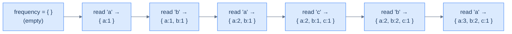
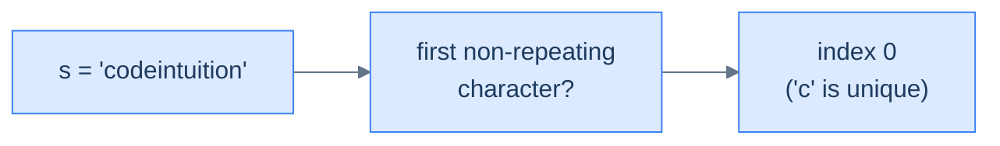
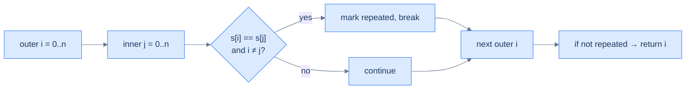
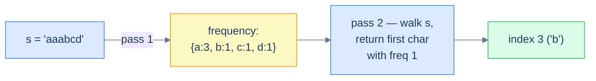
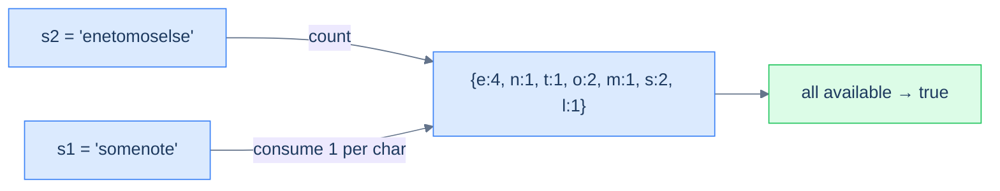
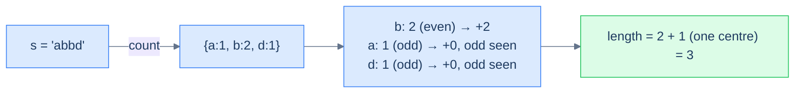
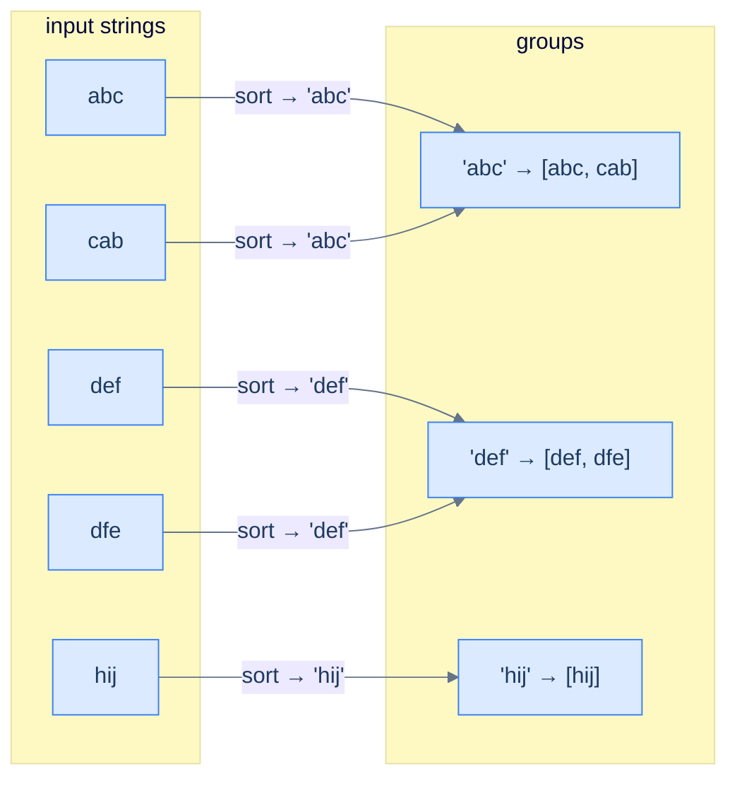

# 6. Pattern: Counting

## The Hook

You're at a table tennis tournament. Someone screams "QUICK — was 'paragraph' the word that appeared the most in today's commentary?" You have a 30-minute transcript and 30 seconds to answer. Option A: re-read the whole transcript counting every word manually — at the rate of 1 word per second, you'd finish in 30 minutes you don't have. Option B: scan once, building a tally `{word → count}` as you go. By the time you finish reading, the answer is *already in the tally* — one peek and you're done.

That tally is a **hash map of frequencies**, and the technique of building it in a single linear pass is the **counting pattern**. It's the simplest, most-used trick in the hash-table playbook — the one that turns nested loops into single passes, that solves "is this an anagram?" in O(n) instead of O(n log n), that powers spell-checkers, plagiarism detectors, ad click counters, and the first 30 minutes of every interview.

The pattern is so plain it almost looks like cheating: *traverse once, record what you see, then answer the question*. But the first time you watch an O(n²) brute-force solution collapse into an O(n) one because you swapped a "search again" for "look in the hash map", you'll feel the click. Everything in this lesson is a variation on that single move.

---

## Table of contents

1. [Understanding the counting pattern](#understanding-the-counting-pattern)
2. [Identifying the counting pattern](#identifying-the-counting-pattern)
3. [First non repeating character](#first-non-repeating-character)
4. [Constructibility check](#constructibility-check)
5. [Anagram checker](#anagram-checker)
6. [Build palindrome](#build-palindrome)
7. [Cluster anagrams](#cluster-anagrams)

***

# Understanding the counting pattern

Some problems hand you a *sequence* — an array, a string, a linked list — and ask you something whose answer depends on **how often** each item appears. "Which character is unique?" "Can string A be rearranged into string B?" "How many anagrams in this list?" The naïve approach is to walk the sequence twice (or N times), comparing items to each other and racking up O(N²) work. The clever approach is to walk *once*, building a hash map from item to frequency. After that single pass, the question collapses into a constant-time lookup.

```d2
direction: right

inp: Input array {
  grid-columns: 6
  grid-gap: 0
  a0: "a"
  a1: "b"
  a2: "a"
  a3: "c"
  a4: "b"
  a5: "a"
}

map: frequency map {
  m1: "'a' -> 3"
  m2: "'b' -> 2"
  m3: "'c' -> 1"
}

inp -> map: single pass
```

<p align="center"><strong>The counting technique — one linear sweep over the input builds a complete frequency map. After this single pass, every "how often did X appear?" question is a constant-time lookup.</strong></p>

## Counting technique

The mechanism is almost embarrassingly simple. Initialise an empty hash map `frequency`. Walk the sequence; for each item, increment `frequency[item]`. When the walk ends, the map holds the count of every distinct item.



<p align="center"><strong>The counting technique unrolled — each character read updates one entry in the map. Hash-map insert and update are amortised O(1), so the whole pass costs O(N).</strong></p>

A subtle but important point: the counting technique *rarely* solves a problem outright. Its job is to **build the input** that the rest of your algorithm consumes. A well-built frequency map turns a problem into a tally-inspection puzzle, but it's still up to you to ask the right question of it.

## Algorithm

> **Algorithm**
>
> -   **Step 1:** Initialise an empty map `frequency` from item to integer.
> -   **Step 2:** For each item in the sequence:
>     -   **Step 2.1:** If the item exists in `frequency`, increment its value. Otherwise set it to 1.

## Implementation

The generic counting helper — one function we'll lean on in every problem in this lesson.


```pseudocode
function count_frequency(s):
    frequency ← empty Map: char → int
    for ch in s:
        frequency[ch] ← frequency[ch] + 1
    return frequency
```

```python run
from collections import defaultdict

def count_frequency(s: str) -> dict:
    # defaultdict(int) auto-initialises any missing key to 0,
    # so frequency[ch] += 1 always works without an existence check.
    frequency = defaultdict(int)
    for ch in s:
        frequency[ch] += 1
    return frequency

print(dict(count_frequency("abacba")))   # {'a': 3, 'b': 2, 'c': 1}
```

```java run
import java.util.*;

public class Main {
    static Map<Character, Integer> countFrequency(String s) {
        Map<Character, Integer> frequency = new HashMap<>();
        for (char ch : s.toCharArray()) {
            // getOrDefault avoids null-checks on first occurrence
            frequency.put(ch, frequency.getOrDefault(ch, 0) + 1);
        }
        return frequency;
    }
    public static void main(String[] args) {
        System.out.println(countFrequency("abacba"));   // {a=3, b=2, c=1}
    }
}
```

```c run
#include <stdio.h>
#include <string.h>

// For lower-case letters, an array indexed by (ch - 'a') is the
// fastest "hash map" in C — fixed size, zero collisions.
void count_frequency(const char *s, int freq[26]) {
    memset(freq, 0, sizeof(int) * 26);
    for (; *s; s++) freq[*s - 'a']++;
}

int main() {
    int freq[26];
    count_frequency("abacba", freq);
    for (int i = 0; i < 26; i++)
        if (freq[i]) printf("%c=%d ", 'a' + i, freq[i]);
    printf("\n");   // a=3 b=2 c=1
    return 0;
}
```

```scala run
def countFrequency(s: String): Map[Char, Int] =
  // groupBy + mapValues is idiomatic; no manual loop needed
  s.groupBy(identity).view.mapValues(_.length).toMap

object Main extends App {
  println(countFrequency("abacba"))   // Map(a -> 3, b -> 2, c -> 1)
}
```


## Complexity Analysis

The single-pass nature is the entire story. We touch each item once; each touch costs amortised O(1) hash-map work; total is **O(N)** time. Space is bounded by the number of *distinct* items we see — best case O(1) when everything is the same character, worst case O(N) when every item is unique.

> **Best case** — only one unique item
>
> -   Time: **O(N)** | Space: **O(1)**
>
> **Worst case** — every item unique
>
> -   Time: **O(N)** | Space: **O(N)**

> *Predict before reading on — the brute-force "for each character, scan again to count it" is O(N²). Counting builds the map once and looks up answers in O(1). When does the constant factor matter? At what input size does the difference start to dominate?*

***

# Identifying the counting pattern

The counting technique fits **easy-to-medium** problems on arrays or strings where the answer depends on the *occurrences* of items — how many times each appears, whether two collections have matching multisets, whether one is a subset of another, and so on. Most of these problems share a single template.

**Template:**
> Given an iterable sequence of data, compute its frequency map and use the map to answer the question.

If you can rephrase a problem as "first build the count of X, then answer Y from it", counting is the right tool.

## Example

Let's drill the pattern with one canonical problem.

> **Problem statement:** Given a string `s`, return the index of the first non-repeating character. Return -1 if no such character exists.



<p align="center"><strong>The "first non-repeating character" problem in one sentence — return the index of the first character whose count in <code>s</code> is 1.</strong></p>

### Brute force solution

The most direct approach: for each character, scan the rest of the string and check whether it repeats.



<p align="center"><strong>Brute-force flow — nested loops compare every character to every other, giving O(N²) time. Acceptable for tiny strings, prohibitive for anything realistic.</strong></p>


```pseudocode
function first_non_repeating_brute(s):
    for i from 0 to length(s) − 1:
        repeated ← false
        for j from 0 to length(s) − 1:
            if i ≠ j AND s[i] = s[j]:
                repeated ← true; break
        if NOT repeated: return i
    return -1
```

```python run
def first_non_repeating_brute(s: str) -> int:
    n = len(s)
    for i in range(n):
        repeated = False
        for j in range(n):
            # Skip self-comparison; check every other index
            if i != j and s[i] == s[j]:
                repeated = True
                break
        if not repeated:
            return i
    return -1

print(first_non_repeating_brute("codeintuition"))   # 0
print(first_non_repeating_brute("aaabcd"))          # 3
print(first_non_repeating_brute("aaabbccdd"))       # -1
```

```java run
public class Main {
    static int firstNonRepeatingBrute(String s) {
        for (int i = 0; i < s.length(); i++) {
            boolean repeated = false;
            for (int j = 0; j < s.length(); j++) {
                if (i != j && s.charAt(i) == s.charAt(j)) { repeated = true; break; }
            }
            if (!repeated) return i;
        }
        return -1;
    }
    public static void main(String[] args) {
        System.out.println(firstNonRepeatingBrute("codeintuition"));   // 0
        System.out.println(firstNonRepeatingBrute("aaabcd"));          // 3
        System.out.println(firstNonRepeatingBrute("aaabbccdd"));       // -1
    }
}
```

```c run
#include <stdio.h>
#include <string.h>

int first_non_repeating_brute(const char *s) {
    int n = (int)strlen(s);
    for (int i = 0; i < n; i++) {
        int repeated = 0;
        for (int j = 0; j < n; j++) {
            if (i != j && s[i] == s[j]) { repeated = 1; break; }
        }
        if (!repeated) return i;
    }
    return -1;
}

int main() {
    printf("%d %d %d\n",
           first_non_repeating_brute("codeintuition"),
           first_non_repeating_brute("aaabcd"),
           first_non_repeating_brute("aaabbccdd"));   // 0 3 -1
}
```

```scala run
def firstNonRepeatingBrute(s: String): Int = {
  for (i <- s.indices) {
    var repeated = false
    for (j <- s.indices if !repeated) {
      if (i != j && s(i) == s(j)) repeated = true
    }
    if (!repeated) return i
  }
  -1
}

object Main extends App {
  println(firstNonRepeatingBrute("codeintuition"))   // 0
  println(firstNonRepeatingBrute("aaabcd"))          // 3
  println(firstNonRepeatingBrute("aaabbccdd"))       // -1
}
```


The brute-force approach is **O(N²)** time. Tolerable up to a few thousand characters; brutal beyond that.

### Counting technique solution

Now the same problem with the counting pattern:

1. Build the frequency map of every character in `s` (one pass).
2. Walk `s` again from the start; return the first index whose character has frequency 1.



<p align="center"><strong>Counting solution — first build the freq map (one pass), then walk <code>s</code> a second time looking up each character. Two linear passes total: O(N).</strong></p>


```pseudocode
function first_non_repeating(s):
    frequency ← count_frequency(s)
    for i from 0 to length(s) − 1:
        if frequency[s[i]] = 1: return i
    return -1
```

```python run
from collections import defaultdict

def first_non_repeating(s: str) -> int:
    # Pass 1 — build frequency map
    frequency = defaultdict(int)
    for ch in s: frequency[ch] += 1
    # Pass 2 — find first char with count == 1
    for i, ch in enumerate(s):
        if frequency[ch] == 1: return i
    return -1

print(first_non_repeating("codeintuition"))   # 0
print(first_non_repeating("aaabcd"))          # 3
print(first_non_repeating("aaabbccdd"))       # -1
```

```java run
import java.util.*;

public class Main {
    static int firstNonRepeating(String s) {
        Map<Character, Integer> freq = new HashMap<>();
        for (char ch : s.toCharArray())
            freq.put(ch, freq.getOrDefault(ch, 0) + 1);
        for (int i = 0; i < s.length(); i++)
            if (freq.get(s.charAt(i)) == 1) return i;
        return -1;
    }
    public static void main(String[] args) {
        System.out.println(firstNonRepeating("codeintuition"));   // 0
        System.out.println(firstNonRepeating("aaabcd"));          // 3
        System.out.println(firstNonRepeating("aaabbccdd"));       // -1
    }
}
```

```c run
#include <stdio.h>
#include <string.h>

int first_non_repeating(const char *s) {
    int freq[26] = {0};
    for (const char *p = s; *p; p++) freq[*p - 'a']++;   // pass 1
    for (int i = 0; s[i]; i++) if (freq[s[i] - 'a'] == 1) return i;
    return -1;
}

int main() {
    printf("%d %d %d\n",
        first_non_repeating("codeintuition"),
        first_non_repeating("aaabcd"),
        first_non_repeating("aaabbccdd"));   // 0 3 -1
}
```

```scala run
def firstNonRepeating(s: String): Int = {
  val freq = s.groupBy(identity).view.mapValues(_.length).toMap
  s.indices.find(i => freq(s(i)) == 1).getOrElse(-1)
}

object Main extends App {
  println(firstNonRepeating("codeintuition"))
  println(firstNonRepeating("aaabcd"))
  println(firstNonRepeating("aaabbccdd"))
}
```


Two linear passes — **O(N)** time, **O(N)** space. The trade is unambiguous: spend O(N) extra memory to drop time from quadratic to linear. On any realistic input this is a no-brainer.

## Example problems

The five problems below cover the spectrum of "easy-to-medium" counting problems. Each is a different shape — uniqueness, subset-of, multiset-equality, palindromicity, grouping — but every solution is a variation on *build the frequency map first, then ask the question*.

> -   First non-repeating character
> -   Constructibility check
> -   Anagram checker
> -   Build palindrome
> -   Cluster anagrams

***

# First non repeating character

## Problem Statement

Given a string `s`, find and return the index of the first non-repeating character. Return `-1` if no such character exists.

### Example 1
> -   **Input:** `s = "codeintuition"`
> -   **Output:** `0`
> -   **Explanation:** `'c'` is the first non-repeating character.

### Example 2
> -   **Input:** `s = "aaabcd"`
> -   **Output:** `3`
> -   **Explanation:** `'b'` is the first non-repeating character.

### Example 3
> -   **Input:** `s = "aaabbccdd"`
> -   **Output:** `-1`
> -   **Explanation:** No character appears exactly once.

## Solution

Two passes: build the frequency map, then re-walk to find the first frequency-1 character.


```pseudocode
function first_non_repeating_character(s):
    freq ← count_frequency(s)
    for i from 0 to length(s) − 1:
        if freq[s[i]] = 1: return i
    return -1
```

```python run
from collections import defaultdict

def first_non_repeating_character(s: str) -> int:
    freq = defaultdict(int)
    for ch in s: freq[ch] += 1
    for i, ch in enumerate(s):
        if freq[ch] == 1: return i
    return -1

print(first_non_repeating_character("codeintuition"))   # 0
print(first_non_repeating_character("aaabcd"))          # 3
print(first_non_repeating_character("aaabbccdd"))       # -1
```

```java run
import java.util.*;

public class Main {
    static int firstNonRepeatingCharacter(String s) {
        Map<Character, Integer> freq = new HashMap<>();
        for (char ch : s.toCharArray()) freq.merge(ch, 1, Integer::sum);
        for (int i = 0; i < s.length(); i++)
            if (freq.get(s.charAt(i)) == 1) return i;
        return -1;
    }
    public static void main(String[] args) {
        System.out.println(firstNonRepeatingCharacter("codeintuition"));   // 0
        System.out.println(firstNonRepeatingCharacter("aaabcd"));          // 3
        System.out.println(firstNonRepeatingCharacter("aaabbccdd"));       // -1
    }
}
```

```c run
#include <stdio.h>

int first_non_repeating_character(const char *s) {
    int freq[26] = {0};
    for (const char *p = s; *p; p++) freq[*p - 'a']++;
    for (int i = 0; s[i]; i++) if (freq[s[i] - 'a'] == 1) return i;
    return -1;
}

int main() {
    printf("%d %d %d\n",
        first_non_repeating_character("codeintuition"),
        first_non_repeating_character("aaabcd"),
        first_non_repeating_character("aaabbccdd"));
}
```

```scala run
def firstNonRepeatingCharacter(s: String): Int = {
  val freq = s.groupBy(identity).view.mapValues(_.length).toMap
  s.indices.find(i => freq(s(i)) == 1).getOrElse(-1)
}

object Main extends App {
  println(firstNonRepeatingCharacter("codeintuition"))
  println(firstNonRepeatingCharacter("aaabcd"))
  println(firstNonRepeatingCharacter("aaabbccdd"))
}
```


***

# Constructibility check

## Problem Statement

Given two strings `s1` and `s2`, return `true` if `s1` can be constructed using the letters from `s2` (each letter usable at most once). Return `false` otherwise.

### Example 1
> -   **Input:** `s1 = "somenote", s2 = "enetomoselse"`
> -   **Output:** `true`

### Example 2
> -   **Input:** `s1 = "thief", s2 = "hifacqet"`
> -   **Output:** `true`

### Example 3
> -   **Input:** `s1 = "alpha", s2 = "beta"`
> -   **Output:** `false`

## Approach

Build the frequency map of `s2`. Then walk `s1`; for each character, *consume* one from the map by decrementing it. If any character's count drops to zero (or below) while we still need it, `s2` doesn't have enough letters — return `false`.



<p align="center"><strong>Constructibility — the s2 frequency map is the "available letters" pool. Walking s1 consumes from the pool. If you ever try to consume a letter that's exhausted, the build fails.</strong></p>

## Solution


```pseudocode
function constructibility_check(s1, s2):
    pool ← count_frequency(s2)
    for ch in s1:
        if pool[ch] = 0: return false
        pool[ch] ← pool[ch] − 1
    return true
```

```python run
from collections import Counter

def constructibility_check(s1: str, s2: str) -> bool:
    pool = Counter(s2)               # available letters
    for ch in s1:
        if pool[ch] == 0: return False  # exhausted → can't build
        pool[ch] -= 1
    return True

print(constructibility_check("somenote", "enetomoselse"))   # True
print(constructibility_check("thief",    "hifacqet"))       # True
print(constructibility_check("alpha",    "beta"))           # False
```

```java run
import java.util.*;

public class Main {
    static boolean constructibilityCheck(String s1, String s2) {
        Map<Character, Integer> pool = new HashMap<>();
        for (char ch : s2.toCharArray()) pool.merge(ch, 1, Integer::sum);
        for (char ch : s1.toCharArray()) {
            int n = pool.getOrDefault(ch, 0);
            if (n == 0) return false;
            pool.put(ch, n - 1);
        }
        return true;
    }
    public static void main(String[] args) {
        System.out.println(constructibilityCheck("somenote", "enetomoselse"));   // true
        System.out.println(constructibilityCheck("thief",    "hifacqet"));       // true
        System.out.println(constructibilityCheck("alpha",    "beta"));           // false
    }
}
```

```c run
#include <stdio.h>
#include <stdbool.h>

bool constructibility_check(const char *s1, const char *s2) {
    int pool[26] = {0};
    for (const char *p = s2; *p; p++) pool[*p - 'a']++;
    for (const char *p = s1; *p; p++) {
        if (pool[*p - 'a'] == 0) return false;
        pool[*p - 'a']--;
    }
    return true;
}

int main() {
    printf("%d %d %d\n",
        constructibility_check("somenote", "enetomoselse"),
        constructibility_check("thief", "hifacqet"),
        constructibility_check("alpha", "beta"));   // 1 1 0
}
```

```scala run
def constructibilityCheck(s1: String, s2: String): Boolean = {
  val pool = scala.collection.mutable.Map[Char, Int]().withDefaultValue(0)
  s2.foreach(ch => pool(ch) += 1)
  for (ch <- s1) {
    if (pool(ch) == 0) return false
    pool(ch) -= 1
  }
  true
}

object Main extends App {
  println(constructibilityCheck("somenote", "enetomoselse"))
  println(constructibilityCheck("thief", "hifacqet"))
  println(constructibilityCheck("alpha", "beta"))
}
```


**Complexity:** O(|s1| + |s2|) time, O(unique chars in s2) space.

***

# Anagram checker

## Problem Statement

Given two strings `s` and `p`, return `true` if `p` is an anagram of `s` (same multiset of characters), else `false`.

### Example 1
> -   **Input:** `s = "codeintuition", p = "cdoenoitiutni"`
> -   **Output:** `true`

### Example 2
> -   **Input:** `s = "abc", p = "ade"`
> -   **Output:** `false`

### Example 3
> -   **Input:** `s = "abcdef", p = "dfecba"`
> -   **Output:** `true`

## Approach

Anagrams have the same length and the same character frequency map. Build the frequency of `s`, then walk `p` and decrement; if any character is missing or counts disagree, return `false`. The map ends empty iff the two are anagrams.

> *Mental shortcut* — anagram checking is "does the multiset match?". The frequency map *is* the multiset.

## Solution


```pseudocode
function anagram_checker(s, p):
    if length(s) ≠ length(p): return false
    return count_frequency(s) = count_frequency(p)
```

```python run
from collections import Counter

def anagram_checker(s: str, p: str) -> bool:
    if len(s) != len(p): return False
    return Counter(s) == Counter(p)        # multiset equality, one line

print(anagram_checker("codeintuition", "cdoenoitiutni"))   # True
print(anagram_checker("abc", "ade"))                       # False
print(anagram_checker("abcdef", "dfecba"))                 # True
```

```java run
import java.util.*;

public class Main {
    static boolean anagramChecker(String s, String p) {
        if (s.length() != p.length()) return false;
        Map<Character, Integer> freq = new HashMap<>();
        for (char ch : s.toCharArray()) freq.merge(ch, 1, Integer::sum);
        for (char ch : p.toCharArray()) {
            if (!freq.containsKey(ch)) return false;
            int n = freq.get(ch) - 1;
            if (n == 0) freq.remove(ch); else freq.put(ch, n);
        }
        return freq.isEmpty();
    }
    public static void main(String[] args) {
        System.out.println(anagramChecker("codeintuition", "cdoenoitiutni"));   // true
        System.out.println(anagramChecker("abc", "ade"));                       // false
        System.out.println(anagramChecker("abcdef", "dfecba"));                 // true
    }
}
```

```c run
#include <stdio.h>
#include <string.h>
#include <stdbool.h>

bool anagram_checker(const char *s, const char *p) {
    if (strlen(s) != strlen(p)) return false;
    int freq[26] = {0};
    for (; *s; s++, p++) { freq[*s - 'a']++; freq[*p - 'a']--; }
    for (int i = 0; i < 26; i++) if (freq[i] != 0) return false;
    return true;
}

int main() {
    printf("%d %d %d\n",
        anagram_checker("codeintuition", "cdoenoitiutni"),
        anagram_checker("abc", "ade"),
        anagram_checker("abcdef", "dfecba"));
}
```

```scala run
def anagramChecker(s: String, p: String): Boolean =
  s.length == p.length &&
  s.groupBy(identity).view.mapValues(_.length).toMap ==
  p.groupBy(identity).view.mapValues(_.length).toMap

object Main extends App {
  println(anagramChecker("codeintuition", "cdoenoitiutni"))
  println(anagramChecker("abc", "ade"))
  println(anagramChecker("abcdef", "dfecba"))
}
```


***

# Build palindrome

## Problem Statement

Given a case-sensitive string `s`, return the length of the **longest palindrome** that can be built using all or some of its letters.

### Example 1
> -   **Input:** `s = "AaAaBbBbc"`
> -   **Output:** `9`
> -   **Explanation:** Use every character — e.g. `"BAabcbaAB"`.

### Example 2
> -   **Input:** `s = "abbd"`
> -   **Output:** `3`
> -   **Explanation:** `"bab"` or `"bdb"`.

### Example 3
> -   **Input:** `s = "abc"`
> -   **Output:** `1`

## Approach

A palindrome reads the same forward and backward. Every character used in pairs contributes 2 to the length; **at most one** odd-count character can sit alone in the middle. So:

1. Count each character's frequency.
2. For each frequency: if **even**, add it all; if **odd**, add `count − 1` (the largest even part) and remember we saw an odd.
3. If any odd count was seen, add 1 (one character can sit in the middle).



<p align="center"><strong>Build palindrome — every even-frequency character contributes fully; odd-frequency characters contribute (count − 1); a single bonus +1 for the optional middle character.</strong></p>

## Solution


```pseudocode
function build_palindrome(s):
    freq ← count_frequency(s)
    length ← 0; has_odd ← false
    for c in values(freq):
        if c mod 2 = 0: length ← length + c
        else: length ← length + c − 1; has_odd ← true
    if has_odd: return length + 1
    return length
```

```python run
from collections import Counter

def build_palindrome(s: str) -> int:
    freq = Counter(s)
    length = 0
    has_odd = False
    for c in freq.values():
        if c % 2 == 0: length += c
        else:          length += c - 1; has_odd = True
    return length + (1 if has_odd else 0)

print(build_palindrome("AaAaBbBbc"))   # 9
print(build_palindrome("abbd"))        # 3
print(build_palindrome("abc"))         # 1
```

```java run
import java.util.*;

public class Main {
    static int buildPalindrome(String s) {
        Map<Character, Integer> freq = new HashMap<>();
        for (char ch : s.toCharArray()) freq.merge(ch, 1, Integer::sum);
        int length = 0; boolean hasOdd = false;
        for (int c : freq.values()) {
            if (c % 2 == 0) length += c;
            else            { length += c - 1; hasOdd = true; }
        }
        return length + (hasOdd ? 1 : 0);
    }
    public static void main(String[] args) {
        System.out.println(buildPalindrome("AaAaBbBbc"));   // 9
        System.out.println(buildPalindrome("abbd"));        // 3
        System.out.println(buildPalindrome("abc"));         // 1
    }
}
```

```c run
#include <stdio.h>

int build_palindrome(const char *s) {
    int freq[128] = {0};
    for (; *s; s++) freq[(unsigned char)*s]++;
    int length = 0, has_odd = 0;
    for (int i = 0; i < 128; i++) {
        if (freq[i] % 2 == 0) length += freq[i];
        else                  { length += freq[i] - 1; has_odd = 1; }
    }
    return length + has_odd;
}

int main() {
    printf("%d %d %d\n",
        build_palindrome("AaAaBbBbc"),
        build_palindrome("abbd"),
        build_palindrome("abc"));
}
```

```scala run
def buildPalindrome(s: String): Int = {
  val freq = s.groupBy(identity).view.mapValues(_.length).values
  val (sum, hasOdd) = freq.foldLeft((0, false)) { case ((l, odd), c) =>
    if (c % 2 == 0) (l + c, odd) else (l + c - 1, true)
  }
  if (hasOdd) sum + 1 else sum
}

object Main extends App {
  println(buildPalindrome("AaAaBbBbc"))
  println(buildPalindrome("abbd"))
  println(buildPalindrome("abc"))
}
```


***

# Cluster anagrams

## Problem Statement

Given an array of strings `strs`, group all anagrams together. Return the groups in any order.

### Example 1
> -   **Input:** `["abc", "cab", "def", "dfe", "hij"]`
> -   **Output:** `[["abc", "cab"], ["def", "dfe"], ["hij"]]`

### Example 2
> -   **Input:** `["a", "b", "c", "d", "e"]`
> -   **Output:** `[["a"], ["b"], ["c"], ["d"], ["e"]]`

### Example 3
> -   **Input:** `[]`
> -   **Output:** `[]`

## Approach

Two strings are anagrams iff their character frequency maps match. So the **frequency tuple itself** is a perfect grouping key — any two anagrams produce the same key. Build a hash map from frequency-key to list of strings.

For lowercase-only inputs, a 26-element tuple `(count_a, count_b, …, count_z)` is the cleanest key. For the general case, the **sorted string** (e.g. `"cab"` → `"abc"`) is an equivalent key — anagrams sort to the same canonical form.



<p align="center"><strong>Cluster anagrams — the canonical form (sorted letters or letter-frequency tuple) is the same for every anagram, so anagrams collide into the same hash-map bucket. The buckets <em>are</em> the groups.</strong></p>

## Solution


```pseudocode
function cluster_anagrams(strs):
    groups ← empty Map: string → list
    for s in strs:
        key ← sorted characters of s joined as string
        append s to groups[key]
    return values(groups)
```

```python run
from collections import defaultdict

def cluster_anagrams(strs: list) -> list:
    groups = defaultdict(list)
    for s in strs:
        # Sorted string is the canonical anagram key.
        groups[''.join(sorted(s))].append(s)
    return list(groups.values())

print(cluster_anagrams(["abc","cab","def","dfe","hij"]))
print(cluster_anagrams(["a","b","c","d","e"]))
print(cluster_anagrams([]))
```

```java run
import java.util.*;

public class Main {
    static List<List<String>> clusterAnagrams(String[] strs) {
        Map<String, List<String>> groups = new HashMap<>();
        for (String s : strs) {
            char[] arr = s.toCharArray(); Arrays.sort(arr);
            groups.computeIfAbsent(new String(arr), k -> new ArrayList<>()).add(s);
        }
        return new ArrayList<>(groups.values());
    }
    public static void main(String[] args) {
        System.out.println(clusterAnagrams(new String[]{"abc","cab","def","dfe","hij"}));
    }
}
```

```c run
#include <stdio.h>
#include <string.h>
#include <stdlib.h>

// Simple O(n²) grouping in C (no hash map in stdlib).
static int qcmp(const void *a, const void *b) { return *(char*)a - *(char*)b; }

void cluster_anagrams(char **strs, int n) {
    char **canon = malloc(sizeof(char*) * n);
    int  *group  = malloc(sizeof(int)  * n);   // -1 = ungrouped
    for (int i = 0; i < n; i++) {
        canon[i] = strdup(strs[i]);
        qsort(canon[i], strlen(canon[i]), 1, qcmp);
        group[i] = -1;
    }
    int gid = 0;
    for (int i = 0; i < n; i++) {
        if (group[i] != -1) continue;
        group[i] = gid;
        for (int j = i + 1; j < n; j++)
            if (group[j] == -1 && strcmp(canon[i], canon[j]) == 0) group[j] = gid;
        gid++;
    }
    for (int g = 0; g < gid; g++) {
        printf("[ "); for (int i = 0; i < n; i++) if (group[i] == g) printf("%s ", strs[i]);
        printf("]\n");
    }
    for (int i = 0; i < n; i++) free(canon[i]);
    free(canon); free(group);
}

int main() {
    char *strs[] = {"abc","cab","def","dfe","hij"};
    cluster_anagrams(strs, 5);
    return 0;
}
```

```scala run
def clusterAnagrams(strs: List[String]): List[List[String]] =
  strs.groupBy(_.sorted).values.toList

object Main extends App {
  println(clusterAnagrams(List("abc","cab","def","dfe","hij")))
  println(clusterAnagrams(List("a","b","c","d","e")))
  println(clusterAnagrams(List()))
}
```


**Complexity:** O(N · K log K) where N is the number of strings and K is the average length (sorting each string). Linear in N if you use a 26-element frequency tuple instead.

***

## Final Takeaway

Counting is the gateway pattern of hash-table problem solving. The **template** — *build a frequency map first, then answer the question* — is so common that you'll see it in dozens of interview problems and hundreds of production codebases. Five lessons in one paragraph:

- **Trade space for time.** O(N) memory buys you O(N) time when the alternative is O(N²).
- **A hash map *is* a multiset.** Anagram, equality, subset-of, palindrome-buildability — all reduce to multiset comparisons that the map handles in two lines.
- **Pick the right key.** Sometimes the key is the item itself; sometimes it's a *canonical form* (sorted string, frequency tuple) that collapses many inputs to one.
- **Two passes are usually enough.** First pass builds the map; second pass uses it. Resist the urge to do everything in one loop — clarity beats cleverness.
- **Counting rarely solves the problem alone.** It builds the *input* to the rest of your algorithm. The map is a tool, not the answer.

> *Coming up — the **key-generation pattern**. Counting answers "how often did X appear?". Key generation answers "have I seen *something equivalent to* X before?" — where "equivalent" means *the same key under some canonical transformation*. We just used it to cluster anagrams (sorted-string key); the next lesson generalises it to deduplication, isomorphism checks, and a host of "is this the same as that?" problems.*
