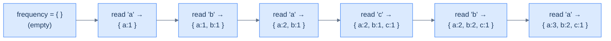
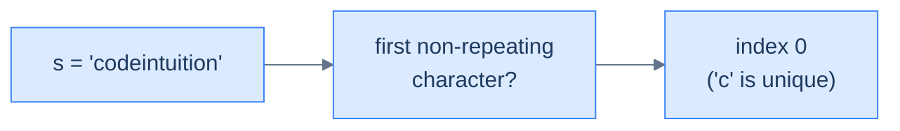
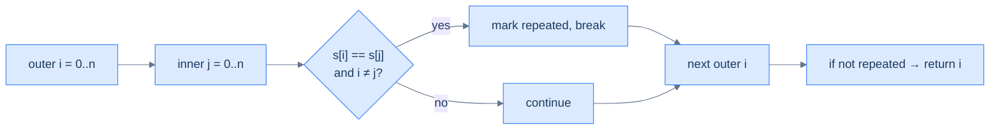
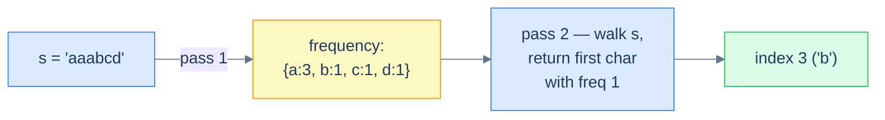
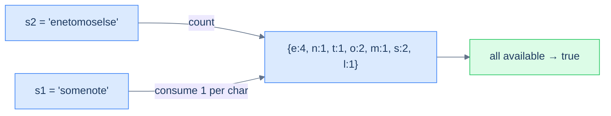
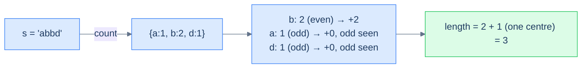
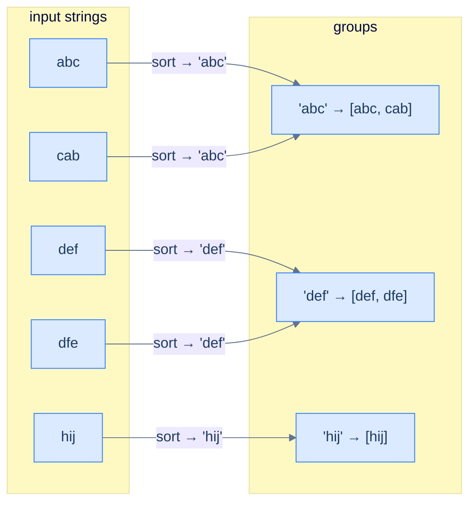

# 6. Pattern: Counting

## The Hook

You're at a table tennis tournament. Someone screams "QUICK — was 'paragraph' the word that appeared the most in today's commentary?" You have a 30-minute transcript and 30 seconds to answer. Option A: re-read the whole transcript counting every word manually — at the rate of 1 word per second, you'd finish in 30 minutes you don't have. Option B: scan once, building a tally `{word → count}` as you go. By the time you finish reading, the answer is *already in the tally* — one peek and you're done.

That tally is a **hash map of frequencies**, and the technique of building it in a single linear pass is the **counting pattern**. It's the simplest, most-used trick in the hash-table playbook — the one that turns nested loops into single passes, that solves "is this an anagram?" in O(n) instead of O(n log n), that powers spell-checkers, plagiarism detectors, ad click counters, and the first 30 minutes of every interview.

The pattern is so plain it almost looks like cheating: *traverse once, record what you see, then answer the question*. But the first time you watch an O(n²) brute-force solution collapse into an O(n) one because you swapped a "search again" for "look in the hash map", you'll feel the click. Everything in this lesson is a variation on that single move.

---

## Table of contents

1. [Understanding the counting pattern](#understanding-the-counting-pattern)
2. [Identifying the counting pattern](#identifying-the-counting-pattern)
3. [First non repeating character](#first-non-repeating-character)
4. [Constructibility check](#constructibility-check)
5. [Anagram checker](#anagram-checker)
6. [Build palindrome](#build-palindrome)
7. [Cluster anagrams](#cluster-anagrams)

***

# Understanding the counting pattern

Some problems hand you a *sequence* — an array, a string, a linked list — and ask you something whose answer depends on **how often** each item appears. "Which character is unique?" "Can string A be rearranged into string B?" "How many anagrams in this list?" The naïve approach is to walk the sequence twice (or N times), comparing items to each other and racking up O(N²) work. The clever approach is to walk *once*, building a hash map from item to frequency. After that single pass, the question collapses into a constant-time lookup.

```d2
direction: right

inp: Input array {
  grid-columns: 6
  grid-gap: 0
  a0: "a"
  a1: "b"
  a2: "a"
  a3: "c"
  a4: "b"
  a5: "a"
}

map: frequency map {
  m1: "'a' -> 3"
  m2: "'b' -> 2"
  m3: "'c' -> 1"
}

inp -> map: single pass
```

<p align="center"><strong>The counting technique — one linear sweep over the input builds a complete frequency map. After this single pass, every "how often did X appear?" question is a constant-time lookup.</strong></p>

## Counting technique

The mechanism is almost embarrassingly simple. Initialise an empty hash map `frequency`. Walk the sequence; for each item, increment `frequency[item]`. When the walk ends, the map holds the count of every distinct item.



<p align="center"><strong>The counting technique unrolled — each character read updates one entry in the map. Hash-map insert and update are amortised O(1), so the whole pass costs O(N).</strong></p>

A subtle but important point: the counting technique *rarely* solves a problem outright. Its job is to **build the input** that the rest of your algorithm consumes. A well-built frequency map turns a problem into a tally-inspection puzzle, but it's still up to you to ask the right question of it.

## Algorithm

> **Algorithm**
>
> -   **Step 1:** Initialise an empty map `frequency` from item to integer.
> -   **Step 2:** For each item in the sequence:
>     -   **Step 2.1:** If the item exists in `frequency`, increment its value. Otherwise set it to 1.

## Implementation

The generic counting helper — one function we'll lean on in every problem in this lesson.


```python run
def count_frequency(self, s: str) -> Dict[str, int]:
    # Initialize a hash map to map a character to its frequency
    frequency = defaultdict(int)

    # Traverse the string and store the frequency of each character in a hash map
    for ch in s:
        frequency[ch] = frequency.get(ch, 0) + 1

    return frequency
```

```java run

class Solution {
    public Map<Character, Integer> countFrequency(String s) {
        // Initialize a hash map to map a character to its frequency
        Map<Character, Integer> frequency = new HashMap<>();

        // Traverse the string and store the frequency of each character in a hash map
        for (char ch : s.toCharArray()) {
            frequency.put(ch, frequency.getOrDefault(ch, 0) + 1);
        }

        return frequency;
    }
}
```


## Complexity Analysis

The single-pass nature is the entire story. We touch each item once; each touch costs amortised O(1) hash-map work; total is **O(N)** time. Space is bounded by the number of *distinct* items we see — best case O(1) when everything is the same character, worst case O(N) when every item is unique.

> **Best case** — only one unique item
>
> -   Time: **O(N)** | Space: **O(1)**
>
> **Worst case** — every item unique
>
> -   Time: **O(N)** | Space: **O(N)**

> *Predict before reading on — the brute-force "for each character, scan again to count it" is O(N²). Counting builds the map once and looks up answers in O(1). When does the constant factor matter? At what input size does the difference start to dominate?*

***

# Identifying the counting pattern

The counting technique fits **easy-to-medium** problems on arrays or strings where the answer depends on the *occurrences* of items — how many times each appears, whether two collections have matching multisets, whether one is a subset of another, and so on. Most of these problems share a single template.

**Template:**
> Given an iterable sequence of data, compute its frequency map and use the map to answer the question.

If you can rephrase a problem as "first build the count of X, then answer Y from it", counting is the right tool.

## Example

Let's drill the pattern with one canonical problem.

> **Problem statement:** Given a string `s`, return the index of the first non-repeating character. Return -1 if no such character exists.



<p align="center"><strong>The "first non-repeating character" problem in one sentence — return the index of the first character whose count in <code>s</code> is 1.</strong></p>

### Brute force solution

The most direct approach: for each character, scan the rest of the string and check whether it repeats.



<p align="center"><strong>Brute-force flow — nested loops compare every character to every other, giving O(N²) time. Acceptable for tiny strings, prohibitive for anything realistic.</strong></p>


```python run
def first_non_repeating_brute(s: str) -> int:
    n = len(s)
    for i in range(n):
        repeated = False
        for j in range(n):
            # Skip self-comparison; check every other index
            if i != j and s[i] == s[j]:
                repeated = True
                break
        if not repeated:
            return i
    return -1

print(first_non_repeating_brute("codeintuition"))   # 0
print(first_non_repeating_brute("aaabcd"))          # 3
print(first_non_repeating_brute("aaabbccdd"))       # -1
```

```java run
public class Main {
    static int firstNonRepeatingBrute(String s) {
        for (int i = 0; i < s.length(); i++) {
            boolean repeated = false;
            for (int j = 0; j < s.length(); j++) {
                if (i != j && s.charAt(i) == s.charAt(j)) { repeated = true; break; }
            }
            if (!repeated) return i;
        }
        return -1;
    }
    public static void main(String[] args) {
        System.out.println(firstNonRepeatingBrute("codeintuition"));   // 0
        System.out.println(firstNonRepeatingBrute("aaabcd"));          // 3
        System.out.println(firstNonRepeatingBrute("aaabbccdd"));       // -1
    }
}
```


The brute-force approach is **O(N²)** time. Tolerable up to a few thousand characters; brutal beyond that.

### Counting technique solution

Now the same problem with the counting pattern:

1. Build the frequency map of every character in `s` (one pass).
2. Walk `s` again from the start; return the first index whose character has frequency 1.



<p align="center"><strong>Counting solution — first build the freq map (one pass), then walk <code>s</code> a second time looking up each character. Two linear passes total: O(N).</strong></p>


```python run
from collections import defaultdict

def first_non_repeating(s: str) -> int:
    # Pass 1 — build frequency map
    frequency = defaultdict(int)
    for ch in s: frequency[ch] += 1
    # Pass 2 — find first char with count == 1
    for i, ch in enumerate(s):
        if frequency[ch] == 1: return i
    return -1

print(first_non_repeating("codeintuition"))   # 0
print(first_non_repeating("aaabcd"))          # 3
print(first_non_repeating("aaabbccdd"))       # -1
```

```java run
import java.util.*;

public class Main {
    static int firstNonRepeating(String s) {
        Map<Character, Integer> freq = new HashMap<>();
        for (char ch : s.toCharArray())
            freq.put(ch, freq.getOrDefault(ch, 0) + 1);
        for (int i = 0; i < s.length(); i++)
            if (freq.get(s.charAt(i)) == 1) return i;
        return -1;
    }
    public static void main(String[] args) {
        System.out.println(firstNonRepeating("codeintuition"));   // 0
        System.out.println(firstNonRepeating("aaabcd"));          // 3
        System.out.println(firstNonRepeating("aaabbccdd"));       // -1
    }
}
```


Two linear passes — **O(N)** time, **O(N)** space. The trade is unambiguous: spend O(N) extra memory to drop time from quadratic to linear. On any realistic input this is a no-brainer.

## Example problems

The five problems below cover the spectrum of "easy-to-medium" counting problems. Each is a different shape — uniqueness, subset-of, multiset-equality, palindromicity, grouping — but every solution is a variation on *build the frequency map first, then ask the question*.

> -   First non-repeating character
> -   Constructibility check
> -   Anagram checker
> -   Build palindrome
> -   Cluster anagrams

***

# First non repeating character

## Problem Statement

Given a string `s`, find and return the index of the first non-repeating character. Return `-1` if no such character exists.

### Example 1
> -   **Input:** `s = "codeintuition"`
> -   **Output:** `0`
> -   **Explanation:** `'c'` is the first non-repeating character.

### Example 2
> -   **Input:** `s = "aaabcd"`
> -   **Output:** `3`
> -   **Explanation:** `'b'` is the first non-repeating character.

### Example 3
> -   **Input:** `s = "aaabbccdd"`
> -   **Output:** `-1`
> -   **Explanation:** No character appears exactly once.

<details>
<summary><h2>Solution</h2></summary>


Two passes: build the frequency map, then re-walk to find the first frequency-1 character.


```python run
from collections import defaultdict
from typing import Dict

class Solution:
    def count_frequency(self, s: str) -> Dict[str, int]:
        frequency = defaultdict(int)

        # Traverse the string and store the frequency of each character
        # in a hash map
        for ch in s:
            frequency[ch] = frequency.get(ch, 0) + 1

        return frequency

    def first_non_repeating_character(self, s: str) -> int:

        # Create a map to store the frequency of each character in the
        # string
        frequency = self.count_frequency(s)

        # Traverse the string again and return the index of the first
        # non-repeating character
        for i, ch in enumerate(s):
            if frequency[ch] == 1:
                return i

        return -1


# Examples from the problem statement
print(Solution().first_non_repeating_character("codeintuition"))  # 0
print(Solution().first_non_repeating_character("aaabcd"))         # 3
print(Solution().first_non_repeating_character("aaabbccdd"))      # -1

# Edge cases
print(Solution().first_non_repeating_character(""))               # -1
print(Solution().first_non_repeating_character("a"))              # 0
print(Solution().first_non_repeating_character("aabb"))           # -1
print(Solution().first_non_repeating_character("abcabc"))         # -1
print(Solution().first_non_repeating_character("abcd"))           # 0
```

```java run
import java.util.*;

public class Main {
    static class Solution {
        private Map<Character, Integer> countFrequency(String s) {
            Map<Character, Integer> frequency = new HashMap<>();

            // Traverse the string and store the frequency of each character
            // in a hash map
            for (char ch : s.toCharArray()) {
                frequency.put(ch, frequency.getOrDefault(ch, 0) + 1);
            }

            return frequency;
        }

        public int firstNonRepeatingCharacter(String s) {

            // Create a map to store the frequency of each character in the
            // string
            Map<Character, Integer> frequency = countFrequency(s);

            // Traverse the string again and return the index of the first
            // non-repeating character
            for (int i = 0; i < s.length(); i++) {
                if (frequency.get(s.charAt(i)) == 1) {
                    return i;
                }
            }

            return -1;
        }
    }

    public static void main(String[] args) {
        // Examples from the problem statement
        System.out.println(new Solution().firstNonRepeatingCharacter("codeintuition")); // 0
        System.out.println(new Solution().firstNonRepeatingCharacter("aaabcd"));        // 3
        System.out.println(new Solution().firstNonRepeatingCharacter("aaabbccdd"));     // -1

        // Edge cases
        System.out.println(new Solution().firstNonRepeatingCharacter(""));              // -1
        System.out.println(new Solution().firstNonRepeatingCharacter("a"));             // 0
        System.out.println(new Solution().firstNonRepeatingCharacter("aabb"));          // -1
        System.out.println(new Solution().firstNonRepeatingCharacter("abcabc"));        // -1
        System.out.println(new Solution().firstNonRepeatingCharacter("abcd"));          // 0
    }
}
```

</details>


***

# Constructibility check

## Problem Statement

Given two strings `s1` and `s2`, return `true` if `s1` can be constructed using the letters from `s2` (each letter usable at most once). Return `false` otherwise.

### Example 1
> -   **Input:** `s1 = "somenote", s2 = "enetomoselse"`
> -   **Output:** `true`

### Example 2
> -   **Input:** `s1 = "thief", s2 = "hifacqet"`
> -   **Output:** `true`

### Example 3
> -   **Input:** `s1 = "alpha", s2 = "beta"`
> -   **Output:** `false`

<details>
<summary><h2>Approach</h2></summary>


Build the frequency map of `s2`. Then walk `s1`; for each character, *consume* one from the map by decrementing it. If any character's count drops to zero (or below) while we still need it, `s2` doesn't have enough letters — return `false`.



<p align="center"><strong>Constructibility — the s2 frequency map is the "available letters" pool. Walking s1 consumes from the pool. If you ever try to consume a letter that's exhausted, the build fails.</strong></p>

</details>
<details>
<summary><h2>Solution</h2></summary>


```python run
from collections import defaultdict
from typing import Dict

class Solution:
    def count_frequency(self, s: str) -> Dict[str, int]:
        frequency = defaultdict(int)
        for ch in s:
            frequency[ch] += 1

        return frequency

    def constructibility_check(self, s1: str, s2: str) -> bool:

        # Create a map to store the frequency of each character in s2
        s2_frequency = self.count_frequency(s2)

        # Iterate over the characters in s1
        for ch in s1:

            # If the frequency of the character is zero, return False
            if s2_frequency.get(ch, 0) == 0:
                return False

            # Decrement the frequency of the character in the map
            s2_frequency[ch] -= 1

        # If all characters in s1 can be constructed from s2, return True
        return True


# Examples from the problem statement
print(Solution().constructibility_check("somenote", "enetomoselse"))  # True
print(Solution().constructibility_check("thief", "hifacqet"))         # True
print(Solution().constructibility_check("alpha", "beta"))             # False

# Edge cases
print(Solution().constructibility_check("", "abc"))                   # True
print(Solution().constructibility_check("a", ""))                     # False
print(Solution().constructibility_check("aa", "a"))                   # False
print(Solution().constructibility_check("a", "a"))                    # True
print(Solution().constructibility_check("abc", "abc"))                # True
```

```java run
import java.util.*;

public class Main {
    static class Solution {
        private Map<Character, Integer> countFrequency(String s) {
            Map<Character, Integer> frequency = new HashMap<>();
            for (char ch : s.toCharArray()) {
                frequency.put(ch, frequency.getOrDefault(ch, 0) + 1);
            }

            return frequency;
        }

        public boolean constructibilityCheck(String s1, String s2) {

            // Create a map to store the frequency of each character in s2
            Map<Character, Integer> s2Frequency = countFrequency(s2);

            // Iterate over the characters in s1
            for (char ch : s1.toCharArray()) {

                // If the frequency of the character is zero, return false
                if (s2Frequency.getOrDefault(ch, 0) == 0) {
                    return false;
                }

                // Decrement the frequency of the character in the map
                s2Frequency.put(ch, s2Frequency.get(ch) - 1);
            }

            // If all characters in s1 can be constructed from s2, return
            // true
            return true;
        }
    }

    public static void main(String[] args) {
        // Examples from the problem statement
        System.out.println(new Solution().constructibilityCheck("somenote", "enetomoselse")); // true
        System.out.println(new Solution().constructibilityCheck("thief", "hifacqet"));        // true
        System.out.println(new Solution().constructibilityCheck("alpha", "beta"));            // false

        // Edge cases
        System.out.println(new Solution().constructibilityCheck("", "abc"));                  // true
        System.out.println(new Solution().constructibilityCheck("a", ""));                    // false
        System.out.println(new Solution().constructibilityCheck("aa", "a"));                  // false
        System.out.println(new Solution().constructibilityCheck("a", "a"));                   // true
        System.out.println(new Solution().constructibilityCheck("abc", "abc"));               // true
    }
}
```


**Complexity:** O(|s1| + |s2|) time, O(unique chars in s2) space.

</details>

***

# Anagram checker

## Problem Statement

Given two strings `s` and `p`, return `true` if `p` is an anagram of `s` (same multiset of characters), else `false`.

### Example 1
> -   **Input:** `s = "codeintuition", p = "cdoenoitiutni"`
> -   **Output:** `true`

### Example 2
> -   **Input:** `s = "abc", p = "ade"`
> -   **Output:** `false`

### Example 3
> -   **Input:** `s = "abcdef", p = "dfecba"`
> -   **Output:** `true`

<details>
<summary><h2>Approach</h2></summary>


Anagrams have the same length and the same character frequency map. Build the frequency of `s`, then walk `p` and decrement; if any character is missing or counts disagree, return `false`. The map ends empty iff the two are anagrams.

> *Mental shortcut* — anagram checking is "does the multiset match?". The frequency map *is* the multiset.

</details>
<details>
<summary><h2>Solution</h2></summary>


```python run
from collections import defaultdict
from typing import Dict

class Solution:
    def count_frequency(self, s: str) -> Dict[str, int]:
        frequency = defaultdict(int)
        for ch in s:
            frequency[ch] += 1

        return frequency

    def anagram_checker(self, s: str, t: str) -> bool:

        # If the strings are of different lengths, they cannot be
        # anagrams
        if len(s) != len(t):
            return False

        # Create a map to store the frequency of each character in the
        # first string
        s_frequency = self.count_frequency(s)

        # Traverse the second string and decrement the frequency of each
        # character in the hash map
        for ch in t:
            if ch not in s_frequency:
                return False

            s_frequency[ch] -= 1
            if s_frequency[ch] == 0:
                del s_frequency[ch]

        return len(s_frequency) == 0


# Examples from the problem statement
print(Solution().anagram_checker("codeintuition", "cdoenoitiutni"))  # True
print(Solution().anagram_checker("abc", "ade"))                      # False
print(Solution().anagram_checker("abcdef", "dfecba"))                # True

# Edge cases
print(Solution().anagram_checker("", ""))                            # True
print(Solution().anagram_checker("a", "a"))                          # True
print(Solution().anagram_checker("a", "b"))                          # False
print(Solution().anagram_checker("ab", "a"))                         # False
print(Solution().anagram_checker("aab", "baa"))                      # True
```

```java run
import java.util.*;

public class Main {
    static class Solution {
        private Map<Character, Integer> countFrequency(String s) {
            Map<Character, Integer> frequency = new HashMap<>();
            for (char ch : s.toCharArray()) {
                frequency.put(ch, frequency.getOrDefault(ch, 0) + 1);
            }

            return frequency;
        }

        public boolean anagramChecker(String s, String t) {

            // If the strings are of different lengths, they cannot be
            // anagrams
            if (s.length() != t.length()) {
                return false;
            }

            // Create a map to store the frequency of each character in the
            // first string
            Map<Character, Integer> sFrequency = countFrequency(s);

            // Traverse the second string and decrement the frequency of each
            // character in the hash map
            for (char ch : t.toCharArray()) {
                if (!sFrequency.containsKey(ch)) {
                    return false;
                }

                sFrequency.put(ch, sFrequency.get(ch) - 1);
                if (sFrequency.get(ch) == 0) {
                    sFrequency.remove(ch);
                }
            }

            return sFrequency.isEmpty();
        }
    }

    public static void main(String[] args) {
        // Examples from the problem statement
        System.out.println(new Solution().anagramChecker("codeintuition", "cdoenoitiutni")); // true
        System.out.println(new Solution().anagramChecker("abc", "ade"));                     // false
        System.out.println(new Solution().anagramChecker("abcdef", "dfecba"));               // true

        // Edge cases
        System.out.println(new Solution().anagramChecker("", ""));                           // true
        System.out.println(new Solution().anagramChecker("a", "a"));                         // true
        System.out.println(new Solution().anagramChecker("a", "b"));                         // false
        System.out.println(new Solution().anagramChecker("ab", "a"));                        // false
        System.out.println(new Solution().anagramChecker("aab", "baa"));                     // true
    }
}
```

</details>


***

# Build palindrome

## Problem Statement

Given a case-sensitive string `s`, return the length of the **longest palindrome** that can be built using all or some of its letters.

### Example 1
> -   **Input:** `s = "AaAaBbBbc"`
> -   **Output:** `9`
> -   **Explanation:** Use every character — e.g. `"BAabcbaAB"`.

### Example 2
> -   **Input:** `s = "abbd"`
> -   **Output:** `3`
> -   **Explanation:** `"bab"` or `"bdb"`.

### Example 3
> -   **Input:** `s = "abc"`
> -   **Output:** `1`

<details>
<summary><h2>Approach</h2></summary>


A palindrome reads the same forward and backward. Every character used in pairs contributes 2 to the length; **at most one** odd-count character can sit alone in the middle. So:

1. Count each character's frequency.
2. For each frequency: if **even**, add it all; if **odd**, add `count − 1` (the largest even part) and remember we saw an odd.
3. If any odd count was seen, add 1 (one character can sit in the middle).



<p align="center"><strong>Build palindrome — every even-frequency character contributes fully; odd-frequency characters contribute (count − 1); a single bonus +1 for the optional middle character.</strong></p>

</details>
<details>
<summary><h2>Solution</h2></summary>


```python run
from collections import defaultdict
from typing import Dict

class Solution:
    def count_frequency(self, s: str) -> Dict[str, int]:
        frequency = defaultdict(int)
        for ch in s:
            frequency[ch] += 1

        return frequency

    def build_palindrome(self, s: str) -> int:

        # Create a map to store the frequency of each character in the
        # string
        frequency = self.count_frequency(s)

        # Initialize the length of the longest palindrome
        length = 0

        # Initialize a boolean flag to check if there are odd counts of
        # characters
        odd = False

        # Iterate over the map to calculate the length of the longest
        # palindrome
        for count in frequency.values():

            # If the count of the character is even, add it to the length
            if count % 2 == 0:
                length += count

            # If the count of the character is odd, add the count minus
            # one to the length and set the odd flag to true
            else:
                length += count - 1
                odd = True

        # If there are odd counts of characters, add one to the length
        return length + 1 if odd else length


# Examples from the problem statement
print(Solution().build_palindrome("AaAaBbBbc"))  # 9
print(Solution().build_palindrome("abbd"))       # 3
print(Solution().build_palindrome("abc"))        # 1

# Edge cases
print(Solution().build_palindrome(""))           # 0
print(Solution().build_palindrome("a"))          # 1
print(Solution().build_palindrome("aa"))         # 2
print(Solution().build_palindrome("aabb"))       # 4
print(Solution().build_palindrome("aaaa"))       # 4
```

```java run
import java.util.*;

public class Main {
    static class Solution {
        private Map<Character, Integer> countFrequency(String s) {
            Map<Character, Integer> frequency = new HashMap<>();
            for (char ch : s.toCharArray()) {
                frequency.put(ch, frequency.getOrDefault(ch, 0) + 1);
            }

            return frequency;
        }

        public int buildPalindrome(String s) {

            // Create a map to store the frequency of each character in the
            // string
            Map<Character, Integer> frequency = countFrequency(s);

            // Initialize the length of the longest palindrome
            int length = 0;

            // Initialize a boolean flag to check if there are odd counts of
            // characters
            boolean odd = false;

            // Iterate over the map to calculate the length of the longest
            // palindrome
            for (var entry : frequency.entrySet()) {

                // If the count of the character is even, add it to the
                // length
                if (entry.getValue() % 2 == 0) {
                    length += entry.getValue();
                }

                // If the count of the character is odd, add the count minus
                // one to the length and set the odd flag to true
                else {
                    length += entry.getValue() - 1;
                    odd = true;
                }
            }

            // If there are odd counts of characters, add one to the length
            return odd ? length + 1 : length;
        }
    }

    public static void main(String[] args) {
        // Examples from the problem statement
        System.out.println(new Solution().buildPalindrome("AaAaBbBbc")); // 9
        System.out.println(new Solution().buildPalindrome("abbd"));      // 3
        System.out.println(new Solution().buildPalindrome("abc"));       // 1

        // Edge cases
        System.out.println(new Solution().buildPalindrome(""));          // 0
        System.out.println(new Solution().buildPalindrome("a"));         // 1
        System.out.println(new Solution().buildPalindrome("aa"));        // 2
        System.out.println(new Solution().buildPalindrome("aabb"));      // 4
        System.out.println(new Solution().buildPalindrome("aaaa"));      // 4
    }
}
```

</details>


***

# Cluster anagrams

## Problem Statement

Given an array of strings `strs`, group all anagrams together. Return the groups in any order.

### Example 1
> -   **Input:** `["abc", "cab", "def", "dfe", "hij"]`
> -   **Output:** `[["abc", "cab"], ["def", "dfe"], ["hij"]]`

### Example 2
> -   **Input:** `["a", "b", "c", "d", "e"]`
> -   **Output:** `[["a"], ["b"], ["c"], ["d"], ["e"]]`

### Example 3
> -   **Input:** `[]`
> -   **Output:** `[]`

<details>
<summary><h2>Approach</h2></summary>


Two strings are anagrams iff their character frequency maps match. So the **frequency tuple itself** is a perfect grouping key — any two anagrams produce the same key. Build a hash map from frequency-key to list of strings.

For lowercase-only inputs, a 26-element tuple `(count_a, count_b, …, count_z)` is the cleanest key. For the general case, the **sorted string** (e.g. `"cab"` → `"abc"`) is an equivalent key — anagrams sort to the same canonical form.



<p align="center"><strong>Cluster anagrams — the canonical form (sorted letters or letter-frequency tuple) is the same for every anagram, so anagrams collide into the same hash-map bucket. The buckets <em>are</em> the groups.</strong></p>

</details>
<details>
<summary><h2>Solution</h2></summary>


```python run
from typing import List, Tuple

class Solution:
    def count_frequency(self, str: str) -> List[int]:

        # Initialize frequency list for 26 letters
        frequency = [0] * 26
        for c in str:

            # Increment the count for each character
            frequency[ord(c) - ord("a")] += 1
        return frequency

    def cluster_anagrams(self, strs: List[str]) -> List[List[str]]:

        # Map to store character frequency lists as keys and lists of
        # indices as values
        frequency_groups = {}

        # Populate the frequency_groups with indices of strings grouped
        # by character frequencies
        for i, s in enumerate(strs):

            # Count the frequency of each character in the string
            frequency = self.count_frequency(s)

            # Group strings with the same frequency list by storing
            # their indices
            if tuple(frequency) not in frequency_groups:
                frequency_groups[tuple(frequency)] = []
            frequency_groups[tuple(frequency)].append(i)

        # Collect grouped anagrams into the result list
        result = []

        # Iterate over each group of indices in frequencyGroups
        for entry in frequency_groups.items():
            anagram_group = []
            for index in entry[1]:

                # Use the index to get the original string and add it to
                # the anagram group
                anagram_group.append(strs[index])

            # Add the anagram group to the result
            result.append(anagram_group)
        return result


# Examples from the problem statement
r1 = Solution().cluster_anagrams(["abc", "cab", "def", "dfe", "hij"])
print(sorted([sorted(g) for g in r1]))   # [['abc', 'cab'], ['def', 'dfe'], ['hij']]

r2 = Solution().cluster_anagrams(["a", "b", "c", "d", "e"])
print(sorted([sorted(g) for g in r2]))   # [['a'], ['b'], ['c'], ['d'], ['e']]

print(Solution().cluster_anagrams([]))   # []

# Edge cases
r4 = Solution().cluster_anagrams(["eat", "tea", "tan", "ate", "nat", "bat"])
print(sorted([sorted(g) for g in r4]))   # [['ate', 'eat', 'tea'], ['bat'], ['nat', 'tan']]

r5 = Solution().cluster_anagrams(["a"])
print(r5)                                # [['a']]
```

```java run
import java.util.*;
import java.util.stream.*;

public class Main {
    static class Solution {
        private List<Integer> countFrequency(String str) {

            // Initialize frequency list for 26 letters
            List<Integer> frequency = new ArrayList<>(
                Collections.nCopies(26, 0)
            );
            for (char c : str.toCharArray()) {

                // Increment the count for each character
                frequency.set(c - 'a', frequency.get(c - 'a') + 1);
            }
            return frequency;
        }

        public List<List<String>> clusterAnagrams(String[] strs) {

            // Map to store character frequency lists as keys and lists of
            // indices as values
            Map<List<Integer>, List<Integer>> frequencyGroups =
                new HashMap<>();

            // Populate the frequencyGroups with indices of strings grouped
            // by character frequencies
            for (int i = 0; i < strs.length; i++) {

                // Count the frequency of each character in the string
                List<Integer> frequency = countFrequency(strs[i]);

                // Group strings with the same frequency list by storing
                // their indices
                frequencyGroups.put(
                    frequency,
                    frequencyGroups.getOrDefault(
                        frequency,
                        new ArrayList<>()
                    )
                );
                frequencyGroups.get(frequency).add(i);
            }

            // Collect grouped anagrams into the result array
            List<List<String>> result = new ArrayList<>();

            // Iterate over each group of indices in frequencyGroups
            for (List<Integer> indices : frequencyGroups.values()) {

                // Use the index to get the original string and add it to
                // the anagram group
                List<String> anagramGroup = indices
                    .stream()
                    .map(i -> strs[i])
                    .collect(Collectors.toList());

                // Add the anagram group to the result
                result.add(anagramGroup);
            }

            return result;
        }
    }

    public static void main(String[] args) {
        // Examples from the problem statement
        var r1 = new Solution().clusterAnagrams(new String[]{"abc", "cab", "def", "dfe", "hij"});
        r1.forEach(g -> { Collections.sort(g); System.out.print(g + " "); }); System.out.println();
        // [abc, cab] [def, dfe] [hij] (order of groups may vary)

        var r2 = new Solution().clusterAnagrams(new String[]{"a", "b", "c", "d", "e"});
        r2.forEach(g -> System.out.print(g + " ")); System.out.println();
        // [a] [b] [c] [d] [e] (order may vary)

        var r3 = new Solution().clusterAnagrams(new String[]{});
        System.out.println(r3);  // []

        // Edge cases
        var r4 = new Solution().clusterAnagrams(new String[]{"eat", "tea", "tan", "ate", "nat", "bat"});
        r4.forEach(g -> { Collections.sort(g); System.out.print(g + " "); }); System.out.println();
        // [ate, eat, tea] [nat, tan] [bat] (order of groups may vary)

        var r5 = new Solution().clusterAnagrams(new String[]{"a"});
        System.out.println(r5);  // [[a]]
    }
}
```


**Complexity:** O(N · K) where N is the number of strings and K is the average length — this implementation builds a 26-element frequency tuple per string, which costs O(K) and avoids the O(K log K) of sorting each string.

</details>
<details>
<summary><h2>Final Takeaway</h2></summary>


Counting is the gateway pattern of hash-table problem solving. The **template** — *build a frequency map first, then answer the question* — is so common that you'll see it in dozens of interview problems and hundreds of production codebases. Five lessons in one paragraph:

- **Trade space for time.** O(N) memory buys you O(N) time when the alternative is O(N²).
- **A hash map *is* a multiset.** Anagram, equality, subset-of, palindrome-buildability — all reduce to multiset comparisons that the map handles in two lines.
- **Pick the right key.** Sometimes the key is the item itself; sometimes it's a *canonical form* (sorted string, frequency tuple) that collapses many inputs to one.
- **Two passes are usually enough.** First pass builds the map; second pass uses it. Resist the urge to do everything in one loop — clarity beats cleverness.
- **Counting rarely solves the problem alone.** It builds the *input* to the rest of your algorithm. The map is a tool, not the answer.

> *Coming up — the **key-generation pattern**. Counting answers "how often did X appear?". Key generation answers "have I seen *something equivalent to* X before?" — where "equivalent" means *the same key under some canonical transformation*. We just used it to cluster anagrams (sorted-string key); the next lesson generalises it to deduplication, isomorphism checks, and a host of "is this the same as that?" problems.*

</details>