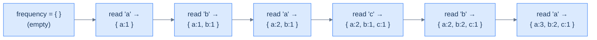
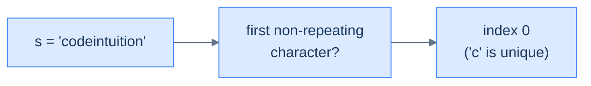
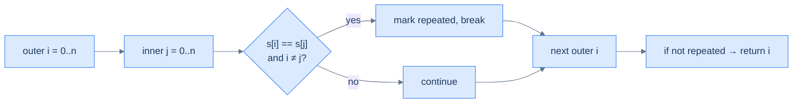
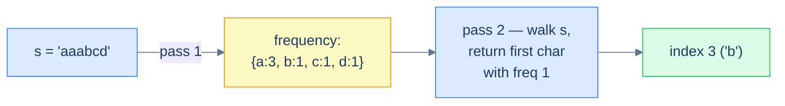

# Understanding the counting pattern

Some problems hand you a *sequence* — an array, a string, a linked list — and ask you something whose answer depends on **how often** each item appears. "Which character is unique?" "Can string A be rearranged into string B?" "How many anagrams in this list?" The naïve approach is to walk the sequence twice (or N times), comparing items to each other and racking up O(N²) work. The clever approach is to walk *once*, building a hash map from item to frequency. After that single pass, the question collapses into a constant-time lookup.

> 🖼 Diagram — The counting technique — one linear sweep over the input builds a complete frequency map. After this single pass, every "how often did X appear?" question is a constant-time lookup.
```d2
direction: right

inp: Input array {
  grid-columns: 6
  grid-gap: 0
  a0: "a"
  a1: "b"
  a2: "a"
  a3: "c"
  a4: "b"
  a5: "a"
}

map: frequency map {
  m1: "'a' -> 3"
  m2: "'b' -> 2"
  m3: "'c' -> 1"
}

inp -> map: single pass
```

<p align="center"><strong>The counting technique — one linear sweep over the input builds a complete frequency map. After this single pass, every "how often did X appear?" question is a constant-time lookup.</strong></p>

## Why Naive Isn't Enough

The obvious move is to compare items to each other directly. For "which character is unique?" you take each character and scan the rest of the string for a match. The answer is correct, but the cost is the problem.

Direct comparison pays a quadratic price. Each item triggers a fresh scan of the whole sequence, so the work is `n + (n−1) + … + 1`, which is `O(n²)` time for `O(1)` extra space. The clock dominates the moment the input grows past a few thousand items.

To make this concrete: on `"aaabbccdd"` the naive scan checks `'a'` against all 9 characters, then `'a'` again, then `'a'` again — re-deriving the same count three times before it even reaches `'b'`. The algorithm never remembers what an earlier scan already established, so it keeps re-counting items it has already seen.

So the key idea is: re-deriving each item's count on demand throws away work, and a single pass that records every count up front replaces all those repeated scans with one lookup.

## The Core Idea

The fix is to count everything once, then answer questions against the counts. Walk the sequence a single time and build a hash map from each item to the number of times it appears.

A frequency map turns a comparison problem into a tally-inspection problem. Instead of asking "does this item appear elsewhere?" by re-scanning, you ask "what is this item's count?" by reading one map entry in amortised `O(1)` time. The map captures the *whole* distribution of the input in one structure, so any occurrence-based question becomes a lookup against it. So the core insight is: the hash map is a precomputed census of the input, and the rest of the algorithm only interrogates that census.

## How the Count Builds

Each item read triggers one move — find its current count, add one, store it back. The map only grows or updates per item; it never rewinds.

The map's invariant is exact at every step: after reading the first `k` items, `frequency` holds the precise count of each distinct item among those `k`. Three observations make the pass concrete:

- **An unseen item** starts at `1` — the map had no entry, so the increment creates one.
- **A repeat item** climbs by `1` — the existing count is read and overwritten.
- **The final map** is complete the instant the last item is read — no second aggregation pass is needed.

To make this concrete: reading `"abca"` walks `{} → {a:1} → {a:1,b:1} → {a:1,b:1,c:1} → {a:2,b:1,c:1}`. The second `'a'` finds the existing `1` and bumps it to `2`. The core insight is: because each read updates exactly one entry in amortised `O(1)`, the entire frequency map is built in a single `O(n)` sweep.

## Counting technique

The mechanism is almost embarrassingly simple. Initialise an empty hash map `frequency`. Walk the sequence; for each item, increment `frequency[item]`. When the walk ends, the map holds the count of every distinct item.

> 🖼 Diagram — The counting technique unrolled — each character read updates one entry in the map. Hash-map insert and update are amortised O(1), so the whole pass costs O(N).


<p align="center"><strong>The counting technique unrolled — each character read updates one entry in the map. Hash-map insert and update are amortised O(1), so the whole pass costs O(N).</strong></p>

A subtle but important point: the counting technique *rarely* solves a problem outright. Its job is to **build the input** that the rest of your algorithm consumes. A well-built frequency map turns a problem into a tally-inspection puzzle, but it's still up to you to ask the right question of it.

## Algorithm

> **Algorithm**
>
> -   **Step 1:** Initialise an empty map `frequency` from item to integer.
> -   **Step 2:** For each item in the sequence:
>     -   **Step 2.1:** If the item exists in `frequency`, increment its value. Otherwise set it to 1.

## Implementation

The generic counting helper — one function we'll lean on in every problem in this lesson.


```python run
def count_frequency(self, s: str) -> Dict[str, int]:
    # Initialize a hash map to map a character to its frequency
    frequency = defaultdict(int)

    # Traverse the string and store the frequency of each character in a hash map
    for ch in s:
        frequency[ch] = frequency.get(ch, 0) + 1

    return frequency
```

```java run

class Solution {
    public Map<Character, Integer> countFrequency(String s) {
        // Initialize a hash map to map a character to its frequency
        Map<Character, Integer> frequency = new HashMap<>();

        // Traverse the string and store the frequency of each character in a hash map
        for (char ch : s.toCharArray()) {
            frequency.put(ch, frequency.getOrDefault(ch, 0) + 1);
        }

        return frequency;
    }
}
```


## Complexity Analysis

The single-pass nature is the entire story. We touch each item once; each touch costs amortised O(1) hash-map work; total is **O(N)** time. Space is bounded by the number of *distinct* items we see — best case O(1) when everything is the same character, worst case O(N) when every item is unique.

> **Best case** — only one unique item
>
> -   Time: **O(N)** | Space: **O(1)**
>
> **Worst case** — every item unique
>
> -   Time: **O(N)** | Space: **O(N)**

> *Predict before reading on — the brute-force "for each character, scan again to count it" is O(N²). Counting builds the map once and looks up answers in O(1). When does the constant factor matter? At what input size does the difference start to dominate?*

## Variants / Taxonomy

The family splits along two independent axes — *what the count keys on* and *what question the map answers afterwards*:

- **Single-sequence tally.** Count items in one sequence, then read the counts — first-non-repeating, longest-palindrome buildability. The map *is* the answer source.
- **Two-sequence reconcile.** Count one sequence, then walk the second and decrement — constructibility, anagram equality. The map drains toward empty (or goes negative) to signal the verdict.
- **Value-keyed map.** The key is the item itself — a character, a number. This is the default when items compare directly.
- **Canonical-form-keyed map.** The key is a *derived* signature shared by many items — a sorted string or a 26-slot letter-count tuple groups anagrams together. Different inputs collide into the same bucket on purpose.

Every variant runs the identical build-then-query skeleton. The single/two-sequence axis only changes whether you increment or decrement; the value/canonical-form axis only changes what you hash on. The single-sequence value-keyed tally is the base case the other three specialise.

# Identifying the counting pattern

The counting technique fits **easy-to-medium** problems on arrays or strings where the answer depends on the *occurrences* of items — how many times each appears, whether two collections have matching multisets, whether one is a subset of another, and so on. Most of these problems share a single template.

**Template:**
> Given an iterable sequence of data, compute its frequency map and use the map to answer the question.

If you can rephrase a problem as "first build the count of X, then answer Y from it", counting is the right tool.

## Recognition Checklist

Four questions confirm a problem fits the counting pattern. If every answer is "yes," the build-then-query skeleton applies as-is.

1. **Does the answer depend on how *often* items appear, not on their order or position?** Uniqueness, multiset equality, subset-of, palindrome buildability all key on counts — not on where an item sits.
2. **Is the input a linear sequence — an array, string, or list?** The counting sweep walks one item at a time, so the input must be iterable end to end.
3. **Can the question be answered by *reading* the counts after one pass?** You build the map first, then inspect it; the count is an input to the answer, not the answer itself.
4. **Is the per-item work `O(1)` amortised?** Each item triggers one hash-map insert or update, so the whole pass is `O(n)` time.

These four questions reappear as the **Diagnostic Questions** table in every problem write-up that follows.

## Canonical Example

Walk a full problem end-to-end to see the pattern click into place.

### Problem Statement

> **Problem:** Given a string `s`, return the index of the first non-repeating character. Return `-1` if no such character exists.

Take `s = "aaabcd"`. The expected answer is `3` — `'b'` is the first character that appears exactly once.

> 🖼 Diagram — The "first non-repeating character" problem in one sentence — return the index of the first character whose count in s is 1.


<p align="center"><strong>The "first non-repeating character" problem in one sentence — return the index of the first character whose count in <code>s</code> is 1.</strong></p>

### Brute Force

The most direct approach: for each character, scan the rest of the string and check whether it repeats. Return the first index whose character matches nowhere else. It works, but each character triggers a full scan, so the cost is `O(N²)` time for `O(1)` extra space — quadratic and unusable past a few thousand characters.

> 🖼 Diagram — Brute-force flow — nested loops compare every character to every other, giving O(N²) time. Acceptable for tiny strings, prohibitive for anything realistic.


<p align="center"><strong>Brute-force flow — nested loops compare every character to every other, giving O(N²) time. Acceptable for tiny strings, prohibitive for anything realistic.</strong></p>


```python run
def first_non_repeating_brute(s: str) -> int:
    n = len(s)
    for i in range(n):
        repeated = False
        for j in range(n):
            # Skip self-comparison; check every other index
            if i != j and s[i] == s[j]:
                repeated = True
                break
        if not repeated:
            return i
    return -1

print(first_non_repeating_brute("codeintuition"))   # 0
print(first_non_repeating_brute("aaabcd"))          # 3
print(first_non_repeating_brute("aaabbccdd"))       # -1
```

```java run
public class Main {
    static int firstNonRepeatingBrute(String s) {
        for (int i = 0; i < s.length(); i++) {
            boolean repeated = false;
            for (int j = 0; j < s.length(); j++) {
                if (i != j && s.charAt(i) == s.charAt(j)) { repeated = true; break; }
            }
            if (!repeated) return i;
        }
        return -1;
    }
    public static void main(String[] args) {
        System.out.println(firstNonRepeatingBrute("codeintuition"));   // 0
        System.out.println(firstNonRepeatingBrute("aaabcd"));          // 3
        System.out.println(firstNonRepeatingBrute("aaabbccdd"));       // -1
    }
}
```


The brute-force approach is **O(N²)** time. Tolerable up to a few thousand characters; brutal beyond that.

### Key Insight

The repeated scans all re-derive the same fact: how many times a character appears. Compute that once for *every* character in a single pass, then the "is this unique?" test collapses to a count lookup. The core insight is: a frequency map answers every occurrence question in `O(1)`, so one `O(N)` build replaces `N` separate `O(N)` scans.

### Optimized Solution

Now the same problem with the counting pattern:

1. Build the frequency map of every character in `s` (one pass).
2. Walk `s` again from the start; return the first index whose character has frequency 1.

> 🖼 Diagram — Counting solution — first build the freq map (one pass), then walk s a second time looking up each character. Two linear passes total: O(N).


<p align="center"><strong>Counting solution — first build the freq map (one pass), then walk <code>s</code> a second time looking up each character. Two linear passes total: O(N).</strong></p>


```python run
from collections import defaultdict

def first_non_repeating(s: str) -> int:
    # Pass 1 — build frequency map
    frequency = defaultdict(int)
    for ch in s: frequency[ch] += 1
    # Pass 2 — find first char with count == 1
    for i, ch in enumerate(s):
        if frequency[ch] == 1: return i
    return -1

print(first_non_repeating("codeintuition"))   # 0
print(first_non_repeating("aaabcd"))          # 3
print(first_non_repeating("aaabbccdd"))       # -1
```

```java run
import java.util.*;

public class Main {
    static int firstNonRepeating(String s) {
        Map<Character, Integer> freq = new HashMap<>();
        for (char ch : s.toCharArray())
            freq.put(ch, freq.getOrDefault(ch, 0) + 1);
        for (int i = 0; i < s.length(); i++)
            if (freq.get(s.charAt(i)) == 1) return i;
        return -1;
    }
    public static void main(String[] args) {
        System.out.println(firstNonRepeating("codeintuition"));   // 0
        System.out.println(firstNonRepeating("aaabcd"));          // 3
        System.out.println(firstNonRepeating("aaabbccdd"));       // -1
    }
}
```


Two linear passes — **O(N)** time, **O(N)** space. The trade is unambiguous: spend O(N) extra memory to drop time from quadratic to linear. On any realistic input this is a no-brainer.

### Trace

Walk `s = "aaabcd"` — first build the frequency map in one pass, then re-scan for the earliest count-1 character:

```
pass 1 (build the map)
  a → 1   a → 2   a → 3   b → 1   c → 1   d → 1
  frequency = {a:3, b:1, c:1, d:1}

pass 2 (first index with count 1)
  i=0  s[0]='a'  freq 3 ≠ 1  skip
  i=1  s[1]='a'  freq 3 ≠ 1  skip
  i=2  s[2]='a'  freq 3 ≠ 1  skip
  i=3  s[3]='b'  freq 1 = 1  return 3

result = 3
```

The result `3` matches the expected output — `'b'` is the first character whose count is exactly `1`.

### Fitting the Template

| Check | Answer for First Non-Repeating Character |
|---|---|
| **Q1.** Does the answer depend on how *often* items appear? | **Yes** — "non-repeating" means count exactly `1`, a pure frequency test. |
| **Q2.** Is the input a linear sequence? | **Yes** — a string, walked character by character. |
| **Q3.** Can the answer be read off the counts after one pass? | **Yes** — build the map first, then re-scan and read each character's count. |
| **Q4.** Is the per-item work `O(1)` amortised? | **Yes** — each character is one hash-map increment, then one lookup. |

## Problems in This Category

The five problems below each specialise the build-then-query skeleton — only what the map keys on and what question it answers afterwards change:

| # | Problem | Variant | Twist on the skeleton |
|---|---|---|---|
| 1 | [First Non-Repeating Character](02-problems/01-first-non-repeating-character) | Single-sequence tally | Count once, re-scan for the first count-1 character |
| 2 | [Constructibility Check](02-problems/02-constructibility-check) | Two-sequence reconcile | Count `s2`, then drain it while walking `s1` |
| 3 | [Anagram Checker](02-problems/03-anagram-checker) | Two-sequence reconcile | Count `s`, decrement over `t`; the map must end empty |
| 4 | [Build Palindrome](02-problems/04-build-palindrome) | Single-sequence tally | Inspect each count's parity to size the longest palindrome |
| 5 | [Cluster Anagrams](02-problems/05-cluster-anagrams) | Canonical-form key | Hash on the 26-slot letter-count tuple so anagrams collide |

Each is a small variation on the same skeleton — only the key and the post-build question change.
