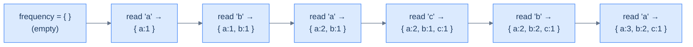
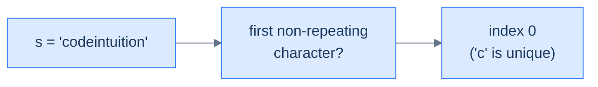
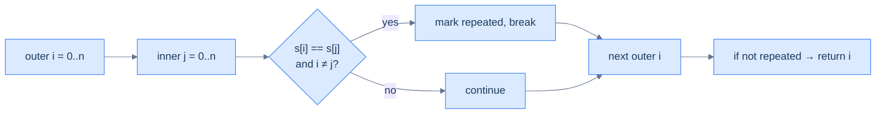
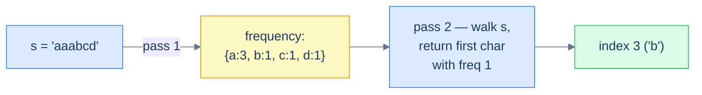

# Understanding the counting pattern

Some problems hand you a *sequence* — an array, a string, a linked list — and ask you something whose answer depends on **how often** each item appears. "Which character is unique?" "Can string A be rearranged into string B?" "How many anagrams in this list?" The naïve approach is to walk the sequence twice (or N times), comparing items to each other and racking up O(N²) work. The clever approach is to walk *once*, building a hash map from item to frequency. After that single pass, the question collapses into a constant-time lookup.

> 🖼 Diagram — The counting technique — one linear sweep over the input builds a complete frequency map. After this single pass, every "how often did X appear?" question is a constant-time lookup.
```d2
direction: right

inp: Input array {
  grid-columns: 6
  grid-gap: 0
  a0: "a"
  a1: "b"
  a2: "a"
  a3: "c"
  a4: "b"
  a5: "a"
}

map: frequency map {
  m1: "'a' -> 3"
  m2: "'b' -> 2"
  m3: "'c' -> 1"
}

inp -> map: single pass
```

<p align="center"><strong>The counting technique — one linear sweep over the input builds a complete frequency map. After this single pass, every "how often did X appear?" question is a constant-time lookup.</strong></p>

## Counting technique

The mechanism is almost embarrassingly simple. Initialise an empty hash map `frequency`. Walk the sequence; for each item, increment `frequency[item]`. When the walk ends, the map holds the count of every distinct item.

> 🖼 Diagram — The counting technique unrolled — each character read updates one entry in the map. Hash-map insert and update are amortised O(1), so the whole pass costs O(N).


<p align="center"><strong>The counting technique unrolled — each character read updates one entry in the map. Hash-map insert and update are amortised O(1), so the whole pass costs O(N).</strong></p>

A subtle but important point: the counting technique *rarely* solves a problem outright. Its job is to **build the input** that the rest of your algorithm consumes. A well-built frequency map turns a problem into a tally-inspection puzzle, but it's still up to you to ask the right question of it.

## Algorithm

> **Algorithm**
>
> -   **Step 1:** Initialise an empty map `frequency` from item to integer.
> -   **Step 2:** For each item in the sequence:
>     -   **Step 2.1:** If the item exists in `frequency`, increment its value. Otherwise set it to 1.

## Implementation

The generic counting helper — one function we'll lean on in every problem in this lesson.


```python run
def count_frequency(self, s: str) -> Dict[str, int]:
    # Initialize a hash map to map a character to its frequency
    frequency = defaultdict(int)

    # Traverse the string and store the frequency of each character in a hash map
    for ch in s:
        frequency[ch] = frequency.get(ch, 0) + 1

    return frequency
```

```java run

class Solution {
    public Map<Character, Integer> countFrequency(String s) {
        // Initialize a hash map to map a character to its frequency
        Map<Character, Integer> frequency = new HashMap<>();

        // Traverse the string and store the frequency of each character in a hash map
        for (char ch : s.toCharArray()) {
            frequency.put(ch, frequency.getOrDefault(ch, 0) + 1);
        }

        return frequency;
    }
}
```


## Complexity Analysis

The single-pass nature is the entire story. We touch each item once; each touch costs amortised O(1) hash-map work; total is **O(N)** time. Space is bounded by the number of *distinct* items we see — best case O(1) when everything is the same character, worst case O(N) when every item is unique.

> **Best case** — only one unique item
>
> -   Time: **O(N)** | Space: **O(1)**
>
> **Worst case** — every item unique
>
> -   Time: **O(N)** | Space: **O(N)**

> *Predict before reading on — the brute-force "for each character, scan again to count it" is O(N²). Counting builds the map once and looks up answers in O(1). When does the constant factor matter? At what input size does the difference start to dominate?*

# Identifying the counting pattern

The counting technique fits **easy-to-medium** problems on arrays or strings where the answer depends on the *occurrences* of items — how many times each appears, whether two collections have matching multisets, whether one is a subset of another, and so on. Most of these problems share a single template.

**Template:**
> Given an iterable sequence of data, compute its frequency map and use the map to answer the question.

If you can rephrase a problem as "first build the count of X, then answer Y from it", counting is the right tool.

## Example

Let's drill the pattern with one canonical problem.

> **Problem statement:** Given a string `s`, return the index of the first non-repeating character. Return -1 if no such character exists.

> 🖼 Diagram — The "first non-repeating character" problem in one sentence — return the index of the first character whose count in s is 1.


<p align="center"><strong>The "first non-repeating character" problem in one sentence — return the index of the first character whose count in <code>s</code> is 1.</strong></p>

### Brute force solution

The most direct approach: for each character, scan the rest of the string and check whether it repeats.

> 🖼 Diagram — Brute-force flow — nested loops compare every character to every other, giving O(N²) time. Acceptable for tiny strings, prohibitive for anything realistic.


<p align="center"><strong>Brute-force flow — nested loops compare every character to every other, giving O(N²) time. Acceptable for tiny strings, prohibitive for anything realistic.</strong></p>


```python run
def first_non_repeating_brute(s: str) -> int:
    n = len(s)
    for i in range(n):
        repeated = False
        for j in range(n):
            # Skip self-comparison; check every other index
            if i != j and s[i] == s[j]:
                repeated = True
                break
        if not repeated:
            return i
    return -1

print(first_non_repeating_brute("codeintuition"))   # 0
print(first_non_repeating_brute("aaabcd"))          # 3
print(first_non_repeating_brute("aaabbccdd"))       # -1
```

```java run
public class Main {
    static int firstNonRepeatingBrute(String s) {
        for (int i = 0; i < s.length(); i++) {
            boolean repeated = false;
            for (int j = 0; j < s.length(); j++) {
                if (i != j && s.charAt(i) == s.charAt(j)) { repeated = true; break; }
            }
            if (!repeated) return i;
        }
        return -1;
    }
    public static void main(String[] args) {
        System.out.println(firstNonRepeatingBrute("codeintuition"));   // 0
        System.out.println(firstNonRepeatingBrute("aaabcd"));          // 3
        System.out.println(firstNonRepeatingBrute("aaabbccdd"));       // -1
    }
}
```


The brute-force approach is **O(N²)** time. Tolerable up to a few thousand characters; brutal beyond that.

### Counting technique solution

Now the same problem with the counting pattern:

1. Build the frequency map of every character in `s` (one pass).
2. Walk `s` again from the start; return the first index whose character has frequency 1.

> 🖼 Diagram — Counting solution — first build the freq map (one pass), then walk s a second time looking up each character. Two linear passes total: O(N).


<p align="center"><strong>Counting solution — first build the freq map (one pass), then walk <code>s</code> a second time looking up each character. Two linear passes total: O(N).</strong></p>


```python run
from collections import defaultdict

def first_non_repeating(s: str) -> int:
    # Pass 1 — build frequency map
    frequency = defaultdict(int)
    for ch in s: frequency[ch] += 1
    # Pass 2 — find first char with count == 1
    for i, ch in enumerate(s):
        if frequency[ch] == 1: return i
    return -1

print(first_non_repeating("codeintuition"))   # 0
print(first_non_repeating("aaabcd"))          # 3
print(first_non_repeating("aaabbccdd"))       # -1
```

```java run
import java.util.*;

public class Main {
    static int firstNonRepeating(String s) {
        Map<Character, Integer> freq = new HashMap<>();
        for (char ch : s.toCharArray())
            freq.put(ch, freq.getOrDefault(ch, 0) + 1);
        for (int i = 0; i < s.length(); i++)
            if (freq.get(s.charAt(i)) == 1) return i;
        return -1;
    }
    public static void main(String[] args) {
        System.out.println(firstNonRepeating("codeintuition"));   // 0
        System.out.println(firstNonRepeating("aaabcd"));          // 3
        System.out.println(firstNonRepeating("aaabbccdd"));       // -1
    }
}
```


Two linear passes — **O(N)** time, **O(N)** space. The trade is unambiguous: spend O(N) extra memory to drop time from quadratic to linear. On any realistic input this is a no-brainer.

## Example problems

The five problems below cover the spectrum of "easy-to-medium" counting problems. Each is a different shape — uniqueness, subset-of, multiset-equality, palindromicity, grouping — but every solution is a variation on *build the frequency map first, then ask the question*.

> -   First non-repeating character
> -   Constructibility check
> -   Anagram checker
> -   Build palindrome
> -   Cluster anagrams

<!-- ============================================== -->
<!-- SWEEP 2 — missing sections (placeholders only) -->
<!-- ============================================== -->

<!-- TODO: Why Naive Isn't Enough — missing, needs to be written -->
<!--       Guidance: motivation for why the obvious approach fails -->

<!-- TODO: The Core Idea — missing, needs to be written -->
<!--       Guidance: one paragraph: the central trick -->

<!-- TODO: How the Pointers/Window Move — missing, needs to be written -->
<!--       Guidance: mechanics of the moving parts -->

<!-- TODO: The Generic Algorithm — missing, needs to be written -->
<!--       Guidance: numbered steps, no code -->

<!-- TODO: Generic Implementation — missing, needs to be written -->
<!--       Guidance: Python block + Java block of the skeleton -->

<!-- TODO: Variants / Taxonomy — missing, needs to be written -->
<!--       Guidance: enumerate sub-shapes of this pattern -->

<!-- TODO: Recognition Checklist — missing, needs to be written -->
<!--       Guidance: 4-question diagnostic — the source of the Problem-section Diagnostic Questions -->

<!-- TODO: Canonical Example — missing, needs to be written -->
<!--       Guidance: fully worked example: brute force → optimised → template fit -->

<!-- TODO: Problems in This Category — missing, needs to be written -->
<!--       Guidance: table with links to the 02-problems/ files -->
