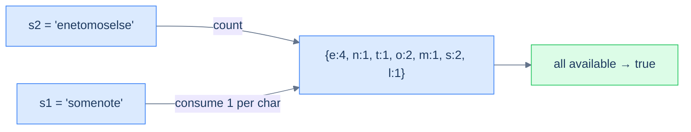

# Constructibility check

## Problem Statement

Given two strings `s1` and `s2`, return `true` if `s1` can be constructed using the letters from `s2` (each letter usable at most once). Return `false` otherwise.

### Example 1
> -   **Input:** `s1 = "somenote", s2 = "enetomoselse"`
> -   **Output:** `true`

### Example 2
> -   **Input:** `s1 = "thief", s2 = "hifacqet"`
> -   **Output:** `true`

### Example 3
> -   **Input:** `s1 = "alpha", s2 = "beta"`
> -   **Output:** `false`

<details>
<summary><h2>Approach</h2></summary>


Build the frequency map of `s2`. Then walk `s1`; for each character, *consume* one from the map by decrementing it. If any character's count drops to zero (or below) while we still need it, `s2` doesn't have enough letters — return `false`.

> 🖼 Diagram — Constructibility — the s2 frequency map is the "available letters" pool. Walking s1 consumes from the pool. If you ever try to consume a letter that's exhausted, the build fails.


<p align="center"><strong>Constructibility — the s2 frequency map is the "available letters" pool. Walking s1 consumes from the pool. If you ever try to consume a letter that's exhausted, the build fails.</strong></p>

</details>
<details>
<summary><h2>Solution</h2></summary>


```python run
from collections import defaultdict
from typing import Dict

class Solution:
    def count_frequency(self, s: str) -> Dict[str, int]:
        frequency = defaultdict(int)
        for ch in s:
            frequency[ch] += 1

        return frequency

    def constructibility_check(self, s1: str, s2: str) -> bool:

        # Create a map to store the frequency of each character in s2
        s2_frequency = self.count_frequency(s2)

        # Iterate over the characters in s1
        for ch in s1:

            # If the frequency of the character is zero, return False
            if s2_frequency.get(ch, 0) == 0:
                return False

            # Decrement the frequency of the character in the map
            s2_frequency[ch] -= 1

        # If all characters in s1 can be constructed from s2, return True
        return True


# Examples from the problem statement
print(Solution().constructibility_check("somenote", "enetomoselse"))  # True
print(Solution().constructibility_check("thief", "hifacqet"))         # True
print(Solution().constructibility_check("alpha", "beta"))             # False

# Edge cases
print(Solution().constructibility_check("", "abc"))                   # True
print(Solution().constructibility_check("a", ""))                     # False
print(Solution().constructibility_check("aa", "a"))                   # False
print(Solution().constructibility_check("a", "a"))                    # True
print(Solution().constructibility_check("abc", "abc"))                # True
```

```java run
import java.util.*;

public class Main {
    static class Solution {
        private Map<Character, Integer> countFrequency(String s) {
            Map<Character, Integer> frequency = new HashMap<>();
            for (char ch : s.toCharArray()) {
                frequency.put(ch, frequency.getOrDefault(ch, 0) + 1);
            }

            return frequency;
        }

        public boolean constructibilityCheck(String s1, String s2) {

            // Create a map to store the frequency of each character in s2
            Map<Character, Integer> s2Frequency = countFrequency(s2);

            // Iterate over the characters in s1
            for (char ch : s1.toCharArray()) {

                // If the frequency of the character is zero, return false
                if (s2Frequency.getOrDefault(ch, 0) == 0) {
                    return false;
                }

                // Decrement the frequency of the character in the map
                s2Frequency.put(ch, s2Frequency.get(ch) - 1);
            }

            // If all characters in s1 can be constructed from s2, return
            // true
            return true;
        }
    }

    public static void main(String[] args) {
        // Examples from the problem statement
        System.out.println(new Solution().constructibilityCheck("somenote", "enetomoselse")); // true
        System.out.println(new Solution().constructibilityCheck("thief", "hifacqet"));        // true
        System.out.println(new Solution().constructibilityCheck("alpha", "beta"));            // false

        // Edge cases
        System.out.println(new Solution().constructibilityCheck("", "abc"));                  // true
        System.out.println(new Solution().constructibilityCheck("a", ""));                    // false
        System.out.println(new Solution().constructibilityCheck("aa", "a"));                  // false
        System.out.println(new Solution().constructibilityCheck("a", "a"));                   // true
        System.out.println(new Solution().constructibilityCheck("abc", "abc"));               // true
    }
}
```


**Complexity:** O(|s1| + |s2|) time, O(unique chars in s2) space.

</details>

<!-- ============================================== -->
<!-- SWEEP 2 — missing sections (placeholders only) -->
<!-- ============================================== -->

<!-- TODO: Examples — missing, needs to be written -->
<!--       Guidance: min 3 examples: basic / variant / edge -->

<!-- TODO: Intuition — missing, needs to be written -->
<!--       Guidance: 3 paragraphs: brute force / observation / pattern fit -->

<!-- TODO: Applying the Diagnostic Questions — missing, needs to be written -->
<!--       Guidance: REQUIRED, never optional -->
<!--       Guidance: 4-row table. Columns: 'Check' | 'Answer for [Problem Name]' -->
<!--       Guidance: Rows: two positions simultaneously / one near start one near end / both move inward / simple O(1) work at each step -->

<!-- TODO: Approach — missing, needs to be written -->
<!--       Guidance: numbered steps, no code -->

<!-- TODO: Solution — missing, needs to be written -->
<!--       Guidance: Python block then Java block -->

<!-- TODO: Dry Run — missing, needs to be written -->
<!--       Guidance: walk through a small example step by step -->

<!-- TODO: Complexity Analysis — missing, needs to be written -->
<!--       Guidance: table: time / space / why -->

<!-- TODO: Edge Cases — missing, needs to be written -->
<!--       Guidance: table, min 5 rows -->

<!-- TODO: Key Takeaway — missing, needs to be written -->
<!--       Guidance: 1–2 sentences -->
