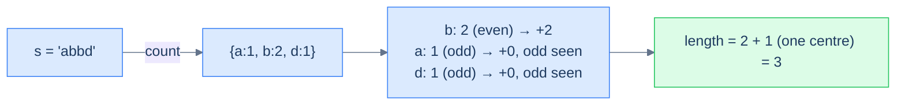

# Build palindrome

## Problem Statement

Given a case-sensitive string `s`, return the length of the **longest palindrome** that can be built using all or some of its letters.

### Example 1
> -   **Input:** `s = "AaAaBbBbc"`
> -   **Output:** `9`
> -   **Explanation:** Use every character — e.g. `"BAabcbaAB"`.

### Example 2
> -   **Input:** `s = "abbd"`
> -   **Output:** `3`
> -   **Explanation:** `"bab"` or `"bdb"`.

### Example 3
> -   **Input:** `s = "abc"`
> -   **Output:** `1`

<details>
<summary><h2>Approach</h2></summary>


A palindrome reads the same forward and backward. Every character used in pairs contributes 2 to the length; **at most one** odd-count character can sit alone in the middle. So:

1. Count each character's frequency.
2. For each frequency: if **even**, add it all; if **odd**, add `count − 1` (the largest even part) and remember we saw an odd.
3. If any odd count was seen, add 1 (one character can sit in the middle).

> 🖼 Diagram — Build palindrome — every even-frequency character contributes fully; odd-frequency characters contribute (count − 1); a single bonus +1 for the optional middle character.


<p align="center"><strong>Build palindrome — every even-frequency character contributes fully; odd-frequency characters contribute (count − 1); a single bonus +1 for the optional middle character.</strong></p>

</details>
<details>
<summary><h2>Solution</h2></summary>


```python run
from collections import defaultdict
from typing import Dict

class Solution:
    def count_frequency(self, s: str) -> Dict[str, int]:
        frequency = defaultdict(int)
        for ch in s:
            frequency[ch] += 1

        return frequency

    def build_palindrome(self, s: str) -> int:

        # Create a map to store the frequency of each character in the
        # string
        frequency = self.count_frequency(s)

        # Initialize the length of the longest palindrome
        length = 0

        # Initialize a boolean flag to check if there are odd counts of
        # characters
        odd = False

        # Iterate over the map to calculate the length of the longest
        # palindrome
        for count in frequency.values():

            # If the count of the character is even, add it to the length
            if count % 2 == 0:
                length += count

            # If the count of the character is odd, add the count minus
            # one to the length and set the odd flag to true
            else:
                length += count - 1
                odd = True

        # If there are odd counts of characters, add one to the length
        return length + 1 if odd else length


# Examples from the problem statement
print(Solution().build_palindrome("AaAaBbBbc"))  # 9
print(Solution().build_palindrome("abbd"))       # 3
print(Solution().build_palindrome("abc"))        # 1

# Edge cases
print(Solution().build_palindrome(""))           # 0
print(Solution().build_palindrome("a"))          # 1
print(Solution().build_palindrome("aa"))         # 2
print(Solution().build_palindrome("aabb"))       # 4
print(Solution().build_palindrome("aaaa"))       # 4
```

```java run
import java.util.*;

public class Main {
    static class Solution {
        private Map<Character, Integer> countFrequency(String s) {
            Map<Character, Integer> frequency = new HashMap<>();
            for (char ch : s.toCharArray()) {
                frequency.put(ch, frequency.getOrDefault(ch, 0) + 1);
            }

            return frequency;
        }

        public int buildPalindrome(String s) {

            // Create a map to store the frequency of each character in the
            // string
            Map<Character, Integer> frequency = countFrequency(s);

            // Initialize the length of the longest palindrome
            int length = 0;

            // Initialize a boolean flag to check if there are odd counts of
            // characters
            boolean odd = false;

            // Iterate over the map to calculate the length of the longest
            // palindrome
            for (var entry : frequency.entrySet()) {

                // If the count of the character is even, add it to the
                // length
                if (entry.getValue() % 2 == 0) {
                    length += entry.getValue();
                }

                // If the count of the character is odd, add the count minus
                // one to the length and set the odd flag to true
                else {
                    length += entry.getValue() - 1;
                    odd = true;
                }
            }

            // If there are odd counts of characters, add one to the length
            return odd ? length + 1 : length;
        }
    }

    public static void main(String[] args) {
        // Examples from the problem statement
        System.out.println(new Solution().buildPalindrome("AaAaBbBbc")); // 9
        System.out.println(new Solution().buildPalindrome("abbd"));      // 3
        System.out.println(new Solution().buildPalindrome("abc"));       // 1

        // Edge cases
        System.out.println(new Solution().buildPalindrome(""));          // 0
        System.out.println(new Solution().buildPalindrome("a"));         // 1
        System.out.println(new Solution().buildPalindrome("aa"));        // 2
        System.out.println(new Solution().buildPalindrome("aabb"));      // 4
        System.out.println(new Solution().buildPalindrome("aaaa"));      // 4
    }
}
```

</details>

<!-- ============================================== -->
<!-- SWEEP 2 — missing sections (placeholders only) -->
<!-- ============================================== -->

<!-- TODO: Examples — missing, needs to be written -->
<!--       Guidance: min 3 examples: basic / variant / edge -->

<!-- TODO: Intuition — missing, needs to be written -->
<!--       Guidance: 3 paragraphs: brute force / observation / pattern fit -->

<!-- TODO: Applying the Diagnostic Questions — missing, needs to be written -->
<!--       Guidance: REQUIRED, never optional -->
<!--       Guidance: 4-row table. Columns: 'Check' | 'Answer for [Problem Name]' -->
<!--       Guidance: Rows: two positions simultaneously / one near start one near end / both move inward / simple O(1) work at each step -->

<!-- TODO: Approach — missing, needs to be written -->
<!--       Guidance: numbered steps, no code -->

<!-- TODO: Solution — missing, needs to be written -->
<!--       Guidance: Python block then Java block -->

<!-- TODO: Dry Run — missing, needs to be written -->
<!--       Guidance: walk through a small example step by step -->

<!-- TODO: Complexity Analysis — missing, needs to be written -->
<!--       Guidance: table: time / space / why -->

<!-- TODO: Edge Cases — missing, needs to be written -->
<!--       Guidance: table, min 5 rows -->

<!-- TODO: Key Takeaway — missing, needs to be written -->
<!--       Guidance: 1–2 sentences -->
