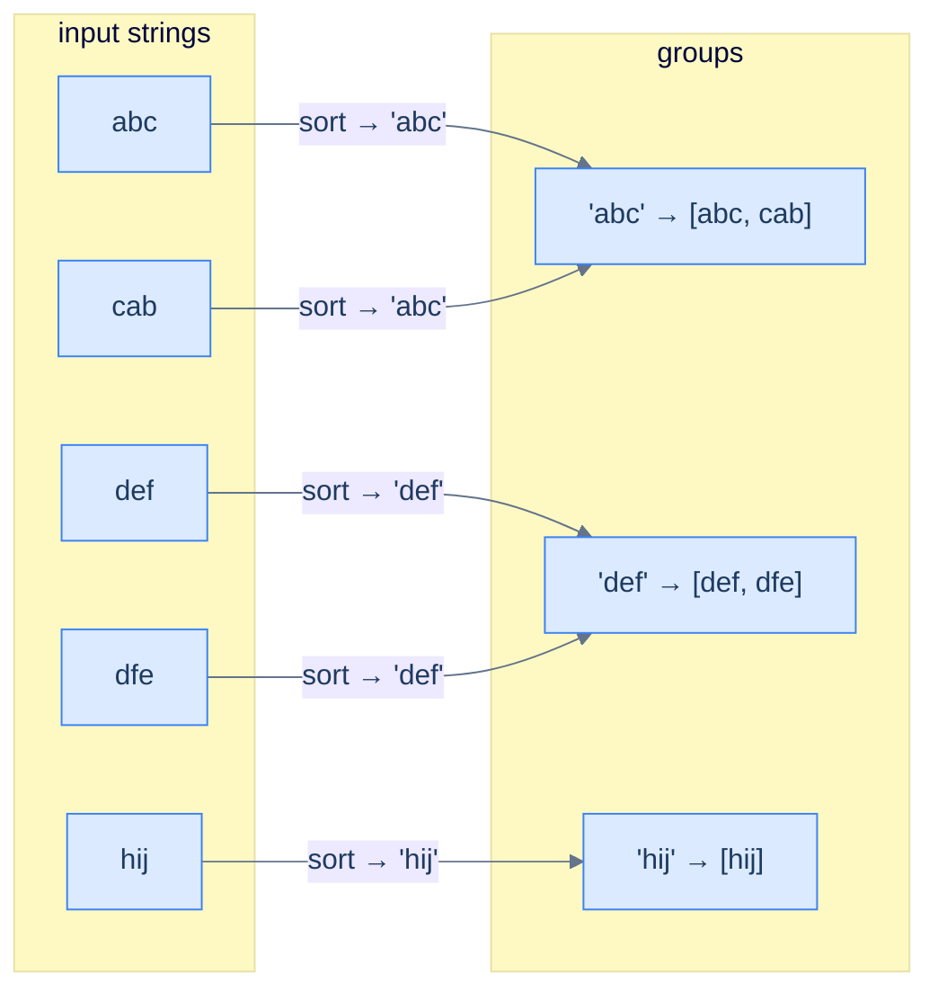

# Cluster anagrams

## Problem Statement

Given an array of strings `strs`, group all anagrams together. Return the groups in any order.

### Example 1
> -   **Input:** `["abc", "cab", "def", "dfe", "hij"]`
> -   **Output:** `[["abc", "cab"], ["def", "dfe"], ["hij"]]`

### Example 2
> -   **Input:** `["a", "b", "c", "d", "e"]`
> -   **Output:** `[["a"], ["b"], ["c"], ["d"], ["e"]]`

### Example 3
> -   **Input:** `[]`
> -   **Output:** `[]`

<details>
<summary><h2>Approach</h2></summary>


Two strings are anagrams iff their character frequency maps match. So the **frequency tuple itself** is a perfect grouping key — any two anagrams produce the same key. Build a hash map from frequency-key to list of strings.

For lowercase-only inputs, a 26-element tuple `(count_a, count_b, …, count_z)` is the cleanest key. For the general case, the **sorted string** (e.g. `"cab"` → `"abc"`) is an equivalent key — anagrams sort to the same canonical form.

> 🖼 Diagram — Cluster anagrams — the canonical form (sorted letters or letter-frequency tuple) is the same for every anagram, so anagrams collide into the same hash-map bucket. The buckets are the groups.


<p align="center"><strong>Cluster anagrams — the canonical form (sorted letters or letter-frequency tuple) is the same for every anagram, so anagrams collide into the same hash-map bucket. The buckets <em>are</em> the groups.</strong></p>

</details>
<details>
<summary><h2>Solution</h2></summary>


```python run
from typing import List, Tuple

class Solution:
    def count_frequency(self, str: str) -> List[int]:

        # Initialize frequency list for 26 letters
        frequency = [0] * 26
        for c in str:

            # Increment the count for each character
            frequency[ord(c) - ord("a")] += 1
        return frequency

    def cluster_anagrams(self, strs: List[str]) -> List[List[str]]:

        # Map to store character frequency lists as keys and lists of
        # indices as values
        frequency_groups = {}

        # Populate the frequency_groups with indices of strings grouped
        # by character frequencies
        for i, s in enumerate(strs):

            # Count the frequency of each character in the string
            frequency = self.count_frequency(s)

            # Group strings with the same frequency list by storing
            # their indices
            if tuple(frequency) not in frequency_groups:
                frequency_groups[tuple(frequency)] = []
            frequency_groups[tuple(frequency)].append(i)

        # Collect grouped anagrams into the result list
        result = []

        # Iterate over each group of indices in frequencyGroups
        for entry in frequency_groups.items():
            anagram_group = []
            for index in entry[1]:

                # Use the index to get the original string and add it to
                # the anagram group
                anagram_group.append(strs[index])

            # Add the anagram group to the result
            result.append(anagram_group)
        return result


# Examples from the problem statement
r1 = Solution().cluster_anagrams(["abc", "cab", "def", "dfe", "hij"])
print(sorted([sorted(g) for g in r1]))   # [['abc', 'cab'], ['def', 'dfe'], ['hij']]

r2 = Solution().cluster_anagrams(["a", "b", "c", "d", "e"])
print(sorted([sorted(g) for g in r2]))   # [['a'], ['b'], ['c'], ['d'], ['e']]

print(Solution().cluster_anagrams([]))   # []

# Edge cases
r4 = Solution().cluster_anagrams(["eat", "tea", "tan", "ate", "nat", "bat"])
print(sorted([sorted(g) for g in r4]))   # [['ate', 'eat', 'tea'], ['bat'], ['nat', 'tan']]

r5 = Solution().cluster_anagrams(["a"])
print(r5)                                # [['a']]
```

```java run
import java.util.*;
import java.util.stream.*;

public class Main {
    static class Solution {
        private List<Integer> countFrequency(String str) {

            // Initialize frequency list for 26 letters
            List<Integer> frequency = new ArrayList<>(
                Collections.nCopies(26, 0)
            );
            for (char c : str.toCharArray()) {

                // Increment the count for each character
                frequency.set(c - 'a', frequency.get(c - 'a') + 1);
            }
            return frequency;
        }

        public List<List<String>> clusterAnagrams(String[] strs) {

            // Map to store character frequency lists as keys and lists of
            // indices as values
            Map<List<Integer>, List<Integer>> frequencyGroups =
                new HashMap<>();

            // Populate the frequencyGroups with indices of strings grouped
            // by character frequencies
            for (int i = 0; i < strs.length; i++) {

                // Count the frequency of each character in the string
                List<Integer> frequency = countFrequency(strs[i]);

                // Group strings with the same frequency list by storing
                // their indices
                frequencyGroups.put(
                    frequency,
                    frequencyGroups.getOrDefault(
                        frequency,
                        new ArrayList<>()
                    )
                );
                frequencyGroups.get(frequency).add(i);
            }

            // Collect grouped anagrams into the result array
            List<List<String>> result = new ArrayList<>();

            // Iterate over each group of indices in frequencyGroups
            for (List<Integer> indices : frequencyGroups.values()) {

                // Use the index to get the original string and add it to
                // the anagram group
                List<String> anagramGroup = indices
                    .stream()
                    .map(i -> strs[i])
                    .collect(Collectors.toList());

                // Add the anagram group to the result
                result.add(anagramGroup);
            }

            return result;
        }
    }

    public static void main(String[] args) {
        // Examples from the problem statement
        var r1 = new Solution().clusterAnagrams(new String[]{"abc", "cab", "def", "dfe", "hij"});
        r1.forEach(g -> { Collections.sort(g); System.out.print(g + " "); }); System.out.println();
        // [abc, cab] [def, dfe] [hij] (order of groups may vary)

        var r2 = new Solution().clusterAnagrams(new String[]{"a", "b", "c", "d", "e"});
        r2.forEach(g -> System.out.print(g + " ")); System.out.println();
        // [a] [b] [c] [d] [e] (order may vary)

        var r3 = new Solution().clusterAnagrams(new String[]{});
        System.out.println(r3);  // []

        // Edge cases
        var r4 = new Solution().clusterAnagrams(new String[]{"eat", "tea", "tan", "ate", "nat", "bat"});
        r4.forEach(g -> { Collections.sort(g); System.out.print(g + " "); }); System.out.println();
        // [ate, eat, tea] [nat, tan] [bat] (order of groups may vary)

        var r5 = new Solution().clusterAnagrams(new String[]{"a"});
        System.out.println(r5);  // [[a]]
    }
}
```


**Complexity:** O(N · K) where N is the number of strings and K is the average length — this implementation builds a 26-element frequency tuple per string, which costs O(K) and avoids the O(K log K) of sorting each string.

</details>
<details>
<summary><h2>Final Takeaway</h2></summary>


Counting is the gateway pattern of hash-table problem solving. The **template** — *build a frequency map first, then answer the question* — is so common that you'll see it in dozens of interview problems and hundreds of production codebases. Five lessons in one paragraph:

- **Trade space for time.** O(N) memory buys you O(N) time when the alternative is O(N²).
- **A hash map *is* a multiset.** Anagram, equality, subset-of, palindrome-buildability — all reduce to multiset comparisons that the map handles in two lines.
- **Pick the right key.** Sometimes the key is the item itself; sometimes it's a *canonical form* (sorted string, frequency tuple) that collapses many inputs to one.
- **Two passes are usually enough.** First pass builds the map; second pass uses it. Resist the urge to do everything in one loop — clarity beats cleverness.
- **Counting rarely solves the problem alone.** It builds the *input* to the rest of your algorithm. The map is a tool, not the answer.

> *Coming up — the **key-generation pattern**. Counting answers "how often did X appear?". Key generation answers "have I seen *something equivalent to* X before?" — where "equivalent" means *the same key under some canonical transformation*. We just used it to cluster anagrams (sorted-string key); the next lesson generalises it to deduplication, isomorphism checks, and a host of "is this the same as that?" problems.*

</details>

<!-- ============================================== -->
<!-- SWEEP 2 — missing sections (placeholders only) -->
<!-- ============================================== -->

<!-- TODO: Examples — missing, needs to be written -->
<!--       Guidance: min 3 examples: basic / variant / edge -->

<!-- TODO: Intuition — missing, needs to be written -->
<!--       Guidance: 3 paragraphs: brute force / observation / pattern fit -->

<!-- TODO: Applying the Diagnostic Questions — missing, needs to be written -->
<!--       Guidance: REQUIRED, never optional -->
<!--       Guidance: 4-row table. Columns: 'Check' | 'Answer for [Problem Name]' -->
<!--       Guidance: Rows: two positions simultaneously / one near start one near end / both move inward / simple O(1) work at each step -->

<!-- TODO: Approach — missing, needs to be written -->
<!--       Guidance: numbered steps, no code -->

<!-- TODO: Solution — missing, needs to be written -->
<!--       Guidance: Python block then Java block -->

<!-- TODO: Dry Run — missing, needs to be written -->
<!--       Guidance: walk through a small example step by step -->

<!-- TODO: Complexity Analysis — missing, needs to be written -->
<!--       Guidance: table: time / space / why -->

<!-- TODO: Edge Cases — missing, needs to be written -->
<!--       Guidance: table, min 5 rows -->

<!-- TODO: Key Takeaway — missing, needs to be written -->
<!--       Guidance: 1–2 sentences -->
