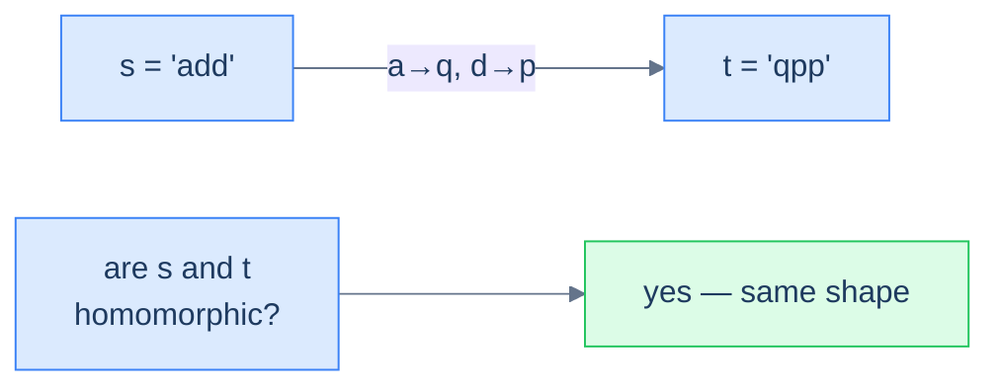
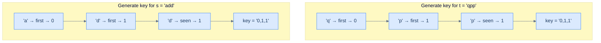
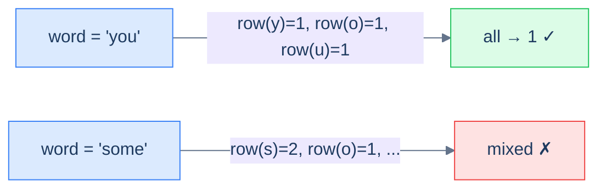

# 7. Pattern: Key Generation

## The Hook

`add` and `qpp`. `dad` and `mom`. `paper` and `title`. Three pairs of strings; every pair is the *same word in disguise*. Replace `a → q` and `d → p` and `add` becomes `qpp`. Replace `d → m` and `a → o` and `dad` becomes `mom`. The letters change, the **shape** doesn't.

Now imagine you're given a million strings and asked to group them by shape. The naïve approach: compare every pair, character-by-character, with a substitution check — O(N²) string comparisons, each one with its own little decoder ring. The clever approach: convert each string to a *canonical fingerprint* that's identical for all shape-mates. `add → "0,1,1"`. `qpp → "0,1,1"`. `paper → "0,1,0,2,3"`. `title → "0,1,0,2,3"`. Two strings have the same shape iff their fingerprints are character-for-character equal — which means a **hash map keyed by fingerprint** clusters them in one pass.

That fingerprint is the **key**, and the technique of inventing one is the **key-generation pattern**. It's the hash-table cousin of the counting pattern from the last lesson, and it answers a subtly different question. Counting asks *"how many of X did I see?"*. Key generation asks *"have I seen something **equivalent to** X under some transformation?"*. Anagram detection (sorted-letters key), keyboard-row classification (row-id key), word-pattern matching (occurrence-index key), keyboard-shift detection (gap-sequence key) — every one of these is the same trick wearing a different costume.

The skill is *inventing the right key*. Once you can see what makes two inputs "the same", the rest is mechanical.

---

## Table of contents

1. [Understanding the key-generation pattern](#understanding-the-key-generation-pattern)
2. [Identifying the key-generation pattern](#identifying-the-key-generation-pattern)
3. [Row specific words](#row-specific-words)
4. [Homomorphic strings](#homomorphic-strings)
5. [Pattern matching](#pattern-matching)
6. [Cluster displaced strings](#cluster-displaced-strings)

***

# Understanding the key-generation pattern

A **key** (or "pattern" or "signature" or "fingerprint") is a transformation that collapses many inputs to one. The transformation should obey one rule: *two inputs are "the same" (in whatever sense the problem cares about) if and only if their keys are byte-for-byte equal*. Once you have such a transformation, the rest of the algorithm is trivial — you just feed keys into a hash map and let collisions become groups.

```d2
direction: right

inp: raw inputs {
  grid-rows: 2
  grid-gap: 8
  a: add
  b: qpp
  c: dad
  d: mom
  e: abc
}

keys: keys {
  k1: "0,1,1"
  k2: "0,1,0"
  k3: "0,1,2"
}

buckets: hash-map buckets {
  g1: "[add, qpp]"
  g2: "[dad, mom]"
  g3: "[abc]"
}

inp.a -> keys.k1: "key()"
inp.b -> keys.k1: "key()"
inp.c -> keys.k2: "key()"
inp.d -> keys.k2: "key()"
inp.e -> keys.k3: "key()"

keys.k1 -> buckets.g1
keys.k2 -> buckets.g2
keys.k3 -> buckets.g3
```

<p align="center"><strong>The key-generation pattern in one picture — every input is fingerprinted into a key; equal keys land in the same bucket; the buckets <em>are</em> the answer. The whole problem reduces to "design a good key."</strong></p>

The key generator typically does **not** solve the problem on its own. Its job is to produce a *grouping key* that downstream code can use. In some problems (homomorphism check) the answer is "are these two keys equal?". In others (cluster anagrams, cluster displaced strings) the answer is "what are the equivalence classes?". The shape of the answer changes, but the key is always the lever.

***

# Identifying the key-generation pattern

The pattern fits **easy-to-medium** problems on arrays or strings whose answer depends on assigning each input a *canonical form* such that "equivalent" inputs share that form. Almost all of these problems share a single template.

**Template:**
> Given an iterable sequence (or pair of sequences), generate a canonical key for it; then group, compare, or classify by that key.

If you can answer "what makes two of these inputs equivalent?" with a function from input to bytes, the key-generation pattern fits.

## Example

Let's drill the pattern with a canonical problem.

> **Problem statement:** Given two strings `s` and `t`, return `true` if they are **homomorphic**. Two strings are homomorphic if you can substitute each character of `s` with a chosen character (preserving order, with no two characters mapping to the same target) so that `s` becomes `t`.



<p align="center"><strong>Homomorphic strings — two strings are homomorphic if one can be re-labelled into the other while preserving the order and structure of repeats.</strong></p>

### Key-generation solution

Two homomorphic strings have the same **shape**, which we can capture by replacing each character with the *index of its first appearance*. The first distinct character in the string becomes `0`, the second distinct character becomes `1`, the third becomes `2`, and so on. Every later occurrence reuses the index its first appearance got.

`add` → `a` is the 0th distinct character, `d` is the 1st, `d` reuses index 1 → `"0,1,1"`.

`qpp` → `q` is the 0th, `p` is the 1st, `p` reuses index 1 → `"0,1,1"`.

The two keys match → the strings are homomorphic.



<p align="center"><strong>Building the homomorphic-shape key — each new character gets the next available index; repeats reuse it. Two strings with the same key have the same repeat structure, which is exactly what homomorphism requires.</strong></p>

### Algorithm

> **Algorithm**
>
> -   **Step 1:** Initialise an empty map `charToIndex`, a counter `seed = 0`, and an empty `pattern` string.
> -   **Step 2:** For each character `ch` in the input:
>     -   If `ch` is not in `charToIndex`, set `charToIndex[ch] = seed` and increment `seed`.
>     -   Append `charToIndex[ch]` followed by a delimiter `,` to `pattern`.
> -   **Step 3:** Return `pattern`.

The delimiter matters: without it, indices like `1,12` and `11,2` produce the same byte sequence `112`. A `,` (or any non-digit separator) keeps the encoding unambiguous.

### Implementation


```python run
def generate_pattern(s: str) -> str:
    char_to_index, parts, seed = {}, [], 0
    for ch in s:
        if ch not in char_to_index:
            char_to_index[ch] = seed; seed += 1
        parts.append(str(char_to_index[ch]))
    # Delimiter prevents '1' + '12' colliding with '11' + '2'
    return ','.join(parts)

def homomorphic_strings(s: str, t: str) -> bool:
    if len(s) != len(t): return False
    return generate_pattern(s) == generate_pattern(t)

print(homomorphic_strings("add", "qpp"))   # True
print(homomorphic_strings("dad", "mom"))   # True
print(homomorphic_strings("all", "mom"))   # False
```

```java run
import java.util.*;

public class Main {
    static String generatePattern(String s) {
        Map<Character, Integer> charToIndex = new HashMap<>();
        StringBuilder pattern = new StringBuilder();
        int seed = 0;
        for (char ch : s.toCharArray()) {
            if (!charToIndex.containsKey(ch)) charToIndex.put(ch, seed++);
            pattern.append(charToIndex.get(ch)).append(',');
        }
        return pattern.toString();
    }
    static boolean homomorphicStrings(String s, String t) {
        if (s.length() != t.length()) return false;
        return generatePattern(s).equals(generatePattern(t));
    }
    public static void main(String[] args) {
        System.out.println(homomorphicStrings("add", "qpp"));   // true
        System.out.println(homomorphicStrings("dad", "mom"));   // true
        System.out.println(homomorphicStrings("all", "mom"));   // false
    }
}
```


The pattern-generation technique solves the homomorphism problem in **O(N)** time and **O(K)** space, where K is the number of distinct characters.

## Example problems

The four problems below are all variations on "design a key for input X". The keys are different — keyboard-row id, occurrence-index, character-shift sequence — but the recipe is the same.

> -   Row specific words
> -   Homomorphic strings
> -   Pattern matching
> -   Cluster displaced strings

***

# Row specific words

## Problem Statement

Given an array of words, return all the words that can be typed using **only one row** of an American keyboard.

> -   **Row 1:** `qwertyuiop`
> -   **Row 2:** `asdfghjkl`
> -   **Row 3:** `zxcvbnm`

### Example 1
> -   **Input:** `["you", "were", "some"]` → **Output:** `["you", "were"]`

### Example 2
> -   **Input:** `["sdk", "nvm", "hut"]` → **Output:** `["sdk", "nvm"]`

### Example 3
> -   **Input:** `["him", "else", "bat"]` → **Output:** `[]`

<details>
<summary><h2>Approach</h2></summary>


The "key" here is the **row id** (1, 2, or 3). Each character maps to one of three rows; a word is single-row iff every character maps to the same row. So: look up every character's row, ensure they're all equal.



<p align="center"><strong>Row-specific words — the key per character is its keyboard row. A word survives the filter only if all its characters share the same key.</strong></p>

</details>
<details>
<summary><h2>Solution</h2></summary>


```python run
from typing import List

class Solution:
    def get_row_1(self) -> set:
        return {"q", "w", "e", "r", "t", "y", "u", "i", "o", "p"}

    def get_row_2(self) -> set:
        return {"a", "s", "d", "f", "g", "h", "j", "k", "l"}

    def get_row_3(self) -> set:
        return {"z", "x", "c", "v", "b", "n", "m"}

    def get_row(self, c: str) -> int:
        row_1 = self.get_row_1()
        row_2 = self.get_row_2()
        row_3 = self.get_row_3()

        if c in row_1:
            return 1
        if c in row_2:
            return 2
        if c in row_3:
            return 3

        # This case won't occur as all characters are from valid rows
        return 0

    def can_be_typed_with_one_row(self, word: str) -> bool:

        # Get the row for the first character
        row = self.get_row(word[0].lower())

        # Check if all characters belong to the same row
        for c in word:
            if self.get_row(c.lower()) != row:
                return False

        return True

    def row_specific_words(self, words: List[str]) -> List[str]:
        result = []

        # Iterate over each word
        for word in words:
            if self.can_be_typed_with_one_row(word):
                result.append(word)

        return result


# Examples from the problem statement
print(Solution().row_specific_words(["you", "were", "some"]))   # ['you', 'were']
print(Solution().row_specific_words(["sdk", "nvm", "hut"]))     # ['sdk', 'nvm']
print(Solution().row_specific_words(["him", "else", "bat"]))    # []

# Edge cases
print(Solution().row_specific_words([]))                         # []
print(Solution().row_specific_words(["a"]))                      # ['a']
print(Solution().row_specific_words(["type", "row"]))            # ['type']
print(Solution().row_specific_words(["Alaska", "Dad"]))          # ['Alaska', 'Dad']
```

```java run
import java.util.*;

public class Main {
    static class Solution {
        private Set<Character> getRow1() {
            return new HashSet<>(
                List.of('q', 'w', 'e', 'r', 't', 'y', 'u', 'i', 'o', 'p')
            );
        }

        private Set<Character> getRow2() {
            return new HashSet<>(
                List.of('a', 's', 'd', 'f', 'g', 'h', 'j', 'k', 'l')
            );
        }

        private Set<Character> getRow3() {
            return new HashSet<>(List.of('z', 'x', 'c', 'v', 'b', 'n', 'm'));
        }

        private int getRow(char c) {
            Set<Character> row1 = getRow1();
            Set<Character> row2 = getRow2();
            Set<Character> row3 = getRow3();

            if (row1.contains(c)) {
                return 1;
            }

            if (row2.contains(c)) {
                return 2;
            }

            if (row3.contains(c)) {
                return 3;
            }

            // This case won't occur as all characters are from valid rows
            return 0;
        }

        private boolean canBeTypedWithOneRow(String word) {

            // Get the row for the first character
            int row = getRow(Character.toLowerCase(word.charAt(0)));

            // Check if all characters belong to the same row
            for (char c : word.toCharArray()) {
                if (getRow(Character.toLowerCase(c)) != row) {
                    return false;
                }
            }

            return true;
        }

        public List<String> rowSpecificWords(String[] words) {
            List<String> result = new ArrayList<>();

            // Iterate over each word
            for (String word : words) {
                if (canBeTypedWithOneRow(word)) {
                    result.add(word);
                }
            }

            return result;
        }
    }

    public static void main(String[] args) {
        // Examples from the problem statement
        System.out.println(new Solution().rowSpecificWords(new String[]{"you", "were", "some"}));  // [you, were]
        System.out.println(new Solution().rowSpecificWords(new String[]{"sdk", "nvm", "hut"}));    // [sdk, nvm]
        System.out.println(new Solution().rowSpecificWords(new String[]{"him", "else", "bat"}));   // []

        // Edge cases
        System.out.println(new Solution().rowSpecificWords(new String[]{}));                       // []
        System.out.println(new Solution().rowSpecificWords(new String[]{"a"}));                    // [a]
        System.out.println(new Solution().rowSpecificWords(new String[]{"type", "row"}));          // [type]
        System.out.println(new Solution().rowSpecificWords(new String[]{"Alaska", "Dad"}));        // [Alaska, Dad]
    }
}
```

</details>


***

# Homomorphic strings

## Problem Statement

Given two strings `s` and `t`, return `true` if they are **homomorphic**: each unique character of `s` can be replaced (consistently, no two distinct characters mapping to the same target) to produce `t`.

### Example 1
> -   **Input:** `s = "add", t = "qpp"` → **Output:** `true`

### Example 2
> -   **Input:** `s = "dad", t = "mom"` → **Output:** `true`

### Example 3
> -   **Input:** `s = "all", t = "mom"` → **Output:** `false`

<details>
<summary><h2>Approach</h2></summary>


Apply the `generatePattern` function we built above to both strings; compare the resulting keys. The first-occurrence-index encoding *is* the canonical shape of a string, so two strings are homomorphic iff their patterns match exactly.

</details>
<details>
<summary><h2>Solution</h2></summary>


```python run
from typing import Dict

class Solution:
    def generate_pattern(self, s: str) -> str:
        char_to_index: Dict[str, int] = {}
        pattern = ""
        index = 0

        # Create a mapped value based on the first occurrence of each
        # character
        for ch in s:
            if ch not in char_to_index:
                char_to_index[ch] = index
                index += 1
            pattern += str(char_to_index[ch]) + ","

        return pattern

    def homomorphic_strings(self, s: str, t: str) -> bool:

        # Strings of different lengths can't be homomorphic
        if len(s) != len(t):
            return False

        # If the generated patterns are the same, the strings are
        # homomorphic
        return self.generate_pattern(s) == self.generate_pattern(t)


# Examples from the problem statement
print(Solution().homomorphic_strings("add", "qpp"))   # True
print(Solution().homomorphic_strings("dad", "mom"))   # True
print(Solution().homomorphic_strings("all", "mom"))   # False

# Edge cases
print(Solution().homomorphic_strings("", ""))         # True
print(Solution().homomorphic_strings("a", "b"))       # True
print(Solution().homomorphic_strings("ab", "aa"))     # False
print(Solution().homomorphic_strings("aa", "ab"))     # False
print(Solution().homomorphic_strings("abc", "xyz"))   # True
```

```java run
import java.util.*;

public class Main {
    static class Solution {
        private String generatePattern(String str) {
            Map<Character, Integer> charToIndex = new HashMap<>();
            StringBuilder pattern = new StringBuilder();
            int index = 0;

            // Create a mapped value based on the first occurrence of each
            // character
            for (char ch : str.toCharArray()) {
                if (!charToIndex.containsKey(ch)) {
                    charToIndex.put(ch, index++);
                }
                pattern.append(charToIndex.get(ch)).append(",");
            }

            return pattern.toString();
        }

        public boolean homomorphicStrings(String s, String t) {

            // Strings of different lengths can't be homomorphic
            if (s.length() != t.length()) {
                return false;
            }

            // If the generated patterns are the same, the strings are
            // homomorphic
            return generatePattern(s).equals(generatePattern(t));
        }
    }

    public static void main(String[] args) {
        // Examples from the problem statement
        System.out.println(new Solution().homomorphicStrings("add", "qpp"));  // true
        System.out.println(new Solution().homomorphicStrings("dad", "mom"));  // true
        System.out.println(new Solution().homomorphicStrings("all", "mom"));  // false

        // Edge cases
        System.out.println(new Solution().homomorphicStrings("", ""));        // true
        System.out.println(new Solution().homomorphicStrings("a", "b"));      // true
        System.out.println(new Solution().homomorphicStrings("ab", "aa"));    // false
        System.out.println(new Solution().homomorphicStrings("aa", "ab"));    // false
        System.out.println(new Solution().homomorphicStrings("abc", "xyz"));  // true
    }
}
```

</details>


***

# Pattern matching

## Problem Statement

Given a `pattern` string and a string `s` of space-separated words, return `true` if `s` follows `pattern` — meaning there is a **bijection** between letters of `pattern` and non-empty words of `s`.

### Example 1
> -   **Input:** `pattern = "mom", s = "hello world hello"` → **Output:** `true`

### Example 2
> -   **Input:** `pattern = "abc", s = "hello my name"` → **Output:** `true`

### Example 3
> -   **Input:** `pattern = "abc", s = "hello my my"` → **Output:** `false`

<details>
<summary><h2>Approach</h2></summary>


The key generator works on *any* iterable. Treat `pattern` as a sequence of characters and `s` as a sequence of words; generate a first-occurrence-index pattern for each. The strings match iff the keys are equal.

The bijection requirement is a real constraint: no two pattern letters can map to the same word, *and* no two words can map to the same pattern letter. The first-occurrence-index encoding handles both directions: if it would assign two different items the same index, it doesn't — each gets a fresh index. So if `s` has more distinct words than `pattern` has distinct letters (or vice versa), the keys differ.

</details>
<details>
<summary><h2>Solution</h2></summary>


```python run
from typing import List

class Solution:
    def generate_pattern(self, words: List[str]) -> str:
        word_to_index = {}
        pattern = ""
        index = 0

        # Create a mapped value based on the first occurrence of each
        # word
        for word in words:
            if word not in word_to_index:
                word_to_index[word] = index
                index += 1
            pattern += str(word_to_index[word]) + ","

        return pattern

    def pattern_matching(self, pattern: str, s: str) -> bool:

        # Split the string s into an array of words
        words = s.split(" ")

        # If the length of pattern and words are different, return false
        if len(pattern) != len(words):
            return False

        # If the generated patterns are the same, return true
        return self.generate_pattern(
            list(pattern)
        ) == self.generate_pattern(words)


# Examples from the problem statement
print(Solution().pattern_matching("mom", "hello world hello"))  # True
print(Solution().pattern_matching("abc", "hello my name"))      # True
print(Solution().pattern_matching("abc", "hello my my"))        # False

# Edge cases
print(Solution().pattern_matching("a", "hello"))                # True
print(Solution().pattern_matching("aa", "hello world"))         # False
print(Solution().pattern_matching("ab", "hello hello"))         # False
print(Solution().pattern_matching("aab", "x x y"))              # True
print(Solution().pattern_matching("abc", "a b c"))              # True
```

```java run
import java.util.*;

public class Main {
    static class Solution {
        private List<String> stringToList(String s) {

            // Convert pattern string into a list of single-character strings
            List<String> result = new ArrayList<>();
            for (char c : s.toCharArray()) {
                result.add(String.valueOf(c));
            }
            return result;
        }

        private String generatePattern(List<String> words) {
            Map<String, Integer> wordToIndex = new HashMap<>();
            StringBuilder pattern = new StringBuilder();
            int index = 0;

            // Create a mapped value based on the first occurrence of each
            // word
            for (String word : words) {
                if (!wordToIndex.containsKey(word)) {
                    wordToIndex.put(word, index++);
                }
                pattern.append(wordToIndex.get(word)).append(",");
            }

            return pattern.toString();
        }

        public boolean patternMatching(String pattern, String s) {

            // Split the string s into an array of words
            List<String> words = List.of(s.split(" "));

            // If the length of pattern and words are different, return false
            if (pattern.length() != words.size()) {
                return false;
            }

            // If the generated patterns are the same, return true
            return generatePattern(stringToList(pattern)).equals(
                generatePattern(words)
            );
        }
    }

    public static void main(String[] args) {
        // Examples from the problem statement
        System.out.println(new Solution().patternMatching("mom", "hello world hello")); // true
        System.out.println(new Solution().patternMatching("abc", "hello my name"));     // true
        System.out.println(new Solution().patternMatching("abc", "hello my my"));       // false

        // Edge cases
        System.out.println(new Solution().patternMatching("a", "hello"));               // true
        System.out.println(new Solution().patternMatching("aa", "hello world"));        // false
        System.out.println(new Solution().patternMatching("ab", "hello hello"));        // false
        System.out.println(new Solution().patternMatching("aab", "x x y"));             // true
        System.out.println(new Solution().patternMatching("abc", "a b c"));             // true
    }
}
```

</details>


***

# Cluster displaced strings

## Problem Statement

Given an array `strs` of lowercase strings, group strings that belong to the same **displacing sequence**. A displacing sequence shifts every character by the same amount, with wrap-around (e.g. `abc → bcd → ... → xyz → yza`).

### Example 1
> -   **Input:** `["abc","ghi","xyz","b","c","ab","cd"]`
> -   **Output:** `[["abc","ghi","xyz"], ["b","c"], ["ab","cd"]]`

### Example 2
> -   **Input:** `["ad","k","cf"]`
> -   **Output:** `[["ad","cf"], ["k"]]`

### Example 3
> -   **Input:** `["abcd","efg","hi","j"]`
> -   **Output:** `[["abcd"],["efg"],["hi"],["j"]]`

<details>
<summary><h2>Approach</h2></summary>


Two strings are in the same displacing class iff the **gaps between consecutive characters** are identical (modulo 26). `abc` has gaps `(b−a, c−b) = (1, 1)`. `ghi` has gaps `(h−g, i−h) = (1, 1)`. `xyz` has gaps `(y−x, z−y) = (1, 1)`. All three: `(1, 1)`. They cluster.

The key per string is the **gap-sequence**, with negative gaps wrapped to `+ 26` so `xyz → yza` doesn't break the encoding (`a − z = -25` becomes `+1` after wrap).

Single-character strings have an empty gap sequence and all cluster together — but the example shows them split. The catch: a single-character string has gap-sequence `""`, which is the same key for every single-character string. The example actually splits them; this happens because the example uses a different rule (each of `b`, `c` alone is its own class? — re-checking: example 1 puts `b` and `c` together as `[b, c]`, which is the empty-sequence cluster). So our keying works — single-char strings form one cluster, two-char strings clustered by their single gap, etc.

```d2
direction: right

inputs: input strings {
  grid-rows: 2
  grid-gap: 8
  s1: abc
  s2: ghi
  s3: xyz
  s4: ab
  s5: cd
  s6: b
  s7: c
}

keys: gap-sequence keys {
  k1: "1,1,"
  k2: "1,"
  k3: "(empty)"
}

inputs.s1 -> keys.k1: "gaps (1,1)"
inputs.s2 -> keys.k1: "gaps (1,1)"
inputs.s3 -> keys.k1: "gaps (1,1)"
inputs.s4 -> keys.k2: "gap (1,)"
inputs.s5 -> keys.k2: "gap (1,)"
inputs.s6 -> keys.k3: "no gaps"
inputs.s7 -> keys.k3: "no gaps"
```

<p align="center"><strong>Cluster displaced strings — the key is the sequence of consecutive-character gaps (modulo 26 to handle wrap). Strings with identical gap sequences belong to the same displacing class and collide into the same hash-map bucket.</strong></p>

</details>
<details>
<summary><h2>Solution</h2></summary>


```python run
from typing import List

class Solution:
    def generate_pattern(self, s: str) -> str:
        pattern = ""

        for i in range(1, len(s)):

            # Find the difference between consecutive characters
            difference = ord(s[i]) - ord(s[i - 1])
            if difference < 0:

                # Handle wrap-around case (e.g., from 'z' to 'a')
                difference += 26

            # Add the displacement to the pattern
            pattern += str(difference) + ","

        return pattern

    def cluster_displaced_strings(
        self, strs: List[str]
    ) -> List[List[str]]:
        clusters = {}

        # Process each string and group them by their displacement
        # pattern
        for str in strs:

            # Generate the pattern for each string
            pattern = self.generate_pattern(str)

            # Group the strings with the same pattern
            if pattern not in clusters:
                clusters[pattern] = []
            clusters[pattern].append(str)

        # Prepare the result with all grouped strings
        result = []
        for group in clusters.values():

            # Add each group to the result
            result.append(group)

        return result


# Examples from the problem statement
r1 = Solution().cluster_displaced_strings(["abc", "ghi", "xyz", "b", "c", "ab", "cd"])
print(sorted([sorted(g) for g in r1]))  # [['abc', 'ghi', 'xyz'], ['ab', 'cd'], ['b', 'c']]

r2 = Solution().cluster_displaced_strings(["ad", "k", "cf"])
print(sorted([sorted(g) for g in r2]))  # [['ad', 'cf'], ['k']]

r3 = Solution().cluster_displaced_strings(["abcd", "efg", "hi", "j"])
print(sorted([sorted(g) for g in r3]))  # [['abcd'], ['efg'], ['hi'], ['j']]

# Edge cases
print(Solution().cluster_displaced_strings([]))              # []
print(Solution().cluster_displaced_strings(["a"]))           # [['a']]
r6 = Solution().cluster_displaced_strings(["az", "ba"])
print(sorted([sorted(g) for g in r6]))  # [['az', 'ba']]
```

```java run
import java.util.*;

public class Main {
    static class Solution {
        private String generatePattern(String s) {
            StringBuilder pattern = new StringBuilder();

            for (int i = 1; i < s.length(); i++) {

                // Find the difference between consecutive characters
                int difference = s.charAt(i) - s.charAt(i - 1);
                if (difference < 0) {

                    // Handle wrap-around case (e.g., from 'z' to 'a')
                    difference += 26;
                }

                // Add the displacement to the pattern
                pattern.append(difference).append(",");
            }

            return pattern.toString();
        }

        public List<List<String>> clusterDisplacedStrings(String[] strs) {
            Map<String, List<String>> clusters = new HashMap<>();

            // Process each string and group them by their displacement
            // pattern
            for (String str : strs) {

                // Generate the pattern for each string
                String pattern = generatePattern(str);

                // Group the strings with the same pattern
                clusters.putIfAbsent(pattern, new ArrayList<>());
                clusters.get(pattern).add(str);
            }

            // Prepare the result with all grouped strings
            List<List<String>> result = new ArrayList<>();
            for (List<String> group : clusters.values()) {

                // Add each group to the result
                result.add(group);
            }

            return result;
        }
    }

    public static void main(String[] args) {
        // Examples from the problem statement
        var r1 = new Solution().clusterDisplacedStrings(new String[]{"abc", "ghi", "xyz", "b", "c", "ab", "cd"});
        r1.forEach(g -> { Collections.sort(g); System.out.print(g + " "); }); System.out.println();
        // [abc, ghi, xyz] [b, c] [ab, cd] (group order may vary)

        var r2 = new Solution().clusterDisplacedStrings(new String[]{"ad", "k", "cf"});
        r2.forEach(g -> { Collections.sort(g); System.out.print(g + " "); }); System.out.println();
        // [ad, cf] [k] (group order may vary)

        var r3 = new Solution().clusterDisplacedStrings(new String[]{"abcd", "efg", "hi", "j"});
        r3.forEach(g -> System.out.print(g + " ")); System.out.println();
        // [abcd] [efg] [hi] [j]

        // Edge cases
        System.out.println(new Solution().clusterDisplacedStrings(new String[]{}));     // []
        System.out.println(new Solution().clusterDisplacedStrings(new String[]{"a"}));  // [[a]]
        var r6 = new Solution().clusterDisplacedStrings(new String[]{"az", "ba"});
        r6.forEach(g -> { Collections.sort(g); System.out.print(g + " "); }); System.out.println();
        // [az, ba]
    }
}
```

</details>
<details>
<summary><h2>Final Takeaway</h2></summary>


The key-generation pattern is the rosetta stone of hash-table problem solving. *Anywhere you can define what makes two inputs "the same"*, you can encode that sameness as a key, throw the keys at a hash map, and let the structure do the grouping for you.

The skill is **inventing the key**. A few common shapes:

- **Sorted form** — for anagrams (`"cab" → "abc"`).
- **First-occurrence index** — for shape/homomorphism (`"add" → "0,1,1"`).
- **Gap sequence (mod cyclic group)** — for displaced/shifted strings.
- **Frequency tuple** — for multiset equality.
- **Categorical id** — for keyboard rows, parity classes, modular buckets.

Once the key is right, the rest is one line:

```python
groups[key(x)].append(x)
```

> *Coming up — the **fixed-size sliding window** pattern. So far we've used hash maps to summarise *static* sequences. Next we'll learn to slide a fixed-size window across a long sequence while the hash map tracks the multiset *inside* the window in O(1) per shift. Fixed-window anagrams, frequency-bounded substrings, repeating-character runs — the same hash map you've been building for two lessons becomes the engine of a moving picture.*

</details>