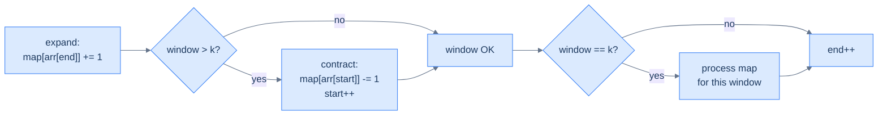
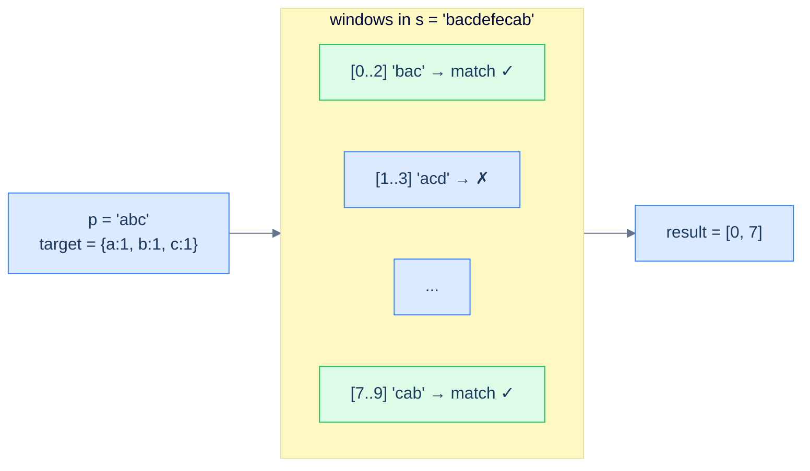

# 8. Pattern: Fixed-Sized Sliding Window

## The Hook

You're a security guard watching a row of CCTV monitors. Every monitor shows the last K seconds of footage from a different camera, and your job is to spot any face that appears *twice* in the same K-second clip. The naive approach: every second, re-watch all K seconds of every monitor — that's K seconds of work per monitor per second. With K = 60 and 3,600 seconds in an hour, that's 216,000 seconds of re-watching for one hour of feed.

Now imagine you keep a **whiteboard** next to each monitor with a tally of every face currently visible. When a new second of footage rolls in, you add a tick mark for the new face. When the oldest second rolls off, you erase a tick. Spotting a duplicate is now a *glance* — anyone with a tally over 1 is a hit. The work per second is **constant**, no matter how big K is.

That whiteboard is a **hash map**. The act of "add the new, drop the old" as the window slides is the **fixed-sized sliding window** technique. Combine the two and a fleet of O(N·K) algorithms collapse to O(N). Anagram detection in a stream, duplicate detection within range, distinct-element counts per window, sliding aggregations — every one of them is the same shape: *one map, slide the window, add to the right edge, subtract from the left*.

This is the first time in this section we use a hash table on a *moving* picture. Once the move clicks, you'll see windows everywhere.

---

## Table of contents

1. [Understanding the fixed-sized sliding window pattern](#understanding-the-fixed-sized-sliding-window-pattern)
2. [Identifying the fixed-sized sliding window pattern](#identifying-the-fixed-sized-sliding-window-pattern)
3. [Duplicate detection](#duplicate-detection)
4. [Subarray distinctness](#subarray-distinctness)
5. [Contains variation](#contains-variation)
6. [Anagram finder](#anagram-finder)

***

# Understanding the fixed-sized sliding window pattern

Some problems hand you a sequence and ask a question about *every contiguous window of size K*: "How many distinct elements?" "Any duplicates?" "Does this match a fixed pattern?" The brute-force answer is to enumerate every window and recompute the answer from scratch — O(N·K) work because each window scan is O(K) and there are N − K + 1 windows.

The sliding-window technique cuts this to **O(N)** by exploiting a beautiful observation: when the window moves one step right, *almost everything inside it stays the same*. Only **two** elements change: the one being added on the right, and the one falling off on the left. If we keep a running summary of the window in a hash map, we can update it in O(1) per shift instead of recomputing from scratch.

```d2
direction: right

arr: input array {
  grid-columns: 7
  grid-gap: 0
  a0: a {style.fill: "#fde68a"; style.stroke: "#d97706"}
  a1: b {style.fill: "#fde68a"; style.stroke: "#d97706"}
  a2: a {style.fill: "#fde68a"; style.stroke: "#d97706"}
  a3: c {style.fill: "#fde68a"; style.stroke: "#d97706"}
  a4: b
  a5: d
  a6: a
}

w1: "window 1: [a, b, a, c]" {style.fill: "#fde68a"; style.stroke: "#d97706"}
w2: "window 2: [b, a, c, b]" {style.fill: "#dbeafe"; style.stroke: "#3b82f6"}

arr -> w1: "positions 0..3"
arr -> w2: "positions 1..4 (slide by 1)"
```

<p align="center"><strong>Sliding by one step — windows 1 and 2 share three elements (b, a, c); only <code>a</code> drops off the left and <code>b</code> arrives on the right. Recomputing from scratch wastes work on the three shared elements; the sliding-window technique avoids it entirely.</strong></p>

We maintain two pointers, `start` and `end`, that mark the window's boundaries. We hold a hash map summarising the window's contents (typically a frequency map). Each step of the algorithm:

1. **Add** the new right-edge element's contribution to the map (`end` advanced).
2. If the window has grown past size K, **subtract** the left-edge element's contribution and advance `start`.
3. When the window is exactly size K, **process** the map to answer the question for this window.



<p align="center"><strong>The fixed-window loop in one picture — the four-line dance of <em>add new, drop old, process if size matches, advance</em>. The whole structure of every problem in this lesson is a variation on these four steps.</strong></p>

## Algorithm

> **Algorithm**
>
> -   **Step 1:** Initialise `start = 0`, `end = 0`, and an empty `map`.
> -   **Step 2:** While `end < arr.length`:
>     -   **Step 2.1:** Add the contribution of `arr[end]` to `map`.
>     -   **Step 2.2:** If `end − start + 1 > k`, remove the contribution of `arr[start]` and increment `start`.
>     -   **Step 2.3:** If `end − start + 1 == k`, process `map` to answer the question for this window.
>     -   **Step 2.4:** Increment `end`.

Note the ordering: *add first, then check size, then process*. This guarantees that by the time we reach step 2.3, the window is exactly `k` elements wide and the map reflects them.

> *Predict before reading on — what would happen if we processed the map BEFORE removing the start element when the window grew past k? The map would contain k+1 entries instead of k for one fleeting moment — and any "process" step would observe stale data. The order of operations is part of the algorithm's correctness.*

## Implementation

The generic skeleton — every problem in this lesson is a one-line change to step 2.3 ("process the map").


```python run
def fixed_size_sliding_window(arr: List[str], k: int) -> None:
    # Initialize start and end to 0
    start, end = 0, 0

    # Initialize frequency dictionary to count character occurrences
    frequency: dict[str, int] = defaultdict(int)

    # Move the window one step to the right until
    # it reaches the end of the array
    while end < len(arr):
        # Add contribution of arr[end] to the frequency map
        frequency[arr[end]] = frequency.get(arr[end], 0) + 1

        # Check if window size is greater than k
        if end - start + 1 > k:
            # Remove contribution of arr[start] from frequency map
            frequency[arr[start]] -= 1
            # Remove arr[start] from frequency if its count is 0
            if frequency[arr[start]] == 0:
                del frequency[arr[start]]
            # Increment start to contract the window from start
            start += 1

        # Check if window size equals k
        if end - start + 1 == k:
            # Process the values in frequency map
            # (Additional processing logic would go here)
            pass

        # Increment end to expand the window from end
        end += 1

    return
```

```java run
public class FixedSizeSlidingWindow {

    public void fixedSizeSlidingWindow(char[] arr, int k) {
        // Initialize start and end to 0
        int start = 0, end = 0;

        // Initialize hash map to map characters to integer values
        HashMap<Character, Integer> frequency = new HashMap<>();

        // Move the window one step to the right until
        // it reaches the end of the array
        while (end < arr.length) {
            // Add contribution of arr[end] to the frequency map
            frequency.put(arr[end], frequency.getOrDefault(arr[end], 0) + 1);

            // Check if window size is greater than k
            if (end - start + 1 > k) {
                // Remove contribution of arr[start] from frequency map
                frequency.put(arr[start], frequency.get(arr[start]) - 1);
                if (frequency.get(arr[start]) == 0) {
                    frequency.remove(arr[start]); // Remove key if count is 0
                }
                // Increment start to contract the window from start
                start++;
            }

            // Check if window size equals k
            if (end - start + 1 == k) {
                // Process the values in frequency map
            }

            // Increment end to expand the window from end
            end++;
        }

        return;
    }
}
```


## Complexity Analysis

We touch each array element exactly twice (once as it enters the window, once as it leaves). Each touch is amortised O(1) hash-map work. Total: **O(N)** time.

The hash map holds at most K entries (the elements currently inside the window), so space is **O(K)**.

> **Best/Average/Worst case** — O(N) time, O(K) space. The whole point of the technique is that worst-case time *is* the average case; we don't pay extra for adversarial input.

***

# Identifying the fixed-sized sliding window pattern

This pattern fits problems with a *fixed window length K* (given in the input or derivable from another input string) where the answer for each window depends on a **summarisable** property — frequencies, distinct counts, sums, products, max/min — that can be maintained incrementally.

**Template:**
> Given a sequence and a window size K, slide a window of size K from left to right while maintaining a hash-map summary of the window's contents in O(1) per shift. Use the summary to answer the question per window.

If the question is *"for each window of size K, …"* and you can answer it from a frequency map, this pattern fits.

## Example — anagram finder

Given a string `s` and a pattern `p`, return all start indices in `s` where a *permutation* of `p` appears. The window size is fixed: `len(p)`. The summary is the frequency map of the current window's characters; an anagram exists iff that map equals the frequency map of `p`.

This is the canonical fixed-window problem — every other problem in this lesson is a simpler shape of it.

## Example problems

> -   Duplicate detection — *is there a duplicate in any window of size k?*
> -   Subarray distinctness — *how many distinct elements per window?*
> -   Contains variation — *does any window match a target frequency map?*
> -   Anagram finder — *which windows are anagrams of a given pattern?*

***

# Duplicate detection

## Problem Statement

Given an integer array `arr` and a positive integer `k`, return `true` if any subarray of size `k` contains a duplicate, `false` otherwise.

### Example 1
> -   **Input:** `arr = [2, 1, 2, 3, 2, 1, 4, 5], k = 5` → **Output:** `true`

### Example 2
> -   **Input:** `arr = [1, 1, 2, 4], k = 3` → **Output:** `true`

### Example 3
> -   **Input:** `arr = [1, 2, 3, 4], k = 2` → **Output:** `false`

<details>
<summary><h2>Approach</h2></summary>


Slide a window of size `k`; maintain frequencies. The instant any frequency exceeds 1 inside a `k`-window, we have a duplicate — return `true`.

> *Mental shortcut* — duplicate-in-window is "is the size of the window's distinct-set less than k?". Equivalently, "did any insert push a frequency above 1?". The hash map gives both views in O(1).

</details>
<details>
<summary><h2>Solution</h2></summary>


```python run
from collections import defaultdict
from typing import List

class Solution:
    def duplicate_detection(self, arr: List[int], k: int) -> bool:

        # Map to store elements within the window and their counts
        frequency = defaultdict(int)

        # The start and end pointers for the window
        start, end = 0, 0

        while end < len(arr):

            # Add the current element to the window
            end_element = arr[end]
            frequency[end_element] += 1

            # Adjust the window size if it exceeds k
            if end - start >= k:
                start_element = arr[start]
                frequency[start_element] -= 1

                # Erase the current element from the window if its
                # frequency becomes 0
                if frequency[start_element] == 0:
                    del frequency[start_element]
                start += 1

            # Check if there's a duplicate in the window
            if frequency[end_element] > 1:
                return True

            # Move the end pointer to expand the window
            end += 1

        return False


# Examples from the problem statement
print(Solution().duplicate_detection([2, 1, 2, 3, 2, 1, 4, 5], 5))  # True
print(Solution().duplicate_detection([1, 1, 2, 4], 3))               # True
print(Solution().duplicate_detection([1, 2, 3, 4], 2))               # False

# Edge cases
print(Solution().duplicate_detection([], 3))                          # False
print(Solution().duplicate_detection([1], 1))                         # False
print(Solution().duplicate_detection([1, 2], 1))                      # False
print(Solution().duplicate_detection([1, 1], 2))                      # True
print(Solution().duplicate_detection([1, 2, 1], 5))                   # True
```

```java run
import java.util.*;

public class Main {
    static class Solution {
        public boolean duplicateDetection(int[] arr, int k) {

            // Map to store elements within the window and their counts
            Map<Integer, Integer> frequency = new HashMap<>();

            // The start and end pointers for the window
            int start = 0;
            int end = 0;

            while (end < arr.length) {

                // Add the current element to the window
                int endElement = arr[end];
                frequency.put(
                    endElement,
                    frequency.getOrDefault(endElement, 0) + 1
                );

                // Adjust the window size if it exceeds k
                if (end - start >= k) {
                    int startElement = arr[start];
                    frequency.put(
                        startElement,
                        frequency.get(startElement) - 1
                    );

                    // Erase the current element from the window if its
                    // frequency becomes 0
                    if (frequency.get(startElement) == 0) {
                        frequency.remove(startElement);
                    }
                    start++;
                }

                // Check if there's a duplicate in the window
                if (frequency.get(endElement) > 1) {
                    return true;
                }

                // Move the end pointer to expand the window
                end++;
            }

            return false;
        }
    }

    public static void main(String[] args) {
        // Examples from the problem statement
        System.out.println(new Solution().duplicateDetection(new int[]{2, 1, 2, 3, 2, 1, 4, 5}, 5)); // true
        System.out.println(new Solution().duplicateDetection(new int[]{1, 1, 2, 4}, 3));              // true
        System.out.println(new Solution().duplicateDetection(new int[]{1, 2, 3, 4}, 2));              // false

        // Edge cases
        System.out.println(new Solution().duplicateDetection(new int[]{}, 3));                        // false
        System.out.println(new Solution().duplicateDetection(new int[]{1}, 1));                       // false
        System.out.println(new Solution().duplicateDetection(new int[]{1, 2}, 1));                    // false
        System.out.println(new Solution().duplicateDetection(new int[]{1, 1}, 2));                    // true
        System.out.println(new Solution().duplicateDetection(new int[]{1, 2, 1}, 5));                 // true
    }
}
```

</details>


***

# Subarray distinctness

## Problem Statement

Given `arr` and a positive integer `k`, return an array containing the count of distinct elements in every contiguous subarray of size `k`.

### Example 1
> -   **Input:** `arr = [2,1,2,3,2,1,4,5], k = 5` → **Output:** `[3, 3, 4, 5]`

### Example 2
> -   **Input:** `arr = [1,1,2,4], k = 3` → **Output:** `[2, 3]`

### Example 3
> -   **Input:** `arr = [1,2,3,4], k = 1` → **Output:** `[1, 1, 1, 1]`

<details>
<summary><h2>Approach</h2></summary>


The number of *distinct* elements in the window is exactly `len(freq_map)` — the number of keys with non-zero count. The trick: when a frequency drops to zero on contraction, **delete the key** from the map so the size reflects only currently-present elements.

```d2
direction: right

w: "window contents" {
  grid-columns: 5
  grid-gap: 0
  a0: "2"
  a1: "1"
  a2: "2"
  a3: "3"
  a4: "2"
}

m: "freq map" {
  m1: "2 -> 3"
  m2: "1 -> 1"
  m3: "3 -> 1"
}

d: |md
  **distinct = len(freq) = 3**
| {style.fill: "#dcfce7"; style.stroke: "#16a34a"}

w -> m
m -> d
```

<p align="center"><strong>Distinct count via map size — every distinct element is one key in the map. Maintain the map's invariant that "count is non-zero" by deleting zero-count keys on contraction, and <code>len(map)</code> is your answer.</strong></p>

</details>
<details>
<summary><h2>Solution</h2></summary>


```python run
from collections import defaultdict
from typing import List

class Solution:
    def subarray_distinctness(self, arr: List[int], k: int) -> List[int]:

        # Initialize a dictionary to keep track of the count of elements
        # in the current window
        frequency = defaultdict(int)

        # Initialize the start and end indices of the window
        start, end = 0, 0

        # Initialize the result list to hold the count of distinct
        # elements in every subarray
        result = []

        # Loop through the array
        while end < len(arr):

            # Add the current element to the count dictionary
            frequency[arr[end]] += 1

            # If the current window size is equal to k, calculate the
            # count of distinct elements
            if end - start + 1 == k:
                result.append(len(frequency))

                # Remove the leftmost element from the count dictionary
                frequency[arr[start]] -= 1
                if frequency[arr[start]] == 0:
                    del frequency[arr[start]]

                # Contract the window
                start += 1

            # Expand the window to the right
            end += 1

        return result


# Examples from the problem statement
print(Solution().subarray_distinctness([2, 1, 2, 3, 2, 1, 4, 5], 5))  # [3, 3, 4, 5]
print(Solution().subarray_distinctness([1, 1, 2, 4], 3))               # [2, 3]
print(Solution().subarray_distinctness([1, 2, 3, 4], 1))               # [1, 1, 1, 1]

# Edge cases
print(Solution().subarray_distinctness([1], 1))                         # [1]
print(Solution().subarray_distinctness([1, 1, 1, 1], 2))               # [1, 1, 1]
print(Solution().subarray_distinctness([1, 2, 3, 4], 4))               # [4]
print(Solution().subarray_distinctness([5, 5, 5], 3))                  # [1]
```

```java run
import java.util.*;

public class Main {
    static class Solution {
        public List<Integer> subarrayDistinctness(int[] arr, int k) {

            // Initialize a map to keep track of the count of elements in the
            // current window
            Map<Integer, Integer> frequency = new HashMap<>();

            // Initialize the start and end indices of the window
            int start = 0;
            int end = 0;

            // Initialize the result list to hold the count of distinct
            // elements in every subarray
            List<Integer> result = new ArrayList<>();

            // Loop through the array
            while (end < arr.length) {

                // Add the current element to the count map
                frequency.put(
                    arr[end],
                    frequency.getOrDefault(arr[end], 0) + 1
                );

                // If the current window size is equal to k, calculate the
                // count of distinct elements
                if (end - start + 1 == k) {
                    result.add(frequency.size());

                    // Remove the leftmost element from the count map
                    int startElement = arr[start];
                    frequency.put(
                        startElement,
                        frequency.get(startElement) - 1
                    );
                    if (frequency.get(startElement) == 0) {
                        frequency.remove(startElement);
                    }

                    // Contract the window
                    start++;
                }

                // Expand the window to the right
                end++;
            }

            return result;
        }
    }

    public static void main(String[] args) {
        // Examples from the problem statement
        System.out.println(new Solution().subarrayDistinctness(new int[]{2, 1, 2, 3, 2, 1, 4, 5}, 5)); // [3, 3, 4, 5]
        System.out.println(new Solution().subarrayDistinctness(new int[]{1, 1, 2, 4}, 3));              // [2, 3]
        System.out.println(new Solution().subarrayDistinctness(new int[]{1, 2, 3, 4}, 1));              // [1, 1, 1, 1]

        // Edge cases
        System.out.println(new Solution().subarrayDistinctness(new int[]{1}, 1));                       // [1]
        System.out.println(new Solution().subarrayDistinctness(new int[]{1, 1, 1, 1}, 2));              // [1, 1, 1]
        System.out.println(new Solution().subarrayDistinctness(new int[]{1, 2, 3, 4}, 4));              // [4]
        System.out.println(new Solution().subarrayDistinctness(new int[]{5, 5, 5}, 3));                 // [1]
    }
}
```

</details>


***

# Contains variation

## Problem Statement

Given two strings `s1` and `s2`, return `true` if `s2` contains a permutation of `s1`, else `false`.

### Example 1
> -   **Input:** `s1 = "abc", s2 = "edbaclm"` → **Output:** `true` (`"bac"` is a permutation of `"abc"`)

### Example 2
> -   **Input:** `s1 = "cod", s2 = "intdoce"` → **Output:** `true` (`"doc"`)

### Example 3
> -   **Input:** `s1 = "abc", s2 = "defghiab"` → **Output:** `false`

<details>
<summary><h2>Approach</h2></summary>


The window size is fixed: `len(s1)`. A window is a permutation of `s1` iff the window's frequency map equals `s1`'s frequency map. Slide the window over `s2`; compare the maps each time the window is the right size.

To avoid O(K) map comparisons every step, you can maintain a counter `matches` of how many distinct characters have *exactly* the right count. We use the simpler `map == map` here for clarity; the optimisation matters only for large K.

</details>
<details>
<summary><h2>Solution</h2></summary>


```python run
from collections import defaultdict
from typing import Dict

class Solution:
    def count_frequency(self, s: str) -> Dict[str, int]:
        frequency = defaultdict(int)
        for ch in s:
            frequency[ch] += 1

        return frequency

    def contains_variation(self, s1: str, s2: str) -> bool:

        # Frequency map for s1
        s1_frequency = self.count_frequency(s1)

        # Frequency maps for characters in sliding window in s2
        frequency = defaultdict(int)

        # The start and end pointers for the window
        start, end = 0, 0

        while end < len(s2):

            # Add the current character to the window
            char_end = s2[end]
            frequency[char_end] += 1

            # If the window size matches s1's length, check for a match
            if end - start + 1 == len(s1):
                if frequency == s1_frequency:
                    return True

                # Shrink the window from the left
                char_start = s2[start]
                frequency[char_start] -= 1
                if frequency[char_start] == 0:
                    del frequency[char_start]
                start += 1

            # Expand the window to the right
            end += 1

        return False


# Examples from the problem statement
print(Solution().contains_variation("abc", "edbaclm"))   # True
print(Solution().contains_variation("cod", "intdoce"))   # True
print(Solution().contains_variation("abc", "defghiab"))  # False

# Edge cases
print(Solution().contains_variation("a", "a"))           # True
print(Solution().contains_variation("ab", "ba"))         # True
print(Solution().contains_variation("abc", "abc"))       # True
print(Solution().contains_variation("abc", "ab"))        # False
print(Solution().contains_variation("aa", "aab"))        # True
```

```java run
import java.util.*;

public class Main {
    static class Solution {
        private Map<Character, Integer> countFrequency(String s) {
            Map<Character, Integer> frequency = new HashMap<>();
            for (char ch : s.toCharArray()) {
                frequency.put(ch, frequency.getOrDefault(ch, 0) + 1);
            }

            return frequency;
        }

        public boolean containsVariation(String s1, String s2) {

            // Frequency map for s1
            Map<Character, Integer> s1Frequency = countFrequency(s1);

            // Frequency maps for characters in sliding window in s2
            Map<Character, Integer> frequency = new HashMap<>();

            // The start and end pointers for the window
            int start = 0;
            int end = 0;

            while (end < s2.length()) {

                // Add the current character to the window
                char endChar = s2.charAt(end);
                frequency.put(
                    endChar,
                    frequency.getOrDefault(endChar, 0) + 1
                );

                // If the window size matches s1's length, check for a match
                if (end - start + 1 == s1.length()) {
                    if (frequency.equals(s1Frequency)) {
                        return true;
                    }

                    // Shrink the window from the left
                    char startChar = s2.charAt(start);
                    frequency.put(startChar, frequency.get(startChar) - 1);
                    if (frequency.get(startChar) == 0) {
                        frequency.remove(startChar);
                    }
                    start++;
                }

                // Expand the window to the right
                end++;
            }

            return false;
        }
    }

    public static void main(String[] args) {
        // Examples from the problem statement
        System.out.println(new Solution().containsVariation("abc", "edbaclm"));   // true
        System.out.println(new Solution().containsVariation("cod", "intdoce"));   // true
        System.out.println(new Solution().containsVariation("abc", "defghiab"));  // false

        // Edge cases
        System.out.println(new Solution().containsVariation("a", "a"));           // true
        System.out.println(new Solution().containsVariation("ab", "ba"));         // true
        System.out.println(new Solution().containsVariation("abc", "abc"));       // true
        System.out.println(new Solution().containsVariation("abc", "ab"));        // false
        System.out.println(new Solution().containsVariation("aa", "aab"));        // true
    }
}
```

</details>


***

# Anagram finder

## Problem Statement

Given strings `s` and `p`, return all the start indices in `s` of substrings that are anagrams of `p`.

### Example 1
> -   **Input:** `s = "bacdefecab", p = "abc"` → **Output:** `[0, 7]` (`"bac"` at 0, `"cab"` at 7)

### Example 2
> -   **Input:** `s = "fdef", p = "def"` → **Output:** `[0, 1]` (`"fde"` at 0, `"def"` at 1; both are anagrams of `"def"`)

> *Wait — `"fde"` is an anagram of `"def"`? Yes — same multiset of letters {d, e, f}.*

### Example 3
> -   **Input:** `s = "abcdef", p = "gh"` → **Output:** `[]`

<details>
<summary><h2>Approach</h2></summary>


`Contains variation` returns the *first* match; `Anagram finder` returns *all* matches. Same scanning pattern, same window size (`len(p)`) — but instead of returning on the first match, append the start index to the result list and keep going.

Rather than comparing two frequency maps each step, this solution keeps a single running counter, `count`, of how many characters from `p` are still *needed* in the current window. It starts at `len(p)`. When the right pointer brings in a character that the window still needs (`frequency[char] > 0`), `count` drops by one; the character's required count in `frequency` is then decremented (and may go negative, recording a surplus). When the left pointer drops a character that was genuinely part of `p`'s demand (`frequency[char] >= 0` after restoring it), `count` goes back up. Whenever `count` hits `0`, every character of `p` is accounted for inside the window — `start` is a valid anagram index.



<p align="center"><strong>Anagram finder — slide a window of size <code>len(p)</code> across <code>s</code>, recording start indices wherever the window's frequency map matches <code>p</code>'s. Same skeleton as <code>Contains variation</code>, just append-don't-return.</strong></p>

</details>
<details>
<summary><h2>Solution</h2></summary>


```python run
from collections import defaultdict
from typing import List, Dict

class Solution:
    def count_frequency(self, s: str) -> Dict[str, int]:
        frequency = defaultdict(int)
        for ch in s:
            frequency[ch] += 1
        return frequency

    def find_anagrams_in_window(
        self, s: str, frequency: Dict[str, int], k: int
    ) -> List[int]:
        start = 0
        end = 0
        count = k
        result = []

        # Traverse the string using two pointers
        while end < len(s):
            char_end = s[end]

            # If the character is in the pattern, update the frequency
            # map
            if char_end in frequency:
                if frequency[char_end] > 0:
                    count -= 1
                frequency[char_end] -= 1

            # If all characters in the pattern are found, add start index
            # to result
            if count == 0:
                result.append(start)

            # Shrink the window from the left if the window size is equal
            # to p's size
            if end - start + 1 == k:
                char_start = s[start]
                if char_start in frequency:
                    if frequency[char_start] >= 0:
                        count += 1
                    frequency[char_start] += 1
                start += 1

            end += 1

        return result

    def anagram_finder(self, s: str, p: str) -> List[int]:
        if not s or not p or len(s) < len(p):
            return []

        # Create a frequency map for characters in the pattern
        p_frequency = self.count_frequency(p)

        # Use sliding window approach to find anagrams of p in s
        return self.find_anagrams_in_window(s, p_frequency, len(p))


# Examples from the problem statement
print(Solution().anagram_finder("bacdefecab", "abc"))  # [0, 7]
print(Solution().anagram_finder("fdef", "def"))        # [0, 1]
print(Solution().anagram_finder("abcdef", "gh"))       # []

# Edge cases
print(Solution().anagram_finder("", "a"))              # []
print(Solution().anagram_finder("a", ""))              # []
print(Solution().anagram_finder("aaa", "aa"))          # [0, 1]
print(Solution().anagram_finder("abc", "abc"))         # [0]
print(Solution().anagram_finder("cbaebabacd", "abc"))  # [0, 6]
```

```java run
import java.util.*;

public class Main {
    static class Solution {
        private Map<Character, Integer> countFrequency(String s) {
            Map<Character, Integer> frequency = new HashMap<>();
            for (char ch : s.toCharArray()) {
                frequency.put(ch, frequency.getOrDefault(ch, 0) + 1);
            }
            return frequency;
        }

        private List<Integer> findAnagramsInWindow(
            String s,
            Map<Character, Integer> frequency,
            int K
        ) {
            int start = 0;
            int end = 0;
            int count = K;
            List<Integer> result = new ArrayList<>();

            // Traverse the string using two pointers
            while (end < s.length()) {
                char endChar = s.charAt(end);

                // If the character is in the pattern, update the frequency
                // map
                if (frequency.containsKey(endChar)) {
                    if (frequency.get(endChar) > 0) {
                        count--;
                    }
                    frequency.put(endChar, frequency.get(endChar) - 1);
                }

                // If all characters in the pattern are found, add start
                // index to result
                if (count == 0) {
                    result.add(start);
                }

                // Shrink the window from the left if the window size is
                // equal to p's size
                if (end - start + 1 == K) {
                    char startChar = s.charAt(start);
                    if (frequency.containsKey(startChar)) {
                        if (frequency.get(startChar) >= 0) {
                            count++;
                        }
                        frequency.put(
                            startChar,
                            frequency.get(startChar) + 1
                        );
                    }
                    start++;
                }
                end++;
            }

            return result;
        }

        public List<Integer> anagramFinder(String s, String p) {
            if (s.isEmpty() || p.isEmpty() || s.length() < p.length()) {
                return new ArrayList<>();
            }

            // Create a frequency map for characters in the pattern
            Map<Character, Integer> pFrequency = countFrequency(p);

            // Use sliding window approach to find anagrams of p in s
            return findAnagramsInWindow(s, pFrequency, p.length());
        }
    }

    public static void main(String[] args) {
        // Examples from the problem statement
        System.out.println(new Solution().anagramFinder("bacdefecab", "abc")); // [0, 7]
        System.out.println(new Solution().anagramFinder("fdef", "def"));       // [0, 1]
        System.out.println(new Solution().anagramFinder("abcdef", "gh"));      // []

        // Edge cases
        System.out.println(new Solution().anagramFinder("", "a"));             // []
        System.out.println(new Solution().anagramFinder("a", ""));             // []
        System.out.println(new Solution().anagramFinder("aaa", "aa"));         // [0, 1]
        System.out.println(new Solution().anagramFinder("abc", "abc"));        // [0]
        System.out.println(new Solution().anagramFinder("cbaebabacd", "abc")); // [0, 6]
    }
}
```

</details>
<details>
<summary><h2>Final Takeaway</h2></summary>


The fixed-sized sliding window is the **moving** version of the counting pattern. The hash map keeps a running summary of the window's contents; the window's size never changes, so the map's overall workload is O(1) per shift. Three lessons worth memorising:

1. **Add right, drop left, process if-size-matches.** The four-line skeleton is identical for every problem; only the "process" step differs.
2. **Delete keys whose count drops to zero.** It's not just hygiene — `len(map)` is a valid distinct-count answer only if you maintain that invariant.
3. **Window-size = len(pattern).** When a problem says "find any anagram of p in s" or "any permutation of p", the window size is *given to you* by the second string. The hardest part is recognising it.

> *Coming up — what if the window can grow and shrink based on a *condition* rather than a fixed size? That's the **variable-sized sliding window**, and it solves a different family of problems: "longest substring with at most K distinct chars", "smallest subarray with sum ≥ S", "longest substring without repeating characters". Same hash-map summary, but the window flexes — and that flexibility unlocks a much wider class of problems.*

</details>