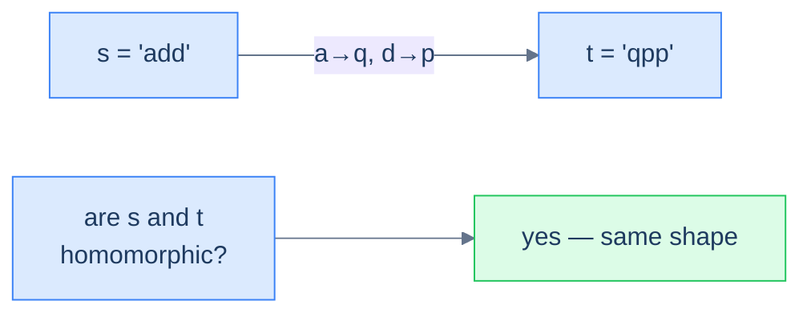
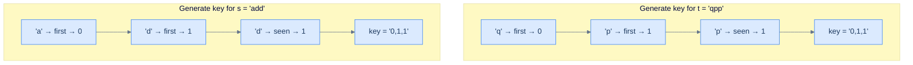

# Understanding the key-generation pattern

A **key** (or "pattern" or "signature" or "fingerprint") is a transformation that collapses many inputs to one. The transformation should obey one rule: *two inputs are "the same" (in whatever sense the problem cares about) if and only if their keys are byte-for-byte equal*. Once you have such a transformation, the rest of the algorithm is trivial — you just feed keys into a hash map and let collisions become groups.

> 🖼 Diagram — The key-generation pattern in one picture — every input is fingerprinted into a key; equal keys land in the same bucket; the buckets are the answer. The whole problem reduces to "design a good key."
```d2
direction: right

inp: raw inputs {
  grid-rows: 2
  grid-gap: 8
  a: add
  b: qpp
  c: dad
  d: mom
  e: abc
}

keys: keys {
  k1: "0,1,1"
  k2: "0,1,0"
  k3: "0,1,2"
}

buckets: hash-map buckets {
  g1: "[add, qpp]"
  g2: "[dad, mom]"
  g3: "[abc]"
}

inp.a -> keys.k1: "key()"
inp.b -> keys.k1: "key()"
inp.c -> keys.k2: "key()"
inp.d -> keys.k2: "key()"
inp.e -> keys.k3: "key()"

keys.k1 -> buckets.g1
keys.k2 -> buckets.g2
keys.k3 -> buckets.g3
```

<p align="center"><strong>The key-generation pattern in one picture — every input is fingerprinted into a key; equal keys land in the same bucket; the buckets <em>are</em> the answer. The whole problem reduces to "design a good key."</strong></p>

The key generator typically does **not** solve the problem on its own. Its job is to produce a *grouping key* that downstream code can use. In some problems (homomorphism check) the answer is "are these two keys equal?". In others (cluster anagrams, cluster displaced strings) the answer is "what are the equivalence classes?". The shape of the answer changes, but the key is always the lever.

## Why Naive Isn't Enough

The obvious way to decide whether two inputs are "the same" is to compare them directly with a bespoke rule. For homomorphism that means checking, character by character, that a consistent substitution maps one string onto the other. For grouping it means comparing every input against every other one to see which belong together.

The cost is the problem, not the correctness. Pairwise comparison across `M` inputs is `O(M²)` calls, and each bespoke comparison can itself cost `O(N)` for length-`N` inputs — so grouping by brute force lands at `O(M² × N)` time. The space is `O(1)` beyond the output, but the quadratic factor dominates the moment the input list grows.

The waste is structural. To make this concrete: grouping `["abc", "ghi", "xyz", "b", "c"]` by displacement re-runs the displacement test between *every* pair — `abc` vs `ghi`, `abc` vs `xyz`, `ghi` vs `xyz`, and so on — even though all three share the identical gap signature `(1, 1)`. The algorithm re-derives the same fact about each string once per comparison instead of computing it once and reusing it.

So the key idea is: equivalence is a property of *each input on its own*, not of a pair, and a bespoke pairwise test keeps re-discovering that property instead of capturing it once as a key.

## The Core Idea

The fix is to compute one **canonical key** per input and let a hash map do the matching. Walk each input once, transform it into a key whose only contract is *equal keys ⇔ equivalent inputs*, and use that key as a hash-map lookup or bucket.

A good key collapses an entire equivalence class to a single byte string. Two inputs that the problem calls "the same" must hash to byte-identical keys, and two inputs it calls "different" must not. Once that contract holds, every downstream question becomes cheap: a homomorphism check is one key comparison, and grouping is one bucket-append per input. So the core insight is: design the transformation so sameness becomes byte-equality, then the hash map turns an `O(M²)` matching problem into `O(M)` keyed lookups.

## How the Key Is Built

The key generator is a single left-to-right scan with a small piece of memory. It reads each item of the input in order and emits one token per item into a growing key string.

The memory is what makes the encoding canonical. Three pieces cooperate on every step:

- **A map from seen items to assigned tokens** — so a repeated item always emits the token it earned the first time.
- **A monotonically increasing `seed`** — the next unused token, handed out the moment a genuinely new item appears.
- **A delimiter between tokens** — a non-token character (`,`) that keeps multi-digit tokens unambiguous.

To make this concrete: encoding `add` reads `a` (new → token `0`), then `d` (new → token `1`), then `d` again (seen → reuse `1`), producing `"0,1,1"`. Encoding `qpp` runs the same scan and also produces `"0,1,1"`, because both strings repeat their second distinct character in the third slot. The core insight is: the scan never inspects the items' actual values for the answer — only their *first-appearance order* — so any two inputs with the same repeat structure converge on the same key.

## The Generic Algorithm

The technique is one pass over the input with a map and a counter. The steps are identical whether the input is a string of characters, a list of words, or any other iterable.

> **Algorithm**
>
> -   **Step 1:** Initialise an empty map `charToIndex`, a counter `seed = 0`, and an empty `pattern` string.
> -   **Step 2:** For each character `ch` in the input:
>     -   If `ch` is not in `charToIndex`, set `charToIndex[ch] = seed` and increment `seed`.
>     -   Append `charToIndex[ch]` followed by a delimiter `,` to `pattern`.
> -   **Step 3:** Return `pattern`.

The delimiter matters: without it, indices like `1,12` and `11,2` produce the same byte sequence `112`. A `,` (or any non-digit separator) keeps the encoding unambiguous.

## Complexity Analysis

| Measure | Value | Why |
|---|---|---|
| Time | **O(N)** | One pass over the `N`-item input; each map read or write is `O(1)` amortised. |
| Space | **O(K)** | The map holds one entry per *distinct* item — `K` entries — and the key string is `O(N)`. |

`K` ranges from `1` (all items identical → best-case `O(1)` map) to `N` (all distinct → worst-case `O(N)` map). The time is `O(N)` in every case because the scan length is fixed by the input, not by how many items repeat.

## Variants / Taxonomy

Every problem in this family runs the same scan; what changes is *what counts as an item* and *how the per-item token is derived*. The axes:

- **Identity key (first-occurrence index).** Token = the order in which each distinct item first appears. Powers homomorphism and pattern-matching, where only the *repeat structure* matters.
- **Categorical key (bucket id).** Token = a fixed class the item belongs to — keyboard row, parity, modular bucket. Powers row-specific words, where the item's category, not its order, is the signal.
- **Relational key (gap or delta sequence).** Token = the relationship between adjacent items — the mod-26 gap between consecutive letters. Powers cluster-displaced-strings, where shifting all items by a constant must preserve the key.
- **Single sequence vs. paired sequences.** Some problems key one input and group (cluster displaced strings); others key two inputs and compare for equality (homomorphic strings, pattern matching).

The identity-key, single-sequence case is the workhorse; the categorical and relational keys are the same scan with a different token rule, and the paired-sequence case runs the scan twice and compares.

# Identifying the key-generation pattern

The pattern fits **easy-to-medium** problems on arrays or strings whose answer depends on assigning each input a *canonical form* such that "equivalent" inputs share that form. Almost all of these problems share a single template.

**Template:**
> Given an iterable sequence (or pair of sequences), generate a canonical key for it; then group, compare, or classify by that key.

If you can answer "what makes two of these inputs equivalent?" with a function from input to bytes, the key-generation pattern fits.

## Recognition Checklist

Four questions confirm a problem fits the key-generation pattern. If every answer is "yes," the key-scan skeleton applies as-is.

1. **Does the answer depend on a *canonical form* of each input rather than its raw bytes?** The problem cares whether inputs are "the same" under some equivalence (same shape, same row, same shift), not whether they're literally equal.
2. **Can you define that equivalence as a function from input to bytes?** You must be able to say "two inputs are equivalent ⇔ their keys are byte-identical" — if you can't pin the key down, the pattern doesn't apply.
3. **Is each input keyed independently in a single pass?** Keying one input never needs to look at another; the scan reads one sequence start-to-end and emits a key.
4. **Is the per-item work `O(1)`?** Each item costs a constant-time map lookup, token assignment, and append — no nested scan inside the keying loop.

These four questions reappear as the **Diagnostic Questions** table in every problem write-up that follows.

## Canonical Example

Walk a full problem end-to-end to see the pattern click into place.

### Problem Statement

> **Problem:** Given two strings `s` and `t`, return `true` if they are **homomorphic**. Two strings are homomorphic if you can substitute each character of `s` with a chosen character (preserving order, with no two characters mapping to the same target) so that `s` becomes `t`.

Take `s = "add"` and `t = "qpp"`. The expected answer is `true`: map `a → q` and `d → p`.

### Brute Force

Build the substitution map directly. Walk `s` and `t` together; for each position, record that `s[i]` must map to `t[i]`, and reject if `s[i]` already mapped to a different character or if two source characters claim the same target. It works in `O(N)` for a single pair — but the moment the question becomes "group all homomorphic strings," this bespoke check must run between every pair, giving `O(M² × N)` time over `M` strings. The space is `O(K)` for the map, where `K` is the distinct-character count.

> 🖼 Diagram — Homomorphic strings — two strings are homomorphic if one can be re-labelled into the other while preserving the order and structure of repeats.


<p align="center"><strong>Homomorphic strings — two strings are homomorphic if one can be re-labelled into the other while preserving the order and structure of repeats.</strong></p>

### Key Insight

Two homomorphic strings have the same **shape**, which we can capture by replacing each character with the *index of its first appearance*. The first distinct character in the string becomes `0`, the second distinct character becomes `1`, the third becomes `2`, and so on. Every later occurrence reuses the index its first appearance got. The core insight is: encode each string's repeat structure as a key, and homomorphism collapses to a single key comparison.

`add` → `a` is the 0th distinct character, `d` is the 1st, `d` reuses index 1 → `"0,1,1"`.

`qpp` → `q` is the 0th, `p` is the 1st, `p` reuses index 1 → `"0,1,1"`.

The two keys match → the strings are homomorphic.

> 🖼 Diagram — Building the homomorphic-shape key — each new character gets the next available index; repeats reuse it. Two strings with the same key have the same repeat structure, which is exactly what homomorphism requires.


<p align="center"><strong>Building the homomorphic-shape key — each new character gets the next available index; repeats reuse it. Two strings with the same key have the same repeat structure, which is exactly what homomorphism requires.</strong></p>

### Optimized Solution

Run the generic key scan on both strings, then compare. Two moving parts:

1. Generate the first-occurrence-index key for `s` and for `t`.
2. Return whether the two keys are byte-identical (after an early length check).

This lands at **O(N)** time and **O(K)** space — one scan per string, where `K` is the number of distinct characters.


```python run
def generate_pattern(s: str) -> str:
    char_to_index, parts, seed = {}, [], 0
    for ch in s:
        if ch not in char_to_index:
            char_to_index[ch] = seed; seed += 1
        parts.append(str(char_to_index[ch]))
    # Delimiter prevents '1' + '12' colliding with '11' + '2'
    return ','.join(parts)

def homomorphic_strings(s: str, t: str) -> bool:
    if len(s) != len(t): return False
    return generate_pattern(s) == generate_pattern(t)

print(homomorphic_strings("add", "qpp"))   # True
print(homomorphic_strings("dad", "mom"))   # True
print(homomorphic_strings("all", "mom"))   # False
```

```java run
import java.util.*;

public class Main {
    static String generatePattern(String s) {
        Map<Character, Integer> charToIndex = new HashMap<>();
        StringBuilder pattern = new StringBuilder();
        int seed = 0;
        for (char ch : s.toCharArray()) {
            if (!charToIndex.containsKey(ch)) charToIndex.put(ch, seed++);
            pattern.append(charToIndex.get(ch)).append(',');
        }
        return pattern.toString();
    }
    static boolean homomorphicStrings(String s, String t) {
        if (s.length() != t.length()) return false;
        return generatePattern(s).equals(generatePattern(t));
    }
    public static void main(String[] args) {
        System.out.println(homomorphicStrings("add", "qpp"));   // true
        System.out.println(homomorphicStrings("dad", "mom"));   // true
        System.out.println(homomorphicStrings("all", "mom"));   // false
    }
}
```


### Trace

Generate the key for each string, then compare:

```
s = "add"
  ch='a'  new → seed 0   charToIndex={a:0}        pattern="0,"
  ch='d'  new → seed 1   charToIndex={a:0,d:1}    pattern="0,1,"
  ch='d'  seen → reuse 1                          pattern="0,1,1,"
  key(s) = "0,1,1,"

t = "qpp"
  ch='q'  new → seed 0   charToIndex={q:0}        pattern="0,"
  ch='p'  new → seed 1   charToIndex={q:0,p:1}    pattern="0,1,"
  ch='p'  seen → reuse 1                          pattern="0,1,1,"
  key(t) = "0,1,1,"

key(s) == key(t)  →  return True
```

The keys match, so the result is `true` — matching the expected output.

### Fitting the Template

| Check | Answer for Homomorphic Strings |
|---|---|
| **Q1.** Does the answer depend on a *canonical form* of each input? | **Yes** — two strings are homomorphic exactly when their first-occurrence-index keys match. |
| **Q2.** Can you define equivalence as a function from input to bytes? | **Yes** — the key scan maps each string to a byte string; equal bytes mean equal shape. |
| **Q3.** Is each input keyed independently in one pass? | **Yes** — each string is scanned once on its own, no cross-comparison during keying. |
| **Q4.** Is the per-item work `O(1)`? | **Yes** — each character triggers one map lookup and one append, both `O(1)` amortised. |

## Problems in This Category

The four problems below all instantiate "design a key for input X". The key differs each time — keyboard-row id, first-occurrence index, character-shift sequence — but the recipe is identical: key each input, then group or compare.

| # | Problem | Key shape | Twist on the skeleton |
|---|---|---|---|
| 1 | [Row Specific Words](02-problems/01-row-specific-words) | Categorical (row id) | Key is one bucket id; keep the input only if all its items share it |
| 2 | [Homomorphic Strings](02-problems/02-homomorphic-strings) | First-occurrence index | Key two strings, compare for byte-equality |
| 3 | [Pattern Matching](02-problems/03-pattern-matching) | First-occurrence index | Key chars of one input vs. words of the other; compare |
| 4 | [Cluster Displaced Strings](02-problems/04-cluster-displaced-strings) | Relational (mod-26 gaps) | Key each string by its gap sequence; bucket by key |

Each is a small variation on the same skeleton — only the token rule and the group-vs-compare step change.
