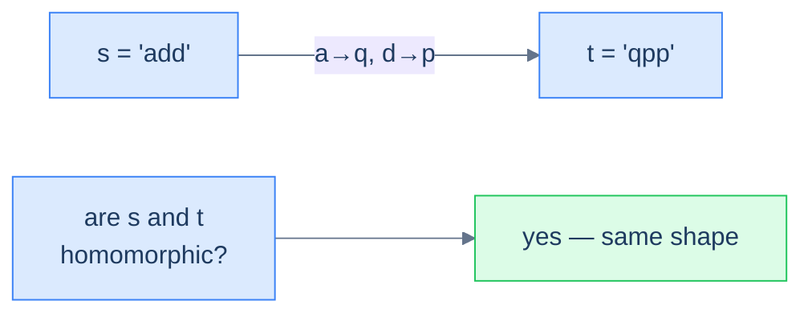
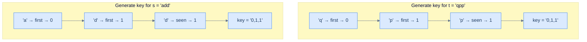

# Understanding the key-generation pattern

A **key** (or "pattern" or "signature" or "fingerprint") is a transformation that collapses many inputs to one. The transformation should obey one rule: *two inputs are "the same" (in whatever sense the problem cares about) if and only if their keys are byte-for-byte equal*. Once you have such a transformation, the rest of the algorithm is trivial — you just feed keys into a hash map and let collisions become groups.

> 🖼 Diagram — The key-generation pattern in one picture — every input is fingerprinted into a key; equal keys land in the same bucket; the buckets are the answer. The whole problem reduces to "design a good key."
```d2
direction: right

inp: raw inputs {
  grid-rows: 2
  grid-gap: 8
  a: add
  b: qpp
  c: dad
  d: mom
  e: abc
}

keys: keys {
  k1: "0,1,1"
  k2: "0,1,0"
  k3: "0,1,2"
}

buckets: hash-map buckets {
  g1: "[add, qpp]"
  g2: "[dad, mom]"
  g3: "[abc]"
}

inp.a -> keys.k1: "key()"
inp.b -> keys.k1: "key()"
inp.c -> keys.k2: "key()"
inp.d -> keys.k2: "key()"
inp.e -> keys.k3: "key()"

keys.k1 -> buckets.g1
keys.k2 -> buckets.g2
keys.k3 -> buckets.g3
```

<p align="center"><strong>The key-generation pattern in one picture — every input is fingerprinted into a key; equal keys land in the same bucket; the buckets <em>are</em> the answer. The whole problem reduces to "design a good key."</strong></p>

The key generator typically does **not** solve the problem on its own. Its job is to produce a *grouping key* that downstream code can use. In some problems (homomorphism check) the answer is "are these two keys equal?". In others (cluster anagrams, cluster displaced strings) the answer is "what are the equivalence classes?". The shape of the answer changes, but the key is always the lever.

# Identifying the key-generation pattern

The pattern fits **easy-to-medium** problems on arrays or strings whose answer depends on assigning each input a *canonical form* such that "equivalent" inputs share that form. Almost all of these problems share a single template.

**Template:**
> Given an iterable sequence (or pair of sequences), generate a canonical key for it; then group, compare, or classify by that key.

If you can answer "what makes two of these inputs equivalent?" with a function from input to bytes, the key-generation pattern fits.

## Example

Let's drill the pattern with a canonical problem.

> **Problem statement:** Given two strings `s` and `t`, return `true` if they are **homomorphic**. Two strings are homomorphic if you can substitute each character of `s` with a chosen character (preserving order, with no two characters mapping to the same target) so that `s` becomes `t`.

> 🖼 Diagram — Homomorphic strings — two strings are homomorphic if one can be re-labelled into the other while preserving the order and structure of repeats.


<p align="center"><strong>Homomorphic strings — two strings are homomorphic if one can be re-labelled into the other while preserving the order and structure of repeats.</strong></p>

### Key-generation solution

Two homomorphic strings have the same **shape**, which we can capture by replacing each character with the *index of its first appearance*. The first distinct character in the string becomes `0`, the second distinct character becomes `1`, the third becomes `2`, and so on. Every later occurrence reuses the index its first appearance got.

`add` → `a` is the 0th distinct character, `d` is the 1st, `d` reuses index 1 → `"0,1,1"`.

`qpp` → `q` is the 0th, `p` is the 1st, `p` reuses index 1 → `"0,1,1"`.

The two keys match → the strings are homomorphic.

> 🖼 Diagram — Building the homomorphic-shape key — each new character gets the next available index; repeats reuse it. Two strings with the same key have the same repeat structure, which is exactly what homomorphism requires.


<p align="center"><strong>Building the homomorphic-shape key — each new character gets the next available index; repeats reuse it. Two strings with the same key have the same repeat structure, which is exactly what homomorphism requires.</strong></p>

### Algorithm

> **Algorithm**
>
> -   **Step 1:** Initialise an empty map `charToIndex`, a counter `seed = 0`, and an empty `pattern` string.
> -   **Step 2:** For each character `ch` in the input:
>     -   If `ch` is not in `charToIndex`, set `charToIndex[ch] = seed` and increment `seed`.
>     -   Append `charToIndex[ch]` followed by a delimiter `,` to `pattern`.
> -   **Step 3:** Return `pattern`.

The delimiter matters: without it, indices like `1,12` and `11,2` produce the same byte sequence `112`. A `,` (or any non-digit separator) keeps the encoding unambiguous.

### Implementation


```python run
def generate_pattern(s: str) -> str:
    char_to_index, parts, seed = {}, [], 0
    for ch in s:
        if ch not in char_to_index:
            char_to_index[ch] = seed; seed += 1
        parts.append(str(char_to_index[ch]))
    # Delimiter prevents '1' + '12' colliding with '11' + '2'
    return ','.join(parts)

def homomorphic_strings(s: str, t: str) -> bool:
    if len(s) != len(t): return False
    return generate_pattern(s) == generate_pattern(t)

print(homomorphic_strings("add", "qpp"))   # True
print(homomorphic_strings("dad", "mom"))   # True
print(homomorphic_strings("all", "mom"))   # False
```

```java run
import java.util.*;

public class Main {
    static String generatePattern(String s) {
        Map<Character, Integer> charToIndex = new HashMap<>();
        StringBuilder pattern = new StringBuilder();
        int seed = 0;
        for (char ch : s.toCharArray()) {
            if (!charToIndex.containsKey(ch)) charToIndex.put(ch, seed++);
            pattern.append(charToIndex.get(ch)).append(',');
        }
        return pattern.toString();
    }
    static boolean homomorphicStrings(String s, String t) {
        if (s.length() != t.length()) return false;
        return generatePattern(s).equals(generatePattern(t));
    }
    public static void main(String[] args) {
        System.out.println(homomorphicStrings("add", "qpp"));   // true
        System.out.println(homomorphicStrings("dad", "mom"));   // true
        System.out.println(homomorphicStrings("all", "mom"));   // false
    }
}
```


The pattern-generation technique solves the homomorphism problem in **O(N)** time and **O(K)** space, where K is the number of distinct characters.

## Example problems

The four problems below are all variations on "design a key for input X". The keys are different — keyboard-row id, occurrence-index, character-shift sequence — but the recipe is the same.

> -   Row specific words
> -   Homomorphic strings
> -   Pattern matching
> -   Cluster displaced strings

<!-- ============================================== -->
<!-- SWEEP 2 — missing sections (placeholders only) -->
<!-- ============================================== -->

<!-- TODO: Why Naive Isn't Enough — missing, needs to be written -->
<!--       Guidance: motivation for why the obvious approach fails -->

<!-- TODO: The Core Idea — missing, needs to be written -->
<!--       Guidance: one paragraph: the central trick -->

<!-- TODO: How the Pointers/Window Move — missing, needs to be written -->
<!--       Guidance: mechanics of the moving parts -->

<!-- TODO: The Generic Algorithm — missing, needs to be written -->
<!--       Guidance: numbered steps, no code -->

<!-- TODO: Generic Implementation — missing, needs to be written -->
<!--       Guidance: Python block + Java block of the skeleton -->

<!-- TODO: Complexity Analysis — missing, needs to be written -->
<!--       Guidance: table -->

<!-- TODO: Variants / Taxonomy — missing, needs to be written -->
<!--       Guidance: enumerate sub-shapes of this pattern -->

<!-- TODO: Recognition Checklist — missing, needs to be written -->
<!--       Guidance: 4-question diagnostic — the source of the Problem-section Diagnostic Questions -->

<!-- TODO: Canonical Example — missing, needs to be written -->
<!--       Guidance: fully worked example: brute force → optimised → template fit -->

<!-- TODO: Problems in This Category — missing, needs to be written -->
<!--       Guidance: table with links to the 02-problems/ files -->
