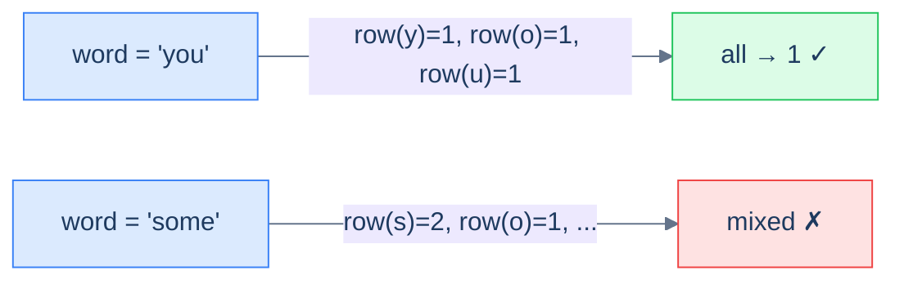

# Row specific words

## Problem Statement

Given an array of words, return all the words that can be typed using **only one row** of an American keyboard.

> -   **Row 1:** `qwertyuiop`
> -   **Row 2:** `asdfghjkl`
> -   **Row 3:** `zxcvbnm`

### Example 1
> -   **Input:** `["you", "were", "some"]` → **Output:** `["you", "were"]`

### Example 2
> -   **Input:** `["sdk", "nvm", "hut"]` → **Output:** `["sdk", "nvm"]`

### Example 3
> -   **Input:** `["him", "else", "bat"]` → **Output:** `[]`

<details>
<summary><h2>Approach</h2></summary>


The "key" here is the **row id** (1, 2, or 3). Each character maps to one of three rows; a word is single-row iff every character maps to the same row. So: look up every character's row, ensure they're all equal.

> 🖼 Diagram — Row-specific words — the key per character is its keyboard row. A word survives the filter only if all its characters share the same key.


<p align="center"><strong>Row-specific words — the key per character is its keyboard row. A word survives the filter only if all its characters share the same key.</strong></p>

</details>
<details>
<summary><h2>Solution</h2></summary>


```python run viz=graph viz-root=words
from typing import List

class Solution:
    def get_row_1(self) -> set:
        return {"q", "w", "e", "r", "t", "y", "u", "i", "o", "p"}

    def get_row_2(self) -> set:
        return {"a", "s", "d", "f", "g", "h", "j", "k", "l"}

    def get_row_3(self) -> set:
        return {"z", "x", "c", "v", "b", "n", "m"}

    def get_row(self, c: str) -> int:
        row_1 = self.get_row_1()
        row_2 = self.get_row_2()
        row_3 = self.get_row_3()

        if c in row_1:
            return 1
        if c in row_2:
            return 2
        if c in row_3:
            return 3

        # This case won't occur as all characters are from valid rows
        return 0

    def can_be_typed_with_one_row(self, word: str) -> bool:

        # Get the row for the first character
        row = self.get_row(word[0].lower())

        # Check if all characters belong to the same row
        for c in word:
            if self.get_row(c.lower()) != row:
                return False

        return True

    def row_specific_words(self, words: List[str]) -> List[str]:
        result = []

        # Iterate over each word
        for word in words:
            if self.can_be_typed_with_one_row(word):
                result.append(word)

        return result


# Examples from the problem statement
print(Solution().row_specific_words(["you", "were", "some"]))   # ['you', 'were']
print(Solution().row_specific_words(["sdk", "nvm", "hut"]))     # ['sdk', 'nvm']
print(Solution().row_specific_words(["him", "else", "bat"]))    # []

# Edge cases
print(Solution().row_specific_words([]))                         # []
print(Solution().row_specific_words(["a"]))                      # ['a']
print(Solution().row_specific_words(["type", "row"]))            # ['type']
print(Solution().row_specific_words(["Alaska", "Dad"]))          # ['Alaska', 'Dad']
```

```java run
import java.util.*;

public class Main {
    static class Solution {
        private Set<Character> getRow1() {
            return new HashSet<>(
                List.of('q', 'w', 'e', 'r', 't', 'y', 'u', 'i', 'o', 'p')
            );
        }

        private Set<Character> getRow2() {
            return new HashSet<>(
                List.of('a', 's', 'd', 'f', 'g', 'h', 'j', 'k', 'l')
            );
        }

        private Set<Character> getRow3() {
            return new HashSet<>(List.of('z', 'x', 'c', 'v', 'b', 'n', 'm'));
        }

        private int getRow(char c) {
            Set<Character> row1 = getRow1();
            Set<Character> row2 = getRow2();
            Set<Character> row3 = getRow3();

            if (row1.contains(c)) {
                return 1;
            }

            if (row2.contains(c)) {
                return 2;
            }

            if (row3.contains(c)) {
                return 3;
            }

            // This case won't occur as all characters are from valid rows
            return 0;
        }

        private boolean canBeTypedWithOneRow(String word) {

            // Get the row for the first character
            int row = getRow(Character.toLowerCase(word.charAt(0)));

            // Check if all characters belong to the same row
            for (char c : word.toCharArray()) {
                if (getRow(Character.toLowerCase(c)) != row) {
                    return false;
                }
            }

            return true;
        }

        public List<String> rowSpecificWords(String[] words) {
            List<String> result = new ArrayList<>();

            // Iterate over each word
            for (String word : words) {
                if (canBeTypedWithOneRow(word)) {
                    result.add(word);
                }
            }

            return result;
        }
    }

    public static void main(String[] args) {
        // Examples from the problem statement
        System.out.println(new Solution().rowSpecificWords(new String[]{"you", "were", "some"}));  // [you, were]
        System.out.println(new Solution().rowSpecificWords(new String[]{"sdk", "nvm", "hut"}));    // [sdk, nvm]
        System.out.println(new Solution().rowSpecificWords(new String[]{"him", "else", "bat"}));   // []

        // Edge cases
        System.out.println(new Solution().rowSpecificWords(new String[]{}));                       // []
        System.out.println(new Solution().rowSpecificWords(new String[]{"a"}));                    // [a]
        System.out.println(new Solution().rowSpecificWords(new String[]{"type", "row"}));          // [type]
        System.out.println(new Solution().rowSpecificWords(new String[]{"Alaska", "Dad"}));        // [Alaska, Dad]
    }
}
```

</details>

<!-- ============================================== -->
<!-- SWEEP 2 — missing sections (placeholders only) -->
<!-- ============================================== -->

<!-- TODO: Examples — missing, needs to be written -->
<!--       Guidance: min 3 examples: basic / variant / edge -->

<!-- TODO: Intuition — missing, needs to be written -->
<!--       Guidance: 3 paragraphs: brute force / observation / pattern fit -->

<!-- TODO: Applying the Diagnostic Questions — missing, needs to be written -->
<!--       Guidance: REQUIRED, never optional -->
<!--       Guidance: 4-row table. Columns: 'Check' | 'Answer for [Problem Name]' -->
<!--       Guidance: Rows: two positions simultaneously / one near start one near end / both move inward / simple O(1) work at each step -->

<!-- TODO: Approach — missing, needs to be written -->
<!--       Guidance: numbered steps, no code -->

<!-- TODO: Solution — missing, needs to be written -->
<!--       Guidance: Python block then Java block -->

<!-- TODO: Dry Run — missing, needs to be written -->
<!--       Guidance: walk through a small example step by step -->

<!-- TODO: Complexity Analysis — missing, needs to be written -->
<!--       Guidance: table: time / space / why -->

<!-- TODO: Edge Cases — missing, needs to be written -->
<!--       Guidance: table, min 5 rows -->

<!-- TODO: Key Takeaway — missing, needs to be written -->
<!--       Guidance: 1–2 sentences -->
