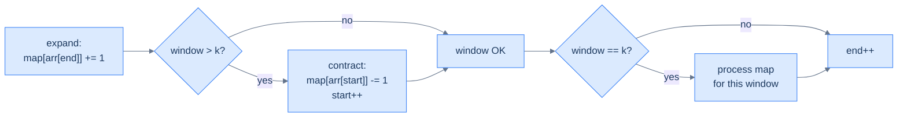

# Understanding the fixed-sized sliding window pattern

Some problems hand you a sequence and ask a question about *every contiguous window of size K*: "How many distinct elements?" "Any duplicates?" "Does this match a fixed pattern?" The brute-force answer is to enumerate every window and recompute the answer from scratch — O(N·K) work because each window scan is O(K) and there are N − K + 1 windows.

The sliding-window technique cuts this to **O(N)** by exploiting a beautiful observation: when the window moves one step right, *almost everything inside it stays the same*. Only **two** elements change: the one being added on the right, and the one falling off on the left. If we keep a running summary of the window in a hash map, we can update it in O(1) per shift instead of recomputing from scratch.

> 🖼 Diagram — Sliding by one step — windows 1 and 2 share three elements (b, a, c); only a drops off the left and b arrives on the right. Recomputing from scratch wastes work on the three shared elements; the sliding-window technique avoids it entirely.
```d2
direction: right

arr: input array {
  grid-columns: 7
  grid-gap: 0
  a0: a {style.fill: "#fde68a"; style.stroke: "#d97706"}
  a1: b {style.fill: "#fde68a"; style.stroke: "#d97706"}
  a2: a {style.fill: "#fde68a"; style.stroke: "#d97706"}
  a3: c {style.fill: "#fde68a"; style.stroke: "#d97706"}
  a4: b
  a5: d
  a6: a
}

w1: "window 1: [a, b, a, c]" {style.fill: "#fde68a"; style.stroke: "#d97706"}
w2: "window 2: [b, a, c, b]" {style.fill: "#dbeafe"; style.stroke: "#3b82f6"}

arr -> w1: "positions 0..3"
arr -> w2: "positions 1..4 (slide by 1)"
```

<p align="center"><strong>Sliding by one step — windows 1 and 2 share three elements (b, a, c); only <code>a</code> drops off the left and <code>b</code> arrives on the right. Recomputing from scratch wastes work on the three shared elements; the sliding-window technique avoids it entirely.</strong></p>

We maintain two pointers, `start` and `end`, that mark the window's boundaries. We hold a hash map summarising the window's contents (typically a frequency map). Each step of the algorithm:

1. **Add** the new right-edge element's contribution to the map (`end` advanced).
2. If the window has grown past size K, **subtract** the left-edge element's contribution and advance `start`.
3. When the window is exactly size K, **process** the map to answer the question for this window.

> 🖼 Diagram — The fixed-window loop in one picture — the four-line dance of add new, drop old, process if size matches, advance. The whole structure of every problem in this lesson is a variation on these four steps.


<p align="center"><strong>The fixed-window loop in one picture — the four-line dance of <em>add new, drop old, process if size matches, advance</em>. The whole structure of every problem in this lesson is a variation on these four steps.</strong></p>

## Why Naive Isn't Enough

The obvious move recomputes each window's answer from scratch. Enumerate every starting index, build that window's frequency map by scanning all `K` elements, then read off the answer. The result is correct, but the cost repeats work the previous window already did.

This brute force pays a per-window scan it does not need. Building one window's map costs `O(K)`, and there are `N − K + 1` windows, so the total is `O(N·K)` time for `O(K)` space. Two adjacent windows of size `K` overlap in `K − 1` elements — yet the naive scan re-counts all of them on every step.

To make this concrete: on `[a, b, a, c, b, d, a]` with `k = 4`, the first window `[a, b, a, c]` and the next window `[b, a, c, b]` share `b`, `a`, and `c`. The naive scan re-tallies those three shared characters even though only `a` left and `b` arrived. As `K` grows, the fraction of wasted work grows with it.

So the key idea is: re-scanning each window discards the answer the last window already computed, and a running summary that updates on the two changed elements replaces every full re-scan.

## The Core Idea

The fix maintains one hash map across the whole sweep instead of rebuilding it per window. The map summarises the current window's contents — usually a frequency tally — and the algorithm edits it incrementally as the window moves.

A hash map is the right summary because both edits cost `O(1)` amortised:

- **Add** the entering element — `frequency[arr[end]] += 1` records the new right-edge character.
- **Remove** the leaving element — `frequency[arr[start]] -= 1` undoes the old left-edge character, deleting the key when its count hits zero.

To make this concrete: sliding from `[a, b, a, c]` to `[b, a, c, b]` is one decrement (drop the leftmost `a`) and one increment (add the new `b`) — two map writes, not a four-element rescan. The core insight is: the per-step cost drops from `O(K)` (rebuild the whole map) to `O(1)` (two edits), so the total drops from `O(N·K)` to `O(N)`.

## How the Window Moves

Two pointers fence the window, and only one of them advances unconditionally. The pointer `end` marks the right edge and moves every iteration; `start` marks the left edge and moves only when the window has grown past `K`.

Each iteration runs the same four actions in a fixed order:

- **Expand** — add `arr[end]`'s contribution to the map.
- **Contract if oversized** — when `end − start + 1 > k`, remove `arr[start]`'s contribution and advance `start`.
- **Process if full** — when `end − start + 1 == k`, read the map to answer the question for this exact window.
- **Advance** — increment `end` to grow the window for the next step.

To make this concrete: `end` sweeps from `0` to `N − 1`, so the loop runs exactly `N` times; `start` only ever moves forward and never passes `end`. Every element is added once and removed at most once. The core insight is: `end` drives the sweep while `start` trails it by a fixed gap of `K`, so the window's width is pinned at `K` for every processed step.

## Algorithm

> **Algorithm**
>
> -   **Step 1:** Initialise `start = 0`, `end = 0`, and an empty `map`.
> -   **Step 2:** While `end < arr.length`:
>     -   **Step 2.1:** Add the contribution of `arr[end]` to `map`.
>     -   **Step 2.2:** If `end − start + 1 > k`, remove the contribution of `arr[start]` and increment `start`.
>     -   **Step 2.3:** If `end − start + 1 == k`, process `map` to answer the question for this window.
>     -   **Step 2.4:** Increment `end`.

Note the ordering: *add first, then check size, then process*. This guarantees that by the time we reach step 2.3, the window is exactly `k` elements wide and the map reflects them.

> *Predict before reading on — what would happen if we processed the map BEFORE removing the start element when the window grew past k? The map would contain k+1 entries instead of k for one fleeting moment — and any "process" step would observe stale data. The order of operations is part of the algorithm's correctness.*

## Implementation

The generic skeleton — every problem in this lesson is a one-line change to step 2.3 ("process the map").


```python run
def fixed_size_sliding_window(arr: List[str], k: int) -> None:
    # Initialize start and end to 0
    start, end = 0, 0

    # Initialize frequency dictionary to count character occurrences
    frequency: dict[str, int] = defaultdict(int)

    # Move the window one step to the right until
    # it reaches the end of the array
    while end < len(arr):
        # Add contribution of arr[end] to the frequency map
        frequency[arr[end]] = frequency.get(arr[end], 0) + 1

        # Check if window size is greater than k
        if end - start + 1 > k:
            # Remove contribution of arr[start] from frequency map
            frequency[arr[start]] -= 1
            # Remove arr[start] from frequency if its count is 0
            if frequency[arr[start]] == 0:
                del frequency[arr[start]]
            # Increment start to contract the window from start
            start += 1

        # Check if window size equals k
        if end - start + 1 == k:
            # Process the values in frequency map
            # (Additional processing logic would go here)
            pass

        # Increment end to expand the window from end
        end += 1

    return
```

```java run
public class FixedSizeSlidingWindow {

    public void fixedSizeSlidingWindow(char[] arr, int k) {
        // Initialize start and end to 0
        int start = 0, end = 0;

        // Initialize hash map to map characters to integer values
        HashMap<Character, Integer> frequency = new HashMap<>();

        // Move the window one step to the right until
        // it reaches the end of the array
        while (end < arr.length) {
            // Add contribution of arr[end] to the frequency map
            frequency.put(arr[end], frequency.getOrDefault(arr[end], 0) + 1);

            // Check if window size is greater than k
            if (end - start + 1 > k) {
                // Remove contribution of arr[start] from frequency map
                frequency.put(arr[start], frequency.get(arr[start]) - 1);
                if (frequency.get(arr[start]) == 0) {
                    frequency.remove(arr[start]); // Remove key if count is 0
                }
                // Increment start to contract the window from start
                start++;
            }

            // Check if window size equals k
            if (end - start + 1 == k) {
                // Process the values in frequency map
            }

            // Increment end to expand the window from end
            end++;
        }

        return;
    }
}
```


## Complexity Analysis

We touch each array element exactly twice (once as it enters the window, once as it leaves). Each touch is amortised O(1) hash-map work. Total: **O(N)** time.

The hash map holds at most K entries (the elements currently inside the window), so space is **O(K)**.

> **Best/Average/Worst case** — O(N) time, O(K) space. The whole point of the technique is that worst-case time *is* the average case; we don't pay extra for adversarial input.

# Identifying the fixed-sized sliding window pattern

This pattern fits problems with a *fixed window length K* — given directly in the input or derived from a second input string — where the answer for each window depends on a **summarisable** property. Frequencies, distinct counts, sums, products, and max/min all qualify, because each can be maintained incrementally as the window moves.

**Template:**
> Given a sequence and a window size K, slide a window of size K from left to right while maintaining a hash-map summary of the window's contents in O(1) per shift. Use the summary to answer the question per window.

If the question reads *"for each window of size K, …"* and you can answer it from a frequency map, this pattern fits.

## Recognition Checklist

Four questions confirm a problem fits the fixed-sized sliding window pattern. If every answer is "yes," the four-step skeleton drops in with only the "process the map" step to specialise.

1. **Is the window size fixed at exactly `K`?** The size is a hard constraint, given in the input or set to `len(pattern)` — it never grows or shrinks to satisfy a condition.
2. **Is the input a linear sequence — an array or string?** The window slides one element at a time, so the input must be iterable end to end.
3. **Does the answer for each window come from a hash-map summary you can update in `O(1)`?** Adding the right element and removing the left element must each be one map edit, not a full re-scan.
4. **Is the per-step work `O(1)` amortised?** One increment on expand and one decrement on contract keep the whole sweep at `O(N)` time.

These four questions reappear as the **Diagnostic Questions** table in every problem write-up that follows.

## Canonical Example

Walk a full problem end to end to see the pattern click into place.

### Problem Statement

> **Problem:** Given an integer array `arr` and a positive integer `k`, return `true` if any subarray of size `k` contains a duplicate, `false` otherwise.

Take `arr = [2, 1, 2, 3, 2, 1, 4, 5]` and `k = 5`. The expected answer is `true` — the first window `[2, 1, 2, 3, 2]` already holds three copies of `2`.

### Brute Force

The most direct approach fixes each starting index, then checks that window for a repeat by comparing every pair inside it. It works, but the nested comparison is the problem. Each of the `N − k + 1` windows runs a pairwise scan costing `O(k²)`, so the total is `O((N − k)·k²)` time for `O(1)` space — cubic when `k` is near `N/3`, and unusable past small inputs.

### Key Insight

Two adjacent windows of size `k` share `k − 1` elements; only one element leaves and one enters per slide. A frequency map of the window lets you test for a duplicate in `O(1)` — any count above `1` means a repeat. The core insight is: maintain the map incrementally across the sweep, so each duplicate check is one lookup instead of a fresh `O(k²)` pairwise scan.

### Optimized Solution

Apply the four-step skeleton with the map keyed on element frequency:

1. Expand — add `arr[end]` to the map.
2. Contract once the window already spans `k` elements — drop `arr[start]` and advance `start`.
3. Process — if the just-added element's count exceeds `1`, a duplicate sits inside the current `k`-window, so return `true`.
4. Advance — move `end` right and continue.

The full Python and Java implementations live in [Duplicate Detection](02-problems/01-duplicate-detection). The contract guard there reads `if end - start >= k`, which trims the window *before* it would exceed `k`, keeping the duplicate check scoped to exactly `k` elements.

> 🖼 Diagram — TODO: 3 frames — window [2,1,2] with freq{2:2} flagging the duplicate; the general slide dropping the left element and adding the right; the final true verdict.

### Trace

Walk Example 1 — `arr = [2, 1, 2, 3, 2, 1, 4, 5]`, `k = 5`. The duplicate surfaces before the window is even full:

```
start=0, end=0, frequency={}

end=0  add 2 → freq={2:1}        size 1, < k → freq[2]=1, not > 1 → continue
end=1  add 1 → freq={2:1, 1:1}   size 2, < k → freq[1]=1, not > 1 → continue
end=2  add 2 → freq={2:2, 1:1}   size 3, < k → freq[2]=2 > 1 → return true

result = true
```

The result `true` matches the expected output — the window `[2, 1, 2]` (still smaller than `k = 5`) already contains a duplicate `2`, so any larger window covering it does too.

### Fitting the Template

| Check | Answer for Duplicate Detection |
|---|---|
| **Q1.** Is the window size fixed at exactly `k`? | **Yes** — every subarray checked is exactly `k` wide; the size is given, never condition-driven. |
| **Q2.** Is the input a linear sequence? | **Yes** — an integer array, walked index by index. |
| **Q3.** Is the per-window answer read from an `O(1)`-updatable map? | **Yes** — a frequency map; a duplicate is any count `> 1`, read in `O(1)` after each insert. |
| **Q4.** Is the per-step work `O(1)` amortised? | **Yes** — one increment on expand, one decrement on contract, one count lookup. |

## Variants / Taxonomy

Every fixed-window problem reuses the same skeleton and varies only in what the map summarises and what the "process" step asks of it. Three shapes appear repeatedly across the problems that follow:

- **Boolean detection** — return as soon as the map satisfies a condition. The process step inspects one count and may short-circuit. *Example:* Duplicate Detection (any count `> 1` → return `true`).
- **Per-window report** — return one value per window position, so the result has `n − k + 1` entries. The process step appends `len(map)` or a derived number. *Example:* Subarray Distinctness (distinct count per window).
- **Pattern match** — the window size is `len(pattern)`, and the process step compares the window's map against the pattern's map. *Examples:* Contains Variation (first match → `true`), Anagram Finder (every match → append the index).

So the core insight is: the mechanics never change — only the map's payload (counts, distinct keys) and the process step's shape (short-circuit, append, compare) vary across the variants.

## Problems in This Category

The four problems below each specialise the four-step skeleton — only the "process the map" step changes:

| # | Problem | Variant | Twist on the skeleton |
|---|---|---|---|
| 1 | [Duplicate Detection](02-problems/01-duplicate-detection) | Boolean detection | Return `true` the instant any count climbs above `1` |
| 2 | [Subarray Distinctness](02-problems/02-subarray-distinctness) | Per-window report | Append `len(map)` — the distinct count — for each full window |
| 3 | [Contains Variation](02-problems/03-contains-variation) | Pattern match | Window size `len(s1)`; return `true` when the window's map equals `s1`'s |
| 4 | [Anagram Finder](02-problems/04-anagram-finder) | Pattern match | Window size `len(p)`; append every start index whose window matches `p` |

Each is a small variation on the same skeleton — only the per-window question changes.
