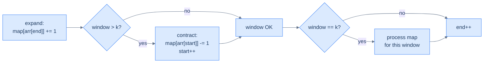

# Understanding the fixed-sized sliding window pattern

Some problems hand you a sequence and ask a question about *every contiguous window of size K*: "How many distinct elements?" "Any duplicates?" "Does this match a fixed pattern?" The brute-force answer is to enumerate every window and recompute the answer from scratch — O(N·K) work because each window scan is O(K) and there are N − K + 1 windows.

The sliding-window technique cuts this to **O(N)** by exploiting a beautiful observation: when the window moves one step right, *almost everything inside it stays the same*. Only **two** elements change: the one being added on the right, and the one falling off on the left. If we keep a running summary of the window in a hash map, we can update it in O(1) per shift instead of recomputing from scratch.

> 🖼 Diagram — Sliding by one step — windows 1 and 2 share three elements (b, a, c); only a drops off the left and b arrives on the right. Recomputing from scratch wastes work on the three shared elements; the sliding-window technique avoids it entirely.
```d2
direction: right

arr: input array {
  grid-columns: 7
  grid-gap: 0
  a0: a {style.fill: "#fde68a"; style.stroke: "#d97706"}
  a1: b {style.fill: "#fde68a"; style.stroke: "#d97706"}
  a2: a {style.fill: "#fde68a"; style.stroke: "#d97706"}
  a3: c {style.fill: "#fde68a"; style.stroke: "#d97706"}
  a4: b
  a5: d
  a6: a
}

w1: "window 1: [a, b, a, c]" {style.fill: "#fde68a"; style.stroke: "#d97706"}
w2: "window 2: [b, a, c, b]" {style.fill: "#dbeafe"; style.stroke: "#3b82f6"}

arr -> w1: "positions 0..3"
arr -> w2: "positions 1..4 (slide by 1)"
```

<p align="center"><strong>Sliding by one step — windows 1 and 2 share three elements (b, a, c); only <code>a</code> drops off the left and <code>b</code> arrives on the right. Recomputing from scratch wastes work on the three shared elements; the sliding-window technique avoids it entirely.</strong></p>

We maintain two pointers, `start` and `end`, that mark the window's boundaries. We hold a hash map summarising the window's contents (typically a frequency map). Each step of the algorithm:

1. **Add** the new right-edge element's contribution to the map (`end` advanced).
2. If the window has grown past size K, **subtract** the left-edge element's contribution and advance `start`.
3. When the window is exactly size K, **process** the map to answer the question for this window.

> 🖼 Diagram — The fixed-window loop in one picture — the four-line dance of add new, drop old, process if size matches, advance. The whole structure of every problem in this lesson is a variation on these four steps.


<p align="center"><strong>The fixed-window loop in one picture — the four-line dance of <em>add new, drop old, process if size matches, advance</em>. The whole structure of every problem in this lesson is a variation on these four steps.</strong></p>

## Algorithm

> **Algorithm**
>
> -   **Step 1:** Initialise `start = 0`, `end = 0`, and an empty `map`.
> -   **Step 2:** While `end < arr.length`:
>     -   **Step 2.1:** Add the contribution of `arr[end]` to `map`.
>     -   **Step 2.2:** If `end − start + 1 > k`, remove the contribution of `arr[start]` and increment `start`.
>     -   **Step 2.3:** If `end − start + 1 == k`, process `map` to answer the question for this window.
>     -   **Step 2.4:** Increment `end`.

Note the ordering: *add first, then check size, then process*. This guarantees that by the time we reach step 2.3, the window is exactly `k` elements wide and the map reflects them.

> *Predict before reading on — what would happen if we processed the map BEFORE removing the start element when the window grew past k? The map would contain k+1 entries instead of k for one fleeting moment — and any "process" step would observe stale data. The order of operations is part of the algorithm's correctness.*

## Implementation

The generic skeleton — every problem in this lesson is a one-line change to step 2.3 ("process the map").


```python run
def fixed_size_sliding_window(arr: List[str], k: int) -> None:
    # Initialize start and end to 0
    start, end = 0, 0

    # Initialize frequency dictionary to count character occurrences
    frequency: dict[str, int] = defaultdict(int)

    # Move the window one step to the right until
    # it reaches the end of the array
    while end < len(arr):
        # Add contribution of arr[end] to the frequency map
        frequency[arr[end]] = frequency.get(arr[end], 0) + 1

        # Check if window size is greater than k
        if end - start + 1 > k:
            # Remove contribution of arr[start] from frequency map
            frequency[arr[start]] -= 1
            # Remove arr[start] from frequency if its count is 0
            if frequency[arr[start]] == 0:
                del frequency[arr[start]]
            # Increment start to contract the window from start
            start += 1

        # Check if window size equals k
        if end - start + 1 == k:
            # Process the values in frequency map
            # (Additional processing logic would go here)
            pass

        # Increment end to expand the window from end
        end += 1

    return
```

```java run
public class FixedSizeSlidingWindow {

    public void fixedSizeSlidingWindow(char[] arr, int k) {
        // Initialize start and end to 0
        int start = 0, end = 0;

        // Initialize hash map to map characters to integer values
        HashMap<Character, Integer> frequency = new HashMap<>();

        // Move the window one step to the right until
        // it reaches the end of the array
        while (end < arr.length) {
            // Add contribution of arr[end] to the frequency map
            frequency.put(arr[end], frequency.getOrDefault(arr[end], 0) + 1);

            // Check if window size is greater than k
            if (end - start + 1 > k) {
                // Remove contribution of arr[start] from frequency map
                frequency.put(arr[start], frequency.get(arr[start]) - 1);
                if (frequency.get(arr[start]) == 0) {
                    frequency.remove(arr[start]); // Remove key if count is 0
                }
                // Increment start to contract the window from start
                start++;
            }

            // Check if window size equals k
            if (end - start + 1 == k) {
                // Process the values in frequency map
            }

            // Increment end to expand the window from end
            end++;
        }

        return;
    }
}
```


## Complexity Analysis

We touch each array element exactly twice (once as it enters the window, once as it leaves). Each touch is amortised O(1) hash-map work. Total: **O(N)** time.

The hash map holds at most K entries (the elements currently inside the window), so space is **O(K)**.

> **Best/Average/Worst case** — O(N) time, O(K) space. The whole point of the technique is that worst-case time *is* the average case; we don't pay extra for adversarial input.

# Identifying the fixed-sized sliding window pattern

This pattern fits problems with a *fixed window length K* (given in the input or derivable from another input string) where the answer for each window depends on a **summarisable** property — frequencies, distinct counts, sums, products, max/min — that can be maintained incrementally.

**Template:**
> Given a sequence and a window size K, slide a window of size K from left to right while maintaining a hash-map summary of the window's contents in O(1) per shift. Use the summary to answer the question per window.

If the question is *"for each window of size K, …"* and you can answer it from a frequency map, this pattern fits.

## Example — anagram finder

Given a string `s` and a pattern `p`, return all start indices in `s` where a *permutation* of `p` appears. The window size is fixed: `len(p)`. The summary is the frequency map of the current window's characters; an anagram exists iff that map equals the frequency map of `p`.

This is the canonical fixed-window problem — every other problem in this lesson is a simpler shape of it.

## Example problems

> -   Duplicate detection — *is there a duplicate in any window of size k?*
> -   Subarray distinctness — *how many distinct elements per window?*
> -   Contains variation — *does any window match a target frequency map?*
> -   Anagram finder — *which windows are anagrams of a given pattern?*

<!-- ============================================== -->
<!-- SWEEP 2 — missing sections (placeholders only) -->
<!-- ============================================== -->

<!-- TODO: Why Naive Isn't Enough — missing, needs to be written -->
<!--       Guidance: motivation for why the obvious approach fails -->

<!-- TODO: The Core Idea — missing, needs to be written -->
<!--       Guidance: one paragraph: the central trick -->

<!-- TODO: How the Pointers/Window Move — missing, needs to be written -->
<!--       Guidance: mechanics of the moving parts -->

<!-- TODO: The Generic Algorithm — missing, needs to be written -->
<!--       Guidance: numbered steps, no code -->

<!-- TODO: Generic Implementation — missing, needs to be written -->
<!--       Guidance: Python block + Java block of the skeleton -->

<!-- TODO: Variants / Taxonomy — missing, needs to be written -->
<!--       Guidance: enumerate sub-shapes of this pattern -->

<!-- TODO: Recognition Checklist — missing, needs to be written -->
<!--       Guidance: 4-question diagnostic — the source of the Problem-section Diagnostic Questions -->

<!-- TODO: Canonical Example — missing, needs to be written -->
<!--       Guidance: fully worked example: brute force → optimised → template fit -->

<!-- TODO: Problems in This Category — missing, needs to be written -->
<!--       Guidance: table with links to the 02-problems/ files -->
