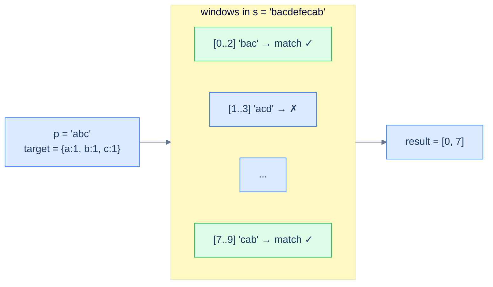

# Anagram finder

## Problem Statement

Given strings `s` and `p`, return all the start indices in `s` of substrings that are anagrams of `p`.

### Example 1
> -   **Input:** `s = "bacdefecab", p = "abc"` → **Output:** `[0, 7]` (`"bac"` at 0, `"cab"` at 7)

### Example 2
> -   **Input:** `s = "fdef", p = "def"` → **Output:** `[0, 1]` (`"fde"` at 0, `"def"` at 1; both are anagrams of `"def"`)

> *Wait — `"fde"` is an anagram of `"def"`? Yes — same multiset of letters {d, e, f}.*

### Example 3
> -   **Input:** `s = "abcdef", p = "gh"` → **Output:** `[]`

<details>
<summary><h2>Approach</h2></summary>


`Contains variation` returns the *first* match; `Anagram finder` returns *all* matches. Same scanning pattern, same window size (`len(p)`) — but instead of returning on the first match, append the start index to the result list and keep going.

Rather than comparing two frequency maps each step, this solution keeps a single running counter, `count`, of how many characters from `p` are still *needed* in the current window. It starts at `len(p)`. When the right pointer brings in a character that the window still needs (`frequency[char] > 0`), `count` drops by one; the character's required count in `frequency` is then decremented (and may go negative, recording a surplus). When the left pointer drops a character that was genuinely part of `p`'s demand (`frequency[char] >= 0` after restoring it), `count` goes back up. Whenever `count` hits `0`, every character of `p` is accounted for inside the window — `start` is a valid anagram index.

> 🖼 Diagram — Anagram finder — slide a window of size len(p) across s, recording start indices wherever the window's frequency map matches p's. Same skeleton as Contains variation, just append-don't-return.


<p align="center"><strong>Anagram finder — slide a window of size <code>len(p)</code> across <code>s</code>, recording start indices wherever the window's frequency map matches <code>p</code>'s. Same skeleton as <code>Contains variation</code>, just append-don't-return.</strong></p>

</details>
<details>
<summary><h2>Solution</h2></summary>


```python run
from collections import defaultdict
from typing import List, Dict

class Solution:
    def count_frequency(self, s: str) -> Dict[str, int]:
        frequency = defaultdict(int)
        for ch in s:
            frequency[ch] += 1
        return frequency

    def find_anagrams_in_window(
        self, s: str, frequency: Dict[str, int], k: int
    ) -> List[int]:
        start = 0
        end = 0
        count = k
        result = []

        # Traverse the string using two pointers
        while end < len(s):
            char_end = s[end]

            # If the character is in the pattern, update the frequency
            # map
            if char_end in frequency:
                if frequency[char_end] > 0:
                    count -= 1
                frequency[char_end] -= 1

            # If all characters in the pattern are found, add start index
            # to result
            if count == 0:
                result.append(start)

            # Shrink the window from the left if the window size is equal
            # to p's size
            if end - start + 1 == k:
                char_start = s[start]
                if char_start in frequency:
                    if frequency[char_start] >= 0:
                        count += 1
                    frequency[char_start] += 1
                start += 1

            end += 1

        return result

    def anagram_finder(self, s: str, p: str) -> List[int]:
        if not s or not p or len(s) < len(p):
            return []

        # Create a frequency map for characters in the pattern
        p_frequency = self.count_frequency(p)

        # Use sliding window approach to find anagrams of p in s
        return self.find_anagrams_in_window(s, p_frequency, len(p))


# Examples from the problem statement
print(Solution().anagram_finder("bacdefecab", "abc"))  # [0, 7]
print(Solution().anagram_finder("fdef", "def"))        # [0, 1]
print(Solution().anagram_finder("abcdef", "gh"))       # []

# Edge cases
print(Solution().anagram_finder("", "a"))              # []
print(Solution().anagram_finder("a", ""))              # []
print(Solution().anagram_finder("aaa", "aa"))          # [0, 1]
print(Solution().anagram_finder("abc", "abc"))         # [0]
print(Solution().anagram_finder("cbaebabacd", "abc"))  # [0, 6]
```

```java run
import java.util.*;

public class Main {
    static class Solution {
        private Map<Character, Integer> countFrequency(String s) {
            Map<Character, Integer> frequency = new HashMap<>();
            for (char ch : s.toCharArray()) {
                frequency.put(ch, frequency.getOrDefault(ch, 0) + 1);
            }
            return frequency;
        }

        private List<Integer> findAnagramsInWindow(
            String s,
            Map<Character, Integer> frequency,
            int K
        ) {
            int start = 0;
            int end = 0;
            int count = K;
            List<Integer> result = new ArrayList<>();

            // Traverse the string using two pointers
            while (end < s.length()) {
                char endChar = s.charAt(end);

                // If the character is in the pattern, update the frequency
                // map
                if (frequency.containsKey(endChar)) {
                    if (frequency.get(endChar) > 0) {
                        count--;
                    }
                    frequency.put(endChar, frequency.get(endChar) - 1);
                }

                // If all characters in the pattern are found, add start
                // index to result
                if (count == 0) {
                    result.add(start);
                }

                // Shrink the window from the left if the window size is
                // equal to p's size
                if (end - start + 1 == K) {
                    char startChar = s.charAt(start);
                    if (frequency.containsKey(startChar)) {
                        if (frequency.get(startChar) >= 0) {
                            count++;
                        }
                        frequency.put(
                            startChar,
                            frequency.get(startChar) + 1
                        );
                    }
                    start++;
                }
                end++;
            }

            return result;
        }

        public List<Integer> anagramFinder(String s, String p) {
            if (s.isEmpty() || p.isEmpty() || s.length() < p.length()) {
                return new ArrayList<>();
            }

            // Create a frequency map for characters in the pattern
            Map<Character, Integer> pFrequency = countFrequency(p);

            // Use sliding window approach to find anagrams of p in s
            return findAnagramsInWindow(s, pFrequency, p.length());
        }
    }

    public static void main(String[] args) {
        // Examples from the problem statement
        System.out.println(new Solution().anagramFinder("bacdefecab", "abc")); // [0, 7]
        System.out.println(new Solution().anagramFinder("fdef", "def"));       // [0, 1]
        System.out.println(new Solution().anagramFinder("abcdef", "gh"));      // []

        // Edge cases
        System.out.println(new Solution().anagramFinder("", "a"));             // []
        System.out.println(new Solution().anagramFinder("a", ""));             // []
        System.out.println(new Solution().anagramFinder("aaa", "aa"));         // [0, 1]
        System.out.println(new Solution().anagramFinder("abc", "abc"));        // [0]
        System.out.println(new Solution().anagramFinder("cbaebabacd", "abc")); // [0, 6]
    }
}
```

</details>
<details>
<summary><h2>Final Takeaway</h2></summary>


The fixed-sized sliding window is the **moving** version of the counting pattern. The hash map keeps a running summary of the window's contents; the window's size never changes, so the map's overall workload is O(1) per shift. Three lessons worth memorising:

1. **Add right, drop left, process if-size-matches.** The four-line skeleton is identical for every problem; only the "process" step differs.
2. **Delete keys whose count drops to zero.** It's not just hygiene — `len(map)` is a valid distinct-count answer only if you maintain that invariant.
3. **Window-size = len(pattern).** When a problem says "find any anagram of p in s" or "any permutation of p", the window size is *given to you* by the second string. The hardest part is recognising it.

> *Coming up — what if the window can grow and shrink based on a *condition* rather than a fixed size? That's the **variable-sized sliding window**, and it solves a different family of problems: "longest substring with at most K distinct chars", "smallest subarray with sum ≥ S", "longest substring without repeating characters". Same hash-map summary, but the window flexes — and that flexibility unlocks a much wider class of problems.*

</details>

<!-- ============================================== -->
<!-- SWEEP 2 — missing sections (placeholders only) -->
<!-- ============================================== -->

<!-- TODO: Examples — missing, needs to be written -->
<!--       Guidance: min 3 examples: basic / variant / edge -->

<!-- TODO: Intuition — missing, needs to be written -->
<!--       Guidance: 3 paragraphs: brute force / observation / pattern fit -->

<!-- TODO: Applying the Diagnostic Questions — missing, needs to be written -->
<!--       Guidance: REQUIRED, never optional -->
<!--       Guidance: 4-row table. Columns: 'Check' | 'Answer for [Problem Name]' -->
<!--       Guidance: Rows: two positions simultaneously / one near start one near end / both move inward / simple O(1) work at each step -->

<!-- TODO: Approach — missing, needs to be written -->
<!--       Guidance: numbered steps, no code -->

<!-- TODO: Solution — missing, needs to be written -->
<!--       Guidance: Python block then Java block -->

<!-- TODO: Dry Run — missing, needs to be written -->
<!--       Guidance: walk through a small example step by step -->

<!-- TODO: Complexity Analysis — missing, needs to be written -->
<!--       Guidance: table: time / space / why -->

<!-- TODO: Edge Cases — missing, needs to be written -->
<!--       Guidance: table, min 5 rows -->

<!-- TODO: Key Takeaway — missing, needs to be written -->
<!--       Guidance: 1–2 sentences -->
