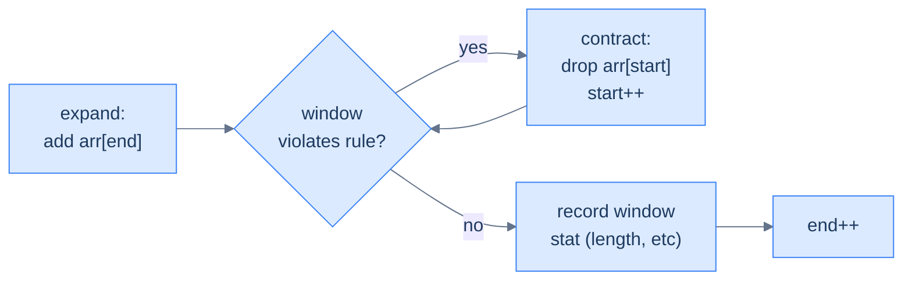

# 9. Pattern: Variable-Sized Sliding Window

## The Hook

Picture an accordion. Squeeze it shut, the air column is short. Pull it open, the air column is long. Push and pull as you play, and the column's length **flexes** in response to what the music needs at this exact moment. Now imagine that accordion is a window walking along an array, expanding when a *condition* is satisfied and contracting when it's *violated*. The fixed-window pattern from the last lesson played one note over and over — *K, K, K, K*. The variable window plays a melody — *expand, expand, contract, expand, contract, contract, expand* — driven by what the data does, not by a fixed parameter.

That accordion is the **variable-sized sliding window**, and it solves a different family of problems than the fixed kind. Instead of "for every window of size K, …" the question becomes "what's the **longest** (or shortest) window that satisfies some property?". *Longest substring with no repeats. Longest substring with at most K distinct characters. Longest run after K character replacements. Smallest subarray with sum ≥ S.* In every case the window grows greedily until it breaks the rule, then shrinks just enough to fit again — and the answer is "the largest size we ever saw legal".

The brute force scans every starting position with a nested inner loop and is O(N²). The variable window does it in O(N) with two pointers and one hash map — because each pointer only ever moves *forward*, so each element is touched at most twice.

This is the most flexible hash-map technique in the section, and once you internalise the *expand-until-broken / contract-until-fixed* rhythm, you'll see it everywhere.

---

## Table of contents

1. [Understanding the variable-sized sliding window pattern](#understanding-the-variable-sized-sliding-window-pattern)
2. [Identifying the variable-sized sliding window pattern](#identifying-the-variable-sized-sliding-window-pattern)
3. [Unique character span](#unique-character-span)
4. [K characters span](#k-characters-span)
5. [Maximal character swap](#maximal-character-swap)
6. [Subarray sum equals k](#subarray-sum-equals-k)
7. [Twin in proximity](#twin-in-proximity)

***

# Understanding the variable-sized sliding window pattern

The window now has **no fixed size**. Two pointers, `start` and `end`, define its boundaries. The window's contents are summarised in a hash map (frequencies, sums, sets — whatever the problem needs). On each iteration:

1. **Expand** by one step on the right: add `arr[end]`'s contribution to the map, then advance `end`.
2. **Contract** from the left **while the window violates the constraint**: subtract `arr[start]`'s contribution and advance `start`. Loop until the constraint is satisfied again.
3. **Record** the window's stat (length, sum, count) — at this moment the window is the largest valid one ending at `end`.



<p align="center"><strong>The variable-window loop — expand on the right, then contract on the left as many times as needed to restore the rule. Notice <code>contract</code> is a <em>while</em> loop, not an <em>if</em>: a single expansion might violate the rule by multiple slots, so we keep contracting until it's fixed.</strong></p>

The performance argument is beautiful: `start` only moves forward, never backward, and never overtakes `end`. Each element is therefore "touched" at most twice — once when `end` passes it (admitting it to the window), once when `start` passes it (evicting it). Total work: **O(N)**.

***

# Identifying the variable-sized sliding window pattern

This pattern fits problems that ask for the **longest** (or shortest) contiguous subsequence satisfying some condition that can be checked from a hash-map summary. The condition's truth-value should change *monotonically* as the window grows or shrinks — typically: extending the window *can only worsen* the condition, and contracting it *can only improve*.

**Template:**
> Given a sequence and a condition, slide a window whose right edge always advances; expand into the next element, then contract from the left until the condition holds; record the resulting window stat.

If the condition is "no duplicates", "at most K distinct", "sum ≤ S", "max-frequency element covers ≥ window − K positions", this template fits.

## Example — longest substring without repeating characters

> **Problem:** Given a string `s`, return the length of the longest substring without any repeating characters.

### Brute force

For each `start`, scan forward with `end`, maintaining a frequency map; stop the moment a duplicate appears. Track the longest run. **O(N²)**.

### Variable-window solution

The same observation that makes brute force O(N²) is also the loophole that makes a single pass possible: **once you've found a duplicate, the start pointer never has to move backward**. Any window that previously contained the duplicate is now disqualified. So we expand `end` greedily, and *whenever* the new character causes a duplicate, we slide `start` forward until the duplicate is gone — never reset, never look back.

```mermaid
---
config:
  theme: base
  themeVariables:
    primaryColor: "#dbeafe"
    primaryBorderColor: "#3b82f6"
    primaryTextColor: "#1e3a5f"
    lineColor: "#64748b"
    secondaryColor: "#ede9fe"
    tertiaryColor: "#fef9c3"
---
flowchart LR
    A["s = 'a b c b e d'"] --> S1["window 'a' → ok, len=1"]
    S1 --> S2["expand 'ab' → ok, len=2"]
    S2 --> S3["expand 'abc' → ok, len=3"]
    S3 --> S4["expand 'abcb' → b dup!<br/>contract until 'cb' → ok, len=2"]
    S4 --> S5["expand 'cbe' → ok, len=3"]
    S5 --> S6["expand 'cbed' → ok, len=4"]
    S6 --> R["maxLength = 4"]
    style R fill:#dcfce7,stroke:#22c55e
```



<p align="center"><strong>Walking through 'abcbed' — the window grows until 'b' duplicates, contracts past the first 'b', then continues growing. <code>start</code> only ever moves forward; <code>end</code> only ever moves forward. Each character is processed at most twice.</strong></p>

### Algorithm

> **Algorithm**
>
> -   **Step 1:** Initialise `start = 0`, `end = 0`, empty `frequency` map, `maxLength = 0`.
> -   **Step 2:** While `end < len(s)`:
>     -   **Step 2.1:** Increment `frequency[s[end]]`.
>     -   **Step 2.2:** While `frequency[s[end]] > 1` (rule violated):
>         -   Decrement `frequency[s[start]]`; if zero, remove the key; advance `start`.
>     -   **Step 2.3:** `maxLength = max(maxLength, end − start + 1)`.
>     -   **Step 2.4:** Advance `end`.

### Implementation


```python run
def unique_character_span(s: str) -> int:
    freq, max_len, start = {}, 0, 0
    for end in range(len(s)):
        freq[s[end]] = freq.get(s[end], 0) + 1
        # Contract while the rule "no duplicates" is violated
        while freq[s[end]] > 1:
            freq[s[start]] -= 1
            if freq[s[start]] == 0: del freq[s[start]]
            start += 1
        # Window [start..end] is the longest valid window ending at end
        max_len = max(max_len, end - start + 1)
    return max_len

print(unique_character_span("abcbed"))     # 4
print(unique_character_span("aaaaabc"))    # 3
print(unique_character_span("abcdefgh"))   # 8
```

```java run
import java.util.*;

public class Main {
    static int uniqueCharacterSpan(String s) {
        Map<Character, Integer> freq = new HashMap<>();
        int start = 0, max = 0;
        for (int end = 0; end < s.length(); end++) {
            char c = s.charAt(end);
            freq.merge(c, 1, Integer::sum);
            while (freq.get(c) > 1) {
                char sc = s.charAt(start);
                freq.merge(sc, -1, Integer::sum);
                if (freq.get(sc) == 0) freq.remove(sc);
                start++;
            }
            max = Math.max(max, end - start + 1);
        }
        return max;
    }
    public static void main(String[] args) {
        System.out.println(uniqueCharacterSpan("abcbed"));
        System.out.println(uniqueCharacterSpan("aaaaabc"));
        System.out.println(uniqueCharacterSpan("abcdefgh"));
    }
}
```


A single pass — **O(N)** time, **O(K)** space (K = alphabet size).

## Example problems

> -   Unique character span — longest substring without repeating characters
> -   K characters span — longest substring with at most K distinct characters
> -   Maximal character swap — longest run achievable with K character replacements
> -   Subarray sum equals k — longest subarray summing to K (uses prefix-sum + hash)
> -   Twin in proximity — any duplicate within distance K?

***

# Unique character span

## Problem Statement

Given a string `s`, return the length of the longest substring with **distinct** characters.

### Example 1
> -   **Input:** `s = "abcbed"` → **Output:** `4` (`"cbed"`)

### Example 2
> -   **Input:** `s = "aaaaabc"` → **Output:** `3` (`"abc"`)

### Example 3
> -   **Input:** `s = "abcdefgh"` → **Output:** `8` (the whole string)

<details>
<summary><h2>Solution</h2></summary>


Already implemented above as the canonical example. The core invariant: when the loop body finishes, the window contains only distinct characters.


```python run
class Solution:
    def unique_character_span(self, s: str) -> int:

        # Dictionary to store character frequencies
        frequency = {}

        # To store the maximum length of the substring
        max_length = 0

        # Sliding window pointers
        start, end = 0, 0

        while end < len(s):

            # Add the end character to the map
            end_char = s[end]
            frequency[end_char] = frequency.get(end_char, 0) + 1

            # If a character appears more than once, shrink the window
            while frequency.get(end_char, 0) > 1:
                start_char = s[start]
                frequency[start_char] -= 1

                # Remove character if count is 0
                if frequency[start_char] == 0:
                    del frequency[start_char]

                # Move the start pointer to shrink the window
                start += 1

            # Update the maximum length of the valid substring
            max_length = max(max_length, end - start + 1)

            # Expand the window
            end += 1

        return max_length


# Examples from the problem statement
print(Solution().unique_character_span("abcbed"))    # 4
print(Solution().unique_character_span("aaaaabc"))   # 3
print(Solution().unique_character_span("abcdefgh"))  # 8

# Edge cases
print(Solution().unique_character_span(""))          # 0
print(Solution().unique_character_span("a"))         # 1
print(Solution().unique_character_span("aa"))        # 1
print(Solution().unique_character_span("ab"))        # 2
print(Solution().unique_character_span("aab"))       # 2
```

```java run
import java.util.*;

public class Main {
    static class Solution {
        public int uniqueCharacterSpan(String s) {

            // Map to store character frequencies
            Map<Character, Integer> frequency = new HashMap<>();

            // To store the maximum length of the substring
            int maxLength = 0;

            // Sliding window pointers
            int start = 0;
            int end = 0;

            while (end < s.length()) {

                // Add the end character to the map
                char endChar = s.charAt(end);
                frequency.put(
                    endChar,
                    frequency.getOrDefault(endChar, 0) + 1
                );

                // If a character appears more than once, shrink the window
                while (frequency.get(endChar) > 1) {
                    char startChar = s.charAt(start);
                    frequency.put(startChar, frequency.get(startChar) - 1);

                    // Remove character if count is 0
                    if (frequency.get(startChar) == 0) {
                        frequency.remove(startChar);
                    }

                    // Move the start pointer to shrink the window
                    start++;
                }

                // Update the maximum length of the valid substring
                maxLength = Math.max(maxLength, end - start + 1);

                // Expand the window
                end++;
            }

            return maxLength;
        }
    }

    public static void main(String[] args) {
        // Examples from the problem statement
        System.out.println(new Solution().uniqueCharacterSpan("abcbed"));    // 4
        System.out.println(new Solution().uniqueCharacterSpan("aaaaabc"));   // 3
        System.out.println(new Solution().uniqueCharacterSpan("abcdefgh"));  // 8

        // Edge cases
        System.out.println(new Solution().uniqueCharacterSpan(""));          // 0
        System.out.println(new Solution().uniqueCharacterSpan("a"));         // 1
        System.out.println(new Solution().uniqueCharacterSpan("aa"));        // 1
        System.out.println(new Solution().uniqueCharacterSpan("ab"));        // 2
        System.out.println(new Solution().uniqueCharacterSpan("aab"));       // 2
    }
}
```

</details>


***

# K characters span

## Problem Statement

Given a string `s` and integer `k`, return the length of the longest substring with **at most K distinct** characters.

### Example 1
> -   **Input:** `s = "abcbed", k = 2` → **Output:** `3` (`"bcb"`)

### Example 2
> -   **Input:** `s = "aaaaabc", k = 3` → **Output:** `7` (whole string)

### Example 3
> -   **Input:** `s = "abcdefgh", k = 3` → **Output:** `3` (`"abc"`, `"bcd"`, etc.)

<details>
<summary><h2>Approach</h2></summary>


Same skeleton; the **rule** is now "at most K distinct characters in the window", which is exactly `len(freq_map) ≤ k`. Expand `end` greedily; when the map has more than K keys, contract from the left until it doesn't.

> *Observation* — `len(freq_map)` is the distinct-count *only if* you delete keys whose frequency drops to zero. The boundary work is the same as in the fixed-window pattern; only the rule changed.

</details>
<details>
<summary><h2>Solution</h2></summary>


```python run
class Solution:
    def k_characters_span(self, s: str, k: int) -> int:

        # Dictionary to store character frequencies
        frequency = {}

        # To store the maximum length of the substring
        max_length = 0

        # Sliding window pointers
        start, end = 0, 0

        while end < len(s):

            # Add the end character to the dictionary
            end_char = s[end]
            frequency[end_char] = frequency.get(end_char, 0) + 1

            # If the number of distinct characters exceeds k, shrink the
            # window
            while len(frequency) > k:
                start_char = s[start]
                frequency[start_char] -= 1

                # Remove character if count is 0
                if frequency[start_char] == 0:
                    del frequency[start_char]

                # Move the start pointer to shrink the window
                start += 1

            # Update the maximum length of the valid substring
            max_length = max(max_length, end - start + 1)

            # Expand the window
            end += 1

        return max_length


# Examples from the problem statement
print(Solution().k_characters_span("abcbed", 2))    # 3
print(Solution().k_characters_span("aaaaabc", 3))   # 7
print(Solution().k_characters_span("abcdefgh", 3))  # 3

# Edge cases
print(Solution().k_characters_span("", 2))          # 0
print(Solution().k_characters_span("a", 1))         # 1
print(Solution().k_characters_span("aaa", 1))       # 3
print(Solution().k_characters_span("abc", 0))       # 0
print(Solution().k_characters_span("aab", 2))       # 3
```

```java run
import java.util.*;

public class Main {
    static class Solution {
        public int kCharactersSpan(String s, int k) {

            // Map to store character frequencies
            Map<Character, Integer> frequency = new HashMap<>();

            // To store the maximum length of the substring
            int maxLength = 0;

            // Sliding window pointers
            int start = 0;
            int end = 0;

            while (end < s.length()) {

                // Add the end character to the map
                char endChar = s.charAt(end);
                frequency.put(
                    endChar,
                    frequency.getOrDefault(endChar, 0) + 1
                );

                // If the number of distinct characters exceeds k, shrink the
                // window
                while (frequency.size() > k) {
                    char startChar = s.charAt(start);
                    frequency.put(startChar, frequency.get(startChar) - 1);

                    // Remove character if count is 0
                    if (frequency.get(startChar) == 0) {
                        frequency.remove(startChar);
                    }

                    // Move the start pointer to shrink the window
                    start++;
                }

                // Update the maximum length of the valid substring
                maxLength = Math.max(maxLength, end - start + 1);

                // Expand the window
                end++;
            }

            return maxLength;
        }
    }

    public static void main(String[] args) {
        // Examples from the problem statement
        System.out.println(new Solution().kCharactersSpan("abcbed", 2));    // 3
        System.out.println(new Solution().kCharactersSpan("aaaaabc", 3));   // 7
        System.out.println(new Solution().kCharactersSpan("abcdefgh", 3));  // 3

        // Edge cases
        System.out.println(new Solution().kCharactersSpan("", 2));          // 0
        System.out.println(new Solution().kCharactersSpan("a", 1));         // 1
        System.out.println(new Solution().kCharactersSpan("aaa", 1));       // 3
        System.out.println(new Solution().kCharactersSpan("abc", 0));       // 0
        System.out.println(new Solution().kCharactersSpan("aab", 2));       // 3
    }
}
```

</details>


***

# Maximal character swap

## Problem Statement

Given an uppercase string `s` and integer `k`, you may replace at most `k` characters with any uppercase letters of your choice. Return the length of the longest substring of equal letters achievable.

### Example 1
> -   **Input:** `s = "ABAB", k = 2` → **Output:** `4` (replace either `A`s with `B`s)

### Example 2
> -   **Input:** `s = "ABCDEF", k = 4` → **Output:** `5` (pick a letter, replace 4 others)

### Example 3
> -   **Input:** `s = "A", k = 5` → **Output:** `1`

<details>
<summary><h2>Approach</h2></summary>


For a window `[start..end]` to be turn-able into all-same-letter with ≤ K replacements, it must satisfy `(window_size − count_of_most_frequent_letter) ≤ k`. The "extra" characters (everything except the dominant letter) are exactly what we'd need to replace.

So slide the window; track frequencies; track `maxFreq` (the highest count any letter has had so far in the window). The rule is `(end − start + 1) − maxFreq > k` → contract.

A subtle but allowed shortcut: when contracting, we *don't* need to shrink `maxFreq` — even a stale `maxFreq` is a valid lower bound, and the answer only cares about the maximum window seen, which only grows when `maxFreq` grows. This makes the algorithm clean and still correct.

```d2
direction: right

w: |md
  **window 'AABA'**

  size 4

  most freq: A -> 3
| {style.fill: "#fef9c3"; style.stroke: "#d97706"}

calc: "replacements needed = 4 - 3 = 1"

ok: "<= k = 2 ? yes -> window valid" {style.fill: "#dcfce7"; style.stroke: "#16a34a"}

w -> calc -> ok
```

<p align="center"><strong>Maximal character swap — replacements needed = window size − count of most frequent letter. As long as that count is ≤ K, the window is achievable.</strong></p>

</details>
<details>
<summary><h2>Solution</h2></summary>


```python run
from collections import defaultdict

class Solution:
    def maximal_character_swap(self, s: str, k: int) -> int:

        # Initialize the frequency map to track the count of characters
        # in the window
        frequency = defaultdict(int)

        # The start and end pointers for the window
        start, end = 0, 0

        # Tracks the frequency and length of the most common character in
        # the window
        max_freq = 0
        max_length = 0

        # Traverse the string using the while loop
        while end < len(s):

            # Add the current character to the frequency map
            char_end = s[end]
            frequency[char_end] += 1

            # Update maxFreq, the frequency of the most frequent
            # character in the window
            max_freq = max(max_freq, frequency[char_end])

            # If the current window size minus the frequency of the most
            # frequent character is greater than k. It means we have more
            # than k characters to replace, so we shrink the window
            while end - start + 1 - max_freq > k:
                char_start = s[start]
                frequency[char_start] -= 1

                # Shrink the window from the left
                start += 1

            # Update maxLength to the current window size
            max_length = max(max_length, end - start + 1)

            # Move the end pointer to expand the window
            end += 1

        return max_length


# Examples from the problem statement
print(Solution().maximal_character_swap("ABAB", 2))    # 4
print(Solution().maximal_character_swap("ABCDEF", 4))  # 5
print(Solution().maximal_character_swap("A", 5))       # 1

# Edge cases
print(Solution().maximal_character_swap("", 2))        # 0
print(Solution().maximal_character_swap("AA", 0))      # 2
print(Solution().maximal_character_swap("AB", 0))      # 1
print(Solution().maximal_character_swap("AABB", 1))    # 3
print(Solution().maximal_character_swap("AAAA", 2))    # 4
```

```java run
import java.util.*;

public class Main {
    static class Solution {
        public int maximalCharacterSwap(String s, int k) {

            // Initialize the frequency map to track the count of characters
            // in the window
            Map<Character, Integer> frequency = new HashMap<>();

            // The start and end pointers for the window
            int start = 0;
            int end = 0;

            // Tracks the frequency and length of the most common character
            // in the window
            int maxFreq = 0;
            int maxLength = 0;

            // Traverse the string using the while loop
            while (end < s.length()) {

                // Add the current character to the frequency map
                char endChar = s.charAt(end);
                frequency.put(
                    endChar,
                    frequency.getOrDefault(endChar, 0) + 1
                );

                // Update maxFreq, the frequency of the most frequent
                // character in the window
                maxFreq = Math.max(maxFreq, frequency.get(endChar));

                // If the current window size minus the frequency of the most
                // frequent character is greater than k It means we have more
                // than k characters to replace, so we shrink the window
                while (end - start + 1 - maxFreq > k) {
                    char startChar = s.charAt(start);
                    frequency.put(startChar, frequency.get(startChar) - 1);

                    // Shrink the window from the left
                    start++;
                }

                // Update maxLength to the current window size
                maxLength = Math.max(maxLength, end - start + 1);

                // Move the end pointer to expand the window
                end++;
            }

            return maxLength;
        }
    }

    public static void main(String[] args) {
        // Examples from the problem statement
        System.out.println(new Solution().maximalCharacterSwap("ABAB", 2));    // 4
        System.out.println(new Solution().maximalCharacterSwap("ABCDEF", 4));  // 5
        System.out.println(new Solution().maximalCharacterSwap("A", 5));       // 1

        // Edge cases
        System.out.println(new Solution().maximalCharacterSwap("", 2));        // 0
        System.out.println(new Solution().maximalCharacterSwap("AA", 0));      // 2
        System.out.println(new Solution().maximalCharacterSwap("AB", 0));      // 1
        System.out.println(new Solution().maximalCharacterSwap("AABB", 1));    // 3
        System.out.println(new Solution().maximalCharacterSwap("AAAA", 2));    // 4
    }
}
```

</details>


***

# Subarray sum equals k

## Problem Statement

Given an integer array `arr` and target `k`, return the maximum length of a subarray whose elements sum to `k`. Return `0` if no such subarray exists.

### Example 1
> -   **Input:** `arr = [4, 4, 2, 6, 4], k = 10` → **Output:** `3` (`[4, 4, 2]`)

### Example 2
> -   **Input:** `arr = [2, 2, 1, 2, 4, 3], k = 7` → **Output:** `4` (`[2, 2, 1, 2]`)

### Example 3
> -   **Input:** `arr = [2, 3, 1, 2, 4, 3], k = 100` → **Output:** `0`

<details>
<summary><h2>Approach</h2></summary>


> *A small detour from sliding windows* — when the array can contain negatives, the window-shrinking-on-violation trick fails (extending might *decrease* the sum, and shrinking might *increase* it; the rule isn't monotonic). The right tool here is a **prefix-sum + hash map**, which the next lesson covers in full. We touch on it here as a preview.

The trick: for each prefix sum `P[i]`, we want to find an earlier index `j` with `P[j] = P[i] − k` — because then the subarray `arr[j+1..i]` sums to exactly `k`. Maintain a hash map `sum_index_map` from each prefix sum to the earliest index at which it occurred; for each new prefix sum, look up `sum − k` and compute the length.

This is technically a hash-table technique, not a sliding window, but the original course groups it here.

</details>
<details>
<summary><h2>Solution</h2></summary>


```python run
from typing import List
from collections import defaultdict

class Solution:
    def subarray_sum_equals_k(self, arr: List[int], k: int) -> int:

        # Create a map to store the sum of elements up to each index
        sum_index_map = defaultdict(int)

        # Initialize the sum to zero and the maximum length to zero
        sum = 0
        max_len = 0

        # Initialize start and end to 0
        start = 0
        end = 0

        # Move the window one step to the right until it reaches the end
        # of the array
        while end < len(arr):

            # Add contribution of arr[end]
            sum += arr[end]

            # Check if the current sum equals the target value k
            if sum == k:

                # Update the maximum length
                max_len = end + 1

            # Check if sum - k exists in the map
            if sum - k in sum_index_map:

                # Update the maximum length if the current length is
                # greater
                max_len = max(max_len, end - sum_index_map[sum - k])

            # Store the current sum with the current index if not already
            # present
            if sum not in sum_index_map:
                sum_index_map[sum] = end

            # Move the end index
            end += 1

        # Return the maximum length
        return max_len


# Examples from the problem statement
print(Solution().subarray_sum_equals_k([4, 4, 2, 6, 4], 10))      # 3
print(Solution().subarray_sum_equals_k([2, 2, 1, 2, 4, 3], 7))    # 4
print(Solution().subarray_sum_equals_k([2, 3, 1, 2, 4, 3], 100))  # 0

# Edge cases
print(Solution().subarray_sum_equals_k([], 0))                     # 0
print(Solution().subarray_sum_equals_k([1], 1))                    # 1
print(Solution().subarray_sum_equals_k([1, 2, 3], 6))              # 3
print(Solution().subarray_sum_equals_k([1, -1, 1], 1))             # 3
print(Solution().subarray_sum_equals_k([1, 2, 3], 0))              # 0
```

```java run
import java.util.*;

public class Main {
    static class Solution {
        public int subarraySumEqualsK(int[] arr, int k) {

            // Create a map to store the sum of elements up to each index
            HashMap<Integer, Integer> sumIndexMap = new HashMap<>();

            // Initialize the sum to zero and the maximum length to zero
            int sum = 0;
            int maxLen = 0;

            // Initialize start and end to 0
            int start = 0;
            int end = 0;

            // Move the window one step to the right until it reaches the end
            // of the array
            while (end < arr.length) {

                // Add contribution of arr[end]
                sum += arr[end];

                // Check if the current sum equals the target value k
                if (sum == k) {

                    // Update the maximum length
                    maxLen = end + 1;
                }

                // Check if sum - k exists in the map
                if (sumIndexMap.containsKey(sum - k)) {

                    // Update the maximum length if the current length is
                    // greater
                    maxLen = Math.max(
                        maxLen,
                        end - sumIndexMap.get(sum - k)
                    );
                }

                // Store the current sum with the current index if not
                // already present
                if (!sumIndexMap.containsKey(sum)) {
                    sumIndexMap.put(sum, end);
                }

                // Move the end index
                end++;
            }

            // Return the maximum length
            return maxLen;
        }
    }

    public static void main(String[] args) {
        // Examples from the problem statement
        System.out.println(new Solution().subarraySumEqualsK(new int[]{4, 4, 2, 6, 4}, 10));      // 3
        System.out.println(new Solution().subarraySumEqualsK(new int[]{2, 2, 1, 2, 4, 3}, 7));    // 4
        System.out.println(new Solution().subarraySumEqualsK(new int[]{2, 3, 1, 2, 4, 3}, 100));  // 0

        // Edge cases
        System.out.println(new Solution().subarraySumEqualsK(new int[]{}, 0));                    // 0
        System.out.println(new Solution().subarraySumEqualsK(new int[]{1}, 1));                   // 1
        System.out.println(new Solution().subarraySumEqualsK(new int[]{1, 2, 3}, 6));             // 3
        System.out.println(new Solution().subarraySumEqualsK(new int[]{1, -1, 1}, 1));            // 3
        System.out.println(new Solution().subarraySumEqualsK(new int[]{1, 2, 3}, 0));             // 0
    }
}
```


> *Spoiler* — this is the prefix-sum pattern, the topic of the next lesson. Read it as a preview; the full treatment is one click away.

</details>

***

# Twin in proximity

## Problem Statement

Given an array `arr` and integer `k`, return `true` if there are two distinct indices `i` and `j` with `arr[i] == arr[j]` and `|i − j| ≤ k`. Otherwise return `false`.

### Example 1
> -   **Input:** `arr = [1,2,3,4,1], k = 5` → **Output:** `true` (indices 0, 4; distance 4 ≤ 5)

### Example 2
> -   **Input:** `arr = [1,2,3,4,5,6,1], k = 5` → **Output:** `false` (closest twin is distance 6)

### Example 3
> -   **Input:** `arr = [1,7], k = 5` → **Output:** `false`

<details>
<summary><h2>Approach</h2></summary>


Keep a hash map `element_index` from each value to the **most recent index** at which it appeared. When the right pointer reaches `arr[end]`, look the value up: if it's in the map *and* the gap to its stored index is `≤ k`, the two occurrences are a twin within distance `k` — return `true`. Otherwise overwrite the map entry with the current index. Conceptually the map's live entries are a sliding set of the last `k + 1` values; the window is kept that size by deleting `arr[start]`'s entry once `end − start ≥ k` and advancing `start`.

```d2
direction: right

inp: "arr = [1, 2, 3, 4, 1], k = 5"

s: "set after [1, 2, 3, 4]" {
  grid-columns: 4
  grid-gap: 0
  e1: "1"
  e2: "2"
  e3: "3"
  e4: "4"
}

check: "read 1 -> already in set"

r: "return true" {style.fill: "#dcfce7"; style.stroke: "#16a34a"}

inp -> s -> check -> r
```

<p align="center"><strong>Twin in proximity — maintain a set of the last <code>k+1</code> values; if the new element is already in the set, a twin exists within distance <code>k</code>.</strong></p>

</details>
<details>
<summary><h2>Solution</h2></summary>


```python run
from typing import List

class Solution:
    def twin_in_proximity(self, arr: List[int], k: int) -> bool:

        # Dictionary to store the most recent index of each element
        element_index = {}

        # Sliding window pointers
        start, end = 0, 0

        while end < len(arr):

            # Check if the current element exists in the map and is
            # within range
            if (
                arr[end] in element_index
                and end - element_index[arr[end]] <= k
            ):

                # Found a duplicate within the required range
                return True

            # Update the map with the current element's index
            element_index[arr[end]] = end

            # Maintain the window size by removing elements out of range
            if end - start >= k:
                del element_index[arr[start]]

                # Shrink the window
                start += 1

            # Expand the window
            end += 1

        # No duplicates found within the range
        return False


# Examples from the problem statement
print(Solution().twin_in_proximity([1, 2, 3, 4, 1], 5))        # True
print(Solution().twin_in_proximity([1, 2, 3, 4, 5, 6, 1], 5))  # False
print(Solution().twin_in_proximity([1, 7], 5))                  # False

# Edge cases
print(Solution().twin_in_proximity([], 1))                      # False
print(Solution().twin_in_proximity([1], 1))                     # False
print(Solution().twin_in_proximity([1, 1], 1))                  # True
print(Solution().twin_in_proximity([1, 2, 1], 1))               # False
print(Solution().twin_in_proximity([1, 2, 1], 2))               # True
```

```java run
import java.util.*;

public class Main {
    static class Solution {
        public boolean twinInProximity(int[] arr, int k) {

            // Map to store the most recent index of each element
            Map<Integer, Integer> elementIndex = new HashMap<>();

            // Sliding window pointers
            int start = 0;
            int end = 0;

            while (end < arr.length) {

                // Check if the current element exists in the map and is
                // within range
                if (
                    elementIndex.containsKey(arr[end]) &&
                    end - elementIndex.get(arr[end]) <= k
                ) {

                    // Found a duplicate within the required range
                    return true;
                }

                // Update the map with the current element's index
                elementIndex.put(arr[end], end);

                // Maintain the window size by removing elements out of range
                if (end - start >= k) {
                    elementIndex.remove(arr[start]);

                    // Shrink the window
                    start++;
                }

                // Expand the window
                end++;
            }

            // No duplicates found within the range
            return false;
        }
    }

    public static void main(String[] args) {
        // Examples from the problem statement
        System.out.println(new Solution().twinInProximity(new int[]{1, 2, 3, 4, 1}, 5));        // true
        System.out.println(new Solution().twinInProximity(new int[]{1, 2, 3, 4, 5, 6, 1}, 5));  // false
        System.out.println(new Solution().twinInProximity(new int[]{1, 7}, 5));                  // false

        // Edge cases
        System.out.println(new Solution().twinInProximity(new int[]{}, 1));                      // false
        System.out.println(new Solution().twinInProximity(new int[]{1}, 1));                     // false
        System.out.println(new Solution().twinInProximity(new int[]{1, 1}, 1));                  // true
        System.out.println(new Solution().twinInProximity(new int[]{1, 2, 1}, 1));               // false
        System.out.println(new Solution().twinInProximity(new int[]{1, 2, 1}, 2));               // true
    }
}
```

</details>
<details>
<summary><h2>Final Takeaway</h2></summary>


The variable-sized sliding window is the most flexible hash-table technique in this section. It handles a vast family of "find the longest/shortest contiguous something with property P" problems in **O(N)**, replacing nested-loop brute force with a single pass of two pointers.

Three lessons:

1. **Expand greedily, contract conditionally.** The right pointer always moves forward by one. The left pointer moves forward *only when the rule is violated*, and as far as needed to restore it. This asymmetry is what gives the algorithm its O(N) bound.
2. **`while`, not `if`.** Contract until the rule is satisfied — not just by one step. A single expansion can blow past the rule by many slots; the loop has to drain all of them before the next expansion.
3. **The map summarises the window.** Frequencies, distinct-counts, max-counts, sums — the map is whatever the rule needs to check in O(1). Pick the *smallest* summary that lets you decide expand-vs-contract; bigger summaries are wasted work.

> *Coming up — the **prefix-sum + hash** pattern. Sliding windows fail when the rule is non-monotonic (think arrays with negatives, or "exact sum equals K"). The prefix-sum trick rescues these problems by transforming "subarray sum" into "difference of two prefix sums" — and a hash map of prefix sums turns that into a single-pass O(N) algorithm. We saw a teaser in the subarray-sum-equals-k problem above; the next lesson opens the toolbox.*

</details>