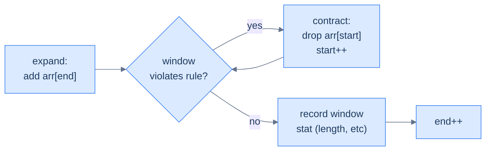

# Understanding the variable-sized sliding window pattern

The window now has **no fixed size**. Two pointers, `start` and `end`, define its boundaries. The window's contents are summarised in a hash map (frequencies, sums, sets — whatever the problem needs). On each iteration:

1. **Expand** by one step on the right: add `arr[end]`'s contribution to the map, then advance `end`.
2. **Contract** from the left **while the window violates the constraint**: subtract `arr[start]`'s contribution and advance `start`. Loop until the constraint is satisfied again.
3. **Record** the window's stat (length, sum, count) — at this moment the window is the largest valid one ending at `end`.

> 🖼 Diagram — The variable-window loop — expand on the right, then contract on the left as many times as needed to restore the rule. Notice contract is a while loop, not an if: a single expansion might violate the rule by multiple slots, so we keep contracting until it's fixed.


<p align="center"><strong>The variable-window loop — expand on the right, then contract on the left as many times as needed to restore the rule. Notice <code>contract</code> is a <em>while</em> loop, not an <em>if</em>: a single expansion might violate the rule by multiple slots, so we keep contracting until it's fixed.</strong></p>

The performance argument is beautiful: `start` only moves forward, never backward, and never overtakes `end`. Each element is therefore "touched" at most twice — once when `end` passes it (admitting it to the window), once when `start` passes it (evicting it). Total work: **O(N)**.

# Identifying the variable-sized sliding window pattern

This pattern fits problems that ask for the **longest** (or shortest) contiguous subsequence satisfying some condition that can be checked from a hash-map summary. The condition's truth-value should change *monotonically* as the window grows or shrinks — typically: extending the window *can only worsen* the condition, and contracting it *can only improve*.

**Template:**
> Given a sequence and a condition, slide a window whose right edge always advances; expand into the next element, then contract from the left until the condition holds; record the resulting window stat.

If the condition is "no duplicates", "at most K distinct", "sum ≤ S", "max-frequency element covers ≥ window − K positions", this template fits.

## Example — longest substring without repeating characters

> **Problem:** Given a string `s`, return the length of the longest substring without any repeating characters.

### Brute force

For each `start`, scan forward with `end`, maintaining a frequency map; stop the moment a duplicate appears. Track the longest run. **O(N²)**.

### Variable-window solution

The same observation that makes brute force O(N²) is also the loophole that makes a single pass possible: **once you've found a duplicate, the start pointer never has to move backward**. Any window that previously contained the duplicate is now disqualified. So we expand `end` greedily, and *whenever* the new character causes a duplicate, we slide `start` forward until the duplicate is gone — never reset, never look back.

> 🖼 Diagram — Walking through 'abcbed' — the window grows until 'b' duplicates, contracts past the first 'b', then continues growing. start only ever moves forward; end only ever moves forward. Each character is processed at most twice.

```mermaid
---
config:
  theme: base
  themeVariables:
    primaryColor: "#dbeafe"
    primaryBorderColor: "#3b82f6"
    primaryTextColor: "#1e3a5f"
    lineColor: "#64748b"
    secondaryColor: "#ede9fe"
    tertiaryColor: "#fef9c3"
---
flowchart LR
    A["s = 'a b c b e d'"] --> S1["window 'a' → ok, len=1"]
    S1 --> S2["expand 'ab' → ok, len=2"]
    S2 --> S3["expand 'abc' → ok, len=3"]
    S3 --> S4["expand 'abcb' → b dup!<br/>contract until 'cb' → ok, len=2"]
    S4 --> S5["expand 'cbe' → ok, len=3"]
    S5 --> S6["expand 'cbed' → ok, len=4"]
    S6 --> R["maxLength = 4"]
    style R fill:#dcfce7,stroke:#22c55e
```


<p align="center"><strong>Walking through 'abcbed' — the window grows until 'b' duplicates, contracts past the first 'b', then continues growing. <code>start</code> only ever moves forward; <code>end</code> only ever moves forward. Each character is processed at most twice.</strong></p>

### Algorithm

> **Algorithm**
>
> -   **Step 1:** Initialise `start = 0`, `end = 0`, empty `frequency` map, `maxLength = 0`.
> -   **Step 2:** While `end < len(s)`:
>     -   **Step 2.1:** Increment `frequency[s[end]]`.
>     -   **Step 2.2:** While `frequency[s[end]] > 1` (rule violated):
>         -   Decrement `frequency[s[start]]`; if zero, remove the key; advance `start`.
>     -   **Step 2.3:** `maxLength = max(maxLength, end − start + 1)`.
>     -   **Step 2.4:** Advance `end`.

### Implementation


```python run
def unique_character_span(s: str) -> int:
    freq, max_len, start = {}, 0, 0
    for end in range(len(s)):
        freq[s[end]] = freq.get(s[end], 0) + 1
        # Contract while the rule "no duplicates" is violated
        while freq[s[end]] > 1:
            freq[s[start]] -= 1
            if freq[s[start]] == 0: del freq[s[start]]
            start += 1
        # Window [start..end] is the longest valid window ending at end
        max_len = max(max_len, end - start + 1)
    return max_len

print(unique_character_span("abcbed"))     # 4
print(unique_character_span("aaaaabc"))    # 3
print(unique_character_span("abcdefgh"))   # 8
```

```java run
import java.util.*;

public class Main {
    static int uniqueCharacterSpan(String s) {
        Map<Character, Integer> freq = new HashMap<>();
        int start = 0, max = 0;
        for (int end = 0; end < s.length(); end++) {
            char c = s.charAt(end);
            freq.merge(c, 1, Integer::sum);
            while (freq.get(c) > 1) {
                char sc = s.charAt(start);
                freq.merge(sc, -1, Integer::sum);
                if (freq.get(sc) == 0) freq.remove(sc);
                start++;
            }
            max = Math.max(max, end - start + 1);
        }
        return max;
    }
    public static void main(String[] args) {
        System.out.println(uniqueCharacterSpan("abcbed"));
        System.out.println(uniqueCharacterSpan("aaaaabc"));
        System.out.println(uniqueCharacterSpan("abcdefgh"));
    }
}
```


A single pass — **O(N)** time, **O(K)** space (K = alphabet size).

## Example problems

> -   Unique character span — longest substring without repeating characters
> -   K characters span — longest substring with at most K distinct characters
> -   Maximal character swap — longest run achievable with K character replacements
> -   Subarray sum equals k — longest subarray summing to K (uses prefix-sum + hash)
> -   Twin in proximity — any duplicate within distance K?

<!-- ============================================== -->
<!-- SWEEP 2 — missing sections (placeholders only) -->
<!-- ============================================== -->

<!-- TODO: Why Naive Isn't Enough — missing, needs to be written -->
<!--       Guidance: motivation for why the obvious approach fails -->

<!-- TODO: The Core Idea — missing, needs to be written -->
<!--       Guidance: one paragraph: the central trick -->

<!-- TODO: How the Pointers/Window Move — missing, needs to be written -->
<!--       Guidance: mechanics of the moving parts -->

<!-- TODO: The Generic Algorithm — missing, needs to be written -->
<!--       Guidance: numbered steps, no code -->

<!-- TODO: Generic Implementation — missing, needs to be written -->
<!--       Guidance: Python block + Java block of the skeleton -->

<!-- TODO: Complexity Analysis — missing, needs to be written -->
<!--       Guidance: table -->

<!-- TODO: Variants / Taxonomy — missing, needs to be written -->
<!--       Guidance: enumerate sub-shapes of this pattern -->

<!-- TODO: Recognition Checklist — missing, needs to be written -->
<!--       Guidance: 4-question diagnostic — the source of the Problem-section Diagnostic Questions -->

<!-- TODO: Canonical Example — missing, needs to be written -->
<!--       Guidance: fully worked example: brute force → optimised → template fit -->

<!-- TODO: Problems in This Category — missing, needs to be written -->
<!--       Guidance: table with links to the 02-problems/ files -->
