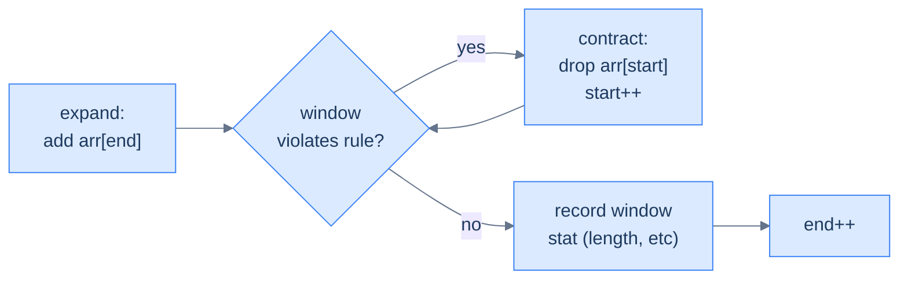

# Understanding the variable-sized sliding window pattern

The window now has **no fixed size**. Two pointers, `start` and `end`, define its boundaries. The window's contents are summarised in a hash map (frequencies, sums, sets — whatever the problem needs). On each iteration:

1. **Expand** by one step on the right: add `arr[end]`'s contribution to the map, then advance `end`.
2. **Contract** from the left **while the window violates the constraint**: subtract `arr[start]`'s contribution and advance `start`. Loop until the constraint is satisfied again.
3. **Record** the window's stat (length, sum, count) — at this moment the window is the largest valid one ending at `end`.

> 🖼 Diagram — The variable-window loop — expand on the right, then contract on the left as many times as needed to restore the rule. Notice contract is a while loop, not an if: a single expansion might violate the rule by multiple slots, so we keep contracting until it's fixed.


<p align="center"><strong>The variable-window loop — expand on the right, then contract on the left as many times as needed to restore the rule. Notice <code>contract</code> is a <em>while</em> loop, not an <em>if</em>: a single expansion might violate the rule by multiple slots, so we keep contracting until it's fixed.</strong></p>

The performance argument is beautiful: `start` only moves forward, never backward, and never overtakes `end`. Each element is therefore "touched" at most twice — once when `end` passes it (admitting it to the window), once when `start` passes it (evicting it). Total work: **O(N)**.

## Why Naive Isn't Enough

The naive way to find the longest valid window is to try every window. Fix a left edge `start`, extend a right edge `end` rightward while the condition holds, record the length, then advance `start` and repeat. The answer is correct, but the cost is the problem.

Trying every starting position pays a quadratic price. For each of the `N` starts you re-scan up to `N` characters, rebuilding the window's hash-map summary from scratch each time. That is `n + (n−1) + … + 1`, which is **O(N²)** time for **O(K)** space (K = alphabet size). The clock dominates the moment the input passes a few thousand items.

To make this concrete: on `"abcbed"` looking for the longest distinct run, the naive scan builds the window for `start = 0` — `"abc"`, then hits the duplicate `'b'` — and discards all of it. It then rebuilds from `start = 1`, hits another duplicate, and discards that too. Every restart re-counts characters an earlier scan already counted.

So the key idea is: re-scanning from each start throws away everything the previous scan learned, and a window that *remembers* its contents between starts replaces all those nested scans with one pass.

## The Core Idea

Keep one window and never rewind it. Walk `end` forward through the sequence one element at a time; whenever the window breaks the rule, walk `start` forward just far enough to fix it. Both pointers only ever move right, so the whole sequence is covered in a single sweep.

A hash map makes the rule cheap to check. The map summarises the window's contents — a frequency count, a distinct-key count, a most-frequent-letter tally — in whatever form the rule needs. Adding `arr[end]` updates one entry in amortised `O(1)`; evicting `arr[start]` updates one entry in amortised `O(1)`. So the core insight is: the hash map turns "does this window satisfy the rule?" into a constant-time lookup, and because neither pointer ever moves backward the entire scan is `O(N)`.

## How the Window Moves

The window breathes — `end` stretches it right, `start` compresses it from the left — but the two pointers play asymmetric roles. Understanding that asymmetry is the whole pattern:

- **`end` advances unconditionally.** Every iteration admits exactly one new element on the right. This is what drives the sweep forward.
- **`start` advances only on violation.** When the window breaks the rule, `start` steps right — once, or several times — until the rule holds again. When the rule already holds, `start` stays put.
- **Each element is touched at most twice.** Once when `end` passes it (admitting it), once when `start` passes it (evicting it). No element is ever revisited a third time.

To make this concrete: scanning `"abcbed"` for distinct characters, `end` admits `a`, `b`, `c` (window `"abc"`), then admits the second `b` (window `"abcb"`, rule broken). Now `start` advances past the first `b` to restore distinctness (window `"cb"`), then `end` resumes. The contraction at the duplicate is the entire trick — it discards every window that still contains the first `b` in one move. The core insight is: expand greedily, contract conditionally, and the forward-only motion of both pointers is what buys the `O(N)` bound.

## The Generic Algorithm

The template is four operations wrapped in a single loop. Three knobs change per problem: what the hash map summarises, how the rule is phrased against that summary, and whether contraction is a single step or a loop.

1. Initialise `start = 0`, `end = 0`, an empty hash map summarising the window, and a `result` accumulator (a max length, a count, or a boolean) seeded to the problem's neutral value.
2. While `end < len(sequence)`, repeat the next four steps.
3. **Expand** — add `sequence[end]`'s contribution to the hash map.
4. **Contract** — while the window violates the rule, remove `sequence[start]`'s contribution from the map (deleting the key if its count hits zero) and advance `start`. Use a `while`, not an `if`: one new element can break the rule by several slots.
5. **Process** — read the current window's stat into `result`. At this point the window is the largest valid one ending at `end`.
6. **Advance** — increment `end`.
7. When the loop ends, return `result`.

The choice between `if` and `while` at step 4 is the single most error-prone decision. Default to `while`; downgrade to `if` only when you can prove one contraction always suffices.

## Complexity Analysis

The forward-only motion of both pointers is the entire argument. `start` and `end` each begin at `0`, and at least one advances every iteration. Neither ever moves backward, so together they take at most **2N** steps before `end` reaches the end of the sequence. Each step does amortised `O(1)` hash-map work — one insert on expansion, one delete on contraction.

That gives **O(N)** time in every case, assuming the map's add and remove are `O(1)`. Space is bounded by the number of distinct keys the window holds at once — **O(K)**, where `K` is the alphabet size or distinct-value count. That is `O(1)` for a fixed alphabet and `O(N)` in the worst case.

| | Time | Space |
|---|---|---|
| Best case | **O(N)** | **O(K)** |
| Worst case | **O(N)** | **O(K)** |

**Compared to brute force:** the naive nested-loop scan is **O(N²)** time. For `N = 10,000` that is roughly 50 million operations versus 10,000 — the difference between seconds and milliseconds.

## Variants / Taxonomy

The family splits along two independent axes — *what the window optimises* and *what the map tracks to check the rule*:

- **Longest-window.** Expand greedily, contract only on violation, record the maximum length seen. The window is the answer — unique-character span, K-characters span, maximal character swap.
- **Existence / fixed-width window.** The window is capped at a known width (`k+1`) and you only ask whether a property ever holds inside it — twin-in-proximity. No "longest" search; the map is a moving set of the last few elements.
- **Frequency-map rule.** The map counts occurrences and the rule reads those counts — distinct-count `≤ k`, no-duplicates (`count ≤ 1`), `(width − maxFreq) ≤ k`. This is the default for character problems.
- **Non-monotonic escape hatch.** When the rule is *not* monotonic (arrays with negatives, "sum exactly `k`"), the window trick breaks — contracting can make the sum go either way. These need a prefix-sum + hash map instead, previewed in subarray-sum-equals-k.

Every monotonic variant runs the identical expand-contract-record skeleton. The longest/existence axis changes whether you search for a maximum or short-circuit on a hit; the map axis changes what you hash and how the rule reads it.

# Identifying the variable-sized sliding window pattern

This pattern fits problems that ask for the **longest** (or shortest) contiguous subsequence satisfying some condition that can be checked from a hash-map summary. The condition's truth-value should change *monotonically* as the window grows or shrinks — typically: extending the window *can only worsen* the condition, and contracting it *can only improve*.

**Template:**
> Given a sequence and a condition, slide a window whose right edge always advances; expand into the next element, then contract from the left until the condition holds; record the resulting window stat.

If the condition is "no duplicates", "at most K distinct", "sum ≤ S", "max-frequency element covers ≥ window − K positions", this template fits.

## Example — longest substring without repeating characters

> **Problem:** Given a string `s`, return the length of the longest substring without any repeating characters.

### Brute force

For each `start`, scan forward with `end`, maintaining a frequency map; stop the moment a duplicate appears. Track the longest run. **O(N²)**.

### Variable-window solution

The same observation that makes brute force O(N²) is also the loophole that makes a single pass possible: **once you've found a duplicate, the start pointer never has to move backward**. Any window that previously contained the duplicate is now disqualified. So we expand `end` greedily, and *whenever* the new character causes a duplicate, we slide `start` forward until the duplicate is gone — never reset, never look back.

> 🖼 Diagram — Walking through 'abcbed' — the window grows until 'b' duplicates, contracts past the first 'b', then continues growing. start only ever moves forward; end only ever moves forward. Each character is processed at most twice.

```mermaid
---
config:
  theme: base
  themeVariables:
    primaryColor: "#dbeafe"
    primaryBorderColor: "#3b82f6"
    primaryTextColor: "#1e3a5f"
    lineColor: "#64748b"
    secondaryColor: "#ede9fe"
    tertiaryColor: "#fef9c3"
---
flowchart LR
    A["s = 'a b c b e d'"] --> S1["window 'a' → ok, len=1"]
    S1 --> S2["expand 'ab' → ok, len=2"]
    S2 --> S3["expand 'abc' → ok, len=3"]
    S3 --> S4["expand 'abcb' → b dup!<br/>contract until 'cb' → ok, len=2"]
    S4 --> S5["expand 'cbe' → ok, len=3"]
    S5 --> S6["expand 'cbed' → ok, len=4"]
    S6 --> R["maxLength = 4"]
    style R fill:#dcfce7,stroke:#22c55e
```


<p align="center"><strong>Walking through 'abcbed' — the window grows until 'b' duplicates, contracts past the first 'b', then continues growing. <code>start</code> only ever moves forward; <code>end</code> only ever moves forward. Each character is processed at most twice.</strong></p>

### Algorithm

> **Algorithm**
>
> -   **Step 1:** Initialise `start = 0`, `end = 0`, empty `frequency` map, `maxLength = 0`.
> -   **Step 2:** While `end < len(s)`:
>     -   **Step 2.1:** Increment `frequency[s[end]]`.
>     -   **Step 2.2:** While `frequency[s[end]] > 1` (rule violated):
>         -   Decrement `frequency[s[start]]`; if zero, remove the key; advance `start`.
>     -   **Step 2.3:** `maxLength = max(maxLength, end − start + 1)`.
>     -   **Step 2.4:** Advance `end`.

### Implementation


```python run viz=array viz-root=s
def unique_character_span(s: str) -> int:
    freq, max_len, start = {}, 0, 0
    for end in range(len(s)):
        freq[s[end]] = freq.get(s[end], 0) + 1
        # Contract while the rule "no duplicates" is violated
        while freq[s[end]] > 1:
            freq[s[start]] -= 1
            if freq[s[start]] == 0: del freq[s[start]]
            start += 1
        # Window [start..end] is the longest valid window ending at end
        max_len = max(max_len, end - start + 1)
    return max_len

print(unique_character_span("abcbed"))     # 4
print(unique_character_span("aaaaabc"))    # 3
print(unique_character_span("abcdefgh"))   # 8
```

```java run viz=array viz-root=s
import java.util.*;

public class Main {
    static int uniqueCharacterSpan(String s) {
        Map<Character, Integer> freq = new HashMap<>();
        int start = 0, max = 0;
        for (int end = 0; end < s.length(); end++) {
            char c = s.charAt(end);
            freq.merge(c, 1, Integer::sum);
            while (freq.get(c) > 1) {
                char sc = s.charAt(start);
                freq.merge(sc, -1, Integer::sum);
                if (freq.get(sc) == 0) freq.remove(sc);
                start++;
            }
            max = Math.max(max, end - start + 1);
        }
        return max;
    }
    public static void main(String[] args) {
        System.out.println(uniqueCharacterSpan("abcbed"));
        System.out.println(uniqueCharacterSpan("aaaaabc"));
        System.out.println(uniqueCharacterSpan("abcdefgh"));
    }
}
```


A single pass — **O(N)** time, **O(K)** space (K = alphabet size).

## Example problems

> -   Unique character span — longest substring without repeating characters
> -   K characters span — longest substring with at most K distinct characters
> -   Maximal character swap — longest run achievable with K character replacements
> -   Subarray sum equals k — longest subarray summing to K (uses prefix-sum + hash)
> -   Twin in proximity — any duplicate within distance K?

## Recognition Checklist

Four questions confirm a problem fits the variable-sized sliding window. Every answer must be **yes** — a single **no** means a different technique applies, or the pattern is outright unsafe.

1. **Is the answer the longest, shortest, or count of a *contiguous* subsequence?** The window is one contiguous range; "pick any subset" or "reorder" problems do not fit.
2. **Can a hash map summarise the window so the rule is an `O(1)` check?** Frequency counts, distinct-key counts, and most-frequent tallies all qualify. A rule needing a sorted view or sliding max/min does not, without a heavier structure.
3. **Can you add `arr[end]` and remove `arr[start]` from that summary in `O(1)`?** Counts can. Plain max/min cannot be undone in constant time once the extreme leaves the window.
4. **Is the rule *monotonic* as the window grows?** Extending must only make the rule harder (or only easier) to satisfy. Without this, contracting on violation is guessing — and the proof of correctness collapses.

These four questions reappear as the **Diagnostic Questions** table in every problem write-up that follows.

## Canonical Example

The worked example above showed the mechanics. Here the same problem — the longest substring without repeating characters — runs end-to-end against the four recognition questions, adding the step trace and template-fit check the earlier pass left out.

### Problem Statement

> **Problem:** Given a string `s`, return the length of the longest substring without any repeating characters.

Take `s = "abcbed"`. The expected answer is `4` — `"cbed"` is the longest run with all-distinct characters.

### Brute Force

For each starting index, scan forward with a fresh frequency map and stop the moment a character repeats; track the longest clean run. It works, but each start triggers a full forward scan, so the cost is **O(N²)** time for **O(K)** space — quadratic and unusable past a few thousand characters.

### Key Insight

The repeated scans all re-derive the same fact: where the next duplicate sits. Once `end` hits a character already in the window, *every* window that still contains the earlier copy is disqualified — so `start` never has to move backward. The core insight is: a frequency map detects the duplicate in `O(1)`, and sliding `start` forward past it discards a whole family of dead windows in one move, turning `N` separate scans into a single `O(N)` pass.

### Optimized Solution

The variable-window solution, mechanically:

1. Keep a frequency map of the current window plus a `maxLength` accumulator.
2. Advance `end`, incrementing `frequency[s[end]]`.
3. While `frequency[s[end]] > 1` (a duplicate exists), evict from the left: decrement `frequency[s[start]]`, drop the key if it hits zero, advance `start`.
4. Record `maxLength = max(maxLength, end − start + 1)`, then advance `end`.

This is exactly the implementation shown earlier under the *Implementation* heading — `unique_character_span`. A single pass: **O(N)** time, **O(K)** space.

### Trace

Walk `s = "abcbed"`. The window is `s[start..end]`; the rule is "no duplicates":

```
end=0  add 'a'  freq={a:1}            window "a"     len 1  maxLength=1
end=1  add 'b'  freq={a:1,b:1}        window "ab"    len 2  maxLength=2
end=2  add 'c'  freq={a:1,b:1,c:1}    window "abc"   len 3  maxLength=3
end=3  add 'b'  freq={a:1,b:2,c:1}    duplicate 'b'!
       evict 'a' (start 0→1)  freq={b:2,c:1}  'b' still 2
       evict 'b' (start 1→2)  freq={b:1,c:1}  window "cb"  len 2  maxLength=3
end=4  add 'e'  freq={b:1,c:1,e:1}    window "cbe"   len 3  maxLength=3
end=5  add 'd'  freq={b:1,c:1,e:1,d:1} window "cbed" len 4  maxLength=4

return maxLength = 4
```

The result `4` matches the expected output — `"cbed"` is the longest substring with no repeats.

### Fitting the Template

| Check | Answer for Longest Substring Without Repeats |
|---|---|
| **Q1.** Is the answer the longest/shortest/count of a contiguous subsequence? | **Yes** — the longest contiguous substring with distinct characters. |
| **Q2.** Can a hash map summarise the window for an `O(1)` rule check? | **Yes** — a frequency map; the rule is "every count `≤ 1`". |
| **Q3.** Can you add `s[end]` and remove `s[start]` in `O(1)`? | **Yes** — one increment on expand, one decrement on contract. |
| **Q4.** Is the rule monotonic as the window grows? | **Yes** — adding a character can only create a duplicate; removing one can only clear it. |

## Problems in This Category

The five problems below each specialise the expand-contract-record skeleton — only the window's summary and the rule it checks change:

| # | Problem | Variant | Twist on the skeleton |
|---|---|---|---|
| 1 | [Unique Character Span](02-problems/01-unique-character-span) | Longest-window, frequency map | Contract while any count `> 1` |
| 2 | [K Characters Span](02-problems/02-k-characters-span) | Longest-window, frequency map | Contract while distinct-count (`len(map)`) `> k` |
| 3 | [Maximal Character Swap](02-problems/03-maximal-character-swap) | Longest-window, frequency map | Contract while `(width − maxFreq) > k` |
| 4 | [Subarray Sum Equals K](02-problems/04-subarray-sum-equals-k) | Prefix-sum + hash (preview) | Window fails on negatives — use prefix sums instead |
| 5 | [Twin in Proximity](02-problems/05-twin-in-proximity) | Fixed-width existence | Cap the window at `k+1`; short-circuit on any repeat |

Each is a small variation on the same skeleton — only the summary and the rule change.
