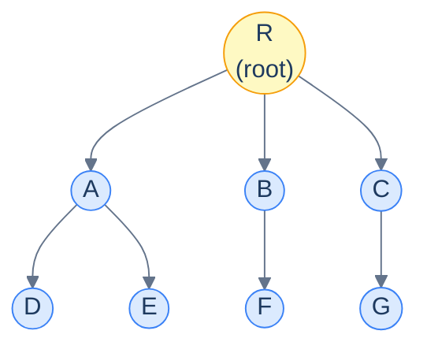
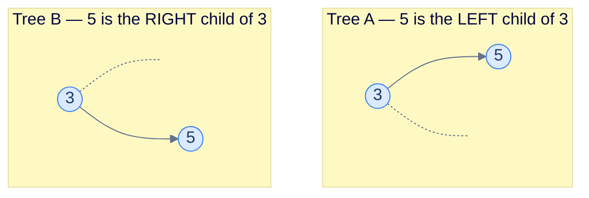
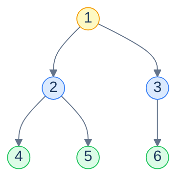
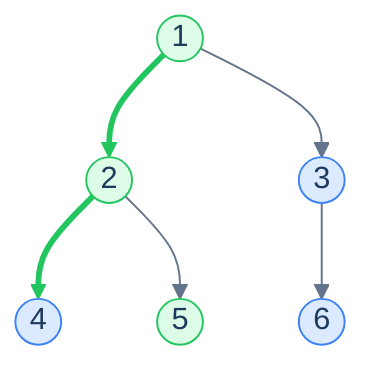
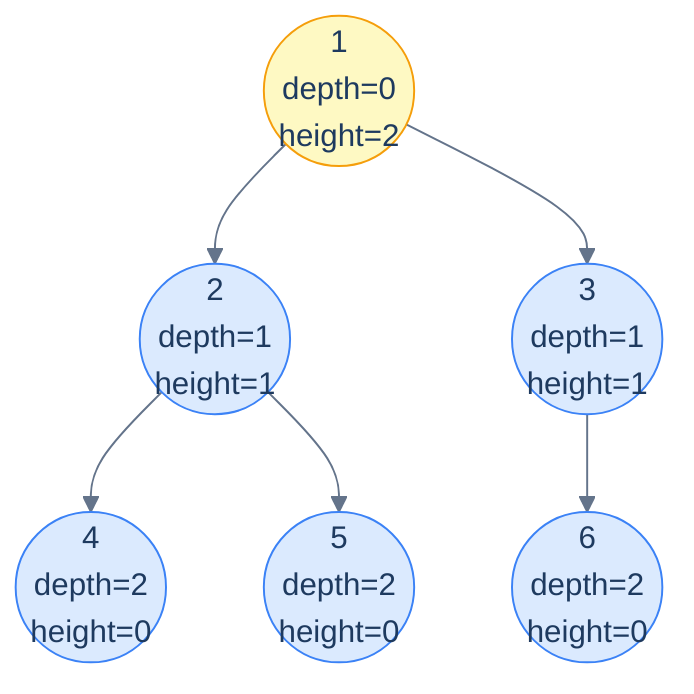
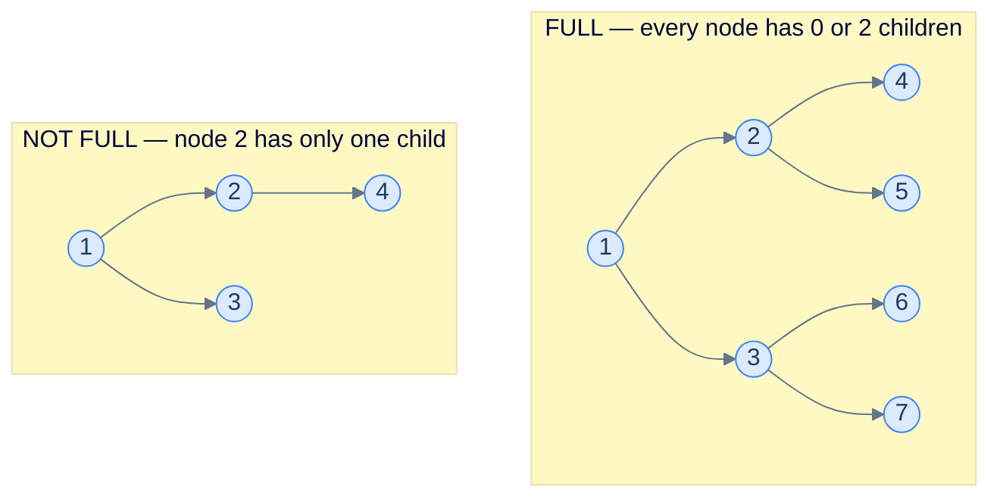
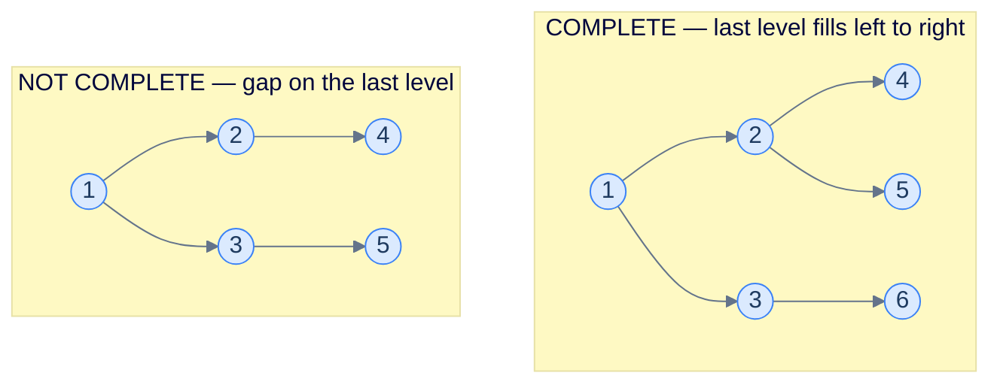
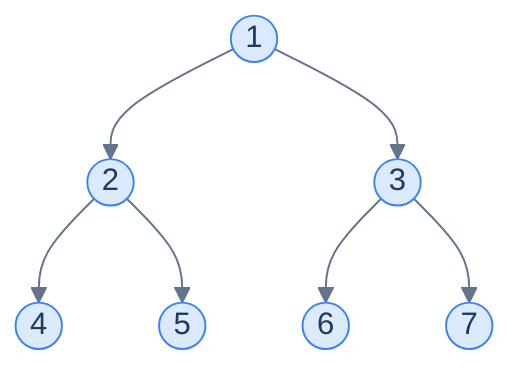
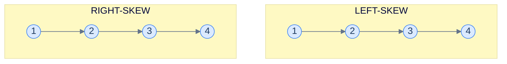
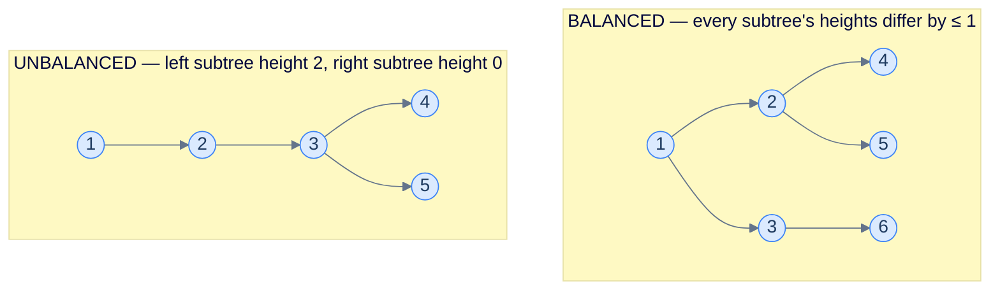

# 1. Introduction to Binary Trees

## The Hook

Up to now, every data structure in this course has been **linear**. An array, a linked list, a stack, a queue — they all lay items out along a single line, and you move *forward* or *backward* through them. One dimension, two directions, easy to picture.

Real data is hardly ever that flat. A *file system* has folders inside folders inside folders. *HTML* nests divs inside divs. The *DOM* you click through in a browser is a tree. *Source code* parses into an *abstract syntax tree*. Your *family tree*. The decision branches inside *Stockfish* or *AlphaZero*. The *organisational chart* of every company on Earth. The *taxonomy of life* — kingdom, phylum, class, order, family, genus, species. **Hierarchy is everywhere**, and the moment a problem has a notion of "parent" and "child", a linear data structure is the wrong shape.

The **tree** is the data structure that captures hierarchy directly. One special node is the *root* of the universe, every other node has exactly one parent, and any node may have any number of children. From this single rule fall *all* the structural properties — depth, height, paths, ancestry, descendants — that hierarchical reasoning needs.

This chapter is about the most-loved member of the tree family: the **binary tree**, where every node is allowed *at most two* children. That tiny restriction unlocks an enormous amount of beautiful machinery — fast search (BSTs), fast priority queues (heaps), language parsers, decision trees, range trees, segment trees, even the call stack of every recursive function you've ever written. Master this chapter, and the next four chapters of the course (BSTs, heaps, graphs, and beyond) become natural extensions of the same vocabulary.

This first lesson sets up the language: what a tree *is*, what each part is *called*, and which special shapes of binary tree get their own names. Get the vocabulary right and the rest of the chapter clicks into place.

---

## Table of contents

1. [Understanding the problem](#understanding-the-problem)
2. [Understanding a binary tree](#understanding-a-binary-tree)
3. [Key tree terminologies](#key-tree-terminologies)
4. [Types and properties of binary trees](#types-and-properties-of-binary-trees)
5. [Supported operations](#supported-operations)
6. [Internal mechanics](#internal-mechanics)
7. [Working example](#working-example)
8. [Edge cases and pitfalls](#edge-cases-and-pitfalls)
9. [Production reality](#production-reality)
10. [Quiz](#quiz)
11. [Practice ladder](#practice-ladder)
12. [Further reading](#further-reading)
13. [Cross-links](#cross-links)
14. [Final takeaway](#final-takeaway)

***

# Understanding the Problem

A binary tree exists to model **hierarchy** — data where one item *contains* or *precedes* others, and a single line cannot capture the relationship. The structures you already know all store data in a sequence. The moment a problem says "parent", "child", "contains", or "branches into", that sequence is the wrong shape.

Three families of real problems force this need:

- **Containment** — a folder holds files and other folders; a JSON object nests objects; an HTML page nests elements. Each thing lives *inside* exactly one parent.
- **Decision and search** — a guessing game halves the search space at every step; a sorted dictionary lets you skip past whole ranges. Each choice branches into a smaller sub-problem.
- **Precedence and derivation** — arithmetic groups `(a + b) * c` so the parenthesised part resolves first; a compiler parses source into the order operations must run. Each operation depends on its sub-expressions.

To make this concrete: a file path like `/home/user/photos/trip.jpg` is a *walk down a hierarchy*. The slash is not a separator between equals — it is an edge from a parent folder to a child. Storing those folders in a flat array loses the one fact that matters: which folder contains which.

So the key idea is: a binary tree captures "this node owns these two sub-things" directly in the structure, so the relationship is `O(1)` to follow and the whole hierarchy is `O(n)` to store for `n` nodes. The rest of this lesson builds the vocabulary that lets you *describe* such a structure precisely.

***

# Understanding a binary tree

A **tree** is a *non-linear, hierarchical* data structure. Every element is called a **node**. One node — the **root** — has no parent; every other node has exactly one parent and zero-or-more children. The connections between parent and child are called **edges**.

Three rules together define a tree (and rule out everything that isn't one):

1. There is exactly **one root**.
2. Every non-root node has **exactly one parent**.
3. There are **no cycles** — you cannot follow edges from a node and return to it.

Break rule 1 and you have a *forest* (a set of trees). Break rule 2 or rule 3 and you have a *graph* — a strictly more general structure that we'll cover in its own chapter.



<p align="center"><strong>A generic tree — one root <code>R</code>, edges flow from parent to child, every node has at most one parent. Notice this is <em>not</em> a binary tree: <code>R</code> has three children. A binary tree restricts every node to <em>at most two</em>.</strong></p>

## What makes it *binary*

A **binary tree** is a tree where every node has **at most two children**. Because two is the limit, the children get fixed names — the **left** child and the **right** child — and even when a node has only *one* child, we still distinguish whether it's the left or the right one. That distinction matters: a tree with `5` as a *left* child of `3` is a *different* tree from one with `5` as a *right* child of `3`, even if every other node is identical.



<p align="center"><strong>Same nodes, same edges, <em>different trees</em>. In a binary tree the left/right distinction is part of the structure — not a cosmetic detail. Algorithms like inorder traversal will produce different output for these two trees.</strong></p>

> *Predict before reading on — if every node has at most 2 children, what's the maximum number of nodes a binary tree of <em>height 3</em> can hold?*
>
> 15. Level 0 holds 1 node (the root), level 1 holds at most 2, level 2 at most 4, level 3 at most 8, totalling `1+2+4+8 = 15 = 2⁴ − 1`. In general a binary tree of height `h` holds at most `2^(h+1) − 1` nodes — *exponential* in the height. This is the entire reason binary trees are useful: a tree of height 30 holds **a billion** nodes, and any algorithm whose work is proportional to height is therefore extraordinarily fast on balanced trees. Hold this fact close — it underwrites everything from BSTs to heaps.

***

# Key tree terminologies

A two-dimensional structure needs a richer vocabulary than a linear one. The terms below let us *talk* about trees precisely — they're not specific to binary trees and apply to general trees as well.

## Root

The **root** is the unique node with no parent — the topmost node, from which every other node is reachable by following edges downward. Every tree has exactly one root; "root of an empty tree" is `null` (the conventional sentinel).

> The root is your *entry point* — to access *any* node in a tree, your program needs to hold on to the root reference. Lose it, and the entire tree is leaked memory.

## Leaf

A **leaf** is a node with **no children** — a "dead end" of the tree. Leaves are where every downward traversal eventually stops. A tree of one node is *both* the root *and* a leaf simultaneously.

## Internal node

An **internal node** is any node that is *not* a leaf — i.e., a node with at least one child. The root is internal *unless* the tree has exactly one node (then it's a leaf).



<p align="center"><strong>Yellow = root, blue = internal, green = leaves. Root and internal can overlap (the root is internal whenever it has children); leaves are the terminating nodes whose recursive traversals hit the base case.</strong></p>

## Degree

The **degree** of a node is the number of children it has. In a binary tree, degree ∈ `{0, 1, 2}`:

- Degree 0 ⇒ leaf.
- Degree 1 ⇒ partially-filled internal node (only one child).
- Degree 2 ⇒ fully-filled internal node (both children).

The **degree of the tree** is the maximum degree of any node in it. A binary tree has degree ≤ 2 by definition.

## Sibling

Two nodes are **siblings** if they share the same parent. In a binary tree, a node has *at most one* sibling — its parent's other child (if any).

## Path

A **path** between two nodes is the unique sequence of nodes connecting them, walking along edges. Because a tree has no cycles, the path between any two nodes is *unique* — and that uniqueness is what makes algorithms like LCA (lowest common ancestor) well-defined.

The **length** of a path can be measured in two equivalent ways: the number of *edges* it traverses, or the number of *nodes* it contains minus one. The two conventions differ by exactly one — pay attention to which a problem is using.



<p align="center"><strong>The unique path from root <code>1</code> to leaf <code>5</code>: <code>1 → 2 → 5</code>. Length = 2 (edges) or 3 (nodes). Trees have <em>exactly one</em> path between any two nodes — that uniqueness underpins every tree algorithm.</strong></p>

## Subtree

A **subtree** of node `n` is the tree consisting of `n` itself and *all of its descendants* (children, grandchildren, …). Every node is the root of its own subtree. A binary tree has a "left subtree" and a "right subtree" — the subtrees rooted at the left and right children — and most recursive tree algorithms are written in terms of these two recursive sub-problems.

> The recursive view: **a binary tree is either empty, or a root node with a left subtree and a right subtree**. This single recursive definition is the engine behind every recursive traversal, every divide-and-conquer construction, and every dynamic programming algorithm on trees in the entire course.

## Level

Every node sits at a **level** — its distance from the root. The root is at level `0`; its children at level `1`; their children at level `2`; and so on. The number of nodes at level `k` is at most `2^k` in a binary tree.

## Depth

The **depth** of a node is the number of *edges* on the path from the root to that node. The root has depth 0; its children have depth 1; and so on. *Depth is identical to level* — they're the same concept under two different names.

## Height

The **height** of a node is the number of *edges* on the *longest* path from that node *down to a leaf*. Leaves have height 0. The root's height is the **height of the tree**.



<p align="center"><strong>Depth grows downward (from root); height grows upward (from leaves). They meet at the root, where <code>height(root) = height of tree</code>. For this 6-node tree, height = 2.</strong></p>

> *Beware:* some textbooks define height in terms of nodes rather than edges — making leaves' height *1* instead of *0*. We use the **edge-counting** convention throughout this course because it's the one used by LeetCode, CLRS, and most production code. *Always check the convention* before writing a function called `height()`.

## Ancestor and descendant

If node `a` lies on the path from the root to node `b`, then `a` is an **ancestor** of `b` and `b` is a **descendant** of `a`. The root is an ancestor of every node. Every node is its own *trivial* ancestor and descendant by convention. The notion of ancestry is the basis of the *Lowest Common Ancestor (LCA)* algorithm — we'll see it later in the chapter.

***

# Types and properties of binary trees

Binary trees can be any shape — wildly skewed, perfectly balanced, half-empty. A few specific shapes show up so often that they get their own names and properties. Knowing which type you're dealing with often unlocks faster algorithms.

## Full binary tree

A **full** (or **proper**) binary tree is one in which **every node has either 0 or 2 children** — no node has exactly one. Either you have both children or none. Internal nodes are *complete*; the rest are leaves.



<p align="center"><strong>A full binary tree forbids "single-child" nodes. The right-side example violates that — node 2 has a left child but no right child, so the tree is not full.</strong></p>

> **Useful identities for a full binary tree** with `L` leaves and `I` internal nodes:
>
> - **`L = I + 1`** — there's always exactly one more leaf than internal node.
> - **Total nodes `N = 2I + 1 = 2L − 1`** — always odd.
> - **Maximum number of leaves at height `h`** = `2^h`.
>
> The first identity is a beautiful inductive fact and shows up surprisingly often — every full binary tree, no matter how lopsided, has *exactly one more leaf than internal node*.

## Complete binary tree

A **complete** binary tree fills its levels **top-to-bottom and left-to-right** — every level is full *except possibly the last*, and the last level is filled from the left with no gaps. This is the shape of a binary heap (used for priority queues) and the shape that lets binary trees be stored compactly in arrays.



<p align="center"><strong>The right-side tree is not complete because level 2 has a gap — node 2 has no right child even though node 3 has children. A complete tree fills every level fully, then starts the next from the left without skips.</strong></p>

> Complete binary trees are *the* shape that maps cleanly onto an array. We'll see in the next lesson that for a complete tree, the left child of index `i` lives at `2i + 1` and the right child at `2i + 2` — pure index arithmetic, zero pointers. This is also why heaps store as arrays rather than linked structures.

## Perfect binary tree

A **perfect** binary tree is both *full* and *complete* — every internal node has exactly two children **and** all leaves are at the same level. A perfect tree of height `h` has exactly `2^(h+1) − 1` nodes — every level is at maximum capacity.



<p align="center"><strong>A perfect binary tree of height 2 — exactly <code>2³ − 1 = 7</code> nodes, all four leaves on the bottom level. Both internal nodes (1, 2, 3) have two children; the tree is the densest a binary tree of that height can be.</strong></p>

> **Useful identities for a perfect binary tree** of height `h`:
>
> - **Total nodes `N = 2^(h+1) − 1`** — exactly one less than the next power of two.
> - **Number of leaves = `2^h`** — every leaf is on the bottom level.
> - **Height `h = log₂(N + 1) − 1`** — invert the formula above.
>
> The relationship `h ≈ log N` is the entire reason balanced binary trees give us O(log N) operations. A perfect tree of *60* levels holds about a *quintillion* nodes.

## Skew binary tree

A **skew** (or **degenerate**) binary tree is one where every internal node has *only one* child — so the tree degenerates into a linked list. Two flavours: **left-skew** (every child is a left child) and **right-skew** (every child is a right child). Skew trees are the *worst case* for almost every tree algorithm — height = `N − 1`, so any "O(height)" algorithm becomes O(N), losing all the benefit of being a tree at all.



<p align="center"><strong>A skew tree is morally a linked list. <code>N</code> nodes, height <code>N − 1</code>. Insert items in <em>sorted order</em> into a naive BST and you'll generate exactly this shape — the pathological case that motivates self-balancing trees (AVL, red-black) in later chapters.</strong></p>

## Balanced binary tree

A binary tree is **balanced** when no leaf is *too much further* from the root than any other. The exact definition varies — height-balanced trees require every node's two subtree heights to differ by at most 1 (the AVL invariant); other balance schemes are looser. The key intuition is *all balanced trees have height O(log N)*, and that's what enables the O(log N) operations of BSTs, heaps, and balanced search structures.



<p align="center"><strong>The balanced tree's height is <code>⌈log₂ 6⌉ = 3</code> levels (heights 0, 1, 2). The unbalanced one has height 3 with only 5 nodes — same heights, fewer nodes. Operations scale with height, so the unbalanced shape is strictly worse to query against.</strong></p>

***

# Supported Operations

A binary tree exposes a small set of structural operations. Every one of them is built on the same recursive shape — visit a node, then recurse into its two subtrees. The table below summarises the core operations and their cost on a tree of `n` nodes with height `h`.

| Operation | Time | Space | Notes |
|---|---|---|---|
| Access a child | `O(1)` time | `O(1)` space | Follow the `left` or `right` reference — one pointer dereference. |
| Traverse all nodes | `O(n)` time | `O(h)` space | Visit every node once; recursion stack holds at most one root-to-leaf path. |
| Search (unordered tree) | `O(n)` time | `O(h)` space | No ordering, so a target may be anywhere — every node may need a visit. |
| Compute height | `O(n)` time | `O(h)` space | Post-order: a node's height needs both children's heights first. |
| Insert a node | `O(h)` time | `O(1)` space | Walk to the chosen parent, then attach as `left` or `right`. |
| Delete a node | `O(h)` time | `O(1)` space | Find the node, detach it, then re-link or relocate its subtrees. |

Two of these costs deserve a direct caveat. **Search is `O(n)` time, not `O(log n)`.** A plain binary tree imposes no ordering, so a lookup cannot discard half the tree the way a binary *search* tree does. To make this concrete: finding the value `42` in an unordered tree of 1,000 nodes may touch all 1,000, because `42` could sit in any position. Ordering is what later chapters add to buy `O(log n)` search.

The space column tells the second half of the story. Every recursive operation costs `O(h)` space for the call stack, where `h` is the height. On a **balanced** tree `h ≈ log₂ n`, so the stack stays shallow. On a **skew** tree `h = n − 1`, so the stack is as deep as the tree is tall — deep enough to overflow on a large input. So the tradeoff is: a binary tree gives `O(1)`-time child access and `O(n)`-time full traversal, but every "how fast" answer for search and per-operation depth is really a question about the tree's *height*, which its shape decides.

***

# Internal Mechanics

A binary tree is stored as a set of **node objects connected by references**, and the entire structure hangs off a single `root` reference. This is the linked representation — the one this lesson assumes, and the one the next lesson contrasts with an array layout.

Each node bundles three things together:

- **a value** — the payload the node carries (a number, a string, an object).
- **a `left` reference** — points to the root of the left subtree, or is `null`.
- **a `right` reference** — points to the root of the right subtree, or is `null`.

A `null` reference is the structure's way of saying "no child here". A leaf is precisely a node whose `left` and `right` are *both* `null`; a degree-1 node has exactly one non-null child. The whole tree is reachable from `root` by following these references downward — and `root` itself is `null` when the tree is empty.

To make this concrete: a three-node tree with root `1`, left child `2`, and right child `3` is three node objects. The `1` node's `left` points at the `2` node and its `right` points at the `3` node. The `2` and `3` nodes each have `left` and `right` set to `null`. Holding the `1` node is holding the entire tree — lose that reference and all three nodes become unreachable, garbage-collected memory.

This layout is what makes the recursive definition *operational*. The definition says a binary tree is either empty (`null`) or a node with a left and a right subtree. That maps one-to-one onto the references: a reference is either `null`, or it points to a node carrying its own `left` and `right`. Every recursive algorithm in the chapter is written against this shape: check for `null` (the base case), otherwise process the node and recurse on `left` and `right`.

So the key idea is: the tree is a graph of `O(n)` node objects wired by parent-to-child references and reachable from one `root` handle. The `null` reference does double duty — empty-tree sentinel and end-of-subtree marker. The alternative is packing a tree into a flat array by index arithmetic, the subject of the next lesson, which trades pointer flexibility for cache-friendly compactness.

***

# Working Example

Trace a small binary tree from empty to five nodes, then read three properties off it — height, a root-to-leaf path, and the result of a search. Every step uses only the references described above, so the mechanics stay concrete.

**Step 1 — start empty.** The tree is a single `root` reference set to `null`. It holds zero nodes. A traversal returns immediately, a search returns "not found", and a delete is a no-op. The empty tree's height is conventionally `−1` (no edges), which makes a single node's height work out to `0`.

**Step 2 — insert the root.** Create a node holding `1` with `left = null` and `right = null`, and point `root` at it. The tree now has one node, which is *both* the root and a leaf. Its height is `0` — zero edges down to the nearest leaf, because it is its own leaf.

**Step 3 — insert two children of the root.** Attach a node `2` as `root.left` and a node `3` as `root.right`. Node `1` now has degree 2; nodes `2` and `3` are leaves at depth `1`. The tree is a perfect tree of height `1` with `2² − 1 = 3` nodes.

**Step 4 — insert two children under node `2`.** Attach node `4` as `2.left` and node `5` as `2.right`. Nodes `4` and `5` are leaves at depth `2`. Node `3` is still a leaf at depth `1`. The tree now has five nodes, and its shape is the same one drawn in the terminology diagrams above.

**Step 5 — read three properties.** Walk the finished tree:

```
        1            depth 0   (root)
       / \
      2   3          depth 1   (3 is a leaf)
     / \
    4   5            depth 2   (4 and 5 are leaves)
```

- **Height of the tree** = `2`. The longest root-to-leaf path is `1 → 2 → 4` (or `1 → 2 → 5`), which is two edges. Node `3`'s path is shorter, so it does not set the height.
- **Path from root to node `5`** = `1 → 2 → 5`, length `2` edges (or `3` nodes). It is the *only* such path, because a tree has exactly one path between any two nodes.
- **Search for value `5`** with no ordering visits nodes until it finds the match: `1` (no), `2` (no), `4` (no), `5` (yes) under a pre-order walk — up to `O(n)` work. The tree's lack of ordering is exactly why the search cannot skip node `4`.

So the key idea is: building the tree is a sequence of "create node, point a parent reference at it" steps. Reading any property is then a recursive walk costing `O(n)` time and `O(h)` space — here `n = 5` and `h = 2`.

***

## Key Takeaway

A binary tree is built one node at a time by attaching children to a parent's `left` or `right` reference, and every property — height, depth, path, or search result — is recovered by a recursive walk costing `O(n)` time and `O(h)` space.

***

# Edge Cases and Pitfalls

Almost every binary-tree bug traces to one of two roots: forgetting the `null` base case, or assuming the tree is balanced when its shape is adversarial. Train your eye to ask, on every tree algorithm, "what happens on the empty tree, and what happens on a skew tree?".

- **The empty tree (`root == null`).** Every recursive tree function must handle `null` as its first line — it is both the empty-tree case and the recursion's base case. Omitting it dereferences a `null` reference and crashes. The fix is a guard: `if (node == null) return <base value>` before touching `node.left` or `node.right`.
- **The single-node tree.** A one-node tree is *both* root and leaf, with height `0`. Code that assumes the root has children — or that a leaf is never the root — mis-handles this case. Check it explicitly whenever an algorithm treats the root and the leaves differently.
- **The skew (degenerate) tree.** Insert values in sorted order into a naive tree and you build a skew tree of height `n − 1`. Every `O(h)` operation becomes `O(n)` time, and the `O(h)` recursion stack becomes `O(n)` deep — deep enough to overflow the stack on a large input. A binary tree gives no balance guarantee on its own; self-balancing trees in later chapters are the fix.
- **Confusing height with depth.** Depth is measured *from the root down* to a node; height is measured *from a node down to its deepest leaf*. They are not interchangeable: the root's depth is `0` but its height is the height of the whole tree. Mixing them produces off-by-one and wrong-direction bugs in any path-length calculation.
- **The off-by-one in path and height conventions.** Height and path length can be counted in *edges* or in *nodes*, and the two differ by exactly one. This course counts edges, so a single node has height `0` and a leaf has height `0`. Some textbooks count nodes, making a leaf's height `1`. Always confirm the convention before writing a function named `height()` — a silent off-by-one corrupts every comparison built on it.
- **Treating left and right as interchangeable.** In a binary tree the left/right distinction is part of the structure's identity. A node with one child on the *left* is a different tree from the same node with that child on the *right*, and traversals visit the two in a different order. Swapping the two references is a structural change, not a cosmetic one.

So the key idea is: a binary tree's correctness rests on two habits. Guard every recursion with the `null` base case, and never assume a shape the input does not guarantee. The empty tree and the skew tree are where the `O(n)`-time, `O(n)`-space failures hide.

***

# Production Reality

Binary trees and their direct descendants run anywhere a system needs hierarchy, ordered lookup, or branching decisions. The places below are worth knowing by name.

**[Database and filesystem indexes]** — uses **a balanced search tree (B-tree / B+-tree, a generalised binary search tree)** — because index lookups and range scans must stay `O(log n)` time as the table grows to billions of rows, which only a height-balanced tree guarantees.

**[Priority queues and OS schedulers]** — uses **a binary heap (a complete binary tree)** — because the scheduler must repeatedly extract the highest-priority task in `O(log n)` time, and a complete tree packs into an array with zero pointer overhead.

**[Compilers and interpreters]** — uses **an abstract syntax tree (a binary or n-ary tree)** — because source code is inherently nested, and evaluating `(a + b) * c` in the right order means walking the tree bottom-up so each operation sees its operands first.

**[The DOM in every web browser]** — uses **a tree of element nodes** — because HTML nests elements inside elements, and laying out, styling, and event-bubbling all traverse the parent-child hierarchy directly.

**[Huffman coding in file compression]** — uses **a full binary tree of symbol frequencies** — because assigning shorter bit-paths to frequent symbols is exactly a root-to-leaf walk, and a full binary tree guarantees every symbol is a leaf with a unique prefix-free code.

**[Decision trees and game-playing engines]** — uses **a tree of decision branches** — because each choice spawns sub-choices, and engines like a chess AI search the branching tree of future positions to pick a move.

***

# Quiz

Test your grip before moving on. Commit to an answer before revealing it.

**[Recall] Q: What exactly makes a tree a *binary* tree, and why does the left/right distinction matter?**
Every node has *at most two* children, and the two child positions are *ordered* — a node with one child on the left is a structurally different tree from the same node with that child on the right, so the left/right label is part of the tree's identity.

**[Recall] Q: How do depth and height differ for a given node?**
Depth counts the edges from the *root down to* the node, while height counts the edges from the node *down to* its deepest leaf — so the root's depth is always `0` and its height equals the height of the whole tree.

**[Reasoning] Q: Why is search in a plain binary tree `O(n)` time rather than `O(log n)`?**
A plain binary tree imposes no ordering on its values, so a target may sit in any node and the search cannot discard a subtree without inspecting it — only a binary *search* tree's ordering enables the `O(log n)` skip.

**[Reasoning] Q: Why does almost every recursive tree algorithm cost `O(h)` space even when it does `O(1)` work per node?**
The recursion call stack holds one frame per node along the current root-to-leaf path, so its depth is the tree's height `h` — `O(log n)` on a balanced tree but `O(n)` on a skew tree.

**[Tradeoff] Q: A complete binary tree can be stored either as linked nodes or packed into an array. What does the array layout gain and give up?**
The array packs the tree with zero pointer overhead and cache-friendly index arithmetic (`left = 2i + 1`, `right = 2i + 2`), but it gives up the flexibility to represent arbitrary sparse shapes without wasting array slots on the gaps.

***

# Practice Ladder

Five problems to turn the recursive shape — "handle `null`, then recurse left and right" — into a reflex. All five live in this chapter's pattern directories, where a single tree walk does the work. Try each unaided; reach for the hint after ten minutes; do not peek at solutions until you have written something runnable.

| # | Problem | Pattern | Difficulty | Hint |
|---|---------|---------|------------|------|
| 1 | [Sum of Leaves](/cortex/data-structures-and-algorithms/trees-binary-tree-pattern-postorder-traversal-stateless-problems-sum-of-leaves) | [Postorder Traversal (Stateless)](/cortex/data-structures-and-algorithms/trees-binary-tree-pattern-postorder-traversal-stateless-pattern) | Easy | Recurse left and right; at a leaf (`left` and `right` both `null`) return the node's value, otherwise return the sum of the two recursive calls. `O(n)` time, `O(h)` space. |
| 2 | [Height of a Binary Tree](/cortex/data-structures-and-algorithms/trees-binary-tree-pattern-postorder-traversal-stateless-problems-height-of-a-binary-tree) | [Postorder Traversal (Stateless)](/cortex/data-structures-and-algorithms/trees-binary-tree-pattern-postorder-traversal-stateless-pattern) | Easy | A node's height is `1 + max(height(left), height(right))`; the empty tree returns `−1` so a single node returns `0`. The post-order shape is forced — you need both child heights first. |
| 3 | [Level Sum](/cortex/data-structures-and-algorithms/trees-binary-tree-pattern-level-order-traversal-problems-level-sum) | [Level-Order Traversal](/cortex/data-structures-and-algorithms/trees-binary-tree-pattern-level-order-traversal-pattern) | Easy | Process the tree level by level with a queue; sum the values dequeued at each level. The level boundary is the queue size captured before the level starts. |
| 4 | [Sum of Path](/cortex/data-structures-and-algorithms/trees-binary-tree-pattern-preorder-traversal-stateless-problems-sum-of-path) | [Preorder Traversal (Stateless)](/cortex/data-structures-and-algorithms/trees-binary-tree-pattern-preorder-traversal-stateless-pattern) | Medium | Carry the running path value *down* into the recursion (pre-order), adding the current node before recursing — the value flows top-to-bottom, not bottom-up. |
| 5 | [Lowest Common Ancestor](/cortex/data-structures-and-algorithms/trees-binary-tree-pattern-lowest-common-ancestor-problems-lowest-common-ancestor) | [Lowest Common Ancestor](/cortex/data-structures-and-algorithms/trees-binary-tree-pattern-lowest-common-ancestor-pattern) | Medium | Recurse for both targets; a node where one target is found in its left subtree and the other in its right is the LCA. Uniqueness of the root-to-node path is what makes the answer well-defined. |

Once these feel automatic, "walk the tree and handle `null`" has stopped being a trick and become a reflex — and the pattern chapters can land their punches.

***

# Further Reading

Curated paths in, not a syllabus. Read in order of the annotation; come back for the rest when you need depth.

- **[Array Implementation of Binary Trees](/cortex/data-structures-and-algorithms/trees-binary-tree-array-implementation-of-binary-trees)**
  ★ Essential — the next lesson; shows how a complete tree packs into an array with `left = 2i + 1` index arithmetic and zero pointers.
- **[Recursive Traversals in Binary Trees](/cortex/data-structures-and-algorithms/trees-binary-tree-recursive-traversals-in-binary-trees)**
  ★ Essential — turns the recursive definition from this lesson into the three traversal orders that nearly every tree problem is built on.
- **[CLRS — Chapter 10: Elementary Data Structures (Rooted Trees)](https://mitpress.mit.edu/9780262046305/introduction-to-algorithms/)**
  ◆ Advanced — the formal treatment of tree representations, including the left-child/right-sibling encoding for trees of arbitrary degree.
- **[Asymptotic Analysis](/cortex/data-structures-and-algorithms/foundations-asymptotic-analysis)**
  → Reference — what `O(h)` versus `O(n)` actually mean, and why a tree's height drives every per-operation cost.

***

# Cross-Links

**Prerequisites**

- [Introduction to Arrays](/cortex/data-structures-and-algorithms/linear-structures-arrays-introduction) — the contiguous, indexable buffer the next lesson uses to store a complete tree without pointers.
- [Introduction to Singly Linked Lists](/cortex/data-structures-and-algorithms/linear-structures-singly-linked-list-introduction-to-singly-linked-lists) — the node-and-reference building block; a binary tree is the same idea with two child references instead of one `next`.
- [Asymptotic Analysis](/cortex/data-structures-and-algorithms/foundations-asymptotic-analysis) — the `O(log n)`-versus-`O(n)` vocabulary that explains why a balanced tree beats a skew one.

**What comes next**

- [Array Implementation of Binary Trees](/cortex/data-structures-and-algorithms/trees-binary-tree-array-implementation-of-binary-trees) — store a tree compactly by index arithmetic; the natural fit for complete trees and heaps.
- [Linked List Implementation of Binary Trees](/cortex/data-structures-and-algorithms/trees-binary-tree-linked-list-implementation-of-binary-trees) — the node-and-pointer representation in full, the right choice for arbitrary tree shapes.
- [Recursive Traversals in Binary Trees](/cortex/data-structures-and-algorithms/trees-binary-tree-recursive-traversals-in-binary-trees) — the algorithmic core of the chapter; pre-order, in-order, and post-order walks over the recursive structure.

***

## Final Takeaway

1. **Core mechanic:** a binary tree models hierarchy as a graph of nodes, each holding a value and *at most two* ordered child references (`left`, `right`), reachable from a single `root`, with `null` marking both an empty tree and the end of a subtree.
2. **Dominant tradeoff:** you gain a structure that captures parent-child relationships directly and recurses cleanly into two subproblems; you give up any guarantee on shape — height ranges from `O(log n)` when balanced to `O(n)` when skew, and every per-operation cost follows that height.
3. **One thing to remember:** a binary tree is *either empty, or a root with a left subtree and a right subtree* — that recursive definition is the engine behind every traversal, construction, and analysis in the rest of the chapter.
