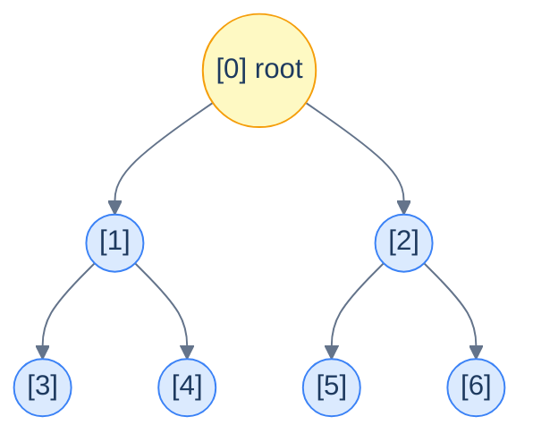
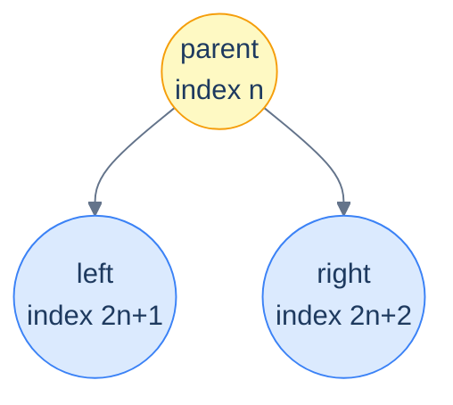
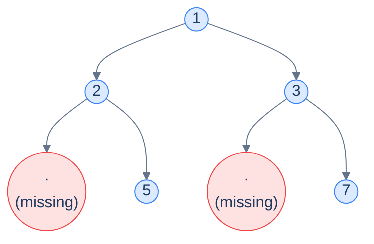
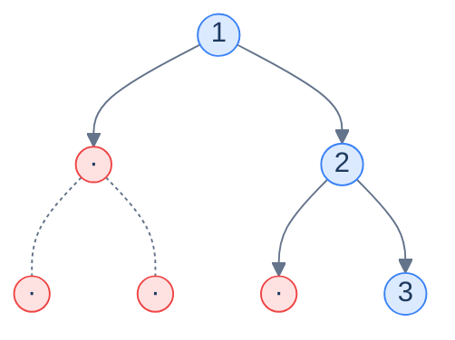

# 2. Array Implementation of Binary Trees

## The Hook

A binary tree feels like a *pointer-y* thing — every node has two child references, parents and children scatter across the heap, you traverse by *chasing pointers*. So it's surprising the first time you see it: **a binary tree can live entirely inside a flat array**, with no pointers, no nodes, no allocations. The trick is a single piece of arithmetic.

If you walk a complete binary tree level by level (root first, then left-to-right within each level) and number the nodes `0, 1, 2, 3, …`, a beautiful pattern emerges. The two children of the node at index `i` are *always* at indices `2i + 1` (left) and `2i + 2` (right). The parent of the node at index `i` is *always* at index `(i − 1) / 2` (integer division). No pointers — pure index arithmetic. Everything you'd reach with a pointer in the linked version, you reach in this version with one multiplication and one addition.

This is the layout that lives at the heart of **binary heaps** (the data structure behind every priority queue, every Dijkstra, every A*, every event-loop timer queue). It's also how segment trees, Fenwick trees, and most array-based tree libraries work under the hood. The cost of memory accesses is constant (no pointer dereference), the cache behaviour is excellent (contiguous memory), and a tree with `N` nodes consumes *exactly* `N` slots — no node-overhead, no fragmentation.

The catch: this elegant arithmetic only works when the tree is **complete** (every level full except possibly the last, filled left-to-right). For trees of *arbitrary* shape, you can either fake completeness with sentinel "dummy" slots — wasting memory — or fall back to the linked representation we'll cover next lesson. This lesson explores both: the clean case (complete trees), the index arithmetic that powers it, and the trade-offs you face when the tree isn't complete.

---

## Table of contents

1. [Understanding the problem](#understanding-the-problem)
2. [Numbering nodes — the arithmetic that makes it work](#numbering-nodes--the-arithmetic-that-makes-it-work)
3. [The node — there isn't one](#the-node--there-isnt-one)
4. [Supported operations](#supported-operations)
5. [Layout in memory](#layout-in-memory)
6. [Internal mechanics](#internal-mechanics)
7. [Navigating without pointers](#navigating-without-pointers)
8. [Generic binary trees — paying for incompleteness](#generic-binary-trees--paying-for-incompleteness)
9. [Working example](#working-example)
10. [Edge cases and pitfalls](#edge-cases-and-pitfalls)
11. [Production reality](#production-reality)
12. [Quiz](#quiz)
13. [Practice ladder](#practice-ladder)
14. [Further reading](#further-reading)
15. [Cross-links](#cross-links)
16. [Final takeaway](#final-takeaway)

***

# Understanding the Problem

A binary tree is a set of nodes plus the edges that connect them, and the edges are the hard part to store. The linked representation answers "where are my children?" by holding two pointers per node, so the structure is written down explicitly in memory. That works for any shape, but it costs two pointer-sized fields per node and scatters the nodes across the heap. The question this lesson answers is the opposite one: can the edges be left *unwritten* and recovered by computation instead?

The answer turns on one structural fact about a **complete binary tree** — every level full except possibly the last, which fills left-to-right. Number its nodes in level order, root first, and the position of every child and parent becomes a fixed function of an index:

- **the edges are not stored** — no pointers, no child fields, nothing recording who connects to whom
- **the edges are *derived*** — `2i + 1`, `2i + 2`, and `(i − 1) / 2` reconstruct every relationship on demand
- **the array slot is the node** — `arr[i]` holds the value, and the index carries the structure

To make this concrete: a complete tree storing `[1, 2, 3, 4, 5, 6, 7]` keeps all seven values in seven contiguous slots, and the fact that `4` and `5` are children of `2` is never recorded — it falls out of `2·1+1` and `2·1+2`. Reading `arr[3]` reaches a grandchild of the root with no pointer to follow.

So the key idea is: the array representation trades stored edges for computed ones, which removes all per-node pointer overhead — but the computation is only correct when the tree is complete, and that single precondition governs everything else in this lesson.

***

# Numbering nodes — the arithmetic that makes it work

Take a complete binary tree and number its nodes in **level order** — root at `0`, then its two children at `1, 2`, then *their* children at `3, 4, 5, 6`, and so on. Pure left-to-right, top-to-bottom enumeration.



<p align="center"><strong>Level-order numbering of a perfect binary tree of height 2 — seven nodes labelled <code>0..6</code>. Notice the pattern: the children of node <code>1</code> are <code>3</code> and <code>4</code>; the children of node <code>2</code> are <code>5</code> and <code>6</code>. Look closer — those are <code>2·1+1, 2·1+2</code> and <code>2·2+1, 2·2+2</code>. The pattern is exact.</strong></p>

The pattern generalises:

> **For the node at index `n` in a complete binary tree:**
>
> - **Left child**  → index `2n + 1`
> - **Right child** → index `2n + 2`
> - **Parent**     → index `(n − 1) / 2` (integer division)

Why does this work? Each level of a perfect binary tree is twice the size of the previous. Level `k` starts at index `2^k − 1` and contains `2^k` nodes. The `j`-th node on level `k` (counting from 0) has its two children at positions `2j` and `2j + 1` on level `k + 1`. Thread that bookkeeping through the cumulative offsets and you fall out with `2n + 1` and `2n + 2`. We'll spare the algebra; the formulas are cleaner than the proof.

> *Predict before reading on — what's the index of node <code>5</code>'s left child? Of node <code>5</code>'s parent?*
>
> Left child of `5`: `2·5 + 1 = 11`. Parent of `5`: `(5 − 1) / 2 = 2`. Both are O(1) — *one multiplication, one addition, no memory dereferences*. That's the entire performance argument for this representation.

***

# The node — there isn't one

In the linked-list implementation (next lesson), each node is a small object holding a value and two child pointers. In the array implementation, **nodes don't exist as a separate construct** — the array slot *is* the node. The value at `arr[i]` is the only thing that node "is". The structure of the tree (who's whose child, who's whose parent) is entirely *implicit* in the index, recovered on the fly with arithmetic.

This is why the array version has *zero per-node overhead*. A linked node typically eats 24 bytes (8 for the value, 8 for left, 8 for right) on a 64-bit system; an array slot eats 4–8 bytes for just the value. For a million-node integer tree, that's the difference between **24 MB** and **4 MB** — a 6× reduction, and that's before accounting for allocator metadata.

```d2
direction: right

ll: "Linked node — ~24 bytes" {
  grid-rows: 3
  grid-gap: 0
  v: "val (8B)"
  l: "left ptr (8B)"
  r: "right ptr (8B)"
}

ar: "Array slot — 4-8 bytes" {
  v: "val (4-8B)"
}
```

<p align="center"><strong>Per-node memory comparison — the array version is dramatically more compact because it eliminates the two child pointers. The structural information they carried is recovered through index arithmetic, not memory.</strong></p>

***

# Supported Operations

The array representation has no insert, no delete, no search of its own — those belong to whatever structure sits on top (a heap, a segment tree, a BST). What the representation provides is *navigation*: four index computations that replace the pointer dereferences of the linked version. Each is a fixed arithmetic expression, so each is `O(1)` time and `O(1)` space.

| Operation | Formula | Time | Space | What it returns |
|---|---|---|---|---|
| `root()` | `0` | `O(1)` | `O(1)` | The index of the root, always slot `0` |
| `left(i)` | `2·i + 1` | `O(1)` | `O(1)` | The index of the left child of node `i` |
| `right(i)` | `2·i + 2` | `O(1)` | `O(1)` | The index of the right child of node `i` |
| `parent(i)` | `(i − 1) / 2` | `O(1)` | `O(1)` | The index of the parent of node `i` (integer division) |
| `isLeaf(i)` | `2·i + 1 ≥ size` | `O(1)` | `O(1)` | Whether node `i` has no children |

The set is deliberately small, and one entry is the representation's quiet advantage. A linked binary tree stores only downward edges, so reaching a parent costs `O(h)` time for a tree of height `h` — you walk from the root — unless every node pays for an extra parent pointer. The array gives `parent(i)` for free as `(i − 1) / 2`. Using your example tree `[1, 2, 3, 4, 5, 6, 7]`, `parent(4)` returns `(4 − 1) / 2 = 1`, landing on node `2`, with no traversal and no extra field. So the core insight is: the four formulas are the entire navigation surface, they are all `O(1)`, and upward navigation — normally the expensive direction in a tree — costs exactly as much as downward navigation here.

***

# Layout in memory

What looks like a tree on paper is just a contiguous run of values in memory. Here's what a perfect height-2 tree storing `[1, 2, 3, 4, 5, 6, 7]` looks like physically:

```d2
arr: "array storage" {
  grid-columns: 7
  grid-gap: 0
  i0: |md
    **1**

    `[0]` root
  | {style.fill: "#fef9c3"; style.stroke: "#f59e0b"}
  i1: |md
    **2**

    `[1]` L of 1
  |
  i2: |md
    **3**

    `[2]` R of 1
  |
  i3: |md
    **4**

    `[3]` L of 2
  |
  i4: |md
    **5**

    `[4]` R of 2
  |
  i5: |md
    **6**

    `[5]` L of 3
  |
  i6: |md
    **7**

    `[6]` R of 3
  |
}
```

<p align="center"><strong>The complete tree <code>[1, 2, 3, 4, 5, 6, 7]</code> stored in seven contiguous slots. The "tree shape" is not stored anywhere — it's purely a way of <em>interpreting</em> the indices. Reading <code>arr[3]</code> gives you the left child of the root's left child without any pointer chasing.</strong></p>

## Cache behaviour

Modern CPUs read memory in *cache lines* of ~64 bytes — meaning when you fetch one value, you essentially get its 8-or-so neighbours for free. In an array tree, those neighbours are the next nodes in level order, which is *exactly* the order most traversals access them in. Linked trees, by contrast, scatter their nodes across the heap — every parent-to-child step is potentially a cache miss.

For real numerical workloads (heaps in scientific computing, segment trees in competitive programming), array-backed trees are routinely **5–10× faster** than equivalent linked structures despite identical asymptotic complexity. The cache wins.

***

# Internal Mechanics

The whole representation reduces to one rule: **the structure is implicit in the index, never stored**. A linked node records its edges in two pointer fields; an array tree records nothing about edges at all. Every parent-child relationship is reconstructed on demand from the level-order numbering, which means the only state the structure holds is the value array itself plus its `size`.

Two pieces of state carry everything:

- **the value array** — `arr[i]` holds the data for the node numbered `i` in level order
- **the size** — `size` is the count of occupied slots, and it is the *only* thing that distinguishes a present child from an absent one

The size field does the job that a `null` pointer does in the linked version. A linked node knows it has no left child because its `left` field is `null`; an array node knows it has no left child because `2i + 1 ≥ size` — the computed index falls off the end of the occupied region. To make this concrete: in the seven-slot tree `[1, 2, 3, 4, 5, 6, 7]`, node `3` computes a left child at index `7`, but `7 ≥ 7`, so node `3` is a leaf. Falling off the end *is* the array equivalent of hitting a `null`. So the core insight is: an array tree stores values and a size, recovers every edge by arithmetic on the index, and uses a single bounds check against `size` where the linked version uses pointer-equality against `null`.

***

# Navigating without pointers

Three operations cover all the navigation you'll ever need on an array-backed binary tree.

## Root

The root is *always* `arr[0]` — no special bookkeeping, no separate field. The tree is empty if the array is empty.

```text
root() → arr[0]   if size > 0, else "empty"
```

## Moving down — left and right children

```text
left(i)  → 2·i + 1
right(i) → 2·i + 2
```

A child *exists* if its computed index is in bounds — i.e. `< size`. A node has *no left child* when `2i + 1 >= size`; *no right child* when `2i + 2 >= size`. Falling off the end of the array *is* the array equivalent of hitting a `null` child pointer.



<p align="center"><strong>Parent at index <code>n</code>; children at <code>2n+1</code> and <code>2n+2</code>. The arithmetic is the entire navigation API.</strong></p>

## Moving up — parent

```text
parent(i) → (i − 1) / 2          (integer division)
```

The root (index 0) has no parent — by convention `parent(0)` returns a sentinel like `-1` or is simply not called.

This is one of the *quiet superpowers* of the array representation: linked binary trees, by default, only carry a downward pointer (parent → child). Going *up* requires either an extra parent pointer per node (more memory), or a traversal from the root (O(height) per query). The array representation gets parent navigation **for free** — `(i − 1) / 2` is O(1).

> **Why integer division?** Both children of node `n` (i.e., `2n+1` and `2n+2`) have parent `n`. Plug them in:
>
> - `(2n + 1 − 1) / 2 = 2n / 2 = n` ✓
> - `(2n + 2 − 1) / 2 = (2n + 1) / 2 = n` (with truncation toward zero) ✓
>
> The `/2` collapses both odd and even children to the same parent index. *Truncation* is the magic — `(2n + 1) / 2` would equal `n + 0.5` in real arithmetic; integer division floors it back to `n`. Use floored integer division (which is what `/` does in C/Java/JS for positive integers, and what `//` does in Python). Don't accidentally use `/` in Python — that's float division and will break the formula.

## Identifying leaves

A node is a *leaf* iff *both* of its computed child indices are out of bounds:

```text
isLeaf(i) → 2·i + 1 >= size
```

Why is checking just the *left* child enough? Because the left child has the *smaller* index — if the left child is out of bounds, the right child certainly is. (And in a complete tree, "missing left, present right" can never happen — the last level fills left-first.)

***

# Generic binary trees — paying for incompleteness

The array representation lives by one invariant: **the index pattern only works if the tree is complete**. The instant a node is missing somewhere in the middle, all the indices after it are *off by however many nodes are missing* — and the arithmetic falls apart.

The fix: pretend the tree *is* complete by inserting **dummy** (sentinel) values for the missing nodes. Pick a sentinel that can't appear as real data — `null`, `None`, `Optional.empty()`, or for integer trees a value like `-1` or `INT_MIN`. The arithmetic stays valid; you just check for the sentinel before using a value.



<p align="center"><strong>A non-complete tree — node 2 has only a right child, node 3 has only a right child. To shoehorn this into an array we insert <em>dummy slots</em> where the missing nodes "would have been"; the array ends up <code>[1, 2, 3, null, 5, null, 7]</code>. Algorithms that walk the tree must check for <code>null</code> before recursing into a child.</strong></p>

## Worst case — when sentinels eat your memory

For a *skew* tree (every node has just one child), the sentinel cost is catastrophic. A right-skew tree of `N` real nodes wedged into the array layout requires `2^N − 1` slots — *exponential* in the number of real nodes — because each level only has one node, but the array layout reserves space for a *full* level either way.



<p align="center"><strong>A right-skew tree with 3 real nodes (1, 2, 3) needs the array <code>[1, null, 2, null, null, null, 3]</code> — <strong>4 wasted slots out of 7</strong>. Add another level and the array grows to 15 slots for 4 real nodes. The wastage is <em>exponential</em> in the worst case.</strong></p>

> *Predict before reading on — for a left-skew tree of <em>10</em> real nodes, how many array slots would the array representation need?*
>
> `2^10 − 1 = 1023` slots, of which only 10 are real and 1013 are sentinels — about a *0.98% utilization rate*. This is exactly why we use the linked representation (next lesson) for trees of unpredictable shape, and reserve the array representation for cases where the tree's shape is known to be complete or near-complete (heaps, segment trees, etc.).

## When does the array representation make sense?

Use it when you can *guarantee* the tree is at least *near-complete*:

- **Binary heaps** — by definition complete, so the array layout has *zero* waste. This is why every priority queue in every language standard library uses an array internally.
- **Segment trees and Fenwick trees** — built on a fixed-size complete (or near-complete) shape. Array layout is mandatory for the index arithmetic that powers their O(log N) range queries.
- **Static lookup trees in numerical code** — when the tree shape is decided once at construction and never modified, even some waste is fine for the cache wins.

Avoid it when:

- The tree shape is *arbitrary or skewed* — the sentinel waste destroys the memory advantage.
- The tree must support *arbitrary insertions and deletions in the middle* — the array layout is rigid; insertions in non-leaf positions can require shifting half the array.
- You need *parent pointers stored explicitly* — though the array representation gives parent navigation for free, you can't attach extra metadata to the implicit edges.

For trees of arbitrary shape, the **linked-list representation** in the next lesson is the right tool. Most interview problems and most production code paths in real applications (DOM trees, syntax trees, BSTs in standard libraries) use the linked representation precisely because they need shape-flexibility more than they need cache locality.

***

# Working Example

Walking a few nodes by hand is the fastest way to make the four formulas reflex. Take the complete tree storing `[1, 2, 3, 4, 5, 6, 7]` — seven values in seven slots, `size = 7`, root at index `0`. The diagram below shows the index under each value, then the trace answers four questions using only arithmetic. No pointers are followed at any step.

```
index:   0    1    2    3    4    5    6
value:  [1] [2] [3] [4] [5] [6] [7]
tree:        1
           /   \
          2     3
         / \   / \
        4   5 6   7
```

**Children of node `1` (value `2`).** Left child is at `2·1 + 1 = 3`, so `arr[3] = 4`. Right child is at `2·1 + 2 = 4`, so `arr[4] = 5`. Both indices are below `size = 7`, so both children exist. Node `2` therefore has children `4` and `5` — confirmed without storing a single edge.

**Parent of node `5` (value `6`).** Parent is at `(5 − 1) / 2 = 2`, so `arr[2] = 3`. Cross-check the sibling: node `6` (value `7`) computes `(6 − 1) / 2 = 2` as well — integer division floors `5 / 2` and `4 / 2` both to `2`, collapsing the two children onto their shared parent. Upward navigation cost one subtraction, one division, zero memory walks.

**Is node `3` (value `4`) a leaf?** Its left child would sit at `2·3 + 1 = 7`. But `7 ≥ size`, so the index falls off the occupied region — node `3` has no children and *is* a leaf. The same test marks indices `3, 4, 5, 6` as leaves, exactly the bottom row.

**Reaching a grandchild from the root.** From root index `0`, the left child is `arr[1] = 2`, and *its* left child is `arr[2·1 + 1] = arr[3] = 4`. Two arithmetic steps descend two levels, each step `O(1)` time and `O(1)` space.

The four queries touched four different slots and never dereferenced a pointer, because there are none to dereference. So the core insight is: every navigation on an array tree is one closed-form index computation plus one array read, which is why the whole interface is `O(1)` time and `O(1)` space per call regardless of how many nodes the tree holds.

***

# Edge Cases and Pitfalls

Almost every array-tree bug traces to one root cause: forgetting that the arithmetic is only valid on a complete tree, or fumbling the integer division that powers `parent`. The representation is unforgiving — a single off-by-one in the index math silently returns the wrong node rather than crashing. Train your eye to ask, on every access, "is this index still inside `size`, and is my division flooring correctly?".

- **Using float division for `parent`.** The formula `(i − 1) / 2` requires *floored* integer division. In C, Java, and JavaScript, `/` on integers already truncates toward zero, which is correct for non-negative indices. In Python, `/` is float division — `(5 - 1) / 2` yields `2.0`, not `2`, and indexing with a float raises `TypeError`. Use `//` in Python. This is the single most common port bug between the two languages.
- **Calling `parent(0)` on the root.** The root has no parent, yet `(0 − 1) / 2` evaluates to `0` under truncating division (`-1 / 2 → 0` toward zero) or to `-1` under flooring division — either way the result is meaningless. Guard the root explicitly: `parent(i)` is only defined for `i > 0`, and most code returns a sentinel like `-1` for the root.
- **Forgetting the bounds check before reading a child.** `left(i)` and `right(i)` compute an index unconditionally; the index is only a *real* child if it is `< size`. Reading `arr[2i + 1]` without first testing `2i + 1 < size` either reads a stale or zero slot (silent wrong answer) or throws an out-of-bounds error. The computed index is a candidate, not a guarantee.
- **Assuming the array representation is always compact.** It is compact *only* for complete or near-complete trees. For a skewed tree of `N` real nodes the layout needs up to `2^N − 1` slots — `O(2^N)` space — because each sparse level still reserves room for a full level. Choosing this representation for an arbitrarily-shaped tree trades the linked version's `O(N)` space for exponential waste.
- **Checking only the left child for leaf-ness on a non-complete tree.** `isLeaf(i)` tests `2i + 1 ≥ size` and relies on the completeness invariant: the last level fills left-first, so a missing left child guarantees a missing right child. On a sentinel-padded non-complete tree this still holds at the array level, but you must additionally treat a sentinel value as "no node" — a slot inside `size` can still be a dummy, so reading it as real data corrupts the algorithm.
- **Mutating `size` without keeping the level-order layout intact.** The arithmetic assumes slots `0 … size−1` form a valid level-order numbering. Removing a node from the middle and decrementing `size` shifts every later node's implied position, breaking every parent and child relationship after the hole. Insertions and deletions must preserve the complete-tree shape (as a heap does by filling and removing only at the end), or the index formulas no longer describe the tree.

So the key idea is: the array representation buys `O(1)` navigation by encoding structure in the index, so every pitfall is really a question about the index — is it in bounds, is the division flooring, and does the layout still satisfy completeness. Keep those three honest and the arithmetic never lies.

***

# Production Reality

Array-backed binary trees show up wherever the tree shape is complete by construction and cache locality matters. The systems below are worth knowing by name.

**[A priority queue (binary heap)]** — uses **a complete binary tree stored in a flat array** — because a heap is complete by its own invariant, so the array layout wastes zero slots while giving `O(1)` parent/child navigation for the sift-up and sift-down that keep operations at `O(log N)` time.

**[Heapsort]** — uses **an in-place array-backed binary heap** — because building the heap and repeatedly extracting the max can run entirely inside the input array with `O(1)` extra space, which no pointer-based tree can match.

**[`java.util.PriorityQueue` and Python's `heapq`]** — uses **an array (`Object[]` / a Python `list`) interpreted as a complete binary tree** — because the standard-library priority queue needs predictable `O(log N)` push and pop with no per-node allocation, and the `2i+1 / 2i+2` indexing delivers exactly that.

**[Segment trees]** — uses **a fixed-size array indexed by `2i` and `2i+1`** — because range-sum and range-min queries need `O(log N)` time, and the implicit array layout lets a node reach its two children with one shift, avoiding the pointer chasing that would thrash the cache.

**[Fenwick (binary indexed) trees]** — uses **a flat array whose indices encode an implicit tree via bit tricks** — because prefix-sum updates and queries both run in `O(log N)` time over contiguous memory, with far lower constant factors than an explicit tree of nodes.

**[Event-loop timer wheels and OS schedulers]** — uses **a min-heap on an array keyed by expiry time** — because the next timer to fire is always the heap root at index `0`, and an array heap gives `O(log N)` insertion and `O(1)` peek with no allocation on the hot path.

***

# Quiz

Test your grip before moving on. Commit to an answer before revealing it.

**[Recall] Q: For a node at index `i` in a complete binary tree stored in an array, what are the indices of its left child, right child, and parent?**
Left child `2i + 1`, right child `2i + 2`, parent `(i − 1) / 2` using floored integer division.

**[Recall] Q: Where does the root live, and how do you tell whether a node at index `i` is a leaf?**
The root is always at index `0`, and node `i` is a leaf when its left child index `2i + 1` is `≥ size`, since the left child has the smaller index of the two.

**[Reasoning] Q: Why does checking only the left child (`2i + 1 ≥ size`) correctly identify a leaf, instead of having to check both children?**
The left child always has the smaller index, so if it is out of bounds the right child certainly is, and the completeness invariant guarantees the last level fills left-first, so "missing left, present right" can never occur.

**[Reasoning] Q: Why does the array representation give parent navigation for free while a linked binary tree usually does not?**
The parent index is a closed-form function `(i − 1) / 2` of the child's index, so it costs `O(1)` time, whereas a linked node stores only downward pointers and must either add a parent pointer per node or walk from the root in `O(h)` time.

**[Tradeoff] Q: When is the array representation the wrong choice, and what does the linked representation buy you instead?**
The array representation is wrong for arbitrarily-shaped or skewed trees, where sentinel padding costs up to `O(2^N)` space; the linked representation buys shape-flexibility at `O(N)` space for any shape, trading cache locality and the free parent formula for that freedom.

***

# Practice Ladder

Five problems to turn the level-order numbering into a reflex. They climb from "confirm the structure is complete" to "navigate it under pressure," and all five live in this chapter's pattern directories. Try each unaided; reach for the hint after ten minutes; do not peek at solutions until you have written something runnable.

| # | Problem | Pattern | Difficulty | Hint |
|---|---------|---------|------------|------|
| 1 | [Sum of Path](/cortex/data-structures-and-algorithms/trees-binary-tree-pattern-preorder-traversal-stateless-problems-sum-of-path) | [Preorder Traversal (Stateless)](/cortex/data-structures-and-algorithms/trees-binary-tree-pattern-preorder-traversal-stateless-pattern) | Easy | Carry a running sum down each branch; the same root-to-node descent that `2i+1 / 2i+2` would index, expressed as recursion. `O(n)` time, `O(h)` space for the call stack. |
| 2 | [Root-to-Leaf Path Sum Check](/cortex/data-structures-and-algorithms/trees-binary-tree-pattern-root-to-leaf-path-stateless-problems-root-to-leaf-path-sum-check) | [Root-to-Leaf Path (Stateless)](/cortex/data-structures-and-algorithms/trees-binary-tree-pattern-root-to-leaf-path-stateless-pattern) | Easy | A node is a leaf exactly when both children are absent — the array's `2i+1 ≥ size` test in linked form; subtract each value and check for `0` at a leaf. `O(n)` time, `O(h)` space. |
| 3 | [Level Sum](/cortex/data-structures-and-algorithms/trees-binary-tree-pattern-level-order-traversal-problems-level-sum) | [Level-Order Traversal](/cortex/data-structures-and-algorithms/trees-binary-tree-pattern-level-order-traversal-pattern) | Medium | Level order is exactly the array's index order; a queue reproduces it node by node. Sum each level as you pop it. `O(n)` time, `O(w)` space for the widest level. |
| 4 | [Complete Binary Tree Check](/cortex/data-structures-and-algorithms/trees-binary-tree-pattern-level-order-traversal-problems-complete-binary-tree-check) | [Level-Order Traversal](/cortex/data-structures-and-algorithms/trees-binary-tree-pattern-level-order-traversal-pattern) | Medium | This is the array representation's precondition made into a problem: a tree is complete iff no real node appears after the first gap in level order. `O(n)` time, `O(w)` space. |
| 5 | [Lowest Common Ancestor](/cortex/data-structures-and-algorithms/trees-binary-tree-pattern-lowest-common-ancestor-problems-lowest-common-ancestor) | [Lowest Common Ancestor](/cortex/data-structures-and-algorithms/trees-binary-tree-pattern-lowest-common-ancestor-pattern) | Medium | The same upward walk the `(i−1)/2` parent formula encodes — find where two descent paths converge. Recurse and return the node where the two targets split. `O(n)` time, `O(h)` space. |

Once these feel automatic, "number the nodes in level order" has stopped being a trick and become a reflex — and the traversal chapters can land their punches.

***

# Further Reading

Curated paths in, not a syllabus. Read in order of the annotation; come back for the rest when you need depth.

- **[Linked-List Implementation of Binary Trees](/cortex/data-structures-and-algorithms/trees-binary-tree-linked-list-implementation-of-binary-trees)**
  ★ Essential — the next lesson; the pointer-based representation that handles arbitrary shapes and backs every traversal and construction lesson in this chapter.
- **[Introduction to Binary Trees](/cortex/data-structures-and-algorithms/trees-binary-tree-introduction-to-binary-trees)**
  ★ Essential — the definitions this lesson assumes: complete, perfect, and balanced trees, and why completeness is the precondition the array layout depends on.
- **[CLRS — Chapter 6: Heapsort](https://mitpress.mit.edu/9780262046305/introduction-to-algorithms/)**
  ◆ Advanced — the canonical treatment of the array-backed binary heap, including the `PARENT`, `LEFT`, and `RIGHT` index macros and the in-place `O(n log n)` sort built on them.
- **[Segment Tree (cp-algorithms)](https://cp-algorithms.com/data_structures/segment_tree.html)**
  ◆ Advanced — how the `2i / 2i+1` array layout extends from heaps to `O(log n)` range queries, the most common production use of an implicit array tree beyond heaps.
- **[Python `heapq` documentation](https://docs.python.org/3/library/heapq.html)**
  → Reference — the behaviour and complexity guarantees of Python's array-backed binary heap, including the zero-based `2i+1 / 2i+2` indexing used internally.

***

# Cross-Links

**Prerequisites**

- [Introduction to Binary Trees](/cortex/data-structures-and-algorithms/trees-binary-tree-introduction-to-binary-trees) — the tree vocabulary this lesson builds on, especially what makes a tree complete versus perfect versus balanced.
- [Introduction to Arrays](/cortex/data-structures-and-algorithms/linear-structures-arrays-introduction) — the contiguous buffer and `O(1)` indexed access that make the index arithmetic constant time and cache-friendly.
- [Asymptotic Analysis](/cortex/data-structures-and-algorithms/foundations-asymptotic-analysis) — what `O(1)` navigation and `O(2^h)` worst-case space actually mean, and how to reason about the completeness tradeoff.

**What comes next**

- [Linked-List Implementation of Binary Trees](/cortex/data-structures-and-algorithms/trees-binary-tree-linked-list-implementation-of-binary-trees) — the same tree with the tradeoff flipped: per-node `left` / `right` pointers handle any shape at `O(N)` space, losing the free parent formula and the cache locality.
- [Recursive Traversals in Binary Trees](/cortex/data-structures-and-algorithms/trees-binary-tree-recursive-traversals-in-binary-trees) — preorder, inorder, and postorder over the linked representation, the foundation every pattern in this chapter walks on.

***

## Final Takeaway

The array representation is the cleanest expression of binary-tree-as-data: pure index arithmetic, zero pointer overhead, perfect cache locality. It is also the most *constrained* representation — only complete or near-complete trees pay off. Three things to walk away with:

1. **Core mechanic:** number the nodes of a complete binary tree in level order and store the values in a flat array, so the children of index `i` live at `2i + 1` and `2i + 2` and the parent at `(i − 1) / 2`, giving `O(1)`-time, `O(1)`-space navigation with no pointers stored.
2. **Dominant tradeoff:** you gain zero per-node overhead, free upward navigation, and cache-friendly contiguous memory; you give up shape-flexibility, since a non-complete tree must pad missing nodes with sentinels, costing up to `O(2^N)` space for a skewed tree against the linked version's flat `O(N)`.
3. **One thing to remember:** the structure is never stored — it is computed from the index, and the whole representation works only as far as the completeness invariant holds, which is why heaps and segment trees adopt it and arbitrarily-shaped trees do not.

> *Coming up — the next lesson covers the **linked-list implementation**, which trades the index arithmetic for a per-node <code>left</code>/<code>right</code> pointer. Less compact, less cache-friendly, but flexible enough to store arbitrarily-shaped trees without paying any sentinel tax. That representation is what every traversal, construction, and pattern lesson in the rest of the chapter will use.*
