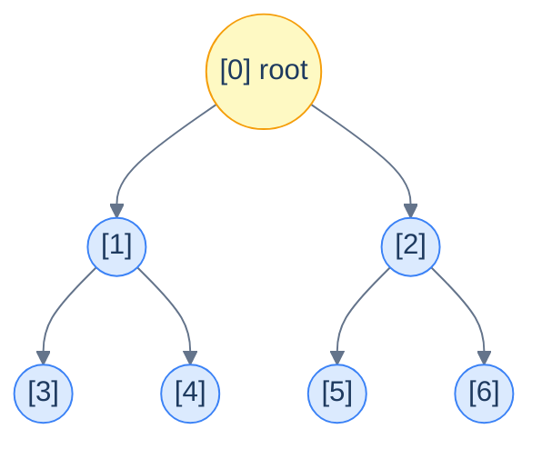
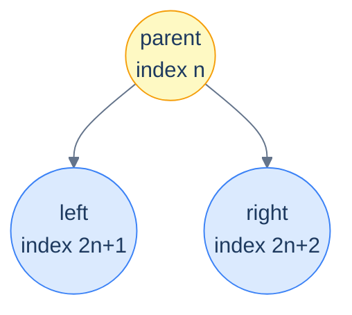
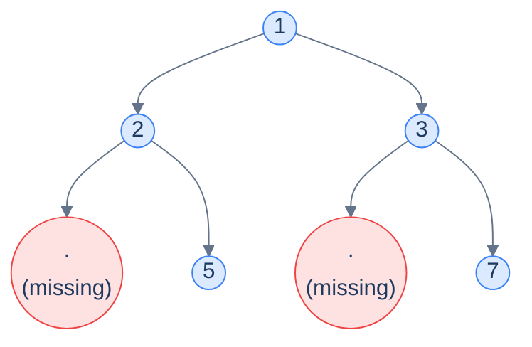
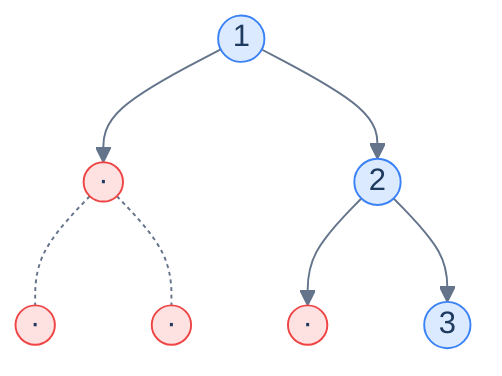

# 2. Array Implementation of Binary Trees

## The Hook

A binary tree feels like a *pointer-y* thing — every node has two child references, parents and children scatter across the heap, you traverse by *chasing pointers*. So it's surprising the first time you see it: **a binary tree can live entirely inside a flat array**, with no pointers, no nodes, no allocations. The trick is a single piece of arithmetic.

If you walk a complete binary tree level by level (root first, then left-to-right within each level) and number the nodes `0, 1, 2, 3, …`, a beautiful pattern emerges. The two children of the node at index `i` are *always* at indices `2i + 1` (left) and `2i + 2` (right). The parent of the node at index `i` is *always* at index `(i − 1) / 2` (integer division). No pointers — pure index arithmetic. Everything you'd reach with a pointer in the linked version, you reach in this version with one multiplication and one addition.

This is the layout that lives at the heart of **binary heaps** (the data structure behind every priority queue, every Dijkstra, every A*, every event-loop timer queue). It's also how segment trees, Fenwick trees, and most array-based tree libraries work under the hood. The cost of memory accesses is constant (no pointer dereference), the cache behaviour is excellent (contiguous memory), and a tree with `N` nodes consumes *exactly* `N` slots — no node-overhead, no fragmentation.

The catch: this elegant arithmetic only works when the tree is **complete** (every level full except possibly the last, filled left-to-right). For trees of *arbitrary* shape, you can either fake completeness with sentinel "dummy" slots — wasting memory — or fall back to the linked representation we'll cover next lesson. This lesson explores both: the clean case (complete trees), the index arithmetic that powers it, and the trade-offs you face when the tree isn't complete.

---

## Table of contents

- [2. Array Implementation of Binary Trees](#2-array-implementation-of-binary-trees)
  - [The Hook](#the-hook)
  - [Table of contents](#table-of-contents)
- [Numbering nodes — the arithmetic that makes it work](#numbering-nodes--the-arithmetic-that-makes-it-work)
- [The node — there isn't one](#the-node--there-isnt-one)
- [Layout in memory](#layout-in-memory)
  - [Cache behaviour](#cache-behaviour)
- [Navigating without pointers](#navigating-without-pointers)
  - [Root](#root)
  - [Moving down — left and right children](#moving-down--left-and-right-children)
  - [Moving up — parent](#moving-up--parent)
  - [Identifying leaves](#identifying-leaves)
- [Generic binary trees — paying for incompleteness](#generic-binary-trees--paying-for-incompleteness)
  - [Worst case — when sentinels eat your memory](#worst-case--when-sentinels-eat-your-memory)
  - [When does the array representation make sense?](#when-does-the-array-representation-make-sense)
  - [Final Takeaway](#final-takeaway)

***

# Numbering nodes — the arithmetic that makes it work

Take a complete binary tree and number its nodes in **level order** — root at `0`, then its two children at `1, 2`, then *their* children at `3, 4, 5, 6`, and so on. Pure left-to-right, top-to-bottom enumeration.



<p align="center"><strong>Level-order numbering of a perfect binary tree of height 2 — seven nodes labelled <code>0..6</code>. Notice the pattern: the children of node <code>1</code> are <code>3</code> and <code>4</code>; the children of node <code>2</code> are <code>5</code> and <code>6</code>. Look closer — those are <code>2·1+1, 2·1+2</code> and <code>2·2+1, 2·2+2</code>. The pattern is exact.</strong></p>

The pattern generalises:

> **For the node at index `n` in a complete binary tree:**
>
> - **Left child**  → index `2n + 1`
> - **Right child** → index `2n + 2`
> - **Parent**     → index `(n − 1) / 2` (integer division)

Why does this work? Each level of a perfect binary tree is twice the size of the previous. Level `k` starts at index `2^k − 1` and contains `2^k` nodes. The `j`-th node on level `k` (counting from 0) has its two children at positions `2j` and `2j + 1` on level `k + 1`. Thread that bookkeeping through the cumulative offsets and you fall out with `2n + 1` and `2n + 2`. We'll spare the algebra; the formulas are cleaner than the proof.

> *Predict before reading on — what's the index of node <code>5</code>'s left child? Of node <code>5</code>'s parent?*
>
> Left child of `5`: `2·5 + 1 = 11`. Parent of `5`: `(5 − 1) / 2 = 2`. Both are O(1) — *one multiplication, one addition, no memory dereferences*. That's the entire performance argument for this representation.

***

# The node — there isn't one

In the linked-list implementation (next lesson), each node is a small object holding a value and two child pointers. In the array implementation, **nodes don't exist as a separate construct** — the array slot *is* the node. The value at `arr[i]` is the only thing that node "is". The structure of the tree (who's whose child, who's whose parent) is entirely *implicit* in the index, recovered on the fly with arithmetic.

This is why the array version has *zero per-node overhead*. A linked node typically eats 24 bytes (8 for the value, 8 for left, 8 for right) on a 64-bit system; an array slot eats 4–8 bytes for just the value. For a million-node integer tree, that's the difference between **24 MB** and **4 MB** — a 6× reduction, and that's before accounting for allocator metadata.

```d2
direction: right

ll: "Linked node — ~24 bytes" {
  grid-rows: 3
  grid-gap: 0
  v: "val (8B)"
  l: "left ptr (8B)"
  r: "right ptr (8B)"
}

ar: "Array slot — 4-8 bytes" {
  v: "val (4-8B)"
}
```

<p align="center"><strong>Per-node memory comparison — the array version is dramatically more compact because it eliminates the two child pointers. The structural information they carried is recovered through index arithmetic, not memory.</strong></p>

***

# Layout in memory

What looks like a tree on paper is just a contiguous run of values in memory. Here's what a perfect height-2 tree storing `[1, 2, 3, 4, 5, 6, 7]` looks like physically:

```d2
arr: "array storage" {
  grid-columns: 7
  grid-gap: 0
  i0: |md
    **1**

    `[0]` root
  | {style.fill: "#fef9c3"; style.stroke: "#f59e0b"}
  i1: |md
    **2**

    `[1]` L of 1
  |
  i2: |md
    **3**

    `[2]` R of 1
  |
  i3: |md
    **4**

    `[3]` L of 2
  |
  i4: |md
    **5**

    `[4]` R of 2
  |
  i5: |md
    **6**

    `[5]` L of 3
  |
  i6: |md
    **7**

    `[6]` R of 3
  |
}
```

<p align="center"><strong>The complete tree <code>[1, 2, 3, 4, 5, 6, 7]</code> stored in seven contiguous slots. The "tree shape" is not stored anywhere — it's purely a way of <em>interpreting</em> the indices. Reading <code>arr[3]</code> gives you the left child of the root's left child without any pointer chasing.</strong></p>

## Cache behaviour

Modern CPUs read memory in *cache lines* of ~64 bytes — meaning when you fetch one value, you essentially get its 8-or-so neighbours for free. In an array tree, those neighbours are the next nodes in level order, which is *exactly* the order most traversals access them in. Linked trees, by contrast, scatter their nodes across the heap — every parent-to-child step is potentially a cache miss.

For real numerical workloads (heaps in scientific computing, segment trees in competitive programming), array-backed trees are routinely **5–10× faster** than equivalent linked structures despite identical asymptotic complexity. The cache wins.

***

# Navigating without pointers

Three operations cover all the navigation you'll ever need on an array-backed binary tree.

## Root

The root is *always* `arr[0]` — no special bookkeeping, no separate field. The tree is empty if the array is empty.

```text
root() → arr[0]   if size > 0, else "empty"
```

## Moving down — left and right children

```text
left(i)  → 2·i + 1
right(i) → 2·i + 2
```

A child *exists* if its computed index is in bounds — i.e. `< size`. A node has *no left child* when `2i + 1 >= size`; *no right child* when `2i + 2 >= size`. Falling off the end of the array *is* the array equivalent of hitting a `null` child pointer.



<p align="center"><strong>Parent at index <code>n</code>; children at <code>2n+1</code> and <code>2n+2</code>. The arithmetic is the entire navigation API.</strong></p>

## Moving up — parent

```text
parent(i) → (i − 1) / 2          (integer division)
```

The root (index 0) has no parent — by convention `parent(0)` returns a sentinel like `-1` or is simply not called.

This is one of the *quiet superpowers* of the array representation: linked binary trees, by default, only carry a downward pointer (parent → child). Going *up* requires either an extra parent pointer per node (more memory), or a traversal from the root (O(height) per query). The array representation gets parent navigation **for free** — `(i − 1) / 2` is O(1).

> **Why integer division?** Both children of node `n` (i.e., `2n+1` and `2n+2`) have parent `n`. Plug them in:
>
> - `(2n + 1 − 1) / 2 = 2n / 2 = n` ✓
> - `(2n + 2 − 1) / 2 = (2n + 1) / 2 = n` (with truncation toward zero) ✓
>
> The `/2` collapses both odd and even children to the same parent index. *Truncation* is the magic — `(2n + 1) / 2` would equal `n + 0.5` in real arithmetic; integer division floors it back to `n`. Use floored integer division (which is what `/` does in C/Java/JS for positive integers, and what `//` does in Python). Don't accidentally use `/` in Python — that's float division and will break the formula.

## Identifying leaves

A node is a *leaf* iff *both* of its computed child indices are out of bounds:

```text
isLeaf(i) → 2·i + 1 >= size
```

Why is checking just the *left* child enough? Because the left child has the *smaller* index — if the left child is out of bounds, the right child certainly is. (And in a complete tree, "missing left, present right" can never happen — the last level fills left-first.)

***

# Generic binary trees — paying for incompleteness

The array representation lives by one invariant: **the index pattern only works if the tree is complete**. The instant a node is missing somewhere in the middle, all the indices after it are *off by however many nodes are missing* — and the arithmetic falls apart.

The fix: pretend the tree *is* complete by inserting **dummy** (sentinel) values for the missing nodes. Pick a sentinel that can't appear as real data — `null`, `None`, `Optional.empty()`, or for integer trees a value like `-1` or `INT_MIN`. The arithmetic stays valid; you just check for the sentinel before using a value.



<p align="center"><strong>A non-complete tree — node 2 has only a right child, node 3 has only a right child. To shoehorn this into an array we insert <em>dummy slots</em> where the missing nodes "would have been"; the array ends up <code>[1, 2, 3, null, 5, null, 7]</code>. Algorithms that walk the tree must check for <code>null</code> before recursing into a child.</strong></p>

## Worst case — when sentinels eat your memory

For a *skew* tree (every node has just one child), the sentinel cost is catastrophic. A right-skew tree of `N` real nodes wedged into the array layout requires `2^N − 1` slots — *exponential* in the number of real nodes — because each level only has one node, but the array layout reserves space for a *full* level either way.



<p align="center"><strong>A right-skew tree with 3 real nodes (1, 2, 3) needs the array <code>[1, null, 2, null, null, null, 3]</code> — <strong>4 wasted slots out of 7</strong>. Add another level and the array grows to 15 slots for 4 real nodes. The wastage is <em>exponential</em> in the worst case.</strong></p>

> *Predict before reading on — for a left-skew tree of <em>10</em> real nodes, how many array slots would the array representation need?*
>
> `2^10 − 1 = 1023` slots, of which only 10 are real and 1013 are sentinels — about a *0.98% utilization rate*. This is exactly why we use the linked representation (next lesson) for trees of unpredictable shape, and reserve the array representation for cases where the tree's shape is known to be complete or near-complete (heaps, segment trees, etc.).

## When does the array representation make sense?

Use it when you can *guarantee* the tree is at least *near-complete*:

- **Binary heaps** — by definition complete, so the array layout has *zero* waste. This is why every priority queue in every language standard library uses an array internally.
- **Segment trees and Fenwick trees** — built on a fixed-size complete (or near-complete) shape. Array layout is mandatory for the index arithmetic that powers their O(log N) range queries.
- **Static lookup trees in numerical code** — when the tree shape is decided once at construction and never modified, even some waste is fine for the cache wins.

Avoid it when:

- The tree shape is *arbitrary or skewed* — the sentinel waste destroys the memory advantage.
- The tree must support *arbitrary insertions and deletions in the middle* — the array layout is rigid; insertions in non-leaf positions can require shifting half the array.
- You need *parent pointers stored explicitly* — though the array representation gives parent navigation for free, you can't attach extra metadata to the implicit edges.

For trees of arbitrary shape, the **linked-list representation** in the next lesson is the right tool. Most interview problems and most production code paths in real applications (DOM trees, syntax trees, BSTs in standard libraries) use the linked representation precisely because they need shape-flexibility more than they need cache locality.

***

## Final Takeaway

The array representation is the cleanest expression of binary-tree-as-data: pure index arithmetic, zero pointer overhead, perfect cache locality. It's also the most *constrained* representation — only complete (or near-complete) trees pay off. Three things to walk away with:

1. **`2i+1`, `2i+2`, `(i−1)/2` is the entire navigation API.** Memorise these three formulas. They appear in every heap implementation, every segment tree, every priority queue, every iterative tree algorithm that needs to address children by index. The arithmetic is *the* idea behind array-backed trees.
2. **Cost is paid in completeness, not nodes.** A linked tree of `N` nodes uses `O(N)` memory regardless of shape; an array tree of `N` *real* nodes uses `O(2^h)` memory where `h` is the tree's height. Balanced and complete trees pay near-`O(N)`; skew trees pay `O(2^N)`. Match the representation to the workload.
3. **Heaps are the killer app.** Every priority queue you've ever used — heaps in `std::priority_queue`, `java.util.PriorityQueue`, Python's `heapq`, the timer wheels in event loops, Dijkstra's frontier in pathfinding — uses an array-backed binary tree as its internal storage. The array representation is the *enabling technology* for one of the most-used data structures in computing.

> *Coming up — the next lesson covers the **linked-list implementation**, which trades the index arithmetic for a per-node <code>left</code>/<code>right</code> pointer. Less compact, less cache-friendly, but flexible enough to store arbitrarily-shaped trees without paying any sentinel tax. That representation is what every traversal, construction, and pattern lesson in the rest of the chapter will use.*

<!-- ============================================== -->
<!-- SWEEP 2 — missing sections (placeholders only) -->
<!-- ============================================== -->

<!-- TODO: Understanding the Problem — missing, needs to be written -->
<!--       Guidance: frame the gap the structure/algorithm fills -->

<!-- TODO: Supported Operations — missing, needs to be written -->
<!--       Guidance: table: operation / time / notes -->

<!-- TODO: Internal Mechanics — missing, needs to be written -->
<!--       Guidance: how it actually works under the hood -->

<!-- TODO: Working Example — missing, needs to be written -->
<!--       Guidance: one fully worked end-to-end example -->

<!-- TODO: Edge Cases & Pitfalls — missing, needs to be written -->
<!--       Guidance: bulleted list of gotchas -->

<!-- TODO: Production Reality — missing, needs to be written -->
<!--       Guidance: 4–6 entries: System — uses X — because Y -->

<!-- TODO: Quiz — missing, needs to be written -->
<!--       Guidance: 3–5 questions, each labeled [Recall]/[Reasoning]/[Tradeoff] -->

<!-- TODO: Practice Ladder — missing, needs to be written -->
<!--       Guidance: table: 5 links into pattern problems + hints -->

<!-- TODO: Further Reading — missing, needs to be written -->
<!--       Guidance: annotated: ★ Essential / ◆ Advanced / → Reference -->

<!-- TODO: Cross-Links — missing, needs to be written -->
<!--       Guidance: Prerequisites | What comes next -->
