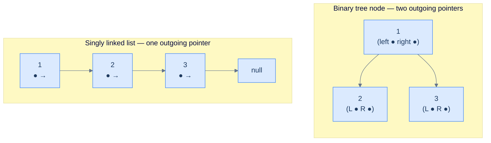
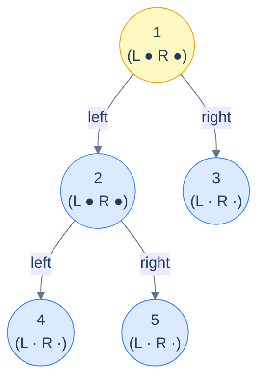
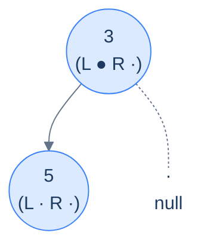
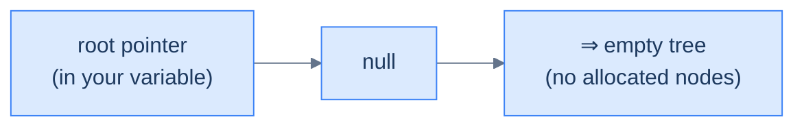

# 3. Linked-List Implementation of Binary Trees

## The Hook

Take a singly linked list. Each node holds a value and a `next` pointer. Now imagine that node had **two** outgoing pointers instead of one — a `left` and a `right`. Connect a few of those nodes together, and you've just built the bones of a binary tree.

That's the entire idea behind the linked-list (or "linked-node") representation: **a binary tree is a doubly-branching linked list**. Each node owns its own value, plus references to up-to-two child nodes. Missing children are marked with `null`. The whole tree is held together by a single reference to the *root* node — chase the pointers from there and you can reach every other node.

This representation is the *workhorse* of binary trees. Every textbook problem on LeetCode, every parser's AST, every DOM tree in every browser, every BST in every standard library — they all use this layout. Why? Because it's *shape-agnostic*: a skew tree of a million nodes uses exactly the same per-node memory as a perfect tree of a million nodes — `O(N)` either way. The array representation we just saw is dramatically more compact when the tree is *complete*, but it bleeds memory exponentially when the tree is unbalanced. The linked representation never bleeds — it just pays the constant per-node pointer overhead and gets on with life.

The trade-offs are predictable: **per-node memory is higher** (two extra pointers per node), **cache locality is worse** (each node is its own heap allocation, scattered across RAM), and **going from child to parent is O(height)** unless you also store a parent pointer. In return, you get *unlimited shape freedom* — you can sculpt the tree into any binary shape you want, insert and remove nodes anywhere, and never worry about index arithmetic.

This lesson defines the `TreeNode` type in Python and Java and shows how a tree assembles from nodes. Every lesson that follows in this chapter — recursive and iterative traversals, construction, insertion, all 11 patterns, the practice problems — uses the type defined here as its starting point. Get it right once and the rest of the chapter doesn't have to repeat it.

---

## Table of contents

1. [From singly linked list to binary tree](#from-singly-linked-list-to-binary-tree)
2. [Anatomy of a TreeNode](#anatomy-of-a-treenode)
3. [Defining TreeNode in Python and Java](#defining-treenode-in-python-and-java)
4. [Assembling a tree from nodes](#assembling-a-tree-from-nodes)
5. [Memory layout — what it actually looks like](#memory-layout--what-it-actually-looks-like)
6. [The role of `null` and the root pointer](#the-role-of-null-and-the-root-pointer)
7. [Understanding the problem](#understanding-the-problem)
8. [Supported operations](#supported-operations)
9. [Internal mechanics](#internal-mechanics)
10. [Working example](#working-example)
11. [Edge cases and pitfalls](#edge-cases-and-pitfalls)
12. [Production reality](#production-reality)
13. [Quiz](#quiz)
14. [Practice ladder](#practice-ladder)
15. [Further reading](#further-reading)
16. [Cross-links](#cross-links)
17. [Final takeaway](#final-takeaway)

***

# From singly linked list to binary tree

Recall the singly linked list node from earlier in the course:

```text
ListNode { val, next }
```

`val` holds the data; `next` points to the *one* successor (or `null` if it's the tail). Because there's only one outgoing pointer, the data structure is one-dimensional — a single line of nodes.

A binary tree node is the same idea, generalised to *two* outgoing pointers:

```text
TreeNode { val, left, right }
```

That single change — one pointer to two — is enough to turn a flat list into a *two-dimensional* hierarchical structure. Now each node has *two* possible successors, and following one or the other branches the path you're on. Recurse this branching and you grow a tree.



<p align="center"><strong>The promotion from list to tree — the only structural change is doubling the outgoing pointers per node. The two child pointers are conventionally named <code>left</code> and <code>right</code>, and that left/right distinction is part of the tree's identity (not just a layout detail).</strong></p>

***

# Anatomy of a TreeNode

A `TreeNode` has exactly three pieces:

| Field    | Type                       | Purpose                                                |
|----------|----------------------------|--------------------------------------------------------|
| `val`    | the data type of the tree  | The value this node carries.                           |
| `left`   | reference to a `TreeNode`  | The left child (or `null` if absent).                  |
| `right`  | reference to a `TreeNode`  | The right child (or `null` if absent).                 |

```d2
n: TreeNode {
  grid-columns: 3
  grid-gap: 0
  l: "left (●)"
  v: "val"
  r: "right (●)"
}
```

<p align="center"><strong>The standard layout of a binary-tree node — value flanked by two child references. <code>null</code> in either slot means "no child on that side".</strong></p>

> **Why two pointers, even when only one child exists?** Because *which* child matters. A node with only a left child is a *different* tree from a node with only a right child — and many algorithms (inorder traversal, BST insertion, expression trees) depend on that distinction. The unused slot holds `null` rather than being omitted, so the slot's *position* tells you which side the existing child lives on.

***

# Defining TreeNode in Python and Java

Most of the rest of this chapter assumes the type definitions below. Each version exposes the same three fields and provides a small constructor. We follow the LeetCode-style convention used across the chapter: optional left/right that default to `null`.


```python run viz=binary-tree viz-root=root
class TreeNode:
    def __init__(self, val: int = 0, left: 'TreeNode | None' = None, right: 'TreeNode | None' = None):
        self.val   = val
        self.left  = left
        self.right = right

# Build a small tree:
#       1
#      / \
#     2   3
root = TreeNode(1, TreeNode(2), TreeNode(3))
print(root.val, root.left.val, root.right.val)   # 1 2 3
```

```java run viz=binary-tree viz-root=root
public class Main {
    static class TreeNode {
        int      val;
        TreeNode left, right;
        TreeNode()                                          { }
        TreeNode(int val)                                   { this.val = val; }
        TreeNode(int val, TreeNode left, TreeNode right)    { this.val = val; this.left = left; this.right = right; }
    }
    public static void main(String[] args) {
        TreeNode root = new TreeNode(1, new TreeNode(2), new TreeNode(3));
        System.out.println(root.val + " " + root.left.val + " " + root.right.val);
    }
}
```


> **About Rust's `Option<Box<TreeNode>>`** — Rust forbids recursively-sized structs without indirection (the compiler can't compute "size of `TreeNode`" if it contains another `TreeNode` directly). `Box` provides the indirection by storing the child on the heap; `Option` provides the `null`-vs-`Some(...)` distinction. The combination is verbose to type but enforces *correctness by construction* — there's no way to accidentally dereference a null pointer or share ownership between parents.

***

# Assembling a tree from nodes

The constructor only creates *one* node at a time. To build a tree, allocate the nodes individually and stitch them together by assigning `left`/`right` references. Here's how to construct this tree:

```text
        1
       / \
      2   3
     / \
    4   5
```

Step by step:

```python
# 1. allocate the leaves first (no children to wire)
n4 = TreeNode(4)
n5 = TreeNode(5)
n3 = TreeNode(3)

# 2. allocate the internal node and connect its children
n2 = TreeNode(2)
n2.left  = n4
n2.right = n5

# 3. allocate the root and connect it
root = TreeNode(1)
root.left  = n2
root.right = n3
```

The order doesn't matter (you could build top-down too — create `root` first, then assign children later). What *does* matter is that you only **hold on to the root** — every other node is reachable from there by following pointers, so the root is the single source of truth for the entire tree.



<p align="center"><strong>The wired-up tree — the root node holds the entire tree's identity. Lose the variable holding <code>root</code> and the whole tree becomes unreachable garbage. Every algorithm in the rest of this chapter starts from this root reference.</strong></p>

***

# Memory layout — what it actually looks like

The diagrams above show the tree as a clean hierarchy. *In RAM*, those nodes are scattered wherever the allocator decided to put them. The "tree shape" exists only in the pointers connecting the nodes, not in the addresses themselves.

```d2
direction: down

heap: "Heap memory (random addresses)" {
  grid-rows: 5
  grid-gap: 0
  n5: |md
    **@0x4180**

    val: 5

    L: null

    R: null
  |
  n1: |md
    **@0x4200**

    val: 1

    L: 0x4290

    R: 0x4310
  |
  n2: |md
    **@0x4290**

    val: 2

    L: 0x4250

    R: 0x4180
  |
  n4: |md
    **@0x4250**

    val: 4

    L: null

    R: null
  |
  n3: |md
    **@0x4310**

    val: 3

    L: null

    R: null
  |
}

heap.n1 -> heap.n2: "L" {style.stroke-dash: 3}
heap.n1 -> heap.n3: "R" {style.stroke-dash: 3}
heap.n2 -> heap.n4: "L" {style.stroke-dash: 3}
heap.n2 -> heap.n5: "R" {style.stroke-dash: 3}
```

<p align="center"><strong>The tree from the previous diagram, as it actually lives in memory — five nodes at unrelated addresses, the structure encoded entirely in the pointer fields. The "tree shape" exists only when you follow the pointers; from RAM's point of view, this is just five small heap blocks.</strong></p>

This non-locality is the *cost* the linked representation pays for its flexibility. Each parent-to-child step is potentially a cache miss — the CPU's prefetcher can't predict where the next node lives. For workloads dominated by tree *navigation* (lots of traversals, lots of lookups), this can be a meaningful slowdown vs. the array layout from the previous lesson. For workloads dominated by *structural mutation* (insertions, deletions, restructuring), the linked layout's flexibility wins.

***

# The role of `null` and the root pointer

Two `null`s play different roles in a binary tree. Don't confuse them.

## `null` child means "no child here"

A leaf node is *itself* a real, allocated node — it just has both `left` and `right` set to `null`. A node with only a left child has `right = null`. The presence of a `null` in a child slot tells *the caller* "stop recursing on this side".



<p align="center"><strong>A node with only one child — the absent <code>right</code> slot is <code>null</code>. The base case of every recursive tree algorithm is <em>checking for and handling <code>null</code> children</em>; getting that right is half the battle.</strong></p>

## `null` *root* means "empty tree"

Distinct from a `null` child slot, a `null` *root* means the tree has no nodes at all. Every algorithm that operates on a tree must handle this corner case — usually by returning early (size = 0, traversal = empty list, etc.) when the root is `null`.



<p align="center"><strong>An empty tree is represented by a <code>null</code> root reference. There are zero allocated nodes; nothing to walk; every algorithm must short-circuit when it sees this.</strong></p>

> *Predict before reading on — what should <code>height(null)</code> return?*
>
> Conventionally, **`-1`**. The reasoning: height counts edges, the height of a single-node tree is 0 (the root is also a leaf), and the recursive formula `height(n) = 1 + max(height(n.left), height(n.right))` works out to `0 = 1 + max(-1, -1)`. Defining `height(null) = -1` makes the recursion clean and uniform — no special case for leaves. (Some textbooks use `0` for empty and `1` for a single node — same idea, off-by-one shift. Pick one convention and stick to it.)

***

# Understanding the Problem

A binary tree is easy to draw and impossible to draw *directly* into memory — RAM is a flat, one-dimensional array of bytes, and a tree is a two-dimensional hierarchy. The representation question is how to encode "parent points to two children" in that flat space. The linked-node design answers it the same way a singly linked list encodes "node points to one successor": with references.

Two encodings dominate, and they make opposite bets:

- **Array representation** — store the tree level by level in a flat array, where a node at index `i` finds its children at `2i+1` and `2i+2`. Compact for *complete* trees, but a single deep skew wastes exponential space on the gaps.
- **Linked-node representation** — give each node its own heap allocation plus two child references, and connect them by assigning those references. Pays a fixed per-node pointer cost but never wastes space on missing nodes.

To make this concrete: a right-leaning chain of `1000` nodes costs `1000` allocations under the linked design — `O(N)` space. The array design needs roughly `2^1000` slots for the same chain, almost all of them empty. So the key idea is: the linked representation trades cache locality and per-node memory for total shape freedom, which is why it backs every general-purpose binary tree of unknown shape.

***

# Supported Operations

A `TreeNode` is a storage primitive, not a full data structure with a service interface — the rich operations (search, insert, traverse) belong to the lessons that build *on top of* this type. What the node layout supports directly is a tiny set of `O(1)` reference moves, and those moves are the building blocks every later algorithm composes:

| Operation | Time | Space | What it does |
|---|---|---|---|
| Construct a node | `O(1)` | `O(1)` | Allocate one `TreeNode`; set `val`, default `left`/`right` to `null` |
| Read a value | `O(1)` | `O(1)` | Return `node.val` |
| Read a child | `O(1)` | `O(1)` | Follow `node.left` or `node.right` (may be `null`) |
| Attach a child | `O(1)` | `O(1)` | Assign `node.left = child` or `node.right = child` |
| Detach a child | `O(1)` | `O(1)` | Set `node.left = null` or `node.right = null` |

Each operation touches one node and at most one reference, so none of them scale with the size of the tree. To make this concrete: building the five-node tree above is five constructions plus four attachments — nine `O(1)` steps, `O(N)` in total for `N` nodes. So the core insight is: every tree algorithm in this chapter is a *choreography* of these constant-time moves, and a step that costs more than `O(1)` (finding a parent, computing height) is doing extra traversal on top of them, not a richer primitive.

***

# Internal Mechanics

The node layout has two consequences worth stating as rules, both demonstrated in the sections above. The first is *where the structure lives*: not in the node addresses, but in the reference fields connecting them. The second is *what reachability depends on*: a single root reference, from which the whole tree is walkable.

- **The shape is in the references.** As the memory-layout diagram shows, the five nodes sit at unrelated heap addresses; what makes them a tree is the disciplined `left`/`right` linkage, not their physical order.
- **Reachability hangs off the root.** Every non-root node is reachable only through some parent's `left` or `right` field. The root has no parent, so its reference must be held in a variable — lose it and the whole tree becomes unreachable garbage.

To make this concrete: swap two nodes' heap addresses without changing any reference field and the tree is identical; change one reference field without moving any node and the tree's shape changes. So the core insight is: the linked representation stores topology *in pointers*, which is exactly why it costs a cache miss per parent-to-child step — the next node could be anywhere, and the CPU's prefetcher cannot guess where.

***

# Working Example

Walking one tree from empty to wired makes the constant-time moves concrete and shows why the root reference is the whole tree's handle. Build this shape:

```
        1
       / \
      2   3
     / \
    4   5
```

Track the heap as a set of allocated nodes and the variables that reference them. Each step is one allocation or one reference assignment:

```
step 0  — empty               root = null            (0 nodes; nothing to walk)
step 1  — allocate leaves     n4=(4,·,·) n5=(5,·,·)  n3=(3,·,·)
step 2  — allocate n2         n2=(2,·,·)
step 3  — attach n2's kids    n2.left=n4  n2.right=n5
step 4  — allocate root       root=(1,·,·)
step 5  — attach root's kids  root.left=n2  root.right=n3
```

After step 5, every node is reachable from `root`: `root → left → 2 → left → 4`, `root → left → 2 → right → 5`, and `root → right → 3`. The leaves `4`, `5`, and `3` each carry `null` in both child slots, which is the signal every traversal uses to stop recursing on that side.

Now read a single value the way an algorithm would — start at the handle and follow references. To fetch the value `5`: begin at `root` (value `1`), step into `root.left` (value `2`), step into that node's `right` (value `5`). Three reference follows, `O(1)` each, no scan of the other nodes. So the core insight is: construction is a sequence of constant-time attachments, and every later read is a sequence of constant-time follows from the root — the tree never offers a faster route than walking its references, and never needs one.

***

# Edge Cases and Pitfalls

Almost every linked-tree bug traces to one of two confusions: mistaking a `null` child for an empty tree, or losing track of the root. A `TreeNode` has no bounds to overrun and no index to miscompute, so its traps live entirely in the reference fields and the base cases that read them. Keep this list open the first time a recursive tree function misbehaves.

- **Confusing a `null` child with a `null` root.** A `null` child means "no child on this side" and stops recursion at a leaf; a `null` root means "no tree at all" and must short-circuit the whole call. Both are `null`, but the first is a normal interior signal and the second is the empty-input boundary. Code that handles only one of them crashes on the other. A function that assumes the root is non-`null` throws on an empty tree; one that never checks child slots dereferences past a leaf. State both base cases explicitly.
- **Forgetting the empty-tree case.** Every operation must answer "what if `root == null`?" before touching a field. The convention is to return the identity for the operation — `0` for a node count, an empty list for a traversal, `-1` for a height (so a single node has height `0`). Skip the check and the first `root.val` is a null-dereference crash.
- **Losing the root reference.** The root variable is the only handle on the tree; every other node is reachable only through it. Reassign `root` to a child during a buggy traversal, or let it fall out of scope, and the entire tree becomes unreachable. Python and Java then collect it as garbage; a manual-memory language leaks it outright. Pass the root *down* the recursion; never overwrite the caller's handle.
- **Assuming child-to-parent navigation is free.** A standard `TreeNode` has `left` and `right` but no `parent`. Walking from a node back toward the root therefore costs `O(height)` time — you re-traverse from the top — unless you add a parent pointer. Reaching for "go up one level" as if it were `O(1)` is the most common source of accidental quadratic algorithms in tree code.
- **Treating `left` and `right` as interchangeable.** The two child slots are *ordered*: a node whose only child sits on the left is a different tree from one whose only child sits on the right. Inorder traversal, binary-search-tree ordering, and expression trees all depend on the distinction. Swapping the slots "to simplify" silently changes which tree you built.
- **Sharing one node between two parents.** Assigning the same `TreeNode` object to two different parents' child fields turns the tree into a DAG. A traversal then visits the shared subtree twice and a mutation corrupts both branches at once. Each `attach` must point at a freshly allocated node unless you genuinely intend structural sharing.

So the key idea is: a linked binary tree has no arithmetic to get wrong, so every pitfall is a question about references — which `null` you are looking at, whether the root is still held, and whether each child slot points where you think. Name both base cases and keep the root reference sacred, and the structure behaves.

***

# Production Reality

The linked-node tree is the default representation wherever a hierarchy's shape is unknown ahead of time or changes at runtime. The systems below are worth knowing by name.

**[The DOM in every web browser]** — uses **a linked tree of element nodes with child references** — because a page's structure is arbitrary and edited live by scripts, so a shape-agnostic `O(N)`-space tree absorbs any nesting without pre-sizing a buffer.

**[A compiler's abstract syntax tree]** — uses **a linked tree of expression and statement nodes** — because source code nests to arbitrary, unpredictable depth, and per-node references cost `O(N)` space regardless of how lopsided the parse tree turns out.

**[`std::map` / `TreeMap` (balanced binary search trees)]** — uses **linked nodes carrying `left`, `right`, and often `parent` references** — because ordered insert and delete must rewire a handful of pointers in `O(log N)` time without copying the rest of the structure.

**[Filesystem directory trees]** — uses **linked inode-style nodes pointing at children** — because directories nest unboundedly and mutate constantly, so growing the tree one node at a time beats reserving array slots for paths that may never exist.

**[Routing and decision trees in ML and networking]** — uses **linked tree nodes branched on a test at each node** — because the tree's depth and branching are data-dependent, and the linked layout lets the structure grow exactly as deep as the data demands at `O(N)` space.

***

# Quiz

Test your grip before moving on. Commit to an answer before revealing it.

**[Recall] Q: What three fields make up a `TreeNode`, and what does each hold?**
`val` holds the node's data, `left` holds a reference to the left child (or `null`), and `right` holds a reference to the right child (or `null`).

**[Recall] Q: What does a `null` in a child slot mean, and how does it differ from a `null` root?**
A `null` child means there is no child on that side and stops recursion at a leaf, whereas a `null` root means the tree has no nodes at all and must short-circuit the entire operation.

**[Reasoning] Q: Why does the linked representation use the same `O(N)` space for a perfectly balanced tree and a one-sided skew tree of the same node count?**
Space is one allocation per existing node and nothing for absent children, so only the node count matters — `N` nodes cost `O(N)` regardless of shape, unlike the array layout that reserves slots for the gaps a skew creates.

**[Reasoning] Q: Why is walking from a node back to the root `O(height)` time on a standard `TreeNode`?**
A standard node stores only `left` and `right`, never a `parent`, so reaching an ancestor means re-traversing from the root down — `O(height)` work — unless a parent pointer is added to make the upward step `O(1)`.

**[Tradeoff] Q: When would you choose the linked representation over the array representation of a binary tree?**
Choose the linked layout when the tree's shape is unknown, sparse, or mutated at runtime, accepting worse cache locality and per-node pointer overhead in exchange for `O(N)` space on any shape; choose the array layout when the tree stays near-complete and you want contiguous, cache-friendly storage.

***

# Practice Ladder

Five problems to turn "a tree is a root reference you follow" into a reflex. All five live in this chapter's pattern directories, where the `TreeNode` defined here is the starting point for every traversal. Try each unaided; reach for the hint after ten minutes; do not peek at solutions until you have written something runnable.

| # | Problem | Pattern | Difficulty | Hint |
|---|---------|---------|------------|------|
| 1 | [Sum of Path](/cortex/data-structures-and-algorithms/trees-binary-tree-pattern-preorder-traversal-stateless-problems-sum-of-path) | [Preorder Traversal (Stateless)](/cortex/data-structures-and-algorithms/trees-binary-tree-pattern-preorder-traversal-stateless-pattern) | Easy | Carry a running sum down through `left` and `right`; the `null` child is the base case that stops the recursion. `O(N)` time, `O(H)` space for height `H`. |
| 2 | [Height of a Binary Tree](/cortex/data-structures-and-algorithms/trees-binary-tree-pattern-postorder-traversal-stateless-problems-height-of-a-binary-tree) | [Postorder Traversal (Stateless)](/cortex/data-structures-and-algorithms/trees-binary-tree-pattern-postorder-traversal-stateless-pattern) | Easy | Return `-1` for a `null` node, else `1 + max(left, right)` — the empty-tree convention from this lesson made literal. `O(N)` time, `O(H)` space. |
| 3 | [Sum of Leaves](/cortex/data-structures-and-algorithms/trees-binary-tree-pattern-postorder-traversal-stateless-problems-sum-of-leaves) | [Postorder Traversal (Stateless)](/cortex/data-structures-and-algorithms/trees-binary-tree-pattern-postorder-traversal-stateless-pattern) | Easy | A leaf is the node where both `left` and `right` are `null`; add its value, recurse otherwise. `O(N)` time, `O(H)` space. |
| 4 | [Left View](/cortex/data-structures-and-algorithms/trees-binary-tree-pattern-preorder-traversal-stateful-problems-left-view) | [Preorder Traversal (Stateful)](/cortex/data-structures-and-algorithms/trees-binary-tree-pattern-preorder-traversal-stateful-pattern) | Medium | Track the current depth as state; the first node seen at each new depth is the left-view node. `O(N)` time, `O(H)` space. |
| 5 | [Level Sum](/cortex/data-structures-and-algorithms/trees-binary-tree-pattern-level-order-traversal-problems-level-sum) | [Level-Order Traversal](/cortex/data-structures-and-algorithms/trees-binary-tree-pattern-level-order-traversal-pattern) | Medium | Use a queue of nodes seeded with the root; pop a level, sum its values, push each node's non-`null` children. `O(N)` time, `O(W)` space for width `W`. |

Once these feel automatic, "follow the reference from the root" has stopped being a trick and become a reflex — and the traversal lessons can land their punches.

***

# Further Reading

Curated paths in, not a syllabus. Read in order of the annotation; come back for the rest when you need depth.

- **[Recursive Traversals in Binary Trees](/cortex/data-structures-and-algorithms/trees-binary-tree-recursive-traversals-in-binary-trees)**
  ★ Essential — the next lesson; turns the `TreeNode` defined here into the three classical traversals that every pattern in this chapter builds on.
- **[Introduction to Binary Trees](/cortex/data-structures-and-algorithms/trees-binary-tree-introduction-to-binary-trees)**
  ★ Essential — the terminology (root, leaf, height, depth) and tree types this representation lesson assumes you already hold.
- **[CLRS — Section 10.4: Representing Rooted Trees](https://mitpress.mit.edu/9780262046305/introduction-to-algorithms/)**
  ◆ Advanced — the canonical treatment of pointer-based tree representations, including the left-child/right-sibling encoding for trees with unbounded children.
- **[Array Implementation of Binary Trees](/cortex/data-structures-and-algorithms/trees-binary-tree-array-implementation-of-binary-trees)**
  ◆ Advanced — the contrasting representation; read it to feel exactly which tradeoff the linked layout flips.
- **[Python `dataclasses` documentation](https://docs.python.org/3/library/dataclasses.html)**
  → Reference — a tidier way to declare the three-field `TreeNode` in Python once the hand-written constructor feels routine.

***

# Cross-Links

**Prerequisites**

- [Introduction to Binary Trees](/cortex/data-structures-and-algorithms/trees-binary-tree-introduction-to-binary-trees) — the root, leaf, height, and depth vocabulary this lesson encodes into a concrete node type.
- [Introduction to Singly Linked Lists](/cortex/data-structures-and-algorithms/linear-structures-singly-linked-list-introduction-to-singly-linked-lists) — the one-pointer `next` node this lesson generalises to two child pointers.
- [Asymptotic Analysis](/cortex/data-structures-and-algorithms/foundations-asymptotic-analysis) — what `O(N)` space and an `O(height)` upward walk actually mean for a linked tree.

**What comes next**

- [Recursive Traversals in Binary Trees](/cortex/data-structures-and-algorithms/trees-binary-tree-recursive-traversals-in-binary-trees) — the three classical traversals (preorder, inorder, postorder), each a short recursive function over the `TreeNode` defined here.
- [Constructing a Binary Tree](/cortex/data-structures-and-algorithms/trees-binary-tree-constructing-a-binary-tree) — building a tree from a serialised description, the next step past wiring nodes by hand.

***

## Final Takeaway

> *Coming up — with a node type defined, we can finally start <em>doing</em> things to trees. The next lesson covers the three classical recursive traversals: <strong>preorder</strong>, <strong>inorder</strong>, and <strong>postorder</strong>. Each is a three-line recursive function that visits every node once, and each uncovers the values in a different — and surprisingly useful — order.*

1. **Core mechanic:** a binary tree is a doubly-branching linked list — each `TreeNode` holds a `val` plus `left` and `right` references, the whole tree hangs off one root reference, and `null` marks both absent children and the empty tree.
2. **Dominant tradeoff:** you gain `O(N)` space on any shape and total freedom to insert, remove, and restructure nodes anywhere; you give up cache locality, since each node is a separate heap allocation the CPU cannot prefetch on a parent-to-child step.
3. **One thing to remember:** the tree's shape lives in the references, not the addresses — so the root reference is the entire tree's identity, and every algorithm is a choreography of constant-time follows starting from it.
