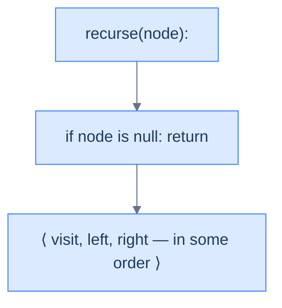
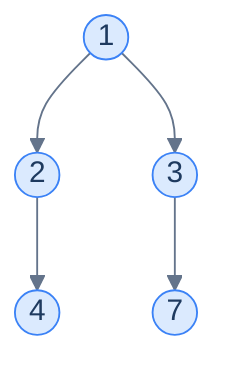
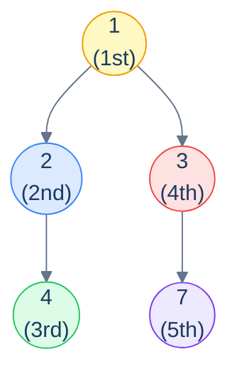
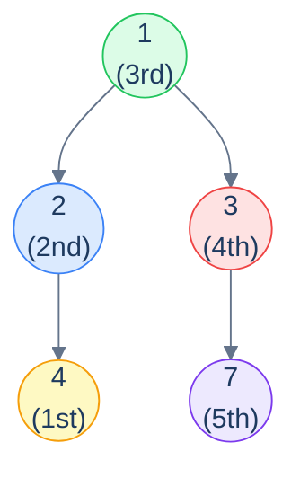
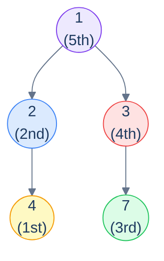
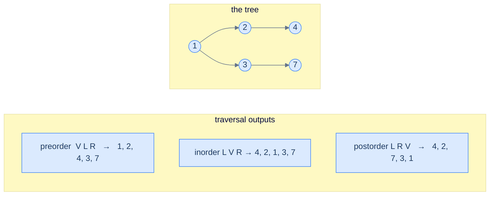

# 4. Recursive Traversals in Binary Trees

## The Hook

A linear data structure has *one* way to traverse it: start at the head, walk to the tail, visit each element exactly once. There's nothing to discuss.

Trees are not linear. At every internal node, the algorithm hits a fork — visit the left subtree first, or the right? Visit the current node *before* recursing, *between* the recursions, or *after*? Each combination of those choices produces a different traversal, and — surprisingly — each one turns out to have a *different practical use*. The three classical depth-first orderings — **preorder**, **inorder**, and **postorder** — each appear in real software, each in places where the others wouldn't work.

- **Preorder** (root → left → right) is how you serialise a tree to disk so you can reconstruct it later. It's how the `clone()` function for any tree works. It's how prefix expressions work in functional languages.
- **Inorder** (left → root → right) is how you read out the values of a *binary search tree* in sorted order. Every database index, every BST, every red-black tree's iterator uses this.
- **Postorder** (left → right → root) is how you safely **delete** a tree (you can't free a parent before its children, or you'd lose access to them). It's also how compilers evaluate expressions, how Kotlin's coroutines unwind cancellation, and how dependency-graph build systems compute targets.

The miraculous thing? *All three traversals are written as the same three-line recursive function*. Only the **order** of those three lines changes — visit, recurse-left, recurse-right — and that single line-shuffle changes the entire output and entire use case. Three patterns hiding inside a single recursive shape.

This lesson walks through all three, in order, with mermaid diagrams of the traversal path, the recursive algorithm in plain language, and a clean implementation in Python and Java. By the end you should be able to write any of the three from memory in either language — which you'll be doing constantly for the rest of the chapter.

---

## Table of contents

1. [The recursive shape — visit, left, right (in some order)](#the-recursive-shape--visit-left-right-in-some-order)
2. [Preorder traversal — root → left → right](#preorder-traversal--root--left--right)
3. [Inorder traversal — left → root → right](#inorder-traversal--left--root--right)
4. [Postorder traversal — left → right → root](#postorder-traversal--left--right--root)
5. [Comparing the three](#comparing-the-three)

***

# The recursive shape — visit, left, right (in some order)

Every recursive traversal is built from three building blocks:

1. **V** — visit the current node (do whatever work the algorithm needs: print, accumulate, transform).
2. **L** — recursively traverse the left subtree.
3. **R** — recursively traverse the right subtree.

Plus a base case: if the current node is `null`, return immediately (nothing to visit, nothing to recurse into).

The three classical orderings are simply the three sensible permutations:

| Name       | Order   | Mnemonic            | Output flavour                                |
|------------|---------|---------------------|-----------------------------------------------|
| Preorder   | V L R   | "*Pre*" = before    | Roots first; useful for *building* / serialising |
| Inorder    | L V R   | "*In*" = between    | Sorted output on a BST                        |
| Postorder  | L R V   | "*Post*" = after    | Leaves first; useful for *destroying* / evaluating |

The remaining three permutations (R V L, R L V, V R L) are real traversals too, just less commonly used — they reverse the left/right preference but otherwise behave identically.

> **Why is recursion so natural for trees?** Because the *definition* of a binary tree is itself recursive — *"a binary tree is empty, or a node with a left subtree and a right subtree"*. The traversal mirrors the definition exactly: the base case handles the empty tree, the recursive case visits the node and recurses into the two subtrees. The code writes itself. Every recursive tree algorithm in this entire chapter follows the same shape — internalise it now and the rest of the chapter is filling in the "what work do I do at the visit step?" part.



<p align="center"><strong>The skeleton of every recursive traversal in this chapter — base case + three actions in some order. Swap the order and you swap the traversal.</strong></p>

***

# Preorder traversal — root → left → right

**Visit the current node first**, then recurse into the left subtree, then the right.

```text
preorder(node):
  if node is null: return
  visit(node)        # ← V
  preorder(left)     # ← L
  preorder(right)    # ← R
```

<details>
<summary><h2>Walking through it</h2></summary>


Take this tree:



Apply the recursive shape:

- Visit `1`. Recurse left into `2`.
  - Visit `2`. Recurse left into `4`.
    - Visit `4`. Both children are `null`. Done with `4`.
  - Right of `2` is `null`. Done with `2`.
- Recurse right of `1` into `3`.
  - Right of `3`'s left is `null`. Recurse right of `3` into `7`.
    - Visit `7`. Both children are `null`. Done.

The values are visited in the order: **`1, 2, 4, 3, 7`**. *Roots before subtrees*; *left before right*.



<p align="center"><strong>Preorder visit sequence on the example tree — <strong><code>1 → 2 → 4 → 3 → 7</code></strong>. The root is always visited <em>first</em> for any subtree; that's where the name comes from.</strong></p>

</details>
<details>
<summary><h2>Why preorder?</h2></summary>


Preorder shows up wherever you need to *emit a parent before its children*:

- **Tree serialisation / cloning.** If you write the values in preorder, with explicit `null` markers, you can reconstruct the tree exactly. Most binary-tree serialisation formats (LeetCode's `[1,2,3,null,null,4,5]` notation, for example) are essentially preorder dumps.
- **Prefix expression notation.** `(3 + 4) * 5` becomes `* + 3 4 5` in prefix — exactly the preorder traversal of its expression tree.
- **File-system copying.** Visit the directory before its contents, so the destination directory exists before you try to populate it.

</details>
<details>
<summary><h2>Solution &amp; Analysis</h2></summary>

### Implementation

A three-line recursive helper (`preorder`) does the work — visit, recurse-left, recurse-right — and a thin wrapper (`recursive_preorder_traversal`) seeds the `result` list and kicks it off.


```python run viz=binary-tree viz-root=root
from typing import List, Optional


class TreeNode:
    def __init__(self, val=0, left=None, right=None):
        self.val = val
        self.left = left
        self.right = right


def from_level_order(values):
    """Build tree from list like [1, 2, 3, None, 4]. None means missing child."""
    if not values:
        return None
    root = TreeNode(values[0])
    queue = [root]
    i = 1
    while queue and i < len(values):
        node = queue.pop(0)
        if i < len(values) and values[i] is not None:
            node.left = TreeNode(values[i])
            queue.append(node.left)
        i += 1
        if i < len(values) and values[i] is not None:
            node.right = TreeNode(values[i])
            queue.append(node.right)
        i += 1
    return root


class Solution:
    def preorder(
        self, root: Optional[TreeNode], result: List[int]
    ) -> None:

        # Base case: If the current node is None (empty), return.
        if root is None:
            return

        # Step 1: Visit the current node and store its value in the
        # 'result' list
        result.append(root.val)

        # Step 2: Recursively traverse the left subtree
        self.preorder(root.left, result)

        # Step 3: Recursively traverse the right subtree
        self.preorder(root.right, result)

    def recursive_preorder_traversal(
        self, root: Optional[TreeNode]
    ) -> List[int]:

        # Create an empty list to store the preorder traversal result.
        result: List[int] = []

        # Start the recursive preorder traversal from the 'root' node.
        self.preorder(root, result)

        # Return the final result containing the preorder traversal of
        # the binary tree.
        return result


# Examples from the problem statement
print(Solution().recursive_preorder_traversal(from_level_order([1, 2, 3, 4, None, None, 7])))  # [1, 2, 4, 3, 7]
print(Solution().recursive_preorder_traversal(from_level_order([1, 8, 4, None, None, 2, 7])))  # [1, 8, 4, 2, 7]

# Edge cases
print(Solution().recursive_preorder_traversal(None))                                           # []
print(Solution().recursive_preorder_traversal(from_level_order([1])))                          # [1]
print(Solution().recursive_preorder_traversal(from_level_order([1, 2, None, 3, None, 4])))    # [1, 2, 3, 4]
print(Solution().recursive_preorder_traversal(from_level_order([1, None, 2, None, 3])))       # [1, 2, 3]
print(Solution().recursive_preorder_traversal(from_level_order([1, 2, 3, 4, 5, 6, 7])))      # [1, 2, 4, 5, 3, 6, 7]
print(Solution().recursive_preorder_traversal(from_level_order([5, 5, 5, 5, 5])))             # [5, 5, 5, 5, 5]
```

```java run
import java.util.*;

public class Main {
    static class TreeNode {
        int val;
        TreeNode left;
        TreeNode right;
        TreeNode() {}
        TreeNode(int val) { this.val = val; }
    }

    static TreeNode fromLevelOrder(Integer... values) {
        if (values.length == 0 || values[0] == null) return null;
        TreeNode root = new TreeNode(values[0]);
        java.util.Deque<TreeNode> queue = new java.util.ArrayDeque<>();
        queue.add(root);
        int i = 1;
        while (!queue.isEmpty() && i < values.length) {
            TreeNode node = queue.poll();
            if (i < values.length && values[i] != null) {
                node.left = new TreeNode(values[i]);
                queue.add(node.left);
            }
            i++;
            if (i < values.length && values[i] != null) {
                node.right = new TreeNode(values[i]);
                queue.add(node.right);
            }
            i++;
        }
        return root;
    }

    static class Solution {
        private void preorder(TreeNode root, List<Integer> result) {

            // Base case: If the current node is null (empty), return.
            if (root == null) {
                return;
            }

            // Step 1: Visit the current node and store its value in the
            // 'result' list
            result.add(root.val);

            // Step 2: Recursively traverse the left subtree
            preorder(root.left, result);

            // Step 3: Recursively traverse the right subtree
            preorder(root.right, result);
        }

        public List<Integer> recursivePreorderTraversal(TreeNode root) {

            // Create an empty list to store the preorder traversal result.
            List<Integer> result = new ArrayList<>();

            // Start the recursive preorder traversal from the 'root' node.
            preorder(root, result);

            // Return the final result containing the preorder traversal of
            // the binary tree.
            return result;
        }
    }

    public static void main(String[] args) {
        // Examples from the problem statement
        System.out.println(new Solution().recursivePreorderTraversal(fromLevelOrder(1, 2, 3, 4, null, null, 7)));  // [1, 2, 4, 3, 7]
        System.out.println(new Solution().recursivePreorderTraversal(fromLevelOrder(1, 8, 4, null, null, 2, 7)));  // [1, 8, 4, 2, 7]

        // Edge cases
        System.out.println(new Solution().recursivePreorderTraversal(null));                                        // []
        System.out.println(new Solution().recursivePreorderTraversal(fromLevelOrder(1)));                           // [1]
        System.out.println(new Solution().recursivePreorderTraversal(fromLevelOrder(1, 2, null, 3, null, 4)));     // [1, 2, 3, 4]
        System.out.println(new Solution().recursivePreorderTraversal(fromLevelOrder(1, null, 2, null, 3)));        // [1, 2, 3]
        System.out.println(new Solution().recursivePreorderTraversal(fromLevelOrder(1, 2, 3, 4, 5, 6, 7)));       // [1, 2, 4, 5, 3, 6, 7]
        System.out.println(new Solution().recursivePreorderTraversal(fromLevelOrder(5, 5, 5, 5, 5)));              // [5, 5, 5, 5, 5]
    }
}
```

### Complexity

Each node is visited exactly once → **O(N) time**. The recursion uses one stack frame per active call, and the maximum depth equals the tree's height → **O(h) space** for the call stack.

> **Best case** — balanced tree, `h = log N`:  Time **O(N)**, Space **O(log N)**.
>
> **Worst case** — skew tree, `h = N`: Time **O(N)**, Space **O(N)**.

</details>

***

# Inorder traversal — left → root → right

**Recurse into the left subtree first**, then visit the current node, then recurse into the right.

```text
inorder(node):
  if node is null: return
  inorder(left)      # ← L
  visit(node)        # ← V
  inorder(right)     # ← R
```

<details>
<summary><h2>Walking through it</h2></summary>


Same tree:



<p align="center"><strong>Inorder visit sequence — <strong><code>4 → 2 → 1 → 3 → 7</code></strong>. Each subtree is fully drained on the left before its root is visited; then the right subtree is drained.</strong></p>

The recursion goes *all the way down the left spine* before producing any output. For the example, it descends `1 → 2 → 4`, hits a `null` left of `4`, visits `4`, returns, visits `2`, descends `2`'s right (which is `null`), returns, visits `1`, descends right into `3`, finds `null` left of `3`, visits `3`, descends right into `7`, visits `7`.

</details>
<details>
<summary><h2>Why inorder?</h2></summary>


The killer application: **inorder traversal of a binary search tree visits the values in sorted ascending order**. This is the property that makes BSTs useful as ordered iterators — every database index, every `std::map`, every `TreeMap`, every BST in any language standard library uses inorder for its iterator. We'll prove this when we get to BSTs in the next chapter.

Inorder also shows up in:
- **Infix expression** — `3 + 4 * 5` is the inorder traversal of its expression tree.
- **Predecessor / successor lookups** in BSTs (find the previous and next value in sorted order).

</details>
<details>
<summary><h2>Solution &amp; Analysis</h2></summary>

### Implementation

Same shape as preorder; only the order of `visit` and the left recursion swap.


```python run viz=binary-tree viz-root=root
from typing import List, Optional


class TreeNode:
    def __init__(self, val=0, left=None, right=None):
        self.val = val
        self.left = left
        self.right = right


def from_level_order(values):
    """Build tree from list like [1, 2, 3, None, 4]. None means missing child."""
    if not values:
        return None
    root = TreeNode(values[0])
    queue = [root]
    i = 1
    while queue and i < len(values):
        node = queue.pop(0)
        if i < len(values) and values[i] is not None:
            node.left = TreeNode(values[i])
            queue.append(node.left)
        i += 1
        if i < len(values) and values[i] is not None:
            node.right = TreeNode(values[i])
            queue.append(node.right)
        i += 1
    return root


class Solution:
    def inorder(
        self, root: Optional[TreeNode], result: List[int]
    ) -> None:

        # Base case: If the current node is None (empty), return.
        if root is None:
            return

        # Step 1: Recursively traverse the left subtree.
        self.inorder(root.left, result)

        # Step 2: Visit the current node and store its value in 'result'.
        result.append(root.val)

        # Step 3: Recursively traverse the right subtree.
        self.inorder(root.right, result)

    def recursive_inorder_traversal(
        self, root: Optional[TreeNode]
    ) -> List[int]:

        # Create an empty list to store the inorder traversal result.
        result: List[int] = []

        # Start the recursive inorder traversal from the 'root' node.
        self.inorder(root, result)

        # Return the final result containing the inorder traversal of the
        # binary tree.
        return result


# Examples from the problem statement
print(Solution().recursive_inorder_traversal(from_level_order([1, 2, 3, 4, None, None, 7])))  # [4, 2, 1, 3, 7]
print(Solution().recursive_inorder_traversal(from_level_order([1, 8, 4, None, None, 2, 7])))  # [8, 1, 2, 4, 7]

# Edge cases
print(Solution().recursive_inorder_traversal(None))                                            # []
print(Solution().recursive_inorder_traversal(from_level_order([1])))                           # [1]
print(Solution().recursive_inorder_traversal(from_level_order([1, 2, None, 3, None, 4])))     # [4, 3, 2, 1]
print(Solution().recursive_inorder_traversal(from_level_order([1, None, 2, None, 3])))        # [1, 2, 3]
print(Solution().recursive_inorder_traversal(from_level_order([1, 2, 3, 4, 5, 6, 7])))       # [4, 2, 5, 1, 6, 3, 7]
print(Solution().recursive_inorder_traversal(from_level_order([5, 5, 5, 5, 5])))              # [5, 5, 5, 5, 5]
```

```java run
import java.util.*;

public class Main {
    static class TreeNode {
        int val;
        TreeNode left;
        TreeNode right;
        TreeNode() {}
        TreeNode(int val) { this.val = val; }
    }

    static TreeNode fromLevelOrder(Integer... values) {
        if (values.length == 0 || values[0] == null) return null;
        TreeNode root = new TreeNode(values[0]);
        java.util.Deque<TreeNode> queue = new java.util.ArrayDeque<>();
        queue.add(root);
        int i = 1;
        while (!queue.isEmpty() && i < values.length) {
            TreeNode node = queue.poll();
            if (i < values.length && values[i] != null) {
                node.left = new TreeNode(values[i]);
                queue.add(node.left);
            }
            i++;
            if (i < values.length && values[i] != null) {
                node.right = new TreeNode(values[i]);
                queue.add(node.right);
            }
            i++;
        }
        return root;
    }

    static class Solution {
        private void inorder(TreeNode root, List<Integer> result) {

            // Base case: If the current node is null, return.
            if (root == null) {
                return;
            }

            // Step 1: Recursively traverse the left subtree.
            inorder(root.left, result);

            // Step 2: Visit the current node and store its value in
            // 'result'.
            result.add(root.val);

            // Step 3: Recursively traverse the right subtree.
            inorder(root.right, result);
        }

        public List<Integer> recursiveInorderTraversal(TreeNode root) {

            // Create an empty list to store the inorder traversal result.
            List<Integer> result = new ArrayList<>();

            // Start the recursive inorder traversal from the 'root' node.
            inorder(root, result);

            // Return the final result containing the inorder traversal of
            // the binary tree.
            return result;
        }
    }

    public static void main(String[] args) {
        // Examples from the problem statement
        System.out.println(new Solution().recursiveInorderTraversal(fromLevelOrder(1, 2, 3, 4, null, null, 7)));  // [4, 2, 1, 3, 7]
        System.out.println(new Solution().recursiveInorderTraversal(fromLevelOrder(1, 8, 4, null, null, 2, 7)));  // [8, 1, 2, 4, 7]

        // Edge cases
        System.out.println(new Solution().recursiveInorderTraversal(null));                                        // []
        System.out.println(new Solution().recursiveInorderTraversal(fromLevelOrder(1)));                           // [1]
        System.out.println(new Solution().recursiveInorderTraversal(fromLevelOrder(1, 2, null, 3, null, 4)));     // [4, 3, 2, 1]
        System.out.println(new Solution().recursiveInorderTraversal(fromLevelOrder(1, null, 2, null, 3)));        // [1, 2, 3]
        System.out.println(new Solution().recursiveInorderTraversal(fromLevelOrder(1, 2, 3, 4, 5, 6, 7)));       // [4, 2, 5, 1, 6, 3, 7]
        System.out.println(new Solution().recursiveInorderTraversal(fromLevelOrder(5, 5, 5, 5, 5)));              // [5, 5, 5, 5, 5]
    }
}
```

### Complexity

Same as preorder: **O(N) time, O(h) space**.

</details>

***

# Postorder traversal — left → right → root

**Recurse into both subtrees first**, *then* visit the current node.

```text
postorder(node):
  if node is null: return
  postorder(left)    # ← L
  postorder(right)   # ← R
  visit(node)        # ← V
```

<details>
<summary><h2>Walking through it</h2></summary>


Same tree, third order:



<p align="center"><strong>Postorder visit sequence — <strong><code>4 → 2 → 7 → 3 → 1</code></strong>. The root of <em>every</em> subtree is visited <em>last</em>; leaves emerge first, the global root emerges dead last.</strong></p>

The recursion goes deep into the left subtree, then deep into the right subtree, *and only then* visits the current node. For the example: descend `1 → 2 → 4`, visit `4`, return, visit `2`, return, descend `1 → 3 → 7`, visit `7`, return, visit `3`, return, finally visit `1`.

</details>
<details>
<summary><h2>Why postorder?</h2></summary>


Postorder is what you use whenever a node's *result depends on its children's results*:

- **Tree deletion / freeing memory.** You must free the children before the parent — otherwise you'd lose the pointers needed to reach them. *Every* tree-destruction routine in a manual-memory language uses postorder.
- **Computing subtree sizes / heights.** `size(n) = 1 + size(left) + size(right)` — the parent computes its answer from already-computed child answers. Same for height, weight, max-depth, sum-of-values, etc.
- **Expression evaluation.** `(3 + 4) * 5` becomes `3 4 + 5 *` in postfix (RPN). Evaluate left-to-right with a stack — exactly how postfix calculators and JVM bytecode work.
- **Build systems / dependency resolution.** A target depends on its dependencies; you build the dependencies first (postorder over the dependency graph), then the target. `make`, Bazel, npm install — all do postorder traversal of the dependency DAG.

</details>
<details>
<summary><h2>Solution &amp; Analysis</h2></summary>

### Implementation

```python run viz=binary-tree viz-root=root
from typing import List, Optional


class TreeNode:
    def __init__(self, val=0, left=None, right=None):
        self.val = val
        self.left = left
        self.right = right


def from_level_order(values):
    """Build tree from list like [1, 2, 3, None, 4]. None means missing child."""
    if not values:
        return None
    root = TreeNode(values[0])
    queue = [root]
    i = 1
    while queue and i < len(values):
        node = queue.pop(0)
        if i < len(values) and values[i] is not None:
            node.left = TreeNode(values[i])
            queue.append(node.left)
        i += 1
        if i < len(values) and values[i] is not None:
            node.right = TreeNode(values[i])
            queue.append(node.right)
        i += 1
    return root


class Solution:
    def postorder(self, root: Optional[TreeNode], result: List[int]):

        # Base case: If the current node is None (empty), return.
        if root is None:
            return

        # Step 1: Recursively traverse the left subtree.
        self.postorder(root.left, result)

        # Step 2: Recursively traverse the right subtree.
        self.postorder(root.right, result)

        # Step 3: Visit the current node and store its value in 'result'.
        result.append(root.val)

    def recursive_postorder_traversal(
        self, root: Optional[TreeNode]
    ) -> List[int]:

        # Create an empty list to store the postorder traversal result.
        result: List[int] = []

        # Start the recursive postorder traversal from the 'root' node.
        self.postorder(root, result)

        # Return the final result containing the postorder traversal of
        # the binary tree.
        return result


# Examples from the problem statement
print(Solution().recursive_postorder_traversal(from_level_order([1, 2, 3, 4, None, None, 7])))  # [4, 2, 7, 3, 1]
print(Solution().recursive_postorder_traversal(from_level_order([1, 8, 4, None, None, 2, 7])))  # [8, 2, 7, 4, 1]

# Edge cases
print(Solution().recursive_postorder_traversal(None))                                            # []
print(Solution().recursive_postorder_traversal(from_level_order([1])))                           # [1]
print(Solution().recursive_postorder_traversal(from_level_order([1, 2, None, 3, None, 4])))     # [4, 3, 2, 1]
print(Solution().recursive_postorder_traversal(from_level_order([1, None, 2, None, 3])))        # [3, 2, 1]
print(Solution().recursive_postorder_traversal(from_level_order([1, 2, 3, 4, 5, 6, 7])))       # [4, 5, 2, 6, 7, 3, 1]
print(Solution().recursive_postorder_traversal(from_level_order([5, 5, 5, 5, 5])))              # [5, 5, 5, 5, 5]
```

```java run
import java.util.*;

public class Main {
    static class TreeNode {
        int val;
        TreeNode left;
        TreeNode right;
        TreeNode() {}
        TreeNode(int val) { this.val = val; }
    }

    static TreeNode fromLevelOrder(Integer... values) {
        if (values.length == 0 || values[0] == null) return null;
        TreeNode root = new TreeNode(values[0]);
        java.util.Deque<TreeNode> queue = new java.util.ArrayDeque<>();
        queue.add(root);
        int i = 1;
        while (!queue.isEmpty() && i < values.length) {
            TreeNode node = queue.poll();
            if (i < values.length && values[i] != null) {
                node.left = new TreeNode(values[i]);
                queue.add(node.left);
            }
            i++;
            if (i < values.length && values[i] != null) {
                node.right = new TreeNode(values[i]);
                queue.add(node.right);
            }
            i++;
        }
        return root;
    }

    static class Solution {
        private void postorder(TreeNode root, List<Integer> result) {

            // Base case: If the current node is null (empty), return.
            if (root == null) {
                return;
            }

            // Step 1: Recursively traverse the left subtree.
            postorder(root.left, result);

            // Step 2: Recursively traverse the right subtree.
            postorder(root.right, result);

            // Step 3: Visit the current node and store its value in
            // 'result'.
            result.add(root.val);
        }

        public List<Integer> recursivePostorderTraversal(TreeNode root) {

            // Create an empty list to store the postorder traversal result.
            List<Integer> result = new ArrayList<>();

            // Start the recursive postorder traversal from the 'root' node.
            postorder(root, result);

            // Return the final result containing the postorder traversal of
            // the binary tree.
            return result;
        }
    }

    public static void main(String[] args) {
        // Examples from the problem statement
        System.out.println(new Solution().recursivePostorderTraversal(fromLevelOrder(1, 2, 3, 4, null, null, 7)));  // [4, 2, 7, 3, 1]
        System.out.println(new Solution().recursivePostorderTraversal(fromLevelOrder(1, 8, 4, null, null, 2, 7)));  // [8, 2, 7, 4, 1]

        // Edge cases
        System.out.println(new Solution().recursivePostorderTraversal(null));                                        // []
        System.out.println(new Solution().recursivePostorderTraversal(fromLevelOrder(1)));                           // [1]
        System.out.println(new Solution().recursivePostorderTraversal(fromLevelOrder(1, 2, null, 3, null, 4)));     // [4, 3, 2, 1]
        System.out.println(new Solution().recursivePostorderTraversal(fromLevelOrder(1, null, 2, null, 3)));        // [3, 2, 1]
        System.out.println(new Solution().recursivePostorderTraversal(fromLevelOrder(1, 2, 3, 4, 5, 6, 7)));       // [4, 5, 2, 6, 7, 3, 1]
        System.out.println(new Solution().recursivePostorderTraversal(fromLevelOrder(5, 5, 5, 5, 5)));              // [5, 5, 5, 5, 5]
    }
}
```

### Complexity

Same as the others: **O(N) time, O(h) space**.

</details>

***

# Comparing the three

Same example tree, three orders side by side:



<p align="center"><strong>One tree, three orderings — only the position of <em>V</em> (visit) within the L/R recursion changes, and the entire output flips. Spot the patterns: preorder starts with the root, postorder ends with the root, inorder puts the root in the middle of the left and right halves.</strong></p>

| Property                              | Preorder | Inorder | Postorder |
|---------------------------------------|----------|---------|-----------|
| First value in output                 | Root     | Leftmost descendant | Leftmost descendant |
| Last value in output                  | Rightmost leaf-subtree node | Rightmost descendant | Root      |
| Root visited                          | First    | Middle  | Last      |
| Useful for…                           | Serialise/clone | BST sorted iteration | Free/evaluate |
| Time complexity                       | O(N)     | O(N)    | O(N)      |
| Space complexity                      | O(h)     | O(h)    | O(h)      |
| Lines of code                         | 3        | 3       | 3         |

***

## Final Takeaway

Recursive traversals are the gateway drug to tree algorithms. Once the *shape* — base case + visit + two recursions — is muscle memory, every later pattern in this chapter (subtree sums, heights, balanced-checks, path sums, LCAs, validation) is just a *fancier visit step* layered onto the same skeleton.

1. **The traversal *is* the recursion.** A tree's recursive definition (*"node + two subtrees"*) maps one-to-one onto a recursive function (*"do work + two recursive calls"*). Resist the urge to write iterative versions until you've fully internalised the recursive ones — every iterative tree algorithm is just a recursive one with a manually-managed stack, and you'll appreciate the abstraction the recursive form gives you.
2. **The order of V/L/R changes everything.** Three lines in the same function, three different output sequences, three different real-world applications. Memorise which order matches which need: pre = root-first (build), in = sorted (BST), post = root-last (free, evaluate).
3. **Stack space is paid in tree height.** Every recursive call adds a frame to the call stack; on a balanced tree this is `O(log N)`, on a skew tree it's `O(N)`. For trees of height millions (yes, they happen — sequential insertion into a naive BST), recursive traversals can blow the stack. The next lesson — iterative traversals with an explicit stack — exists precisely to dodge that bullet.

> *Coming up — iterative traversals. Same three orderings, but implemented with an explicit stack so we can traverse arbitrarily deep trees without risking a stack overflow. The iterative versions are uglier than the recursive ones, but they're production-grade for adversarial inputs and they teach you a lot about how the recursive call stack actually works under the hood.*

<!-- ============================================== -->
<!-- SWEEP 2 — missing sections (placeholders only) -->
<!-- ============================================== -->

<!-- TODO: Understanding the Problem — missing, needs to be written -->
<!--       Guidance: frame the gap the structure/algorithm fills -->

<!-- TODO: Supported Operations — missing, needs to be written -->
<!--       Guidance: table: operation / time / notes -->

<!-- TODO: Internal Mechanics — missing, needs to be written -->
<!--       Guidance: how it actually works under the hood -->

<!-- TODO: Working Example — missing, needs to be written -->
<!--       Guidance: one fully worked end-to-end example -->

<!-- TODO: Edge Cases & Pitfalls — missing, needs to be written -->
<!--       Guidance: bulleted list of gotchas -->

<!-- TODO: Production Reality — missing, needs to be written -->
<!--       Guidance: 4–6 entries: System — uses X — because Y -->

<!-- TODO: Quiz — missing, needs to be written -->
<!--       Guidance: 3–5 questions, each labeled [Recall]/[Reasoning]/[Tradeoff] -->

<!-- TODO: Practice Ladder — missing, needs to be written -->
<!--       Guidance: table: 5 links into pattern problems + hints -->

<!-- TODO: Further Reading — missing, needs to be written -->
<!--       Guidance: annotated: ★ Essential / ◆ Advanced / → Reference -->

<!-- TODO: Cross-Links — missing, needs to be written -->
<!--       Guidance: Prerequisites | What comes next -->
