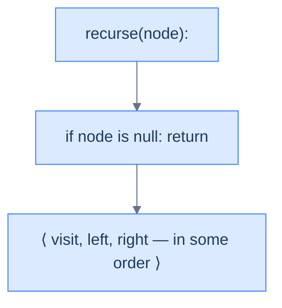
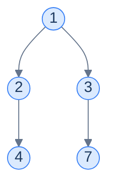
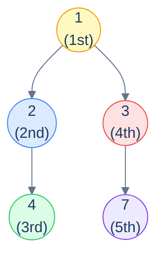
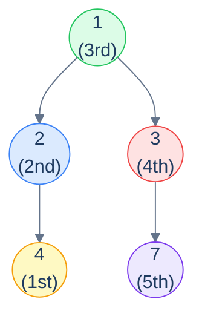
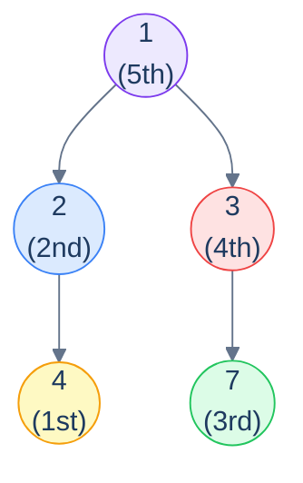
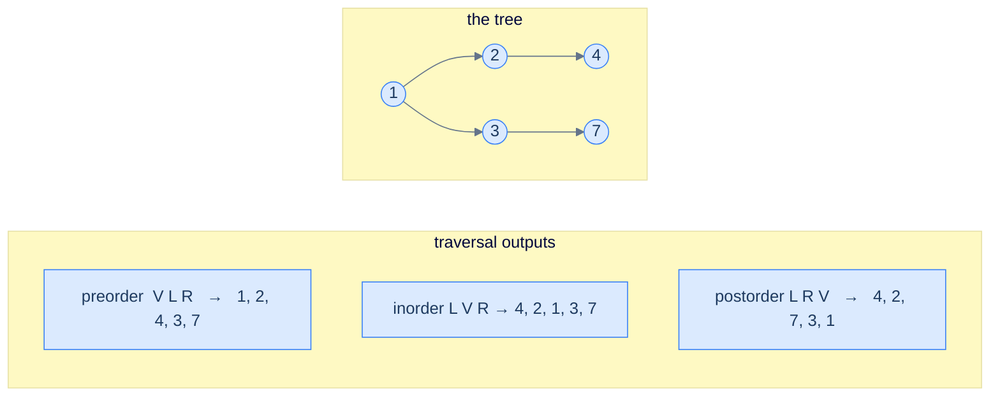

# 4. Recursive Traversals in Binary Trees

## The Hook

A linear data structure has *one* way to traverse it: start at the head, walk to the tail, visit each element exactly once. There's nothing to discuss.

Trees are not linear. At every internal node, the algorithm hits a fork — visit the left subtree first, or the right? Visit the current node *before* recursing, *between* the recursions, or *after*? Each combination of those choices produces a different traversal, and — surprisingly — each one turns out to have a *different practical use*. The three classical depth-first orderings — **preorder**, **inorder**, and **postorder** — each appear in real software, each in places where the others wouldn't work.

- **Preorder** (root → left → right) is how you serialise a tree to disk so you can reconstruct it later. It's how the `clone()` function for any tree works. It's how prefix expressions work in functional languages.
- **Inorder** (left → root → right) is how you read out the values of a *binary search tree* in sorted order. Every database index, every BST, every red-black tree's iterator uses this.
- **Postorder** (left → right → root) is how you safely **delete** a tree (you can't free a parent before its children, or you'd lose access to them). It's also how compilers evaluate expressions, how Kotlin's coroutines unwind cancellation, and how dependency-graph build systems compute targets.

The miraculous thing? *All three traversals are written as the same three-line recursive function*. Only the **order** of those three lines changes — visit, recurse-left, recurse-right — and that single line-shuffle changes the entire output and entire use case. Three patterns hiding inside a single recursive shape.

This lesson walks through all three, in order, with mermaid diagrams of the traversal path, the recursive algorithm in plain language, and a clean implementation in Python and Java. By the end you should be able to write any of the three from memory in either language — which you'll be doing constantly for the rest of the chapter.

---

## Table of contents

1. [The recursive shape — visit, left, right (in some order)](#the-recursive-shape--visit-left-right-in-some-order)
2. [Preorder traversal — root → left → right](#preorder-traversal--root--left--right)
3. [Inorder traversal — left → root → right](#inorder-traversal--left--root--right)
4. [Postorder traversal — left → right → root](#postorder-traversal--left--right--root)
5. [Comparing the three](#comparing-the-three)
6. [Understanding the problem](#understanding-the-problem)
7. [Supported operations](#supported-operations)
8. [Internal mechanics](#internal-mechanics)
9. [Working example](#working-example)
10. [Edge cases and pitfalls](#edge-cases-and-pitfalls)
11. [Production reality](#production-reality)
12. [Quiz](#quiz)
13. [Practice ladder](#practice-ladder)
14. [Further reading](#further-reading)
15. [Cross-links](#cross-links)
16. [Final takeaway](#final-takeaway)

***

# The recursive shape — visit, left, right (in some order)

Every recursive traversal is built from three building blocks:

1. **V** — visit the current node (do whatever work the algorithm needs: print, accumulate, transform).
2. **L** — recursively traverse the left subtree.
3. **R** — recursively traverse the right subtree.

Plus a base case: if the current node is `null`, return immediately (nothing to visit, nothing to recurse into).

The three classical orderings are simply the three sensible permutations:

| Name       | Order   | Mnemonic            | Output flavour                                |
|------------|---------|---------------------|-----------------------------------------------|
| Preorder   | V L R   | "*Pre*" = before    | Roots first; useful for *building* / serialising |
| Inorder    | L V R   | "*In*" = between    | Sorted output on a BST                        |
| Postorder  | L R V   | "*Post*" = after    | Leaves first; useful for *destroying* / evaluating |

The remaining three permutations (R V L, R L V, V R L) are real traversals too, just less commonly used — they reverse the left/right preference but otherwise behave identically.

> **Why is recursion so natural for trees?** Because the *definition* of a binary tree is itself recursive — *"a binary tree is empty, or a node with a left subtree and a right subtree"*. The traversal mirrors the definition exactly: the base case handles the empty tree, the recursive case visits the node and recurses into the two subtrees. The code writes itself. Every recursive tree algorithm in this entire chapter follows the same shape — internalise it now and the rest of the chapter is filling in the "what work do I do at the visit step?" part.



<p align="center"><strong>The skeleton of every recursive traversal in this chapter — base case + three actions in some order. Swap the order and you swap the traversal.</strong></p>

***

# Preorder traversal — root → left → right

**Visit the current node first**, then recurse into the left subtree, then the right.

```text
preorder(node):
  if node is null: return
  visit(node)        # ← V
  preorder(left)     # ← L
  preorder(right)    # ← R
```

<details>
<summary><h2>Walking through it</h2></summary>


Take this tree:



Apply the recursive shape:

- Visit `1`. Recurse left into `2`.
  - Visit `2`. Recurse left into `4`.
    - Visit `4`. Both children are `null`. Done with `4`.
  - Right of `2` is `null`. Done with `2`.
- Recurse right of `1` into `3`.
  - Right of `3`'s left is `null`. Recurse right of `3` into `7`.
    - Visit `7`. Both children are `null`. Done.

The values are visited in the order: **`1, 2, 4, 3, 7`**. *Roots before subtrees*; *left before right*.



<p align="center"><strong>Preorder visit sequence on the example tree — <strong><code>1 → 2 → 4 → 3 → 7</code></strong>. The root is always visited <em>first</em> for any subtree; that's where the name comes from.</strong></p>

</details>
<details>
<summary><h2>Why preorder?</h2></summary>


Preorder shows up wherever you need to *emit a parent before its children*:

- **Tree serialisation / cloning.** If you write the values in preorder, with explicit `null` markers, you can reconstruct the tree exactly. Most binary-tree serialisation formats (LeetCode's `[1,2,3,null,null,4,5]` notation, for example) are essentially preorder dumps.
- **Prefix expression notation.** `(3 + 4) * 5` becomes `* + 3 4 5` in prefix — exactly the preorder traversal of its expression tree.
- **File-system copying.** Visit the directory before its contents, so the destination directory exists before you try to populate it.

</details>
<details>
<summary><h2>Solution &amp; Analysis</h2></summary>

### Implementation

A three-line recursive helper (`preorder`) does the work — visit, recurse-left, recurse-right — and a thin wrapper (`recursive_preorder_traversal`) seeds the `result` list and kicks it off.


```python run viz=binary-tree viz-root=root
from typing import List, Optional


class TreeNode:
    def __init__(self, val=0, left=None, right=None):
        self.val = val
        self.left = left
        self.right = right


def from_level_order(values):
    """Build tree from list like [1, 2, 3, None, 4]. None means missing child."""
    if not values:
        return None
    root = TreeNode(values[0])
    queue = [root]
    i = 1
    while queue and i < len(values):
        node = queue.pop(0)
        if i < len(values) and values[i] is not None:
            node.left = TreeNode(values[i])
            queue.append(node.left)
        i += 1
        if i < len(values) and values[i] is not None:
            node.right = TreeNode(values[i])
            queue.append(node.right)
        i += 1
    return root


class Solution:
    def preorder(
        self, root: Optional[TreeNode], result: List[int]
    ) -> None:

        # Base case: If the current node is None (empty), return.
        if root is None:
            return

        # Step 1: Visit the current node and store its value in the
        # 'result' list
        result.append(root.val)

        # Step 2: Recursively traverse the left subtree
        self.preorder(root.left, result)

        # Step 3: Recursively traverse the right subtree
        self.preorder(root.right, result)

    def recursive_preorder_traversal(
        self, root: Optional[TreeNode]
    ) -> List[int]:

        # Create an empty list to store the preorder traversal result.
        result: List[int] = []

        # Start the recursive preorder traversal from the 'root' node.
        self.preorder(root, result)

        # Return the final result containing the preorder traversal of
        # the binary tree.
        return result


# Examples from the problem statement
print(Solution().recursive_preorder_traversal(from_level_order([1, 2, 3, 4, None, None, 7])))  # [1, 2, 4, 3, 7]
print(Solution().recursive_preorder_traversal(from_level_order([1, 8, 4, None, None, 2, 7])))  # [1, 8, 4, 2, 7]

# Edge cases
print(Solution().recursive_preorder_traversal(None))                                           # []
print(Solution().recursive_preorder_traversal(from_level_order([1])))                          # [1]
print(Solution().recursive_preorder_traversal(from_level_order([1, 2, None, 3, None, 4])))    # [1, 2, 3, 4]
print(Solution().recursive_preorder_traversal(from_level_order([1, None, 2, None, 3])))       # [1, 2, 3]
print(Solution().recursive_preorder_traversal(from_level_order([1, 2, 3, 4, 5, 6, 7])))      # [1, 2, 4, 5, 3, 6, 7]
print(Solution().recursive_preorder_traversal(from_level_order([5, 5, 5, 5, 5])))             # [5, 5, 5, 5, 5]
```

```java run viz=binary-tree viz-root=root
import java.util.*;

public class Main {
    static class TreeNode {
        int val;
        TreeNode left;
        TreeNode right;
        TreeNode() {}
        TreeNode(int val) { this.val = val; }
    }

    static TreeNode fromLevelOrder(Integer... values) {
        if (values.length == 0 || values[0] == null) return null;
        TreeNode root = new TreeNode(values[0]);
        java.util.Deque<TreeNode> queue = new java.util.ArrayDeque<>();
        queue.add(root);
        int i = 1;
        while (!queue.isEmpty() && i < values.length) {
            TreeNode node = queue.poll();
            if (i < values.length && values[i] != null) {
                node.left = new TreeNode(values[i]);
                queue.add(node.left);
            }
            i++;
            if (i < values.length && values[i] != null) {
                node.right = new TreeNode(values[i]);
                queue.add(node.right);
            }
            i++;
        }
        return root;
    }

    static class Solution {
        private void preorder(TreeNode root, List<Integer> result) {

            // Base case: If the current node is null (empty), return.
            if (root == null) {
                return;
            }

            // Step 1: Visit the current node and store its value in the
            // 'result' list
            result.add(root.val);

            // Step 2: Recursively traverse the left subtree
            preorder(root.left, result);

            // Step 3: Recursively traverse the right subtree
            preorder(root.right, result);
        }

        public List<Integer> recursivePreorderTraversal(TreeNode root) {

            // Create an empty list to store the preorder traversal result.
            List<Integer> result = new ArrayList<>();

            // Start the recursive preorder traversal from the 'root' node.
            preorder(root, result);

            // Return the final result containing the preorder traversal of
            // the binary tree.
            return result;
        }
    }

    public static void main(String[] args) {
        // Examples from the problem statement
        System.out.println(new Solution().recursivePreorderTraversal(fromLevelOrder(1, 2, 3, 4, null, null, 7)));  // [1, 2, 4, 3, 7]
        System.out.println(new Solution().recursivePreorderTraversal(fromLevelOrder(1, 8, 4, null, null, 2, 7)));  // [1, 8, 4, 2, 7]

        // Edge cases
        System.out.println(new Solution().recursivePreorderTraversal(null));                                        // []
        System.out.println(new Solution().recursivePreorderTraversal(fromLevelOrder(1)));                           // [1]
        System.out.println(new Solution().recursivePreorderTraversal(fromLevelOrder(1, 2, null, 3, null, 4)));     // [1, 2, 3, 4]
        System.out.println(new Solution().recursivePreorderTraversal(fromLevelOrder(1, null, 2, null, 3)));        // [1, 2, 3]
        System.out.println(new Solution().recursivePreorderTraversal(fromLevelOrder(1, 2, 3, 4, 5, 6, 7)));       // [1, 2, 4, 5, 3, 6, 7]
        System.out.println(new Solution().recursivePreorderTraversal(fromLevelOrder(5, 5, 5, 5, 5)));              // [5, 5, 5, 5, 5]
    }
}
```

### Complexity

Each node is visited exactly once → **O(N) time**. The recursion uses one stack frame per active call, and the maximum depth equals the tree's height → **O(h) space** for the call stack.

> **Best case** — balanced tree, `h = log N`:  Time **O(N)**, Space **O(log N)**.
>
> **Worst case** — skew tree, `h = N`: Time **O(N)**, Space **O(N)**.

</details>

***

# Inorder traversal — left → root → right

**Recurse into the left subtree first**, then visit the current node, then recurse into the right.

```text
inorder(node):
  if node is null: return
  inorder(left)      # ← L
  visit(node)        # ← V
  inorder(right)     # ← R
```

<details>
<summary><h2>Walking through it</h2></summary>


Same tree:



<p align="center"><strong>Inorder visit sequence — <strong><code>4 → 2 → 1 → 3 → 7</code></strong>. Each subtree is fully drained on the left before its root is visited; then the right subtree is drained.</strong></p>

The recursion goes *all the way down the left spine* before producing any output. For the example, it descends `1 → 2 → 4`, hits a `null` left of `4`, visits `4`, returns, visits `2`, descends `2`'s right (which is `null`), returns, visits `1`, descends right into `3`, finds `null` left of `3`, visits `3`, descends right into `7`, visits `7`.

</details>
<details>
<summary><h2>Why inorder?</h2></summary>


The killer application: **inorder traversal of a binary search tree visits the values in sorted ascending order**. This is the property that makes BSTs useful as ordered iterators — every database index, every `std::map`, every `TreeMap`, every BST in any language standard library uses inorder for its iterator. We'll prove this when we get to BSTs in the next chapter.

Inorder also shows up in:
- **Infix expression** — `3 + 4 * 5` is the inorder traversal of its expression tree.
- **Predecessor / successor lookups** in BSTs (find the previous and next value in sorted order).

</details>
<details>
<summary><h2>Solution &amp; Analysis</h2></summary>

### Implementation

Same shape as preorder; only the order of `visit` and the left recursion swap.


```python run viz=binary-tree viz-root=root
from typing import List, Optional


class TreeNode:
    def __init__(self, val=0, left=None, right=None):
        self.val = val
        self.left = left
        self.right = right


def from_level_order(values):
    """Build tree from list like [1, 2, 3, None, 4]. None means missing child."""
    if not values:
        return None
    root = TreeNode(values[0])
    queue = [root]
    i = 1
    while queue and i < len(values):
        node = queue.pop(0)
        if i < len(values) and values[i] is not None:
            node.left = TreeNode(values[i])
            queue.append(node.left)
        i += 1
        if i < len(values) and values[i] is not None:
            node.right = TreeNode(values[i])
            queue.append(node.right)
        i += 1
    return root


class Solution:
    def inorder(
        self, root: Optional[TreeNode], result: List[int]
    ) -> None:

        # Base case: If the current node is None (empty), return.
        if root is None:
            return

        # Step 1: Recursively traverse the left subtree.
        self.inorder(root.left, result)

        # Step 2: Visit the current node and store its value in 'result'.
        result.append(root.val)

        # Step 3: Recursively traverse the right subtree.
        self.inorder(root.right, result)

    def recursive_inorder_traversal(
        self, root: Optional[TreeNode]
    ) -> List[int]:

        # Create an empty list to store the inorder traversal result.
        result: List[int] = []

        # Start the recursive inorder traversal from the 'root' node.
        self.inorder(root, result)

        # Return the final result containing the inorder traversal of the
        # binary tree.
        return result


# Examples from the problem statement
print(Solution().recursive_inorder_traversal(from_level_order([1, 2, 3, 4, None, None, 7])))  # [4, 2, 1, 3, 7]
print(Solution().recursive_inorder_traversal(from_level_order([1, 8, 4, None, None, 2, 7])))  # [8, 1, 2, 4, 7]

# Edge cases
print(Solution().recursive_inorder_traversal(None))                                            # []
print(Solution().recursive_inorder_traversal(from_level_order([1])))                           # [1]
print(Solution().recursive_inorder_traversal(from_level_order([1, 2, None, 3, None, 4])))     # [4, 3, 2, 1]
print(Solution().recursive_inorder_traversal(from_level_order([1, None, 2, None, 3])))        # [1, 2, 3]
print(Solution().recursive_inorder_traversal(from_level_order([1, 2, 3, 4, 5, 6, 7])))       # [4, 2, 5, 1, 6, 3, 7]
print(Solution().recursive_inorder_traversal(from_level_order([5, 5, 5, 5, 5])))              # [5, 5, 5, 5, 5]
```

```java run viz=binary-tree viz-root=root
import java.util.*;

public class Main {
    static class TreeNode {
        int val;
        TreeNode left;
        TreeNode right;
        TreeNode() {}
        TreeNode(int val) { this.val = val; }
    }

    static TreeNode fromLevelOrder(Integer... values) {
        if (values.length == 0 || values[0] == null) return null;
        TreeNode root = new TreeNode(values[0]);
        java.util.Deque<TreeNode> queue = new java.util.ArrayDeque<>();
        queue.add(root);
        int i = 1;
        while (!queue.isEmpty() && i < values.length) {
            TreeNode node = queue.poll();
            if (i < values.length && values[i] != null) {
                node.left = new TreeNode(values[i]);
                queue.add(node.left);
            }
            i++;
            if (i < values.length && values[i] != null) {
                node.right = new TreeNode(values[i]);
                queue.add(node.right);
            }
            i++;
        }
        return root;
    }

    static class Solution {
        private void inorder(TreeNode root, List<Integer> result) {

            // Base case: If the current node is null, return.
            if (root == null) {
                return;
            }

            // Step 1: Recursively traverse the left subtree.
            inorder(root.left, result);

            // Step 2: Visit the current node and store its value in
            // 'result'.
            result.add(root.val);

            // Step 3: Recursively traverse the right subtree.
            inorder(root.right, result);
        }

        public List<Integer> recursiveInorderTraversal(TreeNode root) {

            // Create an empty list to store the inorder traversal result.
            List<Integer> result = new ArrayList<>();

            // Start the recursive inorder traversal from the 'root' node.
            inorder(root, result);

            // Return the final result containing the inorder traversal of
            // the binary tree.
            return result;
        }
    }

    public static void main(String[] args) {
        // Examples from the problem statement
        System.out.println(new Solution().recursiveInorderTraversal(fromLevelOrder(1, 2, 3, 4, null, null, 7)));  // [4, 2, 1, 3, 7]
        System.out.println(new Solution().recursiveInorderTraversal(fromLevelOrder(1, 8, 4, null, null, 2, 7)));  // [8, 1, 2, 4, 7]

        // Edge cases
        System.out.println(new Solution().recursiveInorderTraversal(null));                                        // []
        System.out.println(new Solution().recursiveInorderTraversal(fromLevelOrder(1)));                           // [1]
        System.out.println(new Solution().recursiveInorderTraversal(fromLevelOrder(1, 2, null, 3, null, 4)));     // [4, 3, 2, 1]
        System.out.println(new Solution().recursiveInorderTraversal(fromLevelOrder(1, null, 2, null, 3)));        // [1, 2, 3]
        System.out.println(new Solution().recursiveInorderTraversal(fromLevelOrder(1, 2, 3, 4, 5, 6, 7)));       // [4, 2, 5, 1, 6, 3, 7]
        System.out.println(new Solution().recursiveInorderTraversal(fromLevelOrder(5, 5, 5, 5, 5)));              // [5, 5, 5, 5, 5]
    }
}
```

### Complexity

Same as preorder: **O(N) time, O(h) space**.

</details>

***

# Postorder traversal — left → right → root

**Recurse into both subtrees first**, *then* visit the current node.

```text
postorder(node):
  if node is null: return
  postorder(left)    # ← L
  postorder(right)   # ← R
  visit(node)        # ← V
```

<details>
<summary><h2>Walking through it</h2></summary>


Same tree, third order:



<p align="center"><strong>Postorder visit sequence — <strong><code>4 → 2 → 7 → 3 → 1</code></strong>. The root of <em>every</em> subtree is visited <em>last</em>; leaves emerge first, the global root emerges dead last.</strong></p>

The recursion goes deep into the left subtree, then deep into the right subtree, *and only then* visits the current node. For the example: descend `1 → 2 → 4`, visit `4`, return, visit `2`, return, descend `1 → 3 → 7`, visit `7`, return, visit `3`, return, finally visit `1`.

</details>
<details>
<summary><h2>Why postorder?</h2></summary>


Postorder is what you use whenever a node's *result depends on its children's results*:

- **Tree deletion / freeing memory.** You must free the children before the parent — otherwise you'd lose the pointers needed to reach them. *Every* tree-destruction routine in a manual-memory language uses postorder.
- **Computing subtree sizes / heights.** `size(n) = 1 + size(left) + size(right)` — the parent computes its answer from already-computed child answers. Same for height, weight, max-depth, sum-of-values, etc.
- **Expression evaluation.** `(3 + 4) * 5` becomes `3 4 + 5 *` in postfix (RPN). Evaluate left-to-right with a stack — exactly how postfix calculators and JVM bytecode work.
- **Build systems / dependency resolution.** A target depends on its dependencies; you build the dependencies first (postorder over the dependency graph), then the target. `make`, Bazel, npm install — all do postorder traversal of the dependency DAG.

</details>
<details>
<summary><h2>Solution &amp; Analysis</h2></summary>

### Implementation

```python run viz=binary-tree viz-root=root
from typing import List, Optional


class TreeNode:
    def __init__(self, val=0, left=None, right=None):
        self.val = val
        self.left = left
        self.right = right


def from_level_order(values):
    """Build tree from list like [1, 2, 3, None, 4]. None means missing child."""
    if not values:
        return None
    root = TreeNode(values[0])
    queue = [root]
    i = 1
    while queue and i < len(values):
        node = queue.pop(0)
        if i < len(values) and values[i] is not None:
            node.left = TreeNode(values[i])
            queue.append(node.left)
        i += 1
        if i < len(values) and values[i] is not None:
            node.right = TreeNode(values[i])
            queue.append(node.right)
        i += 1
    return root


class Solution:
    def postorder(self, root: Optional[TreeNode], result: List[int]):

        # Base case: If the current node is None (empty), return.
        if root is None:
            return

        # Step 1: Recursively traverse the left subtree.
        self.postorder(root.left, result)

        # Step 2: Recursively traverse the right subtree.
        self.postorder(root.right, result)

        # Step 3: Visit the current node and store its value in 'result'.
        result.append(root.val)

    def recursive_postorder_traversal(
        self, root: Optional[TreeNode]
    ) -> List[int]:

        # Create an empty list to store the postorder traversal result.
        result: List[int] = []

        # Start the recursive postorder traversal from the 'root' node.
        self.postorder(root, result)

        # Return the final result containing the postorder traversal of
        # the binary tree.
        return result


# Examples from the problem statement
print(Solution().recursive_postorder_traversal(from_level_order([1, 2, 3, 4, None, None, 7])))  # [4, 2, 7, 3, 1]
print(Solution().recursive_postorder_traversal(from_level_order([1, 8, 4, None, None, 2, 7])))  # [8, 2, 7, 4, 1]

# Edge cases
print(Solution().recursive_postorder_traversal(None))                                            # []
print(Solution().recursive_postorder_traversal(from_level_order([1])))                           # [1]
print(Solution().recursive_postorder_traversal(from_level_order([1, 2, None, 3, None, 4])))     # [4, 3, 2, 1]
print(Solution().recursive_postorder_traversal(from_level_order([1, None, 2, None, 3])))        # [3, 2, 1]
print(Solution().recursive_postorder_traversal(from_level_order([1, 2, 3, 4, 5, 6, 7])))       # [4, 5, 2, 6, 7, 3, 1]
print(Solution().recursive_postorder_traversal(from_level_order([5, 5, 5, 5, 5])))              # [5, 5, 5, 5, 5]
```

```java run viz=binary-tree viz-root=root
import java.util.*;

public class Main {
    static class TreeNode {
        int val;
        TreeNode left;
        TreeNode right;
        TreeNode() {}
        TreeNode(int val) { this.val = val; }
    }

    static TreeNode fromLevelOrder(Integer... values) {
        if (values.length == 0 || values[0] == null) return null;
        TreeNode root = new TreeNode(values[0]);
        java.util.Deque<TreeNode> queue = new java.util.ArrayDeque<>();
        queue.add(root);
        int i = 1;
        while (!queue.isEmpty() && i < values.length) {
            TreeNode node = queue.poll();
            if (i < values.length && values[i] != null) {
                node.left = new TreeNode(values[i]);
                queue.add(node.left);
            }
            i++;
            if (i < values.length && values[i] != null) {
                node.right = new TreeNode(values[i]);
                queue.add(node.right);
            }
            i++;
        }
        return root;
    }

    static class Solution {
        private void postorder(TreeNode root, List<Integer> result) {

            // Base case: If the current node is null (empty), return.
            if (root == null) {
                return;
            }

            // Step 1: Recursively traverse the left subtree.
            postorder(root.left, result);

            // Step 2: Recursively traverse the right subtree.
            postorder(root.right, result);

            // Step 3: Visit the current node and store its value in
            // 'result'.
            result.add(root.val);
        }

        public List<Integer> recursivePostorderTraversal(TreeNode root) {

            // Create an empty list to store the postorder traversal result.
            List<Integer> result = new ArrayList<>();

            // Start the recursive postorder traversal from the 'root' node.
            postorder(root, result);

            // Return the final result containing the postorder traversal of
            // the binary tree.
            return result;
        }
    }

    public static void main(String[] args) {
        // Examples from the problem statement
        System.out.println(new Solution().recursivePostorderTraversal(fromLevelOrder(1, 2, 3, 4, null, null, 7)));  // [4, 2, 7, 3, 1]
        System.out.println(new Solution().recursivePostorderTraversal(fromLevelOrder(1, 8, 4, null, null, 2, 7)));  // [8, 2, 7, 4, 1]

        // Edge cases
        System.out.println(new Solution().recursivePostorderTraversal(null));                                        // []
        System.out.println(new Solution().recursivePostorderTraversal(fromLevelOrder(1)));                           // [1]
        System.out.println(new Solution().recursivePostorderTraversal(fromLevelOrder(1, 2, null, 3, null, 4)));     // [4, 3, 2, 1]
        System.out.println(new Solution().recursivePostorderTraversal(fromLevelOrder(1, null, 2, null, 3)));        // [3, 2, 1]
        System.out.println(new Solution().recursivePostorderTraversal(fromLevelOrder(1, 2, 3, 4, 5, 6, 7)));       // [4, 5, 2, 6, 7, 3, 1]
        System.out.println(new Solution().recursivePostorderTraversal(fromLevelOrder(5, 5, 5, 5, 5)));              // [5, 5, 5, 5, 5]
    }
}
```

### Complexity

Same as the others: **O(N) time, O(h) space**.

</details>

***

# Comparing the three

Same example tree, three orders side by side:



<p align="center"><strong>One tree, three orderings — only the position of <em>V</em> (visit) within the L/R recursion changes, and the entire output flips. Spot the patterns: preorder starts with the root, postorder ends with the root, inorder puts the root in the middle of the left and right halves.</strong></p>

| Property                              | Preorder | Inorder | Postorder |
|---------------------------------------|----------|---------|-----------|
| First value in output                 | Root     | Leftmost descendant | Leftmost descendant |
| Last value in output                  | Rightmost leaf-subtree node | Rightmost descendant | Root      |
| Root visited                          | First    | Middle  | Last      |
| Useful for…                           | Serialise/clone | BST sorted iteration | Free/evaluate |
| Time complexity                       | O(N)     | O(N)    | O(N)      |
| Space complexity                      | O(h)     | O(h)    | O(h)      |
| Lines of code                         | 3        | 3       | 3         |

***

# Understanding the Problem

A linear structure has one degree of freedom: move forward or backward, and a single pass visits every element. A binary tree spreads across two dimensions — down into children, across between siblings. So "visit every node once" is no longer a single obvious path. The question this lesson answers: how do you reach every node of a two-dimensional shape using a one-dimensional sequence of steps?

Any sequence of moves that eventually touches every node counts as a traversal, but most such sequences are awkward to code. Two families dominate because they are easy to write and reason about:

- **Depth-first** — plunge as deep as possible along one branch before backing up to try another. The three orderings in this lesson (preorder, inorder, postorder) are all depth-first.
- **Breadth-first** — visit all nodes at one depth before descending to the next. This is level-order traversal, covered in its own pattern later.

Recursion makes depth-first traversal almost free to express. To make this concrete: a binary tree *is* "a node plus a left subtree plus a right subtree," and a recursive function is "do some work plus two recursive calls" — the same shape. So the key idea is: the traversal problem is really the problem of imposing a one-dimensional order on a two-dimensional structure, and recursion solves it by mirroring the tree's own recursive definition.

***

# Supported Operations

There is one operation here, parameterised three ways: walk the whole tree, visiting each node exactly once, in an order set by *where* the visit step sits relative to the two recursive calls. The three sections above are those three parameterisations — this table is the synthesis, not a new claim.

| Operation | Visit order | Time | Space | Signature use |
|---|---|---|---|---|
| Preorder | root → left → right | `O(N)` | `O(h)` | Serialise, clone, emit prefix notation |
| Inorder | left → root → right | `O(N)` | `O(h)` | Read a BST in sorted order |
| Postorder | left → right → root | `O(N)` | `O(h)` | Free a tree, evaluate an expression, aggregate from children |

Every entry costs `O(N)` time because each node is visited once and the per-node work is `O(1)`. Every entry costs `O(h)` space for the recursion stack, where `h` is the tree's height — the stack never holds more than one frame per level on the current root-to-node path. To make this concrete: all three differ by a single line swap, shown in the implementations above, yet produce three different output sequences. So the core insight is: these are not three algorithms but one algorithm with the visit step slid to three positions, which is why they share identical complexity and differ only in output order.

***

# Internal Mechanics

The recursion *is* the mechanism. "[The recursive shape](#the-recursive-shape--visit-left-right-in-some-order)" above lays out its skeleton: a base case that returns on `null`, then visit, recurse-left, recurse-right in some order. Two facts about how that skeleton runs on real hardware explain both the complexity and the failure mode.

- **The call stack is the bookkeeping.** Each recursive call pushes a frame holding the current node and the position within visit/left/right. Descending pushes frames; returning pops them. The deepest the stack ever gets equals the length of the current root-to-leaf path, which is bounded by the tree's height `h` — that is the source of the `O(h)` space.
- **The base case is the stop signal.** A `null` child is not an error; it is the boundary that ends one branch of the descent and triggers a return. Every node is reached because every non-`null` child becomes a recursive call, and the walk terminates because every branch eventually hits `null`.

To make this concrete: on a balanced tree of `N` nodes the height is `log N`, so the stack holds at most `O(log N)` frames; on a one-sided skew of `N` nodes the height is `N`, so the stack holds `O(N)` frames and can overflow. So the core insight is: the visit order is a code-ordering choice, but the `O(N)` time and `O(h)` space are properties of the call stack — every node enters and leaves the stack exactly once, and the stack's peak depth is the tree's height.

***

# Working Example

The diagrams above show *which* nodes come out in *what* order. This trace shows *why*: it follows the call stack frame by frame for a preorder walk, so the `O(h)` space claim becomes something you can see. Use the same tree as above:

```
        1
       / \
      2   3
     /     \
    4       7
```

Read the stack top-down; `→` marks the frame currently executing. A frame is pushed on each recursive call and popped on return. The `out` column shows the result list after the visit step fires:

```
action                          call stack (top = current)     out
push preorder(1)                1                               []
  visit 1                       1                               [1]
  push preorder(2)              1, 2                            [1]
    visit 2                     1, 2                            [1,2]
    push preorder(4)            1, 2, 4                         [1,2]
      visit 4                   1, 2, 4                         [1,2,4]
      left(4)=null  → return    1, 2, 4                         [1,2,4]
      right(4)=null → return    1, 2                            [1,2,4]
    right(2)=null   → return    1                               [1,2,4]
  push preorder(3)              1, 3                            [1,2,4]
    visit 3                     1, 3                            [1,2,4,3]
    left(3)=null    → return    1, 3                            [1,2,4,3]
    push preorder(7)            1, 3, 7                         [1,2,4,3]
      visit 7                   1, 3, 7                         [1,2,4,3,7]
      return (both null)        1, 3                            [1,2,4,3,7]
    return                      1                               [1,2,4,3,7]
  return                        (empty)                         [1,2,4,3,7]
```

The result is `[1, 2, 4, 3, 7]`, matching the preorder diagram exactly. The stack peaked at three frames — `1, 2, 4` and later `1, 3, 7` — which equals the height of this tree. So the core insight is: the recursion visits `N` nodes for `O(N)` time, but it only ever holds `h` frames at once for `O(h)` space, and you can watch both bounds appear in the trace — one push-and-pop per node, a peak depth equal to the height.

> Switching to inorder or postorder changes only *which line inside each frame* writes to `out` — the frames pushed and popped are identical. That is the whole lesson in one sentence.

***

# Edge Cases and Pitfalls

Almost every recursive-traversal bug traces to one of two roots: a missing or wrong base case, or forgetting that the stack depth is the tree's height. The traversal logic itself is three lines, so the traps live in the boundaries around it. Keep this list open the first time a tree recursion misbehaves.

- **Forgetting the `null` base case.** Without the `if node is null: return` guard, the first leaf's child dereferences `null` and crashes. The base case is not optional decoration — it is the only thing that stops the descent. Every traversal function must check for `null` before reading `node.val`, `node.left`, or `node.right`.
- **Recursing before the empty-tree check, or missing it.** A `null` *root* means the whole tree is empty and the result is an empty list — not an error. The same `null` check that handles leaf children handles the empty tree, which is why the guard sits at the very top of the function. Code that assumes a non-`null` root throws on empty input.
- **Putting the visit step in the wrong position.** Preorder, inorder, and postorder differ only by where `visit(node)` sits relative to the two recursive calls. Misplacing it — visiting after the left recursion when you meant preorder — silently returns the wrong order with no crash. The output is plausible-looking but incorrect, which makes this the hardest traversal bug to spot. Check the order against a tiny hand-traced example.
- **Stack overflow on a deep skew tree.** Recursion costs `O(h)` stack space, and a one-sided tree has `h = N`. A sequentially built naive BST of a million nodes is a chain of a million frames, which exceeds the default stack on most runtimes and throws a stack-overflow. The next lesson's iterative traversals exist precisely to bound this with an explicit heap-allocated stack.
- **Swapping left and right "to simplify".** The two recursive calls are *ordered*: left before right. Swapping them turns preorder into a mirror-image traversal and breaks inorder's sorted-output guarantee on a BST. The order of the two recursions is as load-bearing as the position of the visit step.
- **Assuming inorder yields sorted output on any tree.** Inorder produces ascending values *only on a binary search tree*. On an arbitrary binary tree it yields left-root-right order, which is not sorted. Reaching for inorder to "sort" a non-BST returns a meaningless sequence.

So the key idea is: the three-line body is hard to get wrong, so every pitfall is a question about the edges — is the base case present, is the visit step in the right slot, and is the tree shallow enough that `O(h)` frames fit on the stack? Name the base case, hand-trace a five-node example, and respect the height bound, and the traversal behaves.

***

# Production Reality

Recursive depth-first traversal is the silent workhorse behind anything that has to process a hierarchy whole — emit it, evaluate it, or tear it down. The systems below are worth knowing by the order they pick.

**[Compilers and interpreters]** — uses **postorder traversal of the abstract syntax tree** — because a node's value (the result of evaluating an expression) depends on its children's values, so children must be evaluated before the parent combines them.

**[Expression printers and pretty-printers]** — uses **inorder traversal with parentheses** — because infix notation places the operator *between* its operands, which is exactly the left-root-right visit order.

**[Tree serialisation and `clone()` routines]** — uses **preorder traversal with `null` markers** — because writing the root before its subtrees lets a reader reconstruct each parent before attaching the children it owns.

**[Manual-memory tree destructors (C++ `delete`, RAII)]** — uses **postorder traversal** — because freeing a parent before its children would strand the child pointers, so the children must be released first while they are still reachable.

**[Build systems (`make`, Bazel) and package managers]** — uses **postorder traversal of the dependency graph** — because a target can only be built after its dependencies, which is a postorder over the DAG of "depends-on" edges.

**[Database B-tree and index iterators]** — uses **inorder traversal** — because reading the keys of an ordered search tree in sorted order is precisely what an index range scan needs, and inorder delivers it in `O(N)` time, `O(h)` space.

***

# Quiz

Test your grip before moving on. Commit to an answer before revealing it.

**[Recall] Q: What are the three depth-first orderings, and where does the visit step sit in each?**
Preorder visits the node *before* both recursive calls (root → left → right), inorder visits it *between* them (left → root → right), and postorder visits it *after* both (left → right → root).

**[Recall] Q: What is the time and space complexity of any of the three recursive traversals?**
`O(N)` time, because each of the `N` nodes is visited exactly once with `O(1)` work, and `O(h)` space for the recursion stack, where `h` is the tree's height.

**[Reasoning] Q: Why is inorder traversal the one that reads a binary search tree in sorted order?**
A BST keeps every left descendant smaller than its node and every right descendant larger, so visiting all of the left subtree, then the node, then all of the right subtree emits values in ascending order at every level.

**[Reasoning] Q: Why does a skew tree make recursive traversal risk a stack overflow when a balanced tree does not?**
Stack space is `O(h)`; a balanced tree has `h = log N` so the stack holds `O(log N)` frames, but a one-sided skew has `h = N` so the stack holds `O(N)` frames and can exceed the runtime's stack limit.

**[Tradeoff] Q: When would you choose postorder over preorder for a tree computation?**
Choose postorder when a node's result depends on its children's results — subtree sizes, heights, freeing memory, expression evaluation — and choose preorder when the parent must be emitted or created before its children, as in serialisation or cloning.

***

# Practice Ladder

Five problems to turn "visit, then recurse into both children" into a reflex. All five live in this chapter's pattern directories, where each traversal order becomes the backbone of a family of problems. Try each unaided; reach for the hint after ten minutes; do not peek at solutions until you have written something runnable.

| # | Problem | Pattern | Difficulty | Hint |
|---|---------|---------|------------|------|
| 1 | [Sum of Path](/cortex/data-structures-and-algorithms/trees-binary-tree-pattern-preorder-traversal-stateless-problems-sum-of-path) | [Preorder Traversal (Stateless)](/cortex/data-structures-and-algorithms/trees-binary-tree-pattern-preorder-traversal-stateless-pattern) | Easy | Carry a running sum *down* into the children — preorder, because the parent's contribution is known before the recursion. `O(N)` time, `O(h)` space. |
| 2 | [Sum of Leaves](/cortex/data-structures-and-algorithms/trees-binary-tree-pattern-postorder-traversal-stateless-problems-sum-of-leaves) | [Postorder Traversal (Stateless)](/cortex/data-structures-and-algorithms/trees-binary-tree-pattern-postorder-traversal-stateless-pattern) | Easy | A leaf is the node where both children are `null`; recurse into both sides and add up what they return. `O(N)` time, `O(h)` space. |
| 3 | [Height of a Binary Tree](/cortex/data-structures-and-algorithms/trees-binary-tree-pattern-postorder-traversal-stateless-problems-height-of-a-binary-tree) | [Postorder Traversal (Stateless)](/cortex/data-structures-and-algorithms/trees-binary-tree-pattern-postorder-traversal-stateless-pattern) | Easy | Return `-1` for a `null` node, else `1 + max(left, right)` — the parent computes its answer from already-returned child answers, which is postorder. `O(N)` time, `O(h)` space. |
| 4 | [Root to Leaf Path (Sum Check)](/cortex/data-structures-and-algorithms/trees-binary-tree-pattern-root-to-leaf-path-stateless-problems-root-to-leaf-path-sum-check) | [Root-to-Leaf Path (Stateless)](/cortex/data-structures-and-algorithms/trees-binary-tree-pattern-root-to-leaf-path-stateless-pattern) | Medium | Subtract each node's value from the target on the way down; a leaf where the remainder hits zero is a matching path. `O(N)` time, `O(h)` space. |
| 5 | [Identical Trees](/cortex/data-structures-and-algorithms/trees-binary-tree-pattern-simultaneous-traversal-problems-identical-trees) | [Simultaneous Traversal](/cortex/data-structures-and-algorithms/trees-binary-tree-pattern-simultaneous-traversal-pattern) | Medium | Recurse into both trees in lockstep, comparing node values and structure at each step; any mismatch means they differ. `O(N)` time, `O(h)` space. |

Once these feel automatic, "lay a fancier visit step onto the recursive skeleton" has stopped being a trick and become a reflex — and the pattern chapters can land their punches.

***

# Further Reading

Curated paths in, not a syllabus. Read in order of the annotation; come back for the rest when you need depth.

- **[Iterative Traversals in Binary Trees](/cortex/data-structures-and-algorithms/trees-binary-tree-iterative-traversals-in-binary-trees)**
  ★ Essential — the next lesson; re-implements all three orderings with an explicit stack so a deep skew tree cannot overflow the call stack.
- **[Constructing a Binary Tree](/cortex/data-structures-and-algorithms/trees-binary-tree-constructing-a-binary-tree)**
  ★ Essential — builds a tree from traversal sequences, the inverse of what this lesson produces, and shows why preorder-plus-inorder pins down a unique tree.
- **[CLRS — Section 12.1: Binary Search Trees](https://mitpress.mit.edu/9780262046305/introduction-to-algorithms/)**
  ◆ Advanced — the formal proof that inorder traversal of a BST yields sorted order, plus the predecessor and successor operations built on it.
- **[Introduction to Binary Trees](/cortex/data-structures-and-algorithms/trees-binary-tree-introduction-to-binary-trees)**
  → Reference — the root, leaf, height, and depth vocabulary this lesson leans on when it talks about `O(h)` stack space.
- **[Asymptotic Analysis](/cortex/data-structures-and-algorithms/foundations-asymptotic-analysis)**
  → Reference — what `O(N)` time and `O(h)` space mean precisely, and why the height term dominates the space cost of a recursive traversal.

***

# Cross-Links

**Prerequisites**

- [Linked-List Implementation of Binary Trees](/cortex/data-structures-and-algorithms/trees-binary-tree-linked-list-implementation-of-binary-trees) — the `TreeNode` with `val`, `left`, and `right` that every traversal in this lesson recurses over.
- [Introduction to Binary Trees](/cortex/data-structures-and-algorithms/trees-binary-tree-introduction-to-binary-trees) — the root, leaf, and height vocabulary the `O(h)` space bound depends on.
- [Asymptotic Analysis](/cortex/data-structures-and-algorithms/foundations-asymptotic-analysis) — the meaning of the `O(N)` time and `O(h)` space claims these traversals make.

**What comes next**

- [Iterative Traversals in Binary Trees](/cortex/data-structures-and-algorithms/trees-binary-tree-iterative-traversals-in-binary-trees) — the same three orderings driven by an explicit stack, so arbitrarily deep trees never overflow the call stack.
- [Constructing a Binary Tree](/cortex/data-structures-and-algorithms/trees-binary-tree-constructing-a-binary-tree) — rebuilding a tree from its traversal sequences, the next thing you do once you can produce them.

***

## Final Takeaway

> *Coming up — iterative traversals. Same three orderings, but implemented with an explicit stack so we can traverse arbitrarily deep trees without risking a stack overflow. The iterative versions are uglier than the recursive ones, but they're production-grade for adversarial inputs and they teach you a lot about how the recursive call stack actually works under the hood.*

1. **Core mechanic:** one three-line recursive function — base case on `null`, then visit, recurse-left, recurse-right — walks every node once; sliding the visit step before, between, or after the two recursions gives preorder, inorder, or postorder, all `O(N)` time and `O(h)` space.
2. **Dominant tradeoff:** you gain the simplest possible expression of a full tree walk — the code mirrors the tree's own recursive definition — but you pay `O(h)` call-stack space, which is `O(log N)` on a balanced tree and `O(N)` on a skew tree that can overflow the stack.
3. **One thing to remember:** the order of V/L/R is the entire decision — pre = root-first (build, serialise), in = sorted (BST iteration), post = root-last (free, evaluate, aggregate) — and every later tree algorithm in this chapter layers a fancier visit step onto this same skeleton.
