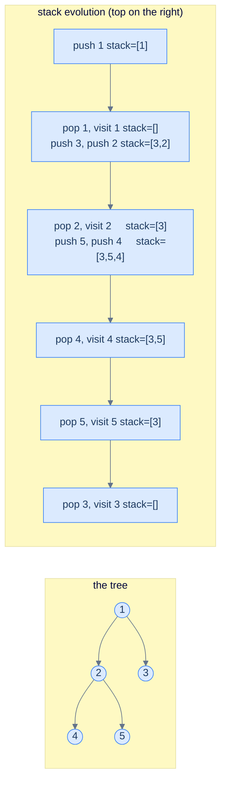
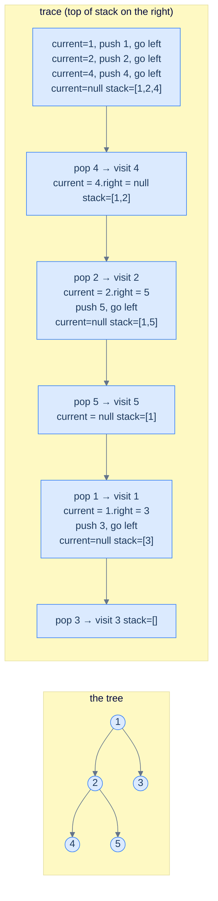
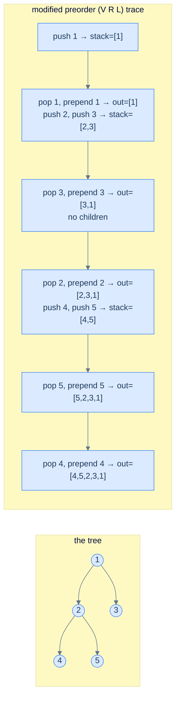
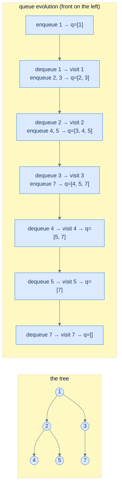

# 5. Iterative Traversals in Binary Trees

## The Hook

The recursive traversals from the last lesson are *beautiful* — three lines, no state, the tree's recursive shape mirrored exactly in the function's recursive shape. So why does this lesson exist?

Because **recursion is not free**. Every recursive call eats a frame on the **call stack** — a thread-local memory region the operating system gives every program. That stack is *small* by default: 1 MB on Linux, 512 KB on macOS, 1 MB on Windows for the main thread, much less for worker threads. A single stack frame is ~64 bytes. Do the arithmetic: a tree of height 16,000 will blow the stack on Linux. A *skew* tree of 16,000 nodes — a perfectly legal data structure — will *crash* the recursive traversal you just wrote.

Production code that processes user-supplied trees (parsers, deserialisers, deeply-nested JSON, network protocols) cannot afford this risk. The fix is to write the traversal **iteratively** — same algorithm, same output, but using an *explicit* stack we manage on the heap (which is gigabytes of headroom) instead of the call stack (which is megabytes). We trade a bit of code clarity for a guarantee that the algorithm tolerates *arbitrarily deep* trees without crashing.

Along the way, the iterative versions teach you something the recursive versions hide: **what the call stack actually is**. The recursion's "magic" turns out to be just a stack of pending work — and once you've simulated it explicitly, you understand recursion at a deeper level.

This lesson covers all four classical iterative traversals: **preorder, inorder, postorder** (each with an explicit stack), and the bonus **level-order** traversal (which uses a *queue* instead of a stack — and is what you reach for whenever a problem says "by level"). Implementations in Python and Java each.

---

## Table of contents

1. [Why iterative? — the call stack is small](#why-iterative--the-call-stack-is-small)
2. [Iterative preorder — the simplest one](#iterative-preorder--the-simplest-one)
3. [Iterative inorder — drain the left spine](#iterative-inorder--drain-the-left-spine)
4. [Iterative postorder — the elegant trick](#iterative-postorder--the-elegant-trick)
5. [Level-order traversal — using a queue](#level-order-traversal--using-a-queue)

***

# Why iterative? — the call stack is small

Every running thread in your program has a **call stack** — a fixed-size memory region used to track function calls. When a function `f` calls `g`, a *frame* for `g` is pushed onto the stack containing its local variables and return address. When `g` returns, its frame is popped and execution resumes in `f`. *Recursion* uses this same machinery — every recursive call pushes a frame; every base case + return pops one.

The catch is the stack's *size*. By default:

| Platform                    | Default main-thread stack |
|-----------------------------|---------------------------|
| Linux (most distros)        | 8 MB                      |
| macOS                       | 8 MB                      |
| Windows                     | 1 MB                      |
| Worker threads (most JVMs)  | 512 KB – 1 MB             |
| Browser JavaScript engines  | ~1 MB                     |

A typical stack frame for a tree traversal is around 64–128 bytes. Divide:

> **A 1 MB stack supports roughly 8,000–16,000 nested recursive calls.** A skewed binary tree of 50,000 nodes — which is *trivially* small — will blow it.

```d2
direction: right

cs: "Call stack — small (1-8 MB)" {
  grid-rows: 5
  grid-gap: 0
  f5: "frame: walk(node 16,000) — STACK OVERFLOW" {style.fill: "#fee2e2"; style.stroke: "#ef4444"}
  f4: "..."
  f3: "frame: walk(node 3)"
  f2: "frame: walk(node 2)"
  f1: "frame: walk(node 1)"
}

heap: "Heap stack — huge (gigabytes)" {
  grid-rows: 3
  grid-gap: 0
  h1: "explicit Stack of TreeNode"
  h2: "push, pop, peek"
  h3: "bounded only by free heap"
}
```

<p align="center"><strong>Two stacks, two scales — the call stack lives in a small fixed region; the explicit stack lives on the heap and grows as needed. Iterative traversals trade three clean lines of recursion for an explicit stack that survives deep trees.</strong></p>

The recursive form is fine for *known-bounded* trees (a parsed AST you produced yourself, a configured BST in a server with a tested depth). The iterative form is what you reach for when the input could come from anywhere — particularly anything user- or network-controlled.

***

# Iterative preorder — the simplest one

Of the three depth-first traversals, preorder is the easiest to convert to iterative form because *the visit happens first* — there's no "wait until later" complication.

<details>
<summary><h2>Algorithm</h2></summary>


Maintain a `current` pointer and a stack. The outer loop runs while `current` is non-null *or* the stack is non-empty. The inner loop walks down the left spine: at each step it **visits the node** (appends `current.val`) — the visit happens *first*, which is what makes this preorder — pushes the node, and moves `current` to its left child. When the left spine runs out (`current` is `null`), we pop a node and pivot to its right subtree.

> **Algorithm**
>
> -   **Step 1:** Initialise `current = root`, empty stack.
> -   **Step 2:** While `current` is non-null *or* the stack is non-empty:
>     -   **Inner loop:** While `current` is non-null, visit it (append `current.val` to output), push it, and move `current = current.left`.
>     -   When `current` is null, pop a node and set `current = popped.right`.



<p align="center"><strong>Trace of iterative preorder on the example tree — the visit order ends up <strong><code>1 → 2 → 4 → 5 → 3</code></strong>, identical to recursive preorder. Notice the right-child-first push: it's what makes the left child come out of the stack first.</strong></p>

> *Predict before reading on — what happens if you move the `result.append(current.val)` line from the inner loop down to <em>after</em> the pop, just before reading `current.right`?*
>
> You'd get **inorder** instead of preorder. The position of the visit relative to the left-spine descent is the only thing that distinguishes the two: visit *while descending the left spine* gives preorder; visit *after popping, before pivoting right* gives inorder. That single line-move is exactly the difference between the preorder code here and the inorder code in the next section — the stack-and-`current` skeleton is identical.

</details>
<details>
<summary><h2>Solution &amp; Analysis</h2></summary>

### Implementation

```python run viz=binary-tree viz-root=root
from typing import Optional, List


class TreeNode:
    def __init__(self, val=0, left=None, right=None):
        self.val = val
        self.left = left
        self.right = right


def from_level_order(values):
    """Build tree from list like [1, 2, 3, None, 4]. None means missing child."""
    if not values:
        return None
    root = TreeNode(values[0])
    queue = [root]
    i = 1
    while queue and i < len(values):
        node = queue.pop(0)
        if i < len(values) and values[i] is not None:
            node.left = TreeNode(values[i])
            queue.append(node.left)
        i += 1
        if i < len(values) and values[i] is not None:
            node.right = TreeNode(values[i])
            queue.append(node.right)
        i += 1
    return root


class Solution:
    def iterative_preorder_traversal(
        self, root: Optional[TreeNode]
    ) -> List[int]:

        # Create a list to store the result of preorder traversal
        result: List[int] = []

        # Create a stack to help traverse the binary tree iteratively
        stack: List[TreeNode] = []

        # Start from the root node
        current: Optional[TreeNode] = root

        # Continue traversal until we reach the end of the tree (current
        # is None) and the stack is empty
        while current or stack:

            # Traverse to the leftmost node and store the node values in
            # the result list
            while current:
                result.append(current.val)
                stack.append(current)
                current = current.left

            # If the current node is None, reached the leftmost leaf or
            # subtree we backtrack to the parent node by popping from the
            # stack and move to its right subtree.
            current = stack.pop()
            current = current.right

        # Return the result list containing the preorder traversal of the
        # binary tree
        return result


# Examples from the problem statement
print(Solution().iterative_preorder_traversal(from_level_order([1, 2, 3, 4, None, None, 7])))  # [1, 2, 4, 3, 7]
print(Solution().iterative_preorder_traversal(from_level_order([1, 8, 4, None, None, 2, 7])))  # [1, 8, 4, 2, 7]

# Edge cases
print(Solution().iterative_preorder_traversal(None))                                            # []
print(Solution().iterative_preorder_traversal(from_level_order([1])))                           # [1]
print(Solution().iterative_preorder_traversal(from_level_order([1, 2, None, 3, None, 4])))     # [1, 2, 3, 4]
print(Solution().iterative_preorder_traversal(from_level_order([1, None, 2, None, 3])))        # [1, 2, 3]
print(Solution().iterative_preorder_traversal(from_level_order([1, 2, 3, 4, 5, 6, 7])))       # [1, 2, 4, 5, 3, 6, 7]
print(Solution().iterative_preorder_traversal(from_level_order([5, 5, 5, 5, 5])))              # [5, 5, 5, 5, 5]
```

```java run
import java.util.*;

public class Main {
    static class TreeNode {
        int val;
        TreeNode left;
        TreeNode right;
        TreeNode() {}
        TreeNode(int val) { this.val = val; }
    }

    static TreeNode fromLevelOrder(Integer... values) {
        if (values.length == 0 || values[0] == null) return null;
        TreeNode root = new TreeNode(values[0]);
        java.util.Deque<TreeNode> queue = new java.util.ArrayDeque<>();
        queue.add(root);
        int i = 1;
        while (!queue.isEmpty() && i < values.length) {
            TreeNode node = queue.poll();
            if (i < values.length && values[i] != null) {
                node.left = new TreeNode(values[i]);
                queue.add(node.left);
            }
            i++;
            if (i < values.length && values[i] != null) {
                node.right = new TreeNode(values[i]);
                queue.add(node.right);
            }
            i++;
        }
        return root;
    }

    static class Solution {
        public List<Integer> iterativePreorderTraversal(TreeNode root) {

            // Create a list to store the result of preorder traversal
            List<Integer> result = new ArrayList<>();

            // Create a stack to help traverse the binary tree iteratively
            Stack<TreeNode> stack = new Stack<>();

            // Start from the root node
            TreeNode current = root;

            // Continue traversal until we reach the end of the tree (current
            // is null) and the stack is empty
            while (current != null || !stack.isEmpty()) {

                // Traverse to the leftmost node and store the node values in
                // the result list
                while (current != null) {
                    result.add(current.val);
                    stack.push(current);
                    current = current.left;
                }

                // If the current node is null, we reached the leftmost leaf
                // or subtree We backtrack to the parent node by popping from
                // the stack and move to its right subtree.
                current = stack.pop();
                current = current.right;
            }

            // Return the result list containing the preorder traversal of
            // the binary tree
            return result;
        }
    }

    public static void main(String[] args) {
        // Examples from the problem statement
        System.out.println(new Solution().iterativePreorderTraversal(fromLevelOrder(1, 2, 3, 4, null, null, 7)));  // [1, 2, 4, 3, 7]
        System.out.println(new Solution().iterativePreorderTraversal(fromLevelOrder(1, 8, 4, null, null, 2, 7)));  // [1, 8, 4, 2, 7]

        // Edge cases
        System.out.println(new Solution().iterativePreorderTraversal(null));                                        // []
        System.out.println(new Solution().iterativePreorderTraversal(fromLevelOrder(1)));                           // [1]
        System.out.println(new Solution().iterativePreorderTraversal(fromLevelOrder(1, 2, null, 3, null, 4)));     // [1, 2, 3, 4]
        System.out.println(new Solution().iterativePreorderTraversal(fromLevelOrder(1, null, 2, null, 3)));        // [1, 2, 3]
        System.out.println(new Solution().iterativePreorderTraversal(fromLevelOrder(1, 2, 3, 4, 5, 6, 7)));       // [1, 2, 4, 5, 3, 6, 7]
        System.out.println(new Solution().iterativePreorderTraversal(fromLevelOrder(5, 5, 5, 5, 5)));              // [5, 5, 5, 5, 5]
    }
}
```

### Complexity

Each node pushed once, popped once → **O(N) time**. Stack holds at most *height* of nodes at any moment (along one root-to-leaf path) → **O(h) space**. Same as recursive — but the space is on the heap, where there's lots of room.

</details>

***

# Iterative inorder — drain the left spine

Inorder is harder. The visit happens *between* the left and right recursive calls, so we need to defer it: walk all the way down the left spine first (pushing each node we pass), then visit-and-pivot at each pop.

<details>
<summary><h2>Algorithm</h2></summary>


Maintain a `current` pointer (where we are now, may be `null`) and a stack (nodes whose left subtree we've already descended into and whose visit is *pending*).

> **Algorithm**
>
> -   **Step 1:** Initialise `current = root`, empty stack.
> -   **Step 2:** While `current` is non-null *or* the stack is non-empty:
>     -   **Inner loop:** While `current` is non-null, push it and move `current = current.left`.
>     -   When `current` is null, pop a node, visit it, and set `current = popped.right`.

The inner loop drains the left spine; the outer loop pivots to the right subtree once we've drained.



<p align="center"><strong>Trace of iterative inorder — output sequence <strong><code>4 → 2 → 5 → 1 → 3</code></strong>. The "drain the left spine, then pivot right" pattern is the iterative analogue of "recurse fully into left, visit, then recurse into right".</strong></p>

</details>
<details>
<summary><h2>Solution &amp; Analysis</h2></summary>

### Implementation

```python run viz=binary-tree viz-root=root
from typing import Optional, List


class TreeNode:
    def __init__(self, val=0, left=None, right=None):
        self.val = val
        self.left = left
        self.right = right


def from_level_order(values):
    """Build tree from list like [1, 2, 3, None, 4]. None means missing child."""
    if not values:
        return None
    root = TreeNode(values[0])
    queue = [root]
    i = 1
    while queue and i < len(values):
        node = queue.pop(0)
        if i < len(values) and values[i] is not None:
            node.left = TreeNode(values[i])
            queue.append(node.left)
        i += 1
        if i < len(values) and values[i] is not None:
            node.right = TreeNode(values[i])
            queue.append(node.right)
        i += 1
    return root


class Solution:
    def iterative_inorder_traversal(
        self, root: Optional[TreeNode]
    ) -> List[int]:

        # Create a list to store the result of inorder traversal
        result: List[int] = []

        # Create a stack to help traverse the binary tree iteratively
        stack: List[TreeNode] = []

        # Start from the root node
        current: Optional[TreeNode] = root

        # Continue traversal until we reach the end of the tree (current
        # is None) and the stack is empty
        while current or stack:

            # Traverse to the leftmost node and store the node values in
            # the result list
            while current:
                stack.append(current)
                current = current.left

            # If the current node is None, we have reached the leftmost
            # leaf or subtree. We backtrack to the parent node by popping
            # from the stack, process the current node, and move to its
            # right subtree.
            current = stack.pop()
            result.append(current.val)
            current = current.right

        # Return the result list containing the inorder traversal of the
        # binary tree
        return result


# Examples from the problem statement
print(Solution().iterative_inorder_traversal(from_level_order([1, 2, 3, 4, None, None, 7])))  # [4, 2, 1, 3, 7]
print(Solution().iterative_inorder_traversal(from_level_order([1, 8, 4, None, None, 2, 7])))  # [8, 1, 2, 4, 7]

# Edge cases
print(Solution().iterative_inorder_traversal(None))                                            # []
print(Solution().iterative_inorder_traversal(from_level_order([1])))                           # [1]
print(Solution().iterative_inorder_traversal(from_level_order([1, 2, None, 3, None, 4])))     # [4, 3, 2, 1]
print(Solution().iterative_inorder_traversal(from_level_order([1, None, 2, None, 3])))        # [1, 2, 3]
print(Solution().iterative_inorder_traversal(from_level_order([1, 2, 3, 4, 5, 6, 7])))       # [4, 2, 5, 1, 6, 3, 7]
print(Solution().iterative_inorder_traversal(from_level_order([5, 5, 5, 5, 5])))              # [5, 5, 5, 5, 5]
```

```java run
import java.util.*;

public class Main {
    static class TreeNode {
        int val;
        TreeNode left;
        TreeNode right;
        TreeNode() {}
        TreeNode(int val) { this.val = val; }
    }

    static TreeNode fromLevelOrder(Integer... values) {
        if (values.length == 0 || values[0] == null) return null;
        TreeNode root = new TreeNode(values[0]);
        java.util.Deque<TreeNode> queue = new java.util.ArrayDeque<>();
        queue.add(root);
        int i = 1;
        while (!queue.isEmpty() && i < values.length) {
            TreeNode node = queue.poll();
            if (i < values.length && values[i] != null) {
                node.left = new TreeNode(values[i]);
                queue.add(node.left);
            }
            i++;
            if (i < values.length && values[i] != null) {
                node.right = new TreeNode(values[i]);
                queue.add(node.right);
            }
            i++;
        }
        return root;
    }

    static class Solution {
        public List<Integer> iterativeInorderTraversal(TreeNode root) {

            // Create a list to store the result of inorder traversal
            List<Integer> result = new ArrayList<>();

            // Create a stack to help traverse the binary tree iteratively
            Stack<TreeNode> stack = new Stack<>();

            // Start from the root node
            TreeNode current = root;

            // Continue traversal until we reach the end of the tree (current
            // is null) and the stack is empty
            while (current != null || !stack.empty()) {

                // Traverse to the leftmost node and store the node values in
                // the result list
                while (current != null) {
                    stack.push(current);
                    current = current.left;
                }

                // If the current node is null, we have reached the leftmost
                // leaf or subtree We backtrack to the parent node by popping
                // from the stack, process the current node and move to its
                // right subtree.
                current = stack.pop();
                result.add(current.val);
                current = current.right;
            }

            // Return the result list containing the inorder traversal of the
            // binary tree
            return result;
        }
    }

    public static void main(String[] args) {
        // Examples from the problem statement
        System.out.println(new Solution().iterativeInorderTraversal(fromLevelOrder(1, 2, 3, 4, null, null, 7)));  // [4, 2, 1, 3, 7]
        System.out.println(new Solution().iterativeInorderTraversal(fromLevelOrder(1, 8, 4, null, null, 2, 7)));  // [8, 1, 2, 4, 7]

        // Edge cases
        System.out.println(new Solution().iterativeInorderTraversal(null));                                        // []
        System.out.println(new Solution().iterativeInorderTraversal(fromLevelOrder(1)));                           // [1]
        System.out.println(new Solution().iterativeInorderTraversal(fromLevelOrder(1, 2, null, 3, null, 4)));     // [4, 3, 2, 1]
        System.out.println(new Solution().iterativeInorderTraversal(fromLevelOrder(1, null, 2, null, 3)));        // [1, 2, 3]
        System.out.println(new Solution().iterativeInorderTraversal(fromLevelOrder(1, 2, 3, 4, 5, 6, 7)));       // [4, 2, 5, 1, 6, 3, 7]
        System.out.println(new Solution().iterativeInorderTraversal(fromLevelOrder(5, 5, 5, 5, 5)));              // [5, 5, 5, 5, 5]
    }
}
```

### Complexity

**O(N) time, O(h) space** — same as recursive.

</details>

***

# Iterative postorder — the elegant trick

Postorder is the trickiest because you can't visit a node until *both* of its children have been processed. There are two clean approaches; we'll cover both.

## Approach 1 (recommended) — reverse-of-modified-preorder

Here's the elegant insight:

> **Postorder (L R V)** is the **reverse** of **modified-preorder (V R L)**.

That is, if you do a *preorder* traversal but visit the **right subtree before the left**, then reverse the output, you get postorder. Why? Because reversing `V R L` element-wise gives `L R V` — exactly postorder. So we run an iterative preorder with right-first, prepend each visit to the output (or append and reverse at the end), and we're done.

```text
preorder of root visits         V R L → 1 3 2 5 4
reverse                         L R V → 4 5 2 3 1
this IS the postorder!
```

> **Algorithm (reverse-of-modified-preorder)**
>
> -   **Step 1:** Push root onto stack (handle empty case).
> -   **Step 2:** While stack non-empty:
>     -   Pop `n`. Insert `n.val` at the **front** of output (or append and reverse later).
>     -   If `n.left`  is non-null, push it.
>     -   If `n.right` is non-null, push it.
>
> The push order is the *reverse* of the preorder version (left first, so right comes out first).

This is *much* simpler than the "single-stack with state-tracking" approach the original lesson uses, and uses no extra bookkeeping per node.



<p align="center"><strong>Trace — modified preorder visits in order <code>1, 3, 2, 5, 4</code>; prepending each gives <code>4, 5, 2, 3, 1</code> — the postorder of the tree. One stack, no per-node state, no node-pushed-twice trick. The reverse turns the algorithm inside-out.</strong></p>

## Approach 2 (alternative) — the "push twice" approach

The original CodeIntuition approach pushes each node onto the stack *twice* — once to mark "right subtree pending", once to mark "visit pending". When you pop a node, if the next item on the stack is the same node, you know it's the first pop (so descend right); otherwise it's the second pop (so visit). This works but doubles the stack usage and adds a conditional. The reverse-preorder approach above is cleaner; we mention this for completeness only.

## Implementation (Approach 1)

We'll push the values onto the output and reverse once at the end — *appending* is O(1) while *prepending* a list/vector is O(N). For Python's `deque` you can use `appendleft` directly.


```python run
from collections import deque

def postorder_iter(root):
    if root is None: return []
    out = deque()
    stk = [root]
    while stk:
        n = stk.pop()
        out.appendleft(n.val)             # prepend = same as reverse-of-append
        if n.left:  stk.append(n.left)    # left first (so right comes off the stack first → V R L)
        if n.right: stk.append(n.right)
    return list(out)
```

```java run
public static List<Integer> postorderIter(TreeNode root) {
    LinkedList<Integer> out = new LinkedList<>();
    if (root == null) return out;
    Deque<TreeNode> stk = new ArrayDeque<>();
    stk.push(root);
    while (!stk.isEmpty()) {
        TreeNode n = stk.pop();
        out.addFirst(n.val);                 // prepend
        if (n.left  != null) stk.push(n.left);
        if (n.right != null) stk.push(n.right);
    }
    return out;
}
```


## Complexity

**O(N) time** (every node pushed and popped once; the reverse at the end is O(N)). **O(h) space** for the stack, plus O(N) for the output (which is unavoidable).

***

# Level-order traversal — using a queue

The fourth traversal is structurally different — it visits nodes **breadth-first**, level by level, left to right within each level.

```text
        1                  level 0:  1
       / \
      2   3                level 1:  2, 3
     / \   \
    4   5   7              level 2:  4, 5, 7

level-order: [1, 2, 3, 4, 5, 7]
```

The depth-first traversals all used a **stack** (LIFO) — implicitly via recursion or explicitly via an iterative stack. Level-order uses a **queue** (FIFO). The intuition: at any moment, the queue holds *the next nodes to visit, in the order we'll visit them*. Pop from the front, enqueue children at the back, and the FIFO discipline naturally produces level-by-level visit order.

This algorithm has a name in the wider algorithms world: **breadth-first search** (BFS). The same machinery works on graphs, on grids, on game-state spaces. Level-order is BFS specialised to trees.

<details>
<summary><h2>Algorithm</h2></summary>


> **Algorithm**
>
> -   **Step 1:** Initialise a queue containing just `root` (if root is null, return).
> -   **Step 2:** While queue is non-empty:
>     -   Dequeue a node `n`.
>     -   Visit `n`.
>     -   If `n.left` is non-null, enqueue it.
>     -   If `n.right` is non-null, enqueue it.



<p align="center"><strong>Trace of level-order — output <strong><code>1 → 2 → 3 → 4 → 5 → 7</code></strong>. Every level is fully drained from the queue before the next level starts to drain, because we always enqueue children to the back and dequeue from the front. The FIFO discipline <em>is</em> the level-by-level structure.</strong></p>

> **Why a queue and not a stack?** A stack would visit one branch all the way down before backtracking — that's depth-first, which is precisely what level-order is *not*. Swap the queue for a stack and you'd get a (slightly different) preorder traversal. The choice of container is the choice of traversal *family* — DFS uses stacks, BFS uses queues.

</details>
<details>
<summary><h2>Solution &amp; Analysis</h2></summary>

### Implementation

```python run
from collections import deque

def level_order(root):
    out = []
    if root is None: return out
    q = deque([root])
    while q:
        n = q.popleft()
        out.append(n.val)
        if n.left:  q.append(n.left)
        if n.right: q.append(n.right)
    return out

# tree:    1
#         / \
#        2   3
#       / \   \
#      4   5   7
root = TreeNode(1, TreeNode(2, TreeNode(4), TreeNode(5)), TreeNode(3, None, TreeNode(7)))
print(level_order(root))   # [1, 2, 3, 4, 5, 7]
```

```java run
public static List<Integer> levelOrder(TreeNode root) {
    List<Integer> out = new ArrayList<>();
    if (root == null) return out;
    Queue<TreeNode> q = new ArrayDeque<>();
    q.offer(root);
    while (!q.isEmpty()) {
        TreeNode n = q.poll();
        out.add(n.val);
        if (n.left  != null) q.offer(n.left);
        if (n.right != null) q.offer(n.right);
    }
    return out;
}
```

### Complexity

Each node enqueued and dequeued once → **O(N) time**. Queue holds at most one *level's* worth of nodes at a time → **O(W) space**, where `W` is the *maximum width* of the tree. For a perfect binary tree of `N` nodes, the bottom level holds about `N/2` nodes, so worst-case **O(N) space**. For a skew tree, width is 1 and space is O(1) — the *opposite* trade-off from depth-first traversals (which used O(h) space — small for skew, large for balanced).

> **Important comparison:** DFS uses O(h) space — best for **wide, shallow** trees. BFS uses O(W) space — best for **tall, narrow** trees. For balanced trees the two are roughly equivalent.

</details>
<details>
<summary><h2>Final Takeaway</h2></summary>


Iterative traversals are the production-grade siblings of the recursive ones. Same outputs, different mechanism, different trade-offs. Three things to walk away with:

1. **Stack vs. queue is the entire DFS-vs-BFS distinction.** Swap the container in any traversal and you swap traversal *families*. Stack → DFS (preorder, inorder, postorder all variants). Queue → BFS (level-order). Memorise this — it's one of the deepest unifying ideas in algorithms, and it generalises straight from trees to graphs.
2. **Postorder gets simpler when you flip it.** The `L R V` ordering is the *reverse* of `V R L` — a modified preorder traversal that reverses left/right. Don't reach for the "push-twice" hack; reach for the reverse-of-modified-preorder trick. Clean, no per-node state, easy to remember.
3. **Iterative trades clarity for safety.** Recursive code is *much* easier to read; iterative code never blows the call stack. In a coding interview where the input is bounded and friendly, recursion is fine. In production code where the input could be adversarial (deeply nested user data, parsed protocols, untrusted JSON), iterative is mandatory. Pick based on the threat model, not on what *looks* nicer.

> *Coming up — now that we can <em>read</em> trees in any order, the next lesson tackles the inverse: <strong>building trees from traversal sequences</strong>. Given just two orderings (typically <em>preorder + inorder</em> or <em>postorder + inorder</em>), can we reconstruct the unique tree that produced them? The answer is yes — and the construction is one of the prettiest divide-and-conquer algorithms in the entire course.*

</details>

<!-- ============================================== -->
<!-- SWEEP 2 — missing sections (placeholders only) -->
<!-- ============================================== -->

<!-- TODO: Understanding the Problem — missing, needs to be written -->
<!--       Guidance: frame the gap the structure/algorithm fills -->

<!-- TODO: Supported Operations — missing, needs to be written -->
<!--       Guidance: table: operation / time / notes -->

<!-- TODO: Internal Mechanics — missing, needs to be written -->
<!--       Guidance: how it actually works under the hood -->

<!-- TODO: Working Example — missing, needs to be written -->
<!--       Guidance: one fully worked end-to-end example -->

<!-- TODO: Edge Cases & Pitfalls — missing, needs to be written -->
<!--       Guidance: bulleted list of gotchas -->

<!-- TODO: Production Reality — missing, needs to be written -->
<!--       Guidance: 4–6 entries: System — uses X — because Y -->

<!-- TODO: Quiz — missing, needs to be written -->
<!--       Guidance: 3–5 questions, each labeled [Recall]/[Reasoning]/[Tradeoff] -->

<!-- TODO: Practice Ladder — missing, needs to be written -->
<!--       Guidance: table: 5 links into pattern problems + hints -->

<!-- TODO: Further Reading — missing, needs to be written -->
<!--       Guidance: annotated: ★ Essential / ◆ Advanced / → Reference -->

<!-- TODO: Cross-Links — missing, needs to be written -->
<!--       Guidance: Prerequisites | What comes next -->

<!-- TODO: Final Takeaway — missing, needs to be written -->
<!--       Guidance: exactly 3 typed bullets: Core mechanic / Dominant tradeoff / One thing to remember -->
