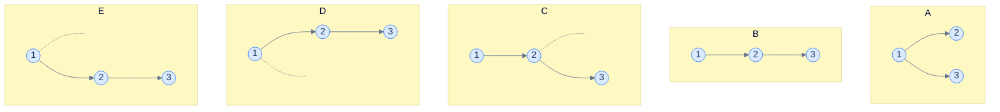
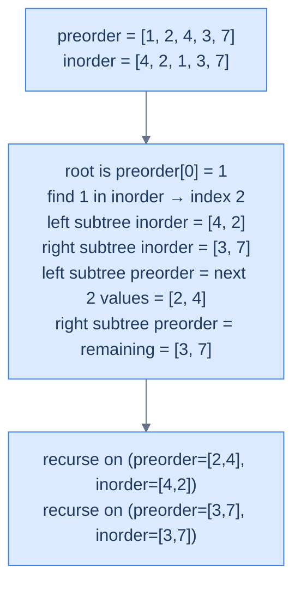
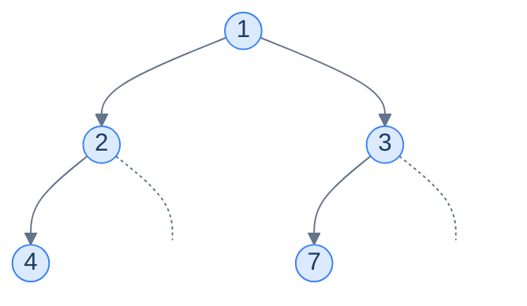
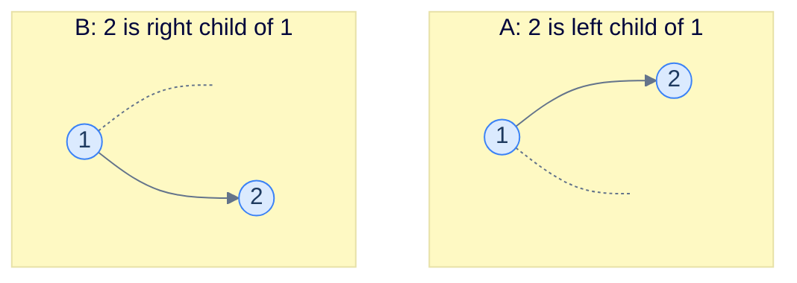

# 6. Constructing a Binary Tree

## The Hook

The previous two lessons taught us how to *flatten* a tree into a one-dimensional sequence — preorder, inorder, postorder, level-order. Each traversal turns the tree into a list of values. Now we run the question backwards: **given the list, can we recover the tree?**

It would be amazing if a single traversal sufficed. *It does not* — and the proof is short. Different trees can have *identical* traversals when only one ordering is used. Show someone a preorder sequence and they can build *several* different trees that produce it; show them an inorder sequence and the situation is even worse (you can't even identify which value is the root). Postorder shares preorder's problem from the other end. Each ordering, alone, throws away information that *cannot* be recovered.

But — and here is the magic — *any two of these traversals together*, combined with one of them being inorder, **uniquely determine the tree**. Pre+in, post+in: each pair gives you exactly one tree, no ambiguity. The construction is a beautiful divide-and-conquer recursion: pre/postorder tells you who the root is; inorder tells you which values fell on the left of that root and which on the right; recurse on the two halves; done.

This is more than a theoretical curiosity. *Tree serialisation* — the process of turning a tree into a sequence so it can be sent over a network or written to disk — relies on this idea. So does *deserialisation* (the reverse). Many compilers and editors store ASTs as a *pair* of preorder + inorder dumps, then rebuild on load. The "list of nodes" you see when you `JSON.stringify` a parser's AST is, structurally, a serialised traversal — and the loader function is what we're about to build.

This lesson explains why no single traversal is enough, walks through *why* pre+in and post+in pair up to determine the tree uniquely, and implements both reconstruction algorithms in Python and Java. By the end you'll be able to build trees from traversals on demand — a frequent interview problem and a building block we'll lean on later.

---

## Table of contents

1. [Why one traversal is not enough](#why-one-traversal-is-not-enough)
2. [Why two traversals (with inorder) suffice](#why-two-traversals-with-inorder-suffice)
3. [Construction from preorder + inorder](#construction-from-preorder--inorder)
4. [Construction from postorder + inorder](#construction-from-postorder--inorder)
5. [What about preorder + postorder?](#what-about-preorder--postorder)
6. [Understanding the problem](#understanding-the-problem)
7. [Supported operations](#supported-operations)
8. [Internal mechanics](#internal-mechanics)
9. [Working example](#working-example)
10. [Edge cases and pitfalls](#edge-cases-and-pitfalls)
11. [Production reality](#production-reality)
12. [Quiz](#quiz)
13. [Practice ladder](#practice-ladder)
14. [Further reading](#further-reading)
15. [Cross-links](#cross-links)
16. [Final takeaway](#final-takeaway)

***

# Why one traversal is not enough

Consider this preorder sequence: **`[1, 2, 3]`**.

How many distinct binary trees produce that preorder? At least *five*:



<p align="center"><strong>Five different trees, all with the same preorder <code>[1, 2, 3]</code>. Preorder fixes the order in which values are <em>visited</em>, but says nothing about whether the next value is the current node's left child, the current node's right child, or some ancestor's right child. The shape is genuinely ambiguous.</strong></p>

The root of *every* tree above is `1` — that part is unambiguous (preorder visits the root first). But after that, `2` could be `1`'s left child, or `1`'s right child (if `1` has no left). And `3` could be `2`'s left child, `2`'s right child, *or* `1`'s right child. The decision at each step is unconstrained.

## Inorder alone is even worse

For inorder, **you can't even identify the root**. Given `[4, 2, 1, 3, 7]`, where's the root? Anywhere. The root could be `4` (with `[]` to the left and `[2, 1, 3, 7]` to the right); or `2` (with `[4]` to the left and `[1, 3, 7]` to the right); or any of the others. Without more information, every value is equally plausible.

## Postorder alone has the same problem as preorder

Symmetrically, postorder *visits the root last* — so you know the root, but the rest of the sequence is ambiguous in the same way preorder's tail is.

## Level-order alone

Level-order at least identifies the root (always first), and identifies the children of each level — but it can't distinguish whether a node has a missing left child or a missing right child *unless null markers are explicitly included*. The standard "compact" level-order serialisation (no nulls) still leaves shape ambiguous; the "verbose" form (with nulls) is unambiguous but uses extra space proportional to the number of `null` markers.

> *Predict before reading on — for the preorder <code>[1, 2, 3]</code>, what does adding the inorder <code>[2, 1, 3]</code> uniquely tell us?*
>
> The root is `1` (from preorder's first element). In the inorder, `1` appears at index 1 — so `[2]` is the left subtree and `[3]` is the right subtree. That uniquely picks out **Tree A** from our five candidates above. Combining the two orderings turned five possibilities into one — the entire idea of this lesson.

***

# Why two traversals (with inorder) suffice

The recipe is the same for both pre+in and post+in. Here's the high-level recursion for **preorder + inorder**:

> 1. The **first** value in the *current preorder slice* is the root of the *current subtree*.
> 2. Find that root in the *current inorder slice*. Everything to its **left** in the inorder slice is the *left subtree*; everything to its **right** is the *right subtree*.
> 3. Recurse on the left subtree (using the matching prefix of the preorder slice).
> 4. Recurse on the right subtree (using the matching suffix of the preorder slice).

The *crux* is the inorder split: it tells you exactly *which* values belong to the left subtree and *which* to the right. Without it, you'd have to guess; with it, you can divide the sub-problem into two halves of *exactly the right shape*.

For **postorder + inorder**, the recipe is mirrored: postorder visits the root *last*, so the root of the current subtree is the *last* element of the postorder slice. Once you know the root, the inorder split works the same way.



<p align="center"><strong>One step of the recursion — the preorder front gives the current root; the inorder split gives the left and right subtree boundaries. The matching slice of the preorder array is recovered by counting (the left subtree's preorder slice has the same length as the left subtree's inorder slice).</strong></p>

> **Why must one of the two be inorder?** Because *only* inorder lets you cleanly *partition* the array around the root. Pre+post (without inorder) tells you the root from both ends but gives you no partition — you can match a value across the two arrays but you can't tell which children are on the left vs right of the root.

***

# Construction from preorder + inorder

Let's tighten the algorithm into one we can implement.

<details>
<summary><h2>Algorithm</h2></summary>


We use two helpers: a *moving index* into the preorder array (the next root to consume), and a *range* `[inStart, inEnd]` describing which slice of the inorder array we're working with.

> **Algorithm**
>
> -   **Step 1:** Initialise `preIndex = 0`. Call `build(0, len(inorder) − 1)`.
> -   **Step 2:** `build(inStart, inEnd)`:
>     -   If `inStart > inEnd`, return `null` (empty subtree).
>     -   `rootVal = preorder[preIndex]`; `preIndex++`.
>     -   Create `node = TreeNode(rootVal)`.
>     -   Find `idx`, the index of `rootVal` in `inorder[inStart..inEnd]`.
>     -   `node.left  = build(inStart, idx − 1)`.
>     -   `node.right = build(idx + 1, inEnd)`.
>     -   Return `node`.

The `preIndex` advances **before** the recursive calls, and the order matters: the left subtree consumes preorder values *first* (because it's traversed first), then the right subtree.

</details>
<details>
<summary><h2>A subtlety — speeding up the lookup</h2></summary>


The implementation below uses a `find_index` helper that does a **linear scan** of `inorder[inStart..inEnd]` to locate the root — straightforward, but it makes the worst case **O(N²)** for a skew tree. For interview-quality solutions you can build a **value → index** hash map of the inorder array up front, making each lookup O(1) and the whole construction **O(N)**. We show the simple linear-scan version for clarity; swapping `find_index` for a pre-built map is the one change needed to reach O(N).

> *Predict before reading on — what's the complexity if you skip the hash map?*
>
> Worst case **O(N²)** — a skew tree forces every recursive call's `find_index` to scan O(N) of the array. The hash map fix makes that lookup O(1) and the overall complexity falls to O(N) — but the recursive partitioning still uses O(h) call-stack space.

</details>
<details>
<summary><h2>Worked example</h2></summary>


> Preorder: `[1, 2, 4, 3, 7]`
> Inorder:  `[4, 2, 1, 3, 7]`

| Call                         | preIndex | rootVal | idx in inorder | inStart..inEnd | Result        |
|------------------------------|----------|---------|----------------|----------------|---------------|
| `build(0, 4)` (whole tree)   | 0        | 1       | 2              | 0..4           | root          |
| `build(0, 1)` (left of 1)    | 1        | 2       | 1              | 0..1           | left subtree  |
| `build(0, 0)` (left of 2)    | 2        | 4       | 0              | 0..0           | leaf 4        |
| `build(0, −1)` (left of 4)   | 3        | —       | —              | empty          | `null`        |
| `build(1, 0)` (right of 4)   | 3        | —       | —              | empty          | `null`        |
| `build(2, 1)` (right of 2)   | 3        | —       | —              | empty          | `null`        |
| `build(3, 4)` (right of 1)   | 3        | 3       | 3              | 3..4           | right subtree |
| `build(3, 2)` (left of 3)    | 4        | —       | —              | empty          | `null`        |
| `build(4, 4)` (right of 3)   | 4        | 7       | 4              | 4..4           | leaf 7        |

Final tree:



</details>
<details>
<summary><h2>Solution &amp; Analysis</h2></summary>

### Implementation

```python run viz=binary-tree viz-root=root
from typing import Optional, List, Any
from collections import deque


class TreeNode:
    def __init__(self, val=0, left=None, right=None):
        self.val = val
        self.left = left
        self.right = right


def to_level_order(root):
    """Serialize tree to level-order list with None for missing children."""
    if not root:
        return []
    result = []
    queue = deque([root])
    while queue:
        node = queue.popleft()
        if node:
            result.append(node.val)
            queue.append(node.left)
            queue.append(node.right)
        else:
            result.append(None)
    # Trim trailing Nones
    while result and result[-1] is None:
        result.pop()
    return result


class Solution:
    def __init__(self):

        # Global variable to keep track of the current index in the
        # preorder traversal
        self.pre_ind: int = 0

    # Helper function to find the index of a given value in the inorder
    # traversal
    def find_index(
        self, inorder: List[int], start: int, end: int, val: int
    ) -> int:
        for i in range(start, end + 1):
            if inorder[i] == val:
                return i

        # If the value is not found in the inorder array, return the
        # start index
        return start

    def build_tree(
        self,
        inorder: List[int],
        in_start: int,
        in_end: int,
        preorder: List[int],
    ) -> Optional[TreeNode]:

        # Base case: if the inorder range is empty, return None to
        # indicate an empty subtree
        if in_start > in_end:
            return None

        # Create a new node using the current value from the preorder
        # traversal
        current_node: TreeNode = TreeNode(preorder[self.pre_ind])

        # Find the index of the current value in the inorder traversal
        index = self.find_index(
            inorder, in_start, in_end, preorder[self.pre_ind]
        )

        # Move to the next value in the preorder traversal
        self.pre_ind += 1

        # Recursively construct the left and right subtrees using the
        # appropriate ranges of the inorder and preorder traversals
        current_node.left = self.build_tree(
            inorder, in_start, index - 1, preorder
        )
        current_node.right = self.build_tree(
            inorder, index + 1, in_end, preorder
        )

        # Return the current node, which is the root of the constructed
        # subtree
        return current_node

    def preorder_and_inorder_reconstruction(
        self, preorder: List[int], inorder: List[int]
    ) -> Optional[TreeNode]:

        # Call the recursive build_tree function with the entire ranges
        # of inorder and preorder traversals
        return self.build_tree(inorder, 0, len(inorder) - 1, preorder)


# Examples from the problem statement
r1 = Solution().preorder_and_inorder_reconstruction([1, 2, 4, 3, 7, 9], [4, 2, 1, 3, 9, 7])
print(to_level_order(r1))  # [1, 2, 3, 4, None, None, 7, None, None, 9]

r2 = Solution().preorder_and_inorder_reconstruction([1, 8, 6, 4], [8, 6, 1, 4])
print(to_level_order(r2))  # [1, 8, 4, None, 6]

# Edge cases
r3 = Solution().preorder_and_inorder_reconstruction([], [])
print(to_level_order(r3))  # []

r4 = Solution().preorder_and_inorder_reconstruction([1], [1])
print(to_level_order(r4))  # [1]

r5 = Solution().preorder_and_inorder_reconstruction([1, 2, 3], [1, 2, 3])
print(to_level_order(r5))  # [1, None, 2, None, 3]

r6 = Solution().preorder_and_inorder_reconstruction([1, 2, 3], [3, 2, 1])
print(to_level_order(r6))  # [1, 2, None, 3]

r7 = Solution().preorder_and_inorder_reconstruction([4, 2, 1, 3, 6, 5, 7], [1, 2, 3, 4, 5, 6, 7])
print(to_level_order(r7))  # [4, 2, 6, 1, 3, 5, 7]
```

```java run viz=binary-tree viz-root=root
import java.util.*;

public class Main {
    static class TreeNode {
        int val;
        TreeNode left;
        TreeNode right;
        TreeNode() {}
        TreeNode(int val) { this.val = val; }
    }

    static List<Integer> toLevelOrder(TreeNode root) {
        List<Integer> result = new ArrayList<>();
        if (root == null) return result;
        Deque<TreeNode> queue = new ArrayDeque<>();
        queue.add(root);
        while (!queue.isEmpty()) {
            TreeNode node = queue.poll();
            if (node != null) {
                result.add(node.val);
                queue.add(node.left);
                queue.add(node.right);
            } else {
                result.add(null);
            }
        }
        while (!result.isEmpty() && result.get(result.size() - 1) == null) {
            result.remove(result.size() - 1);
        }
        return result;
    }

    static class Solution {

        // Global variable to keep track of the current index in the preorder
        // traversal
        private int preInd = 0;

        // Helper function to find the index of a given value in the inorder
        // traversal
        private int findIndex(int[] inorder, int start, int end, int val) {
            for (int i = start; i <= end; i++) {
                if (inorder[i] == val) {
                    return i;
                }
            }

            // If the value is not found in the inorder array, return the
            // start index
            return start;
        }

        private TreeNode buildTree(
            int[] inorder,
            int inStart,
            int inEnd,
            int[] preorder
        ) {

            // Base case: if the inorder range is empty, return null to
            // indicate an empty subtree
            if (inStart > inEnd) {
                return null;
            }

            // Create a new node using the current value from the preorder
            // traversal
            TreeNode currentNode = new TreeNode(preorder[preInd]);

            // Find the index of the current value in the inorder traversal
            int index = findIndex(inorder, inStart, inEnd, preorder[preInd]);

            // Move to the next value in the preorder traversal
            preInd++;

            // Recursively construct the left and right subtrees using the
            // appropriate ranges of the inorder and preorder traversals
            currentNode.left = buildTree(
                inorder,
                inStart,
                index - 1,
                preorder
            );
            currentNode.right = buildTree(
                inorder,
                index + 1,
                inEnd,
                preorder
            );

            // Return the current node, which is the root of the constructed
            // subtree
            return currentNode;
        }

        public TreeNode preorderAndInorderReconstruction(
            int[] preorder,
            int[] inorder
        ) {

            // Call the recursive buildTree function with the entire ranges
            // of inorder and preorder traversals
            return buildTree(inorder, 0, inorder.length - 1, preorder);
        }
    }

    public static void main(String[] args) {
        // Examples from the problem statement
        System.out.println(toLevelOrder(new Solution().preorderAndInorderReconstruction(
            new int[]{1, 2, 4, 3, 7, 9}, new int[]{4, 2, 1, 3, 9, 7})));  // [1, 2, 3, 4, null, null, 7, null, null, 9]

        System.out.println(toLevelOrder(new Solution().preorderAndInorderReconstruction(
            new int[]{1, 8, 6, 4}, new int[]{8, 6, 1, 4})));               // [1, 8, 4, null, 6]

        // Edge cases
        System.out.println(toLevelOrder(new Solution().preorderAndInorderReconstruction(
            new int[]{}, new int[]{})));                                     // []

        System.out.println(toLevelOrder(new Solution().preorderAndInorderReconstruction(
            new int[]{1}, new int[]{1})));                                   // [1]

        System.out.println(toLevelOrder(new Solution().preorderAndInorderReconstruction(
            new int[]{1, 2, 3}, new int[]{1, 2, 3})));                      // [1, null, 2, null, 3]

        System.out.println(toLevelOrder(new Solution().preorderAndInorderReconstruction(
            new int[]{1, 2, 3}, new int[]{3, 2, 1})));                      // [1, 2, null, 3]

        System.out.println(toLevelOrder(new Solution().preorderAndInorderReconstruction(
            new int[]{4, 2, 1, 3, 6, 5, 7}, new int[]{1, 2, 3, 4, 5, 6, 7})));  // [4, 2, 6, 1, 3, 5, 7]
    }
}
```

### Complexity

The implementation above uses the linear-scan `find_index`, so:

- Each recursive call does an O(N) scan to find the root in the inorder slice → **O(N²) time** in the worst case (a skew tree).
- Swapping `find_index` for a pre-built **value → inorder index** hash map makes each lookup O(1) → **O(N) time**.
- Space: O(N) for the constructed tree, plus **O(h)** for the recursive call stack.

</details>

***

# Construction from postorder + inorder

The mirror image of the previous problem. Postorder visits the root *last*, so we walk *backwards* through the postorder array (or use a moving index that decrements).

A second mirror twist: when we discover the root and split the inorder into left/right halves, we then need to recurse into the **right** subtree *first* (because in postorder, the right subtree is processed *just before* the root). The left subtree's postorder values come *before* the right subtree's, so processing the right first lets us consume the postorder array from the back in the correct order.

<details>
<summary><h2>Algorithm</h2></summary>


> **Algorithm**
>
> -   **Step 1:** Initialise `postIndex = len(postorder) − 1`. Call `build(0, len(inorder) − 1)`.
> -   **Step 2:** `build(inStart, inEnd)`:
>     -   If `inStart > inEnd`, return `null`.
>     -   `rootVal = postorder[postIndex]`; `postIndex--`.
>     -   `node = TreeNode(rootVal)`.
>     -   Find `idx`, the index of `rootVal` in `inorder[inStart..inEnd]`.
>     -   `node.right = build(idx + 1, inEnd)`     ← right first!
>     -   `node.left  = build(inStart, idx − 1)`
>     -   Return `node`.

The "right first" reversal is the only structural difference from the pre+in version. Everything else (the linear-scan root lookup, the recursion, the complexity) is identical.

</details>
<details>
<summary><h2>Worked example</h2></summary>


> Postorder: `[4, 2, 7, 3, 1]`
> Inorder:   `[4, 2, 1, 3, 7]`

| Call                          | postIdx | rootVal | inorder split                          |
|-------------------------------|---------|---------|----------------------------------------|
| `build(0, 4)`                 | 4       | 1       | left `[4, 2]`, right `[3, 7]`          |
| `build(3, 4)` (right of 1)    | 3       | 3       | left `[]`, right `[7]`                 |
| `build(4, 4)` (right of 3)    | 2       | 7       | leaf                                   |
| `build(3, 2)` (left of 3)     | 1       | —       | empty → null                           |
| `build(0, 1)` (left of 1)     | 1       | 2       | left `[4]`, right `[]`                 |
| `build(1, 1)` (right of 2)    | 0       | —       | empty → null                           |
| `build(0, 0)` (left of 2)     | 0       | 4       | leaf                                   |

Result is the same tree as before — pre+in and post+in *both* uniquely reconstruct the same tree from the same input data.

</details>
<details>
<summary><h2>Solution &amp; Analysis</h2></summary>

### Implementation

The Python and Java versions in full; compared to the pre+in code, the only differences are `pre_ind` becomes `post_ind` (initialised to the *last* index and *decremented*) and the recursion order swaps to right-then-left.


```python run viz=binary-tree viz-root=root
from typing import Optional, List
from collections import deque


class TreeNode:
    def __init__(self, val=0, left=None, right=None):
        self.val = val
        self.left = left
        self.right = right


def to_level_order(root):
    """Serialize tree to level-order list with None for missing children."""
    if not root:
        return []
    result = []
    queue = deque([root])
    while queue:
        node = queue.popleft()
        if node:
            result.append(node.val)
            queue.append(node.left)
            queue.append(node.right)
        else:
            result.append(None)
    while result and result[-1] is None:
        result.pop()
    return result


class Solution:
    def __init__(self):

        # Global variable to keep track of the index in the postorder
        # traversal
        self.post_ind: int = 0

    def find_index(
        self, inorder: List[int], start: int, end: int, val: int
    ) -> int:

        # Helper function to find the index of a given value in the
        # inorder traversal
        for i in range(start, end + 1):
            if inorder[i] == val:
                return i

        # If the value is not found in the inorder array, return the
        # start index
        return start

    def build_tree(
        self,
        inorder: List[int],
        in_start: int,
        in_end: int,
        postorder: List[int],
    ) -> Optional[TreeNode]:

        # Base case: If the current inorder range is empty, return None
        if in_start > in_end:
            return None

        # Create a new node with the current postorder element
        current_node: TreeNode = TreeNode(postorder[self.post_ind])

        # Find the index of this element in inorder
        index = self.find_index(
            inorder, in_start, in_end, postorder[self.post_ind]
        )

        # Move to the next postorder element
        self.post_ind -= 1

        # Recursively build the right subtree with elements after the
        # current index in inorder
        current_node.right = self.build_tree(
            inorder, index + 1, in_end, postorder
        )

        # Recursively build the left subtree with elements before the
        # current index in inorder
        current_node.left = self.build_tree(
            inorder, in_start, index - 1, postorder
        )

        # Return the current node with its left and right subtrees
        # constructed
        return current_node

    def postorder_and_inorder_reconstruction(
        self, postorder: List[int], inorder: List[int]
    ) -> Optional[TreeNode]:

        # Initialize the post_ind to the last index of the postorder
        # traversal.
        self.post_ind = len(postorder) - 1

        # Call the helper function with the full range of inorder
        # traversal.
        return self.build_tree(inorder, 0, len(inorder) - 1, postorder)


# Examples from the problem statement
r1 = Solution().postorder_and_inorder_reconstruction([4, 2, 9, 7, 3, 1], [4, 2, 1, 3, 9, 7])
print(to_level_order(r1))  # [1, 2, 3, 4, None, None, 7, None, None, 9]

r2 = Solution().postorder_and_inorder_reconstruction([6, 8, 4, 1], [8, 6, 1, 4])
print(to_level_order(r2))  # [1, 8, 4, None, 6]

# Edge cases
r3 = Solution().postorder_and_inorder_reconstruction([], [])
print(to_level_order(r3))  # []

r4 = Solution().postorder_and_inorder_reconstruction([1], [1])
print(to_level_order(r4))  # [1]

r5 = Solution().postorder_and_inorder_reconstruction([3, 2, 1], [1, 2, 3])
print(to_level_order(r5))  # [1, None, 2, None, 3]

r6 = Solution().postorder_and_inorder_reconstruction([3, 2, 1], [3, 2, 1])
print(to_level_order(r6))  # [1, 2, None, 3]

r7 = Solution().postorder_and_inorder_reconstruction([1, 3, 2, 5, 7, 6, 4], [1, 2, 3, 4, 5, 6, 7])
print(to_level_order(r7))  # [4, 2, 6, 1, 3, 5, 7]
```

```java run viz=binary-tree viz-root=root
import java.util.*;

public class Main {
    static class TreeNode {
        int val;
        TreeNode left;
        TreeNode right;
        TreeNode() {}
        TreeNode(int val) { this.val = val; }
    }

    static List<Integer> toLevelOrder(TreeNode root) {
        List<Integer> result = new ArrayList<>();
        if (root == null) return result;
        Deque<TreeNode> queue = new ArrayDeque<>();
        queue.add(root);
        while (!queue.isEmpty()) {
            TreeNode node = queue.poll();
            if (node != null) {
                result.add(node.val);
                queue.add(node.left);
                queue.add(node.right);
            } else {
                result.add(null);
            }
        }
        while (!result.isEmpty() && result.get(result.size() - 1) == null) {
            result.remove(result.size() - 1);
        }
        return result;
    }

    static class Solution {

        // Global variable to keep track of the index in the postorder
        // traversal
        private int postInd;

        // Helper function to find the index of a given value in the inorder
        // traversal
        private int findIndex(int[] inorder, int start, int end, int val) {
            for (int i = start; i <= end; i++) {
                if (inorder[i] == val) {
                    return i;
                }
            }

            // If the value is not found in the inorder array, return the
            // start index
            return start;
        }

        private TreeNode buildTree(
            int[] inorder,
            int inStart,
            int inEnd,
            int[] postorder
        ) {

            // Base case: If the current inorder range is empty, return null
            if (inStart > inEnd) {
                return null;
            }

            // Create a new node with the current postorder element
            TreeNode currentNode = new TreeNode(postorder[postInd]);

            // Find the index of this element in inorder
            int index = findIndex(
                inorder,
                inStart,
                inEnd,
                postorder[postInd]
            );

            // Move to the next postorder element
            postInd--;

            // Recursively build the right subtree with elements after the
            // current index in inorder
            currentNode.right = buildTree(
                inorder,
                index + 1,
                inEnd,
                postorder
            );

            // Recursively build the left subtree with elements before the
            // current index in inorder
            currentNode.left = buildTree(
                inorder,
                inStart,
                index - 1,
                postorder
            );

            // Return the current node with its left and right subtrees
            // constructed
            return currentNode;
        }

        public TreeNode postorderAndInorderReconstruction(
            int[] postorder,
            int[] inorder
        ) {

            // Initialize the postInd to the last index of the postorder
            // traversal.
            postInd = postorder.length - 1;

            // Call the helper function with the full range of inorder
            // traversal.
            return buildTree(inorder, 0, inorder.length - 1, postorder);
        }
    }

    public static void main(String[] args) {
        // Examples from the problem statement
        System.out.println(toLevelOrder(new Solution().postorderAndInorderReconstruction(
            new int[]{4, 2, 9, 7, 3, 1}, new int[]{4, 2, 1, 3, 9, 7})));  // [1, 2, 3, 4, null, null, 7, null, null, 9]

        System.out.println(toLevelOrder(new Solution().postorderAndInorderReconstruction(
            new int[]{6, 8, 4, 1}, new int[]{8, 6, 1, 4})));               // [1, 8, 4, null, 6]

        // Edge cases
        System.out.println(toLevelOrder(new Solution().postorderAndInorderReconstruction(
            new int[]{}, new int[]{})));                                     // []

        System.out.println(toLevelOrder(new Solution().postorderAndInorderReconstruction(
            new int[]{1}, new int[]{1})));                                   // [1]

        System.out.println(toLevelOrder(new Solution().postorderAndInorderReconstruction(
            new int[]{3, 2, 1}, new int[]{1, 2, 3})));                      // [1, null, 2, null, 3]

        System.out.println(toLevelOrder(new Solution().postorderAndInorderReconstruction(
            new int[]{3, 2, 1}, new int[]{3, 2, 1})));                      // [1, 2, null, 3]

        System.out.println(toLevelOrder(new Solution().postorderAndInorderReconstruction(
            new int[]{1, 3, 2, 5, 7, 6, 4}, new int[]{1, 2, 3, 4, 5, 6, 7})));  // [4, 2, 6, 1, 3, 5, 7]
    }
}
```

### Complexity

Identical to pre+in: **O(N²) time** in the worst case with the linear-scan lookup (O(N) if you swap in an inorder hash map); **O(N)** space for the tree plus **O(h)** for the recursion.

</details>

***

# What about preorder + postorder?

A natural question: if pre+in works and post+in works, what about **pre+post** without inorder?

The answer is *almost* — but with a catch. Pre+post **uniquely determines the tree only when every internal node has exactly two children** (a *full binary tree*). For trees that have any node with only one child, pre+post is ambiguous.

Why? Consider these two trees:



Both trees have **preorder `[1, 2]`** and **postorder `[2, 1]`** — so the pair cannot distinguish them. The reason inorder works (and the others don't) is that *only* inorder reveals the *left/right split* around the root; pre+post both visit the root at known positions but neither tells you, for a single-child node, *which side* the child is on.

So in practice: prefer pre+in or post+in, and fall back to pre+post only if you know for certain the tree is full.

***

# Understanding the Problem

Traversal flattens a tree into a sequence; construction runs that arrow backwards. The previous two lessons produced preorder, inorder, and postorder lists *from* a tree. This lesson asks the inverse: given the list, recover the exact tree it came from. That inverse is only well-posed when the input carries enough information to fix the tree's shape, and a single traversal never does.

The gap is structural, not algorithmic. A traversal records the *order* nodes are visited but discards most of the *shape*:

- **Preorder** names the root first, then leaves every parent-child split unconstrained.
- **Inorder** hides the root entirely — any value could be the root with the rest partitioned around it.
- **Postorder** names the root last, but its tail is as ambiguous as preorder's.

The first two body sections prove this precisely. "[Why one traversal is not enough](#why-one-traversal-is-not-enough)" shows five distinct trees sharing the preorder `[1, 2, 3]`; "[Why two traversals (with inorder) suffice](#why-two-traversals-with-inorder-suffice)" shows why adding inorder collapses those five to one. So the key idea is: reconstruction is solvable exactly when you can identify the root *and* split the remaining values into a left group and a right group — one traversal gives the first half of that, never the second.

***

# Supported Operations

There is one operation, run in three pairings: take two traversal sequences and return the unique tree that produces both. The pairing decides whether the problem is solvable and how the recursion is steered. The two construction sections above are the two solvable cases worked in full; this table is their synthesis, not a new claim.

| Pairing | Root comes from | Solvable? | Time | Space |
|---|---|---|---|---|
| Preorder + inorder | first preorder value | always | `O(N²)` scan / `O(N)` map | `O(N)` tree + `O(h)` stack |
| Postorder + inorder | last postorder value | always | `O(N²)` scan / `O(N)` map | `O(N)` tree + `O(h)` stack |
| Preorder + postorder | both ends | only if every node is full | — | — |
| Any single traversal | — | never | — | — |

The two `inorder` pairings are duals: "[Construction from preorder + inorder](#construction-from-preorder--inorder)" marches a `preIndex` forward and recurses left-then-right, while "[Construction from postorder + inorder](#construction-from-postorder--inorder)" marches a `postIndex` backward and recurses right-then-left. Both hand the root to the inorder split, which carves the current slice into a left subtree and a right subtree. So the core insight is: inorder is the load-bearing member of any solvable pair, because it is the only ordering that reveals the left/right partition around the root — "[What about preorder + postorder?](#what-about-preorder--postorder)" shows the pair without it failing on single-child nodes.

***

# Internal Mechanics

The recursion *is* the mechanism, and "[Why two traversals (with inorder) suffice](#why-two-traversals-with-inorder-suffice)" lays out its skeleton: take the root from one array, split the inorder slice around it, recurse on the two halves. Three facts about how that skeleton runs explain both the complexity and the one slow step.

- **The pre/post index is a one-way cursor.** A single moving index walks the preorder array forward (or the postorder array backward), handing out one root per recursive call. Because it advances *before* the recursive calls, the side that recurses first consumes its roots first — left-then-right for pre+in, right-then-left for post+in.
- **The inorder split is the partition.** Locating the root inside `inorder[inStart..inEnd]` divides the slice in two: everything left of that index is the left subtree, everything right is the right subtree. The length of the left slice tells the recursion exactly how many of the next array values belong to the left child.
- **The base case is the empty slice.** When `inStart > inEnd`, the slice is empty, so the subtree is `null`. Every branch shrinks toward this boundary, which is what guarantees termination.

The slow step is finding the root in the inorder slice. The frozen `find_index` helper does a **linear scan**, which costs `O(N)` per call and degrades the whole build to `O(N²)` time on a skew tree — the "[A subtlety — speeding up the lookup](#construction-from-preorder--inorder)" note above quantifies this. To make this concrete: a pre-built **value → inorder index** hash map turns each lookup into `O(1)`, dropping construction to `O(N)` time. So the core insight is: each node is created exactly once, so the algorithm is fundamentally `O(N)`; the only thing standing between you and that bound is how fast you locate the root in the inorder slice, and a hashmap index closes the gap. Space stays `O(N)` for the constructed tree plus `O(h)` for the recursion stack regardless.

***

# Working Example

The worked tables inside the two construction sections trace *which* node each call produces. This trace shows *why* the inorder split steers the recursion, by following the pre+in build of one small tree slice by slice. Use the same input as the pre+in worked example:

```
preorder = [1, 2, 4, 3, 7]
inorder  = [4, 2, 1, 3, 7]
```

Read each line as one `build(inStart, inEnd)` call. The `pre→` column is the value `preIndex` hands over as the root before it advances; the split columns are the inorder slices the root carves out:

```
call              pre→  root   inorder slice    left slice   right slice
build(0,4)        1     1      [4,2,1,3,7]      [4,2]        [3,7]
  build(0,1)      2     2      [4,2]            [4]          []
    build(0,0)    4     4      [4]              []           []
      build(0,-1) —     null   []               —            —
      build(1,0)  —     null   []               —            —
    build(2,1)    —     null   []               —            —
  build(3,4)      3     3      [3,7]            []           [7]
    build(3,2)    —     null   []               —            —
    build(4,4)    7     7      [7]              []           []
```

The roots come out in preorder — `1, 2, 4, 3, 7` — exactly the order `preIndex` reads them. Each non-empty call splits its inorder slice at the root: `1` splits `[4,2,1,3,7]` into left `[4,2]` and right `[3,7]`, and the left slice's length (`2`) tells the recursion that the next two preorder values, `2` and `4`, form the left subtree. The reconstructed tree is:

```
        1
       / \
      2   3
     /     \
    4       7
```

So the core insight is: the pre/post array decides *who* the root is, and the inorder split decides *which values fall on each side* — neither alone is enough, but together every call partitions cleanly into two smaller calls until the slices empty out.

***

# Edge Cases and Pitfalls

The recursion is short, so the bugs cluster at the boundaries: the cursor direction, the recursion order, and the assumption that any input is reconstructable. The per-section worked examples above cover the *happy path*; this list is the consolidated trap sheet to keep open the first time a reconstruction returns the wrong tree.

- **Wrong recursion order for postorder.** Pre+in recurses left-then-right; post+in must recurse **right-then-left**. Postorder processes the right subtree immediately before the root, so a backward cursor meets right-subtree roots first. Recursing left-first with a decrementing `postIndex` builds a mirror-image tree with no crash — the output looks plausible and is wrong.
- **Cursor advanced after the recursion instead of before.** The pre/post index must advance *before* the two recursive calls, so each call claims its root and leaves the rest for its children. Advancing it after the calls hands the same value to multiple nodes and corrupts the whole subtree.
- **Linear-scan lookup on a skew tree.** The frozen `find_index` scans `O(N)` of the inorder slice per call, so a one-sided tree of `N` nodes costs `O(N²)` time overall. A pre-built value → index hash map fixes this in one line, dropping it to `O(N)`; reach for it whenever inputs can be large or adversarial.
- **Duplicate values break the inorder lookup.** The whole method assumes values are distinct, because it locates the root by *value* in the inorder slice. With duplicates, the lookup can land on the wrong copy and split the slice incorrectly. Reconstruction from traversals is only well-defined for trees with unique node values.
- **Trying to reconstruct from a single traversal.** One ordering can never fix the shape — preorder leaves child positions free, inorder hides the root, postorder mirrors preorder. Code that attempts it returns one arbitrary tree from many candidates, as the five-tree diagram above shows.
- **Reaching for pre+post on a non-full tree.** Preorder plus postorder pins down a unique tree *only* when every internal node has two children. On a single-child node the pair cannot tell which side the child sits on, so it silently returns one of two trees. Prefer a pairing that includes inorder unless the tree is known to be full.

So the key idea is: the three-line recursion rarely breaks, so every pitfall is a boundary question — is the cursor moving the right way and advancing at the right moment, are the values unique, and does the chosen traversal pair actually determine the tree? Confirm those four and the reconstruction is exact.

***

# Production Reality

Reconstruction from a flattened sequence is what every "save a tree, load it back" path does under the hood. The systems below are worth knowing by the traversal pair they persist and rebuild from.

**[Tree serialisation / deserialisation libraries]** — uses **preorder-with-null-markers reconstruction** — because writing the root before its subtrees lets the loader rebuild each parent before attaching the children it owns, recovering the exact shape in `O(N)` time.

**[Compiler and IDE AST caches]** — uses **preorder + inorder dumps rebuilt on load** — because reparsing source is expensive, so the toolchain persists two traversals and reconstructs the parse tree in `O(N)` instead.

**[Document and scene-graph formats (DOM snapshots, glTF node trees)]** — uses **preorder reconstruction with explicit child counts** — because a depth-first dump that records each node's child count lets the reader rebuild the hierarchy in a single linear pass.

**[Distributed key-value stores with Merkle trees]** — uses **postorder reconstruction** — because a parent hash is computed from its children's hashes, so the children must be rebuilt and hashed before the parent, which is exactly postorder.

**[Interview and competitive-programming judges]** — uses **preorder + inorder or postorder + inorder reconstruction** — because the "build the tree from two traversals" problem is a standard test of whether a candidate can turn the divide-and-conquer recursion into correct code under time pressure.

***

# Quiz

Test your grip before moving on. Commit to an answer before revealing it.

**[Recall] Q: Which single traversal, on its own, fails even to identify the root of the tree?**
Inorder — it visits the root somewhere in the middle, so any value could be the root with the rest partitioned around it.

**[Recall] Q: In preorder + inorder reconstruction, which array gives the root of the current subtree, and which gives the left/right split?**
The next preorder value is the root, and its index in the inorder slice splits that slice into the left subtree (values before it) and the right subtree (values after it).

**[Reasoning] Q: Why must postorder + inorder reconstruction recurse into the right subtree before the left?**
Postorder lists the right subtree's nodes immediately before the root, so a backward-moving cursor meets right-subtree roots first, and recursing right-first consumes the postorder array in the order the roots appear.

**[Reasoning] Q: Why does preorder + postorder fail to reconstruct a tree with a single-child node?**
Both orderings place the root at a known end, but neither reveals which side a lone child sits on, so a node with one child is indistinguishable from its mirror — the pair only works when every internal node is full.

**[Tradeoff] Q: When is the linear-scan `find_index` acceptable, and when must you switch to a hashmap index?**
The linear scan is fine for small or balanced inputs where `O(N²)` is negligible, but switch to an `O(1)` hashmap index — making the build `O(N)` time, `O(N)` space — whenever inputs are large or could be skewed.

***

# Practice Ladder

Five problems to turn "take a root, split around it, recurse on the halves" into a reflex. None is a reconstruction problem outright — those live later — but each drills a sub-skill construction leans on: divide-and-conquer over subtrees, lockstep recursion, and the full-vs-non-full distinction behind the pre+post caveat. Try each unaided; reach for the hint after ten minutes; do not peek at solutions until you have written something runnable.

| # | Problem | Pattern | Difficulty | Hint |
|---|---------|---------|------------|------|
| 1 | [Height of a Binary Tree](/cortex/data-structures-and-algorithms/trees-binary-tree-pattern-postorder-traversal-stateless-problems-height-of-a-binary-tree) | [Postorder Traversal (Stateless)](/cortex/data-structures-and-algorithms/trees-binary-tree-pattern-postorder-traversal-stateless-pattern) | Easy | Return `-1` for a `null` node, else `1 + max(left, right)` — the same divide-the-tree-into-two-subtrees recursion `build` uses. `O(N)` time, `O(h)` space. |
| 2 | [Identical Trees](/cortex/data-structures-and-algorithms/trees-binary-tree-pattern-simultaneous-traversal-problems-identical-trees) | [Simultaneous Traversal](/cortex/data-structures-and-algorithms/trees-binary-tree-pattern-simultaneous-traversal-pattern) | Easy | Recurse into both trees in lockstep, comparing value and structure at each node — the mirror of building one tree from two arrays. `O(N)` time, `O(h)` space. |
| 3 | [Symmetry Detection](/cortex/data-structures-and-algorithms/trees-binary-tree-pattern-simultaneous-traversal-problems-symmetry-detection) | [Simultaneous Traversal](/cortex/data-structures-and-algorithms/trees-binary-tree-pattern-simultaneous-traversal-pattern) | Easy | Compare the left subtree against the right subtree's mirror — the left/right split awareness that makes the inorder partition work. `O(N)` time, `O(h)` space. |
| 4 | [Is It a Full Binary Tree](/cortex/data-structures-and-algorithms/trees-binary-tree-pattern-postorder-traversal-stateless-problems-is-it-a-full-binary-tree) | [Postorder Traversal (Stateless)](/cortex/data-structures-and-algorithms/trees-binary-tree-pattern-postorder-traversal-stateless-pattern) | Medium | A node is full when it has zero or two children; check this bottom-up — exactly the property pre+post reconstruction needs to be unambiguous. `O(N)` time, `O(h)` space. |
| 5 | [Subtree Detection](/cortex/data-structures-and-algorithms/trees-binary-tree-pattern-simultaneous-traversal-problems-subtree-detection) | [Simultaneous Traversal](/cortex/data-structures-and-algorithms/trees-binary-tree-pattern-simultaneous-traversal-pattern) | Medium | At each node of the big tree, test whether the small tree matches in lockstep from here — recursion that compares two structures node for node. `O(N·M)` time, `O(h)` space. |

Once these feel automatic, the recursive shape behind reconstruction — root, split, recurse — has stopped being a trick and become a reflex.

***

# Further Reading

Curated paths in, not a syllabus. Read in order of the annotation; come back for the rest when you need depth.

- **[Recursive Traversals in Binary Trees](/cortex/data-structures-and-algorithms/trees-binary-tree-recursive-traversals-in-binary-trees)**
  ★ Essential — the forward direction this lesson inverts; you must know how preorder, inorder, and postorder are produced before you can rebuild a tree from them.
- **[Iterative Traversals in Binary Trees](/cortex/data-structures-and-algorithms/trees-binary-tree-iterative-traversals-in-binary-trees)**
  ◆ Advanced — the same orderings driven by an explicit stack, useful when a deep skew tree would overflow the recursion that construction also relies on.
- **[CLRS — Section 10.4: Representing Rooted Trees](https://mitpress.mit.edu/9780262046305/introduction-to-algorithms/)**
  ◆ Advanced — the formal treatment of tree representations and the array/sequence encodings that serialisation and reconstruction build on.
- **[Insertion in Binary Trees](/cortex/data-structures-and-algorithms/trees-binary-tree-insertion-in-binary-trees)**
  → Reference — the next lesson; adding a single node to an existing tree, the operation construction repeats `N` times in disguise.
- **[Asymptotic Analysis](/cortex/data-structures-and-algorithms/foundations-asymptotic-analysis)**
  → Reference — what the `O(N²)` linear-scan versus `O(N)` hashmap-index distinction means precisely, and why the lookup cost dominates.

***

# Cross-Links

**Prerequisites**

- [Recursive Traversals in Binary Trees](/cortex/data-structures-and-algorithms/trees-binary-tree-recursive-traversals-in-binary-trees) — preorder, inorder, and postorder are the sequences this lesson reconstructs trees from.
- [Iterative Traversals in Binary Trees](/cortex/data-structures-and-algorithms/trees-binary-tree-iterative-traversals-in-binary-trees) — the explicit-stack view of the same orderings, and the overflow risk the reconstruction recursion shares.
- [Linked-List Implementation of Binary Trees](/cortex/data-structures-and-algorithms/trees-binary-tree-linked-list-implementation-of-binary-trees) — the `TreeNode` with `val`, `left`, and `right` that `build` allocates one node at a time.
- [Asymptotic Analysis](/cortex/data-structures-and-algorithms/foundations-asymptotic-analysis) — the meaning of the `O(N²)` versus `O(N)` and `O(h)` claims this lesson makes.

**What comes next**

- [Insertion in Binary Trees](/cortex/data-structures-and-algorithms/trees-binary-tree-insertion-in-binary-trees) — placing a single node into an existing tree, the operation that follows once you can build one from scratch.
- [Pattern: Simultaneous Traversal](/cortex/data-structures-and-algorithms/trees-binary-tree-pattern-simultaneous-traversal-pattern) — recursing through two trees in lockstep, the same two-input divide-and-conquer shape construction uses on two arrays.

***

## Final Takeaway

> *Coming up — the lessons that follow build on construction with <strong>insertion</strong> (adding a new node to an existing tree at a given position) and then dive into the <strong>11 binary-tree patterns</strong> that cover almost every interview question you'll see on this data structure: stateless and stateful preorder/postorder, root-to-leaf paths, level-order traversal, lowest common ancestor, simultaneous traversal of two trees, and a final practice mix. Each pattern is a recipe — once you've internalised the recursive shape from these first six lessons, the patterns are just <em>"what work do I do at the visit step?"</em> applied to specific problems.*

1. **Core mechanic:** take the root from one traversal (first of preorder, last of postorder), split the inorder slice around it into a left and right subtree, and recurse on the two halves until the slices empty.
2. **Dominant tradeoff:** you gain a unique tree from any pair that includes inorder, but you must carry both sequences and pay an inorder root-lookup per node — `O(N²)` time with a linear scan, `O(N)` time and `O(N)` space once a hashmap index makes the lookup `O(1)`.
3. **One thing to remember:** one traversal is never enough and inorder is always the indispensable half — it is the only ordering that reveals which values fall left of the root and which fall right.
