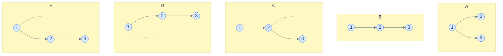
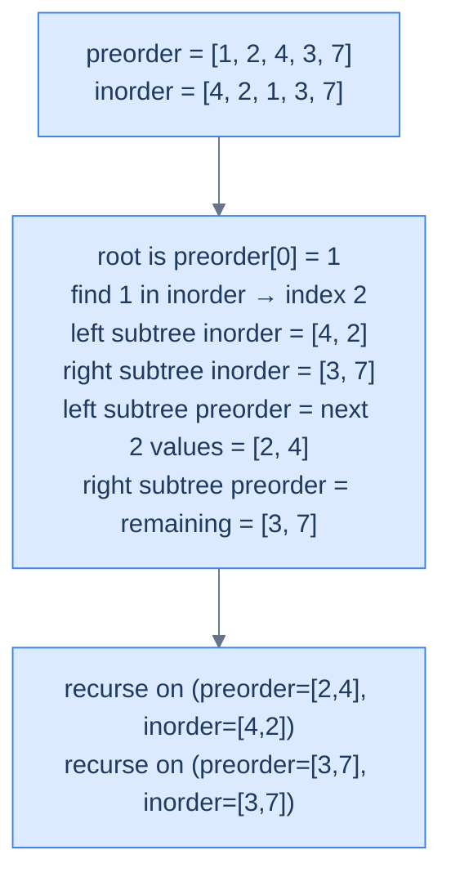
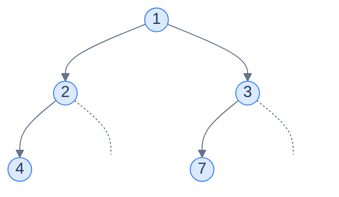
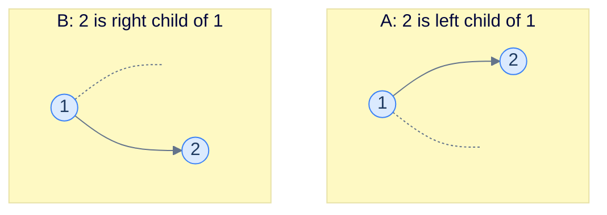

# 6. Constructing a Binary Tree

## The Hook

The previous two lessons taught us how to *flatten* a tree into a one-dimensional sequence — preorder, inorder, postorder, level-order. Each traversal turns the tree into a list of values. Now we run the question backwards: **given the list, can we recover the tree?**

It would be amazing if a single traversal sufficed. *It does not* — and the proof is short. Different trees can have *identical* traversals when only one ordering is used. Show someone a preorder sequence and they can build *several* different trees that produce it; show them an inorder sequence and the situation is even worse (you can't even identify which value is the root). Postorder shares preorder's problem from the other end. Each ordering, alone, throws away information that *cannot* be recovered.

But — and here is the magic — *any two of these traversals together*, combined with one of them being inorder, **uniquely determine the tree**. Pre+in, post+in: each pair gives you exactly one tree, no ambiguity. The construction is a beautiful divide-and-conquer recursion: pre/postorder tells you who the root is; inorder tells you which values fell on the left of that root and which on the right; recurse on the two halves; done.

This is more than a theoretical curiosity. *Tree serialisation* — the process of turning a tree into a sequence so it can be sent over a network or written to disk — relies on this idea. So does *deserialisation* (the reverse). Many compilers and editors store ASTs as a *pair* of preorder + inorder dumps, then rebuild on load. The "list of nodes" you see when you `JSON.stringify` a parser's AST is, structurally, a serialised traversal — and the loader function is what we're about to build.

This lesson explains why no single traversal is enough, walks through *why* pre+in and post+in pair up to determine the tree uniquely, and implements both reconstruction algorithms in 10 languages. By the end you'll be able to build trees from traversals on demand — a frequent interview problem and a building block we'll lean on later.

---

## Table of contents

1. [Why one traversal is not enough](#why-one-traversal-is-not-enough)
2. [Why two traversals (with inorder) suffice](#why-two-traversals-with-inorder-suffice)
3. [Construction from preorder + inorder](#construction-from-preorder--inorder)
4. [Construction from postorder + inorder](#construction-from-postorder--inorder)
5. [What about preorder + postorder?](#what-about-preorder--postorder)

***

# Why one traversal is not enough

Consider this preorder sequence: **`[1, 2, 3]`**.

How many distinct binary trees produce that preorder? At least *five*:



<p align="center"><strong>Five different trees, all with the same preorder <code>[1, 2, 3]</code>. Preorder fixes the order in which values are <em>visited</em>, but says nothing about whether the next value is the current node's left child, the current node's right child, or some ancestor's right child. The shape is genuinely ambiguous.</strong></p>

The root of *every* tree above is `1` — that part is unambiguous (preorder visits the root first). But after that, `2` could be `1`'s left child, or `1`'s right child (if `1` has no left). And `3` could be `2`'s left child, `2`'s right child, *or* `1`'s right child. The decision at each step is unconstrained.

## Inorder alone is even worse

For inorder, **you can't even identify the root**. Given `[4, 2, 1, 3, 7]`, where's the root? Anywhere. The root could be `4` (with `[]` to the left and `[2, 1, 3, 7]` to the right); or `2` (with `[4]` to the left and `[1, 3, 7]` to the right); or any of the others. Without more information, every value is equally plausible.

## Postorder alone has the same problem as preorder

Symmetrically, postorder *visits the root last* — so you know the root, but the rest of the sequence is ambiguous in the same way preorder's tail is.

## Level-order alone

Level-order at least identifies the root (always first), and identifies the children of each level — but it can't distinguish whether a node has a missing left child or a missing right child *unless null markers are explicitly included*. The standard "compact" level-order serialisation (no nulls) still leaves shape ambiguous; the "verbose" form (with nulls) is unambiguous but uses extra space proportional to the number of `null` markers.

> *Predict before reading on — for the preorder <code>[1, 2, 3]</code>, what does adding the inorder <code>[2, 1, 3]</code> uniquely tell us?*
>
> The root is `1` (from preorder's first element). In the inorder, `1` appears at index 1 — so `[2]` is the left subtree and `[3]` is the right subtree. That uniquely picks out **Tree A** from our five candidates above. Combining the two orderings turned five possibilities into one — the entire idea of this lesson.

***

# Why two traversals (with inorder) suffice

The recipe is the same for both pre+in and post+in. Here's the high-level recursion for **preorder + inorder**:

> 1. The **first** value in the *current preorder slice* is the root of the *current subtree*.
> 2. Find that root in the *current inorder slice*. Everything to its **left** in the inorder slice is the *left subtree*; everything to its **right** is the *right subtree*.
> 3. Recurse on the left subtree (using the matching prefix of the preorder slice).
> 4. Recurse on the right subtree (using the matching suffix of the preorder slice).

The *crux* is the inorder split: it tells you exactly *which* values belong to the left subtree and *which* to the right. Without it, you'd have to guess; with it, you can divide the sub-problem into two halves of *exactly the right shape*.

For **postorder + inorder**, the recipe is mirrored: postorder visits the root *last*, so the root of the current subtree is the *last* element of the postorder slice. Once you know the root, the inorder split works the same way.



<p align="center"><strong>One step of the recursion — the preorder front gives the current root; the inorder split gives the left and right subtree boundaries. The matching slice of the preorder array is recovered by counting (the left subtree's preorder slice has the same length as the left subtree's inorder slice).</strong></p>

> **Why must one of the two be inorder?** Because *only* inorder lets you cleanly *partition* the array around the root. Pre+post (without inorder) tells you the root from both ends but gives you no partition — you can match a value across the two arrays but you can't tell which children are on the left vs right of the root.

***

# Construction from preorder + inorder

Let's tighten the algorithm into one we can implement.

## Algorithm

We use two helpers: a *moving index* into the preorder array (the next root to consume), and a *range* `[inStart, inEnd]` describing which slice of the inorder array we're working with.

> **Algorithm**
>
> -   **Step 1:** Initialise `preIndex = 0`. Call `build(0, len(inorder) − 1)`.
> -   **Step 2:** `build(inStart, inEnd)`:
>     -   If `inStart > inEnd`, return `null` (empty subtree).
>     -   `rootVal = preorder[preIndex]`; `preIndex++`.
>     -   Create `node = TreeNode(rootVal)`.
>     -   Find `idx`, the index of `rootVal` in `inorder[inStart..inEnd]`.
>     -   `node.left  = build(inStart, idx − 1)`.
>     -   `node.right = build(idx + 1, inEnd)`.
>     -   Return `node`.

The `preIndex` advances **before** the recursive calls, and the order matters: the left subtree consumes preorder values *first* (because it's traversed first), then the right subtree.

## A subtlety — speeding up the lookup

The naive "find `rootVal` in `inorder[inStart..inEnd]`" is a linear scan, making the worst case **O(N²)** for a skew tree. For interview-quality solutions you can build a **value → index** hash map of the inorder array up front, making each lookup O(1) and the whole construction **O(N)**. We'll show both versions — the simple one for clarity, then noting where to drop in the map.

> *Predict before reading on — what's the complexity if you skip the hash map?*
>
> Worst case **O(N²)** — a skew tree forces every recursive call's "find root in inorder" to scan O(N) of the array. The hash map fix makes that lookup O(1) and the overall complexity falls to O(N) — but the recursive partitioning still uses O(h) call-stack space.

## Worked example

> Preorder: `[1, 2, 4, 3, 7]`
> Inorder:  `[4, 2, 1, 3, 7]`

| Call                         | preIndex | rootVal | idx in inorder | inStart..inEnd | Result        |
|------------------------------|----------|---------|----------------|----------------|---------------|
| `build(0, 4)` (whole tree)   | 0        | 1       | 2              | 0..4           | root          |
| `build(0, 1)` (left of 1)    | 1        | 2       | 1              | 0..1           | left subtree  |
| `build(0, 0)` (left of 2)    | 2        | 4       | 0              | 0..0           | leaf 4        |
| `build(0, −1)` (left of 4)   | 3        | —       | —              | empty          | `null`        |
| `build(1, 0)` (right of 4)   | 3        | —       | —              | empty          | `null`        |
| `build(2, 1)` (right of 2)   | 3        | —       | —              | empty          | `null`        |
| `build(3, 4)` (right of 1)   | 3        | 3       | 3              | 3..4           | right subtree |
| `build(3, 2)` (left of 3)    | 4        | —       | —              | empty          | `null`        |
| `build(4, 4)` (right of 3)   | 4        | 7       | 4              | 4..4           | leaf 7        |

Final tree:



## Implementation


```pseudocode
function buildPreIn(preorder, inorder):
    pos ← Map: value → index built from inorder   # O(1) root lookup
    preIdx ← 0
    function build(inStart, inEnd):
        if inStart > inEnd: return null
        rootVal ← preorder[preIdx]; preIdx ← preIdx + 1
        node ← TreeNode(rootVal)
        idx  ← pos[rootVal]                        # split inorder at root
        node.left  ← build(inStart, idx − 1)
        node.right ← build(idx + 1, inEnd)
        return node
    return build(0, length(inorder) − 1)
```

```python run
from typing import List, Optional

class TreeNode:
    def __init__(self, val=0, left=None, right=None):
        self.val, self.left, self.right = val, left, right

def build_pre_in(preorder: List[int], inorder: List[int]) -> Optional[TreeNode]:
    # Hash map for O(1) lookup
    pos = {v: i for i, v in enumerate(inorder)}
    pre_idx = 0
    def build(in_start: int, in_end: int) -> Optional[TreeNode]:
        nonlocal pre_idx
        if in_start > in_end: return None
        root_val = preorder[pre_idx]; pre_idx += 1
        node = TreeNode(root_val)
        idx  = pos[root_val]
        node.left  = build(in_start, idx - 1)
        node.right = build(idx + 1, in_end)
        return node
    return build(0, len(inorder) - 1)

# preorder = [1, 2, 4, 3, 7], inorder = [4, 2, 1, 3, 7]
root = build_pre_in([1, 2, 4, 3, 7], [4, 2, 1, 3, 7])
# verify with inorder traversal
def inorder(n):
    return [] if n is None else inorder(n.left) + [n.val] + inorder(n.right)
print(inorder(root))    # [4, 2, 1, 3, 7]
```

```java run
import java.util.*;
public class Main {
    static class TreeNode {
        int val; TreeNode left, right;
        TreeNode(int v) { val = v; }
    }
    static int preIdx = 0;
    static Map<Integer, Integer> pos;
    static TreeNode build(int[] preorder, int inStart, int inEnd) {
        if (inStart > inEnd) return null;
        int rootVal = preorder[preIdx++];
        TreeNode node = new TreeNode(rootVal);
        int idx = pos.get(rootVal);
        node.left  = build(preorder, inStart, idx - 1);
        node.right = build(preorder, idx + 1, inEnd);
        return node;
    }
    public static TreeNode buildPreIn(int[] preorder, int[] inorder) {
        preIdx = 0;
        pos = new HashMap<>();
        for (int i = 0; i < inorder.length; i++) pos.put(inorder[i], i);
        return build(preorder, 0, inorder.length - 1);
    }
    public static void main(String[] args) {
        TreeNode root = buildPreIn(new int[]{1, 2, 4, 3, 7}, new int[]{4, 2, 1, 3, 7});
        System.out.println(root.val + " " + root.left.val + " " + root.right.val);
    }
}
```

```c run
#include <stdio.h>
#include <stdlib.h>

typedef struct TreeNode { int val; struct TreeNode *left, *right; } TreeNode;

static int  pos[128];   // value → inorder-index, for values up to 127
static int  pre_idx;
static int *preorder_g;

static TreeNode* build(int in_start, int in_end) {
    if (in_start > in_end) return NULL;
    int root_val = preorder_g[pre_idx++];
    TreeNode *n = malloc(sizeof(*n));
    n->val = root_val; n->left = NULL; n->right = NULL;
    int idx = pos[root_val];
    n->left  = build(in_start, idx - 1);
    n->right = build(idx + 1, in_end);
    return n;
}

TreeNode* build_pre_in(int *preorder, int *inorder, int n) {
    pre_idx = 0;
    preorder_g = preorder;
    for (int i = 0; i < n; i++) pos[inorder[i]] = i;
    return build(0, n - 1);
}

int main() {
    int pre[] = {1, 2, 4, 3, 7}, in[] = {4, 2, 1, 3, 7};
    TreeNode *root = build_pre_in(pre, in, 5);
    printf("root=%d L=%d R=%d\n", root->val, root->left->val, root->right->val);
}
```

```scala run
class TreeNode(var value: Int, var left: TreeNode = null, var right: TreeNode = null)

object Main extends App {
  class Solution {
    def buildPreIn(preorder: Array[Int], inorder: Array[Int]): TreeNode = {
      val pos = inorder.zipWithIndex.toMap
      var preIdx = 0
      def build(inStart: Int, inEnd: Int): TreeNode = {
        if (inStart > inEnd) return null
        val rootVal = preorder(preIdx); preIdx += 1
        val n = new TreeNode(rootVal)
        val idx = pos(rootVal)
        n.left  = build(inStart, idx - 1)
        n.right = build(idx + 1, inEnd)
        n
      }
      build(0, inorder.length - 1)
    }
  }

  val root = new Solution().buildPreIn(Array(1, 2, 4, 3, 7), Array(4, 2, 1, 3, 7))
  println(s"${root.value} ${root.left.value} ${root.right.value}")
}
```


## Complexity

- **Without** the inorder hash map: each recursive call does an O(N) scan to find the root → **O(N²) time**, O(N) space.
- **With** the inorder hash map: each lookup is O(1) → **O(N) time**, O(N) space.
- Recursive call-stack: **O(h) space** for the recursion (in addition to the O(N) for the tree itself).

***

# Construction from postorder + inorder

The mirror image of the previous problem. Postorder visits the root *last*, so we walk *backwards* through the postorder array (or use a moving index that decrements).

A second mirror twist: when we discover the root and split the inorder into left/right halves, we then need to recurse into the **right** subtree *first* (because in postorder, the right subtree is processed *just before* the root). The left subtree's postorder values come *before* the right subtree's, so processing the right first lets us consume the postorder array from the back in the correct order.

## Algorithm

> **Algorithm**
>
> -   **Step 1:** Initialise `postIndex = len(postorder) − 1`. Build a `value → inorder index` map. Call `build(0, len(inorder) − 1)`.
> -   **Step 2:** `build(inStart, inEnd)`:
>     -   If `inStart > inEnd`, return `null`.
>     -   `rootVal = postorder[postIndex]`; `postIndex--`.
>     -   `node = TreeNode(rootVal)`.
>     -   `idx = pos[rootVal]`.
>     -   `node.right = build(idx + 1, inEnd)`     ← right first!
>     -   `node.left  = build(inStart, idx − 1)`
>     -   Return `node`.

The "right first" reversal is the only structural difference from the pre+in version. Everything else (hash map, recursion, complexity) is identical.

## Worked example

> Postorder: `[4, 2, 7, 3, 1]`
> Inorder:   `[4, 2, 1, 3, 7]`

| Call                          | postIdx | rootVal | inorder split                          |
|-------------------------------|---------|---------|----------------------------------------|
| `build(0, 4)`                 | 4       | 1       | left `[4, 2]`, right `[3, 7]`          |
| `build(3, 4)` (right of 1)    | 3       | 3       | left `[]`, right `[7]`                 |
| `build(4, 4)` (right of 3)    | 2       | 7       | leaf                                   |
| `build(3, 2)` (left of 3)     | 1       | —       | empty → null                           |
| `build(0, 1)` (left of 1)     | 1       | 2       | left `[4]`, right `[]`                 |
| `build(1, 1)` (right of 2)    | 0       | —       | empty → null                           |
| `build(0, 0)` (left of 2)     | 0       | 4       | leaf                                   |

Result is the same tree as before — pre+in and post+in *both* uniquely reconstruct the same tree from the same input data.

## Implementation

We'll show the Python and Java versions in full; for the rest, the only difference from the pre+in versions is `preIdx++` becomes `postIdx--` and the recursion order swaps right-then-left. Adapt mechanically.


```pseudocode
function buildPostIn(postorder, inorder):
    pos     ← Map: value → index built from inorder
    postIdx ← length(postorder) − 1
    function build(inStart, inEnd):
        if inStart > inEnd: return null
        rootVal ← postorder[postIdx]; postIdx ← postIdx − 1
        node ← TreeNode(rootVal)
        idx  ← pos[rootVal]
        node.right ← build(idx + 1, inEnd)         # right first (post-order reads right before left)
        node.left  ← build(inStart, idx − 1)
        return node
    return build(0, length(inorder) − 1)
```

```python run
def build_post_in(postorder, inorder):
    pos = {v: i for i, v in enumerate(inorder)}
    post_idx = len(postorder) - 1
    def build(in_start, in_end):
        nonlocal post_idx
        if in_start > in_end: return None
        root_val = postorder[post_idx]; post_idx -= 1
        node = TreeNode(root_val)
        idx  = pos[root_val]
        node.right = build(idx + 1, in_end)        # right first
        node.left  = build(in_start, idx - 1)
        return node
    return build(0, len(inorder) - 1)

root = build_post_in([4, 2, 7, 3, 1], [4, 2, 1, 3, 7])
print(inorder(root))   # [4, 2, 1, 3, 7]
```

```java run
import java.util.*;
public class Main {
    static class TreeNode { int val; TreeNode left, right; TreeNode(int v){ val = v; } }
    static int postIdx;
    static Map<Integer, Integer> pos;
    static TreeNode build(int[] postorder, int inStart, int inEnd) {
        if (inStart > inEnd) return null;
        int rootVal = postorder[postIdx--];
        TreeNode n = new TreeNode(rootVal);
        int idx = pos.get(rootVal);
        n.right = build(postorder, idx + 1, inEnd);     // right first
        n.left  = build(postorder, inStart, idx - 1);
        return n;
    }
    public static TreeNode buildPostIn(int[] postorder, int[] inorder) {
        postIdx = postorder.length - 1;
        pos = new HashMap<>();
        for (int i = 0; i < inorder.length; i++) pos.put(inorder[i], i);
        return build(postorder, 0, inorder.length - 1);
    }
    public static void main(String[] args) {
        TreeNode root = buildPostIn(new int[]{4, 2, 7, 3, 1}, new int[]{4, 2, 1, 3, 7});
        System.out.println(root.val + " " + root.left.val + " " + root.right.val);
    }
}
```

```c run
// pos[], postorder_g, post_idx as globals; symmetric to the pre+in version
static int post_idx;
static int *postorder_g;

static TreeNode* build_post(int in_start, int in_end) {
    if (in_start > in_end) return NULL;
    int root_val = postorder_g[post_idx--];
    TreeNode *n = malloc(sizeof(*n));
    n->val = root_val; n->left = NULL; n->right = NULL;
    int idx = pos[root_val];
    n->right = build_post(idx + 1, in_end);     // right first
    n->left  = build_post(in_start, idx - 1);
    return n;
}

TreeNode* build_post_in(int *postorder, int *inorder, int n) {
    post_idx = n - 1;
    postorder_g = postorder;
    for (int i = 0; i < n; i++) pos[inorder[i]] = i;
    return build_post(0, n - 1);
}
```

```scala run
class TreeNode(var value: Int, var left: TreeNode = null, var right: TreeNode = null)

object Main extends App {
  class Solution {
    def buildPostIn(postorder: Array[Int], inorder: Array[Int]): TreeNode = {
      val pos = inorder.zipWithIndex.toMap
      var postIdx = postorder.length - 1
      def build(inStart: Int, inEnd: Int): TreeNode = {
        if (inStart > inEnd) return null
        val rootVal = postorder(postIdx); postIdx -= 1
        val n = new TreeNode(rootVal)
        val idx = pos(rootVal)
        n.right = build(idx + 1, inEnd)              // right first
        n.left  = build(inStart, idx - 1)
        n
      }
      build(0, inorder.length - 1)
    }
  }

  val root = new Solution().buildPostIn(Array(4, 2, 7, 3, 1), Array(4, 2, 1, 3, 7))
  println(s"${root.value} ${root.left.value} ${root.right.value}")
}
```


## Complexity

Identical to pre+in: **O(N) time, O(N) space** with the inorder hash map.

***

# What about preorder + postorder?

A natural question: if pre+in works and post+in works, what about **pre+post** without inorder?

The answer is *almost* — but with a catch. Pre+post **uniquely determines the tree only when every internal node has exactly two children** (a *full binary tree*). For trees that have any node with only one child, pre+post is ambiguous.

Why? Consider these two trees:



Both trees have **preorder `[1, 2]`** and **postorder `[2, 1]`** — so the pair cannot distinguish them. The reason inorder works (and the others don't) is that *only* inorder reveals the *left/right split* around the root; pre+post both visit the root at known positions but neither tells you, for a single-child node, *which side* the child is on.

So in practice: prefer pre+in or post+in, and fall back to pre+post only if you know for certain the tree is full.

***

## Final Takeaway

Tree construction from traversals is a small jewel of recursive thinking. Three things to walk away with:

1. **One traversal is never enough.** Each individual traversal throws away too much information about the tree's *shape*. Preorder fixes the visit order but not the parent-child relationships; inorder hides the root entirely; postorder mirrors preorder's problem from the other end. Don't try to invert a single traversal.
2. **Pre+in and post+in are duals.** Both algorithms have the same shape — divide-and-conquer over the inorder slice, indexed by a moving pointer into the other array. Pre+in marches forward through preorder and recurses left-then-right; post+in marches backward through postorder and recurses right-then-left. Recognise the duality and you'll never need to look up either algorithm.
3. **Pre-build the inorder index map.** Without it, every recursive call does an O(N) scan and the algorithm degrades to O(N²) on skew trees. With it, every lookup is O(1) and the whole construction runs in O(N). The map is a one-line change with massive payoff — always include it in production code.

> *Coming up — the lessons that follow build on construction with <strong>insertion</strong> (adding a new node to an existing tree at a given position) and then dive into the <strong>11 binary-tree patterns</strong> that cover almost every interview question you'll see on this data structure: stateless and stateful preorder/postorder, root-to-leaf paths, level-order traversal, lowest common ancestor, simultaneous traversal of two trees, and a final practice mix. Each pattern is a recipe — once you've internalised the recursive shape from these first six lessons, the patterns are just <em>"what work do I do at the visit step?"</em> applied to specific problems.*
