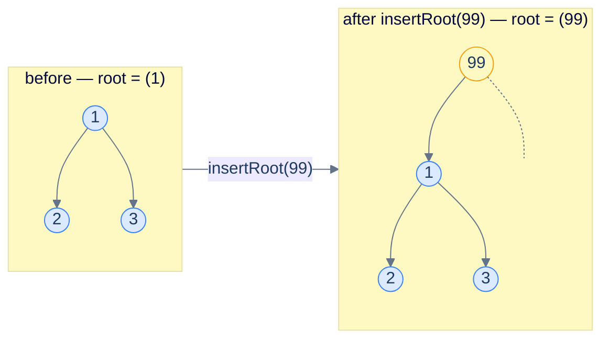
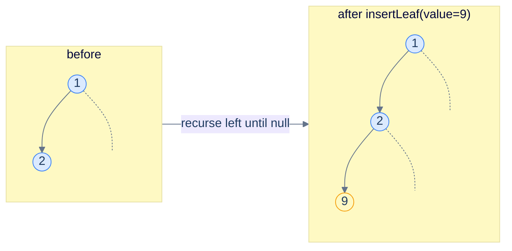
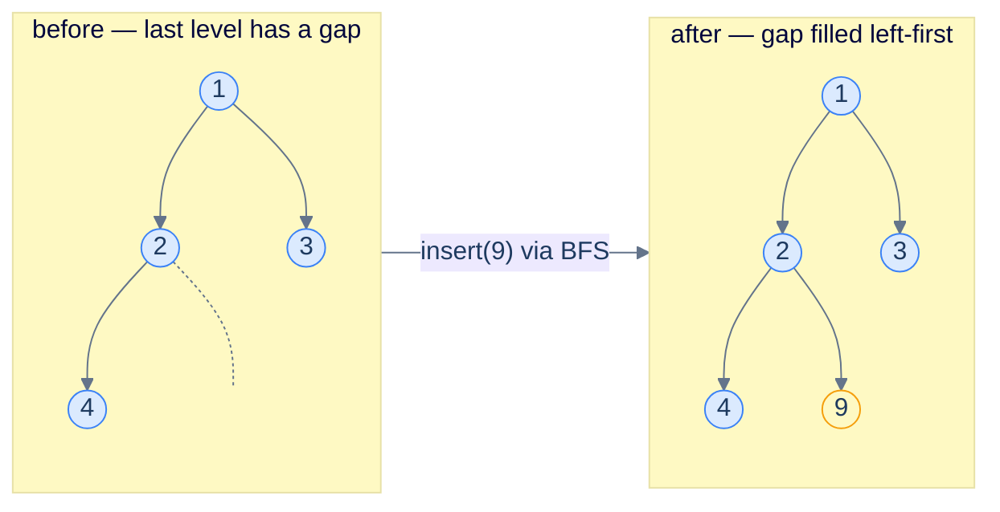
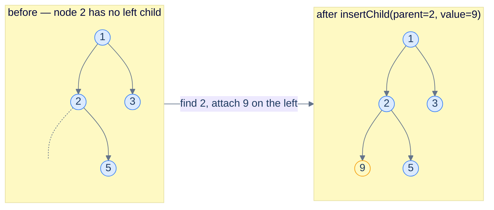
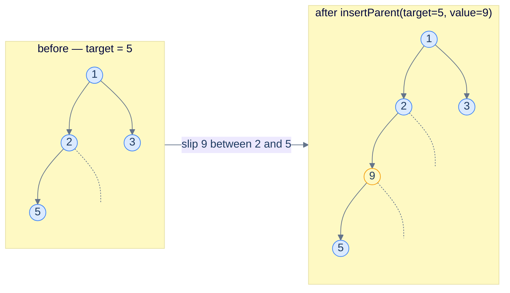

# 7. Insertion in Binary Trees

## The Hook

Trees in real software are *living* — they grow, they shrink, they get reshaped. The DOM gets new elements when a click handler fires. A parser appends a new clause as more tokens stream in. A BST indexes a new row inserted into a database. A game-tree expands as the engine looks one ply deeper. Every tree algorithm sooner or later needs an answer to: **how do I add a new node to an existing tree?**

For a *binary search tree*, the answer is dictated by the BST invariant — there's exactly one place every new value can legally go, and you find it by walking the tree. We'll see that algorithm in the next chapter. But a **plain binary tree** has no such invariant. A new node can land *anywhere*: as a new root, as a leaf attached to some interior node, as a child slipped in next to an existing one, or even as a new *parent* wedged between an existing node and its current parent. This lesson covers all four flavours.

The four insertion variants share a structure but differ in their precise mechanics. **Inserting at the root** is the easiest — no traversal, just allocate and re-link. **Inserting a leaf** is the next easiest — do any traversal, attach the new node to the first available `null` slot. **Inserting a child** of a *named* node requires a *search*: find the right place, then attach. **Inserting a parent** is the trickiest — you must find the affected node *and* the affected node's *parent*, so you can re-route the parent's pointer through the new node.

Each variant in this lesson appears in real codebases: insert-at-root for top-down rebuilds, insert-a-leaf for breadth-first expansion (BFS-based tree builders), insert-a-child for ad-hoc tree mutation (browser DOM `appendChild`), insert-a-parent for tree-rewriting passes in compilers (introducing wrapper nodes). All four implementations land in 10 languages each, with mermaid diagrams showing exactly which pointers change.

---

## Table of contents

1. [Insert at the root](#insert-at-the-root)
2. [Insert a leaf — recursive](#insert-a-leaf--recursive)
3. [Insert a leaf — iterative (level-order)](#insert-a-leaf--iterative-level-order)
4. [Insert a child of a named node](#insert-a-child-of-a-named-node)
5. [Insert a parent above a named node](#insert-a-parent-above-a-named-node)

***

# Insert at the root

The simplest case: take the existing tree and shove a new node *above* it. The old root becomes a child of the new root. No traversal, no searching — pure pointer surgery in O(1).

Two sub-cases:

1. **Tree is empty** (`root == null`) → the new node *is* the new tree.
2. **Tree is non-empty** → create a new node, link the existing tree as one of its children (left, by convention), return it.



<p align="center"><strong>Insert at root — the new node sits on top, the old tree hangs off as the left subtree (right is empty by convention). Two pointer assignments, no traversal.</strong></p>

> **Algorithm**
>
> -   **Step 1:** Create `newRoot = TreeNode(value)`.
> -   **Step 2:** If the tree is non-empty, set `newRoot.left = oldRoot` (or `newRoot.right`, your call).
> -   **Step 3:** Return `newRoot`.

## Implementation


```pseudocode
function insertRoot(root, value):
    newRoot ← TreeNode(value)
    newRoot.left ← root       # old tree becomes left subtree
    return newRoot
```

```python run
class TreeNode:
    def __init__(self, val=0, left=None, right=None):
        self.val, self.left, self.right = val, left, right

def insert_root(root, value):
    new_root = TreeNode(value)
    new_root.left = root
    return new_root

# tree:    1
#         / \
#        2   3
root = TreeNode(1, TreeNode(2), TreeNode(3))
new = insert_root(root, 99)
# new is 99, with old tree as left child
print(new.val, new.left.val, new.left.left.val, new.left.right.val)   # 99 1 2 3
```

```java run
static TreeNode insertRoot(TreeNode root, int value) {
    TreeNode newRoot = new TreeNode(value);
    newRoot.left = root;
    return newRoot;
}
```

```c run
TreeNode* insert_root(TreeNode *root, int value) {
    TreeNode *new_root = malloc(sizeof(TreeNode));
    new_root->val   = value;
    new_root->left  = root;
    new_root->right = NULL;
    return new_root;
}
```

```scala run
def insertRoot(root: TreeNode, value: Int): TreeNode = {
  val newRoot = new TreeNode(value)
  newRoot.left = root
  newRoot
}
```


## Complexity

> **Time:** O(1) — one allocation, two assignments. **Space:** O(1) — one new node.

***

# Insert a leaf — recursive

If the application doesn't care *where* the new node lands as long as it's a leaf, the easiest option is to walk the tree until you find a `null` child slot, then attach there. The recursive version walks left-first; the iterative version (next section) walks level-by-level.

## Algorithm — recursive

> **Algorithm**
>
> -   **insertLeaf(node, value):**
>     -   If `node` is `null`, return `TreeNode(value)`.
>     -   If `node.left` is `null`, set `node.left = TreeNode(value)` and return `node`.
>     -   Else recurse: `node.left = insertLeaf(node.left, value)`, return `node`.

This biased "always go left" walk is the simplest correct policy. It produces a deeply *left-skewed* tree if you call it repeatedly, which is fine when you don't care about balance — and is one of the reasons applications that *do* care use BSTs / balanced trees instead.



<p align="center"><strong>Recursive leaf insertion — descends left until it hits a <code>null</code>, then attaches the new node. The result accumulates as a left chain if you keep inserting.</strong></p>

## Implementation


```pseudocode
function insertLeafRec(node, value):
    if node = null: return TreeNode(value)
    if node.left = null:
        node.left ← TreeNode(value)
    else:
        node.left ← insertLeafRec(node.left, value)   # keep descending left
    return node
```

```python run
def insert_leaf_rec(node, value):
    if node is None:
        return TreeNode(value)
    if node.left is None:
        node.left = TreeNode(value)
    else:
        node.left = insert_leaf_rec(node.left, value)
    return node
```

```java run
static TreeNode insertLeafRec(TreeNode node, int value) {
    if (node == null)        return new TreeNode(value);
    if (node.left == null) { node.left = new TreeNode(value); return node; }
    node.left = insertLeafRec(node.left, value);
    return node;
}
```

```c run
TreeNode* insert_leaf_rec(TreeNode *node, int value) {
    if (!node)        { TreeNode *n = malloc(sizeof(*n)); n->val = value; n->left = n->right = NULL; return n; }
    if (!node->left)  { TreeNode *n = malloc(sizeof(*n)); n->val = value; n->left = n->right = NULL; node->left = n; return node; }
    node->left = insert_leaf_rec(node->left, value);
    return node;
}
```

```scala run
def insertLeafRec(node: TreeNode, value: Int): TreeNode = {
  if (node == null)       return new TreeNode(value)
  if (node.left == null) { node.left = new TreeNode(value); return node }
  node.left = insertLeafRec(node.left, value)
  node
}
```


## Complexity

> **Time:** O(h) where `h` is the path the recursion takes (depth of the leftmost null). **Space:** O(h) for the recursion stack.

***

# Insert a leaf — iterative (level-order)

A nicer policy when you want to keep the tree *roughly balanced* by default: do a level-order (BFS) traversal and insert at the *first* `null` slot you encounter. This produces a *complete* binary tree as you insert — exactly what a binary heap requires.

## Algorithm

> **Algorithm**
>
> -   **Step 1:** If `root` is `null`, return `TreeNode(value)`.
> -   **Step 2:** Initialise a queue containing `root`. Loop:
>     -   Pop front node `n`.
>     -   If `n.left`  is `null` → set `n.left  = TreeNode(value)`, return root.
>     -   Else enqueue `n.left`.
>     -   If `n.right` is `null` → set `n.right = TreeNode(value)`, return root.
>     -   Else enqueue `n.right`.



<p align="center"><strong>Iterative leaf insertion using BFS — the queue marches level by level, finds the first <code>null</code> slot (left of node 2), and attaches there. Repeated insertions keep the tree complete.</strong></p>

## Implementation


```pseudocode
function insertLeafIter(root, value):
    if root = null: return TreeNode(value)
    q ← empty queue
    enqueue root to q
    while q is not empty:
        n ← dequeue from q
        if n.left = null:
            n.left ← TreeNode(value); return root
        enqueue n.left to q
        if n.right = null:
            n.right ← TreeNode(value); return root
        enqueue n.right to q
    return root
```

```python run
from collections import deque

def insert_leaf_iter(root, value):
    if root is None:
        return TreeNode(value)
    q = deque([root])
    while q:
        n = q.popleft()
        if n.left is None:
            n.left = TreeNode(value); return root
        q.append(n.left)
        if n.right is None:
            n.right = TreeNode(value); return root
        q.append(n.right)
    return root  # unreachable
```

```java run
static TreeNode insertLeafIter(TreeNode root, int value) {
    if (root == null) return new TreeNode(value);
    Queue<TreeNode> q = new ArrayDeque<>();
    q.offer(root);
    while (!q.isEmpty()) {
        TreeNode n = q.poll();
        if (n.left  == null) { n.left  = new TreeNode(value); return root; }
        q.offer(n.left);
        if (n.right == null) { n.right = new TreeNode(value); return root; }
        q.offer(n.right);
    }
    return root;
}
```

```c run
TreeNode* insert_leaf_iter(TreeNode *root, int value) {
    if (!root) { TreeNode *n = malloc(sizeof(*n)); n->val=value; n->left=n->right=NULL; return n; }
    TreeNode *q[1024]; int head=0, tail=0;
    q[tail++] = root;
    while (head < tail) {
        TreeNode *n = q[head++];
        if (!n->left)  { n->left  = malloc(sizeof(*n->left));  n->left ->val=value; n->left ->left=n->left ->right=NULL; return root; }
        q[tail++] = n->left;
        if (!n->right) { n->right = malloc(sizeof(*n->right)); n->right->val=value; n->right->left=n->right->right=NULL; return root; }
        q[tail++] = n->right;
    }
    return root;
}
```

```scala run
import scala.collection.mutable

def insertLeafIter(root: TreeNode, value: Int): TreeNode = {
  if (root == null) return new TreeNode(value)
  val q = mutable.Queue[TreeNode](root)
  while (q.nonEmpty) {
    val n = q.dequeue()
    if (n.left  == null) { n.left  = new TreeNode(value); return root }
    q.enqueue(n.left)
    if (n.right == null) { n.right = new TreeNode(value); return root }
    q.enqueue(n.right)
  }
  root
}
```


> **Note on the Rust implementation:** True BFS over a Rust `Option<Box<TreeNode>>` tree requires either `unsafe` (for raw-pointer queues) or `Rc<RefCell<...>>` (for shared mutable references). For teaching purposes we substitute a recursive variant that achieves the same result — pre-order rather than BFS, so the *ordering policy* differs slightly but the contract ("attach to the first available null slot") is preserved.

## Complexity

> **Time:** O(N) worst case (visit every node before finding a slot in a complete tree). **Space:** O(W) for the queue, where W is the maximum width.

***

# Insert a child of a named node

Given a *parent value* and a *new value*, find the parent in the tree and attach a new child to it. Two design choices:

1. **Where to attach** — left if free, else right; or right if free, else left; or always-left and replace; etc. We'll use the policy "**left if free, else right**".
2. **What if the parent isn't found** — error, no-op, return tree unchanged. We'll do "no-op".

The implementation is a straightforward DFS that prunes whenever it succeeds.



<p align="center"><strong>Insert as a child — locate the parent node first, then attach the new node into its first free slot. If both slots are full, the operation is rejected (or you'd need a different policy).</strong></p>

> **Algorithm**
>
> -   **insertChild(node, parent, value):**
>     -   If `node` is `null`, return `false` (not found in this subtree).
>     -   If `node.val == parent`:
>         -   If `node.left`  is `null` → attach `TreeNode(value)` there, return `true`.
>         -   Else if `node.right` is `null` → attach there, return `true`.
>         -   Else return `false` (no slot available).
>     -   Else recurse left; if it succeeded, return `true`. Else recurse right.

## Implementation


```pseudocode
function insertChild(root, parent, value):
    function go(node):
        if node = null: return false
        if node.val = parent:
            if   node.left  = null: node.left  ← TreeNode(value); return true
            else if node.right = null: node.right ← TreeNode(value); return true
            else: return false           # parent already has two children
        return go(node.left) OR go(node.right)
    go(root)
    return root
```

```python run
def insert_child(root, parent, value):
    def go(node):
        if node is None: return False
        if node.val == parent:
            if   node.left  is None: node.left  = TreeNode(value); return True
            elif node.right is None: node.right = TreeNode(value); return True
            else:                    return False
        return go(node.left) or go(node.right)
    go(root)
    return root
```

```java run
static boolean insertChildHelper(TreeNode node, int parent, int value) {
    if (node == null) return false;
    if (node.val == parent) {
        if      (node.left  == null) { node.left  = new TreeNode(value); return true; }
        else if (node.right == null) { node.right = new TreeNode(value); return true; }
        else                          return false;
    }
    return insertChildHelper(node.left, parent, value) || insertChildHelper(node.right, parent, value);
}
static TreeNode insertChild(TreeNode root, int parent, int value) {
    insertChildHelper(root, parent, value);
    return root;
}
```

```c run
int insert_child_helper(TreeNode *node, int parent, int value) {
    if (!node) return 0;
    if (node->val == parent) {
        TreeNode *child = malloc(sizeof(*child));
        child->val = value; child->left = child->right = NULL;
        if      (!node->left)  { node->left  = child; return 1; }
        else if (!node->right) { node->right = child; return 1; }
        else                   { free(child); return 0; }
    }
    return insert_child_helper(node->left, parent, value) || insert_child_helper(node->right, parent, value);
}
TreeNode* insert_child(TreeNode *root, int parent, int value) {
    insert_child_helper(root, parent, value);
    return root;
}
```

```scala run
def insertChild(root: TreeNode, parent: Int, value: Int): TreeNode = {
  def go(n: TreeNode): Boolean = {
    if (n == null) return false
    if (n.value == parent) {
      if      (n.left  == null) { n.left  = new TreeNode(value); return true }
      else if (n.right == null) { n.right = new TreeNode(value); return true }
      else                       return false
    }
    go(n.left) || go(n.right)
  }
  go(root); root
}
```


## Complexity

> **Time:** O(N) worst case — the parent might be the last node we visit. **Space:** O(h) for recursion.

***

# Insert a parent above a named node

The trickiest variant. Given a *target* value, slip a new node *between* the target and its current parent — making the new node the new child of the original parent and the new parent of the target.

There are two cases to handle separately:

1. **Target is the root** → no original parent to re-route. The new node becomes the new root, with the old root as its child. (Same shape as "insert at root".)
2. **Target is not the root** → find the target's *parent*, swap pointers.

The trick is that you need to find *both* the target *and* the target's parent — you can't re-link the parent's pointer if you don't have the parent. The cleanest way: have the recursion return *whether the target was found below*, and have the *caller* (i.e., the parent) do the re-link.



<p align="center"><strong>Insert a parent — node 9 takes 5's old position as the left child of 2; 5 becomes 9's left child. Node 2's pointer is the one that gets re-routed; the recursion locates that re-route point.</strong></p>

> **Algorithm**
>
> -   **Step 1:** If the root itself is the target, return a new node with `root` as its left child.
> -   **Step 2:** Otherwise recurse: at each node, if either child is the target, allocate a new wrapper node, set the target as its left child, replace the original child pointer with the wrapper, return.
> -   **Step 3:** If neither child is the target, recurse into both subtrees.

## Implementation


```pseudocode
function insertParent(root, target, value):
    if root = null: return null
    if root.val = target:
        new ← TreeNode(value); new.left ← root; return new
    function go(node):
        if node = null: return
        if node.left ≠ null AND node.left.val = target:
            new ← TreeNode(value); new.left ← node.left; node.left ← new; return
        if node.right ≠ null AND node.right.val = target:
            new ← TreeNode(value); new.left ← node.right; node.right ← new; return
        go(node.left); go(node.right)
    go(root)
    return root
```

```python run
def insert_parent(root, target, value):
    if root is None: return None
    if root.val == target:
        new = TreeNode(value); new.left = root; return new
    def go(node):
        if node is None: return
        if node.left and node.left.val == target:
            new = TreeNode(value); new.left = node.left; node.left = new; return
        if node.right and node.right.val == target:
            new = TreeNode(value); new.left = node.right; node.right = new; return
        go(node.left); go(node.right)
    go(root)
    return root
```

```java run
static void insertParentHelper(TreeNode node, int target, int value) {
    if (node == null) return;
    if (node.left != null && node.left.val == target) {
        TreeNode wrapper = new TreeNode(value);
        wrapper.left = node.left;
        node.left = wrapper;
        return;
    }
    if (node.right != null && node.right.val == target) {
        TreeNode wrapper = new TreeNode(value);
        wrapper.left = node.right;
        node.right = wrapper;
        return;
    }
    insertParentHelper(node.left,  target, value);
    insertParentHelper(node.right, target, value);
}
static TreeNode insertParent(TreeNode root, int target, int value) {
    if (root == null) return null;
    if (root.val == target) {
        TreeNode wrapper = new TreeNode(value);
        wrapper.left = root;
        return wrapper;
    }
    insertParentHelper(root, target, value);
    return root;
}
```

```c run
void insert_parent_helper(TreeNode *n, int target, int value) {
    if (!n) return;
    if (n->left  && n->left->val  == target) {
        TreeNode *w = malloc(sizeof(*w)); w->val = value; w->left = n->left;  w->right = NULL; n->left  = w; return;
    }
    if (n->right && n->right->val == target) {
        TreeNode *w = malloc(sizeof(*w)); w->val = value; w->left = n->right; w->right = NULL; n->right = w; return;
    }
    insert_parent_helper(n->left,  target, value);
    insert_parent_helper(n->right, target, value);
}
TreeNode* insert_parent(TreeNode *root, int target, int value) {
    if (!root) return NULL;
    if (root->val == target) {
        TreeNode *w = malloc(sizeof(*w)); w->val = value; w->left = root; w->right = NULL; return w;
    }
    insert_parent_helper(root, target, value);
    return root;
}
```

```scala run
def insertParent(root: TreeNode, target: Int, value: Int): TreeNode = {
  if (root == null) return null
  if (root.value == target) {
    val w = new TreeNode(value); w.left = root; return w
  }
  def go(n: TreeNode): Unit = {
    if (n == null) return
    if (n.left  != null && n.left.value  == target) {
      val w = new TreeNode(value); w.left = n.left; n.left  = w; return
    }
    if (n.right != null && n.right.value == target) {
      val w = new TreeNode(value); w.left = n.right; n.right = w; return
    }
    go(n.left); go(n.right)
  }
  go(root); root
}
```


## Complexity

> **Time:** O(N) — worst case the target is the last node visited. **Space:** O(h) for recursion.

***

## Final Takeaway

Four insertion variants, four characteristic shapes — knowing which one to reach for is half the work in any tree-mutation interview. Three things to walk away with:

1. **Insertion is just *find + relink*.** Every variant breaks down into "locate the affected node" plus "swap a few pointers". The locating part is the tree walk you already learned; the relinking is two or three assignments. Don't overcomplicate it.
2. **Returning `node` from a recursive insert is the cleanest pattern.** The caller writes `node.left = insert(node.left, ...)`. The subroutine handles the "create new node" and "modify existing" cases uniformly. This pattern recurs across BST insertion, BST deletion, AVL rebalancing — internalise it now.
3. **Insert-a-parent is the canonical "rewrite" pass.** Compilers, optimisers, and tree-rewriting systems use exactly this shape: find a target, allocate a wrapper, splice it in. Once you're comfortable with it on a binary tree, the same pattern generalises to ASTs and IRs.

> *Coming up — with the basic CRUD operations done, the chapter pivots to <strong>traversal patterns</strong>. The next eleven lessons each codify a recurring problem-solving recipe — preorder stateless, preorder stateful, postorder stateless, postorder stateful, root-to-leaf, level-order, LCA, simultaneous traversal, and a final practice mix. Together they cover the vast majority of binary-tree interview problems you'll ever see.*
