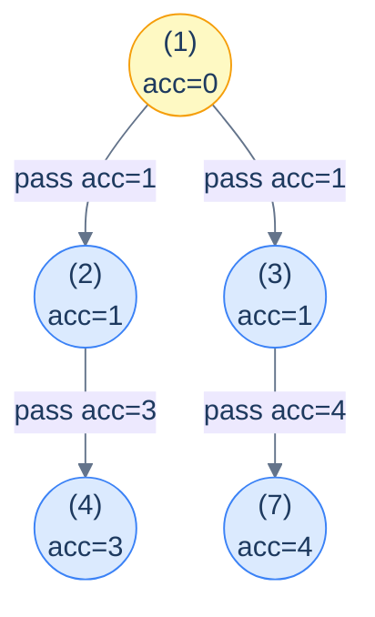
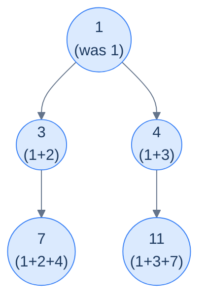
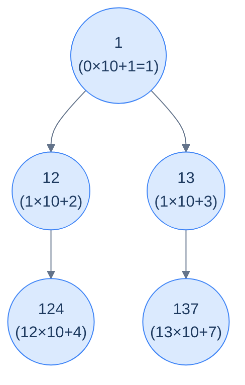
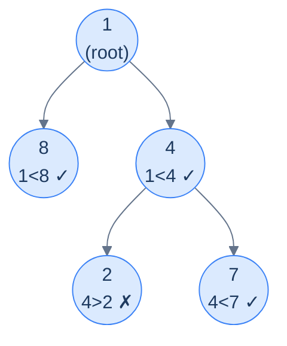

# 8. Pattern: Preorder Traversal (Stateless)

## The Hook

You're standing at the root of a binary tree, and you want every node to know something about *its ancestry* — the sum of all values on the path from the root to it, the depth at which it sits, the concatenation of all the values above it. The information *flows downward*: each node gets *its parent's accumulated answer*, applies a small update, and passes the new accumulation to its children.

That single shape — *parent accumulates, hands to children, children continue* — is the **stateless preorder pattern**. It's the most common recipe in the entire binary-tree section. Once you spot it, the implementation is mechanical: a recursive preorder traversal that carries an extra parameter (the *accumulator*) down through the recursion, and each node uses the accumulator passed in from its parent.

Why "stateless"? Because **no information needs to be shared between siblings or come back up the recursion**. Each subtree gets its own copy of the accumulator from its parent, modifies it independently, and the modifications don't leak across siblings. There's no mutable global, no return value to propagate, no "fix this on the way back up". The recursion goes one way — *down* — and you're done.

This pattern handles a *huge* range of problems: path sums, depth assignment, ancestry checks, root-to-node aggregations, ancestor-dependent computations. Once you've seen four or five examples, you'll recognise the shape on sight. This lesson gives you the recipe, the four canonical example problems, and clean implementations for each in Python and Java.

---

## Table of contents

1. [The stateless preorder pattern](#the-stateless-preorder-pattern)
2. [How to recognise it](#how-to-recognise-it)
3. [Problem 1 — Sum of path](#problem-1--sum-of-path)
4. [Problem 2 — Depth assignment](#problem-2--depth-assignment)
5. [Problem 3 — Concatenated path](#problem-3--concatenated-path)
6. [Problem 4 — Increasing path](#problem-4--increasing-path)

***

# The stateless preorder pattern

The pattern in pseudocode:

```text
preorder(node, accumulator):
  if node is null: return
  process(node, accumulator)                           # use the accumulator
  newAccumulator = update(accumulator, node.val)       # combine with this node
  preorder(node.left,  newAccumulator)                 # hand to left child
  preorder(node.right, newAccumulator)                 # hand to right child
```

The accumulator is *passed by value* (or as an immutable reference) down the recursion. Each child receives a *copy* — so changes one subtree makes never affect the other. There's no need for "back out" cleanup because there's nothing to clean up: the parent's value is already saved on its own stack frame, untouched.



<p align="center"><strong>Stateless preorder data flow — each node updates the accumulator with its own value <em>before</em> passing it to its children. The arrows on the edges show what each child receives. Notice both children of a node receive the <em>same</em> updated accumulator — the parent's contribution is included exactly once.</strong></p>

> **Why "stateless"?** Because the algorithm doesn't carry mutable state across recursive calls. Sibling subtrees see each other's work *not at all* — they each get a fresh copy of the parent's accumulator. Compare this with the *stateful* preorder pattern (next lesson), which uses a single shared mutable accumulator that needs explicit "undo" steps when a sibling subtree is finished.

## Generic pattern


```python run
from typing import Optional

class TreeNode:
    def __init__(self, val=0, left=None, right=None):
        self.val, self.left, self.right = val, left, right

def f(acc, val):                       # combine the parent's acc with this node's value
    return acc + val                   # placeholder — replace with real combiner

def stateless_preorder(root: Optional[TreeNode], acc=0):
    if root is None: return
    # ... use acc here to process root if needed ...
    new_acc = f(acc, root.val)
    stateless_preorder(root.left,  new_acc)
    stateless_preorder(root.right, new_acc)
```

```java run
static int f(int acc, int val) { return acc + val; }
static void statelessPreorder(TreeNode node, int acc) {
    if (node == null) return;
    // ... use acc to process node ...
    int newAcc = f(acc, node.val);
    statelessPreorder(node.left,  newAcc);
    statelessPreorder(node.right, newAcc);
}
```


## Complexity

> **Time:** O(N) — every node is visited exactly once. **Space:** O(h) for the recursion stack.

***

# How to recognise it

A problem fits this pattern if **every node's answer depends only on the path from the root to it** — and that dependency is *summarisable* by a small piece of data (a sum, a max, a depth, a string, a flag) that can be computed *incrementally* as the recursion descends.

Look for verb phrases like:

- *"For each node, compute … from root to that node"*
- *"For each node, the value of … on the path above it"*
- *"Update each node based on its ancestors"*
- *"Mark every node where … from the root"*

Anti-pattern (does **not** fit): if the answer depends on a node's *descendants* or *both* sides of the tree at once, you want the *postorder* pattern instead. If sibling subtrees need to communicate, you want the *stateful* variant.

***

# Problem 1 — Sum of path

> Given the root of a binary tree, update each node's value by adding the sum of all node values on the path from the root to that node.
>
> **Example:** Input `[1, 2, 3, 4, null, null, 7]` → output `[1, 3, 4, 7, null, null, 11]`.



<p align="center"><strong>Sum-of-path output — each node holds the sum of all values from the root down to itself, including itself.</strong></p>

The accumulator here is the **path sum so far** (excluding the current node). At each node: write `acc + node.val` into the node, then descend with `acc + node.val` (the same value) as the new accumulator for both children.

<details>
<summary><h2>Solution</h2></summary>


```python run
from typing import Optional, List
from collections import deque

class TreeNode:
    def __init__(self, val=0, left=None, right=None):
        self.val = val
        self.left = left
        self.right = right


def from_level_order(values):
    """Build tree from list like [1, 2, 3, None, 4]. None means missing child."""
    if not values:
        return None
    root = TreeNode(values[0])
    queue = [root]
    i = 1
    while queue and i < len(values):
        node = queue.pop(0)
        if i < len(values) and values[i] is not None:
            node.left = TreeNode(values[i])
            queue.append(node.left)
        i += 1
        if i < len(values) and values[i] is not None:
            node.right = TreeNode(values[i])
            queue.append(node.right)
        i += 1
    return root


def to_level_order(root):
    if not root:
        return []
    result, queue = [], deque([root])
    while queue:
        node = queue.popleft()
        if node:
            result.append(node.val)
            queue.append(node.left)
            queue.append(node.right)
        else:
            result.append(None)
    while result and result[-1] is None:
        result.pop()
    return result


class Solution:
    def sum_of_path_helper(
        self, root: Optional[TreeNode], path_sum: int
    ) -> None:

        # Base case: if the current node is null, do nothing
        if root is None:
            return

        # Calculate the new path sum by adding the current node's value
        new_path_sum = path_sum + root.val

        # Update the current node's value to the new path sum
        root.val = new_path_sum

        # Recursively process the left and right children,
        # passing the updated path sum
        self.sum_of_path_helper(root.left, new_path_sum)
        self.sum_of_path_helper(root.right, new_path_sum)

    def sum_of_path(self, root: Optional[TreeNode]) -> None:
        self.sum_of_path_helper(root, 0)


# Examples from the problem statement
t1 = from_level_order([1, 2, 3, 4, None, None, 7])
Solution().sum_of_path(t1); print(to_level_order(t1))   # [1, 3, 4, 7, 11]

t2 = from_level_order([1, 8, 4, None, None, 2, 7])
Solution().sum_of_path(t2); print(to_level_order(t2))   # [1, 9, 5, 7, 12]

# Edge cases
t3 = from_level_order([])
Solution().sum_of_path(t3); print(to_level_order(t3))   # []

t4 = from_level_order([5])
Solution().sum_of_path(t4); print(to_level_order(t4))   # [5]

t5 = from_level_order([1, 2, None, 3])                  # left-skew
Solution().sum_of_path(t5); print(to_level_order(t5))   # [1, 3, 6]

t6 = from_level_order([1, None, 2, None, 3])            # right-skew
Solution().sum_of_path(t6); print(to_level_order(t6))   # [1, 3, 6]

t7 = from_level_order([3, 1, 4, 1, 5, 9, 2])
Solution().sum_of_path(t7); print(to_level_order(t7))   # [3, 4, 7, 5, 9, 16, 9]
```

```java run
import java.util.*;

public class Main {
    static class TreeNode {
        int val;
        TreeNode left;
        TreeNode right;
        TreeNode() {}
        TreeNode(int val) { this.val = val; }
    }

    static TreeNode fromLevelOrder(Integer... values) {
        if (values.length == 0 || values[0] == null) return null;
        TreeNode root = new TreeNode(values[0]);
        java.util.Deque<TreeNode> queue = new java.util.ArrayDeque<>();
        queue.add(root);
        int i = 1;
        while (!queue.isEmpty() && i < values.length) {
            TreeNode node = queue.poll();
            if (i < values.length && values[i] != null) {
                node.left = new TreeNode(values[i]);
                queue.add(node.left);
            }
            i++;
            if (i < values.length && values[i] != null) {
                node.right = new TreeNode(values[i]);
                queue.add(node.right);
            }
            i++;
        }
        return root;
    }

    static List<Integer> toLevelOrder(TreeNode root) {
        if (root == null) return new ArrayList<>();
        List<Integer> result = new ArrayList<>();
        java.util.Deque<TreeNode> queue = new java.util.ArrayDeque<>();
        queue.add(root);
        while (!queue.isEmpty()) {
            TreeNode node = queue.poll();
            if (node != null) {
                result.add(node.val);
                queue.add(node.left);
                queue.add(node.right);
            } else {
                result.add(null);
            }
        }
        while (!result.isEmpty() && result.get(result.size() - 1) == null)
            result.remove(result.size() - 1);
        return result;
    }

    static class Solution {
        private void sumOfPathHelper(TreeNode root, int pathSum) {

            // Base case: if the current node is null, do nothing
            if (root == null) {
                return;
            }

            // Calculate the new path sum by adding the current node's value
            int newPathSum = pathSum + root.val;

            // Update the current node's value to the new path sum
            root.val = newPathSum;

            // Recursively process the left and right children,
            // passing the updated path sum
            sumOfPathHelper(root.left, newPathSum);
            sumOfPathHelper(root.right, newPathSum);
        }

        public void sumOfPath(TreeNode root) {
            sumOfPathHelper(root, 0);
        }
    }

    public static void main(String[] args) {
        // Examples from the problem statement
        TreeNode t1 = fromLevelOrder(1, 2, 3, 4, null, null, 7);
        new Solution().sumOfPath(t1);
        System.out.println(toLevelOrder(t1));   // [1, 3, 4, 7, 11]

        TreeNode t2 = fromLevelOrder(1, 8, 4, null, null, 2, 7);
        new Solution().sumOfPath(t2);
        System.out.println(toLevelOrder(t2));   // [1, 9, 5, 7, 12]

        // Edge cases
        TreeNode t3 = fromLevelOrder();
        new Solution().sumOfPath(t3);
        System.out.println(toLevelOrder(t3));   // []

        TreeNode t4 = fromLevelOrder(5);
        new Solution().sumOfPath(t4);
        System.out.println(toLevelOrder(t4));   // [5]

        TreeNode t5 = fromLevelOrder(1, 2, null, 3);   // left-skew
        new Solution().sumOfPath(t5);
        System.out.println(toLevelOrder(t5));   // [1, 3, 6]

        TreeNode t6 = fromLevelOrder(1, null, 2, null, 3);  // right-skew
        new Solution().sumOfPath(t6);
        System.out.println(toLevelOrder(t6));   // [1, 3, 6]

        TreeNode t7 = fromLevelOrder(3, 1, 4, 1, 5, 9, 2);
        new Solution().sumOfPath(t7);
        System.out.println(toLevelOrder(t7));   // [3, 4, 7, 5, 9, 16, 9]
    }
}
```

</details>


***

# Problem 2 — Depth assignment

> Given the root of a binary tree, update each node's value to its depth.
>
> **Example:** Input `[1, 2, 3, 4, null, null, 7]` → output `[0, 1, 1, 2, null, null, 2]`.

The accumulator is just the **current depth**. The root starts at 0; every recursive call passes `depth + 1` to the children.

<details>
<summary><h2>Solution</h2></summary>


```python run
from typing import Optional
from collections import deque

class TreeNode:
    def __init__(self, val=0, left=None, right=None):
        self.val = val
        self.left = left
        self.right = right


def from_level_order(values):
    """Build tree from list like [1, 2, 3, None, 4]. None means missing child."""
    if not values:
        return None
    root = TreeNode(values[0])
    queue = [root]
    i = 1
    while queue and i < len(values):
        node = queue.pop(0)
        if i < len(values) and values[i] is not None:
            node.left = TreeNode(values[i])
            queue.append(node.left)
        i += 1
        if i < len(values) and values[i] is not None:
            node.right = TreeNode(values[i])
            queue.append(node.right)
        i += 1
    return root


def to_level_order(root):
    if not root:
        return []
    result, queue = [], deque([root])
    while queue:
        node = queue.popleft()
        if node:
            result.append(node.val)
            queue.append(node.left)
            queue.append(node.right)
        else:
            result.append(None)
    while result and result[-1] is None:
        result.pop()
    return result


class Solution:
    def depth_assignment_helper(
        self, root: Optional[TreeNode], depth: int
    ) -> None:

        # Base case: if the current node is null, do nothing
        if root is None:
            return

        # Update current node's value with its depth
        root.val = depth

        # Recursively process the left and right children,
        # increasing the depth by 1
        self.depth_assignment_helper(root.left, depth + 1)
        self.depth_assignment_helper(root.right, depth + 1)

    def depth_assignment(self, root: Optional[TreeNode]) -> None:
        self.depth_assignment_helper(root, 0)


# Examples from the problem statement
t1 = from_level_order([1, 2, 3, 4, None, None, 7])
Solution().depth_assignment(t1); print(to_level_order(t1))   # [0, 1, 1, 2, 2]

t2 = from_level_order([1, 8, 4, None, None, 2, 7])
Solution().depth_assignment(t2); print(to_level_order(t2))   # [0, 1, 1, 2, 2]

# Edge cases
t3 = from_level_order([])
Solution().depth_assignment(t3); print(to_level_order(t3))   # []

t4 = from_level_order([42])
Solution().depth_assignment(t4); print(to_level_order(t4))   # [0]

t5 = from_level_order([5, 3, None, 1])                       # left-skew
Solution().depth_assignment(t5); print(to_level_order(t5))   # [0, 1, 2]

t6 = from_level_order([5, None, 3, None, 1])                 # right-skew
Solution().depth_assignment(t6); print(to_level_order(t6))   # [0, 1, 2]

t7 = from_level_order([1, 2, 3, 4, 5, 6, 7])
Solution().depth_assignment(t7); print(to_level_order(t7))   # [0, 1, 1, 2, 2, 2, 2]
```

```java run
import java.util.*;

public class Main {
    static class TreeNode {
        int val;
        TreeNode left;
        TreeNode right;
        TreeNode() {}
        TreeNode(int val) { this.val = val; }
    }

    static TreeNode fromLevelOrder(Integer... values) {
        if (values.length == 0 || values[0] == null) return null;
        TreeNode root = new TreeNode(values[0]);
        java.util.Deque<TreeNode> queue = new java.util.ArrayDeque<>();
        queue.add(root);
        int i = 1;
        while (!queue.isEmpty() && i < values.length) {
            TreeNode node = queue.poll();
            if (i < values.length && values[i] != null) {
                node.left = new TreeNode(values[i]);
                queue.add(node.left);
            }
            i++;
            if (i < values.length && values[i] != null) {
                node.right = new TreeNode(values[i]);
                queue.add(node.right);
            }
            i++;
        }
        return root;
    }

    static List<Integer> toLevelOrder(TreeNode root) {
        if (root == null) return new ArrayList<>();
        List<Integer> result = new ArrayList<>();
        java.util.Deque<TreeNode> queue = new java.util.ArrayDeque<>();
        queue.add(root);
        while (!queue.isEmpty()) {
            TreeNode node = queue.poll();
            if (node != null) {
                result.add(node.val);
                queue.add(node.left);
                queue.add(node.right);
            } else {
                result.add(null);
            }
        }
        while (!result.isEmpty() && result.get(result.size() - 1) == null)
            result.remove(result.size() - 1);
        return result;
    }

    static class Solution {

        private void depthAssignmentHelper(TreeNode root, int depth) {

            // Base case: if the current node is null, do nothing
            if (root == null) {
                return;
            }

            // Update current node's value with its depth
            root.val = depth;

            // Recursively process the left and right children,
            // increasing the depth by 1
            depthAssignmentHelper(root.left, depth + 1);
            depthAssignmentHelper(root.right, depth + 1);
        }

        public void depthAssignment(TreeNode root) {
            depthAssignmentHelper(root, 0);
        }
    }

    public static void main(String[] args) {
        // Examples from the problem statement
        TreeNode t1 = fromLevelOrder(1, 2, 3, 4, null, null, 7);
        new Solution().depthAssignment(t1);
        System.out.println(toLevelOrder(t1));   // [0, 1, 1, 2, 2]

        TreeNode t2 = fromLevelOrder(1, 8, 4, null, null, 2, 7);
        new Solution().depthAssignment(t2);
        System.out.println(toLevelOrder(t2));   // [0, 1, 1, 2, 2]

        // Edge cases
        TreeNode t3 = fromLevelOrder();
        new Solution().depthAssignment(t3);
        System.out.println(toLevelOrder(t3));   // []

        TreeNode t4 = fromLevelOrder(42);
        new Solution().depthAssignment(t4);
        System.out.println(toLevelOrder(t4));   // [0]

        TreeNode t5 = fromLevelOrder(5, 3, null, 1);   // left-skew
        new Solution().depthAssignment(t5);
        System.out.println(toLevelOrder(t5));   // [0, 1, 2]

        TreeNode t6 = fromLevelOrder(5, null, 3, null, 1);   // right-skew
        new Solution().depthAssignment(t6);
        System.out.println(toLevelOrder(t6));   // [0, 1, 2]

        TreeNode t7 = fromLevelOrder(1, 2, 3, 4, 5, 6, 7);
        new Solution().depthAssignment(t7);
        System.out.println(toLevelOrder(t7));   // [0, 1, 1, 2, 2, 2, 2]
    }
}
```

</details>


***

# Problem 3 — Concatenated path

> Given the root of a binary tree, update each node's value to the integer represented by concatenating all the digits from the root down to that node, in order.
>
> **Example:** Input `[1, 2, 3, 4, null, null, 7]` → output `[1, 12, 13, 124, null, null, 137]`.

The accumulator here is the **path-so-far number**. To "append digit `d`" to a number `n`, we multiply by `10^(digits in d)` and add `d`. So the per-node update is:

```text
newAcc = acc * 10^digits(node.val) + node.val
```



<p align="center"><strong>Concatenated path — each node's value is the integer formed by gluing the digits along the root-to-node path. The accumulator is the path-so-far number.</strong></p>

<details>
<summary><h2>Solution</h2></summary>


```python run
from typing import Optional
from collections import deque

class TreeNode:
    def __init__(self, val=0, left=None, right=None):
        self.val = val
        self.left = left
        self.right = right


def from_level_order(values):
    """Build tree from list like [1, 2, 3, None, 4]. None means missing child."""
    if not values:
        return None
    root = TreeNode(values[0])
    queue = [root]
    i = 1
    while queue and i < len(values):
        node = queue.pop(0)
        if i < len(values) and values[i] is not None:
            node.left = TreeNode(values[i])
            queue.append(node.left)
        i += 1
        if i < len(values) and values[i] is not None:
            node.right = TreeNode(values[i])
            queue.append(node.right)
        i += 1
    return root


def to_level_order(root):
    if not root:
        return []
    result, queue = [], deque([root])
    while queue:
        node = queue.popleft()
        if node:
            result.append(node.val)
            queue.append(node.left)
            queue.append(node.right)
        else:
            result.append(None)
    while result and result[-1] is None:
        result.pop()
    return result


class Solution:
    def count_digits(self, num: int) -> int:

        # Handle the case when num is 0
        if num == 0:
            return 1

        # Count the number of digits in num
        digits: int = 0
        while num > 0:
            num //= 10
            digits += 1

        # Return the total count of digits
        return digits

    def concatenated_path_helper(
        self, root: Optional[TreeNode], path_val: int
    ) -> None:

        # Base case: if the current node is null, do nothing
        if not root:
            return

        # Shift pathVal by digitCount digits to the left, then
        # add current node value
        digit_count: int = self.count_digits(root.val)

        # Update current node's value
        root.val = path_val * (10**digit_count) + root.val

        # Recursively process the left and right children,
        # passing updated path value
        self.concatenated_path_helper(root.left, root.val)
        self.concatenated_path_helper(root.right, root.val)

    def concatenated_path(self, root: Optional[TreeNode]) -> None:
        self.concatenated_path_helper(root, 0)


# Examples from the problem statement
t1 = from_level_order([1, 2, 3, 4, None, None, 7])
Solution().concatenated_path(t1); print(to_level_order(t1))   # [1, 12, 13, 124, 137]

t2 = from_level_order([1, 10, 20, None, None, 211, 7])
Solution().concatenated_path(t2); print(to_level_order(t2))   # [1, 110, 120, 120211, 1207]

# Edge cases
t3 = from_level_order([])
Solution().concatenated_path(t3); print(to_level_order(t3))   # []

t4 = from_level_order([5])
Solution().concatenated_path(t4); print(to_level_order(t4))   # [5]

t5 = from_level_order([1, 2, None, 3])                        # left-skew
Solution().concatenated_path(t5); print(to_level_order(t5))   # [1, 12, 123]

t6 = from_level_order([1, None, 2, None, 3])                  # right-skew
Solution().concatenated_path(t6); print(to_level_order(t6))   # [1, 12, 123]

t7 = from_level_order([9, 8, 7])
Solution().concatenated_path(t7); print(to_level_order(t7))   # [9, 98, 97]
```

```java run
import java.util.*;

public class Main {
    static class TreeNode {
        int val;
        TreeNode left;
        TreeNode right;
        TreeNode() {}
        TreeNode(int val) { this.val = val; }
    }

    static TreeNode fromLevelOrder(Integer... values) {
        if (values.length == 0 || values[0] == null) return null;
        TreeNode root = new TreeNode(values[0]);
        java.util.Deque<TreeNode> queue = new java.util.ArrayDeque<>();
        queue.add(root);
        int i = 1;
        while (!queue.isEmpty() && i < values.length) {
            TreeNode node = queue.poll();
            if (i < values.length && values[i] != null) {
                node.left = new TreeNode(values[i]);
                queue.add(node.left);
            }
            i++;
            if (i < values.length && values[i] != null) {
                node.right = new TreeNode(values[i]);
                queue.add(node.right);
            }
            i++;
        }
        return root;
    }

    static List<Integer> toLevelOrder(TreeNode root) {
        if (root == null) return new ArrayList<>();
        List<Integer> result = new ArrayList<>();
        java.util.Deque<TreeNode> queue = new java.util.ArrayDeque<>();
        queue.add(root);
        while (!queue.isEmpty()) {
            TreeNode node = queue.poll();
            if (node != null) {
                result.add(node.val);
                queue.add(node.left);
                queue.add(node.right);
            } else {
                result.add(null);
            }
        }
        while (!result.isEmpty() && result.get(result.size() - 1) == null)
            result.remove(result.size() - 1);
        return result;
    }

    static class Solution {
        private int countDigits(int num) {

            // Handle the case when num is 0
            if (num == 0) {
                return 1;
            }

            // Count the number of digits in num
            int digits = 0;
            while (num > 0) {
                num /= 10;
                digits++;
            }

            // Return the total count of digits
            return digits;
        }

        void concatenatedPathHelper(TreeNode root, int pathVal) {

            // Base case: if the current node is null, do nothing
            if (root == null) {
                return;
            }

            // Shift pathVal by digitCount digits to the left, then
            // add current node value
            int digitCount = countDigits(root.val);

            // Update current node's value
            root.val = (int) (pathVal * Math.pow(10, digitCount)) + root.val;

            // Recursively process the left and right children,
            // passing updated path value
            concatenatedPathHelper(root.left, root.val);
            concatenatedPathHelper(root.right, root.val);
        }

        public void concatenatedPath(TreeNode root) {
            concatenatedPathHelper(root, 0);
        }
    }

    public static void main(String[] args) {
        // Examples from the problem statement
        TreeNode t1 = fromLevelOrder(1, 2, 3, 4, null, null, 7);
        new Solution().concatenatedPath(t1);
        System.out.println(toLevelOrder(t1));   // [1, 12, 13, 124, 137]

        TreeNode t2 = fromLevelOrder(1, 10, 20, null, null, 211, 7);
        new Solution().concatenatedPath(t2);
        System.out.println(toLevelOrder(t2));   // [1, 110, 120, 120211, 1207]

        // Edge cases
        TreeNode t3 = fromLevelOrder();
        new Solution().concatenatedPath(t3);
        System.out.println(toLevelOrder(t3));   // []

        TreeNode t4 = fromLevelOrder(5);
        new Solution().concatenatedPath(t4);
        System.out.println(toLevelOrder(t4));   // [5]

        TreeNode t5 = fromLevelOrder(1, 2, null, 3);   // left-skew
        new Solution().concatenatedPath(t5);
        System.out.println(toLevelOrder(t5));   // [1, 12, 123]

        TreeNode t6 = fromLevelOrder(1, null, 2, null, 3);   // right-skew
        new Solution().concatenatedPath(t6);
        System.out.println(toLevelOrder(t6));   // [1, 12, 123]

        TreeNode t7 = fromLevelOrder(9, 8, 7);
        new Solution().concatenatedPath(t7);
        System.out.println(toLevelOrder(t7));   // [9, 98, 97]
    }
}
```

</details>


***

# Problem 4 — Increasing path

> Given the root of a binary tree, update each node's value to `1` if all values from the root to that node are strictly increasing, and `0` otherwise.
>
> **Example:** Input `[1, 8, 4, null, null, 2, 7]` → output `[1, 1, 1, null, null, 0, 1]`.

This needs **two pieces** of accumulator: (a) whether the path so far is still strictly increasing (a boolean), and (b) the previous node's *original* value so we can compare against the current. Note: we have to compare against the *original* value, not the value we're about to overwrite — which is why the implementation reads the current value *before* writing the result.



<p align="center"><strong>Increasing path — node 2 breaks the strictly-increasing chain (its parent 4 is bigger), so it gets <code>0</code>; node 7's parent is 4 and 4&lt;7, so the chain continues with <code>1</code>. The decision at each node depends only on the previous value and the current value.</strong></p>

<details>
<summary><h2>Solution</h2></summary>


```python run
from typing import Optional
from collections import deque

class TreeNode:
    def __init__(self, val=0, left=None, right=None):
        self.val = val
        self.left = left
        self.right = right


def from_level_order(values):
    """Build tree from list like [1, 2, 3, None, 4]. None means missing child."""
    if not values:
        return None
    root = TreeNode(values[0])
    queue = [root]
    i = 1
    while queue and i < len(values):
        node = queue.pop(0)
        if i < len(values) and values[i] is not None:
            node.left = TreeNode(values[i])
            queue.append(node.left)
        i += 1
        if i < len(values) and values[i] is not None:
            node.right = TreeNode(values[i])
            queue.append(node.right)
        i += 1
    return root


def to_level_order(root):
    if not root:
        return []
    result, queue = [], deque([root])
    while queue:
        node = queue.popleft()
        if node:
            result.append(node.val)
            queue.append(node.left)
            queue.append(node.right)
        else:
            result.append(None)
    while result and result[-1] is None:
        result.pop()
    return result


class Solution:
    def increasing_path_helper(
        self,
        root: Optional[TreeNode],
        parent_val: int,
        parent_status: int,
    ) -> None:

        # Base case: if the current node is null, do nothing
        if root is None:
            return

        # Store the node's original value before we overwrite it
        # We need the original value to pass down to children for
        # comparison
        original_val = root.val

        # Check if the path from root to this node is strictly increasing
        if parent_status == 1 and parent_val < original_val:
            root.val = 1

        # Path is not strictly increasing, mark as 0
        else:
            root.val = 0

        # Recursively call for the left and right child with the parent
        # value and status
        self.increasing_path_helper(root.left, original_val, root.val)
        self.increasing_path_helper(root.right, original_val, root.val)

    def increasing_path(self, root: Optional[TreeNode]) -> None:
        if root is None:
            return

        # Store the original value of the root
        original_val = root.val

        # Root is always 1 (path of length 1 is increasing)
        root.val = 1

        # Recurse for the left subtree
        self.increasing_path_helper(root.left, original_val, 1)

        # Recurse for the right subtree
        self.increasing_path_helper(root.right, original_val, 1)


# Examples from the problem statement
t1 = from_level_order([1, 2, 3, 4, None, None, 7])
Solution().increasing_path(t1); print(to_level_order(t1))   # [1, 1, 1, 1, 1]

t2 = from_level_order([1, 8, 4, None, None, 2, 7])
Solution().increasing_path(t2); print(to_level_order(t2))   # [1, 1, 1, 0, 1]

# Edge cases
t3 = from_level_order([])
Solution().increasing_path(t3); print(to_level_order(t3))   # []

t4 = from_level_order([5])
Solution().increasing_path(t4); print(to_level_order(t4))   # [1]

t5 = from_level_order([5, 3, 8])                             # left child less, right greater
Solution().increasing_path(t5); print(to_level_order(t5))   # [1, 0, 1]

t6 = from_level_order([1, 2, None, 3])                       # left-skew strictly increasing
Solution().increasing_path(t6); print(to_level_order(t6))   # [1, 1, 1]

t7 = from_level_order([3, 3, 3])                              # equal values — not strictly increasing
Solution().increasing_path(t7); print(to_level_order(t7))   # [1, 0, 0]
```

```java run
import java.util.*;

public class Main {
    static class TreeNode {
        int val;
        TreeNode left;
        TreeNode right;
        TreeNode() {}
        TreeNode(int val) { this.val = val; }
    }

    static TreeNode fromLevelOrder(Integer... values) {
        if (values.length == 0 || values[0] == null) return null;
        TreeNode root = new TreeNode(values[0]);
        java.util.Deque<TreeNode> queue = new java.util.ArrayDeque<>();
        queue.add(root);
        int i = 1;
        while (!queue.isEmpty() && i < values.length) {
            TreeNode node = queue.poll();
            if (i < values.length && values[i] != null) {
                node.left = new TreeNode(values[i]);
                queue.add(node.left);
            }
            i++;
            if (i < values.length && values[i] != null) {
                node.right = new TreeNode(values[i]);
                queue.add(node.right);
            }
            i++;
        }
        return root;
    }

    static List<Integer> toLevelOrder(TreeNode root) {
        if (root == null) return new ArrayList<>();
        List<Integer> result = new ArrayList<>();
        java.util.Deque<TreeNode> queue = new java.util.ArrayDeque<>();
        queue.add(root);
        while (!queue.isEmpty()) {
            TreeNode node = queue.poll();
            if (node != null) {
                result.add(node.val);
                queue.add(node.left);
                queue.add(node.right);
            } else {
                result.add(null);
            }
        }
        while (!result.isEmpty() && result.get(result.size() - 1) == null)
            result.remove(result.size() - 1);
        return result;
    }

    static class Solution {
        public void increasingPathHelper(
            TreeNode root,
            int parentVal,
            int parentStatus
        ) {

            // Base case: if the current node is null, do nothing
            if (root == null) {
                return;
            }

            // Store the node's original value before we overwrite it
            // We need the original value to pass down to children for
            // comparison
            int originalVal = root.val;

            // Check if the path from root to this node is strictly increasing
            if (parentStatus == 1 && parentVal < originalVal) {
                root.val = 1;
            }

            // Path is not strictly increasing, mark as 0
            else {
                root.val = 0;
            }

            // Recursively call for the left and right child with the parent
            // value and status
            increasingPathHelper(root.left, originalVal, root.val);
            increasingPathHelper(root.right, originalVal, root.val);
        }

        public void increasingPath(TreeNode root) {
            if (root == null) {
                return;
            }

            // Store the original value of the root
            int originalVal = root.val;

            // Root is always 1 (path of length 1 is increasing)
            root.val = 1;

            // Recurse for the left subtree
            increasingPathHelper(root.left, originalVal, 1);

            // Recurse for the right subtree
            increasingPathHelper(root.right, originalVal, 1);
        }
    }

    public static void main(String[] args) {
        // Examples from the problem statement
        TreeNode t1 = fromLevelOrder(1, 2, 3, 4, null, null, 7);
        new Solution().increasingPath(t1);
        System.out.println(toLevelOrder(t1));   // [1, 1, 1, 1, 1]

        TreeNode t2 = fromLevelOrder(1, 8, 4, null, null, 2, 7);
        new Solution().increasingPath(t2);
        System.out.println(toLevelOrder(t2));   // [1, 1, 1, 0, 1]

        // Edge cases
        TreeNode t3 = fromLevelOrder();
        new Solution().increasingPath(t3);
        System.out.println(toLevelOrder(t3));   // []

        TreeNode t4 = fromLevelOrder(5);
        new Solution().increasingPath(t4);
        System.out.println(toLevelOrder(t4));   // [1]

        TreeNode t5 = fromLevelOrder(5, 3, 8);   // left child less, right greater
        new Solution().increasingPath(t5);
        System.out.println(toLevelOrder(t5));   // [1, 0, 1]

        TreeNode t6 = fromLevelOrder(1, 2, null, 3);   // left-skew strictly increasing
        new Solution().increasingPath(t6);
        System.out.println(toLevelOrder(t6));   // [1, 1, 1]

        TreeNode t7 = fromLevelOrder(3, 3, 3);   // equal values — not strictly increasing
        new Solution().increasingPath(t7);
        System.out.println(toLevelOrder(t7));   // [1, 0, 0]
    }
}
```

</details>
<details>
<summary><h2>Final Takeaway</h2></summary>


The stateless preorder pattern is the *first* pattern most binary-tree problems will fit into. Three things to walk away with:

1. **The accumulator flows down, never up.** Each node uses what its parent passed in, updates it, and hands the new value to its children. There's no "fix it on the way back" because there's nothing to fix — the parent's value is preserved on its own stack frame.
2. **Pass by value, not by reference.** When the accumulator is an integer, this is automatic. When it's a string or list, *clone before recursing* (or use immutable collections) so sibling subtrees don't trample each other. The next lesson covers the *stateful* variant for cases where mutation is genuinely needed.
3. **The shape is the recipe.** `if null return; process; update; recurse(L, new_acc); recurse(R, new_acc)`. Whenever you read a problem and it says "for each node, given the path from the root to it, compute…" — write that skeleton first, then fill in the `update` and `process`.

> *Coming up — the <strong>stateful</strong> variant of the same pattern. When the accumulator needs to be a mutable shared collection (a path you push and pop nodes onto, a hash set of seen values, a counter), passing copies down becomes too expensive. The stateful version mutates a single shared accumulator and uses an explicit "undo" step on the way back up — the canonical backtracking template.*

</details>