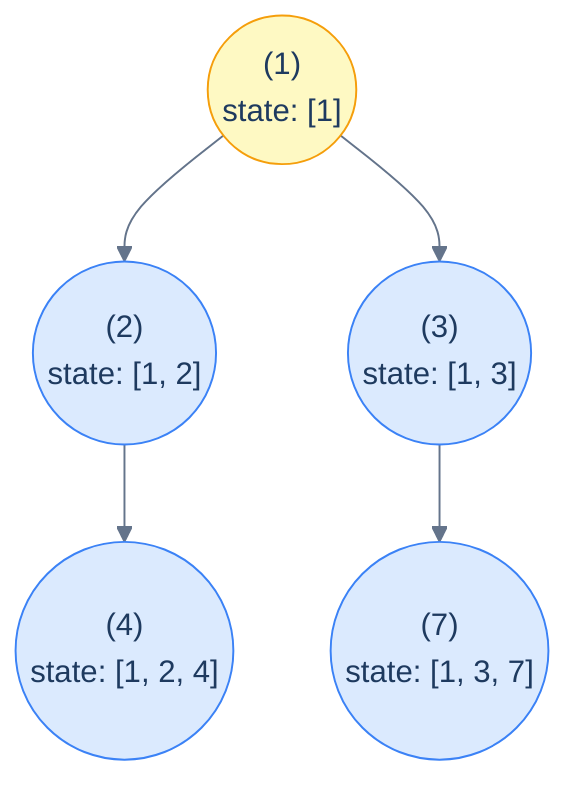
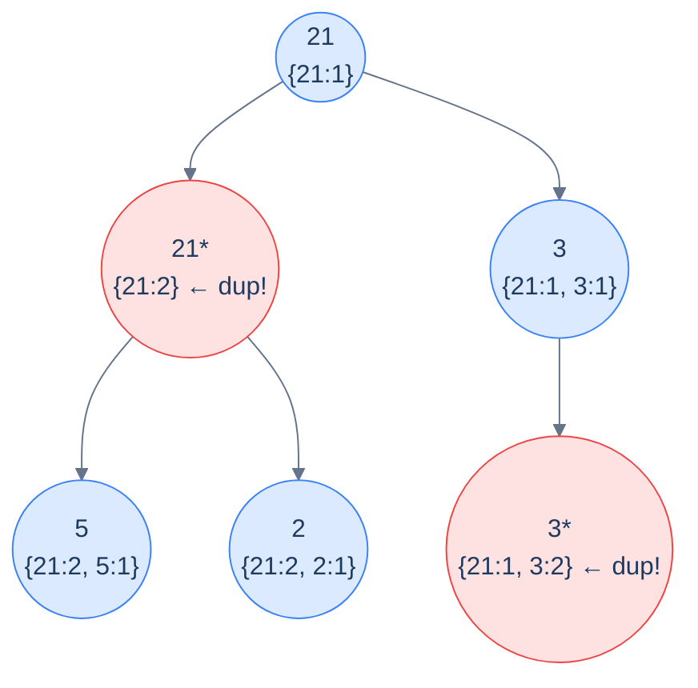
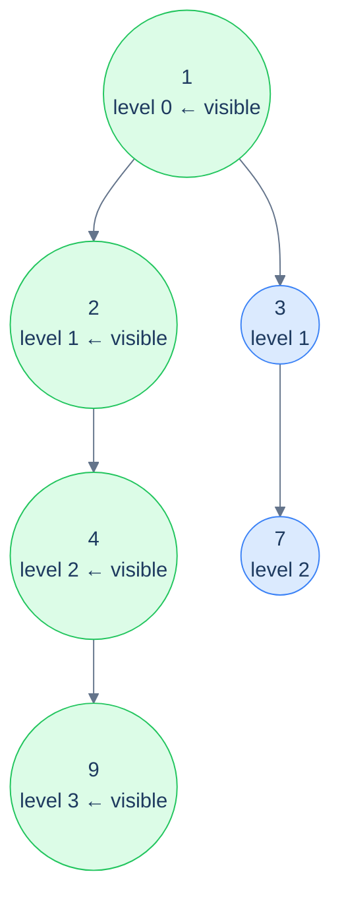

# 9. Pattern: Preorder Traversal (Stateful)

## The Hook

The previous lesson handled problems where a pure *integer* (or other small immutable value) flowed down the tree. Each recursive call got its own copy, sibling subtrees couldn't interfere with each other, and the algorithm was beautifully one-directional.

But what if the accumulator is a **mutable collection** — say, the *list of nodes on the current path*, or a *frequency map of values seen above*, or a *flag on what level we're currently at*? Copying a list at every recursive call would be O(N) per call, blowing up the entire algorithm to O(N²) or worse. We need the *same* collection to be visible across the whole traversal — but with a discipline that lets each subtree see *only* its own ancestors, not its siblings'.

The fix is **mutate then undo** — the canonical *backtracking* template. As recursion enters a node, *push* the node's contribution onto the shared accumulator. As recursion *returns* from that node (after both children are done), *pop* it off. The accumulator at any given recursive call holds *exactly* the contributions of the current node's ancestors — never its siblings, never its parents' siblings, never anything outside the current path.

This is the **stateful preorder pattern**. Same downward information flow as the stateless version, but now the accumulator is *shared* state with explicit push/pop bookkeeping. It powers an enormous range of problems: detecting cycles in paths, finding the K-th smallest, computing tree views (left view, right view, top view, bottom view), counting paths with constraints, and more.

This lesson defines the pattern precisely, distinguishes it from the stateless variant, and walks through four canonical problems that exemplify the four most common shapes of state — a **frequency map** (push/pop bookkeeping), **two scalar witnesses** (no push/pop needed), and **a level pointer** (the bookkeeping is implicit in the visit order).

---

## Table of contents

1. [The stateful preorder pattern](#the-stateful-preorder-pattern)
2. [How to recognise it](#how-to-recognise-it)
3. [Problem 1 — Duplicates in path](#problem-1--duplicates-in-path)
4. [Problem 2 — Second minimum](#problem-2--second-minimum)
5. [Problem 3 — Left view](#problem-3--left-view)
6. [Problem 4 — Right view](#problem-4--right-view)

***

# The stateful preorder pattern

The core idea — *mutate then undo*:

```text
preorder(node, sharedState):
  if node is null: return
  push(sharedState, node)              # add this node's contribution
  process(node, sharedState)
  preorder(node.left,  sharedState)
  preorder(node.right, sharedState)
  pop(sharedState, node)               # remove this node's contribution
```

The push and pop bracket the recursive calls. While we're inside the recursion for `node`'s descendants, the shared state contains exactly the path from the root to (and including) `node`. When we return from `node`, the state is restored to what it was when we *entered* `node` — which is what its parent's *other* child needs to see.



<p align="center"><strong>The shared state during a stateful preorder — at every node, the state contains <em>exactly</em> the values on the root-to-node path, no siblings, no extras. The push happens at entry; the pop happens at exit; the state is correct at every moment.</strong></p>

> *Predict before reading on — what happens if you forget the pop?*
>
> The state would *accumulate* across siblings — so after the recursion finishes node `2`'s subtree, when control moves to node `3`, the state would still contain `2` and `4` from the previous subtree's contributions. Sibling pollution. Forgetting the pop is the #1 bug in beginner backtracking code; if your solution gives wildly wrong answers on multi-branch trees but works on lopsided ones, the missing pop is almost always the culprit.

## Three flavours of state

Not every "stateful" problem needs an explicit push/pop. Here are the three shapes you'll see:

1. **Push-pop collection** (`Duplicates in path` below). The state is a list, set, or multimap. Push on entry, pop on exit. *Must* pop or sibling subtrees see each other.
2. **Monotone witnesses** (`Second minimum` below). The state is one or more scalars that *only ever increase or decrease*. No pop needed — once we've seen a smaller value somewhere, that fact is fine to keep when we move on. The state is genuinely shared and write-only-when-improved.
3. **Visit-order witnesses** (`Left view`, `Right view` below). No collection at all — just a counter that tracks *how deep we've drilled so far*. The "state" is implicit in the recursion's visit order; we exploit the fact that the *first* node visited at each new depth is the one we want.

The same pattern label applies to all three because they share the structural feature: *one shared mutable object that is read and updated as the recursion proceeds*. The mechanics of update vary; the spirit doesn't.

## Generic pattern

We'll show the **push-pop** flavour as the canonical generic — it's the strictest and the one most likely to bite you. The other two flavours are simpler restrictions of this template.


```python run
from typing import List, Optional

class TreeNode:
    def __init__(self, val=0, left=None, right=None):
        self.val, self.left, self.right = val, left, right

def stateful_preorder(root: Optional[TreeNode]):
    state: List[int] = []                       # shared collection
    def go(node):
        if node is None: return
        state.append(node.val)                  # push
        # ... use state to process node ...
        go(node.left)
        go(node.right)
        state.pop()                             # pop
    go(root)
```

```java run
static List<Integer> state;
static void statefulPreorderHelper(TreeNode node) {
    if (node == null) return;
    state.add(node.val);                        // push
    // process...
    statefulPreorderHelper(node.left);
    statefulPreorderHelper(node.right);
    state.remove(state.size() - 1);             // pop
}
public static void statefulPreorder(TreeNode root) {
    state = new ArrayList<>();
    statefulPreorderHelper(root);
}
```


## Complexity

> **Time:** O(N) for the traversal, plus whatever per-node work the `process` step does. Push/pop on a list/array are O(1) amortised. **Space:** O(h) for both the recursion and the path-sized state.

***

# How to recognise it

A problem fits this pattern when:

- The answer at each node depends on the **set or sequence of values on its path from the root** (not just an aggregate like a sum), *and*
- That set/sequence is too large or unwieldy to copy down at every call.

Concrete cues to look for:

- *"Find nodes whose ancestor sequence contains …"* — push-pop set/map
- *"Find the smallest / second-smallest / k-th smallest / max / max-so-far"* — monotone witnesses
- *"Return the leftmost / rightmost / first / topmost node at each level"* — visit-order witnesses
- *"Detect a cycle / repetition / pattern in the ancestry"* — push-pop set/map again

Anti-pattern: if the state really is just a number you're aggregating, use the *stateless* version (previous lesson). Don't reach for push-pop when an integer parameter would do.

***

# Problem 1 — Duplicates in path

> Given the root of a binary tree, return the number of nodes whose root-to-node path contains *another* node with the same value.

This is the canonical push-pop problem. The shared state is a **frequency map**: as we enter a node, increment its value's count; as we leave, decrement (and remove if it hits zero). At each entry, if the value's count was *already non-zero* before the increment, we've found a node whose path contained a duplicate.



<p align="center"><strong>Duplicates in path — at every node, check the frequency map: if the current value already has count ≥ 1, we've found a duplicate. Push on entry, pop on exit, count anything that was already there.</strong></p>

<details>
<summary><h2>Solution</h2></summary>


```python run
from typing import Optional, Dict
from collections import deque

class TreeNode:
    def __init__(self, val=0, left=None, right=None):
        self.val = val
        self.left = left
        self.right = right


def from_level_order(values):
    """Build tree from list like [1, 2, 3, None, 4]. None means missing child."""
    if not values:
        return None
    root = TreeNode(values[0])
    queue = [root]
    i = 1
    while queue and i < len(values):
        node = queue.pop(0)
        if i < len(values) and values[i] is not None:
            node.left = TreeNode(values[i])
            queue.append(node.left)
        i += 1
        if i < len(values) and values[i] is not None:
            node.right = TreeNode(values[i])
            queue.append(node.right)
        i += 1
    return root


class Solution:
    def __init__(self):

        # Map to track frequency of values in the current root-to-node
        # path
        self.frequency: Dict[int, int] = {}

        # Counter to track how many nodes have duplicates in their path
        self.duplicates: int = 0

    def duplicates_in_path_helper(
        self, root: Optional[TreeNode]
    ) -> None:

        # If the root is null, return
        if root is None:
            return

        # Check if the current node's value already exists in the path
        if root.val in self.frequency:

            # If it does, it's a duplicate
            self.duplicates += 1

        # Add the current node's value to the frequency map
        self.frequency[root.val] = self.frequency.get(root.val, 0) + 1

        # Recursively traverse the left and right subtrees
        self.duplicates_in_path_helper(root.left)
        self.duplicates_in_path_helper(root.right)

        # Backtrack: remove the current node's value from the path
        self.frequency[root.val] -= 1

        # If frequency becomes zero, erase the value from the map
        if self.frequency[root.val] == 0:
            del self.frequency[root.val]

    def duplicates_in_path(self, root: Optional[TreeNode]) -> int:

        # If the tree is empty, return 0 as there are no paths
        if root is None:
            return 0

        # Start the helper function from the root
        self.duplicates_in_path_helper(root)

        # Return the total duplicates found
        return self.duplicates


# Examples from the problem statement
print(Solution().duplicates_in_path(from_level_order([21, 21, 3, 5, 2, None, 3])))  # 2
print(Solution().duplicates_in_path(from_level_order([5, 7, 3, 1, 2, None, 8])))    # 0

# Edge cases
print(Solution().duplicates_in_path(None))                                           # 0
print(Solution().duplicates_in_path(from_level_order([7])))                          # 0
print(Solution().duplicates_in_path(from_level_order([1, 1, 1])))                    # 2
print(Solution().duplicates_in_path(from_level_order([1, 2, 3, 4, 5, 6, 7])))       # 0
print(Solution().duplicates_in_path(from_level_order([5, 5, None, 5])))              # 2
```

```java run
import java.util.*;

public class Main {
    static class TreeNode {
        int val;
        TreeNode left;
        TreeNode right;
        TreeNode() {}
        TreeNode(int val) { this.val = val; }
    }

    static TreeNode fromLevelOrder(Integer... values) {
        if (values.length == 0 || values[0] == null) return null;
        TreeNode root = new TreeNode(values[0]);
        java.util.Deque<TreeNode> queue = new java.util.ArrayDeque<>();
        queue.add(root);
        int i = 1;
        while (!queue.isEmpty() && i < values.length) {
            TreeNode node = queue.poll();
            if (i < values.length && values[i] != null) {
                node.left = new TreeNode(values[i]);
                queue.add(node.left);
            }
            i++;
            if (i < values.length && values[i] != null) {
                node.right = new TreeNode(values[i]);
                queue.add(node.right);
            }
            i++;
        }
        return root;
    }

    static class Solution {

        // Map to track frequency of values in the current root-to-node path
        private Map<Integer, Integer> frequency = new HashMap<>();

        // Counter to track how many nodes have duplicates in their path
        private int duplicates = 0;

        private void duplicatesInPathHelper(TreeNode root) {

            // If the root is null, return
            if (root == null) {
                return;
            }

            // Check if the current node's value already exists in the path
            if (frequency.containsKey(root.val)) {

                // If it does, it's a duplicate
                duplicates++;
            }

            // Add the current node's value to the frequency map
            frequency.put(root.val, frequency.getOrDefault(root.val, 0) + 1);

            // Recursively traverse the left and right subtrees
            duplicatesInPathHelper(root.left);
            duplicatesInPathHelper(root.right);

            // Backtrack: remove the current node's value from the path
            frequency.put(root.val, frequency.get(root.val) - 1);

            // If frequency becomes zero, erase the value from the map
            if (frequency.get(root.val) == 0) {
                frequency.remove(root.val);
            }
        }

        public int duplicatesInPath(TreeNode root) {

            // If the tree is empty, return 0 as there are no paths
            if (root == null) {
                return 0;
            }

            // Start the helper function from the root
            duplicatesInPathHelper(root);

            // Return the total duplicates found
            return duplicates;
        }
    }

    public static void main(String[] args) {
        // Examples from the problem statement
        System.out.println(new Solution().duplicatesInPath(fromLevelOrder(21, 21, 3, 5, 2, null, 3)));  // 2
        System.out.println(new Solution().duplicatesInPath(fromLevelOrder(5, 7, 3, 1, 2, null, 8)));    // 0

        // Edge cases
        System.out.println(new Solution().duplicatesInPath(null));                                       // 0
        System.out.println(new Solution().duplicatesInPath(fromLevelOrder(7)));                          // 0
        System.out.println(new Solution().duplicatesInPath(fromLevelOrder(1, 1, 1)));                    // 2
        System.out.println(new Solution().duplicatesInPath(fromLevelOrder(1, 2, 3, 4, 5, 6, 7)));       // 0
        System.out.println(new Solution().duplicatesInPath(fromLevelOrder(5, 5, null, 5)));              // 2
    }
}
```

</details>


***

# Problem 2 — Second minimum

> Given the root of a binary tree, find and return the second-smallest distinct value. If there's no second minimum, return `-1`.

This is the **monotone witnesses** flavour. The state is two integers, `min` and `secondMin`, both shared across the recursion. Each visit either improves `min` (and demotes the old min to `secondMin`) or improves `secondMin`. No push/pop needed — once we've seen a smaller value, that's a global fact, not a path-local one.

<details>
<summary><h2>Solution</h2></summary>


```python run
from typing import Optional

class TreeNode:
    def __init__(self, val=0, left=None, right=None):
        self.val = val
        self.left = left
        self.right = right


def from_level_order(values):
    """Build tree from list like [1, 2, 3, None, 4]. None means missing child."""
    if not values:
        return None
    root = TreeNode(values[0])
    queue = [root]
    i = 1
    while queue and i < len(values):
        node = queue.pop(0)
        if i < len(values) and values[i] is not None:
            node.left = TreeNode(values[i])
            queue.append(node.left)
        i += 1
        if i < len(values) and values[i] is not None:
            node.right = TreeNode(values[i])
            queue.append(node.right)
        i += 1
    return root


class Solution:
    def __init__(self) -> None:
        self.minimum: int
        self.second_minimum: int

    def find_second_minimum_helper(
        self, root: Optional[TreeNode]
    ) -> None:

        # Base case: if the root is None, return
        if root is None:
            return

        # Check if the value of the current node is less than the current
        # minimum
        if root.val < self.minimum:

            # Update the second minimum to the previous minimum
            self.second_minimum = self.minimum

            # Update the minimum to the value of the current node
            self.minimum = root.val
        elif root.val > self.minimum and (
            root.val < self.second_minimum or self.second_minimum == -1
        ):

            # Check if the value of the current node is greater than the
            # current minimum and less than the current second minimum
            # (or second minimum is not yet set) If so, update the second
            # minimum to the value of the current node
            self.second_minimum = root.val

        # Recursively traverse the left and right subtrees
        self.find_second_minimum_helper(root.left)
        self.find_second_minimum_helper(root.right)

    def find_second_minimum(self, root: Optional[TreeNode]) -> int:

        # Check if the root is None, return -1 as no second minimum
        # exists
        if root is None:
            return -1

        # Initialize the minimum to the value of the root node
        self.minimum = root.val

        # Initialize the second minimum to -1, indicating it has not been
        # set yet
        self.second_minimum = -1

        # Call the helper function to find the minimum and second minimum
        # values
        self.find_second_minimum_helper(root)

        # Return the second minimum value found
        return self.second_minimum


# Examples from the problem statement
print(Solution().find_second_minimum(from_level_order([1, 2, 5, 7, None, None, 3])))  # 2
print(Solution().find_second_minimum(from_level_order([1, 8, 4, None, None, 9, 7])))  # 4

# Edge cases
print(Solution().find_second_minimum(None))                                            # -1
print(Solution().find_second_minimum(from_level_order([5])))                           # -1
print(Solution().find_second_minimum(from_level_order([5, 5, 5])))                     # -1 (all same)
print(Solution().find_second_minimum(from_level_order([1, 2])))                        # 2
print(Solution().find_second_minimum(from_level_order([3, 1, 4, 1, 5, 9, 2])))        # 2
print(Solution().find_second_minimum(from_level_order([1, 2, 3, 4, 5, 6, 7])))        # 2
```

```java run
import java.util.*;

public class Main {
    static class TreeNode {
        int val;
        TreeNode left;
        TreeNode right;
        TreeNode() {}
        TreeNode(int val) { this.val = val; }
    }

    static TreeNode fromLevelOrder(Integer... values) {
        if (values.length == 0 || values[0] == null) return null;
        TreeNode root = new TreeNode(values[0]);
        java.util.Deque<TreeNode> queue = new java.util.ArrayDeque<>();
        queue.add(root);
        int i = 1;
        while (!queue.isEmpty() && i < values.length) {
            TreeNode node = queue.poll();
            if (i < values.length && values[i] != null) {
                node.left = new TreeNode(values[i]);
                queue.add(node.left);
            }
            i++;
            if (i < values.length && values[i] != null) {
                node.right = new TreeNode(values[i]);
                queue.add(node.right);
            }
            i++;
        }
        return root;
    }

    static class Solution {

        // Global variables to store minimum and second minimum values
        private int minimum;
        private int secondMinimum;

        private void findSecondMinimumHelper(TreeNode root) {

            // Base case: if the root is null, return
            if (root == null) {
                return;
            }

            // Check if the value of the current node is less than the
            // current minimum
            if (root.val < minimum) {

                // Update the second minimum to the previous minimum
                secondMinimum = minimum;

                // Update the minimum to the value of the current node
                minimum = root.val;
            } else if (
                root.val > minimum &&
                (root.val < secondMinimum || secondMinimum == -1)
            ) {

                // Check if the value of the current node is greater than the
                // current minimum and less than the current second minimum
                // (or second minimum is not yet set) If so, update the
                // second minimum to the value of the current node
                secondMinimum = root.val;
            }

            // Recursively traverse the left and right subtrees
            findSecondMinimumHelper(root.left);
            findSecondMinimumHelper(root.right);
        }

        public int findSecondMinimum(TreeNode root) {

            // Check if the root is null, return -1 as no second minimum
            // exists
            if (root == null) {
                return -1;
            }

            // Initialize the minimum to the value of the root node
            minimum = root.val;

            // Initialize the second minimum to -1, indicating it has not
            // been set yet
            secondMinimum = -1;

            // Call the helper function to find the minimum and second
            // minimum values
            findSecondMinimumHelper(root);

            // Return the second minimum value found
            return secondMinimum;
        }
    }

    public static void main(String[] args) {
        // Examples from the problem statement
        System.out.println(new Solution().findSecondMinimum(fromLevelOrder(1, 2, 5, 7, null, null, 3)));  // 2
        System.out.println(new Solution().findSecondMinimum(fromLevelOrder(1, 8, 4, null, null, 9, 7)));  // 4

        // Edge cases
        System.out.println(new Solution().findSecondMinimum(null));                                        // -1
        System.out.println(new Solution().findSecondMinimum(fromLevelOrder(5)));                           // -1
        System.out.println(new Solution().findSecondMinimum(fromLevelOrder(5, 5, 5)));                     // -1 (all same)
        System.out.println(new Solution().findSecondMinimum(fromLevelOrder(1, 2)));                        // 2
        System.out.println(new Solution().findSecondMinimum(fromLevelOrder(3, 1, 4, 1, 5, 9, 2)));        // 2
        System.out.println(new Solution().findSecondMinimum(fromLevelOrder(1, 2, 3, 4, 5, 6, 7)));        // 2
    }
}
```

</details>


***

# Problem 3 — Left view

> Given the root of a binary tree, return the values of the leftmost node *at each level* of the tree, top to bottom.
>
> **Example:** tree `[1, 2, 3, 4, null, null, 7, 9]` → `[1, 2, 4, 9]`.

This is the **visit-order witnesses** flavour. The state is just one integer: `maxLevelReached` — the deepest level we've already added a node from. Recurse into the *left* subtree before the right; whenever the current call's level *equals* `maxLevelReached`, we know we're seeing a *new* level for the first time, so the current node is the leftmost at that level.



<p align="center"><strong>Left view — recurse left-first; the first node visited at each new level is the leftmost. The state is a single counter that ratchets forward each time we see a deeper level.</strong></p>

<details>
<summary><h2>Solution</h2></summary>


```python run
from typing import List, Optional

class TreeNode:
    def __init__(self, val=0, left=None, right=None):
        self.val = val
        self.left = left
        self.right = right


def from_level_order(values):
    """Build tree from list like [1, 2, 3, None, 4]. None means missing child."""
    if not values:
        return None
    root = TreeNode(values[0])
    queue = [root]
    i = 1
    while queue and i < len(values):
        node = queue.pop(0)
        if i < len(values) and values[i] is not None:
            node.left = TreeNode(values[i])
            queue.append(node.left)
        i += 1
        if i < len(values) and values[i] is not None:
            node.right = TreeNode(values[i])
            queue.append(node.right)
        i += 1
    return root


class Solution:
    def __init__(self):

        # Global variable to keep track of the current level during
        # recursion
        self.max_level_reached = 0

    def left_view_helper(
        self, root: Optional[TreeNode], level: int, result: List[int]
    ) -> None:
        if not root:
            return

        # If this is the first node of the current level, add it to
        # result
        if level == self.max_level_reached:
            result.append(root.val)

            # Increment the level after adding the node to result
            self.max_level_reached += 1

        # Recur for left, then right (ensures leftmost nodes are visited
        # first)
        self.left_view_helper(root.left, level + 1, result)
        self.left_view_helper(root.right, level + 1, result)

    def left_view(self, root: Optional[TreeNode]) -> List[int]:

        # Stores the left view of the binary tree
        result = []

        # Find the left view of the binary tree
        self.left_view_helper(root, 0, result)

        # Return the left view of the binary tree
        return result


# Examples from the problem statement
print(Solution().left_view(from_level_order([1, 2, 3, 4, None, None, 7, 9])))  # [1, 2, 4, 9]
print(Solution().left_view(from_level_order([1, 8, 4, None, None, 2, 7])))     # [1, 8, 2]

# Edge cases
print(Solution().left_view(None))                                                # []
print(Solution().left_view(from_level_order([5])))                               # [5]
print(Solution().left_view(from_level_order([1, 2, None, 3])))                   # [1, 2, 3] (left-skew)
print(Solution().left_view(from_level_order([1, None, 2, None, 3])))             # [1, 2, 3] (right-skew)
print(Solution().left_view(from_level_order([1, 2, 3, 4, 5, 6, 7])))            # [1, 2, 4]
```

```java run
import java.util.*;

public class Main {
    static class TreeNode {
        int val;
        TreeNode left;
        TreeNode right;
        TreeNode() {}
        TreeNode(int val) { this.val = val; }
    }

    static TreeNode fromLevelOrder(Integer... values) {
        if (values.length == 0 || values[0] == null) return null;
        TreeNode root = new TreeNode(values[0]);
        java.util.Deque<TreeNode> queue = new java.util.ArrayDeque<>();
        queue.add(root);
        int i = 1;
        while (!queue.isEmpty() && i < values.length) {
            TreeNode node = queue.poll();
            if (i < values.length && values[i] != null) {
                node.left = new TreeNode(values[i]);
                queue.add(node.left);
            }
            i++;
            if (i < values.length && values[i] != null) {
                node.right = new TreeNode(values[i]);
                queue.add(node.right);
            }
            i++;
        }
        return root;
    }

    static class Solution {

        // Global variable to keep track of the current level during
        // recursion
        private int maxLevelReached = 0;

        private void lefViewHelper(
            TreeNode root,
            int level,
            List<Integer> result
        ) {
            if (root == null) {
                return;
            }

            // If this is the first node of the current level, add it to
            // result
            if (level == maxLevelReached) {
                result.add(root.val);

                // Increment the level after adding the node to result
                maxLevelReached++;
            }

            // Recur for left, then right (ensures leftmost nodes are visited
            // first)
            lefViewHelper(root.left, level + 1, result);
            lefViewHelper(root.right, level + 1, result);
        }

        public List<Integer> leftView(TreeNode root) {

            // Stores the left view of the binary tree
            List<Integer> result = new ArrayList<>();

            // Find the left view of the binary tree
            lefViewHelper(root, 0, result);

            // Return the left view of the binary tree
            return result;
        }
    }

    public static void main(String[] args) {
        // Examples from the problem statement
        System.out.println(new Solution().leftView(fromLevelOrder(1, 2, 3, 4, null, null, 7, 9)));  // [1, 2, 4, 9]
        System.out.println(new Solution().leftView(fromLevelOrder(1, 8, 4, null, null, 2, 7)));     // [1, 8, 2]

        // Edge cases
        System.out.println(new Solution().leftView(null));                                           // []
        System.out.println(new Solution().leftView(fromLevelOrder(5)));                              // [5]
        System.out.println(new Solution().leftView(fromLevelOrder(1, 2, null, 3)));                  // [1, 2, 3] (left-skew)
        System.out.println(new Solution().leftView(fromLevelOrder(1, null, 2, null, 3)));            // [1, 2, 3] (right-skew)
        System.out.println(new Solution().leftView(fromLevelOrder(1, 2, 3, 4, 5, 6, 7)));           // [1, 2, 4]
    }
}
```

</details>


***

# Problem 4 — Right view

> Same as the left view, but from the right side. Tree `[1, 2, 3, 4, null, null, 7, 9]` → `[1, 3, 7, 9]`.

The trick is *identical* to the left view, with one swap: recurse **right before left**. The first node visited at each new level is now the rightmost.

<details>
<summary><h2>Solution</h2></summary>


```python run
from typing import Optional, List

class TreeNode:
    def __init__(self, val=0, left=None, right=None):
        self.val = val
        self.left = left
        self.right = right


def from_level_order(values):
    """Build tree from list like [1, 2, 3, None, 4]. None means missing child."""
    if not values:
        return None
    root = TreeNode(values[0])
    queue = [root]
    i = 1
    while queue and i < len(values):
        node = queue.pop(0)
        if i < len(values) and values[i] is not None:
            node.left = TreeNode(values[i])
            queue.append(node.left)
        i += 1
        if i < len(values) and values[i] is not None:
            node.right = TreeNode(values[i])
            queue.append(node.right)
        i += 1
    return root


class Solution:
    def __init__(self):

        # Global variable to keep track of the current level during
        # recursion
        self.max_level_reached = 0

    def right_view_helper(
        self, root: Optional[TreeNode], level: int, result: List[int]
    ) -> None:
        if not root:
            return

        # If this is the first node of the current level, add it to
        # result
        if level == self.max_level_reached:
            result.append(root.val)

            # Increment the level after adding the node to result
            self.max_level_reached += 1

        # Recur for right, then left (ensures rightmost nodes are visited
        # first)
        self.right_view_helper(root.right, level + 1, result)
        self.right_view_helper(root.left, level + 1, result)

    def right_view(self, root: Optional[TreeNode]) -> List[int]:

        # Stores the right view of the binary tree
        result = []

        # Find the right view of the binary tree
        self.right_view_helper(root, 0, result)

        # Return the right view of the binary tree
        return result


# Examples from the problem statement
print(Solution().right_view(from_level_order([1, 2, 3, 4, None, None, 7, 9])))  # [1, 3, 7, 9]
print(Solution().right_view(from_level_order([1, 8, 4, None, None, 2, 7])))     # [1, 4, 7]

# Edge cases
print(Solution().right_view(None))                                                # []
print(Solution().right_view(from_level_order([5])))                               # [5]
print(Solution().right_view(from_level_order([1, None, 2, None, 3])))             # [1, 2, 3] (right-skew)
print(Solution().right_view(from_level_order([1, 2, None, 3])))                   # [1, 2, 3] (left-skew)
print(Solution().right_view(from_level_order([1, 2, 3, 4, 5, 6, 7])))            # [1, 3, 7]
```

```java run
import java.util.*;

public class Main {
    static class TreeNode {
        int val;
        TreeNode left;
        TreeNode right;
        TreeNode() {}
        TreeNode(int val) { this.val = val; }
    }

    static TreeNode fromLevelOrder(Integer... values) {
        if (values.length == 0 || values[0] == null) return null;
        TreeNode root = new TreeNode(values[0]);
        java.util.Deque<TreeNode> queue = new java.util.ArrayDeque<>();
        queue.add(root);
        int i = 1;
        while (!queue.isEmpty() && i < values.length) {
            TreeNode node = queue.poll();
            if (i < values.length && values[i] != null) {
                node.left = new TreeNode(values[i]);
                queue.add(node.left);
            }
            i++;
            if (i < values.length && values[i] != null) {
                node.right = new TreeNode(values[i]);
                queue.add(node.right);
            }
            i++;
        }
        return root;
    }

    static class Solution {

        // Global variable to keep track of the current level during
        // recursion
        private int maxLevelReached = 0;

        private void rightViewHelper(
            TreeNode root,
            int level,
            List<Integer> result
        ) {
            if (root == null) {
                return;
            }

            // If this is the first node of the current level, add it to
            // result
            if (level == maxLevelReached) {
                result.add(root.val);

                // Increment the level after adding the node to result
                maxLevelReached++;
            }

            // Recur for right, then left (ensures rightmost nodes are
            // visited first)
            rightViewHelper(root.right, level + 1, result);
            rightViewHelper(root.left, level + 1, result);
        }

        public List<Integer> rightView(TreeNode root) {

            // Stores the right view of the binary tree
            List<Integer> result = new ArrayList<>();

            // Find the right view of the binary tree
            rightViewHelper(root, 0, result);

            // Return the right view of the binary tree
            return result;
        }
    }

    public static void main(String[] args) {
        // Examples from the problem statement
        System.out.println(new Solution().rightView(fromLevelOrder(1, 2, 3, 4, null, null, 7, 9)));  // [1, 3, 7, 9]
        System.out.println(new Solution().rightView(fromLevelOrder(1, 8, 4, null, null, 2, 7)));     // [1, 4, 7]

        // Edge cases
        System.out.println(new Solution().rightView(null));                                           // []
        System.out.println(new Solution().rightView(fromLevelOrder(5)));                              // [5]
        System.out.println(new Solution().rightView(fromLevelOrder(1, null, 2, null, 3)));            // [1, 2, 3] (right-skew)
        System.out.println(new Solution().rightView(fromLevelOrder(1, 2, null, 3)));                  // [1, 2, 3] (left-skew)
        System.out.println(new Solution().rightView(fromLevelOrder(1, 2, 3, 4, 5, 6, 7)));           // [1, 3, 7]
    }
}
```

</details>
<details>
<summary><h2>Final Takeaway</h2></summary>


The stateful preorder pattern is the second-most-common shape in the chapter. Three things to walk away with:

1. **Push then recurse then pop.** When the state is a mutable collection, the discipline is sacred: push on entry, both recursions, pop on exit. Forgetting the pop is the canonical "my answer is way too big" backtracking bug. *Always* check that every push has a paired pop on every code path.
2. **Not every "shared mutable" is push-pop.** Monotone witnesses (min/max/best-so-far) and visit-order witnesses (first-at-each-level) share a mutable across the recursion *without* needing pop, because their updates are inherently global facts (or because the visit order itself encodes the bookkeeping).
3. **Left-vs-right preference is what gives "first" its meaning.** The view problems all turn on which child you recurse into *first*. Left view: left first. Right view: right first. Top view: process by level *and* horizontal distance. Generalise this — whenever a problem says "first / leftmost / rightmost / topmost", the *recursion order* is doing the work.

> *Coming up — the chapter pivots from the downward-flowing preorder patterns to the upward-flowing <strong>postorder</strong> patterns. Where preorder hands data <em>from parent to child</em>, postorder gathers data <em>from children to parent</em>. The next two lessons (stateless and stateful postorder) cover heights, sums, diameters, and a wealth of other "compute the answer at each node from its subtrees' answers" problems.*

</details>