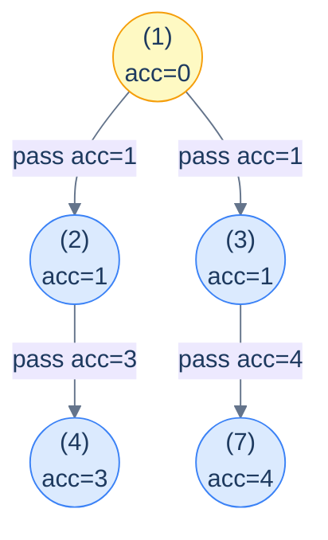

# The stateless preorder pattern

The pattern in pseudocode:

```text
preorder(node, accumulator):
  if node is null: return
  process(node, accumulator)                           # use the accumulator
  newAccumulator = update(accumulator, node.val)       # combine with this node
  preorder(node.left,  newAccumulator)                 # hand to left child
  preorder(node.right, newAccumulator)                 # hand to right child
```

The accumulator is *passed by value* (or as an immutable reference) down the recursion. Each child receives a *copy* — so changes one subtree makes never affect the other. There's no need for "back out" cleanup because there's nothing to clean up: the parent's value is already saved on its own stack frame, untouched.

> 🖼 Diagram — Stateless preorder data flow — each node updates the accumulator with its own value before passing it to its children. The arrows on the edges show what each child receives. Notice both children of a node receive the same updated accumulator — the parent's contribution is included exactly once.


<p align="center"><strong>Stateless preorder data flow — each node updates the accumulator with its own value <em>before</em> passing it to its children. The arrows on the edges show what each child receives. Notice both children of a node receive the <em>same</em> updated accumulator — the parent's contribution is included exactly once.</strong></p>

> **Why "stateless"?** Because the algorithm doesn't carry mutable state across recursive calls. Sibling subtrees see each other's work *not at all* — they each get a fresh copy of the parent's accumulator. Compare this with the *stateful* preorder pattern (next lesson), which uses a single shared mutable accumulator that needs explicit "undo" steps when a sibling subtree is finished.

## Generic pattern


```python run viz=binary-tree viz-root=root
from typing import Optional

class TreeNode:
    def __init__(self, val=0, left=None, right=None):
        self.val, self.left, self.right = val, left, right

def f(acc, val):                       # combine the parent's acc with this node's value
    return acc + val                   # placeholder — replace with real combiner

def stateless_preorder(root: Optional[TreeNode], acc=0):
    if root is None: return
    # ... use acc here to process root if needed ...
    new_acc = f(acc, root.val)
    stateless_preorder(root.left,  new_acc)
    stateless_preorder(root.right, new_acc)
```

```java run viz=binary-tree viz-root=root
static int f(int acc, int val) { return acc + val; }
static void statelessPreorder(TreeNode node, int acc) {
    if (node == null) return;
    // ... use acc to process node ...
    int newAcc = f(acc, node.val);
    statelessPreorder(node.left,  newAcc);
    statelessPreorder(node.right, newAcc);
}
```


## Complexity

> **Time:** O(N) — every node is visited exactly once. **Space:** O(h) for the recursion stack.

# How to recognise it

A problem fits this pattern if **every node's answer depends only on the path from the root to it** — and that dependency is *summarisable* by a small piece of data (a sum, a max, a depth, a string, a flag) that can be computed *incrementally* as the recursion descends.

Look for verb phrases like:

- *"For each node, compute … from root to that node"*
- *"For each node, the value of … on the path above it"*
- *"Update each node based on its ancestors"*
- *"Mark every node where … from the root"*

Anti-pattern (does **not** fit): if the answer depends on a node's *descendants* or *both* sides of the tree at once, you want the *postorder* pattern instead. If sibling subtrees need to communicate, you want the *stateful* variant.

<!-- ============================================== -->
<!-- SWEEP 2 — missing sections (placeholders only) -->
<!-- ============================================== -->

<!-- TODO: Understanding the Pattern — missing, needs to be written -->
<!--       Guidance: umbrella H2 with the subsections below -->

<!-- TODO: Why Naive Isn't Enough — missing, needs to be written -->
<!--       Guidance: motivation for why the obvious approach fails -->

<!-- TODO: The Core Idea — missing, needs to be written -->
<!--       Guidance: one paragraph: the central trick -->

<!-- TODO: How the Pointers/Window Move — missing, needs to be written -->
<!--       Guidance: mechanics of the moving parts -->

<!-- TODO: The Generic Algorithm — missing, needs to be written -->
<!--       Guidance: numbered steps, no code -->

<!-- TODO: Generic Implementation — missing, needs to be written -->
<!--       Guidance: Python block + Java block of the skeleton -->

<!-- TODO: Complexity Analysis — missing, needs to be written -->
<!--       Guidance: table -->

<!-- TODO: Variants / Taxonomy — missing, needs to be written -->
<!--       Guidance: enumerate sub-shapes of this pattern -->

<!-- TODO: Identifying — missing, needs to be written -->
<!--       Guidance: per-variant: recognition checklist + canonical example -->

<!-- TODO: Recognition Checklist — missing, needs to be written -->
<!--       Guidance: 4-question diagnostic — the source of the Problem-section Diagnostic Questions -->

<!-- TODO: Canonical Example — missing, needs to be written -->
<!--       Guidance: fully worked example: brute force → optimised → template fit -->

<!-- TODO: Problems in This Category — missing, needs to be written -->
<!--       Guidance: table with links to the 02-problems/ files -->
