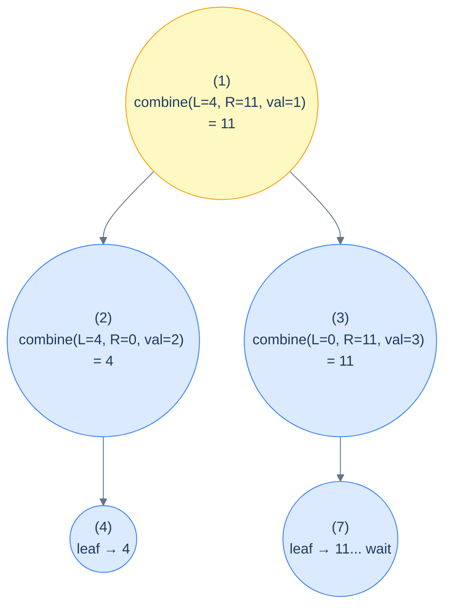
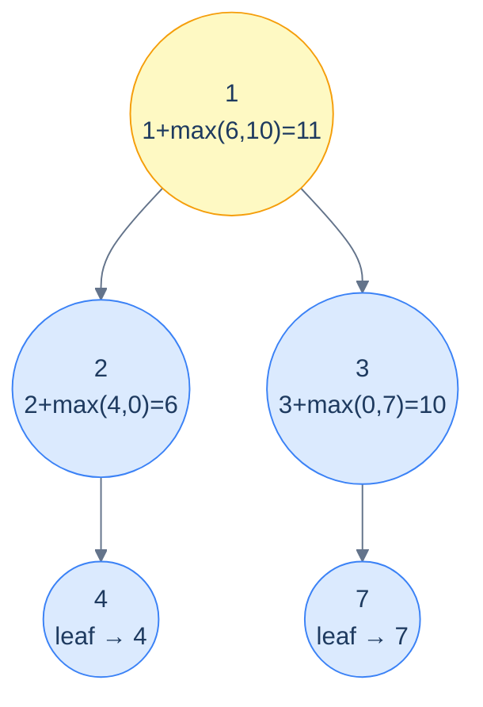
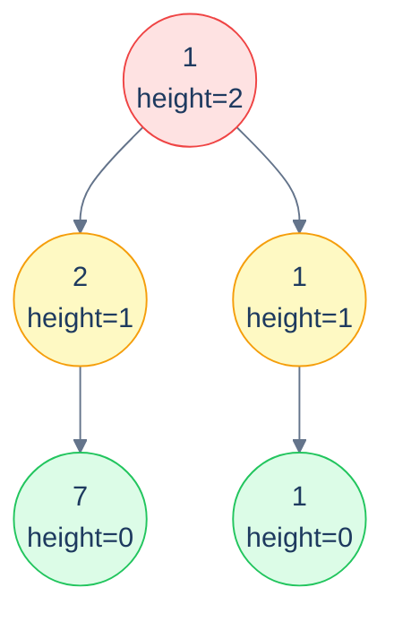

# 10. Pattern: Postorder Traversal (Stateless)

## The Hook

The preorder patterns from the last two lessons handed information *down* the tree — parent computes, children inherit. But there's a whole class of problems where the question runs the *other* way: each node's answer can only be computed once it knows the answer for *both of its subtrees*. The height of a node? Max of the left and right subtree heights, plus one. The sum of values in a subtree? Sum of left + sum of right + node's own value. Whether a tree is a full binary tree? Both subtrees must themselves be full *and* the current node must have either zero or two children.

That dependency direction — *children answer first, then their parent combines* — is what postorder traversal is for. The recursive call descends to the leaves, leaves return their base-case answers, internal nodes combine those answers, and the root ends up with the final answer.

The **stateless** variant is the cleanest: each recursive call **returns** its subtree's answer, and the parent combines what comes back. No mutable state, no shared accumulator, no `void` helper that smuggles data through a side effect. Just `f(left) + f(right) + something(node)` — the recursive equation written directly.

This pattern is the bread-and-butter of binary-tree problems. *Every* "compute X for the whole tree" question — height, size, sum, max, balance check, structural validation, BST check, depth comparisons — fits this shape. Even the postorder *stateful* pattern in the next lesson is just an enhancement: it adds a side channel for problems where each subtree needs to report *more than one number* back to its parent.

This lesson establishes the recipe, the canonical six example problems (sum-of-leaves, height, max path sum, full-tree check, perfect-tree check, collect-leaves-by-height), and clean implementations for each in 10 languages.

---

## Table of contents

1. [The stateless postorder pattern](#the-stateless-postorder-pattern)
2. [How to recognise it](#how-to-recognise-it)
3. [Problem 1 — Sum of leaves](#problem-1--sum-of-leaves)
4. [Problem 2 — Height of a binary tree](#problem-2--height-of-a-binary-tree)
5. [Problem 3 — Maximum root-to-leaf path sum](#problem-3--maximum-root-to-leaf-path-sum)
6. [Problem 4 — Is it a full binary tree?](#problem-4--is-it-a-full-binary-tree)
7. [Problem 5 — Is it a perfect binary tree?](#problem-5--is-it-a-perfect-binary-tree)
8. [Problem 6 — Collect leaves by height](#problem-6--collect-leaves-by-height)

***

# The stateless postorder pattern

```text
postorder(node):
  if node is null: return baseCase                  # e.g. 0, -1, true, infinity
  leftAnswer  = postorder(node.left)
  rightAnswer = postorder(node.right)
  return combine(leftAnswer, rightAnswer, node.val) # the recurrence
```

The shape is identical for every postorder-stateless problem; only the `baseCase` and the `combine` change. Pick those two correctly and the entire algorithm writes itself.



<p align="center"><strong>Postorder data flow for max root-to-leaf path sum — leaves return their own value; each internal node returns <code>val + max(L, R)</code>; the root ends up with the answer. The arrows that <em>go down</em> are recursive calls; the values that <em>come up</em> are the returns. (Note: in the example, leaf 7 returns its own value 7, not 11; the node's own value adds at the parent.)</strong></p>

> **Why "stateless"?** No mutable state escapes a stack frame. Each call computes its return value purely from its children's return values and the local node — like a functional fold over the tree. Two calls on the same subtree would return the same thing; there's no global accumulator that could give different answers depending on visit order.

## Generic pattern in 10 languages

Below is a "sum of all node values" template — illustrative; substitute the right base case and combine for your problem.


```pseudocode
function statelessPostorder(node):
    if node = null: return 0        # base case — adapt for each problem
    left  ← statelessPostorder(node.left)
    right ← statelessPostorder(node.right)
    return left + right + node.val  # combine — adapt for each problem
```

```python run
from typing import Optional

class TreeNode:
    def __init__(self, val=0, left=None, right=None):
        self.val, self.left, self.right = val, left, right

def stateless_postorder(node: Optional[TreeNode]) -> int:
    if node is None: return 0                      # base case
    left  = stateless_postorder(node.left)
    right = stateless_postorder(node.right)
    return left + right + node.val                 # combine
```

```java run
static int statelessPostorder(TreeNode node) {
    if (node == null) return 0;
    int left  = statelessPostorder(node.left);
    int right = statelessPostorder(node.right);
    return left + right + node.val;
}
```

```c run
int stateless_postorder(TreeNode *n) {
    if (!n) return 0;
    int left  = stateless_postorder(n->left);
    int right = stateless_postorder(n->right);
    return left + right + n->val;
}
```

```scala run
def statelessPostorder(n: TreeNode): Int = {
  if (n == null) return 0
  val l = statelessPostorder(n.left)
  val r = statelessPostorder(n.right)
  l + r + n.value
}
```


## Complexity

> **Time:** O(N) — each node visited once. **Space:** O(h) for the recursion stack.

***

# How to recognise it

The pattern fits when:

- The answer for any subtree can be **computed solely from the answers of its two subtrees** (and the current node's own value).
- The whole-tree answer is the answer at the root.

Concrete cues:

- *"Find the height / depth / size of the tree"* — recurrence on subtree heights/sizes.
- *"Sum / max / min over all nodes / leaves / paths"* — fold over the tree.
- *"Is the tree balanced / full / perfect / a BST?"* — structural validation, both subtrees must satisfy a property *and* the current node fits.
- *"Compute X for every subtree"* — same shape, just record the answer at every node.

Anti-pattern: if the answer depends on the *path from the root* to a node (info from above), use a preorder pattern instead. If sibling subtrees need to report multiple values back (e.g., "the longest path through this node, plus the longest path entirely within this subtree"), you want the *stateful* postorder pattern (next lesson).

***

# Problem 1 — Sum of leaves

> Given the root, compute the sum of all leaf node values.

Base case: empty tree contributes 0. Leaf returns its own value. Internal node returns `sumOfLeaves(left) + sumOfLeaves(right)` — the node's own value doesn't enter (it's not a leaf).

## Solution


```pseudocode
function sumOfLeaves(root):
    if root = null: return 0
    if root.left = null AND root.right = null: return root.val   # leaf
    return sumOfLeaves(root.left) + sumOfLeaves(root.right)
```

```python run
def sum_of_leaves(root):
    if root is None: return 0
    if root.left is None and root.right is None:
        return root.val
    return sum_of_leaves(root.left) + sum_of_leaves(root.right)
```

```java run
public static int sumOfLeaves(TreeNode root) {
    if (root == null) return 0;
    if (root.left == null && root.right == null) return root.val;
    return sumOfLeaves(root.left) + sumOfLeaves(root.right);
}
```

```c run
int sum_of_leaves(TreeNode *root) {
    if (!root) return 0;
    if (!root->left && !root->right) return root->val;
    return sum_of_leaves(root->left) + sum_of_leaves(root->right);
}
```

```scala run
def sumOfLeaves(root: TreeNode): Int = {
  if (root == null) return 0
  if (root.left == null && root.right == null) return root.value
  sumOfLeaves(root.left) + sumOfLeaves(root.right)
}
```


***

# Problem 2 — Height of a binary tree

> Compute the height of the tree (number of nodes along the longest root-to-leaf path).

Base case: empty tree has height 0 (under the *node-counting* convention used in this problem). Each internal node returns `max(height(left), height(right)) + 1`. The root's answer is the tree's height.

> **Note on conventions:** This problem uses the *node-counting* convention (empty = 0, single node = 1). Lesson 1 used the *edge-counting* convention (empty = -1, single node = 0). Both are common; *always read the problem carefully* and pick base cases that make the recurrence consistent.

## Solution


```pseudocode
function height(root):
    if root = null: return 0
    return 1 + max(height(root.left), height(root.right))
```

```python run
def height(root):
    if root is None: return 0
    return 1 + max(height(root.left), height(root.right))
```

```java run
public static int height(TreeNode root) {
    if (root == null) return 0;
    return 1 + Math.max(height(root.left), height(root.right));
}
```

```c run
int height(TreeNode *root) {
    if (!root) return 0;
    int l = height(root->left), r = height(root->right);
    return 1 + (l > r ? l : r);
}
```

```scala run
def height(root: TreeNode): Int =
  if (root == null) 0 else 1 + math.max(height(root.left), height(root.right))
```


***

# Problem 3 — Maximum root-to-leaf path sum

> Compute the largest sum among all root-to-leaf paths.

Base case: empty tree contributes 0 (so the recursion at a single-child node still works). Leaf returns its own value. Internal node returns `node.val + max(maxPathSum(left), maxPathSum(right))`.



<p align="center"><strong>Max path sum — each node returns <em>its own value plus the better of the two subtree answers</em>. Empty subtrees contribute 0; the recursion bubbles the maximum up to the root.</strong></p>

## Solution


```pseudocode
function maximumPathSum(root):
    if root = null: return 0
    return root.val + max(maximumPathSum(root.left), maximumPathSum(root.right))
```

```python run
def maximum_path_sum(root):
    if root is None: return 0
    return root.val + max(maximum_path_sum(root.left), maximum_path_sum(root.right))
```

```java run
public static int maximumPathSum(TreeNode root) {
    if (root == null) return 0;
    return root.val + Math.max(maximumPathSum(root.left), maximumPathSum(root.right));
}
```

```c run
int maximum_path_sum(TreeNode *root) {
    if (!root) return 0;
    int l = maximum_path_sum(root->left);
    int r = maximum_path_sum(root->right);
    return root->val + (l > r ? l : r);
}
```

```scala run
def maximumPathSum(root: TreeNode): Int =
  if (root == null) 0 else root.value + math.max(maximumPathSum(root.left), maximumPathSum(root.right))
```


***

# Problem 4 — Is it a full binary tree?

> Return `true` iff every node has either zero or two children.

Three cases at each node:

- Empty tree → vacuously full → `true`.
- Leaf (both children null) → full → `true`.
- Exactly one child null → *not* full → `false`.
- Both children present → recurse and require both subtrees full.

## Solution


```pseudocode
function isFull(root):
    if root = null: return true
    if root.left = null AND root.right = null: return true   # leaf is trivially full
    if root.left = null OR  root.right = null: return false  # exactly one child → not full
    return isFull(root.left) AND isFull(root.right)
```

```python run
def is_full(root):
    if root is None: return True
    if root.left is None and root.right is None: return True
    if root.left is None or  root.right is None: return False
    return is_full(root.left) and is_full(root.right)
```

```java run
public static boolean isFull(TreeNode root) {
    if (root == null) return true;
    if (root.left == null && root.right == null) return true;
    if (root.left == null || root.right == null) return false;
    return isFull(root.left) && isFull(root.right);
}
```

```c run
int is_full(TreeNode *root) {
    if (!root) return 1;
    if (!root->left && !root->right) return 1;
    if (!root->left ||  !root->right) return 0;
    return is_full(root->left) && is_full(root->right);
}
```

```scala run
def isFull(root: TreeNode): Boolean = {
  if (root == null) return true
  if (root.left == null && root.right == null) return true
  if (root.left == null || root.right == null) return false
  isFull(root.left) && isFull(root.right)
}
```


***

# Problem 5 — Is it a perfect binary tree?

> Return `true` iff every internal node has two children **and** every leaf is at the same depth.

A clean two-pass approach:

1. Find the depth of the leftmost leaf — that's where every leaf must sit.
2. Recursively check: every leaf is at that depth; every internal node has two children.

A one-pass approach also exists (return both `(isPerfect, height)` from each call), but that's the *stateful* postorder pattern from the next lesson. The two-pass version below is pure stateless.

## Solution


```pseudocode
function isPerfect(root):
    if root = null: return true
    # step 1: measure depth of leftmost leaf (1-indexed)
    depth ← 0; n ← root
    while n ≠ null: depth ← depth + 1; n ← n.left
    # step 2: every leaf must be at that depth; every internal node must have 2 children
    function go(node, level):
        if node = null: return true
        if node.left = null AND node.right = null: return level = depth
        if node.left = null OR  node.right = null: return false
        return go(node.left, level + 1) AND go(node.right, level + 1)
    return go(root, 1)
```

```python run
def is_perfect(root):
    if root is None: return True
    # 1. find leftmost leaf's depth (1-indexed)
    depth, n = 0, root
    while n:
        depth += 1; n = n.left
    # 2. validate every leaf is at `depth`, every internal node has 2 children
    def go(node, level):
        if node is None: return True
        if node.left is None and node.right is None:
            return level == depth
        if node.left is None or node.right is None:
            return False
        return go(node.left, level + 1) and go(node.right, level + 1)
    return go(root, 1)
```

```java run
public static boolean isPerfect(TreeNode root) {
    if (root == null) return true;
    int depth = 0;
    for (TreeNode n = root; n != null; n = n.left) depth++;
    return checkPerfect(root, 1, depth);
}
static boolean checkPerfect(TreeNode n, int level, int depth) {
    if (n == null) return true;
    if (n.left == null && n.right == null) return level == depth;
    if (n.left == null || n.right == null) return false;
    return checkPerfect(n.left, level + 1, depth) && checkPerfect(n.right, level + 1, depth);
}
```

```c run
int check_perfect(TreeNode *n, int level, int depth) {
    if (!n) return 1;
    if (!n->left && !n->right) return level == depth;
    if (!n->left ||  !n->right) return 0;
    return check_perfect(n->left, level + 1, depth) && check_perfect(n->right, level + 1, depth);
}
int is_perfect(TreeNode *root) {
    if (!root) return 1;
    int depth = 0;
    for (TreeNode *n = root; n; n = n->left) depth++;
    return check_perfect(root, 1, depth);
}
```

```scala run
def isPerfect(root: TreeNode): Boolean = {
  if (root == null) return true
  var depth = 0; var n = root
  while (n != null) { depth += 1; n = n.left }
  def go(node: TreeNode, level: Int): Boolean = {
    if (node == null) return true
    if (node.left == null && node.right == null) return level == depth
    if (node.left == null || node.right == null) return false
    go(node.left, level + 1) && go(node.right, level + 1)
  }
  go(root, 1)
}
```


***

# Problem 6 — Collect leaves by height

> Iteratively peel off the leaves of the tree and collect them in a list of lists: first list = the original leaves, second list = the leaves *after* removing the first set, and so on, until the tree is empty.
>
> **Example:** `[1, 2, 1, 7, null, null, 1]` → `[[7, 1], [2, 1], [1]]`.

A clever postorder trick: each node has a *height* equal to `1 + max(leftHeight, rightHeight)` (with `null` having height -1). All nodes with height 0 are leaves, with height 1 they're "second wave" leaves (would-be leaves after the originals are peeled), and so on. So we run a single postorder, compute each node's height, and bucket the node into `out[height]`.



<p align="center"><strong>Collect leaves by height — every node ends up in the bucket matching its <em>height</em>. Bucket 0 is the originals; bucket 1 is the leaves after peeling; etc. One postorder pass and we're done.</strong></p>

## Solution


```pseudocode
function collectLeaves(root):
    out ← empty list of lists
    function go(n):
        if n = null: return −1
        h ← 1 + max(go(n.left), go(n.right))   # height of this subtree (leaf=0)
        if h = length(out): append empty list to out
        append n.val to out[h]
        return h
    go(root)
    return out
```

```python run
def collect_leaves(root):
    out = []
    def go(n):
        if n is None: return -1
        h = 1 + max(go(n.left), go(n.right))
        if h == len(out): out.append([])
        out[h].append(n.val)
        return h
    go(root)
    return out
```

```java run
static List<List<Integer>> collectLeaves(TreeNode root) {
    List<List<Integer>> out = new ArrayList<>();
    clHelper(root, out);
    return out;
}
static int clHelper(TreeNode n, List<List<Integer>> out) {
    if (n == null) return -1;
    int h = 1 + Math.max(clHelper(n.left, out), clHelper(n.right, out));
    if (h == out.size()) out.add(new ArrayList<>());
    out.get(h).add(n.val);
    return h;
}
```

```c run
// out is a 2D array; for brevity in C, store as out[64][32] with sizes[].
static int out[64][32], sizes[64], depth_count;
int cl_helper(TreeNode *n) {
    if (!n) return -1;
    int l = cl_helper(n->left), r = cl_helper(n->right);
    int h = 1 + (l > r ? l : r);
    if (h == depth_count) depth_count++;
    out[h][sizes[h]++] = n->val;
    return h;
}
void collect_leaves(TreeNode *root) {
    depth_count = 0;
    for (int i = 0; i < 64; i++) sizes[i] = 0;
    cl_helper(root);
}
```

```scala run
def collectLeaves(root: TreeNode): List[List[Int]] = {
  val out = scala.collection.mutable.ArrayBuffer[scala.collection.mutable.ListBuffer[Int]]()
  def go(n: TreeNode): Int = {
    if (n == null) return -1
    val h = 1 + math.max(go(n.left), go(n.right))
    if (h == out.length) out += scala.collection.mutable.ListBuffer[Int]()
    out(h) += n.value
    h
  }
  go(root)
  out.map(_.toList).toList
}
```


***

## Final Takeaway

Stateless postorder is the most-used pattern in the chapter. Three things to walk away with:

1. **`baseCase` + `combine` is the entire algorithm.** Every problem reduces to choosing those two correctly. Once you've internalised the shape, you stop *reading* the algorithm and start *writing* it directly from the problem statement.
2. **The recurrence is the spec.** `f(node) = combine(f(left), f(right), node.val)`. If you can write the recurrence on paper, you've already written the program — the implementation is a five-line transcription. Practice writing the recurrence *first*; the code follows mechanically.
3. **Empty-tree base case is where the off-by-one bugs live.** Choose your base case to make the recurrence *uniformly applicable* — height of an empty tree is 0 (or -1, depending on convention), sum is 0, max is `-∞`, count is 0, "is a valid X" is `true`. Pick the one that makes the combine work cleanly without special-casing leaves.

> *Coming up — the <strong>stateful</strong> postorder pattern. When a single returned value isn't enough — for instance when each subtree must report both <em>"the longest path entirely within me"</em> AND <em>"the longest path from my root downward"</em> — we either return tuples or thread a shared best-so-far through the recursion. That covers diameter, longest monotonic path, distribute-coins, frequent-subtree-sums, and many more "two answers per call" problems.*
