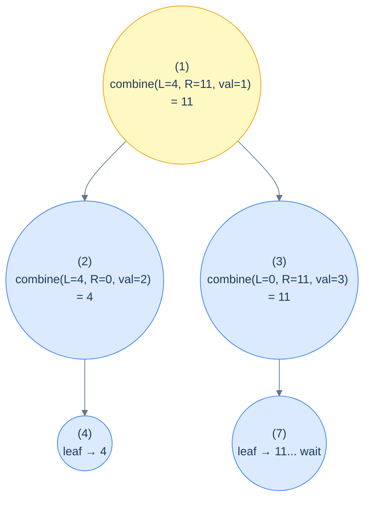
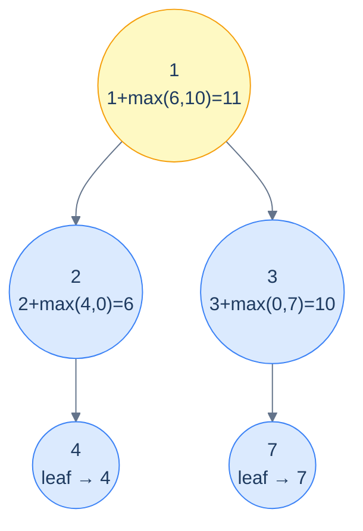
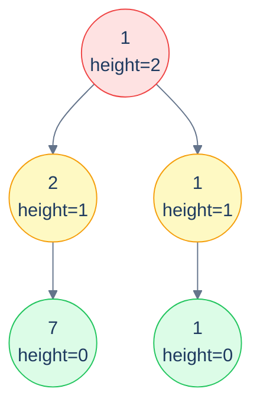

# 10. Pattern: Postorder Traversal (Stateless)

## The Hook

The preorder patterns from the last two lessons handed information *down* the tree — parent computes, children inherit. But there's a whole class of problems where the question runs the *other* way: each node's answer can only be computed once it knows the answer for *both of its subtrees*. The height of a node? Max of the left and right subtree heights, plus one. The sum of values in a subtree? Sum of left + sum of right + node's own value. Whether a tree is a full binary tree? Both subtrees must themselves be full *and* the current node must have either zero or two children.

That dependency direction — *children answer first, then their parent combines* — is what postorder traversal is for. The recursive call descends to the leaves, leaves return their base-case answers, internal nodes combine those answers, and the root ends up with the final answer.

The **stateless** variant is the cleanest: each recursive call **returns** its subtree's answer, and the parent combines what comes back. No mutable state, no shared accumulator, no `void` helper that smuggles data through a side effect. Just `f(left) + f(right) + something(node)` — the recursive equation written directly.

This pattern is the bread-and-butter of binary-tree problems. *Every* "compute X for the whole tree" question — height, size, sum, max, balance check, structural validation, BST check, depth comparisons — fits this shape. Even the postorder *stateful* pattern in the next lesson is just an enhancement: it adds a side channel for problems where each subtree needs to report *more than one number* back to its parent.

This lesson establishes the recipe, the canonical six example problems (sum-of-leaves, height, max path sum, full-tree check, perfect-tree check, collect-leaves-by-height), and clean implementations for each in Python and Java.

---

## Table of contents

1. [The stateless postorder pattern](#the-stateless-postorder-pattern)
2. [How to recognise it](#how-to-recognise-it)
3. [Problem 1 — Sum of leaves](#problem-1--sum-of-leaves)
4. [Problem 2 — Height of a binary tree](#problem-2--height-of-a-binary-tree)
5. [Problem 3 — Maximum root-to-leaf path sum](#problem-3--maximum-root-to-leaf-path-sum)
6. [Problem 4 — Is it a full binary tree?](#problem-4--is-it-a-full-binary-tree)
7. [Problem 5 — Is it a perfect binary tree?](#problem-5--is-it-a-perfect-binary-tree)
8. [Problem 6 — Collect leaves by height](#problem-6--collect-leaves-by-height)

***

# The stateless postorder pattern

```text
postorder(node):
  if node is null: return baseCase                  # e.g. 0, -1, true, infinity
  leftAnswer  = postorder(node.left)
  rightAnswer = postorder(node.right)
  return combine(leftAnswer, rightAnswer, node.val) # the recurrence
```

The shape is identical for every postorder-stateless problem; only the `baseCase` and the `combine` change. Pick those two correctly and the entire algorithm writes itself.



<p align="center"><strong>Postorder data flow for max root-to-leaf path sum — leaves return their own value; each internal node returns <code>val + max(L, R)</code>; the root ends up with the answer. The arrows that <em>go down</em> are recursive calls; the values that <em>come up</em> are the returns. (Note: in the example, leaf 7 returns its own value 7, not 11; the node's own value adds at the parent.)</strong></p>

> **Why "stateless"?** No mutable state escapes a stack frame. Each call computes its return value purely from its children's return values and the local node — like a functional fold over the tree. Two calls on the same subtree would return the same thing; there's no global accumulator that could give different answers depending on visit order.

## Generic pattern

Below is a "sum of all node values" template — illustrative; substitute the right base case and combine for your problem.


```python run
from typing import Optional

class TreeNode:
    def __init__(self, val=0, left=None, right=None):
        self.val, self.left, self.right = val, left, right

def stateless_postorder(node: Optional[TreeNode]) -> int:
    if node is None: return 0                      # base case
    left  = stateless_postorder(node.left)
    right = stateless_postorder(node.right)
    return left + right + node.val                 # combine
```

```java run
static int statelessPostorder(TreeNode node) {
    if (node == null) return 0;
    int left  = statelessPostorder(node.left);
    int right = statelessPostorder(node.right);
    return left + right + node.val;
}
```


## Complexity

> **Time:** O(N) — each node visited once. **Space:** O(h) for the recursion stack.

***

# How to recognise it

The pattern fits when:

- The answer for any subtree can be **computed solely from the answers of its two subtrees** (and the current node's own value).
- The whole-tree answer is the answer at the root.

Concrete cues:

- *"Find the height / depth / size of the tree"* — recurrence on subtree heights/sizes.
- *"Sum / max / min over all nodes / leaves / paths"* — fold over the tree.
- *"Is the tree balanced / full / perfect / a BST?"* — structural validation, both subtrees must satisfy a property *and* the current node fits.
- *"Compute X for every subtree"* — same shape, just record the answer at every node.

Anti-pattern: if the answer depends on the *path from the root* to a node (info from above), use a preorder pattern instead. If sibling subtrees need to report multiple values back (e.g., "the longest path through this node, plus the longest path entirely within this subtree"), you want the *stateful* postorder pattern (next lesson).

***

# Problem 1 — Sum of leaves

> Given the root, compute the sum of all leaf node values.

Base case: empty tree contributes 0. Leaf returns its own value. Internal node returns `sumOfLeaves(left) + sumOfLeaves(right)` — the node's own value doesn't enter (it's not a leaf).

<details>
<summary><h2>Solution</h2></summary>


```python run
from typing import List, Optional

class TreeNode:
    def __init__(self, val=0, left=None, right=None):
        self.val = val
        self.left = left
        self.right = right


def from_level_order(values):
    """Build tree from list like [1, 2, 3, None, 4]. None means missing child."""
    if not values:
        return None
    root = TreeNode(values[0])
    queue = [root]
    i = 1
    while queue and i < len(values):
        node = queue.pop(0)
        if i < len(values) and values[i] is not None:
            node.left = TreeNode(values[i])
            queue.append(node.left)
        i += 1
        if i < len(values) and values[i] is not None:
            node.right = TreeNode(values[i])
            queue.append(node.right)
        i += 1
    return root


class Solution:
    def sum_of_leaves(self, root: Optional[TreeNode]) -> int:

        # Base case: if the tree is empty
        if not root:
            return 0

        # If it's a leaf node, return its value
        if not root.left and not root.right:
            return root.val

        # Recursively sum up leaf nodes in left and right subtrees
        left_sum = self.sum_of_leaves(root.left)
        right_sum = self.sum_of_leaves(root.right)

        # Return the sum of leaf nodes in left and right subtrees
        return left_sum + right_sum


# Examples from the problem statement
print(Solution().sum_of_leaves(from_level_order([1, 2, 5, 7, None, None, 3])))  # 10
print(Solution().sum_of_leaves(from_level_order([1, 8, 4, None, None, 9, 7])))  # 24

# Edge cases
print(Solution().sum_of_leaves(None))                                             # 0
print(Solution().sum_of_leaves(from_level_order([7])))                            # 7
print(Solution().sum_of_leaves(from_level_order([1, 2, None, 3])))                # 3 (left-skew)
print(Solution().sum_of_leaves(from_level_order([1, None, 2, None, 3])))          # 3 (right-skew)
print(Solution().sum_of_leaves(from_level_order([1, 2, 3, 4, 5, 6, 7])))         # 22
```

```java run
import java.util.*;

public class Main {
    static class TreeNode {
        int val;
        TreeNode left;
        TreeNode right;
        TreeNode() {}
        TreeNode(int val) { this.val = val; }
    }

    static TreeNode fromLevelOrder(Integer... values) {
        if (values.length == 0 || values[0] == null) return null;
        TreeNode root = new TreeNode(values[0]);
        java.util.Deque<TreeNode> queue = new java.util.ArrayDeque<>();
        queue.add(root);
        int i = 1;
        while (!queue.isEmpty() && i < values.length) {
            TreeNode node = queue.poll();
            if (i < values.length && values[i] != null) {
                node.left = new TreeNode(values[i]);
                queue.add(node.left);
            }
            i++;
            if (i < values.length && values[i] != null) {
                node.right = new TreeNode(values[i]);
                queue.add(node.right);
            }
            i++;
        }
        return root;
    }

    static class Solution {
        public int sumOfLeaves(TreeNode root) {

            // Base case: if the tree is empty
            if (root == null) {
                return 0;
            }

            // If it's a leaf node, return its value
            if (root.left == null && root.right == null) {
                return root.val;
            }

            // Recursively sum up leaf nodes in left and right subtrees
            int leftSum = sumOfLeaves(root.left);
            int rightSum = sumOfLeaves(root.right);

            // Return the sum of leaf nodes in left and right subtrees
            return leftSum + rightSum;
        }
    }

    public static void main(String[] args) {
        // Examples from the problem statement
        System.out.println(new Solution().sumOfLeaves(fromLevelOrder(1, 2, 5, 7, null, null, 3)));  // 10
        System.out.println(new Solution().sumOfLeaves(fromLevelOrder(1, 8, 4, null, null, 9, 7)));  // 24

        // Edge cases
        System.out.println(new Solution().sumOfLeaves(null));                                        // 0
        System.out.println(new Solution().sumOfLeaves(fromLevelOrder(7)));                           // 7
        System.out.println(new Solution().sumOfLeaves(fromLevelOrder(1, 2, null, 3)));               // 3 (left-skew)
        System.out.println(new Solution().sumOfLeaves(fromLevelOrder(1, null, 2, null, 3)));         // 3 (right-skew)
        System.out.println(new Solution().sumOfLeaves(fromLevelOrder(1, 2, 3, 4, 5, 6, 7)));        // 22
    }
}
```

</details>


***

# Problem 2 — Height of a binary tree

> Compute the height of the tree (number of nodes along the longest root-to-leaf path).

Base case: empty tree has height 0 (under the *node-counting* convention used in this problem). Each internal node returns `max(height(left), height(right)) + 1`. The root's answer is the tree's height.

> **Note on conventions:** This problem uses the *node-counting* convention (empty = 0, single node = 1). Lesson 1 used the *edge-counting* convention (empty = -1, single node = 0). Both are common; *always read the problem carefully* and pick base cases that make the recurrence consistent.

<details>
<summary><h2>Solution</h2></summary>


```python run
from typing import Optional

class TreeNode:
    def __init__(self, val=0, left=None, right=None):
        self.val = val
        self.left = left
        self.right = right


def from_level_order(values):
    """Build tree from list like [1, 2, 3, None, 4]. None means missing child."""
    if not values:
        return None
    root = TreeNode(values[0])
    queue = [root]
    i = 1
    while queue and i < len(values):
        node = queue.pop(0)
        if i < len(values) and values[i] is not None:
            node.left = TreeNode(values[i])
            queue.append(node.left)
        i += 1
        if i < len(values) and values[i] is not None:
            node.right = TreeNode(values[i])
            queue.append(node.right)
        i += 1
    return root


class Solution:
    def height_of_binary_tree(self, root: Optional[TreeNode]) -> int:

        # Empty tree has height 0
        if root is None:
            return 0

        # Recursively calculate the height of the left and right subtrees
        left_height = self.height_of_binary_tree(root.left)
        right_height = self.height_of_binary_tree(root.right)

        # Return the maximum height among the left and right subtrees
        # plus 1 for the current node
        return max(left_height, right_height) + 1


# Examples from the problem statement
print(Solution().height_of_binary_tree(from_level_order([1, 2, 3, 4, None, None, 7])))  # 3
print(Solution().height_of_binary_tree(from_level_order([1, 8, 4, None, None, 2, 7])))  # 3

# Edge cases
print(Solution().height_of_binary_tree(None))                                            # 0
print(Solution().height_of_binary_tree(from_level_order([5])))                           # 1
print(Solution().height_of_binary_tree(from_level_order([1, 2, None, 3])))               # 3 (left-skew)
print(Solution().height_of_binary_tree(from_level_order([1, None, 2, None, 3])))         # 3 (right-skew)
print(Solution().height_of_binary_tree(from_level_order([1, 2, 3, 4, 5, 6, 7])))        # 3 (balanced)
print(Solution().height_of_binary_tree(from_level_order([1, 2])))                        # 2
```

```java run
import java.util.*;

public class Main {
    static class TreeNode {
        int val;
        TreeNode left;
        TreeNode right;
        TreeNode() {}
        TreeNode(int val) { this.val = val; }
    }

    static TreeNode fromLevelOrder(Integer... values) {
        if (values.length == 0 || values[0] == null) return null;
        TreeNode root = new TreeNode(values[0]);
        java.util.Deque<TreeNode> queue = new java.util.ArrayDeque<>();
        queue.add(root);
        int i = 1;
        while (!queue.isEmpty() && i < values.length) {
            TreeNode node = queue.poll();
            if (i < values.length && values[i] != null) {
                node.left = new TreeNode(values[i]);
                queue.add(node.left);
            }
            i++;
            if (i < values.length && values[i] != null) {
                node.right = new TreeNode(values[i]);
                queue.add(node.right);
            }
            i++;
        }
        return root;
    }

    static class Solution {
        public int heightOfBinaryTree(TreeNode root) {

            // Empty tree has height 0
            if (root == null) {
                return 0;
            }

            // Recursively calculate the height of the left and right
            // subtrees
            int leftHeight = heightOfBinaryTree(root.left);
            int rightHeight = heightOfBinaryTree(root.right);

            // Return the maximum height among the left and right subtrees
            // plus 1 for the current node
            return Math.max(leftHeight, rightHeight) + 1;
        }
    }

    public static void main(String[] args) {
        // Examples from the problem statement
        System.out.println(new Solution().heightOfBinaryTree(fromLevelOrder(1, 2, 3, 4, null, null, 7)));  // 3
        System.out.println(new Solution().heightOfBinaryTree(fromLevelOrder(1, 8, 4, null, null, 2, 7)));  // 3

        // Edge cases
        System.out.println(new Solution().heightOfBinaryTree(null));                                        // 0
        System.out.println(new Solution().heightOfBinaryTree(fromLevelOrder(5)));                           // 1
        System.out.println(new Solution().heightOfBinaryTree(fromLevelOrder(1, 2, null, 3)));               // 3 (left-skew)
        System.out.println(new Solution().heightOfBinaryTree(fromLevelOrder(1, null, 2, null, 3)));         // 3 (right-skew)
        System.out.println(new Solution().heightOfBinaryTree(fromLevelOrder(1, 2, 3, 4, 5, 6, 7)));        // 3 (balanced)
        System.out.println(new Solution().heightOfBinaryTree(fromLevelOrder(1, 2)));                        // 2
    }
}
```

</details>


***

# Problem 3 — Maximum root-to-leaf path sum

> Compute the largest sum among all root-to-leaf paths.

Base case: empty tree contributes 0 (so the recursion at a single-child node still works). Leaf returns its own value. Internal node returns `node.val + max(maxPathSum(left), maxPathSum(right))`.



<p align="center"><strong>Max path sum — each node returns <em>its own value plus the better of the two subtree answers</em>. Empty subtrees contribute 0; the recursion bubbles the maximum up to the root.</strong></p>

<details>
<summary><h2>Solution</h2></summary>


```python run
from typing import Optional

class TreeNode:
    def __init__(self, val=0, left=None, right=None):
        self.val = val
        self.left = left
        self.right = right


def from_level_order(values):
    """Build tree from list like [1, 2, 3, None, 4]. None means missing child."""
    if not values:
        return None
    root = TreeNode(values[0])
    queue = [root]
    i = 1
    while queue and i < len(values):
        node = queue.pop(0)
        if i < len(values) and values[i] is not None:
            node.left = TreeNode(values[i])
            queue.append(node.left)
        i += 1
        if i < len(values) and values[i] is not None:
            node.right = TreeNode(values[i])
            queue.append(node.right)
        i += 1
    return root


class Solution:
    def maximum_path_sum(self, root: Optional[TreeNode]) -> int:
        if root is None:

            # Empty tree
            return 0

        # Recursive calls to calculate the maximum sum of left and
        # right subtrees
        left_sum: int = self.maximum_path_sum(root.left)
        right_sum: int = self.maximum_path_sum(root.right)

        # Return the maximum sum of root-to-leaf paths
        return root.val + max(left_sum, right_sum)


# Examples from the problem statement
print(Solution().maximum_path_sum(from_level_order([1, 2, 3, 4, None, None, 7])))  # 11
print(Solution().maximum_path_sum(from_level_order([1, 8, 4, None, None, 2, 7])))  # 12

# Edge cases
print(Solution().maximum_path_sum(None))                                             # 0
print(Solution().maximum_path_sum(from_level_order([5])))                            # 5
print(Solution().maximum_path_sum(from_level_order([1, 2, None, 3])))                # 6 (left-skew)
print(Solution().maximum_path_sum(from_level_order([1, None, 2, None, 3])))          # 6 (right-skew)
print(Solution().maximum_path_sum(from_level_order([1, 2, 3])))                      # 4
print(Solution().maximum_path_sum(from_level_order([10, 5, 20, 3, 7])))              # 30
```

```java run
import java.util.*;

public class Main {
    static class TreeNode {
        int val;
        TreeNode left;
        TreeNode right;
        TreeNode() {}
        TreeNode(int val) { this.val = val; }
    }

    static TreeNode fromLevelOrder(Integer... values) {
        if (values.length == 0 || values[0] == null) return null;
        TreeNode root = new TreeNode(values[0]);
        java.util.Deque<TreeNode> queue = new java.util.ArrayDeque<>();
        queue.add(root);
        int i = 1;
        while (!queue.isEmpty() && i < values.length) {
            TreeNode node = queue.poll();
            if (i < values.length && values[i] != null) {
                node.left = new TreeNode(values[i]);
                queue.add(node.left);
            }
            i++;
            if (i < values.length && values[i] != null) {
                node.right = new TreeNode(values[i]);
                queue.add(node.right);
            }
            i++;
        }
        return root;
    }

    static class Solution {
        public int maximumPathSum(TreeNode root) {

            // Empty tree
            if (root == null) {
                return 0;
            }

            // Recursive calls to calculate the maximum sum of left and
            // right subtrees
            int leftSum = maximumPathSum(root.left);
            int rightSum = maximumPathSum(root.right);

            // Return the maximum sum of root-to-leaf paths
            return root.val + Math.max(leftSum, rightSum);
        }
    }

    public static void main(String[] args) {
        // Examples from the problem statement
        System.out.println(new Solution().maximumPathSum(fromLevelOrder(1, 2, 3, 4, null, null, 7)));  // 11
        System.out.println(new Solution().maximumPathSum(fromLevelOrder(1, 8, 4, null, null, 2, 7)));  // 12

        // Edge cases
        System.out.println(new Solution().maximumPathSum(null));                                        // 0
        System.out.println(new Solution().maximumPathSum(fromLevelOrder(5)));                           // 5
        System.out.println(new Solution().maximumPathSum(fromLevelOrder(1, 2, null, 3)));               // 6 (left-skew)
        System.out.println(new Solution().maximumPathSum(fromLevelOrder(1, null, 2, null, 3)));         // 6 (right-skew)
        System.out.println(new Solution().maximumPathSum(fromLevelOrder(1, 2, 3)));                     // 4
        System.out.println(new Solution().maximumPathSum(fromLevelOrder(10, 5, 20, 3, 7)));             // 30
    }
}
```

</details>


***

# Problem 4 — Is it a full binary tree?

> Return `true` iff every node has either zero or two children.

Three cases at each node:

- Empty tree → vacuously full → `true`.
- Leaf (both children null) → full → `true`.
- Exactly one child null → *not* full → `false`.
- Both children present → recurse and require both subtrees full.

<details>
<summary><h2>Solution</h2></summary>


```python run
from typing import Optional

class TreeNode:
    def __init__(self, val=0, left=None, right=None):
        self.val = val
        self.left = left
        self.right = right


def from_level_order(values):
    """Build tree from list like [1, 2, 3, None, 4]. None means missing child."""
    if not values:
        return None
    root = TreeNode(values[0])
    queue = [root]
    i = 1
    while queue and i < len(values):
        node = queue.pop(0)
        if i < len(values) and values[i] is not None:
            node.left = TreeNode(values[i])
            queue.append(node.left)
        i += 1
        if i < len(values) and values[i] is not None:
            node.right = TreeNode(values[i])
            queue.append(node.right)
        i += 1
    return root


class Solution:
    def full_binary_tree(self, root: Optional[TreeNode]) -> bool:

        # An empty tree is a full binary tree
        if not root:
            return True

        # A node with no children is a full binary tree
        if not root.left and not root.right:
            return True

        # A node with only one child is not a full binary tree
        if not root.left or not root.right:
            return False

        # Check if the left and right subtrees are also full binary trees
        is_subtree_left_full = self.full_binary_tree(root.left)
        is_subtree_right_full = self.full_binary_tree(root.right)

        # Return true if both subtrees are full binary trees
        return is_subtree_left_full and is_subtree_right_full


# Examples from the problem statement
print(Solution().full_binary_tree(from_level_order([1, 2, 3, None, None, 2])))     # False
print(Solution().full_binary_tree(from_level_order([1, 8, 4, None, None, 3, 5])))  # True

# Edge cases
print(Solution().full_binary_tree(None))                                             # True
print(Solution().full_binary_tree(from_level_order([5])))                            # True
print(Solution().full_binary_tree(from_level_order([1, 2, 3])))                      # True
print(Solution().full_binary_tree(from_level_order([1, 2, None])))                   # False (only left child)
print(Solution().full_binary_tree(from_level_order([1, 2, 3, 4, 5, 6, 7])))         # True (perfect)
print(Solution().full_binary_tree(from_level_order([1, 2, 3, 4, 5])))               # False (node 3 has no children)
```

```java run
import java.util.*;

public class Main {
    static class TreeNode {
        int val;
        TreeNode left;
        TreeNode right;
        TreeNode() {}
        TreeNode(int val) { this.val = val; }
    }

    static TreeNode fromLevelOrder(Integer... values) {
        if (values.length == 0 || values[0] == null) return null;
        TreeNode root = new TreeNode(values[0]);
        java.util.Deque<TreeNode> queue = new java.util.ArrayDeque<>();
        queue.add(root);
        int i = 1;
        while (!queue.isEmpty() && i < values.length) {
            TreeNode node = queue.poll();
            if (i < values.length && values[i] != null) {
                node.left = new TreeNode(values[i]);
                queue.add(node.left);
            }
            i++;
            if (i < values.length && values[i] != null) {
                node.right = new TreeNode(values[i]);
                queue.add(node.right);
            }
            i++;
        }
        return root;
    }

    static class Solution {
        public boolean fullBinaryTree(TreeNode root) {

            // An empty tree is a full binary tree
            if (root == null) {
                return true;
            }

            // A node with no children is a full binary tree
            if (root.left == null && root.right == null) {
                return true;
            }

            // A node with only one child is not a full binary tree
            if (root.left == null || root.right == null) {
                return false;
            }

            // Check if the left and right subtrees are also full binary
            // trees
            boolean isLeftSubtreeFull = fullBinaryTree(root.left);
            boolean isRightSubtreeFull = fullBinaryTree(root.right);

            // Return true if both subtrees are full binary trees
            return isLeftSubtreeFull && isRightSubtreeFull;
        }
    }

    public static void main(String[] args) {
        // Examples from the problem statement
        System.out.println(new Solution().fullBinaryTree(fromLevelOrder(1, 2, 3, null, null, 2)));     // false
        System.out.println(new Solution().fullBinaryTree(fromLevelOrder(1, 8, 4, null, null, 3, 5)));  // true

        // Edge cases
        System.out.println(new Solution().fullBinaryTree(null));                                        // true
        System.out.println(new Solution().fullBinaryTree(fromLevelOrder(5)));                           // true
        System.out.println(new Solution().fullBinaryTree(fromLevelOrder(1, 2, 3)));                     // true
        System.out.println(new Solution().fullBinaryTree(fromLevelOrder(1, 2, null)));                  // false (only left child)
        System.out.println(new Solution().fullBinaryTree(fromLevelOrder(1, 2, 3, 4, 5, 6, 7)));        // true (perfect)
        System.out.println(new Solution().fullBinaryTree(fromLevelOrder(1, 2, 3, 4, 5)));              // false (node 3 has no children)
    }
}
```

</details>


***

# Problem 5 — Is it a perfect binary tree?

> Return `true` iff every internal node has two children **and** every leaf is at the same depth.

A clean two-pass approach:

1. Find the depth of the leftmost leaf — that's where every leaf must sit.
2. Recursively check: every leaf is at that depth; every internal node has two children.

A one-pass approach also exists (return both `(isPerfect, height)` from each call), but that's the *stateful* postorder pattern from the next lesson. The two-pass version below is pure stateless.

<details>
<summary><h2>Solution</h2></summary>


```python run
from typing import Optional

class TreeNode:
    def __init__(self, val=0, left=None, right=None):
        self.val = val
        self.left = left
        self.right = right


def from_level_order(values):
    """Build tree from list like [1, 2, 3, None, 4]. None means missing child."""
    if not values:
        return None
    root = TreeNode(values[0])
    queue = [root]
    i = 1
    while queue and i < len(values):
        node = queue.pop(0)
        if i < len(values) and values[i] is not None:
            node.left = TreeNode(values[i])
            queue.append(node.left)
        i += 1
        if i < len(values) and values[i] is not None:
            node.right = TreeNode(values[i])
            queue.append(node.right)
        i += 1
    return root


class Solution:
    def find_depth(self, root: Optional[TreeNode]) -> int:
        depth = 0
        while root:
            depth += 1
            root = root.left
        return depth

    def is_perfect_binary_tree(
        self, root: Optional[TreeNode], depth: int, level: int
    ) -> bool:

        # An empty tree is a perfect binary tree
        if not root:
            return True

        # If it is a leaf node, check if it is at the correct depth
        if not root.left and not root.right:
            return depth == level + 1

        # If an internal node has only one child, it's not a perfect
        # binary tree
        if not root.left or not root.right:
            return False

        # Recursively check the left and right subtrees
        is_left_subtree_perfect = self.is_perfect_binary_tree(
            root.left, depth, level + 1
        )
        is_right_subtree_perfect = self.is_perfect_binary_tree(
            root.right, depth, level + 1
        )

        # Return true if both subtrees are perfect
        return is_left_subtree_perfect and is_right_subtree_perfect

    def perfect_binary_tree(self, root: Optional[TreeNode]) -> bool:

        # An empty tree is a perfect binary tree
        if not root:
            return True

        # Find the depth of the leftmost leaf
        depth = self.find_depth(root)

        # Check if the tree is perfect
        return self.is_perfect_binary_tree(root, depth, 0)


# Examples from the problem statement
print(Solution().perfect_binary_tree(from_level_order([1, 2, 3, 4, None, None, 7])))  # False
print(Solution().perfect_binary_tree(from_level_order([1, 8, 4, 3, 5, 2, 7])))        # True

# Edge cases
print(Solution().perfect_binary_tree(None))                                             # True
print(Solution().perfect_binary_tree(from_level_order([5])))                            # True
print(Solution().perfect_binary_tree(from_level_order([1, 2, 3])))                      # True
print(Solution().perfect_binary_tree(from_level_order([1, 2, None])))                   # False (only left)
print(Solution().perfect_binary_tree(from_level_order([1, 2, 3, 4, 5, 6, 7])))         # True
print(Solution().perfect_binary_tree(from_level_order([1, 2, 3, 4, 5])))               # False (unequal leaves)
```

```java run
import java.util.*;

public class Main {
    static class TreeNode {
        int val;
        TreeNode left;
        TreeNode right;
        TreeNode() {}
        TreeNode(int val) { this.val = val; }
    }

    static TreeNode fromLevelOrder(Integer... values) {
        if (values.length == 0 || values[0] == null) return null;
        TreeNode root = new TreeNode(values[0]);
        java.util.Deque<TreeNode> queue = new java.util.ArrayDeque<>();
        queue.add(root);
        int i = 1;
        while (!queue.isEmpty() && i < values.length) {
            TreeNode node = queue.poll();
            if (i < values.length && values[i] != null) {
                node.left = new TreeNode(values[i]);
                queue.add(node.left);
            }
            i++;
            if (i < values.length && values[i] != null) {
                node.right = new TreeNode(values[i]);
                queue.add(node.right);
            }
            i++;
        }
        return root;
    }

    static class Solution {
        private int findDepth(TreeNode root) {
            int depth = 0;
            while (root != null) {
                depth++;
                root = root.left;
            }
            return depth;
        }

        private boolean isPerfectBinaryTree(
            TreeNode root,
            int depth,
            int level
        ) {

            // An empty tree is a perfect binary tree
            if (root == null) {
                return true;
            }

            // If it is a leaf node, check if it is at the correct depth
            if (root.left == null && root.right == null) {
                return depth == level + 1;
            }

            // If an internal node has only one child, it's not a perfect
            // binary tree
            if (root.left == null || root.right == null) {
                return false;
            }

            // Recursively check the left and right subtrees
            boolean isLeftSubtreePerfect = isPerfectBinaryTree(
                root.left,
                depth,
                level + 1
            );
            boolean isRightSubtreePerfect = isPerfectBinaryTree(
                root.right,
                depth,
                level + 1
            );

            // Return true if both subtrees are perfect
            return isLeftSubtreePerfect && isRightSubtreePerfect;
        }

        public boolean perfectBinaryTree(TreeNode root) {

            // An empty tree is a perfect binary tree
            if (root == null) {
                return true;
            }

            // Find the depth of the leftmost leaf
            int depth = findDepth(root);

            // Check if the tree is perfect
            return isPerfectBinaryTree(root, depth, 0);
        }
    }

    public static void main(String[] args) {
        // Examples from the problem statement
        System.out.println(new Solution().perfectBinaryTree(fromLevelOrder(1, 2, 3, 4, null, null, 7)));  // false
        System.out.println(new Solution().perfectBinaryTree(fromLevelOrder(1, 8, 4, 3, 5, 2, 7)));        // true

        // Edge cases
        System.out.println(new Solution().perfectBinaryTree(null));                                        // true
        System.out.println(new Solution().perfectBinaryTree(fromLevelOrder(5)));                           // true
        System.out.println(new Solution().perfectBinaryTree(fromLevelOrder(1, 2, 3)));                     // true
        System.out.println(new Solution().perfectBinaryTree(fromLevelOrder(1, 2, null)));                  // false (only left)
        System.out.println(new Solution().perfectBinaryTree(fromLevelOrder(1, 2, 3, 4, 5, 6, 7)));        // true
        System.out.println(new Solution().perfectBinaryTree(fromLevelOrder(1, 2, 3, 4, 5)));              // false (unequal leaves)
    }
}
```

</details>


***

# Problem 6 — Collect leaves by height

> Iteratively peel off the leaves of the tree and collect them in a list of lists: first list = the original leaves, second list = the leaves *after* removing the first set, and so on, until the tree is empty.
>
> **Example:** `[1, 2, 1, 7, null, null, 1]` → `[[7, 1], [2, 1], [1]]`.

A clever postorder trick: each node has a *height* equal to `1 + max(leftHeight, rightHeight)` (with `null` having height -1). All nodes with height 0 are leaves, with height 1 they're "second wave" leaves (would-be leaves after the originals are peeled), and so on. So we run a single postorder, compute each node's height, and bucket the node into `out[height]`.



<p align="center"><strong>Collect leaves by height — every node ends up in the bucket matching its <em>height</em>. Bucket 0 is the originals; bucket 1 is the leaves after peeling; etc. One postorder pass and we're done.</strong></p>

<details>
<summary><h2>Solution</h2></summary>


```python run
from typing import List, Optional

class TreeNode:
    def __init__(self, val=0, left=None, right=None):
        self.val = val
        self.left = left
        self.right = right


def from_level_order(values):
    """Build tree from list like [1, 2, 3, None, 4]. None means missing child."""
    if not values:
        return None
    root = TreeNode(values[0])
    queue = [root]
    i = 1
    while queue and i < len(values):
        node = queue.pop(0)
        if i < len(values) and values[i] is not None:
            node.left = TreeNode(values[i])
            queue.append(node.left)
        i += 1
        if i < len(values) and values[i] is not None:
            node.right = TreeNode(values[i])
            queue.append(node.right)
        i += 1
    return root


class Solution:
    def find_height(
        self, root: Optional[TreeNode], result: List[List[int]]
    ) -> int:

        # If root is null, return -1.
        if not root:
            return -1

        # Recursively find the height of the left and right subtrees.
        left_height = self.find_height(root.left, result)
        right_height = self.find_height(root.right, result)

        # Calculate the height of the current node.
        height = max(left_height, right_height) + 1

        # If the result list's size is less than or equal to the
        # height of the node, add a new empty list to the result list.
        if len(result) <= height:
            result.append([])

        # Add the current node's value to the list at the current node's
        # height.
        result[height].append(root.val)

        # Return the height of the current node.
        return height

    def collect_leaves(
        self, root: Optional[TreeNode]
    ) -> List[List[int]]:

        # List of lists to store leaf nodes at each height.
        result: List[List[int]] = []

        # Find the height of the tree and collect leaf nodes.
        self.find_height(root, result)

        # Return result list.
        return result


# Examples from the problem statement
print(Solution().collect_leaves(from_level_order([1, 2, 1, 7, None, None, 1])))  # [[7, 1], [2, 1], [1]]
print(Solution().collect_leaves(from_level_order([1, 6, 5, None, None, 2, 7])))  # [[6, 2, 7], [5], [1]]

# Edge cases
print(Solution().collect_leaves(None))                                             # []
print(Solution().collect_leaves(from_level_order([5])))                            # [[5]]
print(Solution().collect_leaves(from_level_order([1, 2, None, 3])))                # [[3], [2], [1]] (left-skew)
print(Solution().collect_leaves(from_level_order([1, None, 2, None, 3])))          # [[3], [2], [1]] (right-skew)
print(Solution().collect_leaves(from_level_order([1, 2, 3])))                      # [[2, 3], [1]]
print(Solution().collect_leaves(from_level_order([1, 2, 3, 4, 5, 6, 7])))         # [[4, 5, 6, 7], [2, 3], [1]]
```

```java run
import java.util.*;

public class Main {
    static class TreeNode {
        int val;
        TreeNode left;
        TreeNode right;
        TreeNode() {}
        TreeNode(int val) { this.val = val; }
    }

    static TreeNode fromLevelOrder(Integer... values) {
        if (values.length == 0 || values[0] == null) return null;
        TreeNode root = new TreeNode(values[0]);
        java.util.Deque<TreeNode> queue = new java.util.ArrayDeque<>();
        queue.add(root);
        int i = 1;
        while (!queue.isEmpty() && i < values.length) {
            TreeNode node = queue.poll();
            if (i < values.length && values[i] != null) {
                node.left = new TreeNode(values[i]);
                queue.add(node.left);
            }
            i++;
            if (i < values.length && values[i] != null) {
                node.right = new TreeNode(values[i]);
                queue.add(node.right);
            }
            i++;
        }
        return root;
    }

    static class Solution {
        private int findHeight(TreeNode root, List<List<Integer>> result) {

            // If root is null, return -1.
            if (root == null) {
                return -1;
            }

            // Recursively find the height of the left and right subtrees.
            int leftHeight = findHeight(root.left, result);
            int rightHeight = findHeight(root.right, result);

            // Calculate the height of the current node.
            int height = Math.max(leftHeight, rightHeight) + 1;

            // If the result list's size is less than or equal to the
            // height of the node, add a new empty list to the result list.
            if (result.size() <= height) {
                result.add(new ArrayList<>());
            }

            // Add the current node's value to the list at the current node's
            // height.
            result.get(height).add(root.val);

            // Return the height of the current node.
            return height;
        }

        public List<List<Integer>> collectLeaves(TreeNode root) {

            // List of lists to store leaf nodes at each height.
            List<List<Integer>> result = new ArrayList<>();

            // Find the height of the tree and collect leaf nodes.
            findHeight(root, result);

            // Return result list.
            return result;
        }
    }

    public static void main(String[] args) {
        // Examples from the problem statement
        System.out.println(new Solution().collectLeaves(fromLevelOrder(1, 2, 1, 7, null, null, 1)));  // [[7, 1], [2, 1], [1]]
        System.out.println(new Solution().collectLeaves(fromLevelOrder(1, 6, 5, null, null, 2, 7)));  // [[6, 2, 7], [5], [1]]

        // Edge cases
        System.out.println(new Solution().collectLeaves(null));                                        // []
        System.out.println(new Solution().collectLeaves(fromLevelOrder(5)));                           // [[5]]
        System.out.println(new Solution().collectLeaves(fromLevelOrder(1, 2, null, 3)));               // [[3], [2], [1]] (left-skew)
        System.out.println(new Solution().collectLeaves(fromLevelOrder(1, null, 2, null, 3)));         // [[3], [2], [1]] (right-skew)
        System.out.println(new Solution().collectLeaves(fromLevelOrder(1, 2, 3)));                     // [[2, 3], [1]]
        System.out.println(new Solution().collectLeaves(fromLevelOrder(1, 2, 3, 4, 5, 6, 7)));        // [[4, 5, 6, 7], [2, 3], [1]]
    }
}
```

</details>
<details>
<summary><h2>Final Takeaway</h2></summary>


Stateless postorder is the most-used pattern in the chapter. Three things to walk away with:

1. **`baseCase` + `combine` is the entire algorithm.** Every problem reduces to choosing those two correctly. Once you've internalised the shape, you stop *reading* the algorithm and start *writing* it directly from the problem statement.
2. **The recurrence is the spec.** `f(node) = combine(f(left), f(right), node.val)`. If you can write the recurrence on paper, you've already written the program — the implementation is a five-line transcription. Practice writing the recurrence *first*; the code follows mechanically.
3. **Empty-tree base case is where the off-by-one bugs live.** Choose your base case to make the recurrence *uniformly applicable* — height of an empty tree is 0 (or -1, depending on convention), sum is 0, max is `-∞`, count is 0, "is a valid X" is `true`. Pick the one that makes the combine work cleanly without special-casing leaves.

> *Coming up — the <strong>stateful</strong> postorder pattern. When a single returned value isn't enough — for instance when each subtree must report both <em>"the longest path entirely within me"</em> AND <em>"the longest path from my root downward"</em> — we either return tuples or thread a shared best-so-far through the recursion. That covers diameter, longest monotonic path, distribute-coins, frequent-subtree-sums, and many more "two answers per call" problems.*

</details>