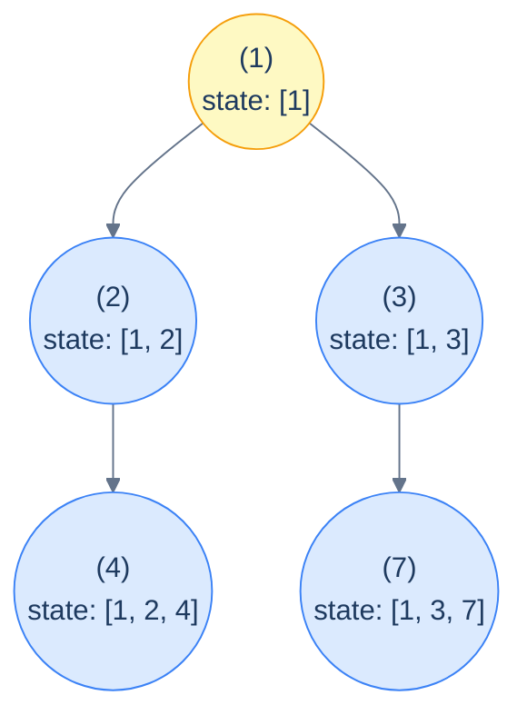

# The stateful preorder pattern

The core idea — *mutate then undo*:

```text
preorder(node, sharedState):
  if node is null: return
  push(sharedState, node)              # add this node's contribution
  process(node, sharedState)
  preorder(node.left,  sharedState)
  preorder(node.right, sharedState)
  pop(sharedState, node)               # remove this node's contribution
```

The push and pop bracket the recursive calls. While we're inside the recursion for `node`'s descendants, the shared state contains exactly the path from the root to (and including) `node`. When we return from `node`, the state is restored to what it was when we *entered* `node` — which is what its parent's *other* child needs to see.

> 🖼 Diagram — The shared state during a stateful preorder — at every node, the state contains exactly the values on the root-to-node path, no siblings, no extras. The push happens at entry; the pop happens at exit; the state is correct at every moment.


<p align="center"><strong>The shared state during a stateful preorder — at every node, the state contains <em>exactly</em> the values on the root-to-node path, no siblings, no extras. The push happens at entry; the pop happens at exit; the state is correct at every moment.</strong></p>

> *Predict before reading on — what happens if you forget the pop?*
>
> The state would *accumulate* across siblings — so after the recursion finishes node `2`'s subtree, when control moves to node `3`, the state would still contain `2` and `4` from the previous subtree's contributions. Sibling pollution. Forgetting the pop is the #1 bug in beginner backtracking code; if your solution gives wildly wrong answers on multi-branch trees but works on lopsided ones, the missing pop is almost always the culprit.

## Three flavours of state

Not every "stateful" problem needs an explicit push/pop. Here are the three shapes you'll see:

1. **Push-pop collection** (`Duplicates in path` below). The state is a list, set, or multimap. Push on entry, pop on exit. *Must* pop or sibling subtrees see each other.
2. **Monotone witnesses** (`Second minimum` below). The state is one or more scalars that *only ever increase or decrease*. No pop needed — once we've seen a smaller value somewhere, that fact is fine to keep when we move on. The state is genuinely shared and write-only-when-improved.
3. **Visit-order witnesses** (`Left view`, `Right view` below). No collection at all — just a counter that tracks *how deep we've drilled so far*. The "state" is implicit in the recursion's visit order; we exploit the fact that the *first* node visited at each new depth is the one we want.

The same pattern label applies to all three because they share the structural feature: *one shared mutable object that is read and updated as the recursion proceeds*. The mechanics of update vary; the spirit doesn't.

## Generic pattern

We'll show the **push-pop** flavour as the canonical generic — it's the strictest and the one most likely to bite you. The other two flavours are simpler restrictions of this template.


```python run viz=binary-tree viz-root=root
from typing import List, Optional

class TreeNode:
    def __init__(self, val=0, left=None, right=None):
        self.val, self.left, self.right = val, left, right

def stateful_preorder(root: Optional[TreeNode]):
    state: List[int] = []                       # shared collection
    def go(node):
        if node is None: return
        state.append(node.val)                  # push
        # ... use state to process node ...
        go(node.left)
        go(node.right)
        state.pop()                             # pop
    go(root)
```

```java run viz=binary-tree viz-root=root
static List<Integer> state;
static void statefulPreorderHelper(TreeNode node) {
    if (node == null) return;
    state.add(node.val);                        // push
    // process...
    statefulPreorderHelper(node.left);
    statefulPreorderHelper(node.right);
    state.remove(state.size() - 1);             // pop
}
public static void statefulPreorder(TreeNode root) {
    state = new ArrayList<>();
    statefulPreorderHelper(root);
}
```


## Complexity

> **Time:** O(N) for the traversal, plus whatever per-node work the `process` step does. Push/pop on a list/array are O(1) amortised. **Space:** O(h) for both the recursion and the path-sized state.

# How to recognise it

A problem fits this pattern when:

- The answer at each node depends on the **set or sequence of values on its path from the root** (not just an aggregate like a sum), *and*
- That set/sequence is too large or unwieldy to copy down at every call.

Concrete cues to look for:

- *"Find nodes whose ancestor sequence contains …"* — push-pop set/map
- *"Find the smallest / second-smallest / k-th smallest / max / max-so-far"* — monotone witnesses
- *"Return the leftmost / rightmost / first / topmost node at each level"* — visit-order witnesses
- *"Detect a cycle / repetition / pattern in the ancestry"* — push-pop set/map again

Anti-pattern: if the state really is just a number you're aggregating, use the *stateless* version (previous lesson). Don't reach for push-pop when an integer parameter would do.

<!-- ============================================== -->
<!-- SWEEP 2 — missing sections (placeholders only) -->
<!-- ============================================== -->

<!-- TODO: Understanding the Pattern — missing, needs to be written -->
<!--       Guidance: umbrella H2 with the subsections below -->

<!-- TODO: Why Naive Isn't Enough — missing, needs to be written -->
<!--       Guidance: motivation for why the obvious approach fails -->

<!-- TODO: The Core Idea — missing, needs to be written -->
<!--       Guidance: one paragraph: the central trick -->

<!-- TODO: How the Pointers/Window Move — missing, needs to be written -->
<!--       Guidance: mechanics of the moving parts -->

<!-- TODO: The Generic Algorithm — missing, needs to be written -->
<!--       Guidance: numbered steps, no code -->

<!-- TODO: Generic Implementation — missing, needs to be written -->
<!--       Guidance: Python block + Java block of the skeleton -->

<!-- TODO: Complexity Analysis — missing, needs to be written -->
<!--       Guidance: table -->

<!-- TODO: Variants / Taxonomy — missing, needs to be written -->
<!--       Guidance: enumerate sub-shapes of this pattern -->

<!-- TODO: Identifying — missing, needs to be written -->
<!--       Guidance: per-variant: recognition checklist + canonical example -->

<!-- TODO: Recognition Checklist — missing, needs to be written -->
<!--       Guidance: 4-question diagnostic — the source of the Problem-section Diagnostic Questions -->

<!-- TODO: Canonical Example — missing, needs to be written -->
<!--       Guidance: fully worked example: brute force → optimised → template fit -->

<!-- TODO: Problems in This Category — missing, needs to be written -->
<!--       Guidance: table with links to the 02-problems/ files -->
